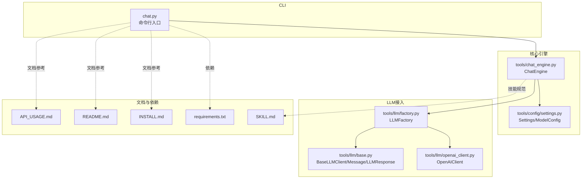
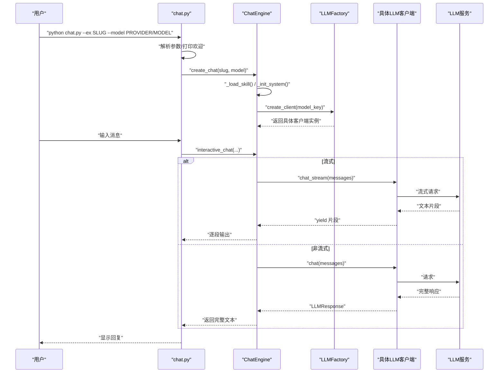
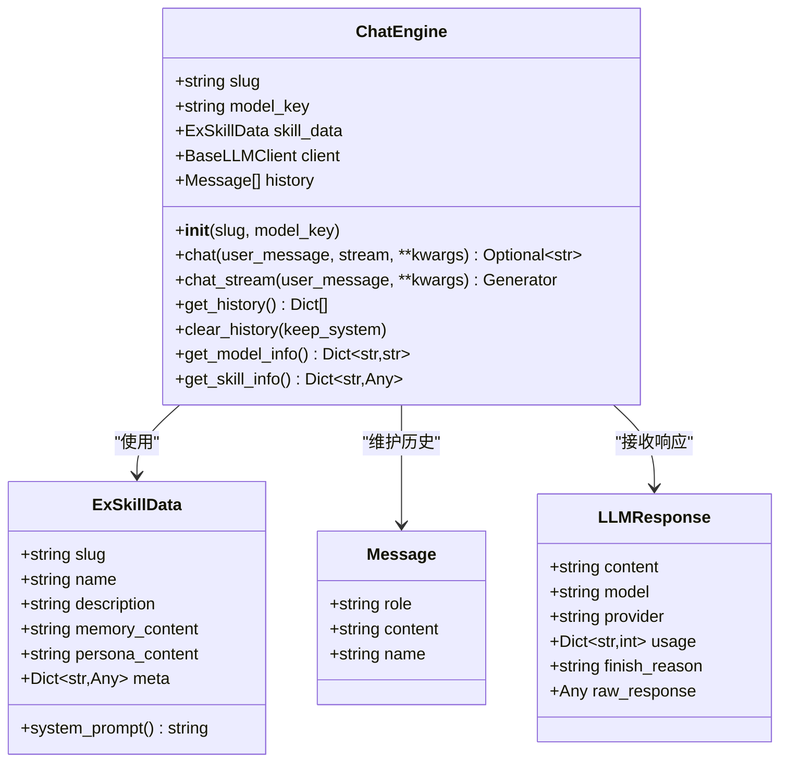
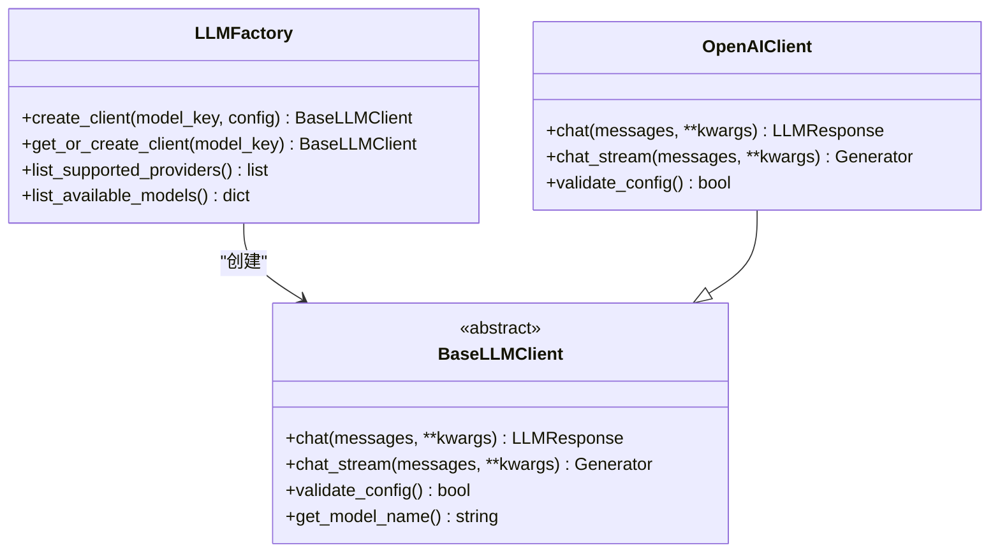
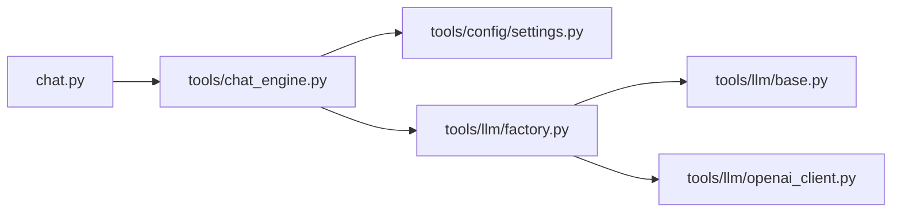

# API参考

<cite>
**本文引用的文件**
- [chat.py](file://chat.py)
- [tools/chat_engine.py](file://tools/chat_engine.py)
- [tools/config/settings.py](file://tools/config/settings.py)
- [tools/llm/factory.py](file://tools/llm/factory.py)
- [tools/llm/base.py](file://tools/llm/base.py)
- [tools/llm/openai_client.py](file://tools/llm/openai_client.py)
- [API_USAGE.md](file://API_USAGE.md)
- [README.md](file://README.md)
- [INSTALL.md](file://INSTALL.md)
- [requirements.txt](file://requirements.txt)
- [SKILL.md](file://SKILL.md)
</cite>

## 目录
1. [简介](#简介)
2. [项目结构](#项目结构)
3. [核心组件](#核心组件)
4. [架构总览](#架构总览)
5. [详细组件分析](#详细组件分析)
6. [依赖关系分析](#依赖关系分析)
7. [性能与资源特性](#性能与资源特性)
8. [故障排查与错误处理](#故障排查与错误处理)
9. [结论](#结论)
10. [附录](#附录)

## 简介
本参考文档面向CLI与核心API使用者，系统梳理以下内容：
- CLI命令行参数、选项与使用模式
- ChatEngine类的公共接口、方法签名与返回值
- 命令行使用示例（技能列表、对话启动、版本管理、删除操作等）
- API错误码、异常处理与状态管理
- REST API与WebSocket接口（如适用）及通信协议说明
- SDK使用示例与集成指南

本项目支持多Provider的LLM API（OpenAI、Anthropic、Google Gemini、DashScope通义千问、Ollama本地模型），并通过工厂模式统一接入；对话引擎负责加载Skill、构建系统Prompt、维护历史、调用LLM并返回结果。

## 项目结构
- CLI入口：chat.py
- 对话引擎：tools/chat_engine.py
- 配置与模型管理：tools/config/settings.py
- LLM工厂与客户端：tools/llm/factory.py、tools/llm/base.py、tools/llm/openai_client.py等
- 文档与使用指南：API_USAGE.md、README.md、INSTALL.md、SKILL.md
- 依赖声明：requirements.txt

图表来源
- [chat.py:128-201](file://chat.py#L128-L201)
- [tools/chat_engine.py:60-284](file://tools/chat_engine.py#L60-L284)
- [tools/config/settings.py:38-225](file://tools/config/settings.py#L38-L225)
- [tools/llm/factory.py:14-82](file://tools/llm/factory.py#L14-L82)
- [tools/llm/base.py:27-68](file://tools/llm/base.py#L27-L68)
- [tools/llm/openai_client.py:14-93](file://tools/llm/openai_client.py#L14-L93)
- [API_USAGE.md:1-194](file://API_USAGE.md#L1-L194)
- [README.md:235-275](file://README.md#L235-L275)
- [INSTALL.md:1-97](file://INSTALL.md#L1-L97)
- [requirements.txt:1-12](file://requirements.txt#L1-L12)
- [SKILL.md:303-341](file://SKILL.md#L303-L341)

章节来源
- [README.md:235-275](file://README.md#L235-L275)
- [API_USAGE.md:164-181](file://API_USAGE.md#L164-L181)

## 核心组件
- CLI入口：提供命令行参数解析、技能列表/模型列表展示、交互式对话启动与错误处理。
- ChatEngine：封装Skill加载、系统Prompt生成、历史管理、同步/流式对话调用。
- Settings/ModelConfig：集中管理默认Provider/Model、环境变量与.env解析、模型可用性判断。
- LLMFactory：根据模型Key或配置创建对应Provider客户端。
- BaseLLMClient/Message/LLMResponse：抽象LLM客户端接口与消息/响应数据结构。

章节来源
- [chat.py:128-201](file://chat.py#L128-L201)
- [tools/chat_engine.py:60-284](file://tools/chat_engine.py#L60-L284)
- [tools/config/settings.py:38-225](file://tools/config/settings.py#L38-L225)
- [tools/llm/factory.py:14-82](file://tools/llm/factory.py#L14-L82)
- [tools/llm/base.py:27-68](file://tools/llm/base.py#L27-L68)

## 架构总览
CLI通过create_chat创建ChatEngine实例，ChatEngine加载Skill并初始化系统消息，随后通过LLMFactory创建具体Provider客户端，最终调用chat或chat_stream进行对话。

图表来源
- [chat.py:128-201](file://chat.py#L128-L201)
- [tools/chat_engine.py:181-228](file://tools/chat_engine.py#L181-L228)
- [tools/llm/factory.py:22-56](file://tools/llm/factory.py#L22-L56)
- [tools/llm/openai_client.py:41-93](file://tools/llm/openai_client.py#L41-L93)

## 详细组件分析

### CLI命令行参考
- 目的：提供多Provider对话入口，支持技能列表、模型列表、交互式对话与参数控制。
- 主要参数
  - --ex/--slug：必需，指定Skill代号
  - --model/-m：可选，默认openai/gpt-4o
  - --list-skills/-l：可选，列出所有可用Skill
  - --list-models：可选，列出所有可用模型及其API Key配置状态
  - --no-stream：可选，禁用流式输出
  - --temperature/-t：可选，默认0.7
  - --max-tokens：可选，默认2000
- 对话内命令
  - /quit、/q、exit：退出
  - /clear：清空历史
  - /info：显示当前Skill信息

章节来源
- [chat.py:128-201](file://chat.py#L128-L201)
- [API_USAGE.md:77-98](file://API_USAGE.md#L77-L98)
- [README.md:134-143](file://README.md#L134-L143)

### ChatEngine类参考
- 构造函数
  - 参数：slug（Skill代号）、model_key（可选，默认来自配置）
  - 行为：加载Skill数据、创建LLM客户端、初始化系统消息
- 公共方法
  - chat(user_message, stream=False, **kwargs) -> Optional[str]
    - 同步对话，返回完整回复文本；若stream=True则返回None（需使用chat_stream）
  - chat_stream(user_message, **kwargs) -> Generator[str, None, None]
    - 流式对话，逐段产出文本片段
  - get_history() -> List[Dict[str,str]]
    - 返回历史消息列表（role/content）
  - clear_history(keep_system=True)
    - 清空历史，可选择保留系统消息并重建
  - get_model_info() -> Dict[str,str]
    - 返回model_key/provider/model
  - get_skill_info() -> Dict[str,Any]
    - 返回slug/name/description/meta
- 数据结构
  - ExSkillData：包含slug/name/description/memory_content/persona_content/meta
  - Message：role/content/name
  - LLMResponse：content/model/provider/usage/finish_reason/raw_response

图表来源
- [tools/chat_engine.py:60-284](file://tools/chat_engine.py#L60-L284)
- [tools/llm/base.py:19-68](file://tools/llm/base.py#L19-L68)

章节来源
- [tools/chat_engine.py:60-284](file://tools/chat_engine.py#L60-L284)
- [tools/llm/base.py:19-68](file://tools/llm/base.py#L19-L68)

### LLM工厂与客户端
- LLMFactory
  - create_client(model_key=None, config=None) -> BaseLLMClient
  - list_supported_providers() -> list
  - list_available_models() -> dict（含provider、model、has_api_key）
- BaseLLMClient
  - chat(messages, **kwargs) -> LLMResponse
  - chat_stream(messages, **kwargs) -> Generator[str]
  - validate_config() -> bool
  - get_model_name() -> str
- OpenAIClient
  - 支持OpenAI官方API与兼容OpenAI格式的第三方API（如DeepSeek、Moonshot）
  - 支持自定义base_url
  - chat/chat_stream均支持temperature/max_tokens透传

图表来源
- [tools/llm/factory.py:14-82](file://tools/llm/factory.py#L14-L82)
- [tools/llm/base.py:27-68](file://tools/llm/base.py#L27-L68)
- [tools/llm/openai_client.py:14-93](file://tools/llm/openai_client.py#L14-L93)

章节来源
- [tools/llm/factory.py:14-82](file://tools/llm/factory.py#L14-L82)
- [tools/llm/base.py:27-68](file://tools/llm/base.py#L27-L68)
- [tools/llm/openai_client.py:14-93](file://tools/llm/openai_client.py#L14-L93)

### 配置与模型管理
- Settings
  - 默认Provider/Model、exes目录、模型配置字典
  - _init_default_models()：内置多Provider/Model默认配置
  - _load_env_file()：从.env读取并覆盖默认配置
  - get_model_config(model_key)：解析或构造ModelConfig
  - get_ex_skill_path(slug)、list_ex_skills()：技能目录与列表
- ModelConfig
  - provider/model/api_key/base_url/temperature/max_tokens/timeout
  - 自动从环境变量补全api_key

章节来源
- [tools/config/settings.py:38-225](file://tools/config/settings.py#L38-L225)

## 依赖关系分析
- CLI依赖ChatEngine与LLMFactory
- ChatEngine依赖Settings、LLMFactory、Message/LLMResponse
- LLMFactory依赖Settings与各Provider客户端
- 各Provider客户端依赖BaseLLMClient

图表来源
- [chat.py:128-201](file://chat.py#L128-L201)
- [tools/chat_engine.py:60-284](file://tools/chat_engine.py#L60-L284)
- [tools/config/settings.py:38-225](file://tools/config/settings.py#L38-L225)
- [tools/llm/factory.py:14-82](file://tools/llm/factory.py#L14-L82)
- [tools/llm/base.py:27-68](file://tools/llm/base.py#L27-L68)
- [tools/llm/openai_client.py:14-93](file://tools/llm/openai_client.py#L14-L93)

章节来源
- [chat.py:128-201](file://chat.py#L128-L201)
- [tools/chat_engine.py:60-284](file://tools/chat_engine.py#L60-L284)
- [tools/llm/factory.py:14-82](file://tools/llm/factory.py#L14-L82)

## 性能与资源特性
- 流式输出：chat_stream逐段返回，降低首字延迟，提升交互体验
- 历史管理：维护消息历史，便于上下文连贯；支持清空历史并可保留系统消息
- 模型参数：temperature与max_tokens可通过参数传递，OpenAIClient会透传至底层API
- 本地模型：Ollama支持免API Key，但需本地服务运行

章节来源
- [tools/chat_engine.py:181-228](file://tools/chat_engine.py#L181-L228)
- [tools/llm/openai_client.py:41-93](file://tools/llm/openai_client.py#L41-L93)
- [API_USAGE.md:120-139](file://API_USAGE.md#L120-L139)

## 故障排查与错误处理
- CLI常见错误
  - 找不到Skill：FileNotFoundError，提示使用--list-skills查看
  - 依赖缺失：ImportError，提示安装openai/anthropic/google-generativeai
  - 其他异常：统一捕获并打印错误信息
- 对话内命令
  - /quit、/q、exit：退出
  - /clear：清空历史
  - /info：显示Skill信息
- Provider配置
  - 未配置API Key：模型列表中标记为未配置
  - 第三方API：通过自定义base_url兼容OpenAI格式

章节来源
- [chat.py:178-197](file://chat.py#L178-L197)
- [API_USAGE.md:140-163](file://API_USAGE.md#L140-L163)
- [tools/llm/openai_client.py:20-33](file://tools/llm/openai_client.py#L20-L33)

## 结论
本项目通过CLI与ChatEngine实现了“多Provider对话”的统一入口，配合Settings与LLMFactory完成配置与客户端管理。ChatEngine提供简洁的同步/流式对话接口与历史管理能力，适用于情感疗愈与个人回忆场景。对于需要集成到其他系统的用户，可直接调用ChatEngine或通过LLMFactory创建客户端进行二次开发。

## 附录

### 命令行使用示例
- 列出所有Skill
  - python chat.py --list-skills
- 列出所有模型
  - python chat.py --list-models
- 使用OpenAI GPT-4o对话
  - python chat.py --ex 小明 --model openai/gpt-4o
- 使用Anthropic Claude-3 Sonnet对话
  - python chat.py --ex 初恋 --model anthropic/claude-3-sonnet
- 使用Gemini Pro对话
  - python chat.py --ex 前任 --model gemini/gemini-pro
- 使用DashScope通义千问对话
  - python chat.py --ex 前任 --model qwen/qwen-max
- 使用本地Ollama模型
  - python chat.py --ex 前任 --model ollama/llama2
- 禁用流式输出
  - python chat.py --ex 前任 --model openai/gpt-4 --no-stream
- 调整温度与最大token
  - python chat.py --ex 前任 --model openai/gpt-4 -t 0.7 --max-tokens 2000

章节来源
- [API_USAGE.md:50-75](file://API_USAGE.md#L50-L75)
- [README.md:102-122](file://README.md#L102-L122)

### 技能管理与版本控制
- 列出所有Skill
  - python chat.py --list-skills
- 进化模式（追加记忆/对话纠正/版本回滚）
  - 进化模式与管理命令详见SKILL.md中的“进化模式”与“管理命令”章节
- 删除Skill
  - 使用/let-go或/delete-ex命令（在Claude Code环境中）

章节来源
- [SKILL.md:359-417](file://SKILL.md#L359-L417)
- [README.md:64-75](file://README.md#L64-L75)

### API与SDK使用指南
- 支持的Provider与模型
  - OpenAI：gpt-4、gpt-4o、gpt-3.5-turbo
  - Anthropic：claude-3-opus、claude-3-sonnet、claude-3-haiku
  - Google：gemini-pro、gemini-1.5-flash
  - DashScope（通义千问）：qwen-max、qwen-plus、qwen-turbo
  - Ollama：llama2、mistral、qwen2.5等（本地模型）
- API Key配置
  - 环境变量或.env文件
  - 第三方兼容OpenAI格式的API可通过自定义base_url使用
- SDK集成要点
  - 直接调用ChatEngine构造函数创建实例
  - 通过LLMFactory.create_client传入model_key或ModelConfig
  - 使用chat或chat_stream进行对话
  - 使用get_history/clear_history管理历史

章节来源
- [API_USAGE.md:5-14](file://API_USAGE.md#L5-L14)
- [API_USAGE.md:100-118](file://API_USAGE.md#L100-L118)
- [tools/config/settings.py:162-190](file://tools/config/settings.py#L162-L190)
- [tools/llm/factory.py:22-56](file://tools/llm/factory.py#L22-L56)

### 通信协议与接口说明
- 当前实现为本地CLI与Python模块调用，未提供HTTP REST API或WebSocket接口
- 若需对外提供服务，可在现有ChatEngine基础上封装HTTP服务（建议使用FastAPI/Flask）或WebSocket服务

章节来源
- [chat.py:128-201](file://chat.py#L128-L201)
- [tools/chat_engine.py:181-228](file://tools/chat_engine.py#L181-L228)