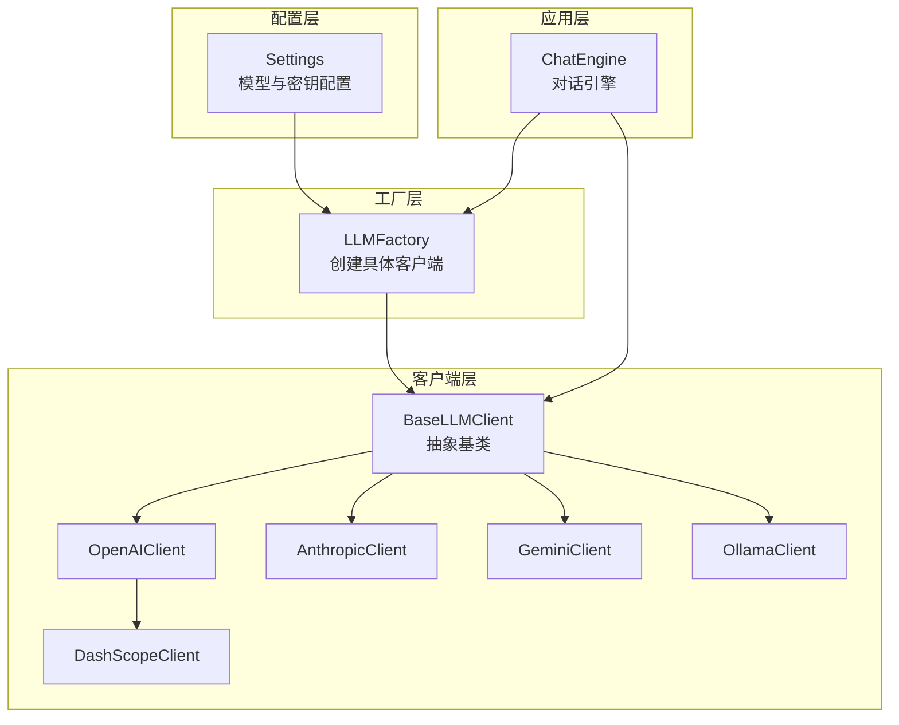
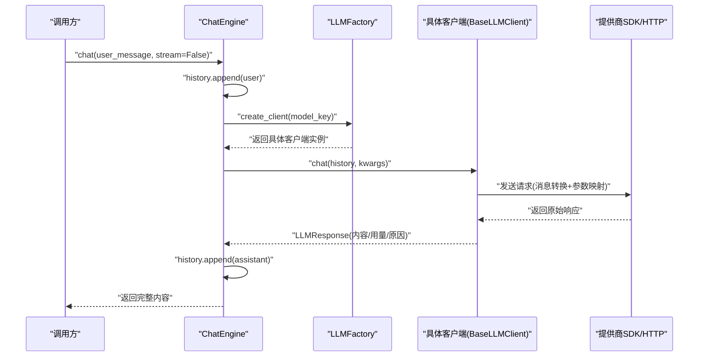
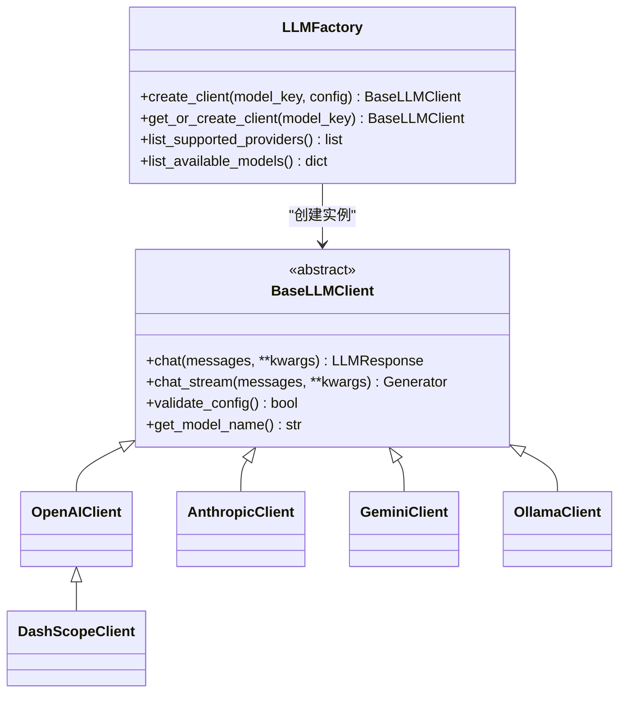
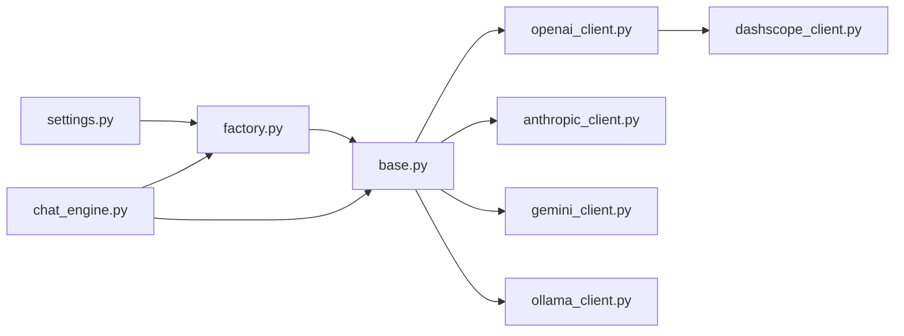
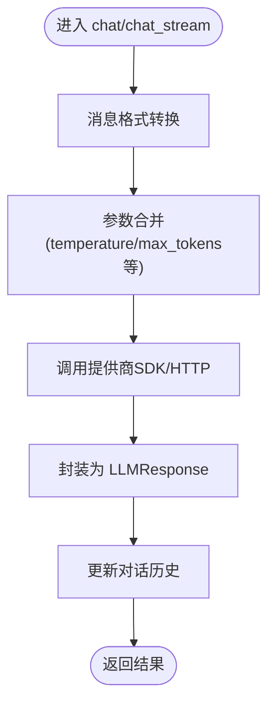

# LLM集成

<cite>
**本文引用的文件**
- [tools/llm/__init__.py](file://tools/llm/__init__.py)
- [tools/llm/factory.py](file://tools/llm/factory.py)
- [tools/llm/base.py](file://tools/llm/base.py)
- [tools/llm/openai_client.py](file://tools/llm/openai_client.py)
- [tools/llm/anthropic_client.py](file://tools/llm/anthropic_client.py)
- [tools/llm/gemini_client.py](file://tools/llm/gemini_client.py)
- [tools/llm/dashscope_client.py](file://tools/llm/dashscope_client.py)
- [tools/llm/ollama_client.py](file://tools/llm/ollama_client.py)
- [tools/config/settings.py](file://tools/config/settings.py)
- [tools/chat_engine.py](file://tools/chat_engine.py)
- [README.md](file://README.md)
- [API_USAGE.md](file://API_USAGE.md)
- [requirements.txt](file://requirements.txt)
- [.env.example](file://.env.example)
</cite>

## 目录
1. [简介](#简介)
2. [项目结构](#项目结构)
3. [核心组件](#核心组件)
4. [架构总览](#架构总览)
5. [详细组件分析](#详细组件分析)
6. [依赖关系分析](#依赖关系分析)
7. [性能考虑](#性能考虑)
8. [故障排除指南](#故障排除指南)
9. [结论](#结论)
10. [附录](#附录)

## 简介
本技术文档面向“LLM集成模块”，系统阐述多提供商API支持的实现架构与使用方法。模块采用工厂模式进行客户端创建，通过抽象基类统一对外接口，屏蔽OpenAI、Anthropic、Google Gemini、DashScope（通义千问）、Ollama等不同提供商的API差异。文档覆盖认证机制、请求参数映射、流式与非流式响应、错误处理与限流策略建议、配置管理最佳实践、性能优化与成本控制方法，并提供具体使用示例与故障排除指南。

## 项目结构
- LLM客户端模块位于 tools/llm，包含抽象基类、各提供商适配器与工厂。
- 配置管理位于 tools/config/settings.py，负责从环境变量、.env文件与默认配置加载模型与API密钥。
- 对话引擎 tools/chat_engine.py 负责加载Skill、构建系统Prompt、维护对话历史，并通过工厂创建客户端发起请求。
- README与API_USAGE提供高层使用说明与命令行示例。
- requirements.txt声明核心依赖；.env.example提供环境变量示例。

图表来源
- [tools/llm/factory.py:14-82](file://tools/llm/factory.py#L14-L82)
- [tools/llm/base.py:27-68](file://tools/llm/base.py#L27-L68)
- [tools/llm/openai_client.py:14-93](file://tools/llm/openai_client.py#L14-L93)
- [tools/llm/anthropic_client.py:13-99](file://tools/llm/anthropic_client.py#L13-L99)
- [tools/llm/gemini_client.py:13-119](file://tools/llm/gemini_client.py#L13-L119)
- [tools/llm/dashscope_client.py:12-67](file://tools/llm/dashscope_client.py#L12-L67)
- [tools/llm/ollama_client.py:11-126](file://tools/llm/ollama_client.py#L11-L126)
- [tools/chat_engine.py:60-284](file://tools/chat_engine.py#L60-L284)

章节来源
- [tools/llm/__init__.py:1-6](file://tools/llm/__init__.py#L1-L6)
- [tools/config/settings.py:12-225](file://tools/config/settings.py#L12-L225)
- [tools/chat_engine.py:1-284](file://tools/chat_engine.py#L1-L284)
- [README.md:235-275](file://README.md#L235-L275)
- [API_USAGE.md:1-194](file://API_USAGE.md#L1-L194)

## 核心组件
- 抽象基类 BaseLLMClient：定义统一的 chat 与 chat_stream 接口，提供配置校验与模型名查询能力。
- 数据结构 LLMResponse/Message：标准化响应与消息载体，便于跨提供商统一处理。
- LLMFactory：根据模型键（provider/model）或显式配置创建具体客户端，支持单例缓存与可用模型枚举。
- 各提供商客户端：分别实现消息格式转换、参数映射、响应封装与流式输出。
- 配置系统 Settings：集中管理默认模型、环境变量与.env文件加载、动态解析模型键。
- 对话引擎 ChatEngine：加载Skill、构造系统Prompt、维护历史、调用客户端并处理流式输出。

章节来源
- [tools/llm/base.py:8-68](file://tools/llm/base.py#L8-L68)
- [tools/llm/factory.py:14-82](file://tools/llm/factory.py#L14-L82)
- [tools/config/settings.py:12-225](file://tools/config/settings.py#L12-L225)
- [tools/chat_engine.py:17-284](file://tools/chat_engine.py#L17-L284)

## 架构总览
多提供商统一接口通过工厂模式与抽象基类实现。工厂根据配置选择具体客户端，客户端内部完成消息格式转换与参数映射，最终调用各自SDK或HTTP接口，并将结果封装为统一的 LLMResponse。

图表来源
- [tools/chat_engine.py:181-204](file://tools/chat_engine.py#L181-L204)
- [tools/llm/factory.py:23-56](file://tools/llm/factory.py#L23-L56)
- [tools/llm/base.py:35-59](file://tools/llm/base.py#L35-L59)

## 详细组件分析

### 工厂模式与客户端创建
- LLMFactory.create_client：支持通过 model_key 解析 provider/model，或直接传入 ModelConfig；根据 provider 映射到具体客户端类；支持单例缓存 get_or_create_client；提供可用提供商与模型清单。
- 支持的提供商映射：openai、anthropic、gemini、google、ollama、dashscope、qwen（别名）。

图表来源
- [tools/llm/factory.py:14-82](file://tools/llm/factory.py#L14-L82)
- [tools/llm/base.py:27-68](file://tools/llm/base.py#L27-L68)
- [tools/llm/openai_client.py:14-93](file://tools/llm/openai_client.py#L14-L93)
- [tools/llm/anthropic_client.py:13-99](file://tools/llm/anthropic_client.py#L13-L99)
- [tools/llm/gemini_client.py:13-119](file://tools/llm/gemini_client.py#L13-L119)
- [tools/llm/dashscope_client.py:12-67](file://tools/llm/dashscope_client.py#L12-L67)
- [tools/llm/ollama_client.py:11-126](file://tools/llm/ollama_client.py#L11-L126)

章节来源
- [tools/llm/factory.py:14-82](file://tools/llm/factory.py#L14-L82)

### 抽象基类与数据模型
- BaseLLMClient：定义 chat 与 chat_stream 两个抽象方法，要求子类实现；提供默认配置校验与模型名拼接。
- LLMResponse：统一承载内容、提供商、模型、用量、结束原因与原始响应。
- Message：统一的消息结构，支持 role、content、name。

章节来源
- [tools/llm/base.py:8-68](file://tools/llm/base.py#L8-L68)

### OpenAI 客户端
- 特性：支持 OpenAI 官方API及兼容OpenAI格式的第三方API（如DeepSeek、Moonshot等）；可通过 base_url 指定自定义端点。
- 消息转换：将内部 Message 列表转换为 OpenAI messages 数组。
- 参数映射：temperature、max_tokens 等参数合并至请求；流式输出逐块返回 delta.content。
- 认证：必须提供 api_key；若未安装 openai 包，初始化时报错提示安装。

章节来源
- [tools/llm/openai_client.py:14-93](file://tools/llm/openai_client.py#L14-L93)

### Anthropic 客户端
- 特性：使用 anthropic SDK；支持 system 参数与 messages 列表。
- 消息转换：将 system 角色提取为 system 字段，其余角色映射为 user/assistant。
- 参数映射：temperature、max_tokens；流式输出通过 text_stream 逐块返回。
- 认证：必须提供 api_key；未安装 anthropic 包时报错提示安装。

章节来源
- [tools/llm/anthropic_client.py:13-99](file://tools/llm/anthropic_client.py#L13-L99)

### Google Gemini 客户端
- 特性：使用 google-generativeai SDK；支持 system_instruction 与 contents。
- 消息转换：system 角色转为 system_instruction，user/assistant 分别映射为 user/model。
- 会话管理：通过 start_chat 维护历史；不返回 token 使用信息。
- 认证：必须提供 api_key；未安装 google-generativeai 包时报错提示安装。

章节来源
- [tools/llm/gemini_client.py:13-119](file://tools/llm/gemini_client.py#L13-L119)

### DashScope（通义千问）客户端
- 特性：继承 OpenAIClient，使用 DashScope 兼容的 OpenAI API 端点；支持从环境变量 DASHSCOPE_API_KEY 自动补全密钥。
- 认证：优先使用配置 api_key，否则尝试 DASHSCOPE_API_KEY；未设置时报错。
- 请求：复用 OpenAI 客户端的 chat/chat_stream 实现。

章节来源
- [tools/llm/dashscope_client.py:12-67](file://tools/llm/dashscope_client.py#L12-L67)

### Ollama 本地客户端
- 特性：通过 HTTP 调用本地 Ollama 服务；支持本地开源模型（llama2、mistral、qwen2.5 等）。
- 配置校验：通过 /api/tags 检测服务可用性；超时短路。
- 消息转换：system 角色单独传递，其余映射为 messages；流式输出逐行解析 JSON。
- 错误处理：连接失败抛出 ConnectionError，提示检查服务地址与状态。

章节来源
- [tools/llm/ollama_client.py:11-126](file://tools/llm/ollama_client.py#L11-L126)

### 配置系统与模型管理
- ModelConfig：provider、model、api_key、base_url、temperature、max_tokens、timeout；支持从环境变量自动注入 API Key。
- Settings：默认模型集合、.env 文件加载、模型键解析（支持 provider/model 与 model 两种形式）、本地模型扩展（OLLAMA_MODELS、OLLAMA_BASE_URL）。
- get_settings：全局配置实例懒加载。

章节来源
- [tools/config/settings.py:12-225](file://tools/config/settings.py#L12-L225)

### 对话引擎与统一调用
- ChatEngine：加载 Skill（SKILL.md 或 memory/persona 分离文件），构造系统 Prompt，维护 history；通过 LLMFactory 获取客户端；支持非流式与流式对话；提供历史清理与模型信息查询。
- 与工厂协作：根据 model_key 创建客户端；默认使用 Settings 中的 default_provider/default_model。

章节来源
- [tools/chat_engine.py:60-284](file://tools/chat_engine.py#L60-L284)

## 依赖关系分析
- 工厂依赖配置系统（读取模型配置与默认值）。
- 各客户端依赖对应 SDK（openai、anthropic、google-generativeai）或本地 HTTP 接口。
- 对话引擎依赖工厂与抽象基类，向上提供统一的对话接口。

图表来源
- [tools/config/settings.py:12-225](file://tools/config/settings.py#L12-L225)
- [tools/llm/factory.py:14-82](file://tools/llm/factory.py#L14-L82)
- [tools/llm/base.py:27-68](file://tools/llm/base.py#L27-L68)
- [tools/llm/openai_client.py:14-93](file://tools/llm/openai_client.py#L14-L93)
- [tools/llm/anthropic_client.py:13-99](file://tools/llm/anthropic_client.py#L13-L99)
- [tools/llm/gemini_client.py:13-119](file://tools/llm/gemini_client.py#L13-L119)
- [tools/llm/dashscope_client.py:12-67](file://tools/llm/dashscope_client.py#L12-L67)
- [tools/llm/ollama_client.py:11-126](file://tools/llm/ollama_client.py#L11-L126)
- [tools/chat_engine.py:60-284](file://tools/chat_engine.py#L60-L284)

章节来源
- [requirements.txt:1-12](file://requirements.txt#L1-L12)
- [README.md:235-275](file://README.md#L235-L275)

## 性能考虑
- 流式输出：OpenAI、Anthropic、Gemini、DashScope均支持流式输出，Ollama通过HTTP流式返回；流式可降低首字延迟并改善交互体验。
- 参数优化：合理设置 temperature 与 max_tokens，避免过长上下文导致延迟与成本上升；Gemini不返回用量，需自行统计或通过其他方式估算。
- 本地推理：Ollama 适合低延迟与隐私场景，但吞吐受限于本地硬件；可通过模型选择与并发控制平衡性能。
- 连接与超时：Ollama 客户端内置超时控制；云端API建议在调用侧增加重试与超时策略（见“错误处理与限流”）。
- 成本控制：优先选择性价比更高的模型；在满足质量前提下减少 max_tokens；批量任务合并请求；使用缓存与历史复用减少重复计算。

## 故障排除指南
- 依赖缺失
  - 现象：初始化客户端时报错提示安装对应SDK。
  - 处理：根据提供商安装相应依赖（openai、anthropic、google-generativeai）。
- API Key 未设置
  - 现象：配置校验失败或DashScope报错。
  - 处理：通过环境变量或 .env 文件设置对应 PROVIDER_API_KEY；DashScope可使用 DASHSCOPE_API_KEY 自动补全。
- Ollama 连接失败
  - 现象：ConnectionError，提示无法连接到 Ollama 服务。
  - 处理：确认 Ollama 服务已启动，base_url 正确；检查防火墙与网络；必要时调整 OLLAMA_BASE_URL。
- 模型键解析错误
  - 现象：工厂创建客户端时报不支持的 provider。
  - 处理：确保 model_key 格式为 provider/model，且 provider 在支持列表内；或在配置中添加自定义模型。
- 流式输出异常
  - 现象：流式输出中断或无内容。
  - 处理：检查提供商SDK版本与网络稳定性；必要时降级为非流式输出。
- 用量与结束原因
  - 现象：部分提供商不返回用量或结束原因。
  - 处理：OpenAI 返回完整用量；Anthropic 返回 stop_reason；Gemini不返回用量；DashScope与Ollama视SDK支持情况而定。

章节来源
- [API_USAGE.md:140-194](file://API_USAGE.md#L140-L194)
- [tools/llm/openai_client.py:22-39](file://tools/llm/openai_client.py#L22-L39)
- [tools/llm/anthropic_client.py:18-27](file://tools/llm/anthropic_client.py#L18-L27)
- [tools/llm/gemini_client.py:18-28](file://tools/llm/gemini_client.py#L18-L28)
- [tools/llm/dashscope_client.py:32-48](file://tools/llm/dashscope_client.py#L32-L48)
- [tools/llm/ollama_client.py:21-31](file://tools/llm/ollama_client.py#L21-L31)

## 结论
该LLM集成模块通过工厂模式与抽象基类实现了多提供商API的统一接入，屏蔽了各平台的消息格式差异与参数映射复杂度。配合完善的配置系统与对话引擎，开发者可在不改变上层调用逻辑的前提下灵活切换模型与提供商。建议在生产环境中结合流式输出、合理的参数与超时策略、以及成本控制手段，持续优化性能与用户体验。

## 附录

### 统一接口与关键流程
- 统一接口：chat(messages, **kwargs) -> LLMResponse；chat_stream(messages, **kwargs) -> Generator[str]。
- 关键流程：消息转换 -> 参数合并 -> SDK/HTTP请求 -> 响应封装 -> 历史维护。

图表来源
- [tools/llm/openai_client.py:41-71](file://tools/llm/openai_client.py#L41-L71)
- [tools/llm/anthropic_client.py:53-79](file://tools/llm/anthropic_client.py#L53-L79)
- [tools/llm/gemini_client.py:54-89](file://tools/llm/gemini_client.py#L54-L89)
- [tools/llm/dashscope_client.py:50-57](file://tools/llm/dashscope_client.py#L50-L57)
- [tools/llm/ollama_client.py:49-88](file://tools/llm/ollama_client.py#L49-L88)

### 配置管理最佳实践
- 使用 .env 文件集中管理密钥，避免硬编码；通过环境变量覆盖默认值。
- 本地模型通过 OLLAMA_MODELS 与 OLLAMA_BASE_URL 批量配置，便于多模型切换。
- 模型键优先使用 provider/model 格式，确保工厂映射准确。

章节来源
- [.env.example:1-21](file://.env.example#L1-L21)
- [tools/config/settings.py:148-190](file://tools/config/settings.py#L148-L190)

### 使用示例（路径指引）
- 命令行示例：参考 README 与 API_USAGE 中的命令行参数与示例命令。
- 第三方API（兼容OpenAI格式）：参考 API_USAGE 中的示例代码片段路径。
- 对话引擎：ChatEngine 提供统一的对话接口，参考 tools/chat_engine.py 中的 chat 与 chat_stream 方法。

章节来源
- [README.md:76-122](file://README.md#L76-L122)
- [API_USAGE.md:50-75](file://API_USAGE.md#L50-L75)
- [API_USAGE.md:103-118](file://API_USAGE.md#L103-L118)
- [tools/chat_engine.py:181-228](file://tools/chat_engine.py#L181-L228)