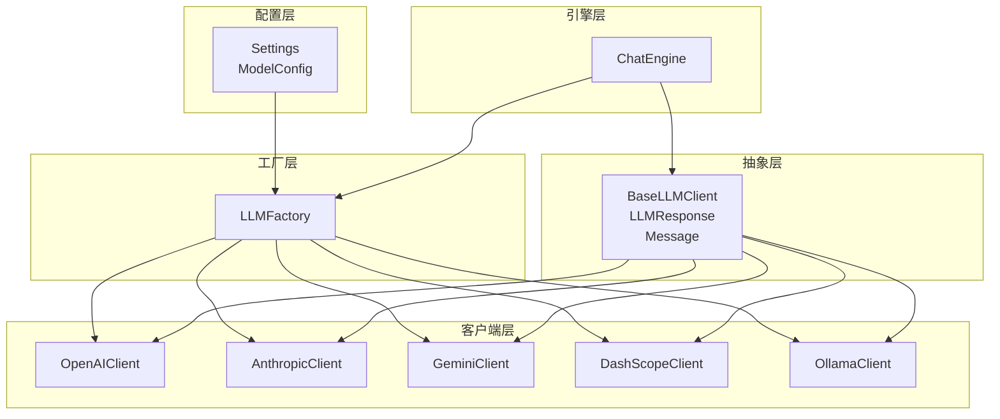
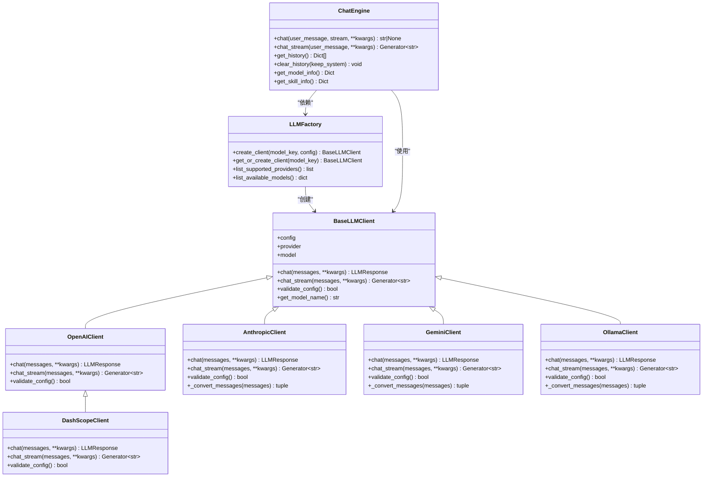
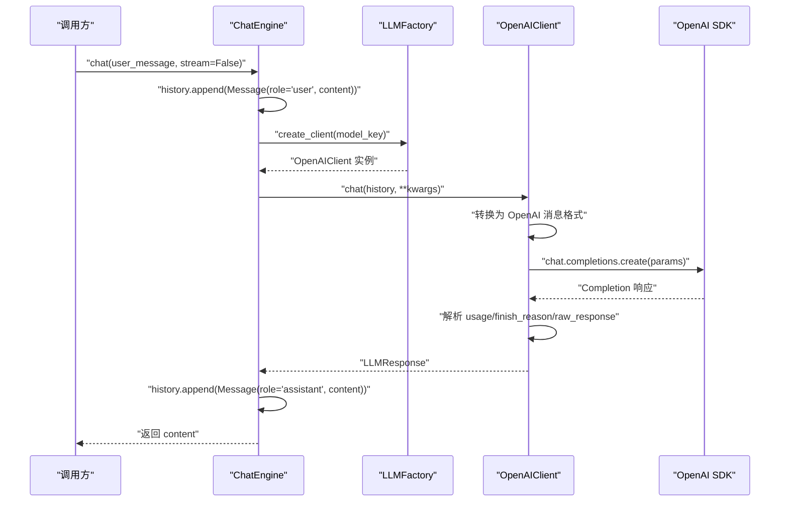
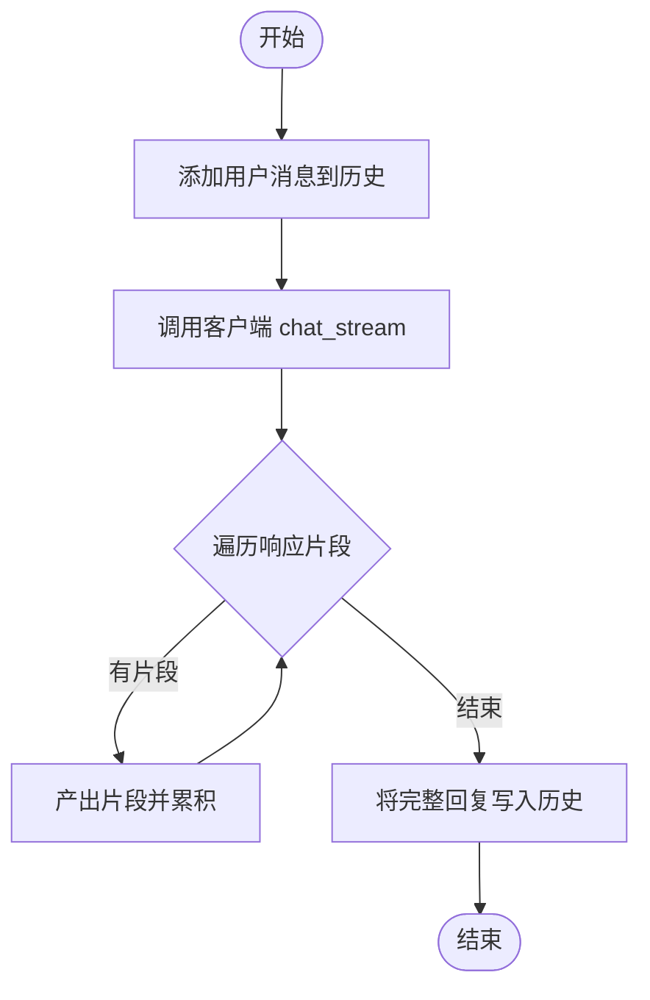
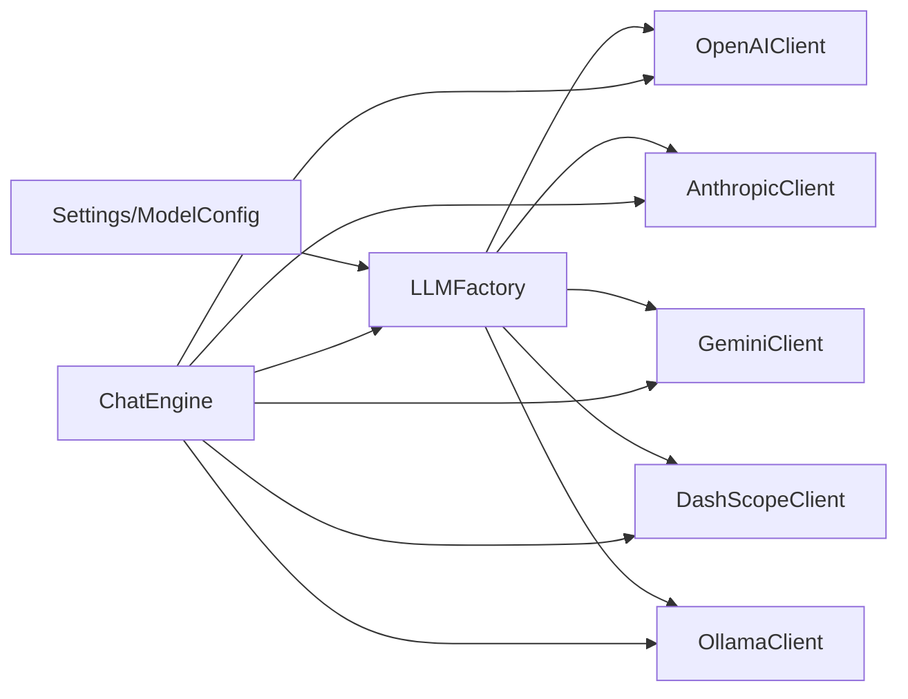

# 客户端抽象基类

<cite>
**本文引用的文件**
- [tools/llm/base.py](file://tools/llm/base.py)
- [tools/llm/factory.py](file://tools/llm/factory.py)
- [tools/llm/openai_client.py](file://tools/llm/openai_client.py)
- [tools/llm/anthropic_client.py](file://tools/llm/anthropic_client.py)
- [tools/llm/gemini_client.py](file://tools/llm/gemini_client.py)
- [tools/llm/dashscope_client.py](file://tools/llm/dashscope_client.py)
- [tools/llm/ollama_client.py](file://tools/llm/ollama_client.py)
- [tools/llm/__init__.py](file://tools/llm/__init__.py)
- [tools/chat_engine.py](file://tools/chat_engine.py)
- [tools/config/settings.py](file://tools/config/settings.py)
- [API_USAGE.md](file://API_USAGE.md)
- [README.md](file://README.md)
</cite>

## 目录
1. [简介](#简介)
2. [项目结构](#项目结构)
3. [核心组件](#核心组件)
4. [架构总览](#架构总览)
5. [详细组件分析](#详细组件分析)
6. [依赖关系分析](#依赖关系分析)
7. [性能考量](#性能考量)
8. [故障排查指南](#故障排查指南)
9. [结论](#结论)
10. [附录](#附录)

## 简介
本文件围绕 LLM 客户端抽象基类进行系统化技术文档编写，目标包括：
- 解释 BaseLLMClient 抽象基类的设计理念与接口规范
- 统一对话接口、消息格式处理与响应解析机制
- 明确抽象方法的定义与实现要求
- 阐述各具体客户端如何继承与扩展基类功能
- 提供接口一致性保证、错误处理标准化与性能监控的实现方案
- 给出基类扩展指南、自定义客户端开发步骤与调试技巧

## 项目结构
本项目采用“配置管理 + 抽象基类 + 具体客户端 + 工厂 + 对话引擎”的分层设计：
- 配置层：集中管理 API Key、模型配置与默认值
- 抽象层：定义统一的消息与响应模型、对话接口与流式接口
- 客户端层：针对不同供应商的具体实现
- 工厂层：根据配置动态创建对应客户端实例
- 引擎层：封装对话流程、历史管理与系统消息注入

图表来源
- [tools/config/settings.py:12-225](file://tools/config/settings.py#L12-L225)
- [tools/llm/base.py:27-68](file://tools/llm/base.py#L27-L68)
- [tools/llm/factory.py:14-82](file://tools/llm/factory.py#L14-L82)
- [tools/llm/openai_client.py:14-93](file://tools/llm/openai_client.py#L14-L93)
- [tools/llm/anthropic_client.py:13-99](file://tools/llm/anthropic_client.py#L13-L99)
- [tools/llm/gemini_client.py:13-119](file://tools/llm/gemini_client.py#L13-L119)
- [tools/llm/dashscope_client.py:12-67](file://tools/llm/dashscope_client.py#L12-L67)
- [tools/llm/ollama_client.py:11-126](file://tools/llm/ollama_client.py#L11-L126)
- [tools/chat_engine.py:60-284](file://tools/chat_engine.py#L60-L284)

章节来源
- [tools/llm/__init__.py:1-6](file://tools/llm/__init__.py#L1-L6)
- [API_USAGE.md:164-194](file://API_USAGE.md#L164-L194)
- [README.md:281-321](file://README.md#L281-L321)

## 核心组件
- 抽象基类 BaseLLMClient：定义统一的对话接口 chat 与 chat_stream，以及通用配置与模型名查询能力
- 数据模型：
  - LLMResponse：封装内容、提供商、模型、用量统计、结束原因与原始响应
  - Message：封装角色、内容与可选名称
- 工厂 LLMFactory：根据配置或模型键创建具体客户端实例，支持单例缓存与可用模型枚举
- 配置 Settings/ModelConfig：集中管理 API Key、默认模型、自定义端点、温度与最大 token 等
- 对话引擎 ChatEngine：负责加载 Skill、构建系统消息、维护对话历史、调用客户端并处理流式输出

章节来源
- [tools/llm/base.py:8-68](file://tools/llm/base.py#L8-L68)
- [tools/llm/factory.py:14-82](file://tools/llm/factory.py#L14-L82)
- [tools/config/settings.py:12-225](file://tools/config/settings.py#L12-L225)
- [tools/chat_engine.py:60-284](file://tools/chat_engine.py#L60-L284)

## 架构总览
抽象基类统一了客户端的对外接口，具体客户端只需实现 chat 与 chat_stream，并在内部完成消息格式转换与响应解析。工厂根据 provider 映射到具体客户端类，引擎通过工厂获取客户端并编排对话流程。

图表来源
- [tools/llm/base.py:27-68](file://tools/llm/base.py#L27-L68)
- [tools/llm/openai_client.py:14-93](file://tools/llm/openai_client.py#L14-L93)
- [tools/llm/anthropic_client.py:13-99](file://tools/llm/anthropic_client.py#L13-L99)
- [tools/llm/gemini_client.py:13-119](file://tools/llm/gemini_client.py#L13-L119)
- [tools/llm/dashscope_client.py:12-67](file://tools/llm/dashscope_client.py#L12-L67)
- [tools/llm/ollama_client.py:11-126](file://tools/llm/ollama_client.py#L11-L126)
- [tools/llm/factory.py:14-82](file://tools/llm/factory.py#L14-L82)
- [tools/chat_engine.py:60-284](file://tools/chat_engine.py#L60-L284)

## 详细组件分析

### 抽象基类 BaseLLMClient
- 设计理念
  - 通过抽象方法约束具体客户端必须实现同步与流式对话接口
  - 通过统一的数据模型 LLMResponse/Message，保证上层调用的一致性
  - 提供可覆盖的配置校验与模型名拼接能力，便于扩展
- 接口规范
  - chat：接收消息列表与额外参数，返回 LLMResponse
  - chat_stream：接收消息列表与额外参数，逐段产出字符串
  - validate_config：默认返回 True，具体客户端可重写以校验 API Key、端点等
  - get_model_name：默认返回 provider/model 组合
- 实现要求
  - 必须在构造函数中保存 config，并提取 provider 与 model
  - chat/chat_stream 必须完成消息格式转换与响应解析
  - 响应解析需填充 content、provider、model、finish_reason、raw_response
  - 若底层 API 返回 token 使用信息，应在 usage 字段中体现

章节来源
- [tools/llm/base.py:27-68](file://tools/llm/base.py#L27-L68)

### 数据模型
- LLMResponse
  - 字段：content、model、provider、usage、finish_reason、raw_response
  - 用途：承载统一的响应结构，便于上层处理与监控
- Message
  - 字段：role（system/user/assistant）、content、name
  - 用途：作为对话历史与上下文传递的基础单元

章节来源
- [tools/llm/base.py:8-25](file://tools/llm/base.py#L8-L25)

### 具体客户端实现要点

#### OpenAI 客户端
- 特点
  - 支持 OpenAI 官方 API 与兼容 OpenAI 格式的第三方端点（通过 base_url）
  - chat/chat_stream 直接映射 OpenAI 的 chat.completions 接口
  - 用量统计来自 response.usage
- 扩展点
  - validate_config 校验 api_key
  - 支持自定义 base_url 以适配 Moonshot、DeepSeek 等

章节来源
- [tools/llm/openai_client.py:14-93](file://tools/llm/openai_client.py#L14-L93)

#### Anthropic Claude 客户端
- 特点
  - Claude 使用 system 参数与 messages 列表；需要将 system 消息分离
  - chat/chat_stream 使用 messages.create 与流式接口
  - 用量统计来自 response.usage
- 扩展点
  - _convert_messages 负责格式转换
  - validate_config 校验 api_key

章节来源
- [tools/llm/anthropic_client.py:13-99](file://tools/llm/anthropic_client.py#L13-L99)

#### Gemini 客户端
- 特点
  - Gemini 使用 system_instruction 与 contents；需要将 system 消息分离
  - chat/chat_stream 使用 start_chat + send_message
  - 用量统计在某些版本可能不可用
- 扩展点
  - _convert_messages 负责格式转换
  - validate_config 校验 api_key

章节来源
- [tools/llm/gemini_client.py:13-119](file://tools/llm/gemini_client.py#L13-L119)

#### DashScope（通义千问）客户端
- 特点
  - 继承 OpenAIClient，通过设置 base_url 适配 DashScope 的兼容端点
  - validate_config 支持从环境变量读取 DASHSCOPE_API_KEY
- 扩展点
  - 重写 validate_config 以增强健壮性
  - 保持与 OpenAI 客户端一致的调用方式

章节来源
- [tools/llm/dashscope_client.py:12-67](file://tools/llm/dashscope_client.py#L12-L67)

#### Ollama 本地客户端
- 特点
  - 通过 HTTP 请求与本地 Ollama 服务交互
  - validate_config 检查 /api/tags 可达性
  - chat/chat_stream 分别处理非流式与流式响应
- 扩展点
  - _convert_messages 负责格式转换
  - 支持自定义 base_url 与超时配置

章节来源
- [tools/llm/ollama_client.py:11-126](file://tools/llm/ollama_client.py#L11-L126)

### 工厂 LLMFactory
- 职责
  - 根据 model_key 或直接传入的 ModelConfig 创建具体客户端
  - 支持单例缓存（get_or_create_client）
  - 提供支持的 provider 列表与可用模型清单
- 映射关系
  - openai → OpenAIClient
  - anthropic → AnthropicClient
  - gemini/google → GeminiClient
  - dashscope/qwen → DashScopeClient
- 错误处理
  - 不支持的 provider 抛出异常，提示支持列表

章节来源
- [tools/llm/factory.py:14-82](file://tools/llm/factory.py#L14-L82)

### 对话引擎 ChatEngine
- 职责
  - 加载 Skill 数据并生成系统 Prompt
  - 维护对话历史（Message 列表）
  - 调用客户端执行 chat/chat_stream，并将结果追加到历史
- 关键流程
  - chat：非流式调用，返回完整内容
  - chat_stream：逐段产出，聚合后写入历史
  - clear_history：可选择保留系统消息
- 与工厂/客户端协作
  - 通过 LLMFactory.create_client 获取客户端
  - 通过 Message 传递历史与上下文

章节来源
- [tools/chat_engine.py:60-284](file://tools/chat_engine.py#L60-L284)

### 消息格式转换与响应解析流程
以下序列图展示从 ChatEngine 到具体客户端的消息转换与响应解析过程（以 OpenAI 为例）：

图表来源
- [tools/chat_engine.py:181-204](file://tools/chat_engine.py#L181-L204)
- [tools/llm/factory.py:22-56](file://tools/llm/factory.py#L22-L56)
- [tools/llm/openai_client.py:41-71](file://tools/llm/openai_client.py#L41-L71)

### 流式对话处理流程

图表来源
- [tools/chat_engine.py:206-228](file://tools/chat_engine.py#L206-L228)
- [tools/llm/openai_client.py:73-93](file://tools/llm/openai_client.py#L73-L93)

## 依赖关系分析
- 抽象层与实现层
  - 所有具体客户端均继承 BaseLLMClient，确保接口一致性
- 工厂与客户端
  - LLMFactory 通过 provider 映射到具体客户端类
  - DashScopeClient 继承 OpenAIClient，利用其 OpenAI 兼容能力
- 引擎与工厂/客户端
  - ChatEngine 通过工厂获取客户端实例，再调用 chat/chat_stream
- 配置与客户端
  - 客户端从 ModelConfig 读取 api_key、base_url、temperature、max_tokens 等参数
  - Settings 支持从环境变量与 .env 文件加载配置

图表来源
- [tools/config/settings.py:12-225](file://tools/config/settings.py#L12-L225)
- [tools/llm/factory.py:14-82](file://tools/llm/factory.py#L14-L82)
- [tools/chat_engine.py:60-284](file://tools/chat_engine.py#L60-L284)

章节来源
- [tools/llm/__init__.py:1-6](file://tools/llm/__init__.py#L1-L6)
- [API_USAGE.md:164-194](file://API_USAGE.md#L164-L194)

## 性能考量
- 流式输出
  - 通过 chat_stream 实现边生成边输出，降低首屏延迟
  - 具体客户端需正确处理流式响应片段
- 超时与连接
  - Ollama 客户端提供超时控制，避免阻塞
  - DashScope 客户端通过 base_url 与环境变量减少重复配置
- 用量统计
  - OpenAI 与 Anthropic 客户端返回 usage 信息，便于成本控制
  - Gemini 客户端在部分版本可能不返回 usage，需注意兼容性
- 模型选择
  - Settings 默认提供多厂商模型配置，便于切换与对比

章节来源
- [tools/llm/ollama_client.py:17-31](file://tools/llm/ollama_client.py#L17-L31)
- [tools/llm/dashscope_client.py:23-48](file://tools/llm/dashscope_client.py#L23-L48)
- [tools/config/settings.py:57-146](file://tools/config/settings.py#L57-L146)

## 故障排查指南
- ImportError：缺少依赖库
  - 现象：导入第三方 SDK 失败
  - 处理：安装对应 SDK（如 openai、anthropic、google-generativeai）
- API Key 未设置
  - 现象：validate_config 返回 False 或抛出异常
  - 处理：通过环境变量或 .env 文件设置对应 API Key
- Ollama 连接失败
  - 现象：validate_config 校验失败或连接超时
  - 处理：确认 Ollama 服务已启动，base_url 正确
- 不支持的 provider
  - 现象：工厂创建客户端时报错
  - 处理：检查 provider 名称是否在支持列表中
- 模型键格式错误
  - 现象：无法解析 model_key
  - 处理：使用 “provider/model” 格式或在 Settings 中预置配置

章节来源
- [tools/llm/openai_client.py:22-23](file://tools/llm/openai_client.py#L22-L23)
- [tools/llm/anthropic_client.py:18-19](file://tools/llm/anthropic_client.py#L18-L19)
- [tools/llm/gemini_client.py:18-19](file://tools/llm/gemini_client.py#L18-L19)
- [tools/llm/dashscope_client.py:36-47](file://tools/llm/dashscope_client.py#L36-L47)
- [tools/llm/ollama_client.py:23-31](file://tools/llm/ollama_client.py#L23-L31)
- [tools/llm/factory.py:52-54](file://tools/llm/factory.py#L52-L54)
- [API_USAGE.md:140-163](file://API_USAGE.md#L140-L163)

## 结论
BaseLLMClient 抽象基类通过统一接口与数据模型，实现了多厂商 LLM 的无缝接入。配合工厂模式与对话引擎，项目在保持扩展性的同时，也提供了良好的错误处理与性能优化空间。开发者可基于此框架快速扩展新客户端或适配新的 API。

## 附录

### 接口一致性保证
- 所有客户端必须实现 chat 与 chat_stream
- 响应必须封装为 LLMResponse，包含 content、provider、model、finish_reason、raw_response
- 消息必须封装为 Message，包含 role、content、name

章节来源
- [tools/llm/base.py:35-59](file://tools/llm/base.py#L35-L59)
- [tools/llm/base.py:8-25](file://tools/llm/base.py#L8-L25)

### 错误处理标准化
- validate_config：在客户端构造或调用前进行配置校验
- ImportError：在导入第三方 SDK 失败时明确提示安装依赖
- ConnectionError：在本地服务不可达时给出清晰提示
- ValueError：在不支持的 provider 或缺失 API Key 时抛出

章节来源
- [tools/llm/openai_client.py:35-39](file://tools/llm/openai_client.py#L35-L39)
- [tools/llm/anthropic_client.py:23-27](file://tools/llm/anthropic_client.py#L23-L27)
- [tools/llm/gemini_client.py:24-28](file://tools/llm/gemini_client.py#L24-L28)
- [tools/llm/dashscope_client.py:32-48](file://tools/llm/dashscope_client.py#L32-L48)
- [tools/llm/ollama_client.py:86-87](file://tools/llm/ollama_client.py#L86-L87)

### 性能监控建议
- 记录每次调用的耗时、token 使用量与 finish_reason
- 对于流式输出，记录首字节延迟与吞吐
- 在 Settings 中增加开关以启用/禁用监控

章节来源
- [tools/llm/openai_client.py:64-68](file://tools/llm/openai_client.py#L64-L68)
- [tools/llm/anthropic_client.py:73-76](file://tools/llm/anthropic_client.py#L73-L76)

### 基类扩展指南
- 新增客户端步骤
  - 继承 BaseLLMClient
  - 实现 chat 与 chat_stream，完成消息格式转换与响应解析
  - 重写 validate_config 以校验必要配置
  - 在工厂映射中注册 provider
- 自定义客户端开发要点
  - 严格遵守 LLMResponse/Message 的字段语义
  - 对流式响应进行稳健处理，避免丢弃中间片段
  - 提供清晰的错误信息与回退策略

章节来源
- [tools/llm/base.py:27-68](file://tools/llm/base.py#L27-L68)
- [tools/llm/factory.py:42-56](file://tools/llm/factory.py#L42-L56)

### 调试技巧
- 使用最小化消息列表快速定位问题
- 打印 raw_response 以便比对底层 API 响应
- 在 validate_config 中加入日志输出，确认配置加载顺序
- 对于流式输出，逐步缩小输入范围以定位异常片段

章节来源
- [tools/llm/openai_client.py:60-71](file://tools/llm/openai_client.py#L60-L71)
- [tools/llm/anthropic_client.py:69-79](file://tools/llm/anthropic_client.py#L69-L79)
- [tools/llm/gemini_client.py:82-89](file://tools/llm/gemini_client.py#L82-L89)
- [tools/llm/dashscope_client.py:50-57](file://tools/llm/dashscope_client.py#L50-L57)
- [tools/llm/ollama_client.py:78-85](file://tools/llm/ollama_client.py#L78-L85)