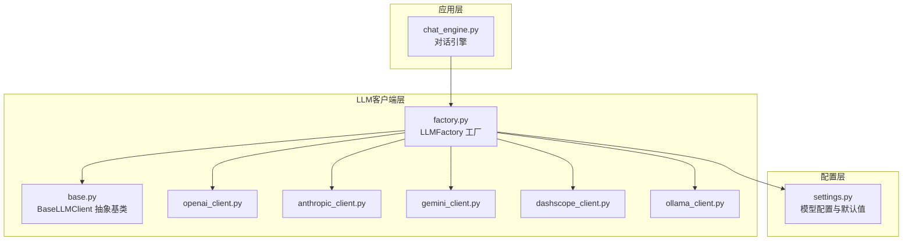
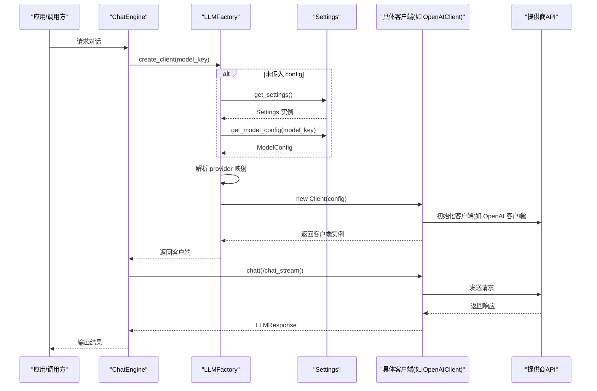
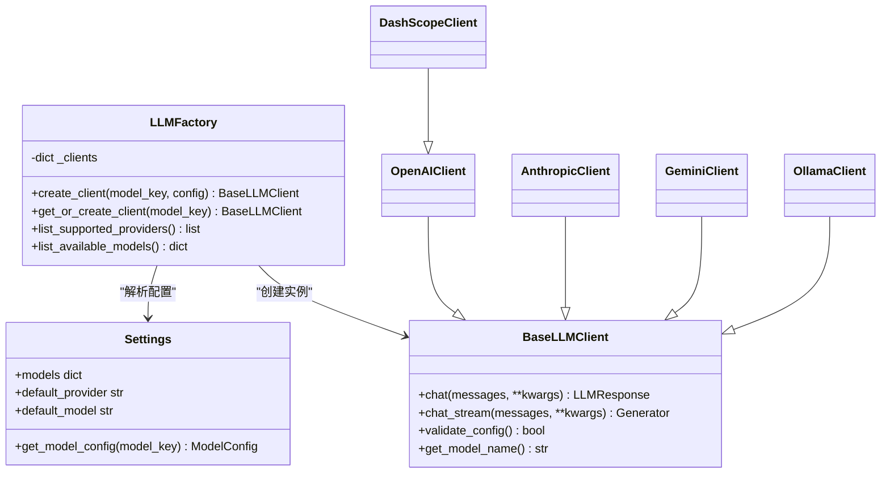
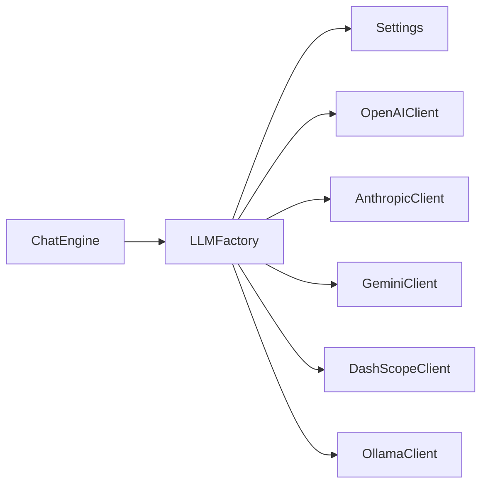

# 工厂模式设计

<cite>
**本文引用的文件**
- [tools/llm/factory.py](file://tools/llm/factory.py)
- [tools/llm/base.py](file://tools/llm/base.py)
- [tools/llm/openai_client.py](file://tools/llm/openai_client.py)
- [tools/llm/anthropic_client.py](file://tools/llm/anthropic_client.py)
- [tools/llm/gemini_client.py](file://tools/llm/gemini_client.py)
- [tools/llm/ollama_client.py](file://tools/llm/ollama_client.py)
- [tools/llm/dashscope_client.py](file://tools/llm/dashscope_client.py)
- [tools/config/settings.py](file://tools/config/settings.py)
- [tools/chat_engine.py](file://tools/chat_engine.py)
- [API_USAGE.md](file://API_USAGE.md)
- [README.md](file://README.md)
</cite>

## 目录
1. [引言](#引言)
2. [项目结构](#项目结构)
3. [核心组件](#核心组件)
4. [架构总览](#架构总览)
5. [详细组件分析](#详细组件分析)
6. [依赖分析](#依赖分析)
7. [性能考虑](#性能考虑)
8. [故障排查指南](#故障排查指南)
9. [结论](#结论)
10. [附录](#附录)

## 引言
本文件围绕多提供商LLM集成中的工厂模式进行系统化技术文档编写，重点解释：
- 工厂模式在多提供商LLM集成中的设计原理与实现细节
- 客户端创建流程与单例缓存机制
- 提供商映射表的设计策略
- create_client 与 get_or_create_client 的区别与使用场景
- ModelConfig 配置对象的传递机制与默认值处理
- 工厂模式最佳实践、性能优化建议与扩展新提供商的方法
- 常见问题与解决方案

## 项目结构
本项目采用“按功能域分层”的组织方式，LLM相关能力集中在 tools/llm 子模块，配置集中于 tools/config，对话引擎位于 tools/chat_engine.py。工厂模式位于 tools/llm/factory.py，负责根据配置动态创建不同提供商的客户端实例。

图表来源
- [tools/llm/factory.py:14-82](file://tools/llm/factory.py#L14-L82)
- [tools/llm/base.py:27-68](file://tools/llm/base.py#L27-L68)
- [tools/config/settings.py:12-225](file://tools/config/settings.py#L12-L225)
- [tools/chat_engine.py:60-83](file://tools/chat_engine.py#L60-L83)

章节来源
- [tools/llm/factory.py:14-82](file://tools/llm/factory.py#L14-L82)
- [tools/config/settings.py:12-225](file://tools/config/settings.py#L12-L225)
- [tools/chat_engine.py:60-83](file://tools/chat_engine.py#L60-L83)

## 核心组件
- LLMFactory：工厂类，负责根据配置创建具体LLM客户端；提供单例缓存；提供可用提供商与模型查询。
- BaseLLMClient：抽象基类，统一 chat 与 chat_stream 接口，提供配置校验与模型名获取。
- 具体客户端：OpenAIClient、AnthropicClient、GeminiClient、DashScopeClient、OllamaClient，分别对接不同提供商API。
- ModelConfig：配置数据类，封装 provider、model、api_key、base_url、temperature、max_tokens、timeout 等字段，默认值与环境变量自动注入。
- Settings：全局配置管理器，负责默认模型初始化、.env 加载、模型配置解析与全局实例缓存。
- ChatEngine：对话引擎，负责加载技能、构建系统提示、维护对话历史，并通过工厂创建客户端进行对话。

章节来源
- [tools/llm/factory.py:14-82](file://tools/llm/factory.py#L14-L82)
- [tools/llm/base.py:27-68](file://tools/llm/base.py#L27-L68)
- [tools/llm/openai_client.py:14-93](file://tools/llm/openai_client.py#L14-L93)
- [tools/llm/anthropic_client.py:13-99](file://tools/llm/anthropic_client.py#L13-L99)
- [tools/llm/gemini_client.py:13-119](file://tools/llm/gemini_client.py#L13-L119)
- [tools/llm/dashscope_client.py:12-67](file://tools/llm/dashscope_client.py#L12-L67)
- [tools/llm/ollama_client.py:11-126](file://tools/llm/ollama_client.py#L11-L126)
- [tools/config/settings.py:12-225](file://tools/config/settings.py#L12-L225)
- [tools/chat_engine.py:60-83](file://tools/chat_engine.py#L60-L83)

## 架构总览
工厂模式在本项目中的作用是“屏蔽提供商差异”，通过统一接口创建不同提供商的客户端，同时提供单例缓存避免重复创建，提升性能与资源利用率。

图表来源
- [tools/llm/factory.py:22-56](file://tools/llm/factory.py#L22-L56)
- [tools/config/settings.py:162-190](file://tools/config/settings.py#L162-L190)
- [tools/llm/openai_client.py:20-33](file://tools/llm/openai_client.py#L20-L33)
- [tools/chat_engine.py:181-204](file://tools/chat_engine.py#L181-L204)

## 详细组件分析

### LLMFactory 工厂类
- 单例缓存：类变量 _clients 作为进程内缓存，键为 model_key，值为已创建的客户端实例。
- create_client：
  - 若未传入 config，则通过 Settings.get_model_config 解析 model_key，支持 "provider/model" 或仅 "model" 的形式。
  - 通过 provider_map 将 provider 映射到具体客户端类，若不支持则抛出异常。
  - 将解析后的 ModelConfig 传入目标客户端构造函数。
- get_or_create_client：
  - 若缓存中不存在该 model_key，则调用 create_client 创建并放入缓存；否则直接返回缓存实例。
- list_supported_providers/list_available_models：
  - 提供可用提供商与模型清单，便于调试与UI展示。

图表来源
- [tools/llm/factory.py:14-82](file://tools/llm/factory.py#L14-L82)
- [tools/llm/base.py:27-68](file://tools/llm/base.py#L27-L68)
- [tools/llm/openai_client.py:14-93](file://tools/llm/openai_client.py#L14-L93)
- [tools/llm/anthropic_client.py:13-99](file://tools/llm/anthropic_client.py#L13-L99)
- [tools/llm/gemini_client.py:13-119](file://tools/llm/gemini_client.py#L13-L119)
- [tools/llm/dashscope_client.py:12-67](file://tools/llm/dashscope_client.py#L12-L67)
- [tools/llm/ollama_client.py:11-126](file://tools/llm/ollama_client.py#L11-L126)

章节来源
- [tools/llm/factory.py:14-82](file://tools/llm/factory.py#L14-L82)

### BaseLLMClient 抽象基类
- 统一接口：chat 与 chat_stream 两个抽象方法，要求子类实现。
- 配置与模型名：保存 provider 与 model 字段，提供 get_model_name 用于标识。
- validate_config：默认返回 True，子类可覆盖以实现配置校验。

章节来源
- [tools/llm/base.py:27-68](file://tools/llm/base.py#L27-L68)

### OpenAI 客户端
- 支持自定义 base_url，兼容第三方 OpenAI 兼容API（如 DeepSeek、Moonshot 等）。
- chat/chat_stream：将消息转换为 OpenAI 格式，合并温度与最大token参数，调用底层 OpenAI SDK。

章节来源
- [tools/llm/openai_client.py:14-93](file://tools/llm/openai_client.py#L14-L93)

### Anthropic 客户端
- 消息格式转换：将 system、user、assistant 角色转换为 Claude 格式。
- chat/chat_stream：支持 system 参数与流式输出。

章节来源
- [tools/llm/anthropic_client.py:13-99](file://tools/llm/anthropic_client.py#L13-L99)

### Gemini 客户端
- 消息格式转换：使用 system_instruction 与 contents。
- chat/chat_stream：支持带 system 的模型实例化与流式输出。

章节来源
- [tools/llm/gemini_client.py:13-119](file://tools/llm/gemini_client.py#L13-L119)

### DashScope 客户端
- 继承 OpenAIClient，重写 base_url 为 DashScope 兼容端点。
- 支持从环境变量 DASHSCOPE_API_KEY 注入 API Key。

章节来源
- [tools/llm/dashscope_client.py:12-67](file://tools/llm/dashscope_client.py#L12-L67)

### Ollama 本地客户端
- 通过 HTTP 请求与本地 Ollama 服务通信，支持自定义 base_url。
- chat/chat_stream：基于 /api/chat 接口，支持流式输出与连接超时控制。

章节来源
- [tools/llm/ollama_client.py:11-126](file://tools/llm/ollama_client.py#L11-L126)

### Settings 与 ModelConfig
- ModelConfig：
  - 字段：provider、model、api_key、base_url、temperature、max_tokens、timeout。
  - 默认值：temperature=0.7、max_tokens=2000、timeout=60；当 api_key 为空时，按 provider 映射自动从环境变量读取。
- Settings：
  - 默认模型初始化：内置多提供商模型配置，支持从环境变量 OLLAMA_MODELS 动态添加本地模型。
  - .env 加载：读取 .env 文件并设置环境变量，随后重新初始化模型配置。
  - get_model_config：支持 "provider/model"、"model" 与默认 provider 的解析，返回 ModelConfig。

章节来源
- [tools/config/settings.py:12-225](file://tools/config/settings.py#L12-L225)

### ChatEngine 对话引擎
- 负责加载技能、构建系统提示、维护对话历史。
- 通过 LLMFactory.create_client 获取客户端，支持非流式与流式对话。

章节来源
- [tools/chat_engine.py:60-83](file://tools/chat_engine.py#L60-L83)
- [tools/chat_engine.py:181-228](file://tools/chat_engine.py#L181-L228)

## 依赖分析
- 工厂对配置层的依赖：通过 Settings.get_model_config 解析 model_key，形成“配置驱动”的客户端创建。
- 工厂对客户端层的依赖：通过 provider_map 将 provider 映射到具体客户端类，耦合点集中在映射表。
- 客户端对SDK的依赖：各客户端内部依赖对应提供商SDK（如 openai、anthropic、google-generativeai），对外暴露统一接口。
- 单例缓存：LLMFactory._clients 作为进程内缓存，避免重复创建相同 model_key 的客户端，降低SDK初始化开销。

图表来源
- [tools/llm/factory.py:42-50](file://tools/llm/factory.py#L42-L50)
- [tools/chat_engine.py:76](file://tools/chat_engine.py#L76-L76)

章节来源
- [tools/llm/factory.py:42-50](file://tools/llm/factory.py#L42-L50)
- [tools/chat_engine.py:76](file://tools/chat_engine.py#L76-L76)

## 性能考虑
- 单例缓存：通过 LLMFactory._clients 缓存客户端实例，避免重复初始化昂贵的SDK客户端，显著降低CPU与内存开销。
- 配置解析：Settings.get_model_config 支持延迟解析与默认值注入，减少重复IO与字符串处理。
- 流式输出：各客户端均支持 chat_stream，配合 ChatEngine 的流式消费，降低首字延迟与内存占用。
- 本地模型：Ollama 客户端支持自定义 base_url 与 timeout，便于在受限网络环境下优化性能。
- 扩展成本：新增提供商只需实现 BaseLLMClient 接口并在工厂映射表中注册，即可享受统一接口与缓存机制。

[本节为通用性能讨论，不直接分析具体文件]

## 故障排查指南
- ImportError：缺少对应SDK
  - 现象：创建客户端时报错，提示需安装特定SDK。
  - 处理：参考 API 使用指南安装对应依赖。
- API Key 无效或缺失
  - 现象：客户端校验失败或请求被拒绝。
  - 处理：确认环境变量或 .env 文件中已正确设置对应提供商的 API Key。
- Ollama 连接失败
  - 现象：OllamaClient 抛出连接错误。
  - 处理：确保 Ollama 服务已启动，base_url 正确，网络可达。
- 不支持的 provider
  - 现象：工厂抛出不支持的 provider 异常。
  - 处理：检查 provider 名称是否拼写正确，或在工厂映射表中添加新提供商。
- 模型不可用
  - 现象：请求返回模型不存在或不可用。
  - 处理：确认 model_key 格式与提供商一致，或在 Settings 中添加相应模型配置。

章节来源
- [API_USAGE.md:140-162](file://API_USAGE.md#L140-L162)
- [tools/llm/ollama_client.py:21-31](file://tools/llm/ollama_client.py#L21-L31)
- [tools/llm/factory.py:52-54](file://tools/llm/factory.py#L52-L54)

## 结论
本项目通过工厂模式实现了多提供商LLM的统一接入与扩展，具备如下优势：
- 设计清晰：抽象基类统一接口，具体客户端隔离差异。
- 可扩展：新增提供商只需实现接口并在映射表注册。
- 可维护：配置驱动与环境变量注入，降低硬编码风险。
- 可观测：提供可用提供商与模型清单，便于诊断与排障。
- 可优化：单例缓存与流式输出显著提升性能与用户体验。

[本节为总结性内容，不直接分析具体文件]

## 附录

### create_client 与 get_or_create_client 的区别与使用场景
- create_client
  - 用途：根据 model_key 或直接传入的 ModelConfig 创建客户端实例。
  - 场景：需要精确控制每次创建新实例的场景，或在测试中避免缓存干扰。
- get_or_create_client
  - 用途：按 model_key 获取或创建客户端实例，并缓存在 LLMFactory._clients 中。
  - 场景：生产环境或高频调用中，避免重复创建客户端带来的性能损耗。

章节来源
- [tools/llm/factory.py:22-63](file://tools/llm/factory.py#L22-L63)

### ModelConfig 配置对象的传递机制与默认值处理
- 传递机制
  - 工厂优先使用显式传入的 ModelConfig；若未传入，则通过 Settings.get_model_config 解析 model_key。
  - 支持三种解析形式：provider/model、model（使用默认 provider）、直接传入完整配置。
- 默认值处理
  - ModelConfig 提供 temperature、max_tokens、timeout 等默认值。
  - 当 api_key 为空时，按 provider 映射自动从环境变量读取，减少手动配置。

章节来源
- [tools/llm/factory.py:33-39](file://tools/llm/factory.py#L33-L39)
- [tools/config/settings.py:162-190](file://tools/config/settings.py#L162-L190)
- [tools/config/settings.py:23-36](file://tools/config/settings.py#L23-L36)

### 扩展新提供商的方法
- 实现步骤
  - 新建客户端类，继承 BaseLLMClient，实现 chat 与 chat_stream。
  - 在工厂映射表 provider_map 中添加 provider 到类的映射。
  - 在 Settings 默认模型配置中添加新提供商的模型项，或允许通过环境变量动态注入。
- 最佳实践
  - 保持接口一致性，确保 chat 与 chat_stream 的参数与返回值语义一致。
  - 在 validate_config 中进行必要的配置校验，提前暴露错误。
  - 对于第三方兼容API，尽量提供 base_url 支持以便灵活切换端点。

章节来源
- [tools/llm/factory.py:42-50](file://tools/llm/factory.py#L42-L50)
- [tools/config/settings.py:57-146](file://tools/config/settings.py#L57-L146)

### 使用示例与常见问题
- 使用示例
  - 通过命令行或 ChatEngine 选择模型进行对话，详见使用指南与API使用说明。
- 常见问题
  - 依赖缺失、API Key 未设置、Ollama 服务未启动等问题，详见故障排查指南。

章节来源
- [API_USAGE.md:50-75](file://API_USAGE.md#L50-L75)
- [README.md:126-168](file://README.md#L126-L168)