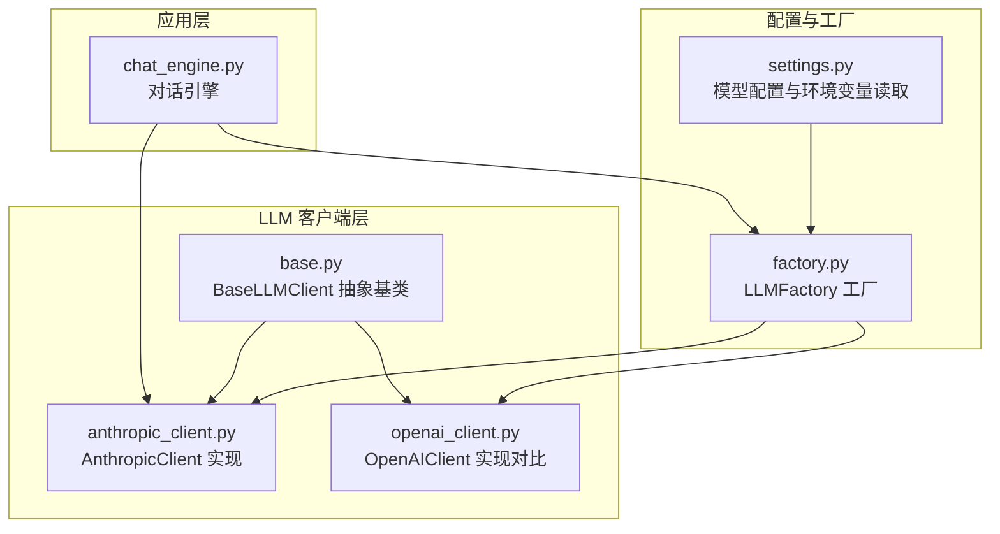
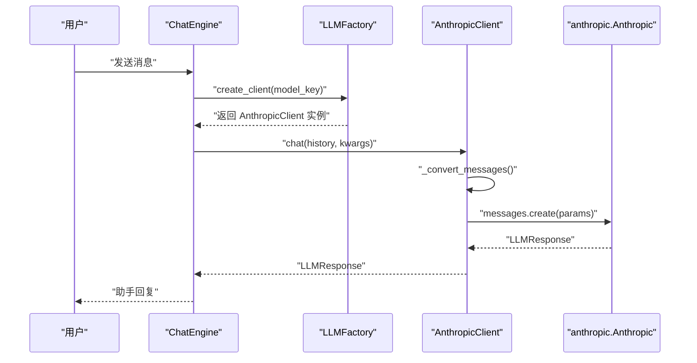
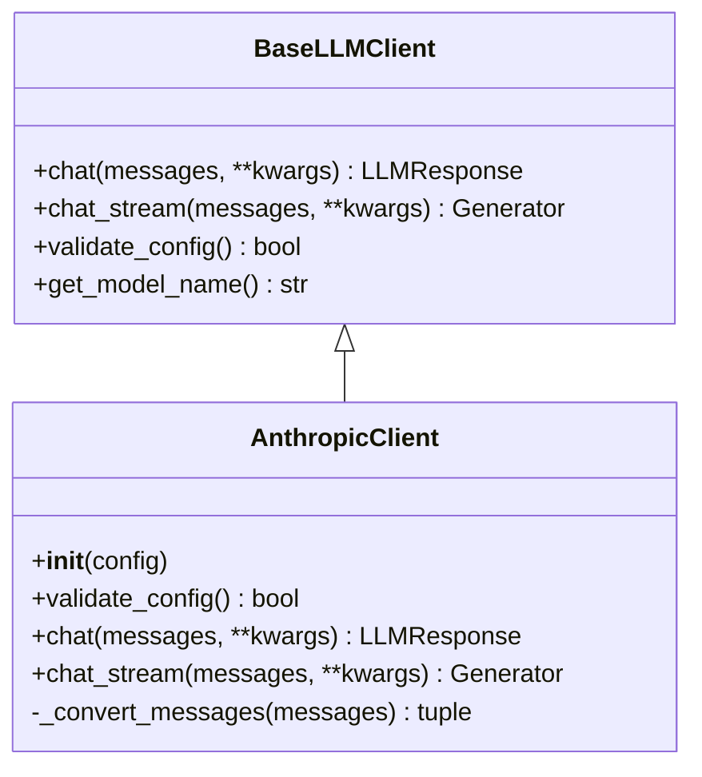
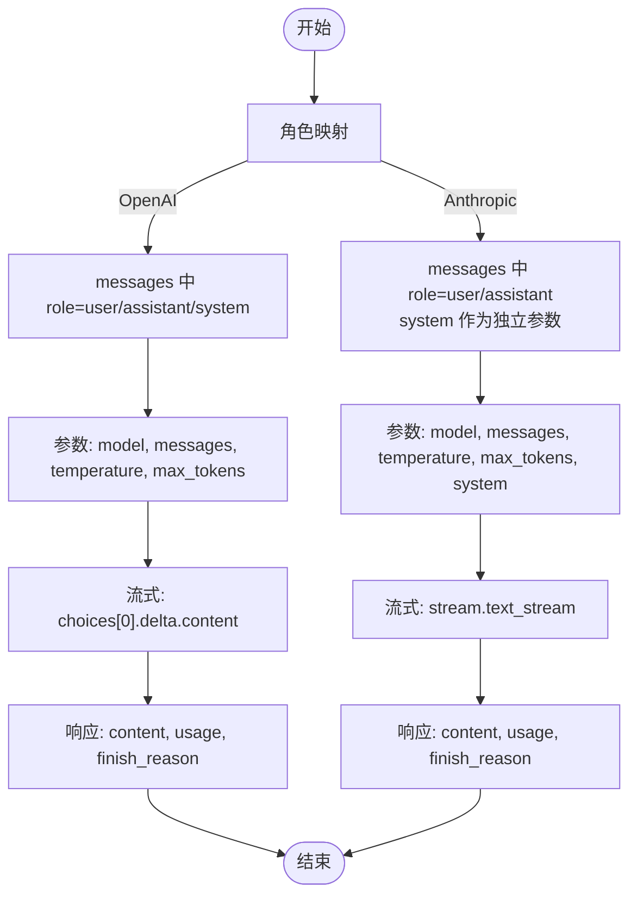
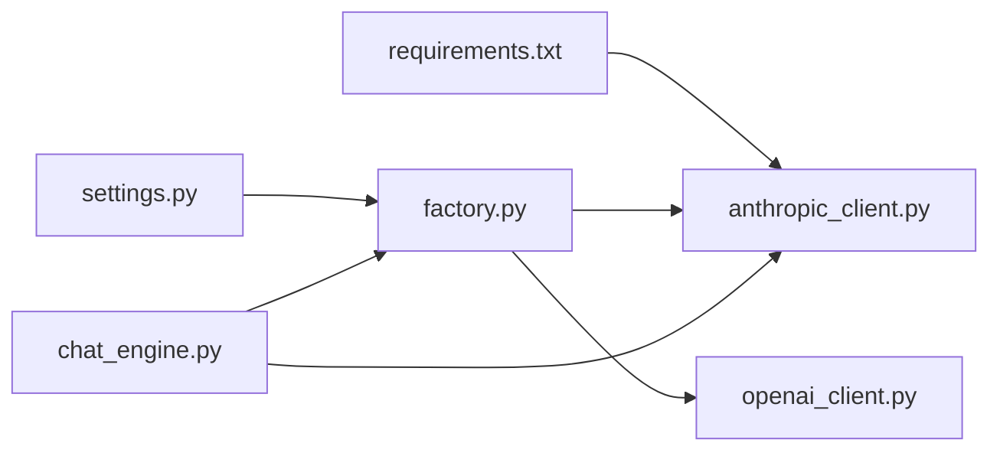

# Anthropic 客户端

<cite>
**本文引用的文件**
- [anthropic_client.py](file://tools/llm/anthropic_client.py)
- [base.py](file://tools/llm/base.py)
- [factory.py](file://tools/llm/factory.py)
- [settings.py](file://tools/config/settings.py)
- [chat_engine.py](file://tools/chat_engine.py)
- [openai_client.py](file://tools/llm/openai_client.py)
- [API_USAGE.md](file://API_USAGE.md)
- [README.md](file://README.md)
- [requirements.txt](file://requirements.txt)
</cite>

## 目录
1. [简介](#简介)
2. [项目结构](#项目结构)
3. [核心组件](#核心组件)
4. [架构总览](#架构总览)
5. [详细组件分析](#详细组件分析)
6. [依赖关系分析](#依赖关系分析)
7. [性能考量](#性能考量)
8. [故障排查指南](#故障排查指南)
9. [结论](#结论)
10. [附录](#附录)

## 简介
本文件面向使用 Anthropic Claude API 的开发者，系统梳理该项目中 Anthropic 客户端的实现要点，包括认证机制、消息格式转换、响应处理、与 OpenAI API 的差异、流式处理实现、配置参数与调用示例、错误处理策略、性能优化建议及使用限制说明。文档基于仓库中的实际代码与配置进行分析，帮助读者快速理解并正确集成 Anthropic 客户端。

## 项目结构
该项目采用“配置管理 + 客户端抽象 + 工厂模式”的模块化设计，Anthropic 客户端位于 tools/llm/anthropic_client.py，统一继承自 BaseLLMClient，并通过 LLMFactory 根据配置动态创建实例。对话引擎 tools/chat_engine.py 负责组织系统提示、维护对话历史，并调用具体客户端完成请求与流式输出。

图表来源
- [settings.py:12-225](file://tools/config/settings.py#L12-L225)
- [factory.py:14-82](file://tools/llm/factory.py#L14-L82)
- [base.py:27-68](file://tools/llm/base.py#L27-L68)
- [anthropic_client.py:13-99](file://tools/llm/anthropic_client.py#L13-L99)
- [openai_client.py:14-93](file://tools/llm/openai_client.py#L14-L93)
- [chat_engine.py:60-284](file://tools/chat_engine.py#L60-L284)

章节来源
- [settings.py:12-225](file://tools/config/settings.py#L12-L225)
- [factory.py:14-82](file://tools/llm/factory.py#L14-L82)
- [base.py:27-68](file://tools/llm/base.py#L27-L68)
- [anthropic_client.py:13-99](file://tools/llm/anthropic_client.py#L13-L99)
- [openai_client.py:14-93](file://tools/llm/openai_client.py#L14-L93)
- [chat_engine.py:60-284](file://tools/chat_engine.py#L60-L284)

## 核心组件
- BaseLLMClient：定义统一接口（chat、chat_stream、validate_config、get_model_name），并封装 provider/model 等基础属性。
- AnthropicClient：实现 Claude API 的客户端，负责：
  - 认证：通过配置中的 api_key 初始化 anthropic.Anthropic 客户端。
  - 消息格式转换：将内部 Message 列表转换为 Claude 的 messages 列表，并单独处理 system 参数。
  - 请求与响应：调用 messages.create 获取文本内容与用量；流式输出通过 messages.stream 的 text_stream 迭代。
  - 配置校验：校验 api_key 是否存在。
- LLMFactory：根据 provider 选择对应客户端类，支持 openai、anthropic、gemini、ollama、dashscope 等。
- ChatEngine：封装对话流程，负责系统提示构建、历史维护、调用客户端并处理流式输出。

章节来源
- [base.py:27-68](file://tools/llm/base.py#L27-L68)
- [anthropic_client.py:13-99](file://tools/llm/anthropic_client.py#L13-L99)
- [factory.py:14-82](file://tools/llm/factory.py#L14-L82)
- [chat_engine.py:60-284](file://tools/chat_engine.py#L60-L284)

## 架构总览
下图展示了从对话引擎到 Anthropic 客户端的调用链路与数据流。

图表来源
- [chat_engine.py:181-204](file://tools/chat_engine.py#L181-L204)
- [factory.py:22-56](file://tools/llm/factory.py#L22-L56)
- [anthropic_client.py:53-79](file://tools/llm/anthropic_client.py#L53-L79)

章节来源
- [chat_engine.py:181-204](file://tools/chat_engine.py#L181-L204)
- [factory.py:22-56](file://tools/llm/factory.py#L22-L56)
- [anthropic_client.py:53-79](file://tools/llm/anthropic_client.py#L53-L79)

## 详细组件分析

### AnthropicClient 类与实现要点
- 认证机制
  - 通过配置对象的 api_key 初始化 anthropic.Anthropic 客户端。
  - 若未安装 anthropic 包，构造函数会抛出 ImportError 并提示安装命令。
- 消息格式转换
  - 将内部 Message(role, content) 列表转换为 Claude 的 messages 结构（role: user/assistant）。
  - system 角色的消息被提取为独立的 system 参数传入 API。
- 请求与响应
  - 非流式：调用 messages.create，返回 LLMResponse，包含 content、usage、finish_reason 等。
  - 流式：使用 messages.stream，遍历 text_stream 逐段产出文本。
- 配置校验
  - validate_config 校验 api_key 是否存在。

图表来源
- [base.py:27-68](file://tools/llm/base.py#L27-L68)
- [anthropic_client.py:13-99](file://tools/llm/anthropic_client.py#L13-L99)

章节来源
- [anthropic_client.py:13-99](file://tools/llm/anthropic_client.py#L13-L99)
- [base.py:27-68](file://tools/llm/base.py#L27-L68)

### 与 OpenAI API 的差异
- 角色定义
  - OpenAI：messages 中 role 可为 system/user/assistant。
  - Anthropic：messages 中 role 为 user/assistant；system 作为独立参数传入。
- 参数配置
  - OpenAI：chat.completions.create 接收 messages、temperature、max_tokens 等。
  - Anthropic：messages.create 接收 messages、temperature、max_tokens、system 等。
- 流式处理
  - OpenAI：通过 stream=True 返回流式响应对象，逐块读取 choices[0].delta.content。
  - Anthropic：通过 messages.stream 上下文管理器，迭代 text_stream 产出文本片段。
- 响应结构
  - OpenAI：choices[0].message.content，usage 包含 prompt_tokens/completion_tokens/total_tokens。
  - Anthropic：content[0].text，usage 包含 input_tokens/output_tokens，finish_reason 对应 stop_reason。

图表来源
- [openai_client.py:41-93](file://tools/llm/openai_client.py#L41-L93)
- [anthropic_client.py:29-99](file://tools/llm/anthropic_client.py#L29-L99)

章节来源
- [openai_client.py:41-93](file://tools/llm/openai_client.py#L41-L93)
- [anthropic_client.py:29-99](file://tools/llm/anthropic_client.py#L29-L99)

### 配置参数与 API 密钥设置
- 模型配置
  - ModelConfig 字段：provider、model、api_key、base_url、temperature、max_tokens、timeout。
  - 环境变量自动读取：Anthropic 对应 ANTHROPIC_API_KEY。
- 默认模型与环境加载
  - Settings 初始化默认模型，包括 anthropic/claude-3-opus、claude-3-sonnet、claude-3-haiku 等。
  - 支持从 .env 文件读取环境变量并重新初始化模型配置。
- 工厂创建客户端
  - LLMFactory.create_client 根据 provider 选择 AnthropicClient。
  - 支持单例缓存 get_or_create_client。

章节来源
- [settings.py:12-225](file://tools/config/settings.py#L12-L225)
- [factory.py:14-82](file://tools/llm/factory.py#L14-L82)

### 调用示例与使用说明
- 独立运行与多 API 支持
  - README 与 API_USAGE 文档提供命令行示例，包括列出技能、列出模型、指定 anthropic/claude-* 模型进行对话。
- 对话引擎集成
  - ChatEngine 负责加载 SKILL.md/内存与性格内容，构建系统提示，维护历史，并调用客户端完成非流式或流式对话。

章节来源
- [README.md:126-168](file://README.md#L126-L168)
- [API_USAGE.md:50-75](file://API_USAGE.md#L50-L75)
- [chat_engine.py:60-284](file://tools/chat_engine.py#L60-L284)

## 依赖关系分析
- 外部依赖
  - anthropic>=0.18.0（requirements.txt 中声明）。
  - 运行时若未安装，AnthropicClient 构造函数会抛出 ImportError 并提示安装。
- 内部依赖
  - AnthropicClient 继承 BaseLLMClient，遵循统一接口。
  - LLMFactory 依赖 settings.py 提供的模型配置，按 provider 选择客户端类。
  - ChatEngine 依赖 LLMFactory 与 settings，负责对话生命周期管理。

图表来源
- [requirements.txt:4-7](file://requirements.txt#L4-L7)
- [anthropic_client.py:18-19](file://tools/llm/anthropic_client.py#L18-L19)
- [settings.py:12-225](file://tools/config/settings.py#L12-L225)
- [factory.py:14-82](file://tools/llm/factory.py#L14-L82)
- [openai_client.py:14-93](file://tools/llm/openai_client.py#L14-L93)
- [chat_engine.py:60-284](file://tools/chat_engine.py#L60-L284)

章节来源
- [requirements.txt:4-7](file://requirements.txt#L4-L7)
- [anthropic_client.py:18-19](file://tools/llm/anthropic_client.py#L18-L19)
- [settings.py:12-225](file://tools/config/settings.py#L12-L225)
- [factory.py:14-82](file://tools/llm/factory.py#L14-L82)
- [openai_client.py:14-93](file://tools/llm/openai_client.py#L14-L93)
- [chat_engine.py:60-284](file://tools/chat_engine.py#L60-L284)

## 性能考量
- 流式输出
  - AnthropicClient 的 chat_stream 使用 messages.stream，逐段产出文本，降低首字延迟，提升交互体验。
- 消息格式转换
  - _convert_messages 仅做角色过滤与 system 提取，复杂度 O(n)，在消息数量较多时仍具备良好性能。
- 配置与连接
  - 通过 LLMFactory 单例缓存客户端，避免重复初始化带来的开销。
- 超时与令牌限制
  - ModelConfig 提供 timeout 与 max_tokens，默认值可在 settings 中调整，以平衡响应速度与成本。

章节来源
- [anthropic_client.py:81-99](file://tools/llm/anthropic_client.py#L81-L99)
- [factory.py:58-63](file://tools/llm/factory.py#L58-L63)
- [settings.py:12-225](file://tools/config/settings.py#L12-L225)

## 故障排查指南
- ImportError：请先安装 anthropic
  - 现象：构造 AnthropicClient 时报 ImportError。
  - 处理：安装依赖 anthropic>=0.18.0。
- API Key 无效或缺失
  - 现象：validate_config 返回 False 或请求失败。
  - 处理：确保 ANTHROPIC_API_KEY 环境变量或 .env 文件配置正确。
- 找不到前任 Skill
  - 现象：ChatEngine 加载失败。
  - 处理：确认 exes/{slug}/ 目录存在，且包含 SKILL.md 或 memory.md、persona.md。
- Ollama 连接失败
  - 现象：使用本地模型时连接异常。
  - 处理：确保 Ollama 服务已启动（ollama serve）。
- 依赖安装
  - requirements.txt 中声明了 anthropic、openai、google-generativeai 等依赖，按需安装。

章节来源
- [anthropic_client.py:18-19](file://tools/llm/anthropic_client.py#L18-L19)
- [settings.py:23-36](file://tools/config/settings.py#L23-L36)
- [chat_engine.py:89-96](file://tools/chat_engine.py#L89-L96)
- [API_USAGE.md:140-162](file://API_USAGE.md#L140-L162)
- [requirements.txt:4-7](file://requirements.txt#L4-L7)

## 结论
本项目对 Anthropic Claude 的客户端实现简洁清晰：通过统一的 BaseLLMClient 接口与工厂模式，实现了与 OpenAI 等多家 LLM 的一致化接入；AnthropicClient 在消息格式转换、参数传递与流式输出方面体现了与 OpenAI 的显著差异；配合完善的配置系统与对话引擎，能够稳定地支撑多模型、多场景的对话需求。建议在生产环境中关注 API Key 管理、流式输出的稳定性与超时控制，并根据业务需求合理设置 temperature 与 max_tokens。

## 附录
- 模型与提供商支持
  - 支持的 provider：openai、anthropic、gemini、google、ollama、dashscope、qwen。
- 常用命令
  - 列出技能、列出模型、指定 anthropic/claude-* 模型进行对话。
- 依赖清单
  - anthropic>=0.18.0、openai>=1.0.0、google-generativeai>=0.3.0（可选增强依赖见 requirements.txt 注释）。

章节来源
- [factory.py:66-68](file://tools/llm/factory.py#L66-L68)
- [README.md:126-168](file://README.md#L126-L168)
- [API_USAGE.md:50-75](file://API_USAGE.md#L50-L75)
- [requirements.txt:4-12](file://requirements.txt#L4-L12)