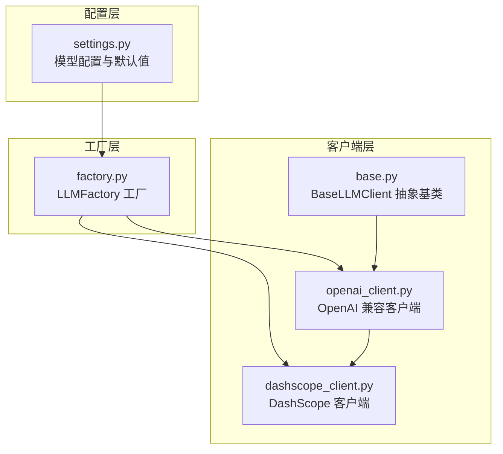
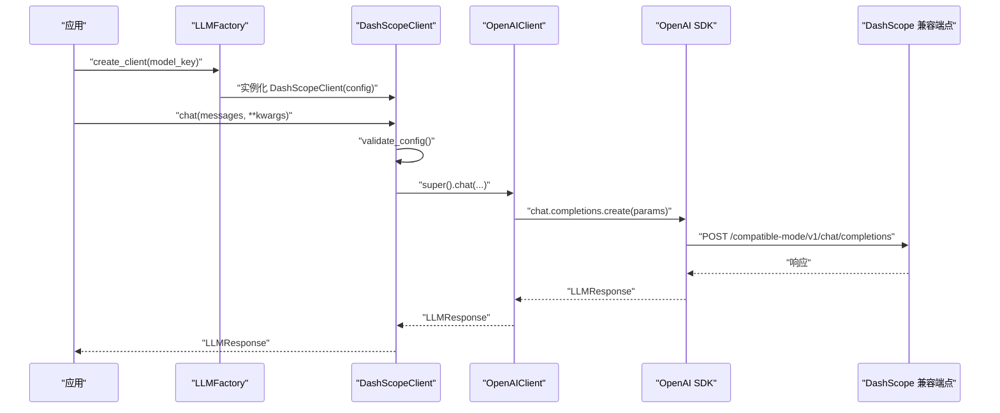
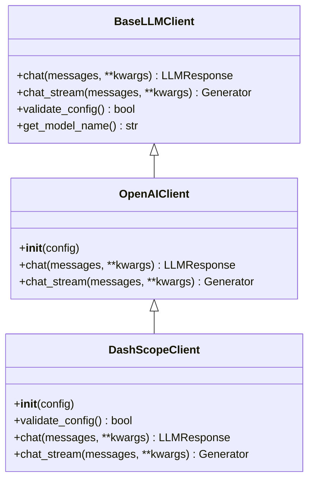
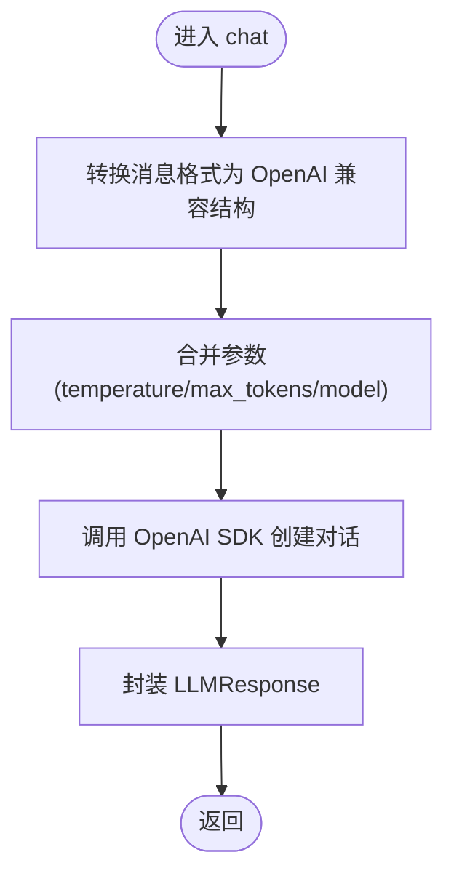
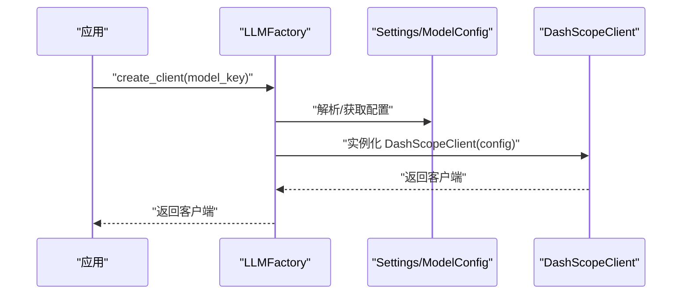
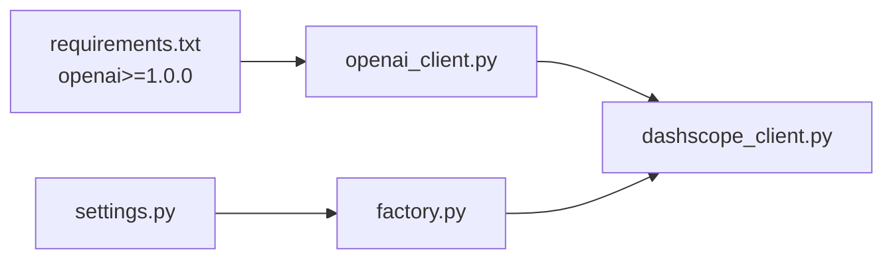

# DashScope 客户端

<cite>
**本文引用的文件**
- [dashscope_client.py](file://tools/llm/dashscope_client.py)
- [openai_client.py](file://tools/llm/openai_client.py)
- [base.py](file://tools/llm/base.py)
- [factory.py](file://tools/llm/factory.py)
- [settings.py](file://tools/config/settings.py)
- [API_USAGE.md](file://API_USAGE.md)
- [README.md](file://README.md)
- [requirements.txt](file://requirements.txt)
</cite>

## 目录
1. [简介](#简介)
2. [项目结构](#项目结构)
3. [核心组件](#核心组件)
4. [架构总览](#架构总览)
5. [详细组件分析](#详细组件分析)
6. [依赖分析](#依赖分析)
7. [性能考虑](#性能考虑)
8. [故障排查指南](#故障排查指南)
9. [结论](#结论)
10. [附录](#附录)

## 简介
本文件面向“DashScope 客户端”的实现与使用，重点说明：
- 通义千问系列模型的支持范围与命名
- 认证机制与请求格式（基于 OpenAI 兼容接口）
- 与 OpenAI API 的差异点（模型命名、参数配置、响应结构）
- 配置参数、API 密钥设置与调用示例
- 流式处理实现、错误处理策略与性能优化建议

## 项目结构
DashScope 客户端位于多 LLM 客户端体系中，采用“抽象基类 + 具体客户端 + 工厂 + 配置”的分层设计，便于统一接入不同供应商的 API。

图表来源
- [settings.py:12-146](file://tools/config/settings.py#L12-L146)
- [base.py:27-67](file://tools/llm/base.py#L27-L67)
- [openai_client.py:14-93](file://tools/llm/openai_client.py#L14-L93)
- [dashscope_client.py:12-66](file://tools/llm/dashscope_client.py#L12-L66)
- [factory.py:14-68](file://tools/llm/factory.py#L14-L68)

章节来源
- [settings.py:12-146](file://tools/config/settings.py#L12-L146)
- [factory.py:14-68](file://tools/llm/factory.py#L14-L68)

## 核心组件
- 抽象基类 BaseLLMClient：定义统一的聊天与流式接口、模型名称拼接与配置校验钩子。
- OpenAIClient：封装 OpenAI 兼容 API 的通用实现（非 DashScope 专属），负责消息格式转换、参数合并、同步与流式响应处理。
- DashScopeClient：继承 OpenAIClient，重写构造与配置校验，确保使用 DashScope 的兼容端点，并支持从环境变量自动注入 API Key。
- LLMFactory：根据 provider/model 解析配置，创建对应客户端实例；支持 dashscope 与 qwen 两种 provider 标识。
- Settings：集中管理模型配置、默认模型、环境变量与 .env 文件加载，内置 qwen/qwen-max、qwen-plus、qwen-turbo 的默认配置。

章节来源
- [base.py:27-67](file://tools/llm/base.py#L27-L67)
- [openai_client.py:14-93](file://tools/llm/openai_client.py#L14-L93)
- [dashscope_client.py:12-66](file://tools/llm/dashscope_client.py#L12-L66)
- [factory.py:14-68](file://tools/llm/factory.py#L14-L68)
- [settings.py:12-146](file://tools/config/settings.py#L12-L146)

## 架构总览
DashScope 客户端通过“OpenAI 兼容接口”对接 DashScope，内部复用 OpenAI 客户端的消息格式与参数传递逻辑，仅在端点与 API Key 注入上做差异化处理。

图表来源
- [factory.py:22-56](file://tools/llm/factory.py#L22-L56)
- [dashscope_client.py:23-57](file://tools/llm/dashscope_client.py#L23-L57)
- [openai_client.py:41-71](file://tools/llm/openai_client.py#L41-L71)

## 详细组件分析

### DashScopeClient 组件
- 继承 OpenAIClient，确保使用 OpenAI 兼容的请求格式与响应结构。
- 构造函数保证 base_url 为 DashScope 的兼容端点；provider 固定为 dashscope。
- 配置校验支持从环境变量 DASHSCOPE_API_KEY 自动注入 API Key，并重建 OpenAI 客户端实例。
- chat 与 chat_stream 直接委托给父类实现，保持与 OpenAI 兼容的参数与返回结构。

图表来源
- [base.py:27-67](file://tools/llm/base.py#L27-L67)
- [openai_client.py:14-93](file://tools/llm/openai_client.py#L14-L93)
- [dashscope_client.py:12-66](file://tools/llm/dashscope_client.py#L12-L66)

章节来源
- [dashscope_client.py:12-66](file://tools/llm/dashscope_client.py#L12-L66)

### OpenAIClient 组件
- 负责将内部 Message 列表转换为 OpenAI 兼容的 messages 结构。
- 合并温度、最大 token 等参数，调用 OpenAI SDK 的 chat.completions.create。
- 同步响应封装为 LLMResponse，包含 content、model、provider、usage、finish_reason、raw_response。
- 流式响应通过迭代 SDK 返回的流对象，逐段产出 delta.content。

图表来源
- [openai_client.py:41-71](file://tools/llm/openai_client.py#L41-L71)

章节来源
- [openai_client.py:14-93](file://tools/llm/openai_client.py#L14-L93)

### 工厂与配置
- LLMFactory 支持 openai、anthropic、gemini、ollama、dashscope、qwen 等 provider。
- 支持从 model_key 解析 provider/model，或直接传入 ModelConfig。
- Settings 内置 qwen/qwen-max、qwen-plus、qwen-turbo 的默认配置，base_url 指向 DashScope 兼容端点。

图表来源
- [factory.py:22-56](file://tools/llm/factory.py#L22-L56)
- [settings.py:108-129](file://tools/config/settings.py#L108-L129)

章节来源
- [factory.py:14-68](file://tools/llm/factory.py#L14-L68)
- [settings.py:12-146](file://tools/config/settings.py#L12-L146)

## 依赖分析
- 依赖 openai SDK（版本要求见 requirements.txt），用于构建 OpenAI 兼容的请求与响应。
- DashScopeClient 通过 OpenAIClient 的参数与响应结构，实现与 OpenAI API 的一致体验。
- 工厂与配置模块提供统一的模型与密钥管理，降低跨供应商切换成本。

图表来源
- [requirements.txt:4-7](file://requirements.txt#L4-L7)
- [openai_client.py:6-9](file://tools/llm/openai_client.py#L6-L9)
- [dashscope_client.py:8-9](file://tools/llm/dashscope_client.py#L8-L9)
- [factory.py:5-11](file://tools/llm/factory.py#L5-L11)
- [settings.py:12-36](file://tools/config/settings.py#L12-L36)

章节来源
- [requirements.txt:4-7](file://requirements.txt#L4-L7)
- [factory.py:5-11](file://tools/llm/factory.py#L5-L11)
- [settings.py:12-36](file://tools/config/settings.py#L12-L36)

## 性能考虑
- 流式输出：OpenAIClient 的 chat_stream 已内置流式处理，DashScopeClient 直接复用，减少首字节延迟与内存占用。
- 参数控制：通过 temperature 与 max_tokens 控制生成稳定性与长度，避免不必要的长上下文导致的延迟。
- 端点直连：DashScope 兼容端点与 OpenAI SDK 的连接复用，减少额外封装开销。
- 配置预热：通过工厂与 Settings 预加载配置，避免重复解析与 IO。

## 故障排查指南
- API Key 未设置
  - 现象：调用 chat 或 chat_stream 抛出异常，提示未设置 DASHSCOPE_API_KEY。
  - 处理：设置环境变量 DASHSCOPE_API_KEY，或在 .env 文件中配置；DashScopeClient 会在校验失败时尝试从环境变量注入并重建客户端。
- 端点问题
  - 现象：网络错误或 404/401。
  - 处理：确认 base_url 为 DashScope 兼容端点；若使用代理或内网，需确保可达性。
- 参数不兼容
  - 现象：某些供应商特有的参数在 DashScope 上不生效。
  - 处理：仅使用 OpenAI 兼容参数（如 temperature、max_tokens），避免使用供应商专有参数。
- 依赖缺失
  - 现象：ImportError 提示缺少 openai。
  - 处理：安装 openai SDK，参考 requirements.txt。

章节来源
- [dashscope_client.py:32-48](file://tools/llm/dashscope_client.py#L32-L48)
- [openai_client.py:22-23](file://tools/llm/openai_client.py#L22-L23)
- [requirements.txt:4-7](file://requirements.txt#L4-L7)

## 结论
DashScope 客户端通过继承 OpenAIClient，以最小改动实现了对通义千问系列模型的统一接入。其优势在于：
- 与 OpenAI API 的参数与响应保持一致，降低迁移成本；
- 支持从环境变量自动注入 API Key，提升易用性；
- 工厂与配置模块提供清晰的模型与密钥管理；
- 流式输出与参数控制兼顾性能与交互体验。

## 附录

### 与 OpenAI API 的差异
- 模型命名
  - OpenAI：如 gpt-4、gpt-4o、gpt-3.5-turbo
  - DashScope：qwen-max、qwen-plus、qwen-turbo
- 请求格式
  - 均为 OpenAI 兼容格式，参数名相同（model、messages、temperature、max_tokens、stream 等）
- 响应结构
  - 均封装为 LLMResponse，包含 content、model、provider、usage、finish_reason、raw_response
- 认证机制
  - 均通过 API Key 认证；DashScope 支持从环境变量自动注入

章节来源
- [openai_client.py:41-71](file://tools/llm/openai_client.py#L41-L71)
- [dashscope_client.py:15-21](file://tools/llm/dashscope_client.py#L15-L21)
- [settings.py:108-129](file://tools/config/settings.py#L108-L129)

### 配置参数与 API 密钥设置
- 环境变量
  - DASHSCOPE_API_KEY：DashScope API Key
- .env 文件
  - 复制 .env.example 为 .env，填入 DASHSCOPE_API_KEY
- 模型配置
  - 默认模型：qwen/qwen-max、qwen-plus、qwen-turbo
  - base_url：https://dashscope.aliyuncs.com/compatible-mode/v1
  - temperature：0.7
  - max_tokens：2000

章节来源
- [README.md:126-147](file://README.md#L126-L147)
- [API_USAGE.md:23-48](file://API_USAGE.md#L23-L48)
- [settings.py:108-129](file://tools/config/settings.py#L108-L129)

### 调用示例
- 使用 DashScope 模型进行对话
  - 示例命令：python chat.py --ex 前任 --model qwen/qwen-max
  - 示例命令：python chat.py --ex 前任 --model qwen/qwen-plus
  - 示例命令：python chat.py --ex 前任 --model qwen/qwen-turbo
- 列出可用模型
  - 示例命令：python chat.py --list-models

章节来源
- [API_USAGE.md:50-75](file://API_USAGE.md#L50-L75)
- [README.md:148-168](file://README.md#L148-L168)