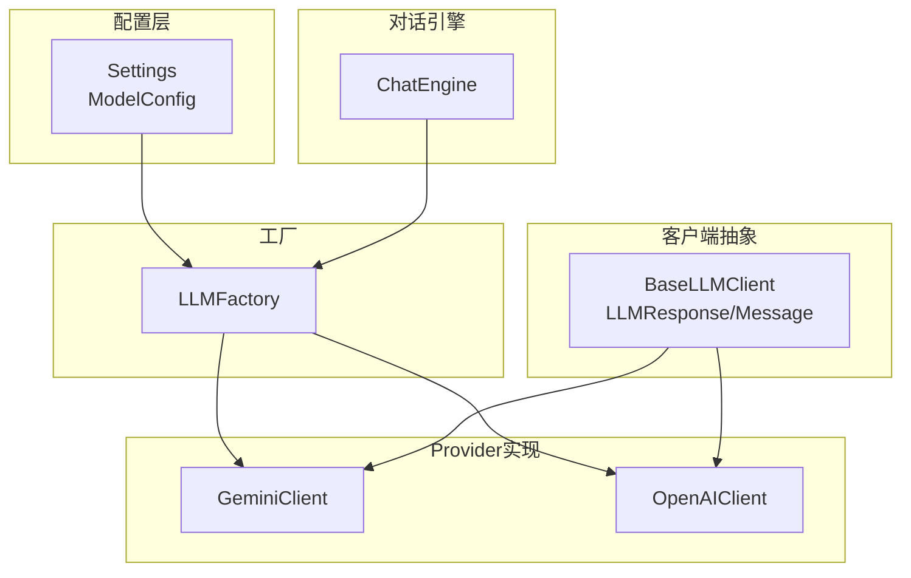
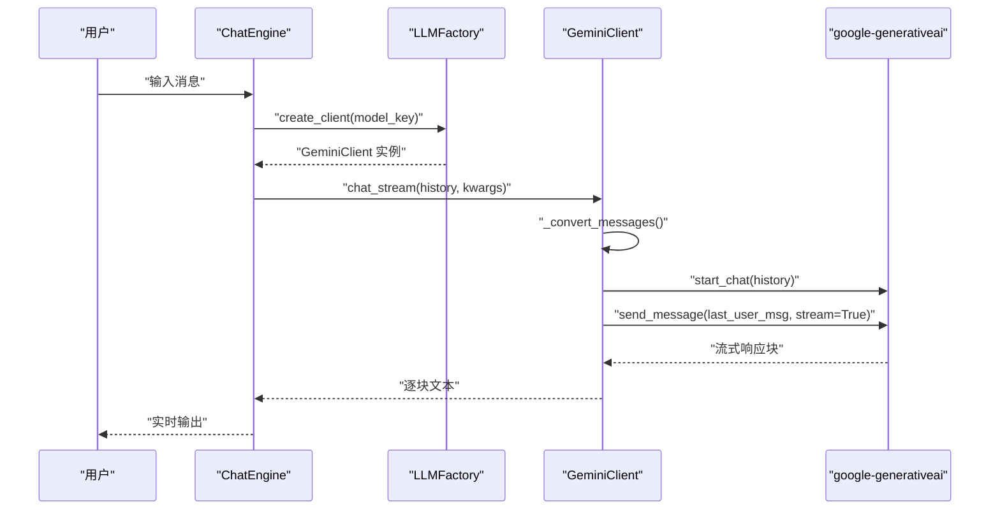
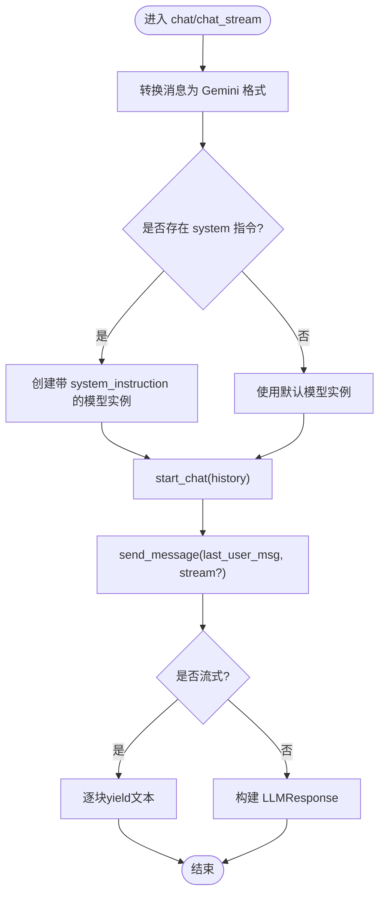
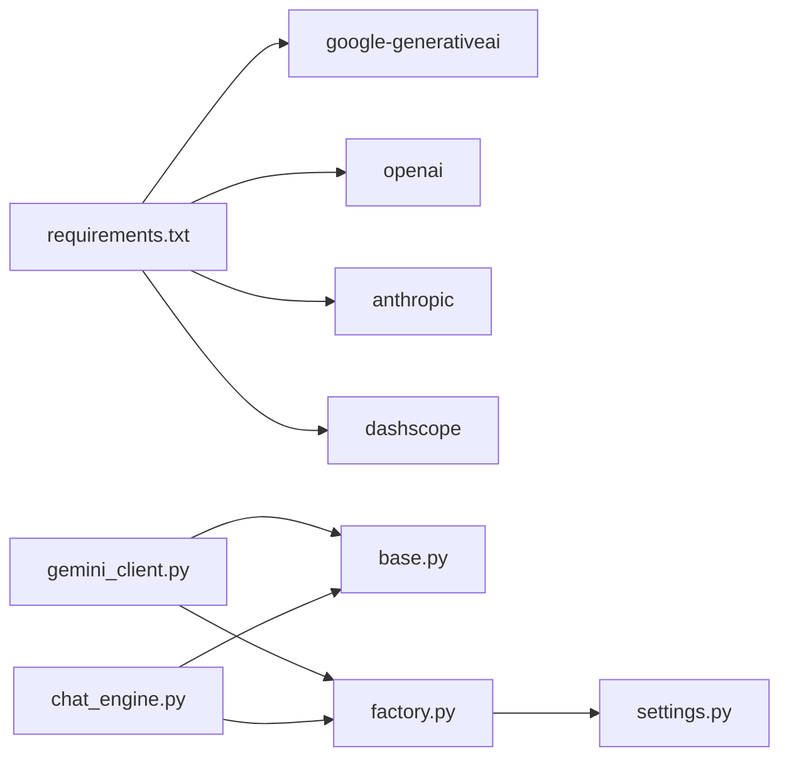

# Google Gemini 客户端

<cite>
**本文引用的文件**
- [tools/llm/gemini_client.py](file://tools/llm/gemini_client.py)
- [tools/llm/base.py](file://tools/llm/base.py)
- [tools/llm/factory.py](file://tools/llm/factory.py)
- [tools/config/settings.py](file://tools/config/settings.py)
- [tools/chat_engine.py](file://tools/chat_engine.py)
- [API_USAGE.md](file://API_USAGE.md)
- [README.md](file://README.md)
- [chat.py](file://chat.py)
- [requirements.txt](file://requirements.txt)
- [tools/llm/openai_client.py](file://tools/llm/openai_client.py)
</cite>

## 目录
1. [简介](#简介)
2. [项目结构](#项目结构)
3. [核心组件](#核心组件)
4. [架构总览](#架构总览)
5. [详细组件分析](#详细组件分析)
6. [依赖关系分析](#依赖关系分析)
7. [性能考量](#性能考量)
8. [故障排查指南](#故障排查指南)
9. [结论](#结论)
10. [附录](#附录)

## 简介
本文件面向Google Gemini客户端的实现进行深入技术文档化，重点覆盖以下方面：
- Google Cloud认证与API密钥配置
- 模型选择与会话管理
- 与OpenAI API的差异对比（内容格式、安全设置、配额管理）
- 具体配置参数、服务账号与调用示例
- 流式处理实现与错误码映射
- 调试技巧与常见问题排查

本项目采用统一的抽象接口与工厂模式，支持多Provider（OpenAI、Anthropic、Gemini、DashScope、Ollama）无缝切换，Gemini客户端作为其中一员，遵循相同的调用协议与消息格式约定。

## 项目结构
项目采用模块化设计，围绕“配置管理—客户端抽象—具体Provider实现—工厂—对话引擎”的层次组织：
- 配置层：集中管理各Provider的API Key、模型参数与默认值
- 客户端层：抽象统一的聊天与流式接口
- Provider实现：针对不同Provider的消息格式与能力做适配
- 工厂层：根据模型键创建对应客户端实例
- 对话引擎：封装系统提示、历史会话与调用流程

图表来源
- [tools/config/settings.py:12-225](file://tools/config/settings.py#L12-L225)
- [tools/llm/base.py:27-68](file://tools/llm/base.py#L27-L68)
- [tools/llm/gemini_client.py:13-119](file://tools/llm/gemini_client.py#L13-L119)
- [tools/llm/openai_client.py:14-93](file://tools/llm/openai_client.py#L14-L93)
- [tools/llm/factory.py:14-82](file://tools/llm/factory.py#L14-L82)
- [tools/chat_engine.py:60-284](file://tools/chat_engine.py#L60-L284)

章节来源
- [tools/config/settings.py:12-225](file://tools/config/settings.py#L12-L225)
- [tools/llm/base.py:27-68](file://tools/llm/base.py#L27-L68)
- [tools/llm/gemini_client.py:13-119](file://tools/llm/gemini_client.py#L13-L119)
- [tools/llm/factory.py:14-82](file://tools/llm/factory.py#L14-L82)
- [tools/chat_engine.py:60-284](file://tools/chat_engine.py#L60-L284)

## 核心组件
- 抽象基类与响应模型
  - 统一的聊天与流式接口定义，便于扩展新Provider
  - 标准化的响应对象，包含内容、模型、Provider、用量与原始响应
- Gemini客户端
  - 基于google-generativeai SDK，负责配置、消息转换、会话管理与流式输出
- 工厂与配置
  - 工厂根据模型键创建对应客户端；配置支持环境变量与.env文件注入
- 对话引擎
  - 封装系统提示、历史会话、调用流程与命令处理

章节来源
- [tools/llm/base.py:8-68](file://tools/llm/base.py#L8-L68)
- [tools/llm/gemini_client.py:13-119](file://tools/llm/gemini_client.py#L13-L119)
- [tools/llm/factory.py:14-82](file://tools/llm/factory.py#L14-L82)
- [tools/config/settings.py:12-225](file://tools/config/settings.py#L12-L225)
- [tools/chat_engine.py:60-284](file://tools/chat_engine.py#L60-L284)

## 架构总览
Gemini客户端在整体架构中的位置如下：
- 配置层提供模型键与API Key，工厂根据键映射到具体客户端
- 客户端负责消息格式转换与调用细节
- 对话引擎负责系统提示注入与历史会话维护

图表来源
- [tools/chat_engine.py:206-228](file://tools/chat_engine.py#L206-L228)
- [tools/llm/factory.py:22-56](file://tools/llm/factory.py#L22-L56)
- [tools/llm/gemini_client.py:91-119](file://tools/llm/gemini_client.py#L91-L119)

## 详细组件分析

### Gemini客户端实现要点
- 认证与初始化
  - 通过配置中的API Key进行SDK配置
  - 基于模型名创建GenerativeModel实例
- 消息格式转换
  - 将通用Message结构转换为Gemini的contents数组与system_instruction
  - system消息单独处理，其余角色映射为user/model
- 会话管理
  - 使用start_chat建立会话，历史消息作为history传入
  - 最后一条用户消息单独发送，其余作为上下文
- 流式输出
  - send_message(stream=True)逐块返回文本
  - 逐块yield给上层引擎，实现边生成边显示

图表来源
- [tools/llm/gemini_client.py:30-119](file://tools/llm/gemini_client.py#L30-L119)

章节来源
- [tools/llm/gemini_client.py:13-119](file://tools/llm/gemini_client.py#L13-L119)

### 与OpenAI API的差异
- 内容格式
  - OpenAI：messages数组，每条包含role与content
  - Gemini：system_instruction与contents数组，user/model角色映射
- 安全设置与配额
  - 本实现未显式设置Safety设置与配额参数；若需启用，可在SDK层面扩展
- 用量统计
  - OpenAI：返回usage字段（prompt/completion/total tokens）
  - Gemini：当前实现返回usage为None（SDK未提供token统计）

章节来源
- [tools/llm/openai_client.py:41-93](file://tools/llm/openai_client.py#L41-L93)
- [tools/llm/gemini_client.py:82-89](file://tools/llm/gemini_client.py#L82-L89)

### 配置参数与服务账号设置
- 环境变量
  - GEMINI_API_KEY：Gemini API Key
  - OPENAI_API_KEY、ANTHROPIC_API_KEY、DASHSCOPE_API_KEY：其他Provider的Key
- .env文件
  - 复制.env.example为.env，填入对应Key
- 模型配置
  - 支持默认Provider与模型，以及自定义模型键（如gemini/gemini-pro）
  - 温度与最大token等参数可按需调整

章节来源
- [API_USAGE.md:23-49](file://API_USAGE.md#L23-L49)
- [tools/config/settings.py:12-225](file://tools/config/settings.py#L12-L225)

### 调用示例与CLI集成
- CLI使用
  - 列出技能与模型：--list-skills、--list-models
  - 指定模型：--model gemini/gemini-pro
  - 禁用流式：--no-stream
  - 参数：--temperature、--max-tokens
- 对话命令
  - /quit、/q、exit：退出
  - /clear：清空历史
  - /info：查看Skill信息

章节来源
- [chat.py:51-127](file://chat.py#L51-L127)
- [chat.py:128-201](file://chat.py#L128-L201)
- [API_USAGE.md:50-98](file://API_USAGE.md#L50-L98)

### 流式处理实现
- 上层引擎逐块接收并输出
- 客户端逐块yield文本，保证低延迟体验
- 历史会话在流式结束后一次性追加完整回复

章节来源
- [tools/chat_engine.py:206-228](file://tools/chat_engine.py#L206-L228)
- [tools/llm/gemini_client.py:91-119](file://tools/llm/gemini_client.py#L91-L119)

## 依赖关系分析
- 外部依赖
  - google-generativeai：Gemini SDK
  - openai、anthropic、dashscope：其他Provider（按需安装）
- 内部依赖
  - GeminiClient依赖BaseLLMClient与LLMResponse/Message
  - LLMFactory依赖Settings与各Provider客户端
  - ChatEngine依赖LLMFactory与Message

图表来源
- [requirements.txt:1-12](file://requirements.txt#L1-L12)
- [tools/llm/gemini_client.py:10](file://tools/llm/gemini_client.py#L10)
- [tools/llm/factory.py:5-11](file://tools/llm/factory.py#L5-L11)
- [tools/chat_engine.py:12-14](file://tools/chat_engine.py#L12-L14)

章节来源
- [requirements.txt:1-12](file://requirements.txt#L1-L12)
- [tools/llm/gemini_client.py:10](file://tools/llm/gemini_client.py#L10)
- [tools/llm/factory.py:5-11](file://tools/llm/factory.py#L5-L11)
- [tools/chat_engine.py:12-14](file://tools/chat_engine.py#L12-L14)

## 性能考量
- 流式输出降低首字延迟，提升交互体验
- 会话历史尽量精简，避免超出上下文长度限制
- 温度与max_tokens影响生成稳定性与长度，建议按场景调优
- Gemini当前未返回token用量，无法进行精细化配额控制

## 故障排查指南
- ImportError：请先安装google-generativeai
- 找不到Gemini API Key：检查环境变量或.env文件
- 找不到前任Skill：确认Skill目录存在且包含SKILL.md或memory.md/persona.md
- Ollama连接失败：确保Ollama服务已启动

章节来源
- [tools/llm/gemini_client.py:18](file://tools/llm/gemini_client.py#L18)
- [API_USAGE.md:140-163](file://API_USAGE.md#L140-L163)
- [chat.py:185-196](file://chat.py#L185-L196)

## 结论
本Gemini客户端实现遵循统一抽象与工厂模式，具备清晰的消息格式转换、会话管理与流式输出能力。与OpenAI相比，Gemini在消息结构与用量统计方面存在差异，需在SDK层面补充安全设置与配额管理。通过配置层与CLI工具，用户可便捷地进行密钥配置与模型选择，实现稳定高效的对话体验。

## 附录
- 支持的Provider与模型
  - Gemini：gemini-pro、gemini-1.5-flash
- CLI常用命令
  - 列出模型：--list-models
  - 指定模型：--model gemini/gemini-pro
  - 禁用流式：--no-stream
  - 参数：--temperature、--max-tokens

章节来源
- [API_USAGE.md:7-13](file://API_USAGE.md#L7-L13)
- [API_USAGE.md:50-98](file://API_USAGE.md#L50-L98)
- [README.md:170-179](file://README.md#L170-L179)