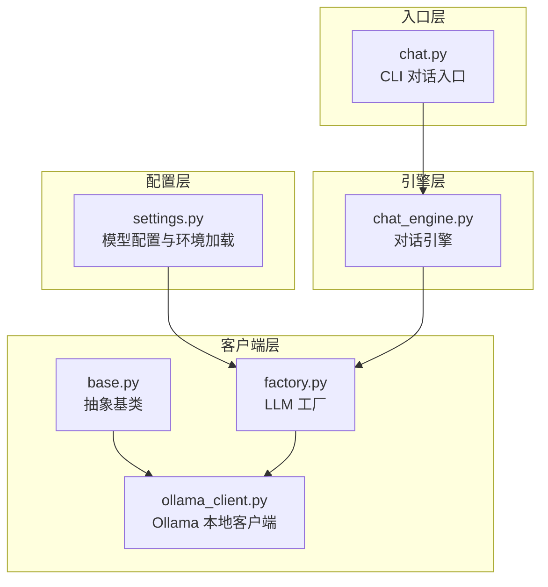
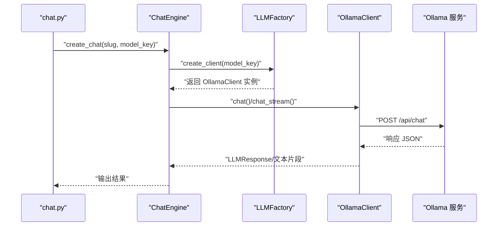
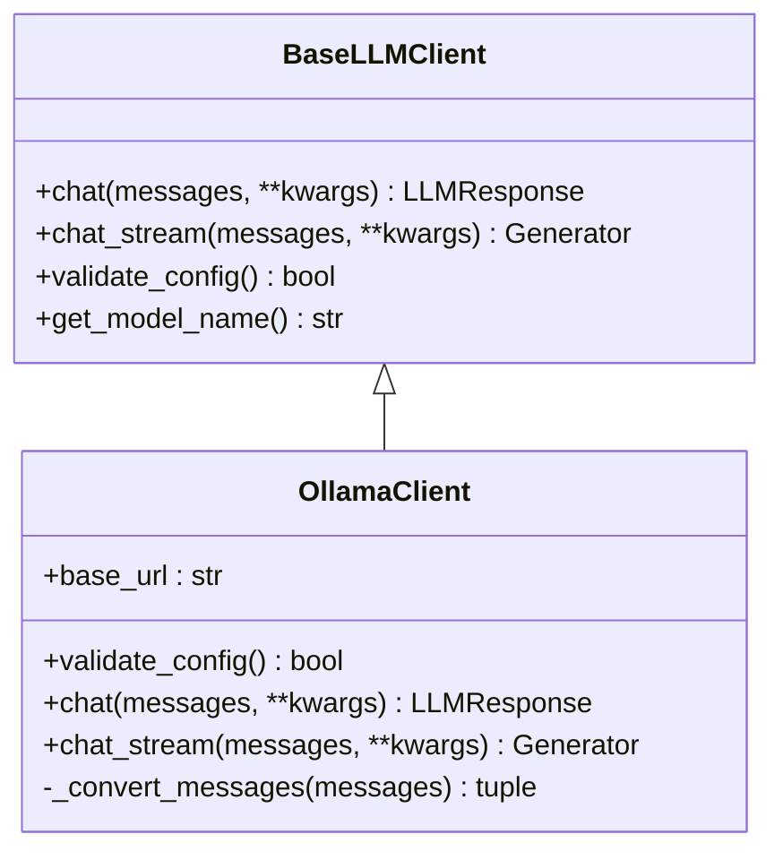
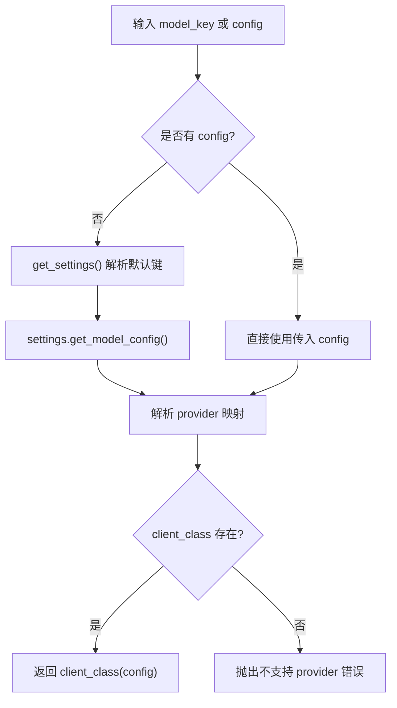
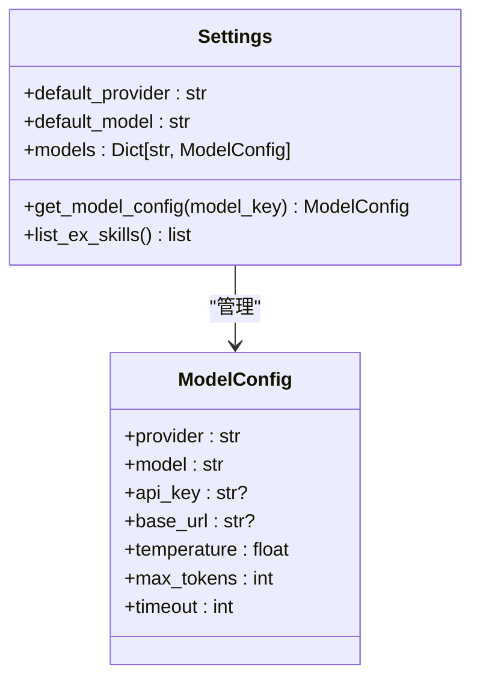
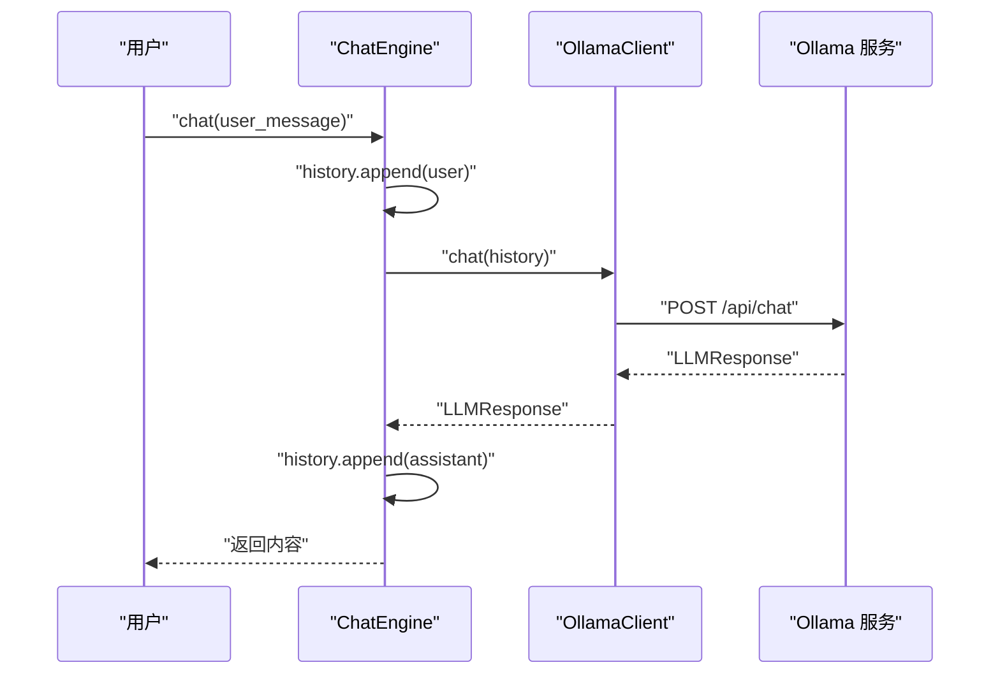
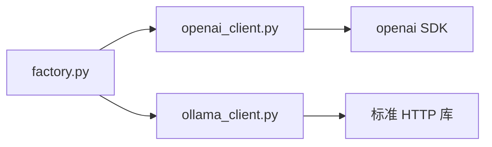

# Ollama 本地客户端

<cite>
**本文引用的文件**
- [ollama_client.py](file://tools/llm/ollama_client.py)
- [base.py](file://tools/llm/base.py)
- [factory.py](file://tools/llm/factory.py)
- [settings.py](file://tools/config/settings.py)
- [chat_engine.py](file://tools/chat_engine.py)
- [chat.py](file://chat.py)
- [openai_client.py](file://tools/llm/openai_client.py)
- [API_USAGE.md](file://API_USAGE.md)
- [README.md](file://README.md)
- [requirements.txt](file://requirements.txt)
</cite>

## 目录
1. [简介](#简介)
2. [项目结构](#项目结构)
3. [核心组件](#核心组件)
4. [架构总览](#架构总览)
5. [详细组件分析](#详细组件分析)
6. [依赖关系分析](#依赖关系分析)
7. [性能与资源特性](#性能与资源特性)
8. [配置与调用示例](#配置与调用示例)
9. [与云端 API 的差异](#与云端-api-的差异)
10. [故障排除指南](#故障排除指南)
11. [结论](#结论)

## 简介
本文件面向“Ollama 本地客户端”的实现与使用，聚焦于本地模型加载、推理执行与资源管理，对比云端 API 的差异（模型选择、内存占用与性能特征），并提供配置参数、本地模型设置与调用示例，以及模型下载、推理优化与故障排除指南。读者可据此在本地部署 Ollama 并通过统一接口进行对话推理。

## 项目结构
该项目采用模块化设计，围绕“配置管理 + 客户端抽象 + 工厂模式 + 对话引擎 + CLI”组织代码，便于扩展新的 LLM 提供商与本地模型。

图表来源
- [settings.py:1-225](file://tools/config/settings.py#L1-L225)
- [factory.py:1-82](file://tools/llm/factory.py#L1-L82)
- [ollama_client.py:1-126](file://tools/llm/ollama_client.py#L1-L126)
- [base.py:1-68](file://tools/llm/base.py#L1-L68)
- [chat_engine.py:1-284](file://tools/chat_engine.py#L1-L284)
- [chat.py:1-201](file://chat.py#L1-L201)

章节来源
- [README.md:281-321](file://README.md#L281-L321)
- [API_USAGE.md:164-181](file://API_USAGE.md#L164-L181)

## 核心组件
- 抽象基类与响应模型：定义统一的消息与响应结构，约束各客户端实现。
- Ollama 本地客户端：基于 HTTP 请求对接 Ollama 服务，支持同步与流式对话。
- 工厂模式：根据模型键（provider/model）创建对应客户端实例。
- 配置系统：集中管理模型配置、默认模型、环境变量与 .env 文件加载。
- 对话引擎：封装系统提示、历史消息、模型选择与调用流程。
- CLI 入口：提供命令行交互、模型列表、技能列表与参数控制。

章节来源
- [base.py:8-68](file://tools/llm/base.py#L8-L68)
- [ollama_client.py:11-126](file://tools/llm/ollama_client.py#L11-L126)
- [factory.py:14-82](file://tools/llm/factory.py#L14-L82)
- [settings.py:12-225](file://tools/config/settings.py#L12-L225)
- [chat_engine.py:60-284](file://tools/chat_engine.py#L60-L284)
- [chat.py:128-201](file://chat.py#L128-L201)

## 架构总览
Ollama 本地客户端通过 HTTP 接口与本地 Ollama 服务通信，遵循统一的客户端抽象与工厂模式，使上层对话引擎与 CLI 能以一致方式调用不同提供商的模型。

图表来源
- [chat.py:178-183](file://chat.py#L178-L183)
- [chat_engine.py:273-284](file://tools/chat_engine.py#L273-L284)
- [factory.py:23-56](file://tools/llm/factory.py#L23-L56)
- [ollama_client.py:49-126](file://tools/llm/ollama_client.py#L49-L126)

## 详细组件分析

### Ollama 本地客户端（OllamaClient）
- 继承自 BaseLLMClient，实现 chat 与 chat_stream。
- 默认 base_url 为 http://localhost:11434；可通过配置覆盖。
- 支持同步与流式两种推理模式，均通过 /api/chat 接口提交消息与参数。
- 通过 validate_config 检测 /api/tags 可用性，作为服务连通性校验。
- 将消息列表转换为 Ollama 格式，支持 system 消息与 options（如 temperature）传递。

图表来源
- [base.py:27-68](file://tools/llm/base.py#L27-L68)
- [ollama_client.py:11-126](file://tools/llm/ollama_client.py#L11-L126)

章节来源
- [ollama_client.py:17-32](file://tools/llm/ollama_client.py#L17-L32)
- [ollama_client.py:33-47](file://tools/llm/ollama_client.py#L33-L47)
- [ollama_client.py:49-88](file://tools/llm/ollama_client.py#L49-L88)
- [ollama_client.py:89-126](file://tools/llm/ollama_client.py#L89-L126)

### 工厂模式（LLMFactory）
- 根据 provider 映射到具体客户端类，支持 openai、anthropic、gemini、ollama、dashscope、qwen。
- 支持直接传入 ModelConfig 或通过模型键解析配置。
- 提供单例缓存（按 model_key）与可用模型列表查询。

图表来源
- [factory.py:23-56](file://tools/llm/factory.py#L23-L56)
- [factory.py:58-82](file://tools/llm/factory.py#L58-L82)

章节来源
- [factory.py:14-82](file://tools/llm/factory.py#L14-L82)

### 配置系统（Settings 与 ModelConfig）
- ModelConfig 定义 provider、model、api_key、base_url、temperature、max_tokens、timeout 等字段。
- Settings 支持默认模型初始化、.env 文件加载与环境变量覆盖。
- 通过环境变量 OLLAMA_MODELS 与 OLLAMA_BASE_URL 动态注入本地模型配置，默认模型包括 llama2、mistral、qwen2.5。

图表来源
- [settings.py:12-36](file://tools/config/settings.py#L12-L36)
- [settings.py:38-225](file://tools/config/settings.py#L38-L225)

章节来源
- [settings.py:12-36](file://tools/config/settings.py#L12-L36)
- [settings.py:57-147](file://tools/config/settings.py#L57-L147)
- [settings.py:162-190](file://tools/config/settings.py#L162-L190)

### 对话引擎（ChatEngine）
- 负责加载 Skill 数据（SKILL.md 或 memory/persona 分离文件）、构建系统提示、维护对话历史。
- 通过 LLMFactory 创建客户端，支持 chat 与 chat_stream 两种调用方式。
- 提供历史清理、模型信息与 Skill 信息查询。

图表来源
- [chat_engine.py:181-204](file://tools/chat_engine.py#L181-L204)
- [ollama_client.py:49-88](file://tools/llm/ollama_client.py#L49-L88)

章节来源
- [chat_engine.py:60-284](file://tools/chat_engine.py#L60-L284)

### CLI 入口（chat.py）
- 提供 --ex/--slug、--model、--list-skills、--list-models、--no-stream、--temperature、--max-tokens 等参数。
- 支持交互式对话、命令处理（/quit、/clear、/info）与异常处理。

章节来源
- [chat.py:128-201](file://chat.py#L128-L201)

## 依赖关系分析
- Ollama 本地客户端不依赖第三方 LLM SDK，而是通过标准 HTTP 请求与 Ollama 服务交互，降低外部依赖复杂度。
- 其他云端客户端（如 OpenAI）依赖对应 SDK，需要额外安装依赖。
- 工厂模式屏蔽了具体客户端差异，便于扩展与替换。

图表来源
- [openai_client.py:6-9](file://tools/llm/openai_client.py#L6-L9)
- [ollama_client.py:3-8](file://tools/llm/ollama_client.py#L3-L8)
- [factory.py:7-11](file://tools/llm/factory.py#L7-L11)

章节来源
- [requirements.txt:1-12](file://requirements.txt#L1-L12)
- [openai_client.py:6-9](file://tools/llm/openai_client.py#L6-L9)
- [ollama_client.py:3-8](file://tools/llm/ollama_client.py#L3-L8)

## 性能与资源特性
- 本地模型推理在本机执行，避免网络延迟，适合低延迟交互与隐私敏感场景。
- Ollama 服务占用显存/内存取决于所选模型大小与上下文长度；建议根据硬件能力选择合适模型。
- 流式输出可提升感知速度，减少等待时间；同步模式适合一次性完整响应。
- 由于不涉及云端 API 调用，无 token 计费与用量统计，但需关注本地资源与稳定性。

[本节为通用性能讨论，不直接分析特定文件]

## 配置与调用示例

### 环境与模型配置
- 通过环境变量 OLLAMA_MODELS 与 OLLAMA_BASE_URL 注入本地模型与服务地址，默认包含 llama2、mistral、qwen2.5。
- 若需自定义模型，可在 .env 中设置相应键值，或在代码中动态创建 ModelConfig 并传入 LLMFactory。

章节来源
- [settings.py:132-144](file://tools/config/settings.py#L132-L144)
- [API_USAGE.md:120-139](file://API_USAGE.md#L120-L139)

### 模型下载与本地服务
- 使用 Ollama 官方安装程序安装服务，并拉取所需模型。
- 确保 Ollama 服务在默认端口运行，或通过 base_url 覆盖。

章节来源
- [API_USAGE.md:122-138](file://API_USAGE.md#L122-L138)

### CLI 调用示例
- 列出可用技能与模型：--list-skills、--list-models
- 与指定技能对话：--ex {slug} --model ollama/llama2
- 禁用流式输出：--no-stream
- 调整温度与最大 token：--temperature 0.7 --max-tokens 2000

章节来源
- [chat.py:128-201](file://chat.py#L128-L201)
- [API_USAGE.md:50-75](file://API_USAGE.md#L50-L75)

## 与云端 API 的差异
- 模型选择
  - 云端：需提供 API Key，支持多厂商模型（OpenAI、Anthropic、Google、DashScope）。
  - 本地：无需 API Key，直接使用本地 Ollama 模型（如 llama2、mistral、qwen2.5）。
- 内存占用
  - 云端：无本地资源占用，但受限于服务商资源与并发限制。
  - 本地：占用本机显存/内存，模型越大占用越高；需根据硬件评估。
- 性能特征
  - 云端：存在网络往返延迟，响应时间受带宽与服务器负载影响。
  - 本地：无网络延迟，推理速度取决于本地硬件；流式输出可改善交互体验。
- 隐私与可控性
  - 云端：需信任第三方服务的数据处理策略。
  - 本地：数据完全在本地处理，隐私可控。

章节来源
- [API_USAGE.md:7-13](file://API_USAGE.md#L7-L13)
- [README.md:170-179](file://README.md#L170-L179)

## 故障排除指南
- ImportError：缺少第三方 SDK
  - 现象：提示未安装 openai、anthropic 或 google-generativeai。
  - 处理：安装 requirements.txt 中声明的依赖。
- 找不到前任 Skill
  - 现象：找不到 exes/{slug} 目录或文件。
  - 处理：确认已创建 Skill，或使用 --list-skills 查看可用列表。
- API Key 无效
  - 现象：使用云端模型时报错。
  - 处理：检查环境变量或 .env 文件中的 API Key 设置。
- Ollama 连接失败
  - 现象：无法连接到 http://localhost:11434。
  - 处理：确保 Ollama 服务已启动（ollama serve），或通过 base_url 指定正确地址。

章节来源
- [chat.py:185-196](file://chat.py#L185-L196)
- [API_USAGE.md:140-162](file://API_USAGE.md#L140-L162)

## 结论
Ollama 本地客户端通过简洁的 HTTP 接口与工厂模式，实现了与云端 API 的统一调用体验。其优势在于零 API Key、低延迟与隐私可控，适用于本地推理与低网络开销场景。结合对话引擎与 CLI，用户可快速切换不同模型（包括本地与云端）进行推理与调试。建议根据硬件能力选择合适模型，并在 .env 中合理配置温度、最大 token 等参数以优化体验。