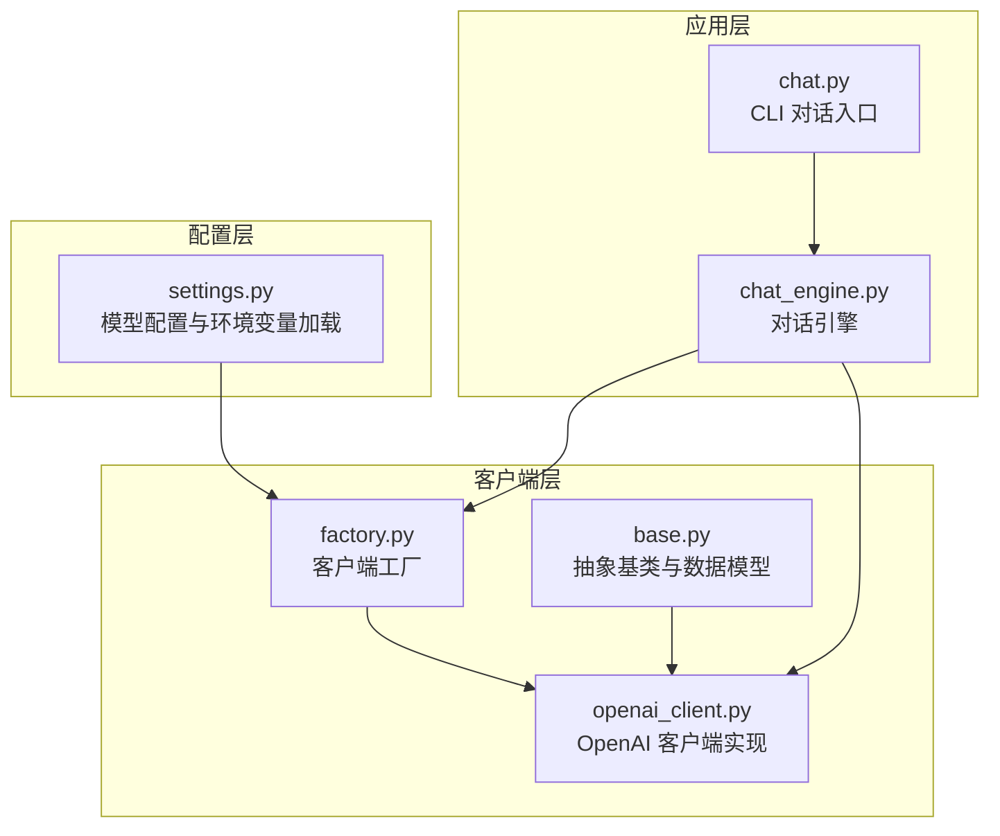
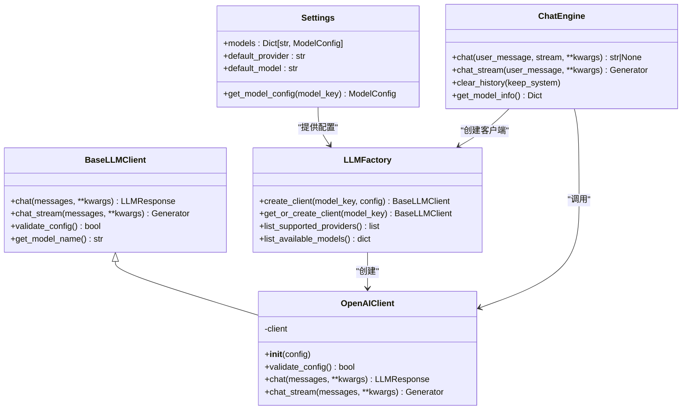
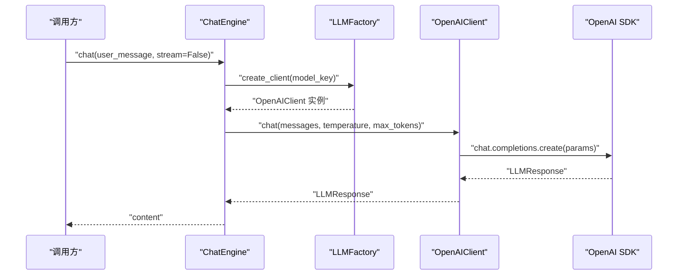
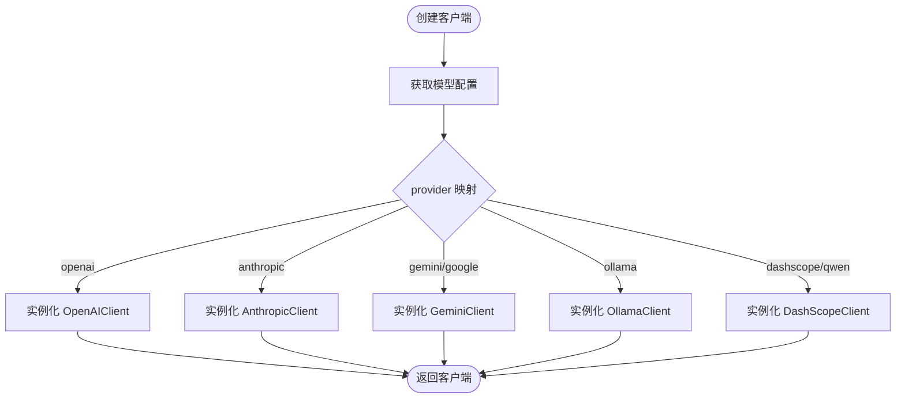
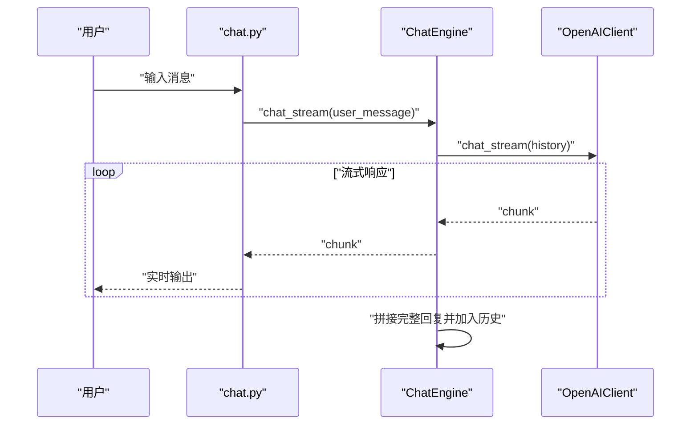
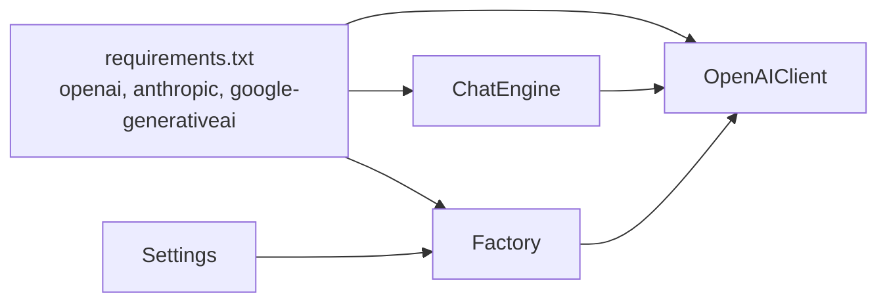

# OpenAI 客户端

<cite>
**本文引用的文件**
- [openai_client.py](file://tools/llm/openai_client.py)
- [base.py](file://tools/llm/base.py)
- [factory.py](file://tools/llm/factory.py)
- [settings.py](file://tools/config/settings.py)
- [chat_engine.py](file://tools/chat_engine.py)
- [chat.py](file://chat.py)
- [API_USAGE.md](file://API_USAGE.md)
- [README.md](file://README.md)
- [requirements.txt](file://requirements.txt)
</cite>

## 目录
1. [简介](#简介)
2. [项目结构](#项目结构)
3. [核心组件](#核心组件)
4. [架构总览](#架构总览)
5. [详细组件分析](#详细组件分析)
6. [依赖关系分析](#依赖关系分析)
7. [性能考量](#性能考量)
8. [故障排查指南](#故障排查指南)
9. [结论](#结论)
10. [附录](#附录)

## 简介
本文件面向“OpenAI 官方 API 客户端”的实现进行系统化技术文档整理，重点覆盖以下方面：
- 初始化配置与密钥校验流程
- 消息格式转换与参数合并策略
- 响应处理与使用统计
- 对 OpenAI 官方 API 以及兼容 OpenAI 格式的第三方 API（如 DeepSeek、Moonshot 等）的支持特性
- 配置参数、环境变量、SDK 集成与调用示例
- 流式与非流式对话的实现细节
- 错误处理策略与最佳实践

## 项目结构
该项目采用模块化设计，围绕“配置管理 + 客户端抽象 + 工厂 + 对话引擎 + CLI”组织代码，其中 OpenAI 客户端作为多厂商 LLM 客户端之一，通过统一抽象接口对外提供一致能力。

图表来源
- [settings.py:1-225](file://tools/config/settings.py#L1-L225)
- [factory.py:1-82](file://tools/llm/factory.py#L1-L82)
- [base.py:1-68](file://tools/llm/base.py#L1-L68)
- [openai_client.py:1-93](file://tools/llm/openai_client.py#L1-L93)
- [chat_engine.py:1-284](file://tools/chat_engine.py#L1-L284)
- [chat.py:1-201](file://chat.py#L1-L201)

章节来源
- [README.md:281-321](file://README.md#L281-L321)
- [API_USAGE.md:164-181](file://API_USAGE.md#L164-L181)

## 核心组件
- 抽象基类与数据模型：定义统一的消息、响应数据结构与客户端接口规范，保证不同提供商客户端的一致行为契约。
- OpenAI 客户端：基于官方 SDK 进行封装，负责配置校验、消息格式转换、参数合并、请求与响应处理。
- 客户端工厂：依据配置动态创建具体客户端实例，支持多提供商映射与单例缓存。
- 配置系统：集中管理模型配置、默认提供商与模型、环境变量与 .env 文件加载、本地模型扩展等。
- 对话引擎：承载对话历史、系统提示构建、非流式与流式对话调度。
- CLI：提供命令行入口，支持列出技能、列出模型、交互式对话等。

章节来源
- [base.py:8-68](file://tools/llm/base.py#L8-L68)
- [openai_client.py:14-93](file://tools/llm/openai_client.py#L14-L93)
- [factory.py:14-82](file://tools/llm/factory.py#L14-L82)
- [settings.py:12-225](file://tools/config/settings.py#L12-L225)
- [chat_engine.py:60-284](file://tools/chat_engine.py#L60-L284)
- [chat.py:128-201](file://chat.py#L128-L201)

## 架构总览
OpenAI 客户端在整体架构中的位置如下：

图表来源
- [base.py:27-68](file://tools/llm/base.py#L27-L68)
- [openai_client.py:14-93](file://tools/llm/openai_client.py#L14-L93)
- [factory.py:14-82](file://tools/llm/factory.py#L14-L82)
- [settings.py:38-225](file://tools/config/settings.py#L38-L225)
- [chat_engine.py:60-284](file://tools/chat_engine.py#L60-L284)

## 详细组件分析

### OpenAI 客户端实现
- 初始化与配置校验
  - 通过构造函数接收配置对象，校验 API Key 是否存在；若提供 base_url，则将其传递给底层 SDK，从而支持兼容 OpenAI 格式的第三方服务端点。
  - 若未安装官方 SDK，抛出 ImportError 并提示安装依赖。
- 消息格式转换
  - 将内部消息结构转换为 OpenAI API 所需的 role/content 字典列表，确保与官方格式一致。
- 参数合并
  - 统一从配置与调用参数中获取 temperature、max_tokens 等参数，形成最终请求参数字典。
- 非流式对话
  - 调用官方 SDK 的 chat.completions.create，解析返回的 choices 与 usage，封装为统一响应对象，包含内容、模型、提供商、用量统计与结束原因等。
- 流式对话
  - 将 stream 参数设为 True，遍历返回的流式响应，逐段产出 delta.content，实现边生成边输出。

图表来源
- [chat_engine.py:181-204](file://tools/chat_engine.py#L181-L204)
- [openai_client.py:41-71](file://tools/llm/openai_client.py#L41-L71)

章节来源
- [openai_client.py:20-39](file://tools/llm/openai_client.py#L20-L39)
- [openai_client.py:41-71](file://tools/llm/openai_client.py#L41-L71)
- [openai_client.py:73-93](file://tools/llm/openai_client.py#L73-L93)

### 客户端工厂与配置系统
- 客户端工厂
  - 支持根据 provider 映射创建对应客户端；内置单例缓存，避免重复创建。
  - 提供支持的提供商列表与可用模型清单查询。
- 配置系统
  - ModelConfig 支持 provider、model、api_key、base_url、temperature、max_tokens、timeout 等字段。
  - 自动从环境变量读取 API Key（按提供商映射），支持 .env 文件加载。
  - 默认模型集合包含 OpenAI、Anthropic、Gemini、DashScope（通义千问）、Ollama 本地模型等。
  - 支持通过环境变量扩展本地模型列表与默认 base_url。

图表来源
- [factory.py:22-56](file://tools/llm/factory.py#L22-L56)
- [settings.py:12-225](file://tools/config/settings.py#L12-L225)

章节来源
- [factory.py:14-82](file://tools/llm/factory.py#L14-L82)
- [settings.py:12-225](file://tools/config/settings.py#L12-L225)

### 对话引擎与 CLI
- 对话引擎
  - 负责加载 Skill 数据、构建系统提示、维护对话历史、调度非流式与流式对话。
  - 非流式：调用客户端 chat，将返回内容加入历史。
  - 流式：逐段产出文本片段，结束后拼接完整内容并加入历史。
- CLI
  - 支持列出技能、列出模型、交互式对话、禁用流式输出、设置温度与最大 token 数等。
  - 错误处理：捕获 FileNotFoundError、ImportError 等并给出明确提示。

图表来源
- [chat.py:72-126](file://chat.py#L72-L126)
- [chat_engine.py:206-228](file://tools/chat_engine.py#L206-L228)
- [openai_client.py:73-93](file://tools/llm/openai_client.py#L73-L93)

章节来源
- [chat_engine.py:60-284](file://tools/chat_engine.py#L60-L284)
- [chat.py:128-201](file://chat.py#L128-L201)

## 依赖关系分析
- OpenAI 客户端依赖官方 SDK；工厂与配置系统分别负责客户端创建与参数注入；对话引擎与 CLI 作为上层调用者。
- 第三方兼容：通过在配置中设置 base_url，即可将 OpenAI 客户端用于兼容 OpenAI 格式的第三方服务端点（例如 DeepSeek、Moonshot 等）。

图表来源
- [requirements.txt:4-8](file://requirements.txt#L4-L8)
- [openai_client.py:6-9](file://tools/llm/openai_client.py#L6-L9)
- [factory.py:5-11](file://tools/llm/factory.py#L5-L11)
- [settings.py:38-225](file://tools/config/settings.py#L38-L225)

章节来源
- [requirements.txt:1-12](file://requirements.txt#L1-L12)
- [API_USAGE.md:99-118](file://API_USAGE.md#L99-L118)

## 性能考量
- 流式输出：在需要低延迟体验时启用流式输出，逐段产出文本，提升交互流畅度。
- 参数调优：temperature 与 max_tokens 影响生成稳定性与长度，建议根据任务场景调整。
- 本地模型：通过 Ollama 本地部署可降低网络延迟与成本，适合离线或内网场景。
- 单例客户端：工厂提供单例缓存，减少重复初始化开销。

[本节为通用指导，不直接分析具体文件]

## 故障排查指南
- 未安装 SDK
  - 现象：ImportError 提示安装 openai。
  - 处理：安装依赖或按需安装 anthropic、google-generativeai。
- 找不到前任 Skill
  - 现象：FileNotFoundError。
  - 处理：确认 Skill 已创建且位于 exes/{slug}/ 目录。
- API Key 无效
  - 现象：请求被拒绝或报错。
  - 处理：检查环境变量或 .env 文件中的 API Key 设置。
- Ollama 连接失败
  - 现象：无法连接本地模型。
  - 处理：确保 Ollama 服务已启动并监听默认端口。
- 第三方兼容端点
  - 现象：请求格式不匹配或鉴权失败。
  - 处理：在配置中设置正确的 base_url 与 API Key，并确认第三方服务支持 OpenAI 兼容端点。

章节来源
- [API_USAGE.md:140-162](file://API_USAGE.md#L140-L162)
- [README.md:126-147](file://README.md#L126-L147)

## 结论
OpenAI 客户端在本项目中承担“统一抽象 + 兼容第三方”的关键角色。其设计要点包括：
- 严格的配置校验与灵活的端点定制（base_url）以支持第三方兼容服务。
- 明确的消息格式转换与参数合并策略，确保与官方 API 一致。
- 完整的非流式与流式对话实现，满足不同交互需求。
- 与工厂、配置系统、对话引擎、CLI 的协同，形成清晰的分层架构。

[本节为总结性内容，不直接分析具体文件]

## 附录

### 配置参数与环境变量
- 模型配置字段
  - provider：提供商（如 openai）
  - model：模型名称（如 gpt-4o）
  - api_key：API 密钥（可从环境变量自动读取）
  - base_url：自定义端点（用于兼容第三方服务）
  - temperature：采样温度
  - max_tokens：最大生成 token 数
  - timeout：请求超时
- 环境变量映射
  - OPENAI_API_KEY、ANTHROPIC_API_KEY、GEMINI_API_KEY、DASHSCOPE_API_KEY
- .env 文件加载
  - 从项目根目录 .env 文件读取键值对，自动注入至进程环境

章节来源
- [settings.py:12-36](file://tools/config/settings.py#L12-L36)
- [settings.py:148-161](file://tools/config/settings.py#L148-L161)
- [settings.py:162-190](file://tools/config/settings.py#L162-L190)

### SDK 集成与调用示例
- 安装依赖
  - 安装 openai、anthropic、google-generativeai 等所需 SDK。
- CLI 使用
  - 列出技能与模型、交互式对话、禁用流式输出、设置温度与最大 token 数。
- 代码中使用
  - 通过工厂创建客户端，传入自定义配置（含 base_url）以接入第三方兼容服务。

章节来源
- [requirements.txt:4-8](file://requirements.txt#L4-L8)
- [API_USAGE.md:17-75](file://API_USAGE.md#L17-L75)
- [API_USAGE.md:99-118](file://API_USAGE.md#L99-L118)
- [chat.py:128-196](file://chat.py#L128-L196)

### 流式与非流式对话实现细节
- 非流式
  - 构造消息列表与参数，调用 chat.completions.create，解析 choices 与 usage，封装响应。
- 流式
  - 设置 stream=True，遍历响应流，逐段产出 delta.content，拼接完整回复并加入历史。

章节来源
- [openai_client.py:41-71](file://tools/llm/openai_client.py#L41-L71)
- [openai_client.py:73-93](file://tools/llm/openai_client.py#L73-L93)
- [chat_engine.py:181-228](file://tools/chat_engine.py#L181-L228)