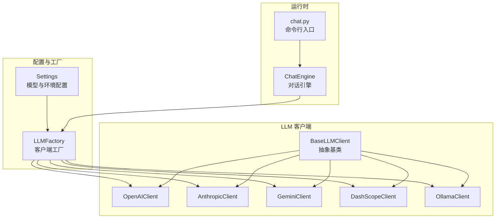
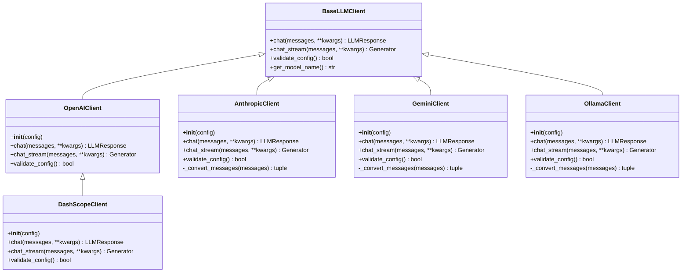
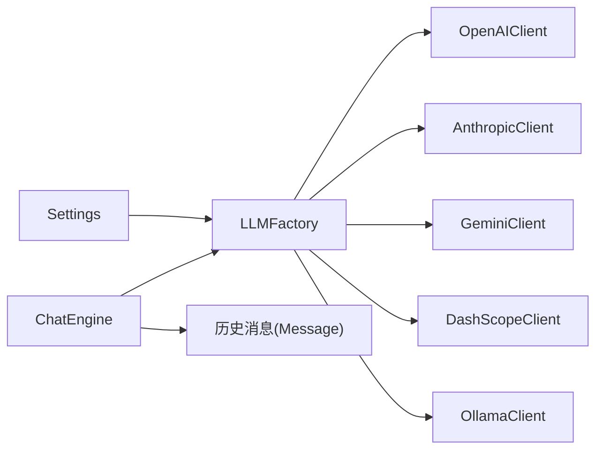

# 提供商客户端

<cite>
**本文引用的文件**
- [tools/llm/base.py](file://tools/llm/base.py)
- [tools/llm/openai_client.py](file://tools/llm/openai_client.py)
- [tools/llm/anthropic_client.py](file://tools/llm/anthropic_client.py)
- [tools/llm/gemini_client.py](file://tools/llm/gemini_client.py)
- [tools/llm/dashscope_client.py](file://tools/llm/dashscope_client.py)
- [tools/llm/ollama_client.py](file://tools/llm/ollama_client.py)
- [tools/llm/factory.py](file://tools/llm/factory.py)
- [tools/config/settings.py](file://tools/config/settings.py)
- [tools/chat_engine.py](file://tools/chat_engine.py)
- [API_USAGE.md](file://API_USAGE.md)
- [README.md](file://README.md)
- [requirements.txt](file://requirements.txt)
- [chat.py](file://chat.py)
</cite>

## 目录
1. [简介](#简介)
2. [项目结构](#项目结构)
3. [核心组件](#核心组件)
4. [架构总览](#架构总览)
5. [详细组件分析](#详细组件分析)
6. [依赖关系分析](#依赖关系分析)
7. [性能与成本考量](#性能与成本考量)
8. [配置与环境变量](#配置与环境变量)
9. [SDK 集成与最佳实践](#sdk-集成与最佳实践)
10. [调用示例与迁移指南](#调用示例与迁移指南)
11. [故障排除指南](#故障排除指南)
12. [结论](#结论)

## 简介
本文件面向多 LLM 提供商客户端的实现与使用，覆盖 OpenAI、Anthropic、Google Gemini、DashScope（通义千问）、Ollama 等。内容包括：
- 各提供商的客户端实现特点：API 调用方式、认证机制、请求格式、响应处理、错误处理策略
- API 差异、性能特征、成本考量与使用限制的对比
- 配置参数、环境变量、SDK 集成方法与最佳实践
- 具体调用示例、故障排除与迁移注意事项

## 项目结构
围绕 LLM 客户端的核心模块组织如下：
- 抽象基类与通用数据结构：tools/llm/base.py
- 各提供商客户端：openai_client.py、anthropic_client.py、gemini_client.py、dashscope_client.py、ollama_client.py
- 客户端工厂：tools/llm/factory.py
- 配置与环境变量：tools/config/settings.py
- 对话引擎与 CLI：tools/chat_engine.py、chat.py
- 使用指南与安装：API_USAGE.md、README.md、requirements.txt

图表来源
- [tools/llm/factory.py:14-56](file://tools/llm/factory.py#L14-L56)
- [tools/config/settings.py:39-190](file://tools/config/settings.py#L39-L190)
- [tools/llm/base.py:27-67](file://tools/llm/base.py#L27-L67)
- [tools/chat_engine.py:60-82](file://tools/chat_engine.py#L60-L82)
- [chat.py:81-118](file://chat.py#L81-L118)

章节来源
- [tools/llm/factory.py:14-56](file://tools/llm/factory.py#L14-L56)
- [tools/config/settings.py:39-190](file://tools/config/settings.py#L39-L190)
- [tools/llm/base.py:27-67](file://tools/llm/base.py#L27-L67)
- [tools/chat_engine.py:60-82](file://tools/chat_engine.py#L60-L82)
- [chat.py:81-118](file://chat.py#L81-L118)

## 核心组件
- 抽象基类 BaseLLMClient：统一 chat 与 chat_stream 接口，提供配置校验与模型名拼接能力
- LLMResponse/Message：标准化响应与消息结构
- LLMFactory：根据 provider 与模型键创建具体客户端实例
- Settings/ModelConfig：集中管理 API Key、base_url、温度、最大 token、超时等配置；支持从环境变量与 .env 文件读取

章节来源
- [tools/llm/base.py:8-67](file://tools/llm/base.py#L8-L67)
- [tools/llm/factory.py:22-56](file://tools/llm/factory.py#L22-L56)
- [tools/config/settings.py:12-36](file://tools/config/settings.py#L12-L36)

## 架构总览
各提供商客户端均继承自 BaseLLMClient，遵循统一接口规范；DashScopeClient 继承 OpenAIClient 并设置兼容端点；OllamaClient 采用本地 HTTP API 调用。工厂根据 provider 映射到具体实现。

图表来源
- [tools/llm/base.py:27-67](file://tools/llm/base.py#L27-L67)
- [tools/llm/openai_client.py:14-93](file://tools/llm/openai_client.py#L14-L93)
- [tools/llm/anthropic_client.py:13-99](file://tools/llm/anthropic_client.py#L13-L99)
- [tools/llm/gemini_client.py:13-119](file://tools/llm/gemini_client.py#L13-L119)
- [tools/llm/dashscope_client.py:12-67](file://tools/llm/dashscope_client.py#L12-L67)
- [tools/llm/ollama_client.py:11-126](file://tools/llm/ollama_client.py#L11-L126)

## 详细组件分析

### OpenAI 客户端（OpenAIClient）
- 认证机制：通过 OpenAI SDK 初始化，使用 api_key；支持自定义 base_url（用于兼容第三方 OpenAI 兼容端点）
- 请求格式：将消息列表转为 role/content 字典数组，合并 temperature 与 max_tokens
- 响应处理：封装 choices[0].message.content、usage、finish_reason 等
- 错误处理：依赖 SDK 抛出异常；若未安装 SDK，构造函数抛 ImportError
- 流式输出：启用 stream=True，逐块产出 delta.content

章节来源
- [tools/llm/openai_client.py:20-33](file://tools/llm/openai_client.py#L20-L33)
- [tools/llm/openai_client.py:41-71](file://tools/llm/openai_client.py#L41-L71)
- [tools/llm/openai_client.py:73-93](file://tools/llm/openai_client.py#L73-L93)

### Anthropic 客户端（AnthropicClient）
- 认证机制：anthropic SDK 初始化，使用 api_key
- 请求格式：将 system 消息分离为 system 参数，其余消息转为 user/assistant 列表
- 响应处理：content[0].text、usage.input_tokens/output_tokens、stop_reason
- 错误处理：依赖 SDK 抛出异常；未安装 SDK 时抛 ImportError
- 流式输出：使用 messages.stream，遍历 text_stream

章节来源
- [tools/llm/anthropic_client.py:16-21](file://tools/llm/anthropic_client.py#L16-L21)
- [tools/llm/anthropic_client.py:29-51](file://tools/llm/anthropic_client.py#L29-L51)
- [tools/llm/anthropic_client.py:53-79](file://tools/llm/anthropic_client.py#L53-L79)
- [tools/llm/anthropic_client.py:81-99](file://tools/llm/anthropic_client.py#L81-L99)

### Google Gemini 客户端（GeminiClient）
- 认证机制：google-generativeai SDK 初始化，configure(api_key)，创建 GenerativeModel
- 请求格式：system_instruction 与 contents（role: user/model, parts: [content]）
- 响应处理：response.text；不返回 token 使用信息
- 错误处理：依赖 SDK 抛出异常；未安装 SDK 时抛 ImportError
- 流式输出：start_chat + send_message(stream=True)，遍历 chunk.text

章节来源
- [tools/llm/gemini_client.py:16-22](file://tools/llm/gemini_client.py#L16-L22)
- [tools/llm/gemini_client.py:30-52](file://tools/llm/gemini_client.py#L30-L52)
- [tools/llm/gemini_client.py:54-89](file://tools/llm/gemini_client.py#L54-L89)
- [tools/llm/gemini_client.py:91-119](file://tools/llm/gemini_client.py#L91-L119)

### DashScope 客户端（DashScopeClient）
- 认证机制：继承 OpenAIClient，强制 base_url 指向 DashScope 兼容端点；支持从 DASHSCOPE_API_KEY 环境变量读取
- 请求格式：与 OpenAI 兼容，复用 OpenAIClient 的消息转换与参数合并
- 响应处理：复用 OpenAI 响应封装
- 错误处理：若未设置 API Key，尝试从环境变量读取并重建客户端；否则抛出 ValueError
- 流式输出：复用 OpenAIClient 的流式实现

章节来源
- [tools/llm/dashscope_client.py:23-30](file://tools/llm/dashscope_client.py#L23-L30)
- [tools/llm/dashscope_client.py:32-48](file://tools/llm/dashscope_client.py#L32-L48)
- [tools/llm/dashscope_client.py:50-66](file://tools/llm/dashscope_client.py#L50-L66)

### Ollama 客户端（OllamaClient）
- 认证机制：本地 HTTP 调用，无需 API Key
- 请求格式：POST /api/chat，body 包含 model、messages、stream、options.temperature；可选 system
- 响应处理：解析 JSON，取 message.content；finish_reason 依据 done 字段
- 错误处理：连接失败抛出 ConnectionError，提示检查 Ollama 服务状态与 base_url
- 流式输出：逐行读取 JSONL，解析 message.content

章节来源
- [tools/llm/ollama_client.py:17-19](file://tools/llm/ollama_client.py#L17-L19)
- [tools/llm/ollama_client.py:21-31](file://tools/llm/ollama_client.py#L21-L31)
- [tools/llm/ollama_client.py:33-47](file://tools/llm/ollama_client.py#L33-L47)
- [tools/llm/ollama_client.py:49-88](file://tools/llm/ollama_client.py#L49-L88)
- [tools/llm/ollama_client.py:89-126](file://tools/llm/ollama_client.py#L89-L126)

### 客户端工厂（LLMFactory）
- 根据 provider 映射到具体客户端类；支持 openai、anthropic、gemini、google、ollama、dashscope、qwen
- 支持单例缓存；提供列出支持的 provider 与可用模型清单的能力

章节来源
- [tools/llm/factory.py:42-56](file://tools/llm/factory.py#L42-L56)
- [tools/llm/factory.py:58-68](file://tools/llm/factory.py#L58-L68)
- [tools/llm/factory.py:70-81](file://tools/llm/factory.py#L70-L81)

### 配置与环境变量（Settings/ModelConfig）
- ModelConfig：provider、model、api_key、base_url、temperature、max_tokens、timeout
- Settings：默认模型集合、从 .env 文件加载、按 provider 自动读取对应环境变量
- Ollama 模型可通过 OLLAMA_MODELS 与 OLLAMA_BASE_URL 动态注入

章节来源
- [tools/config/settings.py:12-36](file://tools/config/settings.py#L12-L36)
- [tools/config/settings.py:39-190](file://tools/config/settings.py#L39-L190)

## 依赖关系分析
- SDK 依赖：OpenAI、Anthropic、Google Gemini 分别需要对应 SDK；Ollama 为本地 HTTP 调用，无需额外 SDK
- 工厂映射：provider 到客户端类的静态映射，便于扩展新提供商
- 运行时耦合：ChatEngine 通过工厂创建客户端，统一消息历史与系统提示

图表来源
- [tools/llm/factory.py:42-56](file://tools/llm/factory.py#L42-L56)
- [tools/chat_engine.py:60-82](file://tools/chat_engine.py#L60-L82)
- [tools/llm/base.py:19-25](file://tools/llm/base.py#L19-L25)

章节来源
- [requirements.txt:4-7](file://requirements.txt#L4-L7)
- [tools/llm/factory.py:42-56](file://tools/llm/factory.py#L42-L56)
- [tools/chat_engine.py:60-82](file://tools/chat_engine.py#L60-L82)

## 性能与成本考量
- OpenAI/Gemini/DashScope：依赖云端 API，具备 token 使用统计（除 Gemini 外），适合高质量与稳定性要求高的场景
- Anthropic：Claude 系列在推理与长文上表现突出，适合复杂对话与思维链任务
- Ollama：本地部署，零 API 成本，延迟低，但算力与显存受限于本地硬件
- 选择建议：对成本敏感与隐私要求高时优先 Ollama；对质量与稳定性要求高时优先 OpenAI/Gemini；对特定推理风格偏好时考虑 Anthropic

## 配置与环境变量
- 环境变量
  - OPENAI_API_KEY：OpenAI
  - ANTHROPIC_API_KEY：Anthropic
  - GEMINI_API_KEY：Google Gemini
  - DASHSCOPE_API_KEY：DashScope（通义千问）
  - OLLAMA_MODELS：逗号分隔的本地模型名，默认 llama2,mistral,qwen2.5
  - OLLAMA_BASE_URL：本地 Ollama 服务地址，默认 http://localhost:11434
- .env 文件：复制 .env.example 并填入密钥
- CLI 参数：--model、--temperature、--max-tokens、--no-stream 等

章节来源
- [tools/config/settings.py:24-35](file://tools/config/settings.py#L24-L35)
- [API_USAGE.md:23-48](file://API_USAGE.md#L23-L48)
- [API_USAGE.md:77-87](file://API_USAGE.md#L77-L87)
- [README.md:126-147](file://README.md#L126-L147)

## SDK 集成与最佳实践
- 安装依赖：requirements.txt 中声明 openai、anthropic、google-generativeai；Pillow 为可选
- 第三方 OpenAI 兼容端点：通过 ModelConfig.base_url 指定，工厂自动识别为 openai 类型
- 本地模型：确保 Ollama 服务已启动，CLI 使用 ollama/{model} 模型键
- 最佳实践
  - 明确区分 system、user、assistant 角色，避免混用
  - 合理设置 temperature 与 max_tokens，平衡创造性与稳定性
  - 对流式输出进行缓冲与刷新，提升交互体验
  - 对异常进行分类处理（网络、认证、模型不可用）

章节来源
- [requirements.txt:4-7](file://requirements.txt#L4-L7)
- [API_USAGE.md:99-118](file://API_USAGE.md#L99-L118)
- [API_USAGE.md:120-138](file://API_USAGE.md#L120-L138)

## 调用示例与迁移指南
- 命令行示例
  - 列出技能与模型：--list-skills、--list-models
  - 指定模型：--model openai/gpt-4o、anthropic/claude-3-opus、gemini/gemini-pro、qwen/qwen-max、ollama/llama2
- 迁移注意事项
  - 从 Claude Code 版本迁移：使用 chat.py 替代 /create-ex 与 /{slug}，保持数据解析与 Skill 结构兼容
  - 从单一提供商迁移到多提供商：通过工厂与配置中心切换 provider 与模型键
  - 从云端迁移到本地：替换模型键为 ollama/{model}，确保 Ollama 服务可用

章节来源
- [API_USAGE.md:50-75](file://API_USAGE.md#L50-L75)
- [API_USAGE.md:183-191](file://API_USAGE.md#L183-L191)
- [README.md:102-168](file://README.md#L102-L168)

## 故障排除指南
- ImportError：未安装对应 SDK（openai、anthropic、google-generativeai）
- 找不到前任 Skill：确认 exes/{slug}/ 目录存在
- API Key 无效：检查环境变量或 .env 文件
- Ollama 连接失败：确保 ollama serve 已启动，base_url 正确
- 流式输出异常：检查网络与超时设置，必要时禁用流式输出

章节来源
- [API_USAGE.md:140-163](file://API_USAGE.md#L140-L163)
- [tools/llm/ollama_client.py:86-87](file://tools/llm/ollama_client.py#L86-L87)
- [tools/llm/ollama_client.py:124-125](file://tools/llm/ollama_client.py#L124-L125)

## 结论
本项目通过统一的抽象基类与工厂模式，实现了对多家 LLM 提供商的一致接入。OpenAI、Anthropic、Gemini、DashScope、Ollama 各有其适用场景与约束，结合配置中心与 CLI 工具，可在不同需求间灵活切换。建议在生产环境中结合成本、隐私与性能目标，选择合适的提供商与模型，并建立完善的配置与监控体系。