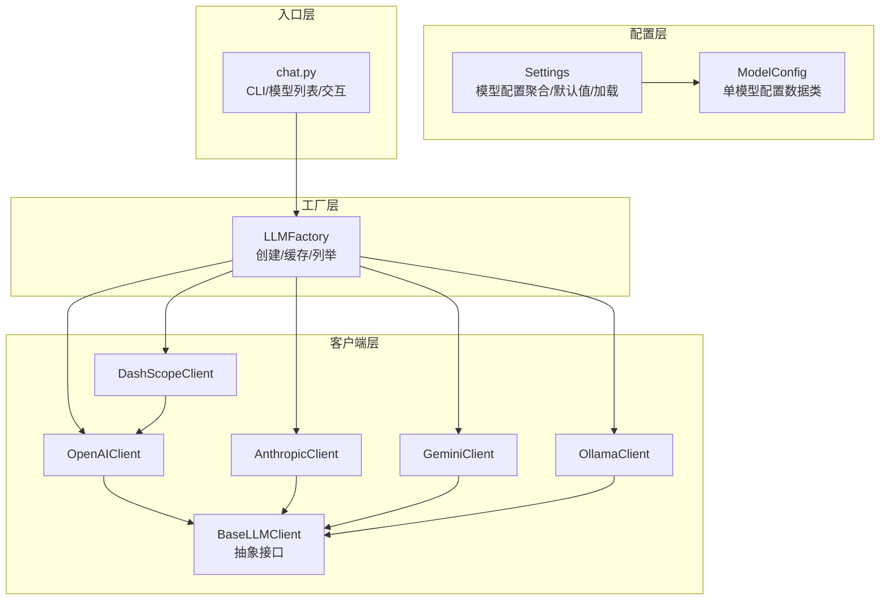
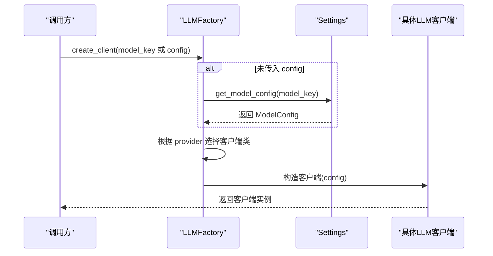
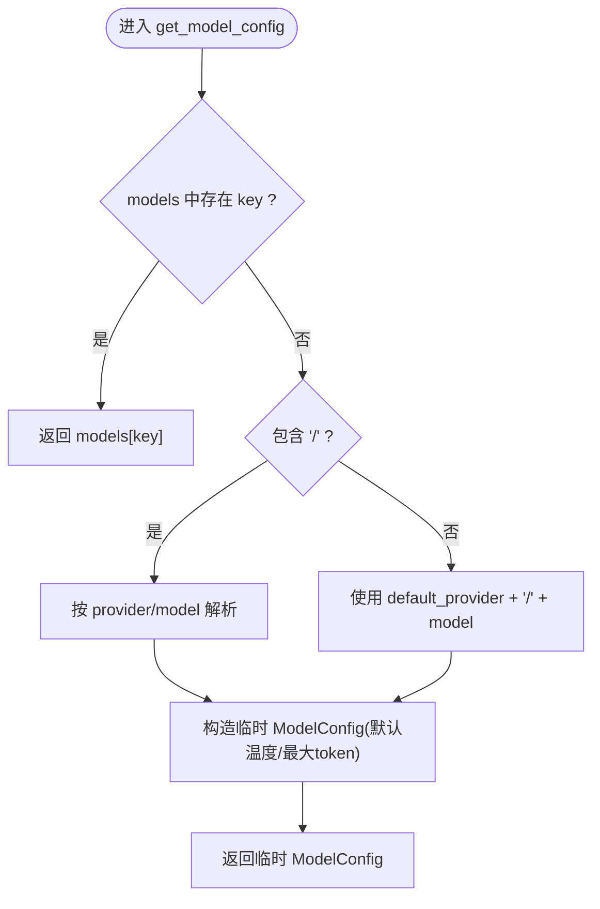
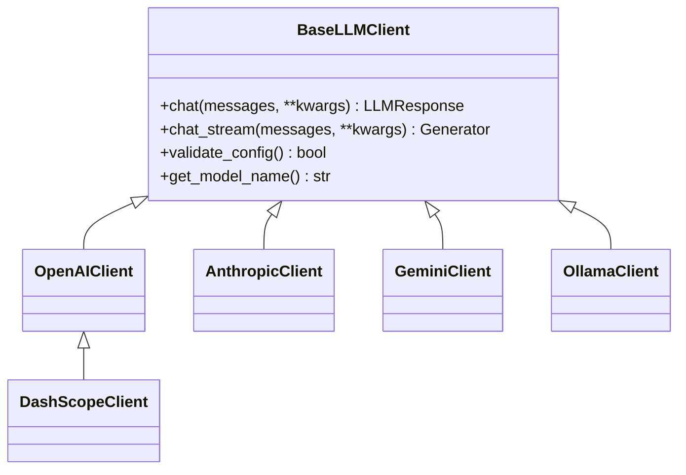
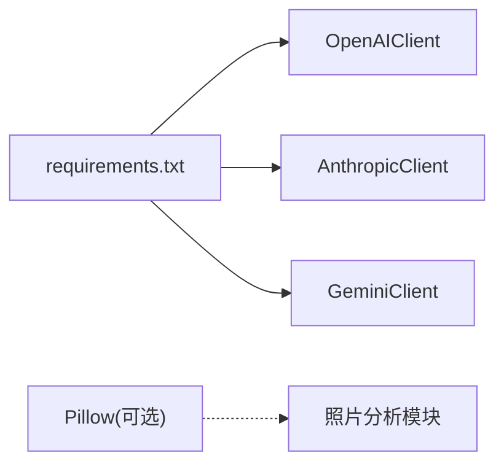

# 配置管理

<cite>
**本文引用的文件**
- [tools/config/settings.py](file://tools/config/settings.py)
- [tools/llm/factory.py](file://tools/llm/factory.py)
- [tools/llm/base.py](file://tools/llm/base.py)
- [tools/llm/openai_client.py](file://tools/llm/openai_client.py)
- [tools/llm/anthropic_client.py](file://tools/llm/anthropic_client.py)
- [tools/llm/gemini_client.py](file://tools/llm/gemini_client.py)
- [tools/llm/ollama_client.py](file://tools/llm/ollama_client.py)
- [tools/llm/dashscope_client.py](file://tools/llm/dashscope_client.py)
- [chat.py](file://chat.py)
- [README.md](file://README.md)
- [API_USAGE.md](file://API_USAGE.md)
- [requirements.txt](file://requirements.txt)
</cite>

## 目录
1. [简介](#简介)
2. [项目结构](#项目结构)
3. [核心组件](#核心组件)
4. [架构总览](#架构总览)
5. [详细组件分析](#详细组件分析)
6. [依赖分析](#依赖分析)
7. [性能考量](#性能考量)
8. [故障排查指南](#故障排查指南)
9. [结论](#结论)
10. [附录](#附录)

## 简介
本文件面向“LLM配置管理系统”的技术文档，围绕 ModelConfig 数据模型与 Settings 配置体系，系统阐述配置项定义、默认值、验证规则、动态加载机制；解释多提供商配置组织方式、环境变量优先级、.env 文件加载流程与热更新能力；并提供最佳实践、安全建议、性能优化与故障排查指南。文档同时给出配置示例、迁移指引与扩展新配置项的方法，帮助开发者在不改动核心代码的前提下灵活扩展。

## 项目结构
本项目采用“配置 + 工厂 + 客户端”的分层设计：
- 配置层：集中于 tools/config/settings.py，负责模型配置聚合、默认值初始化、环境变量与 .env 加载、模型检索与暴露。
- 工厂层：tools/llm/factory.py，依据配置动态创建具体 LLM 客户端实例，支持单例缓存与可用模型枚举。
- 客户端层：tools/llm/ 下的各提供商客户端，统一基于 BaseLLMClient 抽象，实现各自 API 的调用与流式输出。
- 入口层：chat.py，提供 CLI 交互与模型列表展示，贯穿配置与工厂的使用。

图表来源
- [tools/config/settings.py:12-225](file://tools/config/settings.py#L12-L225)
- [tools/llm/factory.py:14-82](file://tools/llm/factory.py#L14-L82)
- [tools/llm/base.py:27-68](file://tools/llm/base.py#L27-L68)
- [tools/llm/openai_client.py:14-93](file://tools/llm/openai_client.py#L14-L93)
- [tools/llm/anthropic_client.py:13-99](file://tools/llm/anthropic_client.py#L13-L99)
- [tools/llm/gemini_client.py:13-119](file://tools/llm/gemini_client.py#L13-L119)
- [tools/llm/ollama_client.py:11-126](file://tools/llm/ollama_client.py#L11-L126)
- [tools/llm/dashscope_client.py:12-67](file://tools/llm/dashscope_client.py#L12-L67)
- [chat.py:128-201](file://chat.py#L128-L201)

章节来源
- [tools/config/settings.py:12-225](file://tools/config/settings.py#L12-L225)
- [tools/llm/factory.py:14-82](file://tools/llm/factory.py#L14-L82)
- [tools/llm/base.py:27-68](file://tools/llm/base.py#L27-L68)
- [chat.py:128-201](file://chat.py#L128-L201)

## 核心组件
- ModelConfig：单个模型的配置数据类，包含 provider、model、api_key、base_url、temperature、max_tokens、timeout 等字段，并在 __post_init__ 中自动从环境变量补全 api_key。
- Settings：应用级配置容器，负责：
  - 默认模型初始化（内置多家提供商的常用模型）
  - 本地模型扩展（基于 OLLAMA_MODELS 环境变量动态注入）
  - .env 文件加载（键值对写入 os.environ）
  - 模型检索（支持 provider/model、model、默认回退）
  - 全局单例获取（get_settings）

- LLMFactory：工厂类，负责根据配置创建具体客户端，支持单例缓存、列举可用模型与提供商。

- BaseLLMClient：抽象基类，定义 chat、chat_stream、validate_config、get_model_name 等统一接口。

章节来源
- [tools/config/settings.py:12-225](file://tools/config/settings.py#L12-L225)
- [tools/llm/factory.py:14-82](file://tools/llm/factory.py#L14-L82)
- [tools/llm/base.py:27-68](file://tools/llm/base.py#L27-L68)

## 架构总览
配置系统的核心流程如下：
- 初始化阶段：Settings.__post_init__ 调用 _init_default_models 与 _load_env_file，随后将默认模型与 .env 注入的环境变量合并到内存字典 models 中。
- 使用阶段：LLMFactory.create_client 根据 model_key 或直接传入的 ModelConfig，解析 provider 并实例化对应客户端；客户端内部根据 config.api_key、config.base_url 等参数构造底层 SDK 客户端。
- 环境变量优先级：若 ModelConfig.api_key 为空，则自动尝试从环境变量映射表中读取；.env 文件加载后会通过 os.environ.setdefault 写入环境变量，从而影响后续自动补全。

图表来源
- [tools/llm/factory.py:23-56](file://tools/llm/factory.py#L23-L56)
- [tools/config/settings.py:162-190](file://tools/config/settings.py#L162-L190)

章节来源
- [tools/llm/factory.py:23-56](file://tools/llm/factory.py#L23-L56)
- [tools/config/settings.py:162-190](file://tools/config/settings.py#L162-L190)

## 详细组件分析

### ModelConfig 数据模型
- 字段与默认值
  - provider：字符串，限定为 openai、anthropic、gemini、ollama、dashscope 等之一
  - model：字符串，模型名称
  - api_key：可选，未提供时在 __post_init__ 中自动从环境变量映射表补全
  - base_url：可选，用于自定义端点或本地服务
  - temperature：浮点，默认 0.7
  - max_tokens：整数，默认 2000
  - timeout：整数，默认 60（仅 Ollama 客户端使用）

- 自动补全机制
  - __post_init__ 中根据 provider 查找环境变量映射，若存在则从 os.getenv 读取并赋值给 api_key
  - 支持的映射包括 OPENAI_API_KEY、ANTHROPIC_API_KEY、GEMINI_API_KEY、GOOGLE_API_KEY、DASHSCOPE_API_KEY

- 验证规则
  - 各客户端的 validate_config 会校验 api_key 是否存在（除 DashScope 在线补全外）
  - Ollama 客户端会主动探测 base_url 的可用性

章节来源
- [tools/config/settings.py:12-36](file://tools/config/settings.py#L12-L36)
- [tools/llm/openai_client.py:35-39](file://tools/llm/openai_client.py#L35-L39)
- [tools/llm/anthropic_client.py:23-27](file://tools/llm/anthropic_client.py#L23-L27)
- [tools/llm/gemini_client.py:24-28](file://tools/llm/gemini_client.py#L24-L28)
- [tools/llm/ollama_client.py:21-31](file://tools/llm/ollama_client.py#L21-L31)
- [tools/llm/dashscope_client.py:32-48](file://tools/llm/dashscope_client.py#L32-L48)

### Settings 配置体系
- 默认模型初始化
  - 内置多家提供商的常用模型键值，如 openai/gpt-4、anthropic/claude-3-opus、gemini/gemini-pro、qwen/qwen-max 等
  - 通过 OLLAMA_MODELS 环境变量动态注入本地模型（默认 llama2,mistral,qwen2.5），base_url 默认 http://localhost:11434

- .env 文件加载
  - 读取项目根目录 .env，逐行解析键值对（忽略注释与空行），使用 os.environ.setdefault 写入环境变量
  - 加载后再次调用 _init_default_models，使 .env 中的环境变量参与自动补全

- 模型检索策略
  - 若 models 中存在 key，直接返回
  - 若包含 “/”，按 provider/model 解析，构造临时 ModelConfig
  - 否则以 default_provider + / + model 组合，构造临时 ModelConfig
  - 未找到时仍返回临时对象，便于工厂层继续处理

- 全局单例
  - get_settings 返回全局 Settings 实例，避免重复初始化

图表来源
- [tools/config/settings.py:162-190](file://tools/config/settings.py#L162-L190)

章节来源
- [tools/config/settings.py:57-161](file://tools/config/settings.py#L57-L161)
- [tools/config/settings.py:162-190](file://tools/config/settings.py#L162-L190)
- [tools/config/settings.py:219-225](file://tools/config/settings.py#L219-L225)

### LLMFactory 工厂与客户端族
- 工厂职责
  - create_client：根据 model_key 或直接传入的 ModelConfig 创建客户端；若两者皆空，使用 Settings.default_provider/default_model 组合
  - get_or_create_client：带缓存的单例模式
  - list_supported_providers/list_available_models：列举支持的提供商与可用模型（含 API Key 状态）

- 客户端族
  - OpenAI 家族：OpenAIClient（支持自定义 base_url 以兼容第三方 OpenAI 兼容 API）
  - Anthropic：AnthropicClient
  - Google Gemini：GeminiClient
  - DashScope：DashScopeClient（继承 OpenAIClient，强制 base_url 为 DashScope 兼容端点）
  - Ollama：OllamaClient（本地模型，需 Ollama 服务可用）

图表来源
- [tools/llm/base.py:27-68](file://tools/llm/base.py#L27-L68)
- [tools/llm/openai_client.py:14-93](file://tools/llm/openai_client.py#L14-L93)
- [tools/llm/anthropic_client.py:13-99](file://tools/llm/anthropic_client.py#L13-L99)
- [tools/llm/gemini_client.py:13-119](file://tools/llm/gemini_client.py#L13-L119)
- [tools/llm/dashscope_client.py:12-67](file://tools/llm/dashscope_client.py#L12-L67)
- [tools/llm/ollama_client.py:11-126](file://tools/llm/ollama_client.py#L11-L126)

章节来源
- [tools/llm/factory.py:14-82](file://tools/llm/factory.py#L14-L82)
- [tools/llm/base.py:27-68](file://tools/llm/base.py#L27-L68)
- [tools/llm/openai_client.py:14-93](file://tools/llm/openai_client.py#L14-L93)
- [tools/llm/anthropic_client.py:13-99](file://tools/llm/anthropic_client.py#L13-L99)
- [tools/llm/gemini_client.py:13-119](file://tools/llm/gemini_client.py#L13-L119)
- [tools/llm/ollama_client.py:11-126](file://tools/llm/ollama_client.py#L11-L126)
- [tools/llm/dashscope_client.py:12-67](file://tools/llm/dashscope_client.py#L12-L67)

### 环境变量优先级与 .env 加载
- 优先级顺序
  - 代码显式传入的 ModelConfig.api_key 优先级最高
  - 若未提供，则在 __post_init__ 中自动从环境变量映射表读取
  - .env 文件通过 os.environ.setdefault 写入，参与后续自动补全
  - Settings._init_default_models 在 .env 加载后再次调用，确保最新环境变量生效

- .env 文件格式
  - 键值对形式，支持注释（以 # 开头）、空行与引号包裹的值
  - 加载后逐行 split('=', 1)，去除空白与引号后写入 os.environ

- 热更新机制
  - 当前实现为一次性加载：Settings.__post_init__ 在首次访问时初始化一次
  - 若需热更新，可在业务侧重新加载 .env 并重建 Settings 实例，或在工厂层增加刷新逻辑

章节来源
- [tools/config/settings.py:23-36](file://tools/config/settings.py#L23-L36)
- [tools/config/settings.py:148-161](file://tools/config/settings.py#L148-L161)
- [tools/config/settings.py:53-56](file://tools/config/settings.py#L53-L56)

### 配置示例与迁移指南
- 示例：第三方 OpenAI 兼容 API
  - 通过直接传入 ModelConfig 并设置 base_url，即可使用兼容 OpenAI 格式的第三方服务
  - 参考路径：[API_USAGE.md:103-118](file://API_USAGE.md#L103-L118)

- 迁移指南
  - 从旧版本（仅 Claude）迁移到多 API：保留原有 Claude 配置，新增 OPENAI/ANTHROPIC/GEMINI/DASHSCOPE 的 API Key；或在 .env 中统一维护
  - 本地模型迁移：设置 OLLAMA_MODELS 与 OLLAMA_BASE_URL，系统将自动注入到 models 中
  - 参考路径：[API_USAGE.md:120-139](file://API_USAGE.md#L120-L139)

章节来源
- [API_USAGE.md:103-118](file://API_USAGE.md#L103-L118)
- [API_USAGE.md:120-139](file://API_USAGE.md#L120-L139)

### 扩展新配置项的方法
- 新增提供商
  - 在 LLMFactory.provider_map 中添加 provider 到客户端类的映射
  - 在 Settings._init_default_models 中为新提供商添加默认模型键值
  - 若需要自动补全 API Key，更新 ModelConfig.__post_init__ 的环境变量映射表
  - 参考路径：[tools/llm/factory.py:42-50](file://tools/llm/factory.py#L42-L50)、[tools/config/settings.py:26-35](file://tools/config/settings.py#L26-L35)

- 新增模型参数
  - 在 ModelConfig 中添加字段并在 __post_init__ 中设置默认值
  - 在客户端中读取该字段并传递至底层 SDK
  - 参考路径：[tools/config/settings.py:12-22](file://tools/config/settings.py#L12-L22)

- 新增环境变量
  - 在 .env 示例文件中添加键值说明（如需）
  - 在 Settings._load_env_file 后续逻辑中处理新键值
  - 参考路径：[README.md:126-147](file://README.md#L126-L147)

章节来源
- [tools/llm/factory.py:42-50](file://tools/llm/factory.py#L42-L50)
- [tools/config/settings.py:26-35](file://tools/config/settings.py#L26-L35)
- [tools/config/settings.py:12-22](file://tools/config/settings.py#L12-L22)
- [README.md:126-147](file://README.md#L126-L147)

## 依赖分析
- 外部依赖
  - openai、anthropic、google-generativeai：分别用于 OpenAI、Anthropic、Google Gemini 的官方 SDK
  - Pillow：可选，用于照片 EXIF 分析
  - 参考路径：[requirements.txt:1-12](file://requirements.txt#L1-L12)

- 组件耦合
  - Settings 与各客户端之间为弱耦合：客户端通过 BaseLLMClient 抽象使用配置
  - LLMFactory 与客户端之间为松耦合：通过 provider 映射与工厂创建
  - .env 与配置系统：通过 os.environ 与 Settings 的加载流程耦合

图表来源
- [requirements.txt:1-12](file://requirements.txt#L1-L12)

章节来源
- [requirements.txt:1-12](file://requirements.txt#L1-L12)

## 性能考量
- 客户端缓存
  - LLMFactory.get_or_create_client 提供按 model_key 的单例缓存，减少重复初始化成本
  - 参考路径：[tools/llm/factory.py:58-63](file://tools/llm/factory.py#L58-L63)

- 环境变量与 .env 加载
  - .env 仅在初始化阶段读取一次，避免频繁 IO
  - 若需热更新，建议在业务侧控制 Settings 实例生命周期

- 本地模型延迟
  - Ollama 客户端在 validate_config 中进行服务连通性探测，建议在工厂层缓存结果或在启动时预热
  - 参考路径：[tools/llm/ollama_client.py:21-31](file://tools/llm/ollama_client.py#L21-L31)

- 请求参数
  - 各客户端将 temperature、max_tokens 等参数透传至底层 SDK，建议在调用侧统一管理这些参数，避免频繁切换

## 故障排查指南
- 缺少依赖
  - ImportError：请先安装对应 SDK（openai、anthropic、google-generativeai）
  - 参考路径：[chat.py:189-193](file://chat.py#L189-L193)

- 找不到前任 Skill
  - 确认 exes/{slug}/ 目录存在，或使用 --list-skills 查看可用列表
  - 参考路径：[chat.py:185-189](file://chat.py#L185-L189)

- API Key 无效
  - 检查环境变量或 .env 文件中的 KEY 是否正确；DashScope 客户端会在 validate_config 中尝试从环境变量补全
  - 参考路径：[tools/llm/dashscope_client.py:32-48](file://tools/llm/dashscope_client.py#L32-L48)

- Ollama 连接失败
  - 确保 Ollama 服务已启动（ollama serve），并检查 base_url 与网络连通性
  - 参考路径：[API_USAGE.md:156-162](file://API_USAGE.md#L156-L162)、[tools/llm/ollama_client.py:86-87](file://tools/llm/ollama_client.py#L86-L87)

- 模型不可用或未配置 API Key
  - 使用 --list-models 查看可用模型与 API Key 状态
  - 参考路径：[chat.py:51-70](file://chat.py#L51-L70)

章节来源
- [chat.py:185-193](file://chat.py#L185-L193)
- [tools/llm/dashscope_client.py:32-48](file://tools/llm/dashscope_client.py#L32-L48)
- [API_USAGE.md:156-162](file://API_USAGE.md#L156-L162)
- [tools/llm/ollama_client.py:86-87](file://tools/llm/ollama_client.py#L86-L87)
- [chat.py:51-70](file://chat.py#L51-L70)

## 结论
本配置管理系统以 ModelConfig 为核心数据模型，结合 Settings 的默认值与 .env 加载机制，实现了多提供商、多模型的统一配置与动态加载。通过 LLMFactory 的工厂模式与客户端族的抽象设计，系统具备良好的扩展性与可维护性。建议在生产环境中：
- 使用 .env 统一管理敏感配置
- 通过工厂缓存降低客户端创建开销
- 对本地模型进行预热与健康检查
- 在需要时引入热更新策略以提升灵活性

## 附录
- CLI 使用与模型列表
  - 参考路径：[chat.py:128-201](file://chat.py#L128-L201)、[API_USAGE.md:77-98](file://API_USAGE.md#L77-L98)

- 项目结构与入口
  - 参考路径：[README.md:281-321](file://README.md#L281-L321)

章节来源
- [chat.py:128-201](file://chat.py#L128-L201)
- [API_USAGE.md:77-98](file://API_USAGE.md#L77-L98)
- [README.md:281-321](file://README.md#L281-L321)