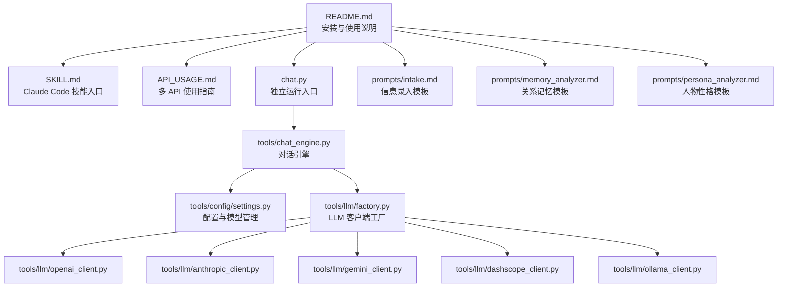
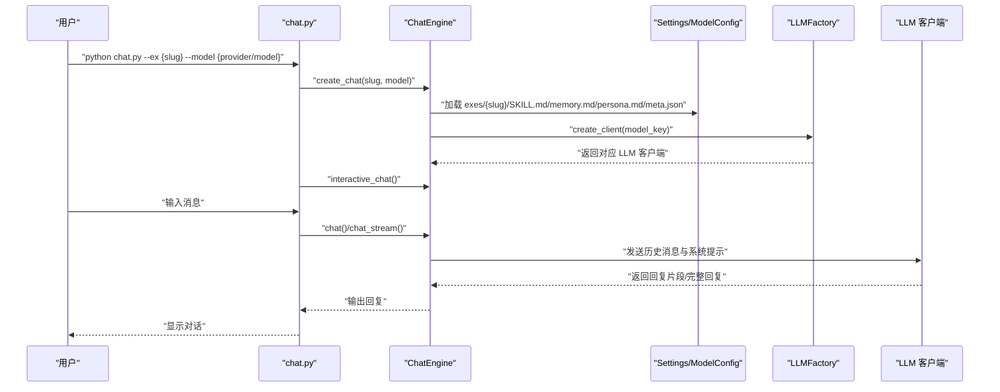

# 快速开始

<cite>
**本文引用的文件**
- [README.md](file://README.md)
- [INSTALL.md](file://INSTALL.md)
- [API_USAGE.md](file://API_USAGE.md)
- [SKILL.md](file://SKILL.md)
- [chat.py](file://chat.py)
- [tools/chat_engine.py](file://tools/chat_engine.py)
- [tools/config/settings.py](file://tools/config/settings.py)
- [tools/llm/factory.py](file://tools/llm/factory.py)
- [requirements.txt](file://requirements.txt)
- [prompts/intake.md](file://prompts/intake.md)
- [prompts/memory_analyzer.md](file://prompts/memory_analyzer.md)
- [prompts/persona_analyzer.md](file://prompts/persona_analyzer.md)
</cite>

## 目录
1. [简介](#简介)
2. [项目结构](#项目结构)
3. [核心组件](#核心组件)
4. [架构总览](#架构总览)
5. [详细组件分析](#详细组件分析)
6. [依赖分析](#依赖分析)
7. [性能考虑](#性能考虑)
8. [故障排查指南](#故障排查指南)
9. [结论](#结论)
10. [附录](#附录)

## 简介
前任.skill 是一个将“前任”记忆蒸馏为可对话的 AI Skill 的工具。它支持两种运行方式：
- Claude Code 原版：通过 Claude Code 技能入口进行交互与管理
- 独立运行（多 API）：脱离 Claude Code，直接通过命令行使用 OpenAI、Anthropic、Google Gemini、DashScope、Ollama 等多种 LLM API

本快速开始指南面向新用户，目标是在 30 分钟内完成安装、配置与首次体验，涵盖：
- Claude Code 集成安装与独立运行两种方式
- 环境依赖安装与 API 密钥配置（OpenAI、Anthropic、Google Gemini、DashScope）
- .env 文件配置方法
- 基本使用示例：创建第一个前任技能、进行对话交互
- 常见初始化问题与验证步骤

## 项目结构
该项目采用“提示模板 + 工具模块 + 对话引擎”的组织方式：
- prompts：包含信息录入、关系记忆、人物性格等分析模板
- tools：包含配置管理、LLM 客户端工厂、对话引擎、数据解析与版本管理等
- chat.py：独立运行入口，支持多 API 的命令行对话
- README/API_USAGE/SKILL：安装、使用与触发规则说明

图表来源
- [README.md:235-275](file://README.md#L235-L275)
- [SKILL.md:1-503](file://SKILL.md#L1-L503)
- [API_USAGE.md:164-194](file://API_USAGE.md#L164-L194)
- [chat.py:1-201](file://chat.py#L1-L201)
- [tools/chat_engine.py:1-284](file://tools/chat_engine.py#L1-L284)
- [tools/config/settings.py:1-225](file://tools/config/settings.py#L1-L225)
- [tools/llm/factory.py:1-82](file://tools/llm/factory.py#L1-L82)
- [prompts/intake.md:1-88](file://prompts/intake.md#L1-L88)
- [prompts/memory_analyzer.md:1-95](file://prompts/memory_analyzer.md#L1-L95)
- [prompts/persona_analyzer.md:1-92](file://prompts/persona_analyzer.md#L1-L92)

章节来源
- [README.md:235-275](file://README.md#L235-L275)

## 核心组件
- 配置与模型管理：负责从环境变量、.env 文件读取 API Key，维护默认模型清单与动态加载
- LLM 客户端工厂：根据 provider/model 选择对应客户端（OpenAI、Anthropic、Gemini、DashScope、Ollama）
- 对话引擎：加载 Skill 的 memory.md 与 persona.md，构造系统提示，维护对话历史，调用 LLM 并返回结果
- 独立运行入口：提供命令行参数解析、技能列表与模型列表查询、交互式对话循环

章节来源
- [tools/config/settings.py:12-225](file://tools/config/settings.py#L12-L225)
- [tools/llm/factory.py:14-82](file://tools/llm/factory.py#L14-L82)
- [tools/chat_engine.py:17-284](file://tools/chat_engine.py#L17-L284)
- [chat.py:128-201](file://chat.py#L128-L201)

## 架构总览
独立运行的对话流程如下：

图表来源
- [chat.py:128-201](file://chat.py#L128-L201)
- [tools/chat_engine.py:60-284](file://tools/chat_engine.py#L60-L284)
- [tools/config/settings.py:162-191](file://tools/config/settings.py#L162-L191)
- [tools/llm/factory.py:23-57](file://tools/llm/factory.py#L23-L57)

## 详细组件分析

### 安装与环境准备
- Claude Code 安装（项目级/全局/OpenClaw）
  - 在 git 仓库根目录执行安装命令，将技能克隆至 .claude/skills 或全局目录
  - 可选安装基础依赖（如 Pillow），用于照片 EXIF 读取
- 独立运行安装
  - 安装 requirements.txt 中声明的依赖
  - 准备 API 密钥（OpenAI、Anthropic、Google Gemini、DashScope）

章节来源
- [INSTALL.md:3-25](file://INSTALL.md#L3-L25)
- [INSTALL.md:28-38](file://INSTALL.md#L28-L38)
- [README.md:25-46](file://README.md#L25-L46)
- [requirements.txt:1-12](file://requirements.txt#L1-L12)

### API 密钥配置（环境变量与 .env）
- 环境变量方式
  - Windows PowerShell：设置 OPENAI_API_KEY、ANTHROPIC_API_KEY、GEMINI_API_KEY、DASHSCOPE_API_KEY
  - Linux/macOS：使用 export 设置上述环境变量
- .env 文件方式
  - 复制 .env.example 为 .env，填入对应 API Key
  - 应用启动时会自动从 .env 加载并注入环境变量

章节来源
- [README.md:80-101](file://README.md#L80-L101)
- [API_USAGE.md:23-49](file://API_USAGE.md#L23-L49)
- [tools/config/settings.py:148-161](file://tools/config/settings.py#L148-L161)

### 独立运行（多 API）使用示例
- 列出可用技能与模型
  - python chat.py --list-skills
  - python chat.py --list-models
- 与指定技能对话
  - python chat.py --ex 初恋 --model openai/gpt-4o
  - python chat.py --ex 小明 --model anthropic/claude-3-opus
  - python chat.py --ex 前任 --model gemini/gemini-pro
  - python chat.py --ex 前任 --model qwen/qwen-max
  - python chat.py --ex 前任 --model ollama/llama2
- 对话命令
  - /quit、/q、exit：退出
  - /clear：清空历史
  - /info：显示当前 Skill 信息

章节来源
- [API_USAGE.md:50-98](file://API_USAGE.md#L50-L98)
- [README.md:102-143](file://README.md#L102-L143)
- [chat.py:72-126](file://chat.py#L72-L126)

### Claude Code 使用示例
- 触发词：/create-ex 或中文触发语
- 管理命令
  - /list-exes：列出所有技能
  - /{slug}：完整技能（像 ta 一样聊天）
  - /{slug}-memory：回忆模式（帮你回忆那些事）
  - /{slug}-persona：仅人物性格
  - /ex-rollback {slug} {version}：回滚到历史版本
  - /delete-ex {slug} 或 /let-go {slug}：删除

章节来源
- [SKILL.md:16-35](file://SKILL.md#L16-L35)
- [SKILL.md:389-417](file://SKILL.md#L389-L417)
- [README.md:64-75](file://README.md#L64-L75)

### 创建第一个前任技能（Claude Code）
- 步骤概览
  - Step 1：基础信息录入（代号、基本信息、性格画像）
  - Step 2：原材料导入（微信/QQ/社交媒体/照片/上传文件/口述）
  - Step 3：分析原材料（关系记忆与人物性格）
  - Step 4：生成并预览（memory.md 与 persona.md）
  - Step 5：写入文件（exes/{slug}/ 下的 SKILL.md、meta.json 等）
- 原材料解析工具
  - 微信：wechat_parser.py
  - QQ：qq_parser.py
  - 社交媒体：social_parser.py
  - 照片：photo_analyzer.py

章节来源
- [SKILL.md:69-209](file://SKILL.md#L69-L209)
- [SKILL.md:116-187](file://SKILL.md#L116-L187)
- [prompts/intake.md:1-88](file://prompts/intake.md#L1-L88)
- [prompts/memory_analyzer.md:1-95](file://prompts/memory_analyzer.md#L1-L95)
- [prompts/persona_analyzer.md:1-92](file://prompts/persona_analyzer.md#L1-L92)

### 对话引擎与系统提示
- 系统提示由两部分构成：
  - Part A：关系记忆（memory.md）
  - Part B：人物性格（persona.md）
- 运行规则强调：先由 Part B 判断态度，再由 Part A 补充共同记忆；始终维持 Part B 的表达风格；Layer 0 硬规则优先

章节来源
- [tools/chat_engine.py:27-57](file://tools/chat_engine.py#L27-L57)
- [tools/chat_engine.py:133-171](file://tools/chat_engine.py#L133-L171)
- [SKILL.md:330-341](file://SKILL.md#L330-L341)

## 依赖分析
- 核心依赖
  - Pillow：照片 EXIF 读取（可选）
  - openai、anthropic、google-generativeai：分别对应 OpenAI、Anthropic、Google Gemini 的官方 SDK
- 可选增强
  - chardet、python-dateutil：文件编码检测与日期解析（可选）

章节来源
- [requirements.txt:1-12](file://requirements.txt#L1-L12)

## 性能考虑
- 流式输出：默认启用流式输出，提升交互体验
- 模型选择：不同提供商与模型在响应速度与稳定性上存在差异，可根据需求选择
- 历史管理：对话历史会累积，建议适时使用 /clear 清空历史以控制上下文长度

章节来源
- [chat.py:150-156](file://chat.py#L150-L156)
- [tools/chat_engine.py:206-228](file://tools/chat_engine.py#L206-L228)

## 故障排查指南
- ImportError：请先安装 openai anthropic google-generativeai
- 找不到前任 Skill：确保已使用 create-ex 创建，并位于 exes/{slug}/ 目录
- API Key 无效：检查环境变量或 .env 文件中的密钥是否正确
- Ollama 连接失败：确保 Ollama 服务已启动（ollama serve）

章节来源
- [API_USAGE.md:140-163](file://API_USAGE.md#L140-L163)

## 结论
通过本指南，您可以在 30 分钟内完成：
- Claude Code 集成安装或独立运行环境搭建
- API 密钥配置与 .env 文件设置
- 创建第一个前任技能并进行对话交互
- 掌握常见初始化问题的解决方法与验证步骤

建议后续深入阅读 prompts 目录下的模板，以便更好地指导技能生成与优化。

## 附录

### 常用命令速查
- 列出技能：python chat.py --list-skills
- 列出模型：python chat.py --list-models
- 与技能对话：python chat.py --ex 初恋 --model openai/gpt-4o
- 禁用流式输出：添加 --no-stream
- 调整温度与最大 token：--temperature 与 --max-tokens

章节来源
- [API_USAGE.md:77-88](file://API_USAGE.md#L77-L88)
- [chat.py:128-156](file://chat.py#L128-L156)