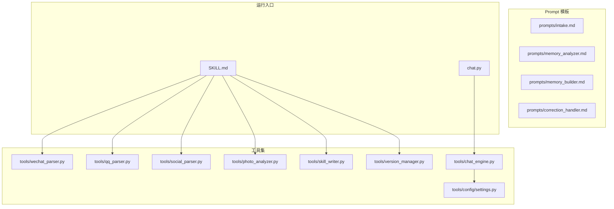
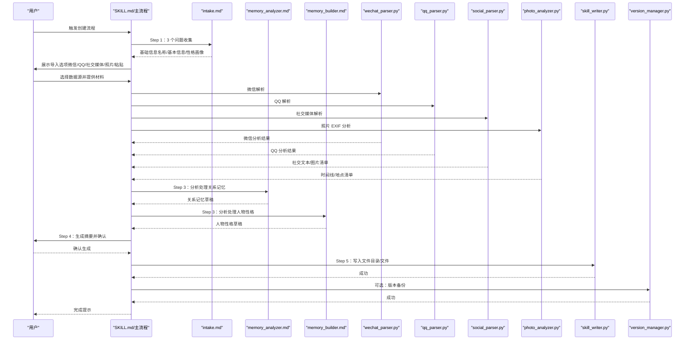
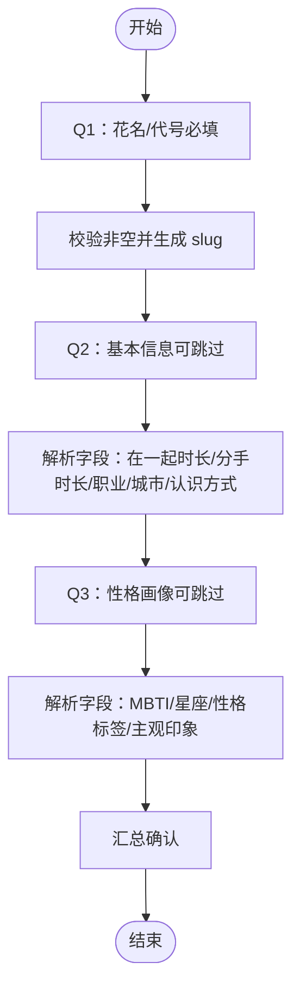
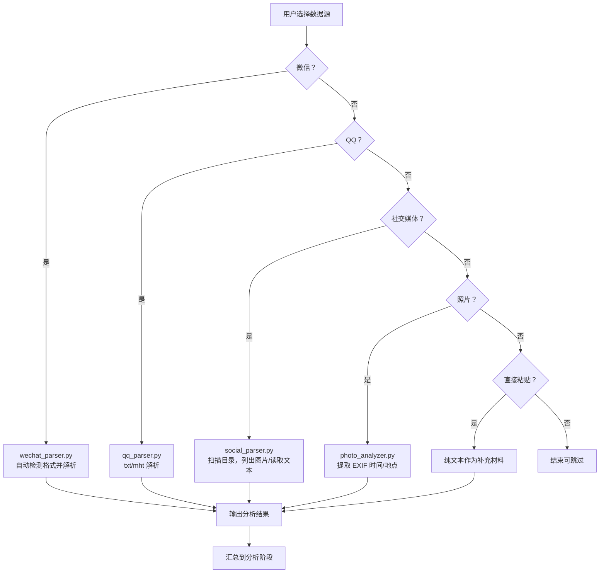
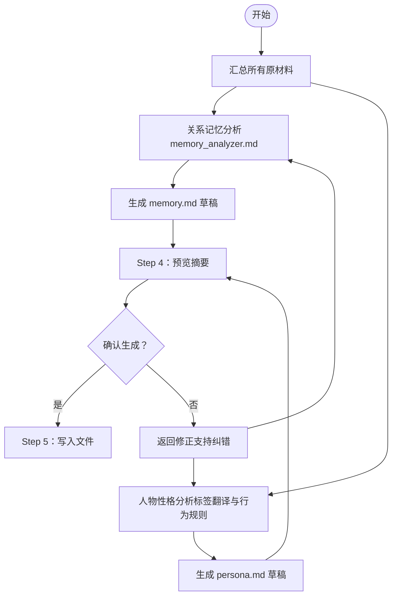
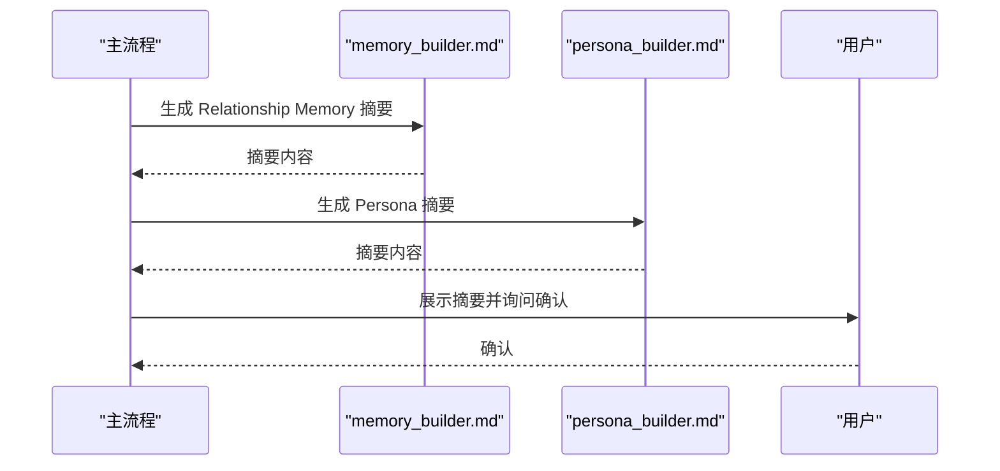
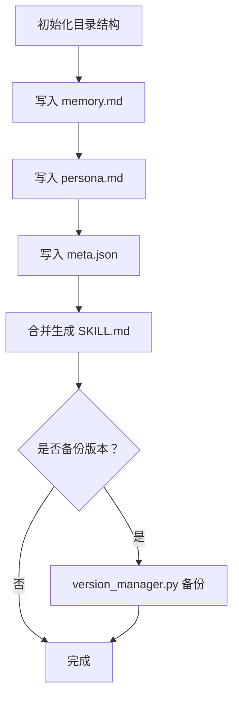
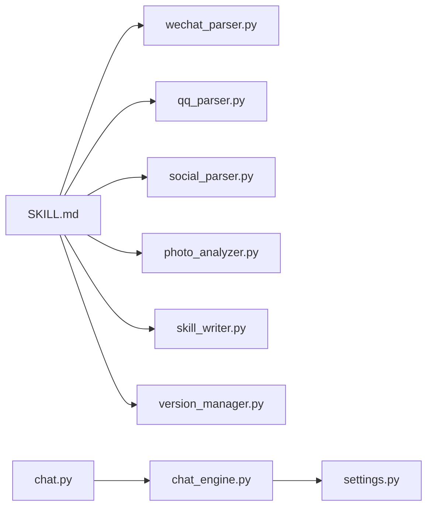

# 技能创建流程

<cite>
**本文引用的文件**
- [README.md](file://README.md)
- [SKILL.md](file://SKILL.md)
- [intake.md](file://prompts/intake.md)
- [memory_analyzer.md](file://prompts/memory_analyzer.md)
- [memory_builder.md](file://prompts/memory_builder.md)
- [correction_handler.md](file://prompts/correction_handler.md)
- [chat_engine.py](file://tools/chat_engine.py)
- [skill_writer.py](file://tools/skill_writer.py)
- [wechat_parser.py](file://tools/wechat_parser.py)
- [qq_parser.py](file://tools/qq_parser.py)
- [social_parser.py](file://tools/social_parser.py)
- [photo_analyzer.py](file://tools/photo_analyzer.py)
- [version_manager.py](file://tools/version_manager.py)
- [settings.py](file://tools/config/settings.py)
- [chat.py](file://chat.py)
</cite>

## 目录
1. [简介](#简介)
2. [项目结构](#项目结构)
3. [核心组件](#核心组件)
4. [架构总览](#架构总览)
5. [详细组件分析](#详细组件分析)
6. [依赖分析](#依赖分析)
7. [性能考虑](#性能考虑)
8. [故障排查指南](#故障排查指南)
9. [结论](#结论)
10. [附录](#附录)

## 简介
本技术文档围绕“技能创建流程”展开，系统阐述从基础信息录入到最终文件生成的完整链路，覆盖以下步骤：
- Step 1：基础信息录入（3 个问题）
- Step 2：多种数据源导入（微信、QQ、社交媒体、照片、直接输入）
- Step 3：分析处理（关系记忆与人物性格两类线索）
- Step 4：生成并预览（摘要与确认）
- Step 5：文件写入（目录结构、memory.md、persona.md、meta.json、SKILL.md）

文档同时给出数据处理逻辑、错误处理机制、配置参数说明、数据格式支持与转换规则，并提供可视化图示帮助理解。

## 项目结构
该项目采用模块化设计，核心分为 Prompt 模板、工具集（解析器与管理器）、配置系统与运行入口。Claude Code 环境下的主流程由 SKILL.md 描述，独立运行入口由 chat.py 提供。

**图表来源**
- [SKILL.md: 69-356:69-356](file://SKILL.md#L69-L356)
- [chat.py: 1-201:1-201](file://chat.py#L1-L201)
- [wechat_parser.py: 1-251:1-251](file://tools/wechat_parser.py#L1-L251)
- [qq_parser.py: 1-130:1-130](file://tools/qq_parser.py#L1-L130)
- [social_parser.py: 1-84:1-84](file://tools/social_parser.py#L1-L84)
- [photo_analyzer.py: 1-135:1-135](file://tools/photo_analyzer.py#L1-L135)
- [skill_writer.py: 1-171:1-171](file://tools/skill_writer.py#L1-L171)
- [version_manager.py: 1-116:1-116](file://tools/version_manager.py#L1-L116)
- [chat_engine.py: 1-284:1-284](file://tools/chat_engine.py#L1-L284)
- [settings.py: 1-225:1-225](file://tools/config/settings.py#L1-L225)

**章节来源**
- [README.md: 235-275:235-275](file://README.md#L235-L275)
- [SKILL.md: 69-356:69-356](file://SKILL.md#L69-L356)

## 核心组件
- Prompt 模板：定义信息采集、分析维度、生成模板与纠错规则。
- 数据解析器：微信、QQ、社交媒体、照片解析，产出结构化分析结果。
- 文件管理器：初始化目录、合并 SKILL.md、列出技能。
- 版本管理器：备份、回滚、列举版本。
- 对话引擎：加载 SKILL 内容，构造系统提示，调用 LLM 进行对话。
- 配置系统：统一管理模型、API Key、默认路径与可用模型清单。

**章节来源**
- [intake.md: 1-88:1-88](file://prompts/intake.md#L1-L88)
- [memory_analyzer.md: 1-95:1-95](file://prompts/memory_analyzer.md#L1-L95)
- [memory_builder.md: 1-122:1-122](file://prompts/memory_builder.md#L1-L122)
- [correction_handler.md: 1-56:1-56](file://prompts/correction_handler.md#L1-L56)
- [wechat_parser.py: 1-251:1-251](file://tools/wechat_parser.py#L1-L251)
- [qq_parser.py: 1-130:1-130](file://tools/qq_parser.py#L1-L130)
- [social_parser.py: 1-84:1-84](file://tools/social_parser.py#L1-L84)
- [photo_analyzer.py: 1-135:1-135](file://tools/photo_analyzer.py#L1-L135)
- [skill_writer.py: 1-171:1-171](file://tools/skill_writer.py#L1-L171)
- [version_manager.py: 1-116:1-116](file://tools/version_manager.py#L1-L116)
- [chat_engine.py: 17-284:17-284](file://tools/chat_engine.py#L17-L284)
- [settings.py: 12-225:12-225](file://tools/config/settings.py#L12-L225)

## 架构总览
下图展示了从用户输入到文件生成的端到端流程，以及与 Prompt 模板、解析器、管理器之间的协作关系。

**图表来源**
- [SKILL.md: 69-356:69-356](file://SKILL.md#L69-L356)
- [intake.md: 14-87:14-87](file://prompts/intake.md#L14-L87)
- [memory_analyzer.md: 3-95:3-95](file://prompts/memory_analyzer.md#L3-L95)
- [memory_builder.md: 9-122:9-122](file://prompts/memory_builder.md#L9-L122)
- [wechat_parser.py: 180-251:180-251](file://tools/wechat_parser.py#L180-L251)
- [qq_parser.py: 93-130:93-130](file://tools/qq_parser.py#L93-L130)
- [social_parser.py: 38-84:38-84](file://tools/social_parser.py#L38-L84)
- [photo_analyzer.py: 79-135:79-135](file://tools/photo_analyzer.py#L79-L135)
- [skill_writer.py: 68-145:68-145](file://tools/skill_writer.py#L68-L145)
- [version_manager.py: 16-74:16-74](file://tools/version_manager.py#L16-L74)

## 详细组件分析

### Step 1：基础信息录入（3 个问题）
- 问题设计与验证规则来自 intake.md，确保生成 slug 的一致性与基础信息的可解析性。
- 支持跳过，但“花名/代号”为必填；其余字段解析为结构化字段，便于后续生成 meta.json 与 SKILL.md。

**图表来源**
- [intake.md: 14-87:14-87](file://prompts/intake.md#L14-L87)

**章节来源**
- [intake.md: 14-87:14-87](file://prompts/intake.md#L14-L87)

### Step 2：多种数据源导入
- 微信：支持 WeChatMsg（txt/html/csv）、留痕（json）、PyWxDump（sqlite）、纯文本粘贴；自动格式检测与消息解析。
- QQ：支持 txt 与 mht（HTML）导出；mht 自动清理 HTML 标签。
- 社交媒体：扫描目录，区分图片与文本；图片通过 Read 工具查看，文本导出由工具读取。
- 照片：扫描目录，提取 EXIF 时间与 GPS 信息，按时间排序，缺失信息标注。
- 直接输入：纯文本粘贴，作为补充材料。

**图表来源**
- [SKILL.md: 87-209:87-209](file://SKILL.md#L87-L209)
- [wechat_parser.py: 24-46:24-46](file://tools/wechat_parser.py#L24-L46)
- [wechat_parser.py: 180-251:180-251](file://tools/wechat_parser.py#L180-L251)
- [qq_parser.py: 19-109:19-109](file://tools/qq_parser.py#L19-L109)
- [social_parser.py: 17-84:17-84](file://tools/social_parser.py#L17-L84)
- [photo_analyzer.py: 25-77:25-77](file://tools/photo_analyzer.py#L25-L77)
- [photo_analyzer.py: 79-135:79-135](file://tools/photo_analyzer.py#L79-L135)

**章节来源**
- [SKILL.md: 87-209:87-209](file://SKILL.md#L87-L209)
- [wechat_parser.py: 1-251:1-251](file://tools/wechat_parser.py#L1-L251)
- [qq_parser.py: 1-130:1-130](file://tools/qq_parser.py#L1-L130)
- [social_parser.py: 1-84:1-84](file://tools/social_parser.py#L1-L84)
- [photo_analyzer.py: 1-135:1-135](file://tools/photo_analyzer.py#L1-L135)

### Step 3：分析处理（关系记忆与人物性格）
- 关系记忆（Part A）：依据 memory_analyzer.md 的维度提取时间线、日常模式、共同经历、争吵模式、甜蜜瞬间、分手记忆等。
- 人物性格（Part B）：依据用户输入标签与分析结果，形成五层结构（硬规则→身份→说话风格→情感模式→关系行为）。
- 输出：memory.md 与 persona.md 草稿，供预览与修正。

**图表来源**
- [memory_analyzer.md: 3-95:3-95](file://prompts/memory_analyzer.md#L3-L95)
- [memory_builder.md: 9-122:9-122](file://prompts/memory_builder.md#L9-L122)
- [correction_handler.md: 17-50:17-50](file://prompts/correction_handler.md#L17-L50)

**章节来源**
- [memory_analyzer.md: 3-95:3-95](file://prompts/memory_analyzer.md#L3-L95)
- [memory_builder.md: 9-122:9-122](file://prompts/memory_builder.md#L9-L122)
- [correction_handler.md: 17-50:17-50](file://prompts/correction_handler.md#L17-L50)

### Step 4：生成并预览
- 依据 memory_builder.md 与 persona_builder.md 生成摘要（各 5-8 行），向用户展示关系记忆与人物性格要点，确认后进入文件写入。

**图表来源**
- [SKILL.md: 226-250:226-250](file://SKILL.md#L226-L250)
- [memory_builder.md: 9-122:9-122](file://prompts/memory_builder.md#L9-L122)

**章节来源**
- [SKILL.md: 226-250:226-250](file://SKILL.md#L226-L250)

### Step 5：文件写入
- 目录结构：exes/{slug}/ 下创建 versions、memories/chats、memories/photos、memories/social。
- 文件写入：
  - memory.md：关系记忆内容
  - persona.md：人物性格内容
  - meta.json：名称、slug、时间戳、版本、profile、tags、印象、记忆来源、纠错计数
  - SKILL.md：合并 memory.md 与 persona.md，附带运行规则
- 版本管理：可选备份当前版本，便于后续回滚。

**图表来源**
- [SKILL.md: 251-356:251-356](file://SKILL.md#L251-L356)
- [skill_writer.py: 54-145:54-145](file://tools/skill_writer.py#L54-L145)
- [version_manager.py: 16-43:16-43](file://tools/version_manager.py#L16-L43)

**章节来源**
- [SKILL.md: 251-356:251-356](file://SKILL.md#L251-L356)
- [skill_writer.py: 54-145:54-145](file://tools/skill_writer.py#L54-L145)
- [version_manager.py: 16-43:16-43](file://tools/version_manager.py#L16-L43)

## 依赖分析
- 组件耦合：
  - 主流程（SKILL.md）依赖多个解析器与管理器，形成“编排-执行”关系。
  - 对话引擎（chat_engine.py）依赖配置系统（settings.py）与 LLM 工厂，负责运行时对话。
  - 文件与版本管理器（skill_writer.py、version_manager.py）与主流程强耦合，保证产物一致性。
- 外部依赖：
  - Pillow（PIL）用于照片 EXIF 读取；若未安装，仅列出文件而不解析 EXIF。
  - LLM 提供商（OpenAI、Anthropic、Gemini、DashScope、Ollama）通过工厂模式统一接入。

**图表来源**
- [SKILL.md: 69-356:69-356](file://SKILL.md#L69-L356)
- [wechat_parser.py: 1-251:1-251](file://tools/wechat_parser.py#L1-L251)
- [qq_parser.py: 1-130:1-130](file://tools/qq_parser.py#L1-L130)
- [social_parser.py: 1-84:1-84](file://tools/social_parser.py#L1-L84)
- [photo_analyzer.py: 1-135:1-135](file://tools/photo_analyzer.py#L1-L135)
- [skill_writer.py: 1-171:1-171](file://tools/skill_writer.py#L1-L171)
- [version_manager.py: 1-116:1-116](file://tools/version_manager.py#L1-L116)
- [chat_engine.py: 1-284:1-284](file://tools/chat_engine.py#L1-L284)
- [settings.py: 1-225:1-225](file://tools/config/settings.py#L1-L225)
- [chat.py: 1-201:1-201](file://chat.py#L1-L201)

**章节来源**
- [settings.py: 12-225:12-225](file://tools/config/settings.py#L12-L225)
- [chat_engine.py: 17-284:17-284](file://tools/chat_engine.py#L17-L284)
- [chat.py: 1-201:1-201](file://chat.py#L1-L201)

## 性能考虑
- 解析器复杂度：
  - 微信解析：线性扫描文件，时间复杂度 O(N)，N 为消息行数；高频词与表情统计为 O(M)，M 为文本长度。
  - QQ 解析：同上，M 为文本长度。
  - 社交解析：目录扫描 O(F)，F 为文件数；文本读取 O(T)，T 为文本长度。
  - 照片 EXIF：遍历目录 O(P)，P 为图片数；单图 EXIF 读取近似 O(1)。
- I/O 优化：
  - 批量写入：合并 SKILL.md 时一次性读取 memory.md 与 persona.md，减少多次 I/O。
  - 备份策略：版本备份仅复制核心文件，避免冗余拷贝。
- LLM 调用：
  - 对话引擎支持流式输出，降低首字延迟；合理设置温度与最大 token，平衡创造性与稳定性。

[本节为通用性能讨论，不直接分析具体文件，故无章节来源]

## 故障排查指南
- 缺少 Pillow（PIL）导致照片 EXIF 无法解析：
  - 现象：输出提示未安装，仅列出文件。
  - 处理：安装 Pillow 后重试。
- 文件不存在或路径错误：
  - 现象：找不到前任 Skill、meta.json 不存在、目录不存在。
  - 处理：检查 exes/{slug} 路径与文件完整性；使用文件管理器初始化目录。
- API Key 未配置：
  - 现象：模型不可用或调用失败。
  - 处理：设置环境变量或 .env 文件；重启后重新加载配置。
- 格式不支持或解析异常：
  - 现象：微信/QQ 解析失败或结果为空。
  - 处理：确认导出格式；必要时手动转为支持格式；检查编码与换行符。

**章节来源**
- [photo_analyzer.py: 27-28:27-28](file://tools/photo_analyzer.py#L27-L28)
- [wechat_parser.py: 189-191:189-191](file://tools/wechat_parser.py#L189-L191)
- [qq_parser.py: 101-103:101-103](file://tools/qq_parser.py#L101-L103)
- [social_parser.py: 45-47:45-47](file://tools/social_parser.py#L45-L47)
- [settings.py: 148-161:148-161](file://tools/config/settings.py#L148-L161)

## 结论
本流程通过 Prompt 驱动的信息采集、多源数据解析与结构化分析，最终生成可运行的技能文件。其关键优势在于：
- 明确的步骤划分与可扩展的数据源支持
- 严格的“事实优先”原则与纠错机制
- 完整的文件与版本管理体系
- 可独立运行与 Claude Code 双入口支持

建议在实际使用中：
- 优先提供高质量聊天记录与照片 EXIF
- 使用 meta.json 与 SKILL.md 的双文件结构便于维护
- 定期备份版本，以便回滚与对比

[本节为总结性内容，不直接分析具体文件，故无章节来源]

## 附录

### A. 数据格式支持与转换规则
- 微信导出
  - 支持：WeChatMsg（txt/html/csv）、留痕（json）、PyWxDump（sqlite）、纯文本
  - 转换：自动检测格式；txt 采用时间戳+发送者模式解析；json 统一字段映射；sqlite 转为消息列表
- QQ 导出
  - 支持：txt、mht（HTML）
  - 转换：txt 解析时间戳与发送者；mht 清洗 HTML 标签为纯文本
- 社交媒体
  - 支持：图片（Read 工具查看）、文本导出（txt/md/json/csv）
  - 转换：目录扫描分类；文本导出读取并截取
- 照片
  - 支持：JPEG/PNG/HEIC/HEIF
  - 转换：提取 DateTimeOriginal/DateTime 与 GPS 信息；按时间排序
- 直接输入
  - 支持：纯文本
  - 转换：作为补充材料，不进行结构化解析

**章节来源**
- [SKILL.md: 116-187:116-187](file://SKILL.md#L116-L187)
- [wechat_parser.py: 24-46:24-46](file://tools/wechat_parser.py#L24-L46)
- [wechat_parser.py: 48-104:48-104](file://tools/wechat_parser.py#L48-L104)
- [qq_parser.py: 19-91:19-91](file://tools/qq_parser.py#L19-L91)
- [social_parser.py: 17-35:17-35](file://tools/social_parser.py#L17-L35)
- [photo_analyzer.py: 25-77:25-77](file://tools/photo_analyzer.py#L25-L77)

### B. 配置参数说明
- 模型配置
  - provider：openai/anthropic/gemini/dashscope/ollama
  - model：具体模型名
  - api_key/base_url：按提供商自动读取或自定义端点
  - temperature/max_tokens：推理参数
- 默认路径
  - exes_dir：技能文件根目录
- 环境变量
  - OPENAI_API_KEY、ANTHROPIC_API_KEY、GEMINI_API_KEY、DASHSCOPE_API_KEY
  - OLLAMA_MODELS、OLLAMA_BASE_URL

**章节来源**
- [settings.py: 12-225:12-225](file://tools/config/settings.py#L12-L225)

### C. 运行命令速查
- 列出技能：python3 tools/skill_writer.py --action list --base-dir ./exes
- 初始化目录：python3 tools/skill_writer.py --action init --base-dir ./exes --slug {slug}
- 合并 SKILL.md：python3 tools/skill_writer.py --action combine --base-dir ./exes --slug {slug}
- 备份版本：python3 tools/version_manager.py --action backup --slug {slug} --base-dir ./exes
- 回滚版本：python3 tools/version_manager.py --action rollback --slug {slug} --version {version} --base-dir ./exes
- 独立对话：python chat.py --ex {slug} --model openai/gpt-4o

**章节来源**
- [SKILL.md: 389-417:389-417](file://SKILL.md#L389-L417)
- [skill_writer.py: 147-171:147-171](file://tools/skill_writer.py#L147-L171)
- [version_manager.py: 94-116:94-116](file://tools/version_manager.py#L94-L116)
- [chat.py: 128-201:128-201](file://chat.py#L128-L201)