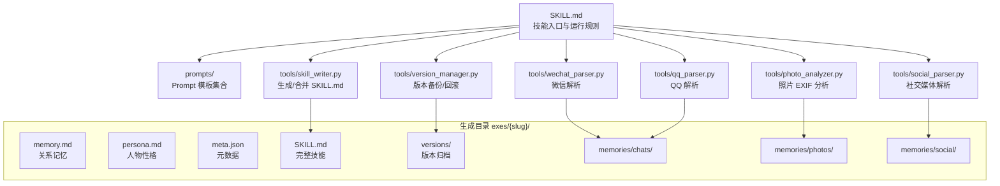
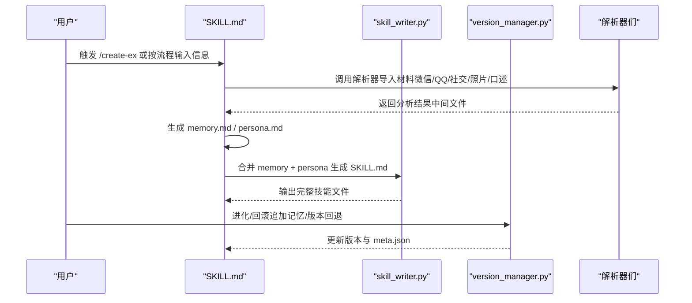
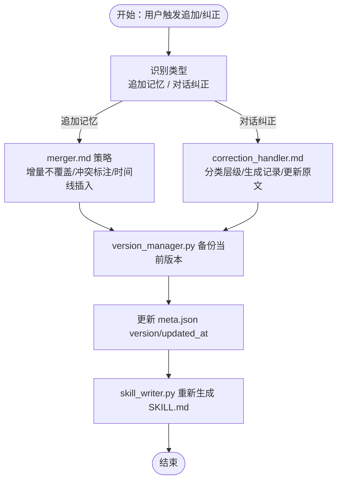
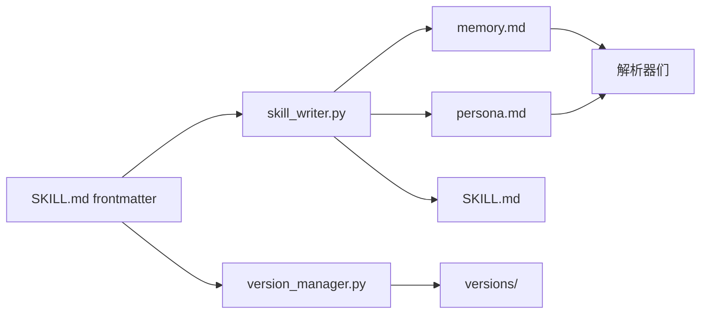

# 技能文件结构

<cite>
**本文引用的文件**
- [SKILL.md](file://SKILL.md)
- [README.md](file://README.md)
- [intake.md](file://prompts/intake.md)
- [memory_analyzer.md](file://prompts/memory_analyzer.md)
- [persona_analyzer.md](file://prompts/persona_analyzer.md)
- [memory_builder.md](file://prompts/memory_builder.md)
- [persona_builder.md](file://prompts/persona_builder.md)
- [merger.md](file://prompts/merger.md)
- [correction_handler.md](file://prompts/correction_handler.md)
- [skill_writer.py](file://tools/skill_writer.py)
- [version_manager.py](file://tools/version_manager.py)
- [wechat_parser.py](file://tools/wechat_parser.py)
- [qq_parser.py](file://tools/qq_parser.py)
- [social_parser.py](file://tools/social_parser.py)
- [photo_analyzer.py](file://tools/photo_analyzer.py)
</cite>

## 目录
1. [简介](#简介)
2. [项目结构](#项目结构)
3. [核心组件](#核心组件)
4. [架构总览](#架构总览)
5. [详细组件分析](#详细组件分析)
6. [依赖分析](#依赖分析)
7. [性能考虑](#性能考虑)
8. [故障排查指南](#故障排查指南)
9. [结论](#结论)
10. [附录](#附录)

## 简介
本文件面向“技能文件结构”的技术文档，围绕 SKILL.md 的 frontmatter 配置、技能目录组织、memory.md 与 persona.md 的格式规范、meta.json 的数据模型与字段定义进行系统化说明，并提供生成规则、最佳实践与排障建议。读者可据此在 Claude Code 或独立运行环境中，稳定地创建、维护与演进“前任.skill”类技能。

## 项目结构
该项目采用“技能入口 + Prompt 模板 + 工具链”的分层组织方式：
- 技能入口：SKILL.md（Claude Code 技能规范）
- Prompt 模板：prompts/ 下的 intake、memory_analyzer、persona_analyzer、memory_builder、persona_builder、merger、correction_handler
- 工具链：tools/ 下的 skill_writer.py、version_manager.py、wechat_parser.py、qq_parser.py、social_parser.py、photo_analyzer.py
- 生成产物：exes/{slug}/ 下的 memory.md、persona.md、meta.json、SKILL.md 以及版本归档

图表来源
- [SKILL.md:1-503](file://SKILL.md#L1-L503)
- [skill_writer.py:1-171](file://tools/skill_writer.py#L1-L171)
- [version_manager.py:1-116](file://tools/version_manager.py#L1-L116)
- [wechat_parser.py:1-251](file://tools/wechat_parser.py#L1-L251)
- [qq_parser.py:1-130](file://tools/qq_parser.py#L1-L130)
- [social_parser.py:1-84](file://tools/social_parser.py#L1-L84)
- [photo_analyzer.py:1-135](file://tools/photo_analyzer.py#L1-L135)

章节来源
- [README.md:281-321](file://README.md#L281-L321)
- [SKILL.md:53-55](file://SKILL.md#L53-L55)

## 核心组件
- SKILL.md：技能入口与运行规则，包含 frontmatter（name、description、user-invocable 等）与正文（PART A/B、运行规则、管理命令等）
- prompts/*：定义信息采集、记忆与性格抽取、构建模板、增量合并与纠错处理的流程与格式
- tools/skill_writer.py：负责目录初始化、合并 memory/persona 生成 SKILL.md
- tools/version_manager.py：负责版本备份、回滚与列举
- tools/* 解析器：从不同来源导入原始材料，产出中间分析结果，支撑 memory/persona 的构建

章节来源
- [SKILL.md:1-503](file://SKILL.md#L1-L503)
- [skill_writer.py:1-171](file://tools/skill_writer.py#L1-L171)
- [version_manager.py:1-116](file://tools/version_manager.py#L1-L116)

## 架构总览
技能文件结构遵循“双层记忆”（关系记忆 Part A + 人物性格 Part B）与“元数据驱动”的设计原则。frontmatter 决定技能在平台上的可见性与触发方式；目录结构承载生成物与版本归档；工具链确保生成、演进与回滚的自动化与可追溯。

图表来源
- [SKILL.md:251-302](file://SKILL.md#L251-L302)
- [SKILL.md:366-373](file://SKILL.md#L366-L373)
- [skill_writer.py:68-144](file://tools/skill_writer.py#L68-L144)
- [version_manager.py:16-73](file://tools/version_manager.py#L16-L73)

## 详细组件分析

### SKILL.md 的 frontmatter 配置结构
- name：技能显示名称，Claude Code 中用于展示与索引
- description：技能描述，支持中英双语
- argument-hint：参数提示（本技能未启用）
- version：技能版本号（语义化版本）
- user-invocable：是否允许用户直接触发
- allowed-tools：允许使用的工具集合（Read、Write、Edit、Bash 等）

配置方法与作用要点
- name 与 description：直接影响技能在平台侧的呈现与检索
- version：配合 meta.json 的 version 字段，用于版本演进与回滚
- user-invocable：控制技能是否可被用户直接调用
- allowed-tools：限定运行环境中的工具权限，保障安全边界

章节来源
- [SKILL.md:2-7](file://SKILL.md#L2-L7)

### 技能目录组织结构（exes/{slug}/）
- versions/：版本归档目录，按“当前版本_时间戳”命名，保存 memory.md、persona.md、SKILL.md、meta.json 的快照
- memories/chats/：存放从微信/QQ等渠道导入的聊天材料中间文件
- memories/photos/：存放照片 EXIF 分析结果
- memories/social/：存放社交媒体截图/文本导出的扫描结果

目录初始化与写入流程
- 初始化：创建 versions 与 memories 子目录
- 写入：生成 memory.md、persona.md、meta.json、SKILL.md
- 版本管理：每次更新前自动备份，支持回滚到历史版本

章节来源
- [SKILL.md:255-262](file://SKILL.md#L255-L262)
- [SKILL.md:366-373](file://SKILL.md#L366-L373)
- [skill_writer.py:54-65](file://tools/skill_writer.py#L54-L65)
- [version_manager.py:16-43](file://tools/version_manager.py#L16-L43)

### memory.md 的格式规范与生成规则
- 结构：以章节标题组织，包含关系概览、时间线、共同记忆、日常模式、争吵档案、甜蜜档案、分手档案、Correction 记录等
- 生成来源：基于 intake.md 的基础信息与 prompts/memory_analyzer.md 的维度，从微信/QQ/社交/照片/口述等材料中抽取
- 填充规则：优先聊天记录中的事实，时间尽量精确，地点来自照片 EXIF 或聊天内容，未足信息标注“待补充”

章节来源
- [memory_analyzer.md:1-95](file://prompts/memory_analyzer.md#L1-L95)
- [memory_builder.md:1-122](file://prompts/memory_builder.md#L1-L122)
- [SKILL.md:210-229](file://SKILL.md#L210-L229)

### persona.md 的格式规范与生成规则
- 结构：五层（Layer 0 硬规则 → 身份 → 说话风格 → 情感模式 → 关系行为），高层规则不可被低层覆盖
- 生成来源：基于 intake.md 的基础信息与 prompts/persona_analyzer.md 的维度，结合标签翻译表与星座/MBTI辅助推断
- 填充说明：每个占位符必须替换为具体行为描述，优先使用聊天记录中的真实表述，未足信息标注“信息不足，使用默认”

章节来源
- [persona_analyzer.md:1-92](file://prompts/persona_analyzer.md#L1-L92)
- [persona_builder.md:1-129](file://prompts/persona_builder.md#L1-L129)
- [SKILL.md:210-229](file://SKILL.md#L210-L229)

### meta.json 的数据模型与字段定义
- 字段概览
  - name：技能名称（与 SKILL.md frontmatter 的 name 一致）
  - slug：技能标识（由 intake 流程生成）
  - created_at / updated_at：创建与最近更新时间（ISO 时间）
  - version：技能版本（语义化版本，如 v1）
  - profile：基础画像
    - together_duration：在一起时长
    - apart_since：分手时长
    - occupation：职业
    - gender：性别
    - mbti：MBTI 类型
    - zodiac：星座
  - tags：标签体系
    - personality：性格标签列表
    - attachment_style：依恋类型
    - love_language：爱的语言
  - impression：主观印象
  - memory_sources：已导入文件列表
  - corrections_count：纠错次数

- 使用场景
  - 列表展示：skill_writer.py 读取 meta.json 展示技能摘要
  - 合并 SKILL.md：根据 meta.json 的 name/profile 生成描述
  - 版本演进：version_manager.py 基于 meta.json 的 version 与 updated_at 更新版本信息

章节来源
- [SKILL.md:270-298](file://SKILL.md#L270-L298)
- [skill_writer.py:24-51](file://tools/skill_writer.py#L24-L51)
- [version_manager.py:26-29](file://tools/version_manager.py#L26-L29)

### 进化模式与版本管理
- 追加记忆：merger.md 定义增量合并策略，不覆盖既有结论，冲突处标注，按时间线插入事件
- 对话纠正：correction_handler.md 识别用户纠正意图，分类为 Memory 或 Persona，生成 Correction 记录并同步更新
- 版本管理：version_manager.py 自动备份当前版本，支持回滚到指定版本，回滚前先备份当前版本

图表来源
- [merger.md:1-45](file://prompts/merger.md#L1-L45)
- [correction_handler.md:1-56](file://prompts/correction_handler.md#L1-L56)
- [version_manager.py:16-43](file://tools/version_manager.py#L16-L43)
- [skill_writer.py:68-144](file://tools/skill_writer.py#L68-L144)

章节来源
- [SKILL.md:359-417](file://SKILL.md#L359-L417)
- [SKILL.md:377-386](file://SKILL.md#L377-L386)

### 原材料导入与解析
- 微信：支持 WeChatMsg、留痕、PyWxDump、纯文本，提取高频语气词、表情包、回复速度、话题分布、口头禅等
- QQ：支持 txt、mht，提取消息样本与基本统计
- 社交媒体：图片截图通过 Read 工具读取，文本导出通过 social_parser.py 扫描
- 照片：通过 photo_analyzer.py 提取 EXIF 时间与 GPS，构建时间线与常去地点

章节来源
- [SKILL.md:116-186](file://SKILL.md#L116-L186)
- [wechat_parser.py:1-251](file://tools/wechat_parser.py#L1-L251)
- [qq_parser.py:1-130](file://tools/qq_parser.py#L1-L130)
- [social_parser.py:1-84](file://tools/social_parser.py#L1-L84)
- [photo_analyzer.py:1-135](file://tools/photo_analyzer.py#L1-L135)

## 依赖分析
- frontmatter 依赖：SKILL.md 的 frontmatter 决定技能在平台侧的可见性与触发方式
- 目录依赖：exes/{slug}/ 下的文件与目录结构由 skill_writer.py 与 version_manager.py 维护
- 模板依赖：memory.md 与 persona.md 的生成严格遵循 prompts/* 模板
- 工具链依赖：解析器负责将原始材料转化为中间分析结果，支撑记忆与性格抽取

图表来源
- [SKILL.md:2-7](file://SKILL.md#L2-L7)
- [skill_writer.py:68-144](file://tools/skill_writer.py#L68-L144)
- [version_manager.py:16-43](file://tools/version_manager.py#L16-L43)

章节来源
- [SKILL.md:255-262](file://SKILL.md#L255-L262)
- [SKILL.md:270-298](file://SKILL.md#L270-L298)

## 性能考虑
- 解析器 I/O：微信/QQ/社交/照片解析涉及磁盘扫描与文本解析，建议批量处理与缓存中间结果
- EXIF 读取：photo_analyzer.py 依赖 Pillow，缺失时仅列出文件，建议提前安装依赖
- 合并与回滚：version_manager.py 与 skill_writer.py 的文件复制与写入操作较多，建议在空闲时段执行，避免频繁并发写入

## 故障排查指南
- 找不到 meta.json：version_manager.py 与 skill_writer.py 在执行前会校验 meta.json 是否存在，若报错请先生成 meta.json
- 未初始化目录：使用 skill_writer.py 的 init 功能创建 exes/{slug}/ 目录结构
- 回滚失败：rollback 前会先备份当前版本，检查 versions/ 下是否存在目标版本，必要时先 list_versions 查看
- 解析器异常：确认输入格式与扩展名，微信解析支持 auto 检测，其他格式请显式指定；QQ 支持 txt 与 mht；照片需含 EXIF 信息

章节来源
- [version_manager.py:22-43](file://tools/version_manager.py#L22-L43)
- [skill_writer.py:18-65](file://tools/skill_writer.py#L18-L65)
- [wechat_parser.py:180-251](file://tools/wechat_parser.py#L180-L251)
- [photo_analyzer.py:79-135](file://tools/photo_analyzer.py#L79-L135)

## 结论
本技能文件结构通过 frontmatter、目录组织、模板化生成与工具链自动化，实现了从“基础信息 + 原材料”到“关系记忆 + 人物性格”的闭环。meta.json 作为元数据中枢，贯穿生成、演进与回滚全过程。遵循本文规范与最佳实践，可在 Claude Code 与独立运行环境中稳定创建与维护高质量的“前任.skill”。

## 附录
- 最佳实践
  - 优先提供微信导出 + 深夜对话 + 争吵记录，提升还原度
  - 使用标签翻译表与星座/MBTI辅助推断，但以聊天记录为准
  - 追加记忆时使用 merger.md 的增量策略，避免覆盖既有结论
  - 定期备份版本，回滚时先确认目标版本
- 常用命令
  - 列出技能：/list-exes
  - 回滚版本：/ex-rollback {slug} {version}
  - 删除技能：/delete-ex {slug} 或 /let-go {slug}

章节来源
- [README.md:90-101](file://README.md#L90-L101)
- [SKILL.md:389-417](file://SKILL.md#L389-L417)