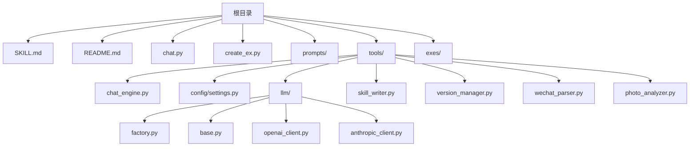
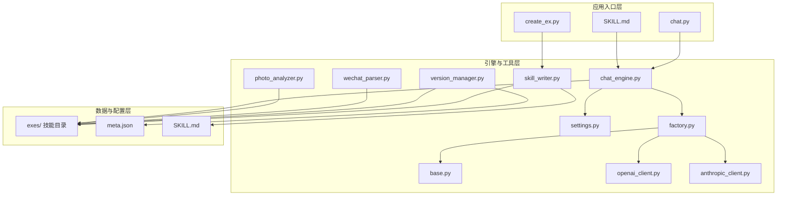
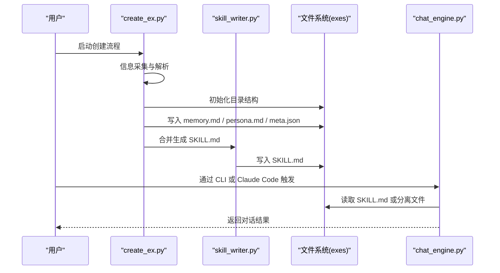
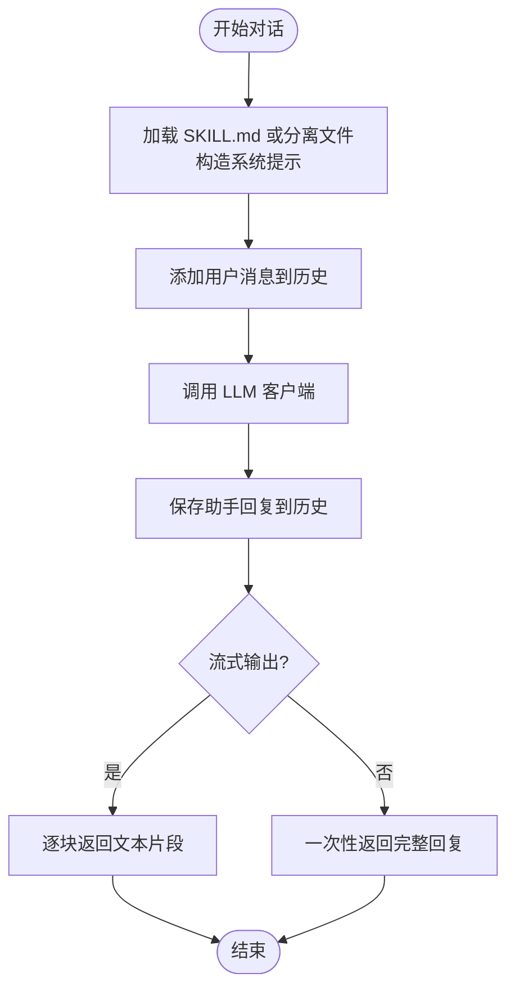
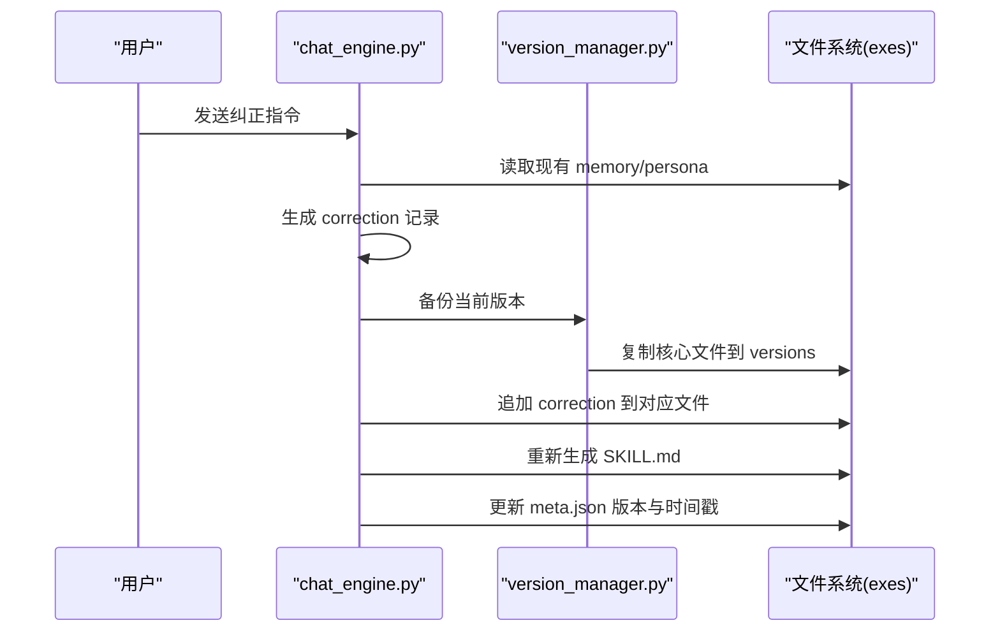
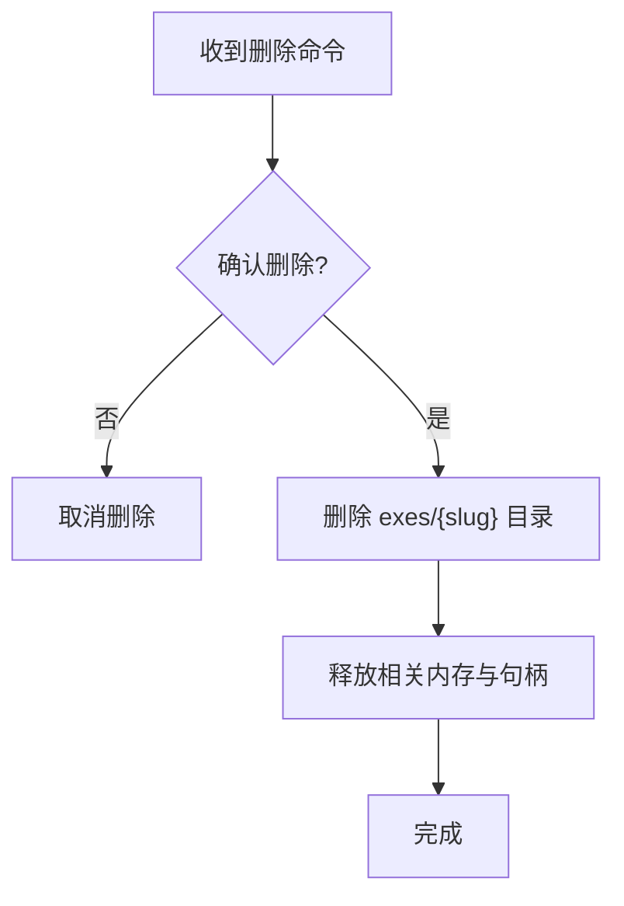
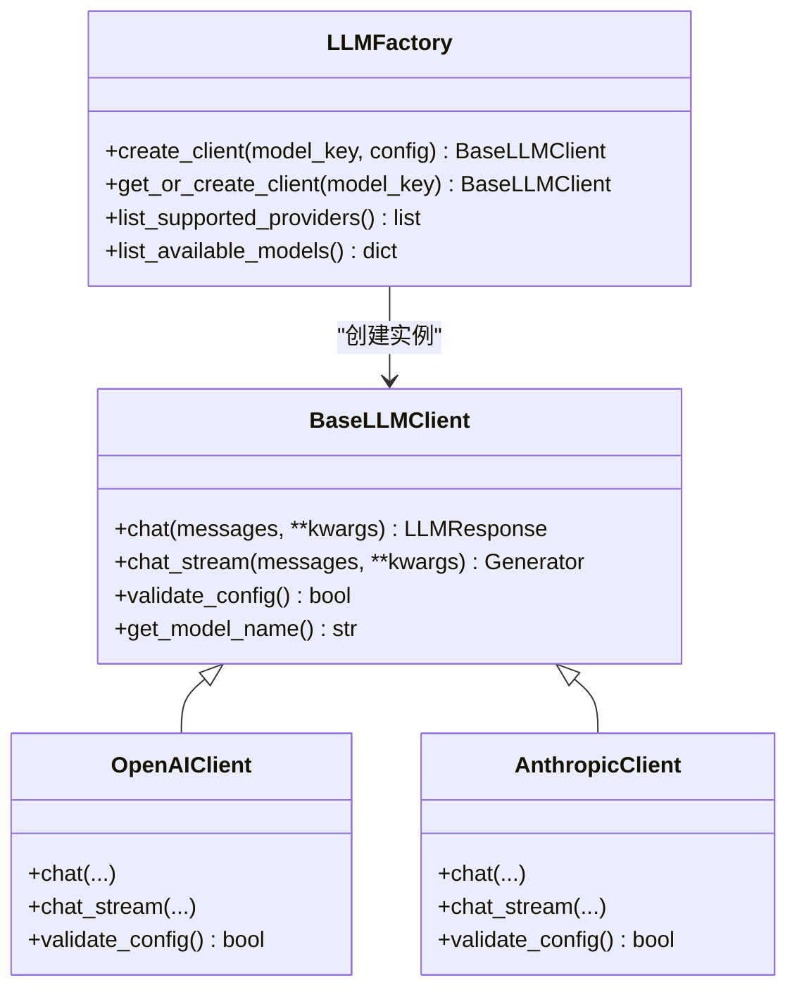
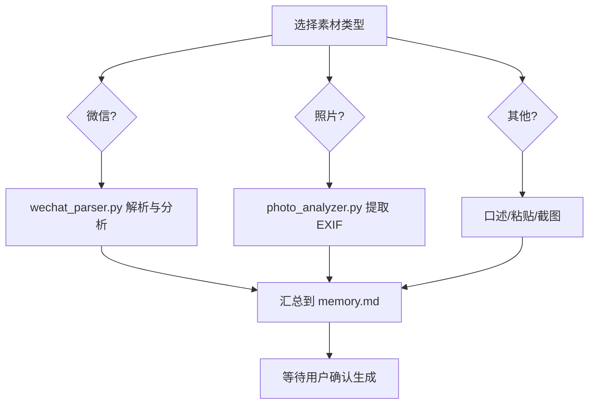
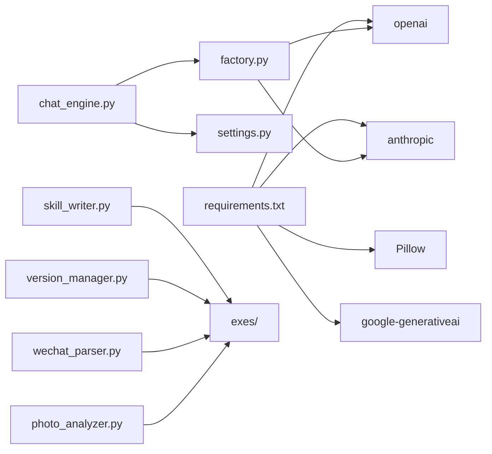

# 技能生命周期管理

<cite>
**本文引用的文件**
- [SKILL.md](file://SKILL.md)
- [README.md](file://README.md)
- [chat.py](file://chat.py)
- [create_ex.py](file://create_ex.py)
- [tools/chat_engine.py](file://tools/chat_engine.py)
- [tools/skill_writer.py](file://tools/skill_writer.py)
- [tools/version_manager.py](file://tools/version_manager.py)
- [tools/config/settings.py](file://tools/config/settings.py)
- [tools/llm/factory.py](file://tools/llm/factory.py)
- [tools/llm/base.py](file://tools/llm/base.py)
- [tools/llm/openai_client.py](file://tools/llm/openai_client.py)
- [tools/llm/anthropic_client.py](file://tools/llm/anthropic_client.py)
- [tools/wechat_parser.py](file://tools/wechat_parser.py)
- [tools/photo_analyzer.py](file://tools/photo_analyzer.py)
- [prompts/intake.md](file://prompts/intake.md)
- [requirements.txt](file://requirements.txt)
</cite>

## 目录
1. [简介](#简介)
2. [项目结构](#项目结构)
3. [核心组件](#核心组件)
4. [架构总览](#架构总览)
5. [详细组件分析](#详细组件分析)
6. [依赖关系分析](#依赖关系分析)
7. [性能考量](#性能考量)
8. [故障排查指南](#故障排查指南)
9. [结论](#结论)
10. [附录](#附录)

## 简介
本技术文档围绕“技能生命周期管理”主题，系统阐述从技能创建、激活、使用、进化、回滚到删除的完整流程。文档聚焦于“前任.skill”的文件系统组织、状态管理、内存与资源管理、维护策略（备份、监控、优化）以及最佳实践（命名、存储、安全），并提供管理命令与自动化脚本示例，帮助开发者与使用者高效、安全地管理技能资产。

## 项目结构
该项目采用“功能模块 + 工具集 + Prompt 模板”的分层组织方式：
- 根目录提供入口与说明：SKILL.md（Claude Code 技能入口）、README.md（使用与安装）、chat.py（独立对话 CLI）、create_ex.py（独立创建 CLI）。
- tools/ 下为核心工具与引擎：对话引擎、配置管理、LLM 客户端工厂、解析器与版本管理。
- prompts/ 为对话引导与分析模板。
- exes/ 为生成的技能目录（本地产物，不在仓库中提交）。

图表来源
- [README.md:281-321](file://README.md#L281-L321)
- [chat.py:1-201](file://chat.py#L1-L201)
- [create_ex.py:1-505](file://create_ex.py#L1-L505)
- [tools/chat_engine.py:1-284](file://tools/chat_engine.py#L1-L284)
- [tools/config/settings.py:1-225](file://tools/config/settings.py#L1-L225)
- [tools/llm/factory.py:1-82](file://tools/llm/factory.py#L1-L82)
- [tools/skill_writer.py:1-171](file://tools/skill_writer.py#L1-L171)
- [tools/version_manager.py:1-116](file://tools/version_manager.py#L1-L116)
- [tools/wechat_parser.py:1-251](file://tools/wechat_parser.py#L1-L251)
- [tools/photo_analyzer.py:1-135](file://tools/photo_analyzer.py#L1-L135)

章节来源
- [README.md:281-321](file://README.md#L281-L321)

## 核心组件
- 对话引擎：负责加载技能内容、构造系统提示、维护对话历史、调用 LLM 客户端进行推理与流式输出。
- 配置与路径：集中管理模型配置、默认参数、技能目录定位与技能枚举。
- LLM 工厂：按 provider/model 动态创建客户端，统一接口。
- 文件管理器：初始化目录、合并 SKILL.md、列出技能。
- 版本管理器：备份当前版本、回滚到历史版本、列举版本。
- 数据解析器：微信聊天记录、照片 EXIF 等原始素材解析。
- Prompt 引导：信息采集、分析与纠正处理的模板。

章节来源
- [tools/chat_engine.py:60-284](file://tools/chat_engine.py#L60-L284)
- [tools/config/settings.py:38-225](file://tools/config/settings.py#L38-L225)
- [tools/llm/factory.py:14-82](file://tools/llm/factory.py#L14-L82)
- [tools/skill_writer.py:18-145](file://tools/skill_writer.py#L18-L145)
- [tools/version_manager.py:16-92](file://tools/version_manager.py#L16-L92)
- [tools/wechat_parser.py:48-177](file://tools/wechat_parser.py#L48-L177)
- [tools/photo_analyzer.py:25-130](file://tools/photo_analyzer.py#L25-L130)
- [prompts/intake.md:1-88](file://prompts/intake.md#L1-L88)

## 架构总览
系统分为三层：
- 应用入口层：chat.py（独立对话）、create_ex.py（独立创建）、SKILL.md（Claude Code 入口）。
- 引擎与工具层：chat_engine（对话引擎）、skill_writer（文件管理）、version_manager（版本管理）、llm 工厂与客户端、解析器。
- 数据与配置层：exes/ 技能目录、meta.json 元数据、SKILL.md 组合文件、配置 settings。

图表来源
- [chat.py:128-197](file://chat.py#L128-L197)
- [create_ex.py:462-498](file://create_ex.py#L462-L498)
- [tools/chat_engine.py:60-284](file://tools/chat_engine.py#L60-L284)
- [tools/skill_writer.py:68-145](file://tools/skill_writer.py#L68-L145)
- [tools/version_manager.py:16-92](file://tools/version_manager.py#L16-L92)
- [tools/config/settings.py:192-212](file://tools/config/settings.py#L192-L212)
- [tools/llm/factory.py:23-63](file://tools/llm/factory.py#L23-L63)
- [tools/llm/base.py:27-68](file://tools/llm/base.py#L27-L68)
- [tools/llm/openai_client.py:14-93](file://tools/llm/openai_client.py#L14-L93)
- [tools/llm/anthropic_client.py:13-99](file://tools/llm/anthropic_client.py#L13-L99)
- [tools/wechat_parser.py:180-251](file://tools/wechat_parser.py#L180-L251)
- [tools/photo_analyzer.py:79-135](file://tools/photo_analyzer.py#L79-L135)

## 详细组件分析

### 技能创建流程（从创建到首次激活）
- 交互式信息采集：通过 prompts/intake.md 的问题序列收集代号、基本信息、性格画像。
- 原材料导入：支持微信、QQ、社交媒体截图、照片、口述/粘贴等。
- 内容生成：生成 memory.md、persona.md、meta.json，并合并为 SKILL.md。
- 目录初始化：创建 exes/{slug}/versions 与子目录。
- 激活与对话：通过 chat.py 或 SKILL.md 触发，加载 SKILL.md 或分别读取 memory.md/persona.md/meta.json，构造系统提示并进行对话。

图表来源
- [create_ex.py:462-498](file://create_ex.py#L462-L498)
- [tools/skill_writer.py:54-145](file://tools/skill_writer.py#L54-L145)
- [tools/chat_engine.py:89-131](file://tools/chat_engine.py#L89-L131)
- [prompts/intake.md:14-87](file://prompts/intake.md#L14-L87)

章节来源
- [create_ex.py:44-498](file://create_ex.py#L44-L498)
- [tools/skill_writer.py:54-145](file://tools/skill_writer.py#L54-L145)
- [tools/chat_engine.py:89-131](file://tools/chat_engine.py#L89-L131)
- [prompts/intake.md:14-87](file://prompts/intake.md#L14-L87)

### 技能使用与状态管理
- 状态载体：meta.json 记录技能元数据（名称、slug、版本、更新时间、标签、印象、来源、纠错计数）。
- 系统提示：SKILL.md 或 memory.md/persona.md 合成系统提示，确保输出符合“人物性格优先、关系记忆补充”的规则。
- 对话历史：ChatEngine 维护历史消息，支持清空与保留系统消息。
- 资源管理：对话结束后历史清空，避免长期累积；模型参数与 API Key 通过配置集中管理。

图表来源
- [tools/chat_engine.py:181-228](file://tools/chat_engine.py#L181-L228)
- [tools/chat_engine.py:229-264](file://tools/chat_engine.py#L229-L264)

章节来源
- [tools/chat_engine.py:181-264](file://tools/chat_engine.py#L181-L264)
- [tools/config/settings.py:192-212](file://tools/config/settings.py#L192-L212)

### 技能进化与维护（追加记忆、对话纠正、版本管理）
- 追加记忆：读取增量素材，调用解析器分析，备份当前版本，合并到 memory.md/persona.md，更新 meta.json 并重新生成 SKILL.md。
- 对话纠正：识别纠正意图，判断属于记忆或性格，生成 correction 记录并追加到对应文件，实时生效。
- 版本管理：备份当前版本（含 memory.md、persona.md、SKILL.md、meta.json），回滚到指定版本，列出历史版本。

图表来源
- [SKILL.md:359-408](file://SKILL.md#L359-L408)
- [tools/version_manager.py:16-74](file://tools/version_manager.py#L16-L74)
- [tools/skill_writer.py:68-145](file://tools/skill_writer.py#L68-L145)

章节来源
- [SKILL.md:359-408](file://SKILL.md#L359-L408)
- [tools/version_manager.py:16-74](file://tools/version_manager.py#L16-L74)
- [tools/skill_writer.py:68-145](file://tools/skill_writer.py#L68-L145)

### 技能删除与资源清理
- 删除命令：/delete-ex {slug} 或 /let-go {slug}（友好别名），确认后递归删除 exes/{slug} 目录。
- 资源清理：删除目录即释放磁盘空间；对话历史在进程内缓存，进程结束即释放内存。

图表来源
- [SKILL.md:397-417](file://SKILL.md#L397-L417)

章节来源
- [SKILL.md:397-417](file://SKILL.md#L397-L417)

### LLM 客户端与工厂模式
- 工厂：根据 provider/model 创建对应客户端（OpenAI、Anthropic、Gemini、DashScope、Ollama）。
- 抽象基类：统一 chat 与 chat_stream 接口，便于扩展与替换。
- 配置：支持环境变量与 .env 文件注入 API Key，动态解析模型配置。

图表来源
- [tools/llm/base.py:27-68](file://tools/llm/base.py#L27-L68)
- [tools/llm/openai_client.py:14-93](file://tools/llm/openai_client.py#L14-L93)
- [tools/llm/anthropic_client.py:13-99](file://tools/llm/anthropic_client.py#L13-L99)
- [tools/llm/factory.py:23-63](file://tools/llm/factory.py#L23-L63)

章节来源
- [tools/llm/base.py:27-68](file://tools/llm/base.py#L27-L68)
- [tools/llm/openai_client.py:14-93](file://tools/llm/openai_client.py#L14-L93)
- [tools/llm/anthropic_client.py:13-99](file://tools/llm/anthropic_client.py#L13-L99)
- [tools/llm/factory.py:23-63](file://tools/llm/factory.py#L23-L63)

### 数据解析与素材处理
- 微信解析：支持 WeChatMsg、留痕、PyWxDump、纯文本，提取高频语气词、Emoji、消息长度与标点习惯。
- 照片分析：提取 EXIF 时间与 GPS 信息，生成时间线与地点清单。

图表来源
- [tools/wechat_parser.py:24-177](file://tools/wechat_parser.py#L24-L177)
- [tools/photo_analyzer.py:25-130](file://tools/photo_analyzer.py#L25-L130)

章节来源
- [tools/wechat_parser.py:24-177](file://tools/wechat_parser.py#L24-L177)
- [tools/photo_analyzer.py:25-130](file://tools/photo_analyzer.py#L25-L130)

## 依赖关系分析
- 外部依赖：Pillow（照片 EXIF）、OpenAI/Anthropic/Gemini（LLM 客户端）。
- 内部耦合：chat_engine 依赖 settings（路径与模型配置）、llm 工厂；skill_writer 与 version_manager 依赖 exes 目录结构；解析器独立运行，输出中间文件供后续合并。

图表来源
- [requirements.txt:1-12](file://requirements.txt#L1-L12)
- [tools/chat_engine.py:12-14](file://tools/chat_engine.py#L12-L14)
- [tools/llm/factory.py:5-11](file://tools/llm/factory.py#L5-L11)
- [tools/skill_writer.py:10-15](file://tools/skill_writer.py#L10-L15)
- [tools/version_manager.py:8-13](file://tools/version_manager.py#L8-L13)
- [tools/wechat_parser.py:14-21](file://tools/wechat_parser.py#L14-L21)
- [tools/photo_analyzer.py:17-22](file://tools/photo_analyzer.py#L17-L22)

章节来源
- [requirements.txt:1-12](file://requirements.txt#L1-12)
- [tools/chat_engine.py:12-14](file://tools/chat_engine.py#L12-L14)
- [tools/llm/factory.py:5-11](file://tools/llm/factory.py#L5-L11)
- [tools/skill_writer.py:10-15](file://tools/skill_writer.py#L10-L15)
- [tools/version_manager.py:8-13](file://tools/version_manager.py#L8-L13)
- [tools/wechat_parser.py:14-21](file://tools/wechat_parser.py#L14-L21)
- [tools/photo_analyzer.py:17-22](file://tools/photo_analyzer.py#L17-L22)

## 性能考量
- 流式输出：chat_engine 支持流式对话，降低首字延迟，提升交互体验。
- 历史管理：对话结束后清空历史，避免内存膨胀；仅保留系统消息可减少上下文开销。
- 模型选择：根据需求选择合适模型与参数（温度、最大 token），平衡创造性与稳定性。
- I/O 优化：解析器输出中间文件，避免重复解析；版本备份仅复制关键文件，减少冗余。

## 故障排查指南
- 找不到技能：检查 exes/{slug} 是否存在，确认 meta.json 与 SKILL.md 是否生成。
- API Key 缺失：检查环境变量或 .env 文件，确认对应 provider 的 KEY 已设置。
- Pillow 依赖：照片分析需安装 Pillow，否则仅列出文件。
- 权限问题：确保 exes 目录可读写，版本回滚与删除操作需要相应权限。
- 模型不可用：通过 list-models 检查可用模型与 API Key 状态。

章节来源
- [chat.py:185-196](file://chat.py#L185-L196)
- [tools/config/settings.py:148-160](file://tools/config/settings.py#L148-L160)
- [tools/photo_analyzer.py:27-28](file://tools/photo_analyzer.py#L27-L28)
- [chat.py:51-70](file://chat.py#L51-L70)

## 结论
本系统通过清晰的生命周期管理（创建、激活、使用、进化、回滚、删除）与完善的工具链（文件管理、版本控制、数据解析、LLM 工厂），实现了对“前任.skill”的全生命周期掌控。配合良好的命名规范、存储策略与安全边界，能够稳定、安全地支撑个人情感疗愈与记忆重构场景。

## 附录

### 技能管理命令与自动化脚本示例
- 列出技能：/list-exes（CLI：python3 tools/skill_writer.py --action list --base-dir ./exes）
- 初始化目录：python3 tools/skill_writer.py --action init --base-dir ./exes --slug {slug}
- 合并 SKILL.md：python3 tools/skill_writer.py --action combine --base-dir ./exes --slug {slug}
- 备份版本：python3 tools/version_manager.py --action backup --slug {slug} --base-dir ./exes
- 回滚版本：python3 tools/version_manager.py --action rollback --slug {slug} --version {version} --base-dir ./exes
- 删除技能：/delete-ex {slug} 或 /let-go {slug}（确认后 rm -rf exes/{slug}）

章节来源
- [SKILL.md:389-417](file://SKILL.md#L389-L417)
- [tools/skill_writer.py:147-167](file://tools/skill_writer.py#L147-L167)
- [tools/version_manager.py:94-112](file://tools/version_manager.py#L94-L112)

### 最佳实践
- 命名规范：slug 由代号生成（中文转拼音、空格转连字符），避免特殊字符。
- 存储策略：exes 目录本地存放，定期备份至外部介质；版本目录按时间戳命名，便于追溯。
- 安全考虑：仅本地存储，不上传服务器；Layer 0 硬规则限制输出真实性；避免泄露隐私数据。
- 维护策略：定期备份、监控 API 调用成本、优化 prompt 与解析器以提升还原度。

章节来源
- [SKILL.md:57-66](file://SKILL.md#L57-L66)
- [tools/version_manager.py:16-43](file://tools/version_manager.py#L16-L43)