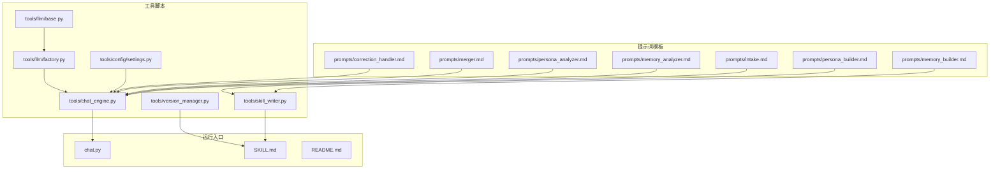
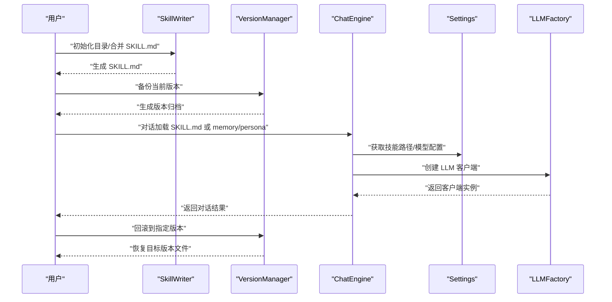
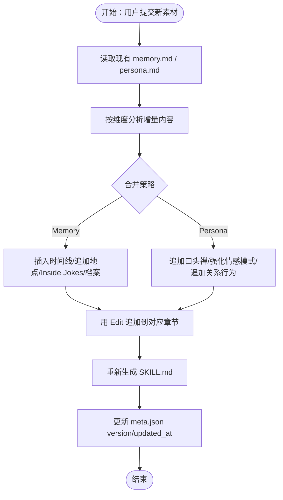
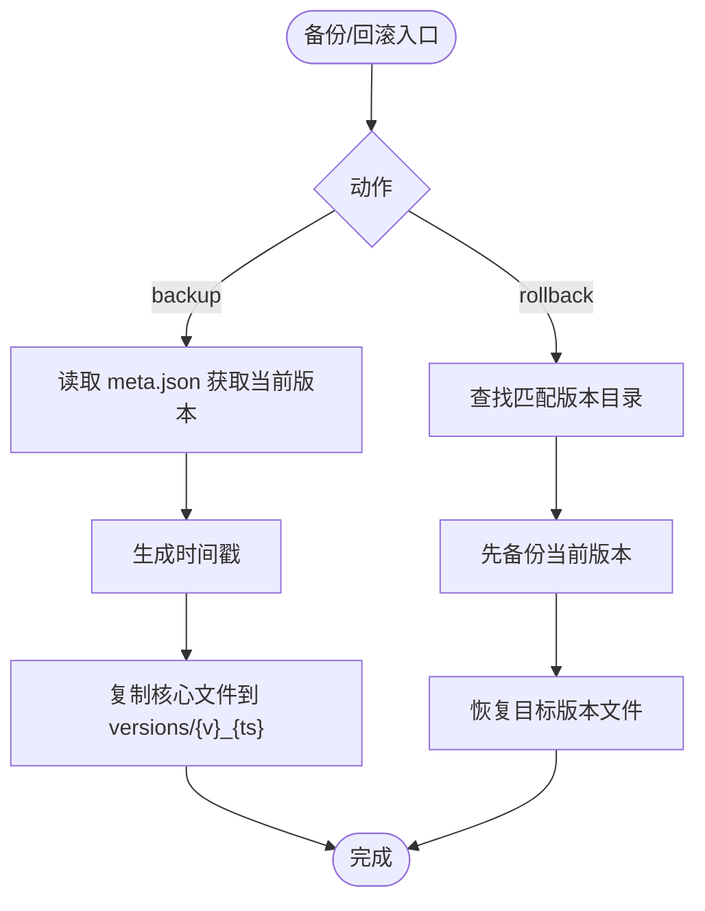
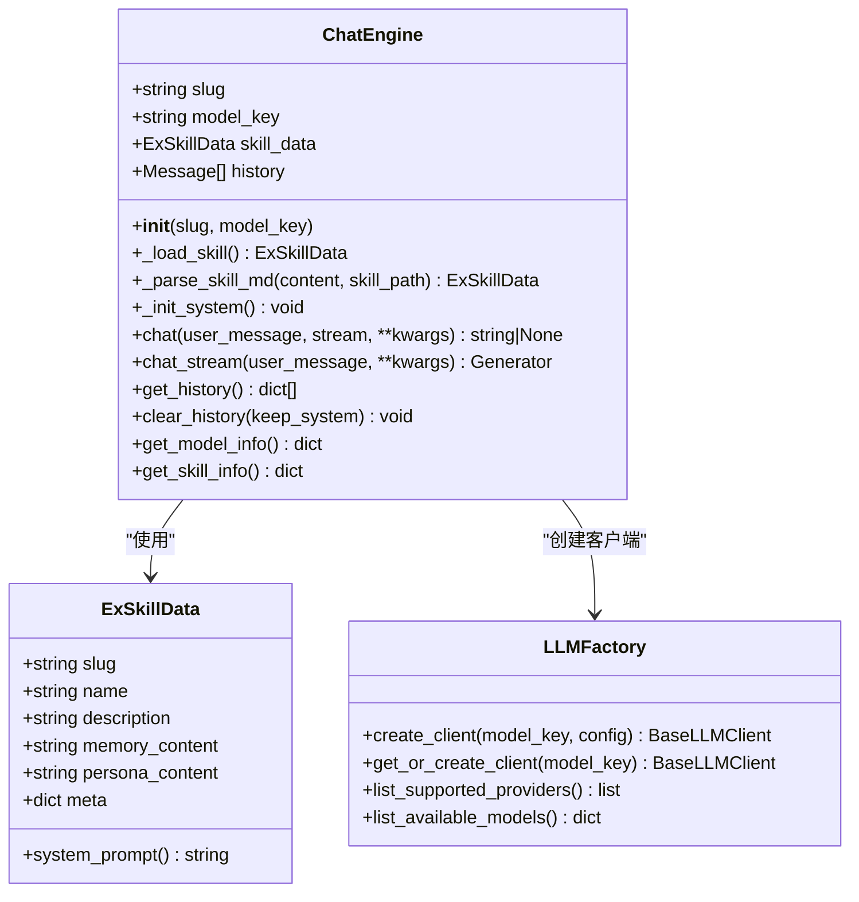
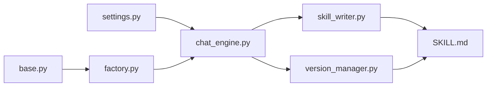

# 技能管理

<cite>
**本文引用的文件**
- [SKILL.md](file://SKILL.md)
- [README.md](file://README.md)
- [tools/version_manager.py](file://tools/version_manager.py)
- [tools/skill_writer.py](file://tools/skill_writer.py)
- [tools/chat_engine.py](file://tools/chat_engine.py)
- [tools/config/settings.py](file://tools/config/settings.py)
- [chat.py](file://chat.py)
- [tools/llm/factory.py](file://tools/llm/factory.py)
- [tools/llm/base.py](file://tools/llm/base.py)
- [prompts/intake.md](file://prompts/intake.md)
- [prompts/memory_analyzer.md](file://prompts/memory_analyzer.md)
- [prompts/persona_analyzer.md](file://prompts/persona_analyzer.md)
- [prompts/memory_builder.md](file://prompts/memory_builder.md)
- [prompts/persona_builder.md](file://prompts/persona_builder.md)
- [prompts/merger.md](file://prompts/merger.md)
- [prompts/correction_handler.md](file://prompts/correction_handler.md)
- [requirements.txt](file://requirements.txt)
</cite>

## 目录
1. [简介](#简介)
2. [项目结构](#项目结构)
3. [核心组件](#核心组件)
4. [架构总览](#架构总览)
5. [详细组件分析](#详细组件分析)
6. [依赖关系分析](#依赖关系分析)
7. [性能考量](#性能考量)
8. [故障排查指南](#故障排查指南)
9. [结论](#结论)
10. [附录](#附录)

## 简介
本技术文档面向“技能管理系统”，聚焦于“前任.skill”的技能生命周期与版本控制机制，系统性阐述技能的创建、编辑、删除与版本管理流程；详解 SKILL.md 的 frontmatter 配置、系统提示词与数据源组织；说明技能文件的目录规范与 Git 集成策略；解释版本管理的自动存档、增量更新与回滚实现原理；并提供技能优化、性能监控与维护的最佳实践与配置模板。

## 项目结构
项目采用“提示词模板 + 工具脚本 + 对话引擎 + 配置管理”的分层组织方式：
- prompts：存放各类提示词模板，驱动信息采集、分析与生成
- tools：包含版本管理、文件写入、对话引擎、LLM 客户端与配置管理
- chat.py：独立运行入口，支持多 API 对话
- SKILL.md：技能入口与运行规则声明
- README.md：安装与使用说明
- requirements.txt：运行依赖

图表来源
- [tools/skill_writer.py:1-171](file://tools/skill_writer.py#L1-L171)
- [tools/version_manager.py:1-116](file://tools/version_manager.py#L1-L116)
- [tools/chat_engine.py:1-284](file://tools/chat_engine.py#L1-L284)
- [tools/config/settings.py:1-225](file://tools/config/settings.py#L1-L225)
- [tools/llm/factory.py:1-82](file://tools/llm/factory.py#L1-L82)
- [tools/llm/base.py:1-68](file://tools/llm/base.py#L1-L68)
- [prompts/intake.md:1-88](file://prompts/intake.md#L1-L88)
- [prompts/memory_analyzer.md:1-95](file://prompts/memory_analyzer.md#L1-L95)
- [prompts/persona_analyzer.md:1-92](file://prompts/persona_analyzer.md#L1-L92)
- [prompts/memory_builder.md:1-122](file://prompts/memory_builder.md#L1-L122)
- [prompts/persona_builder.md:1-129](file://prompts/persona_builder.md#L1-L129)
- [prompts/merger.md:1-45](file://prompts/merger.md#L1-L45)
- [prompts/correction_handler.md:1-56](file://prompts/correction_handler.md#L1-L56)
- [chat.py:1-201](file://chat.py#L1-L201)
- [SKILL.md:1-503](file://SKILL.md#L1-L503)
- [README.md:1-324](file://README.md#L1-L324)

章节来源
- [README.md:235-275](file://README.md#L235-L275)

## 核心组件
- 技能文件管理器：负责列出、初始化目录、合并生成 SKILL.md
- 版本管理器：负责备份、回滚、列举版本
- 对话引擎：加载 SKILL.md 或分离的 memory.md/persona.md，构造系统提示词，与 LLM 交互
- 配置管理：统一管理 API 密钥、模型配置、技能目录路径
- LLM 工厂：按 provider/model 创建对应客户端
- 提示词模板：驱动信息采集、分析与生成

章节来源
- [tools/skill_writer.py:18-144](file://tools/skill_writer.py#L18-L144)
- [tools/version_manager.py:16-92](file://tools/version_manager.py#L16-L92)
- [tools/chat_engine.py:89-171](file://tools/chat_engine.py#L89-L171)
- [tools/config/settings.py:38-212](file://tools/config/settings.py#L38-L212)
- [tools/llm/factory.py:14-81](file://tools/llm/factory.py#L14-L81)

## 架构总览
技能生命周期围绕“创建 → 进化 → 版本管理 → 删除”展开。SKILL.md 作为运行入口，声明 frontmatter 与运行规则；tools/skill_writer.py 负责生成 SKILL.md；tools/version_manager.py 负责版本存档与回滚；tools/chat_engine.py 负责加载技能并进行对话；tools/config/settings.py 提供配置与路径；prompts/* 提供提示词驱动的数据采集与分析。

图表来源
- [tools/skill_writer.py:68-144](file://tools/skill_writer.py#L68-L144)
- [tools/version_manager.py:16-74](file://tools/version_manager.py#L16-L74)
- [tools/chat_engine.py:63-82](file://tools/chat_engine.py#L63-L82)
- [tools/config/settings.py:192-212](file://tools/config/settings.py#L192-L212)
- [tools/llm/factory.py:23-56](file://tools/llm/factory.py#L23-L56)

## 详细组件分析

### SKILL.md 文件结构与 Frontmatter
- frontmatter 字段
  - name：技能标识，如 ex-{slug}
  - description：技能描述，包含姓名与标签（职业、MBTI、星座等）
  - user-invocable：是否可被外部调用
- 正文结构
  - Part A：关系记忆（Relationship Memory）
  - Part B：人物性格（Persona）
  - 运行规则：强调 Layer 0 硬规则与输出风格一致性
- 生成流程
  - 由 tools/skill_writer.py 读取 meta.json 与 memory.md/persona.md，拼接生成 SKILL.md

章节来源
- [SKILL.md:303-341](file://SKILL.md#L303-L341)
- [tools/skill_writer.py:68-144](file://tools/skill_writer.py#L68-L144)

### 技能创建与文件组织
- 目录规范
  - exes/{slug}/versions：版本归档目录
  - exes/{slug}/memories/chats、photos、social：原始素材归档
  - exes/{slug}/memory.md、persona.md、meta.json、SKILL.md：技能核心文件
- 创建流程
  - 信息采集：prompts/intake.md
  - 关系记忆分析：prompts/memory_analyzer.md
  - 人物性格分析：prompts/persona_analyzer.md
  - 内容生成：prompts/memory_builder.md、prompts/persona_builder.md
  - 文件写入：tools/skill_writer.py 生成 SKILL.md 与 meta.json，目录初始化由 tools/skill_writer.py 或 Bash 执行

章节来源
- [SKILL.md:255-301](file://SKILL.md#L255-L301)
- [prompts/intake.md:14-87](file://prompts/intake.md#L14-L87)
- [prompts/memory_analyzer.md:7-95](file://prompts/memory_analyzer.md#L7-L95)
- [prompts/persona_analyzer.md:7-92](file://prompts/persona_analyzer.md#L7-L92)
- [prompts/memory_builder.md:9-122](file://prompts/memory_builder.md#L9-L122)
- [prompts/persona_builder.md:9-129](file://prompts/persona_builder.md#L9-L129)
- [tools/skill_writer.py:54-66](file://tools/skill_writer.py#L54-L66)

### 技能编辑与增量更新
- 增量合并原则：prompts/merger.md
  - 增量不覆盖、冲突标注、时间线补充、证据升级
- 进化模式流程
  - 读取现有 memory.md/persona.md
  - 分析增量内容并追加到对应章节
  - 重新生成 SKILL.md
  - 更新 meta.json 的 version 与 updated_at

图表来源
- [prompts/merger.md:14-44](file://prompts/merger.md#L14-L44)
- [SKILL.md:365-373](file://SKILL.md#L365-L373)

章节来源
- [prompts/merger.md:7-44](file://prompts/merger.md#L7-L44)
- [SKILL.md:359-373](file://SKILL.md#L359-L373)

### 对话纠正与 Correction 记录
- 触发识别：prompts/correction_handler.md
  - 识别“不对/ta不会这样说/太温柔/太冷漠”等表达
- 纠正分类：Memory（事实类）与 Persona（性格类）
- 处理流程
  - 确认纠正内容
  - 生成 Correction 记录并追加到对应文件的 Correction 节
  - 同步修改原文并在旁标注“已纠正”
  - 重新生成 SKILL.md

章节来源
- [prompts/correction_handler.md:7-56](file://prompts/correction_handler.md#L7-L56)
- [SKILL.md:377-386](file://SKILL.md#L377-L386)

### 版本管理系统实现原理
- 自动存档
  - 读取 meta.json 当前版本号与时间戳，生成带时间戳的备份目录
  - 复制 memory.md、persona.md、SKILL.md、meta.json 到 versions/{version}_{timestamp}
- 增量更新
  - 进化模式前先备份当前版本，确保可回滚
- 回滚机制
  - 查找匹配版本目录，先备份当前版本，再恢复目标版本文件
  - 支持列出历史版本

图表来源
- [tools/version_manager.py:16-74](file://tools/version_manager.py#L16-L74)

章节来源
- [tools/version_manager.py:16-92](file://tools/version_manager.py#L16-L92)
- [SKILL.md:366-373](file://SKILL.md#L366-L373)

### 对话引擎与系统提示词
- 数据加载
  - 优先读取 SKILL.md，否则分别读取 memory.md、persona.md、meta.json
- 系统提示词
  - 由 Part A（关系记忆）与 Part B（人物性格）构成
  - 包含运行规则（Layer 0 硬规则优先）
- LLM 客户端
  - 通过 LLMFactory 按 provider/model 创建客户端
  - 支持 OpenAI、Anthropic、Gemini、DashScope、Ollama

图表来源
- [tools/chat_engine.py:17-284](file://tools/chat_engine.py#L17-L284)
- [tools/llm/factory.py:14-81](file://tools/llm/factory.py#L14-L81)
- [tools/llm/base.py:8-68](file://tools/llm/base.py#L8-L68)

章节来源
- [tools/chat_engine.py:89-171](file://tools/chat_engine.py#L89-L171)
- [tools/llm/factory.py:23-56](file://tools/llm/factory.py#L23-L56)
- [tools/llm/base.py:27-68](file://tools/llm/base.py#L27-L68)

### Git 集成策略
- 建议将 exes/ 目录纳入 .gitignore，避免将生成的技能文件提交到版本库
- 将 SKILL.md、prompts/、tools/、chat.py、requirements.txt 等源文件纳入版本控制
- 使用版本管理器进行本地归档，配合 Git 的分支/标签策略进行整体发布与回溯

章节来源
- [SKILL.md:366-373](file://SKILL.md#L366-L373)
- [README.md:269-269](file://README.md#L269-L269)

### 技能生命周期管理最佳实践
- 创建阶段
  - 优先提供高质量聊天记录（微信/QQ）与照片 EXIF，提升还原度
  - 使用 prompts/intake.md 进行结构化信息采集
- 进化阶段
  - 使用 prompts/merger.md 的增量合并策略，避免覆盖既有结论
  - 对话纠正即时生效，通过 prompts/correction_handler.md 的流程保证一致性
- 维护阶段
  - 定期备份版本，使用 tools/version_manager.py 的 backup/rollback
  - 通过 tools/skill_writer.py 的 combine 功能保持 SKILL.md 与 memory/persona 的同步
- 性能与优化
  - 选择合适的模型与温度参数，平衡创造性与稳定性
  - 使用流式输出提升交互体验，必要时关闭流式以获得完整响应

章节来源
- [README.md:192-233](file://README.md#L192-L233)
- [prompts/merger.md:7-44](file://prompts/merger.md#L7-L44)
- [prompts/correction_handler.md:29-56](file://prompts/correction_handler.md#L29-L56)
- [tools/version_manager.py:16-92](file://tools/version_manager.py#L16-L92)
- [tools/skill_writer.py:68-144](file://tools/skill_writer.py#L68-L144)

## 依赖关系分析
- 配置与路径
  - tools/config/settings.py 提供默认模型、API 密钥读取、技能目录路径与可用技能列表
- LLM 客户端
  - tools/llm/factory.py 根据 provider/model 创建对应客户端
  - tools/llm/base.py 定义抽象接口与消息结构
- 对话引擎
  - tools/chat_engine.py 依赖配置与工厂，加载技能并构造系统提示词
- 文件与版本管理
  - tools/skill_writer.py 与 tools/version_manager.py 依赖文件系统与 JSON 元数据

图表来源
- [tools/config/settings.py:38-212](file://tools/config/settings.py#L38-L212)
- [tools/llm/factory.py:14-81](file://tools/llm/factory.py#L14-L81)
- [tools/llm/base.py:8-68](file://tools/llm/base.py#L8-L68)
- [tools/chat_engine.py:63-82](file://tools/chat_engine.py#L63-L82)
- [tools/skill_writer.py:68-144](file://tools/skill_writer.py#L68-L144)
- [tools/version_manager.py:16-74](file://tools/version_manager.py#L16-L74)

章节来源
- [tools/config/settings.py:38-212](file://tools/config/settings.py#L38-L212)
- [tools/llm/factory.py:14-81](file://tools/llm/factory.py#L14-L81)
- [tools/llm/base.py:8-68](file://tools/llm/base.py#L8-L68)
- [tools/chat_engine.py:63-82](file://tools/chat_engine.py#L63-L82)
- [tools/skill_writer.py:68-144](file://tools/skill_writer.py#L68-L144)
- [tools/version_manager.py:16-74](file://tools/version_manager.py#L16-L74)

## 性能考量
- 模型选择与参数
  - 根据任务复杂度选择合适模型，适当降低 temperature 提升一致性
- I/O 与解析
  - 优先使用 SKILL.md 作为单一入口，减少多次文件读取
  - 合理拆分 memory/persona，避免单文件过大
- 流式输出
  - 交互式对话建议启用流式输出，改善用户体验

## 故障排查指南
- 找不到技能或文件
  - 确认 SKILL.md、memory.md、persona.md、meta.json 是否存在
  - 使用 tools/skill_writer.py 的 list 功能检查技能是否存在
- 版本回滚失败
  - 检查版本号是否正确，使用 list 功能查看可用版本
- API 密钥缺失
  - 检查环境变量或 .env 文件是否正确配置
  - 使用 tools/llm/factory.py 的 list_available_models 确认可用模型

章节来源
- [tools/chat_engine.py:94-96](file://tools/chat_engine.py#L94-L96)
- [tools/version_manager.py:51-61](file://tools/version_manager.py#L51-L61)
- [tools/llm/factory.py:71-81](file://tools/llm/factory.py#L71-L81)

## 结论
本系统通过 SKILL.md 的 frontmatter 与运行规则、prompt 驱动的信息采集与分析、以及 tools/skill_writer.py 与 tools/version_manager.py 的协同，实现了技能的创建、进化、版本管理与删除的闭环。结合 tools/chat_engine.py 的对话引擎与多模型支持，既能满足个人情感疗愈场景，也为后续扩展与维护提供了清晰的架构与流程。

## 附录
- 配置模板与示例
  - API 密钥与模型配置：参考 tools/config/settings.py 的 ModelConfig 与 Settings
  - 独立运行示例：参考 chat.py 的命令行参数与示例
  - 依赖安装：参考 requirements.txt
- 目录规范与 Git 策略
  - exes/ 目录纳入 .gitignore，源文件纳入版本控制
  - 使用 tools/version_manager.py 进行本地版本归档与回滚

章节来源
- [tools/config/settings.py:12-225](file://tools/config/settings.py#L12-L225)
- [chat.py:128-197](file://chat.py#L128-L197)
- [requirements.txt:1-12](file://requirements.txt#L1-L12)
- [README.md:269-269](file://README.md#L269-L269)