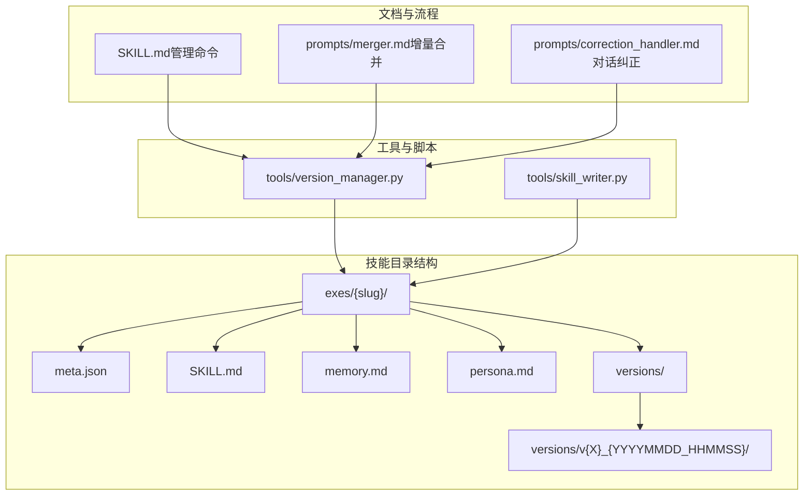
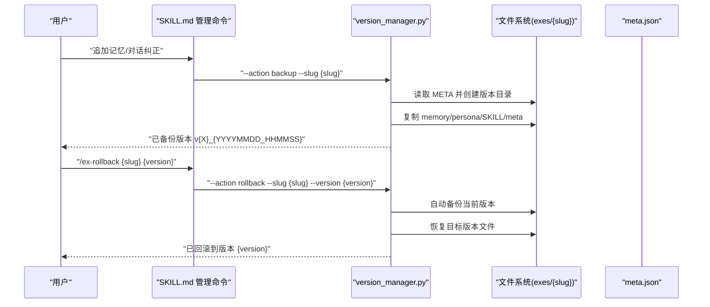
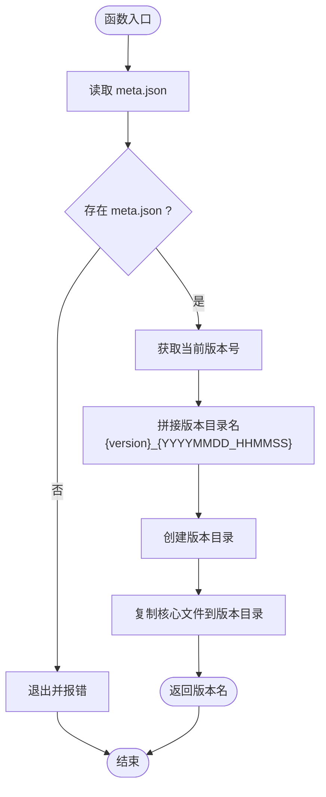
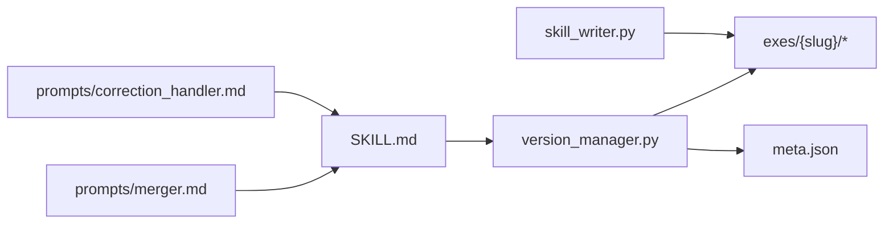

# 版本控制系统

<cite>
**本文引用的文件**
- [tools/version_manager.py](file://tools/version_manager.py)
- [tools/skill_writer.py](file://tools/skill_writer.py)
- [SKILL.md](file://SKILL.md)
- [README.md](file://README.md)
- [INSTALL.md](file://INSTALL.md)
- [prompts/merger.md](file://prompts/merger.md)
- [prompts/correction_handler.md](file://prompts/correction_handler.md)
- [exes/小羊/meta.json](file://exes/小羊/meta.json)
- [exes/小羊/SKILL.md](file://exes/小羊/SKILL.md)
</cite>

## 目录
1. [简介](#简介)
2. [项目结构](#项目结构)
3. [核心组件](#核心组件)
4. [架构总览](#架构总览)
5. [详细组件分析](#详细组件分析)
6. [依赖分析](#依赖分析)
7. [性能考虑](#性能考虑)
8. [故障排除指南](#故障排除指南)
9. [结论](#结论)
10. [附录](#附录)

## 简介
本技术文档围绕“版本控制系统”展开，聚焦于技能版本管理的实现原理与使用方法，包括：
- 自动备份机制：在追加记忆、对话纠正等关键变更时自动创建版本快照
- 版本号递增规则：基于 meta.json 中 version 字段进行语义化版本管理
- Git 集成策略：建议将 exes 目录纳入 Git 忽略范围，使用版本管理器进行本地版本控制
- 版本回滚功能：rollback 命令的使用方法、版本比较逻辑与数据恢复机制
- 版本文件存储结构、命名规范与清理策略
- 最佳实践与故障排除指南

## 项目结构
版本控制系统位于 tools/version_manager.py，配合 SKILL.md 中的管理命令与 prompts/merger.md、prompts/correction_handler.md 的工作流，形成完整的版本演进闭环。

图表来源
- [tools/version_manager.py:16-43](file://tools/version_manager.py#L16-L43)
- [tools/version_manager.py:46-73](file://tools/version_manager.py#L46-L73)
- [tools/version_manager.py:76-91](file://tools/version_manager.py#L76-L91)
- [tools/skill_writer.py:54-66](file://tools/skill_writer.py#L54-L66)
- [SKILL.md:366-374](file://SKILL.md#L366-L374)
- [prompts/merger.md:14-45](file://prompts/merger.md#L14-L45)
- [prompts/correction_handler.md:29-56](file://prompts/correction_handler.md#L29-L56)

章节来源
- [tools/version_manager.py:16-116](file://tools/version_manager.py#L16-L116)
- [tools/skill_writer.py:54-66](file://tools/skill_writer.py#L54-L66)
- [SKILL.md:366-401](file://SKILL.md#L366-L401)
- [prompts/merger.md:14-45](file://prompts/merger.md#L14-L45)
- [prompts/correction_handler.md:29-56](file://prompts/correction_handler.md#L29-L56)

## 核心组件
- 版本管理器（version_manager.py）
  - 备份：读取 meta.json 获取当前版本号，拼接时间戳生成版本目录，复制 memory.md、persona.md、SKILL.md、meta.json
  - 回滚：按版本前缀或精确名称匹配目标版本目录，先自动备份当前版本，再恢复目标版本文件
  - 列表：列出 versions 目录下的所有版本（降序）
- 技能写入器（skill_writer.py）
  - 初始化：创建 exes/{slug}/versions 以及子目录结构
- 管理命令（SKILL.md）
  - 追加记忆：执行版本备份后再写入增量内容并重新生成 SKILL.md
  - 对话纠正：生成 correction 记录并更新 SKILL.md
  - 回滚命令：调用 version_manager.py 执行回滚

章节来源
- [tools/version_manager.py:16-116](file://tools/version_manager.py#L16-L116)
- [tools/skill_writer.py:54-66](file://tools/skill_writer.py#L54-L66)
- [SKILL.md:366-401](file://SKILL.md#L366-L401)

## 架构总览
版本控制系统通过“变更触发—自动备份—版本归档—回滚恢复”的闭环实现技能版本管理。变更来源包括追加记忆与对话纠正两大类，均由 prompts/merger.md 与 prompts/correction_handler.md 提供策略指导。

图表来源
- [SKILL.md:366-401](file://SKILL.md#L366-L401)
- [tools/version_manager.py:16-73](file://tools/version_manager.py#L16-L73)
- [prompts/merger.md:14-45](file://prompts/merger.md#L14-L45)
- [prompts/correction_handler.md:29-56](file://prompts/correction_handler.md#L29-L56)

## 详细组件分析

### 组件A：版本管理器（version_manager.py）
- 备份流程
  - 读取 meta.json 获取当前版本号（默认 v0）
  - 生成版本目录名：{version}_{YYYYMMDD_HHMMSS}
  - 复制核心文件到版本目录
- 回滚流程
  - 遍历 versions 目录，支持前缀匹配或精确匹配
  - 匹配成功后先执行一次备份，再恢复目标版本文件
  - 匹配失败时打印可用版本列表并退出
- 列表流程
  - 读取 versions 目录并降序排序输出

图表来源
- [tools/version_manager.py:16-43](file://tools/version_manager.py#L16-L43)

章节来源
- [tools/version_manager.py:16-116](file://tools/version_manager.py#L16-L116)

### 组件B：技能写入器（skill_writer.py）
- 初始化目录结构：创建 exes/{slug}/versions 以及 memories 子目录
- 便于后续版本管理与记忆素材归档

章节来源
- [tools/skill_writer.py:54-66](file://tools/skill_writer.py#L54-L66)

### 组件C：管理命令与工作流（SKILL.md）
- 追加记忆：在写入增量内容前调用备份命令，确保可回滚
- 对话纠正：生成 correction 记录并更新 SKILL.md
- 回滚命令：调用 version_manager.py 执行回滚

章节来源
- [SKILL.md:366-401](file://SKILL.md#L366-L401)

### 组件D：增量合并与纠正策略（prompts/merger.md、prompts/correction_handler.md）
- 增量合并：不覆盖既有结论，按维度追加；冲突标注；按时间线插入事件
- 对话纠正：区分 Memory 与 Persona 纠正，生成 correction 记录并同步更新原文

章节来源
- [prompts/merger.md:14-45](file://prompts/merger.md#L14-L45)
- [prompts/correction_handler.md:29-56](file://prompts/correction_handler.md#L29-L56)

## 依赖分析
- 版本管理器依赖文件系统与 JSON 元数据
- 管理命令依赖版本管理器与技能文件结构
- 增量合并与纠正策略为版本管理提供变更规则

图表来源
- [tools/version_manager.py:16-116](file://tools/version_manager.py#L16-L116)
- [tools/skill_writer.py:54-66](file://tools/skill_writer.py#L54-L66)
- [SKILL.md:366-401](file://SKILL.md#L366-L401)
- [prompts/merger.md:14-45](file://prompts/merger.md#L14-L45)
- [prompts/correction_handler.md:29-56](file://prompts/correction_handler.md#L29-L56)

章节来源
- [tools/version_manager.py:16-116](file://tools/version_manager.py#L16-L116)
- [tools/skill_writer.py:54-66](file://tools/skill_writer.py#L54-L66)
- [SKILL.md:366-401](file://SKILL.md#L366-L401)
- [prompts/merger.md:14-45](file://prompts/merger.md#L14-L45)
- [prompts/correction_handler.md:29-56](file://prompts/correction_handler.md#L29-L56)

## 性能考虑
- 备份采用文件复制，规模取决于技能文件大小；版本目录仅保存必要文件，避免冗余
- 回滚时仅恢复核心文件，不影响其他素材目录
- 建议定期清理旧版本目录，保留最近若干版本以平衡恢复能力与磁盘占用

## 故障排除指南
- 找不到版本
  - 现象：回滚时报“找不到版本”
  - 处理：先执行 list 列出可用版本，确认版本名前缀或完整名称
- 缺少 meta.json
  - 现象：备份时报“meta.json 不存在”
  - 处理：确认技能目录结构完整，meta.json 存在且可读
- 未提供 --version 参数
  - 现象：rollback 报错提示需要版本参数
  - 处理：提供 --version 或使用 list 查看可用版本
- 版本目录为空
  - 现象：versions 目录不存在或为空
  - 处理：先进行一次备份或初始化目录结构

章节来源
- [tools/version_manager.py:22-24](file://tools/version_manager.py#L22-L24)
- [tools/version_manager.py:58-61](file://tools/version_manager.py#L58-L61)
- [tools/version_manager.py:106-108](file://tools/version_manager.py#L106-L108)
- [tools/skill_writer.py:54-66](file://tools/skill_writer.py#L54-L66)

## 结论
版本控制系统通过“变更触发—自动备份—版本归档—回滚恢复”的闭环，保障技能文件在追加记忆与对话纠正过程中的可追溯与可恢复性。配合 meta.json 的版本号管理与 SKILL.md 的管理命令，用户可在不依赖外部 VCS 的情况下实现本地版本控制与快速回滚。

## 附录

### 命令行示例
- 备份当前版本
  - python3 tools/version_manager.py --action backup --slug 小羊 --base-dir ./exes
- 回滚到指定版本
  - python3 tools/version_manager.py --action rollback --slug 小羊 --version v1_20241201_143022 --base-dir ./exes
- 列出历史版本
  - python3 tools/version_manager.py --action list --slug 小羊 --base-dir ./exes
- 追加记忆（管理命令）
  - 在 SKILL.md 中执行“追加记忆”流程，内部会先执行备份再写入增量
- 对话纠正（管理命令）
  - 在 SKILL.md 中执行“对话纠正”流程，生成 correction 记录并更新 SKILL.md

章节来源
- [tools/version_manager.py:94-112](file://tools/version_manager.py#L94-L112)
- [SKILL.md:366-401](file://SKILL.md#L366-L401)

### 版本文件存储结构与命名规范
- 存储位置
  - exes/{slug}/versions/{version_name}/
- 版本命名规范
  - {version}_{YYYYMMDD_HHMMSS}
  - version 来自 meta.json 的 version 字段
- 核心文件
  - memory.md、persona.md、SKILL.md、meta.json
- 示例
  - v1_20260401_144543

章节来源
- [tools/version_manager.py:29-31](file://tools/version_manager.py#L29-L31)
- [exes/小羊/meta.json:6](file://exes/小羊/meta.json#L6)
- [exes/小羊/SKILL.md:1-90](file://exes/小羊/SKILL.md#L1-L90)

### 版本号递增规则与 Git 集成策略
- 版本号递增规则
  - 由 meta.json 的 version 字段表示；在追加记忆与对话纠正后，meta.json 会更新 version 与 updated_at
- Git 集成策略
  - 建议将 exes 目录加入 .gitignore，避免将大量版本快照提交到 Git
  - 使用版本管理器进行本地版本控制，必要时可将 SKILL.md、memory.md、persona.md 的最终状态提交到 Git，以记录“里程碑式”的稳定版本

章节来源
- [SKILL.md:366-374](file://SKILL.md#L366-L374)
- [INSTALL.md:89-96](file://INSTALL.md#L89-L96)
- [exes/小羊/meta.json:6](file://exes/小羊/meta.json#L6)

### 版本回滚实现细节
- 匹配逻辑
  - 支持前缀匹配或精确匹配目标版本目录
- 自动备份
  - 回滚前自动备份当前版本，防止不可逆操作
- 恢复范围
  - 仅恢复核心文件，不涉及 memories 等素材目录

章节来源
- [tools/version_manager.py:51-73](file://tools/version_manager.py#L51-L73)

### 最佳实践
- 何时创建版本
  - 每次追加记忆、对话纠正后自动创建版本
- 如何命名版本
  - 使用 {version}_{YYYYMMDD_HHMMSS}，version 来自 meta.json
- 版本清理策略
  - 保留最近若干版本作为“可回滚窗口”，定期清理过旧版本
- Git 策略
  - 将 exes 目录忽略，仅提交 SKILL.md、memory.md、persona.md 的最终稳定版本

章节来源
- [prompts/merger.md:14-45](file://prompts/merger.md#L14-L45)
- [prompts/correction_handler.md:29-56](file://prompts/correction_handler.md#L29-L56)
- [INSTALL.md:89-96](file://INSTALL.md#L89-L96)