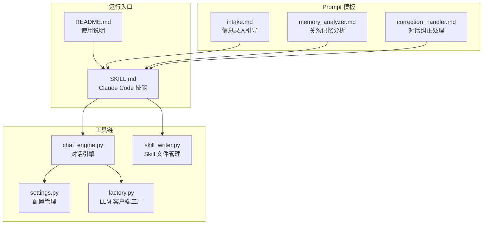
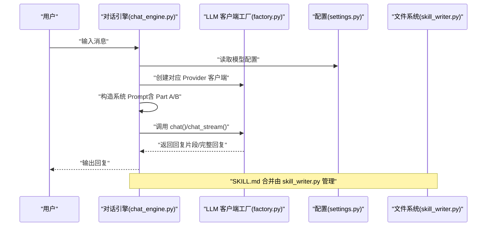
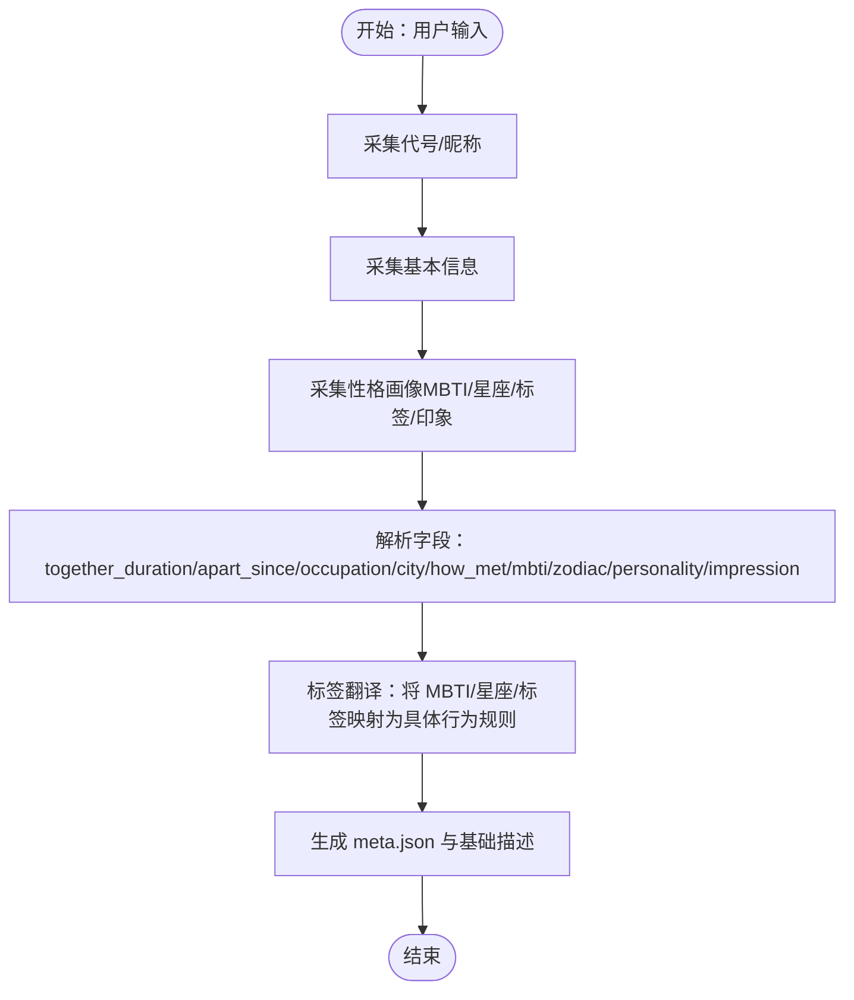
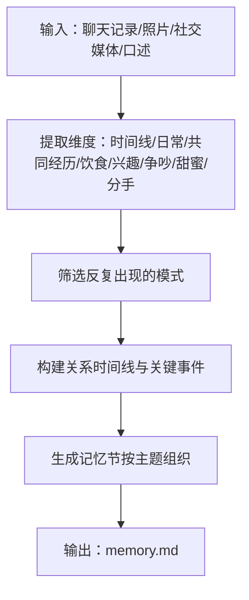
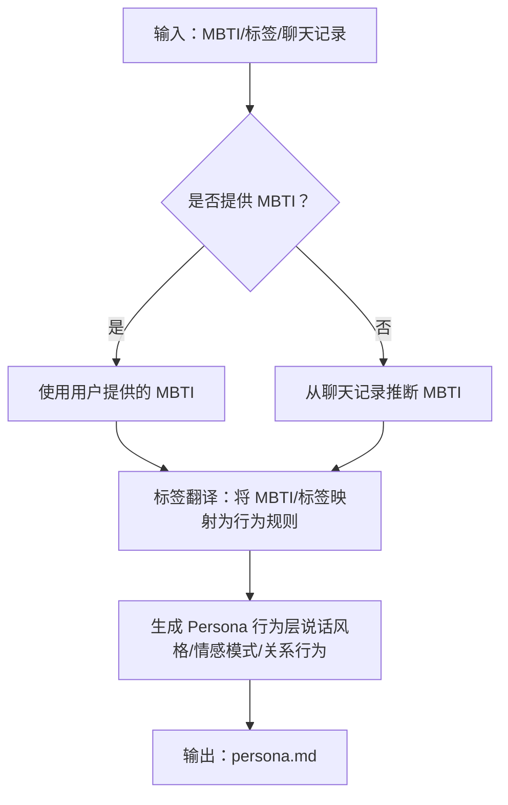
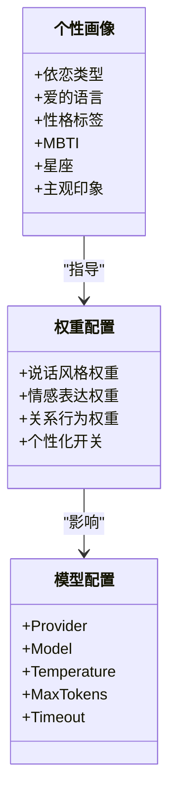
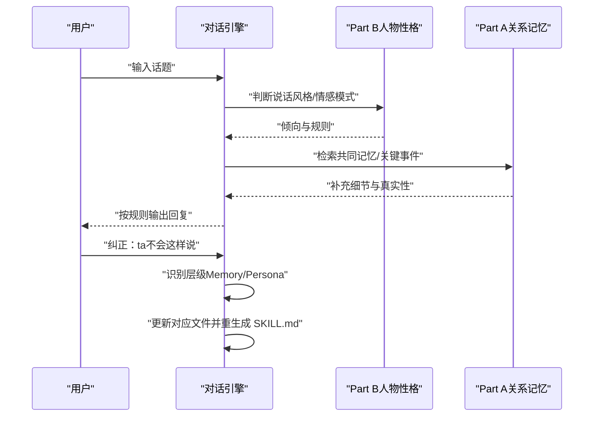
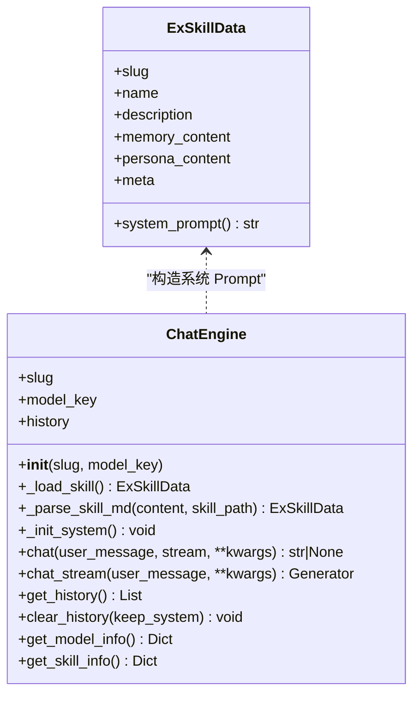
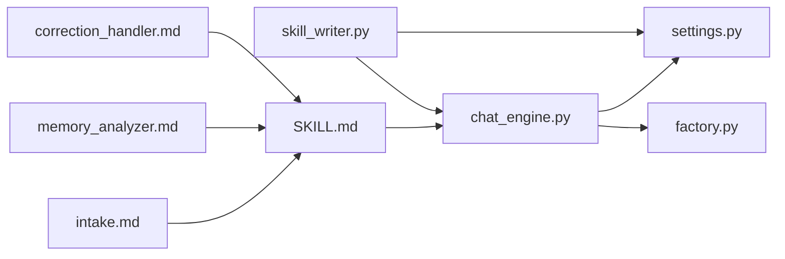

# 人物性格构建模板

<cite>
**本文引用的文件**
- [README.md](file://README.md)
- [SKILL.md](file://SKILL.md)
- [intake.md](file://prompts/intake.md)
- [memory_analyzer.md](file://prompts/memory_analyzer.md)
- [correction_handler.md](file://prompts/correction_handler.md)
- [chat_engine.py](file://tools/chat_engine.py)
- [settings.py](file://tools/config/settings.py)
- [factory.py](file://tools/llm/factory.py)
- [skill_writer.py](file://tools/skill_writer.py)
</cite>

## 目录
1. [简介](#简介)
2. [项目结构](#项目结构)
3. [核心组件](#核心组件)
4. [架构总览](#架构总览)
5. [详细组件分析](#详细组件分析)
6. [依赖分析](#依赖分析)
7. [性能考虑](#性能考虑)
8. [故障排查指南](#故障排查指南)
9. [结论](#结论)
10. [附录](#附录)

## 简介
本文件围绕“人物性格构建模板”进行系统化说明，目标是帮助读者理解如何从行为模式、语言特征与情感表达中构建完整的人物模型，并实现 MBTI 类型推断与个性画像生成。项目采用“关系记忆（Part A）+ 人物性格（Part B）”的双层结构，通过 Prompt 模板驱动 LLM 生成可交互的前任 Skill。本文将重点阐述：
- 性格特征提取算法与维度划分
- MBTI 类型推断与标签翻译
- 个性画像生成方法与权重配置
- 行为倾向预测与互动策略制定
- 构建示例、特征权重与个性化配置选项

## 项目结构
该项目围绕“对话式创建 + 多源材料导入 + 双层结构生成”的流程组织，关键模块如下：
- Prompt 模板：信息录入、关系记忆分析、对话纠正处理等
- 工具链：对话引擎、配置管理、LLM 客户端工厂、Skill 文件管理
- 运行入口：Claude Code 技能与独立运行（chat.py）

**图表来源**
- [SKILL.md](file://SKILL.md)
- [README.md](file://README.md)
- [intake.md](file://prompts/intake.md)
- [memory_analyzer.md](file://prompts/memory_analyzer.md)
- [correction_handler.md](file://prompts/correction_handler.md)
- [chat_engine.py](file://tools/chat_engine.py)
- [settings.py](file://tools/config/settings.py)
- [factory.py](file://tools/llm/factory.py)
- [skill_writer.py](file://tools/skill_writer.py)

**章节来源**
- [README.md:281-321](file://README.md#L281-L321)
- [SKILL.md:1-503](file://SKILL.md#L1-L503)

## 核心组件
- 信息录入引导（intake.md）：采集代号、基本信息与性格画像，产出结构化字段（如 MBTI、星座、性格标签、主观印象）
- 关系记忆分析（memory_analyzer.md）：从材料中提取关系时间线、日常模式、共同经历、饮食偏好、兴趣爱好、争吵模式、甜蜜瞬间与分手记忆
- 对话纠正处理（correction_handler.md）：识别用户纠正意图，区分 Memory（事实类）与 Persona（性格类），即时更新并重生成 SKILL.md
- 对话引擎（chat_engine.py）：加载 Part A/B 内容，构造系统 Prompt，维护对话历史，调用 LLM 客户端生成回复
- 配置管理（settings.py）：统一管理模型配置、默认 Provider/Model、环境变量与技能目录
- LLM 客户端工厂（factory.py）：按 Provider 自动创建对应客户端（OpenAI、Anthropic、Gemini、DashScope、Ollama）
- Skill 文件管理（skill_writer.py）：合并 memory.md 与 persona.md 生成 SKILL.md，支持列出与初始化目录结构

**章节来源**
- [intake.md:1-88](file://prompts/intake.md#L1-L88)
- [memory_analyzer.md:1-95](file://prompts/memory_analyzer.md#L1-L95)
- [correction_handler.md:1-56](file://prompts/correction_handler.md#L1-L56)
- [chat_engine.py:17-284](file://tools/chat_engine.py#L17-L284)
- [settings.py:12-225](file://tools/config/settings.py#L12-L225)
- [factory.py:14-82](file://tools/llm/factory.py#L14-L82)
- [skill_writer.py:18-171](file://tools/skill_writer.py#L18-L171)

## 架构总览
整体运行逻辑遵循“先性格判断，再记忆补充”的双层推理：用户消息进入对话引擎后，系统先依据 Part B（人物性格）判断该人物的回应倾向与情感模式，再结合 Part A（关系记忆）补充真实且个性化的细节。

**图表来源**
- [chat_engine.py:60-284](file://tools/chat_engine.py#L60-L284)
- [factory.py:14-82](file://tools/llm/factory.py#L14-L82)
- [settings.py:12-225](file://tools/config/settings.py#L12-L225)
- [skill_writer.py:68-145](file://tools/skill_writer.py#L68-L145)

## 详细组件分析

### 组件A：信息录入与性格画像生成
- 信息采集维度
  - 代号/昵称：用于 slug 生成与后续交互
  - 基本信息：在一起时长、分手时长、职业、城市、认识方式
  - 性格画像：MBTI、星座、性格标签、主观印象
- 性格画像到行为规则的映射
  - MBTI 类型：影响沟通风格与决策模式
  - 星座：影响标签翻译规则（例如特定表达习惯）
  - 性格标签：如话痨、嘴硬心软、控制欲、完美主义等，转化为具体的行为倾向与语言习惯
- 输出结构
  - meta.json 中 profile 与 tags 字段
  - 用于生成 SKILL.md 的基础描述与运行规则

**图表来源**
- [intake.md:14-88](file://prompts/intake.md#L14-L88)

**章节来源**
- [intake.md:14-88](file://prompts/intake.md#L14-L88)
- [SKILL.md:272-298](file://SKILL.md#L272-L298)

### 组件B：关系记忆提取与行为模式分析
- 提取维度
  - 关系时间线：认识、确定关系、关键节点、分手及原因、分手后互动
  - 日常模式：联系频率与时间段、谁更主动、约会偏好与频率、日常话题分布
  - 共同经历：去过的地方、做过的事、旅行记忆、Only You 梗
  - 饮食偏好：爱吃/不爱吃、常去餐厅、做饭习惯、约会吃饭模式
  - 兴趣爱好：音乐/电影/书籍/游戏、日常爱好、共同爱好、分享内容偏好
  - 争吵模式：常见原因、典型反应、谁先道歉、冷战时长、经典台词
  - 甜蜜瞬间：心动时刻、表达爱意方式、日常小甜蜜、特别纪念日
  - 分手相关：分手原因（双方视角）、最后一次对话、分手后状态、未说出口的话
- 输出格式
  - 以 Markdown 节形式组织，强调“反复出现”的模式而非一次性事件
  - 时间信息尽量精确（从聊天记录时间戳推断）

**图表来源**
- [memory_analyzer.md:7-95](file://prompts/memory_analyzer.md#L7-L95)

**章节来源**
- [memory_analyzer.md:1-95](file://prompts/memory_analyzer.md#L1-L95)

### 组件C：MBTI 类型推断与标签翻译
- MBTI 推断依据
  - 信息来源：用户提供的 MBTI 类型；若缺失，则从聊天记录中统计语言特征与行为模式，辅助推断
  - 语言特征：高频词、口头禅、语气词、标点习惯、话题分布
  - 行为模式：回复速度（秒回/已读不回/深夜回复）、主动发起对话频率、争吵与和好模式
- 标签翻译
  - 将“话痨、嘴硬心软、控制欲、完美主义、拖延症、工作狂、报复性熬夜、朋友圈三天可见、半夜发语音”等标签翻译为具体的行为规则与表达习惯
  - 星座影响标签翻译规则（例如某些表达习惯或偏好）

**图表来源**
- [SKILL.md:261-272](file://SKILL.md#L261-L272)
- [intake.md:53-76](file://prompts/intake.md#L53-L76)

**章节来源**
- [SKILL.md:261-272](file://SKILL.md#L261-L272)
- [intake.md:53-76](file://prompts/intake.md#L53-L76)

### 组件D：个性画像生成与权重配置
- 个性画像构成
  - 依恋类型：安全型/焦虑型/回避型/混乱型
  - 爱的语言：肯定的言辞、精心的时刻、接受礼物、服务的行动、身体的接触
  - 性格标签：基于聊天记录与用户描述提炼
- 权重与个性化配置
  - 说话风格权重：口头禅、语气词、标点习惯
  - 情感表达权重：争吵模式、甜蜜瞬间、分手记忆
  - 关系行为权重：主动发起频率、回复速度、纪念日关注
  - 个性化开关：是否启用“对话纠正”即时更新；是否保留“棱角”（不完美）
- 配置项
  - 模型 Provider/Model、温度、最大 Token、超时
  - 目录结构：exes/{slug}/memories/chats、photos、social

**图表来源**
- [SKILL.md:261-272](file://SKILL.md#L261-L272)
- [settings.py:12-225](file://tools/config/settings.py#L12-L225)

**章节来源**
- [SKILL.md:261-272](file://SKILL.md#L261-L272)
- [settings.py:12-225](file://tools/config/settings.py#L12-L225)

### 组件E：行为倾向预测与互动策略制定
- 行为倾向预测
  - 基于 Part B 的说话风格与情感模式，预测在不同话题下的回应倾向
  - 结合 Part A 的关系记忆，增强真实感与一致性
- 互动策略
  - 记忆驱动：在涉及共同经历时自然唤起记忆
  - 风格保持：始终维持口头禅、语气词、标点习惯
  - 边界控制：Layer 0 硬规则优先，避免“突然完美”或“无条件包容”
- 纠正与迭代
  - 用户表达“ta不会这样说”时，进入纠正流程，区分 Memory 与 Persona，即时更新并重生成 SKILL.md

**图表来源**
- [SKILL.md:330-341](file://SKILL.md#L330-L341)
- [correction_handler.md:29-50](file://prompts/correction_handler.md#L29-L50)

**章节来源**
- [SKILL.md:330-341](file://SKILL.md#L330-L341)
- [correction_handler.md:1-56](file://prompts/correction_handler.md#L1-L56)

### 组件F：对话引擎与运行规则
- 系统 Prompt 构造
  - 将 Part A/B 与运行规则注入系统消息，确保回复符合人物设定
- 对话历史管理
  - 维护用户与助手消息，支持清空与保留系统消息
- 模型选择与调用
  - 通过工厂按 Provider 创建客户端，支持 OpenAI、Anthropic、Gemini、DashScope、Ollama
- 流式与非流式输出
  - 支持流式输出，逐步拼接完整回复并加入历史

**图表来源**
- [chat_engine.py:17-284](file://tools/chat_engine.py#L17-L284)

**章节来源**
- [chat_engine.py:17-284](file://tools/chat_engine.py#L17-L284)

## 依赖分析
- 组件耦合
  - 对话引擎依赖配置管理与 LLM 客户端工厂
  - SKILL.md 合并依赖 Skill 文件管理器
  - Prompt 模板为上游输入与分析提供结构化指引
- 外部依赖
  - 多 Provider 的 LLM API（OpenAI、Anthropic、Gemini、DashScope、Ollama）
  - 环境变量与 .env 文件读取 API Key 与模型配置
- 潜在循环依赖
  - 当前模块间为单向依赖（Prompt → 工具链 → 运行入口），无明显循环

**图表来源**
- [chat_engine.py:60-284](file://tools/chat_engine.py#L60-L284)
- [factory.py:14-82](file://tools/llm/factory.py#L14-L82)
- [settings.py:12-225](file://tools/config/settings.py#L12-L225)
- [skill_writer.py:68-145](file://tools/skill_writer.py#L68-L145)
- [SKILL.md:1-503](file://SKILL.md#L1-L503)
- [intake.md:1-88](file://prompts/intake.md#L1-L88)
- [memory_analyzer.md:1-95](file://prompts/memory_analyzer.md#L1-L95)
- [correction_handler.md:1-56](file://prompts/correction_handler.md#L1-L56)

**章节来源**
- [factory.py:14-82](file://tools/llm/factory.py#L14-L82)
- [settings.py:12-225](file://tools/config/settings.py#L12-L225)

## 性能考虑
- 模型选择
  - 高质量模型（如 gpt-4o、claude-3-opus）在复杂推理与一致性保持上表现更好
  - 本地模型（Ollama）可降低延迟，但需注意上下文长度与算力限制
- Token 与温度
  - 适当提高温度可增加创造性，但可能导致回复漂移；建议在 0.6~0.8 区间平衡
  - 控制 max_tokens 以避免过长输出导致成本上升
- 历史管理
  - 长对话建议定期清理历史，保留系统消息与最近若干轮，减少上下文冗余
- I/O 与文件合并
  - 合并 SKILL.md 时避免频繁读写，批量生成后再写入

## 故障排查指南
- 找不到前任 Skill
  - 检查 exes/{slug} 目录是否存在，确认 meta.json 与 SKILL.md 是否生成
  - 使用列出命令查看已生成的技能清单
- 模型配置错误
  - 确认环境变量/API Key 设置正确，或在 .env 文件中配置
  - 检查默认 Provider/Model 是否匹配
- 对话不符合预期
  - 使用“对话纠正”功能指出具体不符之处，系统会区分 Memory 与 Persona 并更新
  - 检查 Part B 的说话风格与情感模式是否与 Part A 的记忆一致
- 生成文件异常
  - 使用 skill_writer.py 的 combine 功能重新生成 SKILL.md
  - 确保 memory.md 与 persona.md 内容完整且结构正确

**章节来源**
- [chat_engine.py:89-131](file://tools/chat_engine.py#L89-L131)
- [settings.py:192-212](file://tools/config/settings.py#L192-L212)
- [correction_handler.md:29-50](file://prompts/correction_handler.md#L29-L50)
- [skill_writer.py:68-145](file://tools/skill_writer.py#L68-L145)

## 结论
本模板通过“信息录入 → 关系记忆提取 → MBTI 推断与标签翻译 → 个性画像生成 → 行为倾向预测 → 互动策略制定”的闭环，实现了从多源材料到可交互人物模型的自动化构建。其关键优势在于：
- 双层结构清晰分离“性格规则”与“关系记忆”，便于分别优化与迭代
- Prompt 模板标准化提取维度，保证结果可复现与可解释
- 对话纠正机制允许用户即时修正偏差，形成持续演进的模型
- 多 Provider 支持与灵活配置满足不同场景需求

## 附录
- 构建示例
  - 输入：代号“初恋”、基本信息“在一起三年，大学时期，ENFP，双子座，话痨，半夜给我发语音，分手后还给我点赞”
  - 步骤：信息录入 → 微信/QQ/社交媒体/照片导入 → 关系记忆分析 → MBTI/标签翻译 → 生成 memory.md 与 persona.md → 合并 SKILL.md
- 特征权重建议
  - 说话风格：0.4（口头禅/语气词/标点）
  - 情感表达：0.3（争吵/甜蜜/分手记忆）
  - 关系行为：0.3（主动发起/回复速度/纪念日）
- 个性化配置选项
  - Provider/Model 自定义
  - Temperature/MaxTokens/Timeout 调整
  - 是否启用对话纠正与版本回滚
  - 是否保留“棱角”与“不完美”