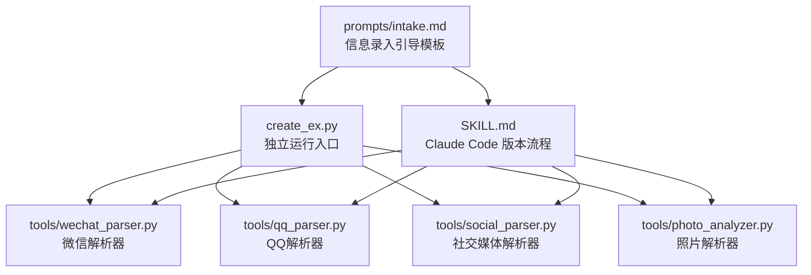
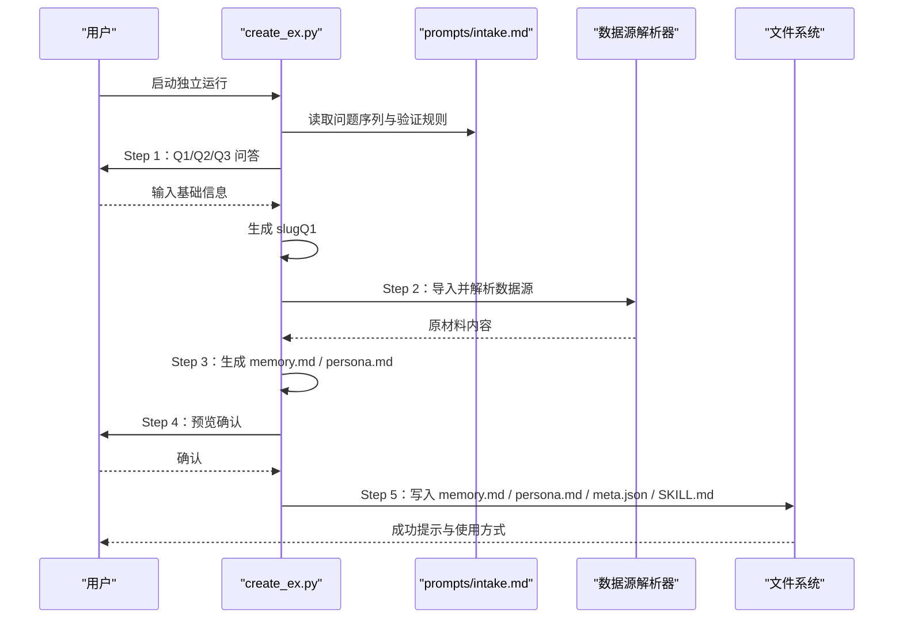
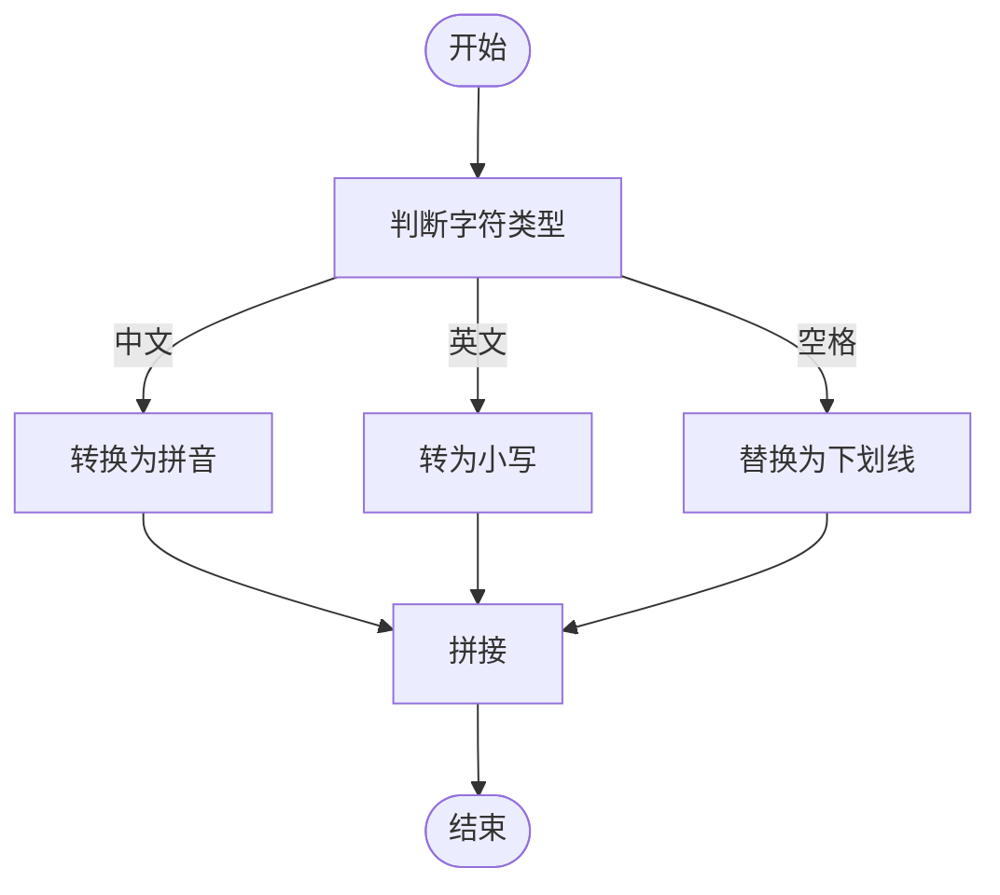
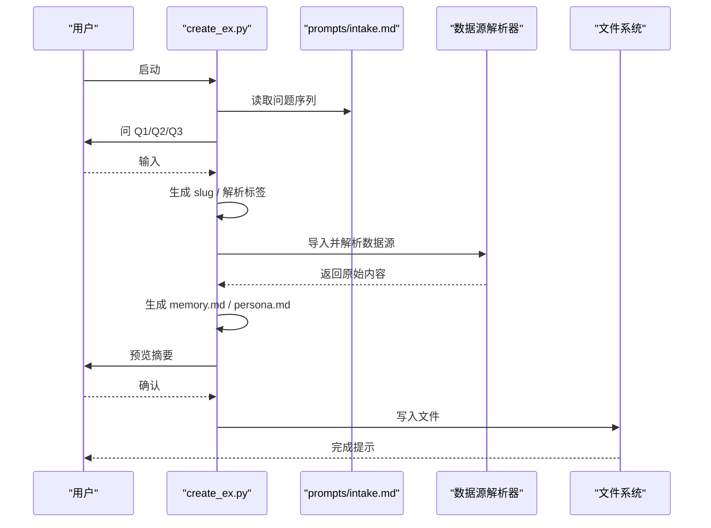
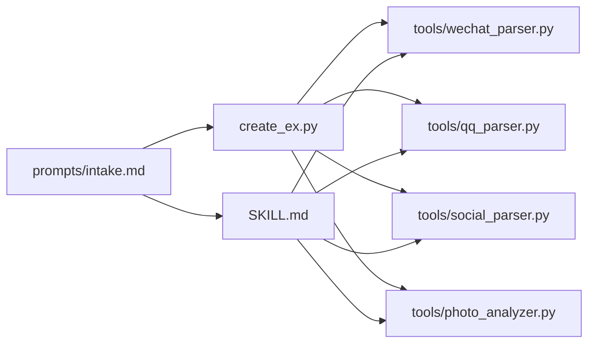

# 信息录入引导模板

<cite>
**本文引用的文件**
- [prompts/intake.md](file://prompts/intake.md)
- [create_ex.py](file://create_ex.py)
- [SKILL.md](file://SKILL.md)
- [wechat_parser.py](file://tools/wechat_parser.py)
- [qq_parser.py](file://tools/qq_parser.py)
- [social_parser.py](file://tools/social_parser.py)
- [README.md](file://README.md)
</cite>

## 目录
1. [简介](#简介)
2. [项目结构](#项目结构)
3. [核心组件](#核心组件)
4. [架构总览](#架构总览)
5. [详细组件分析](#详细组件分析)
6. [依赖分析](#依赖分析)
7. [性能考虑](#性能考虑)
8. [故障排查指南](#故障排查指南)
9. [结论](#结论)
10. [附录](#附录)

## 简介
本文件围绕“信息录入引导模板”进行系统化说明，聚焦以下目标：
- 开场白设计与用户心理预期建立
- 问题序列的逻辑结构与验证规则
- Q1 花名/代号的 slug 转换规则
- Q2 基本信息的解析字段（together_duration、apart_since、occupation、city、how_met）
- Q3 性格画像的解析字段（mbti、zodiac、personality、impression）
- 用户交互流程、数据验证机制与汇总确认步骤
- 具体示例与最佳实践

本模板同时适用于独立运行与 Claude Code 版本，确保在不同入口下一致的用户体验与数据结构。

## 项目结构
本项目采用“Prompt 模板 + 工具链 + 主流程”的分层组织：
- prompts/intake.md：定义对话式信息录入的开场白、问题序列、解析字段与汇总确认
- create_ex.py：独立运行入口，实现 CLI 交互、数据验证、内容生成与文件写入
- SKILL.md：Claude Code 版本的触发条件、工具使用、流程与运行规则
- tools/*：数据源解析器（微信、QQ、社交媒体、照片等），为后续分析提供素材
- README.md：总体使用说明与效果示例

图表来源
- [prompts/intake.md:1-88](file://prompts/intake.md#L1-L88)
- [create_ex.py:1-436](file://create_ex.py#L1-L436)
- [SKILL.md:1-503](file://SKILL.md#L1-L503)

章节来源
- [README.md:281-321](file://README.md#L281-L321)

## 核心组件
- 信息录入引导模板（prompts/intake.md）
  - 开场白：建立信任、说明流程与收益
  - 问题序列：Q1-Q3 的问题与验证规则
  - 汇总确认：对收集信息进行核验
- 独立运行入口（create_ex.py）
  - Step 1：基础信息录入与 slug 生成
  - Step 2：原材料导入（多来源）
  - Step 3：生成 Relationship Memory 与 Persona
  - Step 4：预览确认
  - Step 5：写入文件与生成 SKILL.md
- Claude Code 版本（SKILL.md）
  - 触发条件与工具使用
  - 与 prompts/intake.md 的问题序列保持一致
- 数据源解析器（tools/*）
  - 为 Step 2 提供解析能力，支撑 Step 3 的内容生成

章节来源
- [prompts/intake.md:1-88](file://prompts/intake.md#L1-L88)
- [create_ex.py:44-76](file://create_ex.py#L44-L76)
- [create_ex.py:79-181](file://create_ex.py#L79-L181)
- [create_ex.py:184-264](file://create_ex.py#L184-L264)
- [create_ex.py:267-289](file://create_ex.py#L267-L289)
- [create_ex.py:291-412](file://create_ex.py#L291-L412)
- [SKILL.md:69-250](file://SKILL.md#L69-L250)

## 架构总览
信息录入引导模板贯穿“CLI 独立运行”与“Claude Code 版本”，二者共享统一的问题序列与解析字段定义，确保跨入口一致性。

图表来源
- [create_ex.py:393-436](file://create_ex.py#L393-L436)
- [prompts/intake.md:14-87](file://prompts/intake.md#L14-L87)
- [SKILL.md:69-250](file://SKILL.md#L69-L250)

## 详细组件分析

### 开场白设计
- 目标：降低用户心理门槛，建立信任与期待
- 内容要点：
  - 自我介绍与技能定位
  - 流程说明：3 个问题 + 原材料（可选）
  - 准备就绪确认
- 设计原则：
  - 简洁、温暖、尊重用户隐私
  - 明确“可跳过”与“必填”项，减少认知负担

章节来源
- [prompts/intake.md:3-12](file://prompts/intake.md#L3-L12)

### 问题序列与验证规则
- Q1：花名/代号（必填）
  - 验证：非空
  - slug 转换规则：中文用拼音，英文用小写，空格替换为下划线
  - 作用：作为后续文件夹与命令的标识符
- Q2：基本信息（可跳过）
  - 字段：together_duration、apart_since、occupation、city、how_met
  - 用途：填充 Relationship Memory 与 Persona 的身份锚定层
- Q3：性格画像（可跳过）
  - 字段：mbti、zodiac、personality、impression
  - 用途：作为 Persona 的标签与行为规则基础

章节来源
- [prompts/intake.md:16-25](file://prompts/intake.md#L16-L25)
- [prompts/intake.md:27-51](file://prompts/intake.md#L27-L51)
- [prompts/intake.md:53-75](file://prompts/intake.md#L53-L75)

### Q1 花名/代号的 slug 转换规则
- 规则说明：
  - 中文：拼音（未在代码中直接实现，以模板为准）
  - 英文：小写
  - 空格：替换为下划线
- 实际实现参考：
  - 独立运行入口中对 Q1 的处理与 slug 生成逻辑
- 注意事项：
  - 若中文未转拼音，建议在业务层补充拼音转换（例如使用第三方库）

图表来源
- [prompts/intake.md:25](file://prompts/intake.md#L25)
- [create_ex.py:58-59](file://create_ex.py#L58-L59)

章节来源
- [prompts/intake.md:25](file://prompts/intake.md#L25)
- [create_ex.py:58-59](file://create_ex.py#L58-L59)

### Q2 基本信息解析字段
- 字段清单与含义：
  - together_duration：在一起时长（如“两年”、“一年半”）
  - apart_since：分手时长（如“半年”、“刚分手”）
  - occupation：职业（如“产品经理”、“教师”）
  - city：城市（如“上海”、“北京”）
  - how_met：认识方式（如“大学同学”、“相亲”、“工作中认识”）
- 解析策略：
  - 以自然语言片段形式输入，后续由分析器或人工整理填充到 memory.md 与 persona.md
  - 若存在聊天记录，可从时间戳与上下文中提取更精确信息

章节来源
- [prompts/intake.md:46-51](file://prompts/intake.md#L46-L51)

### Q3 性格画像解析字段
- 字段清单与含义：
  - mbti：MBTI 类型（如“ENFP”、“INTJ”）
  - zodiac：星座（如“双子座”、“处女座”）
  - personality：性格标签列表（如“话痨”、“嘴硬心软”、“完美主义”）
  - impression：主观印象（如“温柔但偶尔毒舌”）
- 解析策略：
  - 从输入中抽取 MBTI 与星座，其余作为标签与印象
  - 后续由 persona_analyzer 将标签翻译为具体行为规则

章节来源
- [prompts/intake.md:71-75](file://prompts/intake.md#L71-L75)

### 用户交互流程
- 独立运行入口（create_ex.py）：
  - Step 1：基础信息录入（Q1/Q2/Q3）
  - Step 2：原材料导入（多来源）
  - Step 3：生成 memory.md / persona.md
  - Step 4：预览确认
  - Step 5：写入文件与生成 SKILL.md
- Claude Code 版本（SKILL.md）：
  - 触发条件与工具使用
  - 与 prompts/intake.md 的问题序列保持一致

图表来源
- [create_ex.py:393-436](file://create_ex.py#L393-L436)
- [prompts/intake.md:14-87](file://prompts/intake.md#L14-L87)
- [SKILL.md:69-250](file://SKILL.md#L69-L250)

章节来源
- [create_ex.py:393-436](file://create_ex.py#L393-L436)
- [SKILL.md:69-250](file://SKILL.md#L69-L250)

### 数据验证机制
- Q1 非空校验：必填项，若为空则循环提示直至有效
- Q2/Q3 可跳过：允许用户跳过，不影响后续流程
- slug 生成：英文小写、空格替换为下划线（中文拼音建议在业务层补充）
- 原材料导入：对文件存在性与格式进行检查，失败时提示并跳过

章节来源
- [create_ex.py:52-56](file://create_ex.py#L52-L56)
- [create_ex.py:58-59](file://create_ex.py#L58-L59)
- [create_ex.py:115-128](file://create_ex.py#L115-L128)
- [create_ex.py:130-142](file://create_ex.py#L130-L142)
- [create_ex.py:143-154](file://create_ex.py#L143-L154)
- [create_ex.py:156-167](file://create_ex.py#L156-L167)

### 汇总确认步骤
- 独立运行入口：
  - Step 4：预览 Relationship Memory 与 Persona 摘要（前若干行）
  - 用户确认后进入 Step 5
- Claude Code 版本：
  - Step 4：展示摘要并询问是否确认生成

章节来源
- [create_ex.py:267-289](file://create_ex.py#L267-L289)
- [SKILL.md:226-250](file://SKILL.md#L226-L250)

## 依赖分析
- prompts/intake.md 与 create_ex.py 的耦合：
  - 问题序列与验证规则在两者中保持一致
  - create_ex.py 依赖 intake.md 的字段定义与汇总确认模板
- prompts/intake.md 与 SKILL.md 的耦合：
  - 两者共享问题序列与解析字段定义
  - SKILL.md 提供 Claude Code 版本的工具使用与流程说明
- 数据源解析器：
  - 为 Step 2 提供解析能力，支撑 Step 3 的内容生成
  - 与 create_ex.py 的导入流程配合

图表来源
- [prompts/intake.md:14-87](file://prompts/intake.md#L14-L87)
- [create_ex.py:79-181](file://create_ex.py#L79-L181)
- [SKILL.md:69-250](file://SKILL.md#L69-L250)

章节来源
- [prompts/intake.md:14-87](file://prompts/intake.md#L14-L87)
- [create_ex.py:79-181](file://create_ex.py#L79-L181)
- [SKILL.md:69-250](file://SKILL.md#L69-L250)

## 性能考虑
- 独立运行入口：
  - 文件读取与解析采用流式处理，避免一次性加载大文件
  - 对异常进行捕获与降级处理，保证流程稳定性
- Claude Code 版本：
  - 工具调用通过 Bash 执行，注意路径与权限
  - 建议在导入前进行格式与大小检查，减少无效解析

## 故障排查指南
- Q1 输入为空
  - 现象：循环提示直至有效输入
  - 处理：确保必填项非空
- 原材料文件不存在或格式不支持
  - 现象：提示失败并跳过
  - 处理：确认文件路径与格式；必要时转换为支持格式
- 生成文件写入失败
  - 现象：提示写入失败
  - 处理：检查目录权限与磁盘空间

章节来源
- [create_ex.py:52-56](file://create_ex.py#L52-L56)
- [create_ex.py:115-128](file://create_ex.py#L115-L128)
- [create_ex.py:130-142](file://create_ex.py#L130-L142)
- [create_ex.py:143-154](file://create_ex.py#L143-L154)
- [create_ex.py:156-167](file://create_ex.py#L156-L167)

## 结论
信息录入引导模板通过清晰的开场白、严谨的问题序列与验证规则，以及一致的汇总确认流程，为后续 Relationship Memory 与 Persona 的生成奠定坚实基础。Q1 的 slug 转换规则、Q2/Q3 的解析字段定义，确保了数据结构的一致性与可扩展性。结合多数据源解析器，用户可在不同入口下获得一致体验，并逐步完善 Skill 的真实性与个性化。

## 附录

### 示例与最佳实践
- 示例输入（Q1-Q3）
  - Q1：代号“初恋”
  - Q2：在一起两年 分手半年了 互联网产品经理 上海 相亲认识
  - Q3：ENFP 双子座 话很多 永远在社交 但深夜会突然emo
- 最佳实践
  - Q1：选择简洁、便于记忆且不涉及隐私的代号
  - Q2：尽量提供具体时间与地点，便于后续记忆构建
  - Q3：尽量包含 MBTI、星座与至少 2 个性标签，便于 persona_analyzer 翻译为行为规则
  - 原材料：优先提供微信/QQ聊天记录，其次为社交媒体截图与照片

章节来源
- [prompts/intake.md:38-66](file://prompts/intake.md#L38-L66)
- [README.md:194-234](file://README.md#L194-L234)