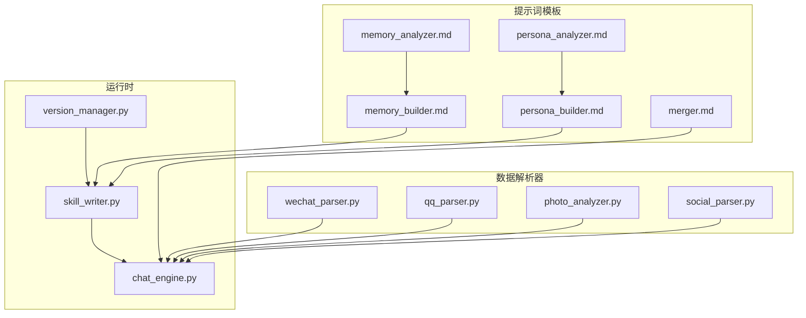
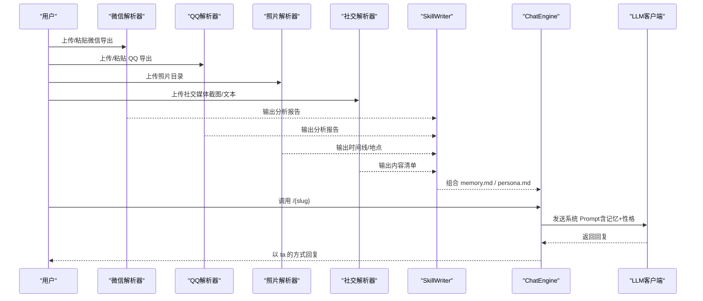
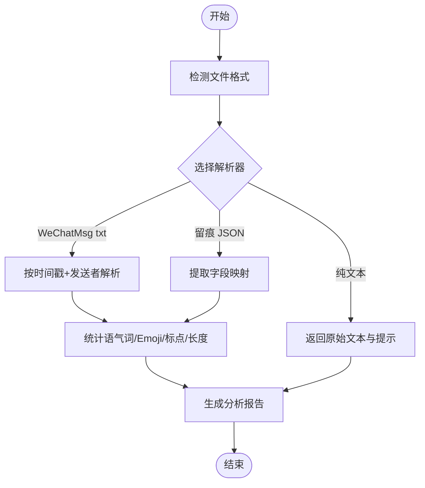
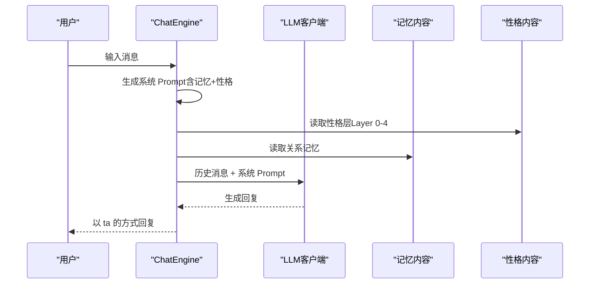
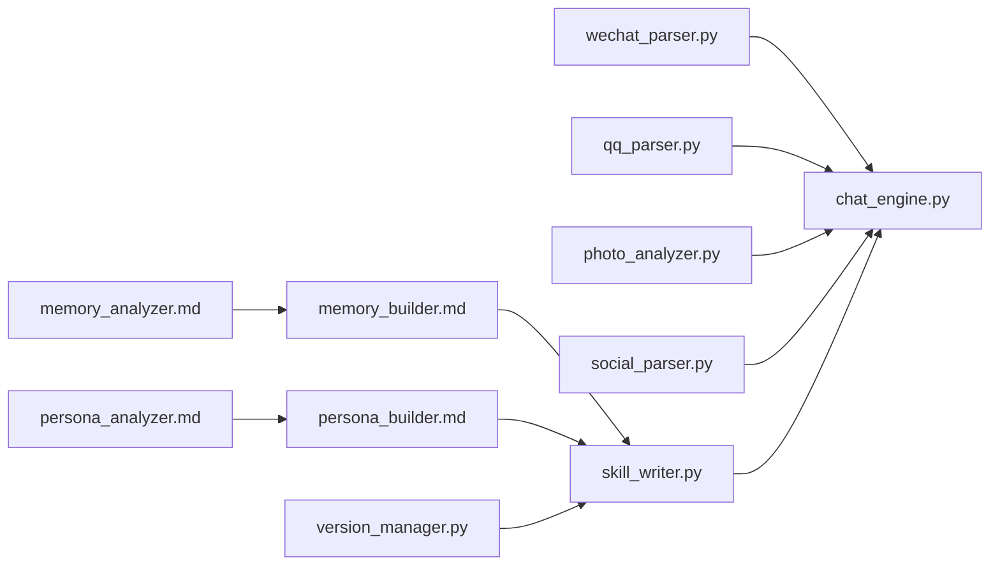

# 关系记忆分析模板

<cite>
**本文引用的文件**
- [README.md](file://README.md)
- [prompts/memory_analyzer.md](file://prompts/memory_analyzer.md)
- [prompts/persona_analyzer.md](file://prompts/persona_analyzer.md)
- [prompts/memory_builder.md](file://prompts/memory_builder.md)
- [prompts/persona_builder.md](file://prompts/persona_builder.md)
- [prompts/merger.md](file://prompts/merger.md)
- [tools/wechat_parser.py](file://tools/wechat_parser.py)
- [tools/qq_parser.py](file://tools/qq_parser.py)
- [tools/photo_analyzer.py](file://tools/photo_analyzer.py)
- [tools/social_parser.py](file://tools/social_parser.py)
- [tools/chat_engine.py](file://tools/chat_engine.py)
- [tools/skill_writer.py](file://tools/skill_writer.py)
- [tools/version_manager.py](file://tools/version_manager.py)
</cite>

## 目录
1. [简介](#简介)
2. [项目结构](#项目结构)
3. [核心组件](#核心组件)
4. [架构总览](#架构总览)
5. [详细组件分析](#详细组件分析)
6. [依赖关系分析](#依赖关系分析)
7. [性能考量](#性能考量)
8. [故障排查指南](#故障排查指南)
9. [结论](#结论)
10. [附录](#附录)

## 简介
本技术文档围绕“关系记忆分析模板”展开，系统阐述如何从聊天记录、照片元信息与社交媒体内容中抽取关键记忆片段，构建 Relationship Memory 知识库，并与 Persona 模型协同驱动对话。文档聚焦以下要点：
- 记忆分析的算法逻辑与情感分析方法
- 关系建模策略与时间线构建
- 记忆分类体系与情感强度计算思路
- 特征提取技术与输出格式规范
- 增量 merge 与版本管理机制

## 项目结构
该项目采用“提示词模板 + 数据解析器 + 对话引擎 + 文件管理”的分层设计，支持多来源数据融合与多模型推理。

图表来源
- [prompts/memory_analyzer.md:1-95](file://prompts/memory_analyzer.md#L1-L95)
- [prompts/persona_analyzer.md:1-92](file://prompts/persona_analyzer.md#L1-L92)
- [prompts/memory_builder.md:1-122](file://prompts/memory_builder.md#L1-L122)
- [prompts/persona_builder.md:1-129](file://prompts/persona_builder.md#L1-L129)
- [prompts/merger.md:1-45](file://prompts/merger.md#L1-L45)
- [tools/wechat_parser.py:1-251](file://tools/wechat_parser.py#L1-L251)
- [tools/qq_parser.py:1-130](file://tools/qq_parser.py#L1-L130)
- [tools/photo_analyzer.py:1-135](file://tools/photo_analyzer.py#L1-L135)
- [tools/social_parser.py:1-84](file://tools/social_parser.py#L1-L84)
- [tools/chat_engine.py:1-284](file://tools/chat_engine.py#L1-L284)
- [tools/skill_writer.py:1-171](file://tools/skill_writer.py#L1-L171)
- [tools/version_manager.py:1-116](file://tools/version_manager.py#L1-L116)

章节来源
- [README.md:281-321](file://README.md#L281-L321)

## 核心组件
- 提示词模板：定义记忆与性格的提取维度、输出格式与填充规则，确保分析过程标准化。
- 数据解析器：针对不同来源（微信、QQ、照片、社交媒体）进行格式识别、特征提取与报告生成。
- 对话引擎：加载记忆与性格知识，按“先性格判断再记忆补充”的顺序生成回复。
- 文件管理：负责 Skill 目录结构、SKILL.md 组合与版本存档回滚。

章节来源
- [prompts/memory_analyzer.md:1-95](file://prompts/memory_analyzer.md#L1-L95)
- [prompts/persona_analyzer.md:1-92](file://prompts/persona_analyzer.md#L1-L92)
- [tools/wechat_parser.py:1-251](file://tools/wechat_parser.py#L1-L251)
- [tools/qq_parser.py:1-130](file://tools/qq_parser.py#L1-L130)
- [tools/photo_analyzer.py:1-135](file://tools/photo_analyzer.py#L1-L135)
- [tools/social_parser.py:1-84](file://tools/social_parser.py#L1-L84)
- [tools/chat_engine.py:1-284](file://tools/chat_engine.py#L1-L284)
- [tools/skill_writer.py:1-171](file://tools/skill_writer.py#L1-L171)
- [tools/version_manager.py:1-116](file://tools/version_manager.py#L1-L116)

## 架构总览
整体运行流程分为“数据采集与解析 → 记忆与性格构建 → 对话生成 → 版本管理与增量 merge”。

图表来源
- [tools/wechat_parser.py:180-251](file://tools/wechat_parser.py#L180-L251)
- [tools/qq_parser.py:93-130](file://tools/qq_parser.py#L93-L130)
- [tools/photo_analyzer.py:79-135](file://tools/photo_analyzer.py#L79-L135)
- [tools/social_parser.py:38-84](file://tools/social_parser.py#L38-L84)
- [tools/skill_writer.py:68-145](file://tools/skill_writer.py#L68-L145)
- [tools/chat_engine.py:60-180](file://tools/chat_engine.py#L60-L180)

## 详细组件分析

### 记忆分析器（Relationship Memory）
- 提取维度
  - 关系时间线：认识时间与方式、确定关系、关键节点（首次约会/吵架/旅行/纪念日）、分手时间与原因、分手后互动。
  - 日常模式：联系频率与时间段、谁更主动、约会频率与偏好、日常话题分布。
  - 共同经历：去过的地方、做过的事、旅行记忆、只有两人懂的梗。
  - 饮食偏好：ta的口味、常去餐厅、做饭习惯、约会吃饭模式。
  - 兴趣爱好：ta喜欢的音乐/电影/书籍/游戏、日常爱好、共同爱好、分享内容类型。
  - 争吵模式：常见原因、典型反应（冷暴力/激烈/讲理/委屈）、谁先道歉、冷战时长、经典台词。
  - 甜蜜瞬间：最心动时刻、表达爱意方式、日常小甜蜜、特别纪念日/仪式感。
  - 分手相关：分手原因（双方视角）、最后一次对话、分手后状态、未说出口的话。
- 输出格式：严格遵循模板，包含关系概览、时间线表格、共同记忆、日常模式、争吵档案、甜蜜档案、分手档案与 Correction 记录。
- 注意事项：事实优先于口述；同时保留好与坏的记忆；关注反复出现的模式；尽量精确时间信息。

章节来源
- [prompts/memory_analyzer.md:3-95](file://prompts/memory_analyzer.md#L3-L95)
- [prompts/memory_builder.md:1-122](file://prompts/memory_builder.md#L1-L122)

### 性格行为分析器（Persona）
- 提取维度
  - 说话风格：语气词、标点习惯、表情包/emoji、消息长度、打字习惯、口头禅、称呼方式。
  - 情感表达模式：表达爱意、生气方式、开心/难过/撒娇/安慰方式。
  - 依恋类型：安全型/焦虑型/回避型/混乱型。
  - 决策模式：理性/感觉、纠结/果断、在乎他人/特立独行、计划/随性。
  - 人际行为：关系角色、边界感、嫉妒/占有度、对承诺态度。
- 标签翻译：将用户输入的标签映射为具体行为规则，避免抽象描述。
- 输出格式：五层 Persona 结构（Layer 0 硬规则 → 身份 → 说话风格 → 情感模式 → 关系行为）。

章节来源
- [prompts/persona_analyzer.md:1-92](file://prompts/persona_analyzer.md#L1-L92)
- [prompts/persona_builder.md:1-129](file://prompts/persona_builder.md#L1-L129)

### 数据解析器

#### 微信解析器（wechat_parser.py）
- 功能
  - 自动识别格式：WeChatMsg txt、留痕 JSON、纯文本。
  - 解析消息：提取时间戳、发送者、内容。
  - 特征提取：高频语气词、Emoji、消息长度统计、标点习惯。
  - 输出：统计信息、Top 词/表情、消息风格、消息样本。
- 算法要点
  - 正则匹配时间戳与发送者行，累积消息块。
  - 使用正则统计语气词与 Emoji 频率。
  - 计算平均消息长度，划分短句连发/长段落风格。

图表来源
- [tools/wechat_parser.py:24-178](file://tools/wechat_parser.py#L24-L178)

章节来源
- [tools/wechat_parser.py:1-251](file://tools/wechat_parser.py#L1-L251)

#### QQ 解析器（qq_parser.py）
- 功能
  - 支持 txt 与 mht（HTML）格式。
  - 提取消息时间戳、发送者、内容。
  - 输出统计与消息样本或纯文本摘要。
- 算法要点
  - 正则匹配 QQ 时间戳与发送者行。
  - mht 格式先去标签再提取文本。

章节来源
- [tools/qq_parser.py:1-130](file://tools/qq_parser.py#L1-L130)

#### 照片解析器（photo_analyzer.py）
- 功能
  - 提取 EXIF 信息：拍摄时间、GPS 坐标。
  - 按时间排序输出照片时间线，标注带位置的照片。
- 算法要点
  - 使用 Pillow 读取 EXIF，转换 GPS 度分秒为十进制度。
  - 遍历目录筛选图片扩展名，过滤无时间/位置信息的图片。

章节来源
- [tools/photo_analyzer.py:1-135](file://tools/photo_analyzer.py#L1-L135)

#### 社交解析器（social_parser.py）
- 功能
  - 扫描目录，分类图片、文本、其他文件。
  - 输出统计与文本内容预览（限制长度）。
- 算法要点
  - 基于扩展名分类，遍历目录生成清单。

章节来源
- [tools/social_parser.py:1-84](file://tools/social_parser.py#L1-L84)

### 对话引擎（chat_engine.py）
- 功能
  - 加载 SKILL.md 或分别加载 memory.md 与 persona.md。
  - 组合系统 Prompt：先由 Persona 判断 ta 的回应倾向，再由 Memory 补充共同记忆，保持 ta 的表达风格与“棱角”。
  - 支持流式与非流式对话，维护对话历史。
- 运行规则
  - Layer 0 硬规则优先：不可说 ta 在现实中绝不可能说的话；不可突然完美；保持 ta 的“棱角”；分手是既定事实。

图表来源
- [tools/chat_engine.py:17-180](file://tools/chat_engine.py#L17-L180)

章节来源
- [tools/chat_engine.py:1-284](file://tools/chat_engine.py#L1-L284)

### 文件管理（skill_writer.py）
- 功能
  - 列出所有已生成的前任 Skill。
  - 初始化目录结构（含 versions、memories/chats、memories/photos、memories/social）。
  - 合并 memory.md 与 persona.md 生成完整 SKILL.md，包含 frontmatter 与运行规则。
- 输出
  - SKILL.md 包含 PART A（关系记忆）与 PART B（人物性格），以及运行规则。

章节来源
- [tools/skill_writer.py:1-171](file://tools/skill_writer.py#L1-L171)

### 版本管理（version_manager.py）
- 功能
  - 备份当前版本到 versions/{version}_{timestamp}。
  - 回滚到指定版本，自动备份当前版本。
  - 列出历史版本。
- 机制
  - 备份核心文件：memory.md、persona.md、SKILL.md、meta.json。

章节来源
- [tools/version_manager.py:1-116](file://tools/version_manager.py#L1-L116)

### 增量 Merge 逻辑（merger.md）
- 原则
  - 增量不覆盖；冲突标注；时间线补充；证据升级。
- 策略
  - Memory：新事件按时间插入；新地点追加；新梗追加；争吵/甜蜜记忆追加。
  - Persona：新的口头禅追加；情感模式证据强化；行为模式追加；Layer 0/1 通常不变。
- 输出
  - 以特定注释标记追加内容，便于后续编辑。

章节来源
- [prompts/merger.md:1-45](file://prompts/merger.md#L1-L45)

## 依赖关系分析
- 组件耦合
  - 提示词模板与解析器之间通过“维度一致”耦合，保证输出结构统一。
  - 解析器与对话引擎通过文件系统耦合（memory.md / persona.md），SkillWriter 负责组装。
  - VersionManager 与 SkillWriter 协作，保障可追溯性。
- 外部依赖
  - Pillow（照片解析器）用于 EXIF 读取。
  - LLM 客户端工厂（chat_engine）按模型键创建具体客户端。

图表来源
- [prompts/memory_analyzer.md:1-95](file://prompts/memory_analyzer.md#L1-L95)
- [prompts/persona_analyzer.md:1-92](file://prompts/persona_analyzer.md#L1-L92)
- [prompts/memory_builder.md:1-122](file://prompts/memory_builder.md#L1-L122)
- [prompts/persona_builder.md:1-129](file://prompts/persona_builder.md#L1-L129)
- [tools/wechat_parser.py:1-251](file://tools/wechat_parser.py#L1-L251)
- [tools/qq_parser.py:1-130](file://tools/qq_parser.py#L1-L130)
- [tools/photo_analyzer.py:1-135](file://tools/photo_analyzer.py#L1-L135)
- [tools/social_parser.py:1-84](file://tools/social_parser.py#L1-L84)
- [tools/skill_writer.py:1-171](file://tools/skill_writer.py#L1-L171)
- [tools/version_manager.py:1-116](file://tools/version_manager.py#L1-L116)
- [tools/chat_engine.py:1-284](file://tools/chat_engine.py#L1-L284)

## 性能考量
- 解析器性能
  - 正则匹配与字符串统计为主，时间复杂度近似 O(N)，其中 N 为消息/文件数量。
  - 照片解析器遍历目录，I/O 成本与文件数量和大小相关。
- 对话引擎
  - 历史消息累积增长，建议控制历史长度或定期清理。
  - 流式输出可降低首字延迟，提升交互体验。
- 存储与版本
  - 备份与回滚涉及文件复制，建议定期归档，避免版本过多导致磁盘压力。

## 故障排查指南
- 依赖缺失
  - Pillow 未安装：照片解析器仅列出文件，无法读取 EXIF。安装 Pillow 后重新运行。
- 文件格式识别
  - 微信解析器自动检测格式失败：检查文件扩展名与内容是否符合预期格式。
- 输出为空或不完整
  - 照片无时间/位置信息：EXIF 缺失或被清理，属于正常现象。
  - 社交解析器仅列出图片路径：需使用 Read 工具查看截图内容。
- 对话异常
  - 找不到 Skill：确认 slug 正确且目录存在。
  - 回复不符合预期：检查 memory.md 与 persona.md 内容是否充分，必要时使用 Correction 记录修正。

章节来源
- [tools/photo_analyzer.py:27-28](file://tools/photo_analyzer.py#L27-L28)
- [tools/wechat_parser.py:194-196](file://tools/wechat_parser.py#L194-L196)
- [tools/chat_engine.py:94-95](file://tools/chat_engine.py#L94-L95)
- [tools/social_parser.py:78-79](file://tools/social_parser.py#L78-L79)

## 结论
本模板通过标准化的提示词模板、多源数据解析器与对话引擎，实现了从聊天记录、照片与社交媒体中抽取关系记忆与性格特征，并以“先性格判断、再记忆补充”的方式生成更真实的对话体验。配合增量 merge 与版本管理，能够持续迭代记忆与性格模型，满足个性化与情感疗愈需求。

## 附录

### 记忆分类体系与情感强度计算思路
- 分类体系
  - 关系时间线：事实性时间点与事件。
  - 日常模式：行为频率与偏好。
  - 共同经历：地点、活动、梗。
  - 饮食偏好：口味与约会模式。
  - 兴趣爱好：内容偏好与分享类型。
  - 争吵模式：原因、反应、和好方式。
  - 甜蜜瞬间：心动时刻与日常小甜。
  - 分手相关：原因、最后一次对话、分手后状态。
- 情感强度计算（建议）
  - 基于标点、语气词、Emoji 频率与长度分布量化情绪强度。
  - 基于冲突/甜蜜事件的出现频率与描述细节丰富度评估权重。
  - 建议引入“触发词权重 + 上下文窗口评分”的加权聚合方法，形成可解释的情感向量。

### 特征提取技术
- 文本特征
  - 语气词与标点：正则统计，Top-K 排序。
  - Emoji：Unicode 范围匹配，频率统计。
  - 消息长度：均值与分布，划分短句/长段落。
- 空间特征
  - GPS 坐标：十进制度转换，聚类分析常用地点。
- 时间特征
  - 时间戳解析与排序，统计活跃时段与回复速度。

### 输出格式规范
- 记忆模板：严格遵循 memory_builder.md 的章节与占位符，确保事实性与可编辑性。
- 性格模板：严格遵循 persona_builder.md 的五层结构，避免抽象描述。
- 增量追加：使用 merger.md 的注释标记，便于后续编辑与冲突定位。