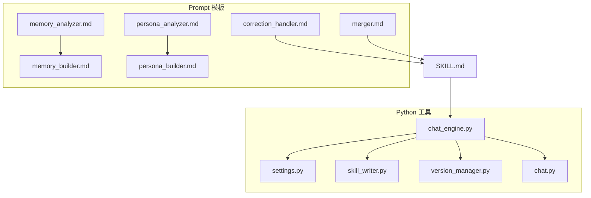
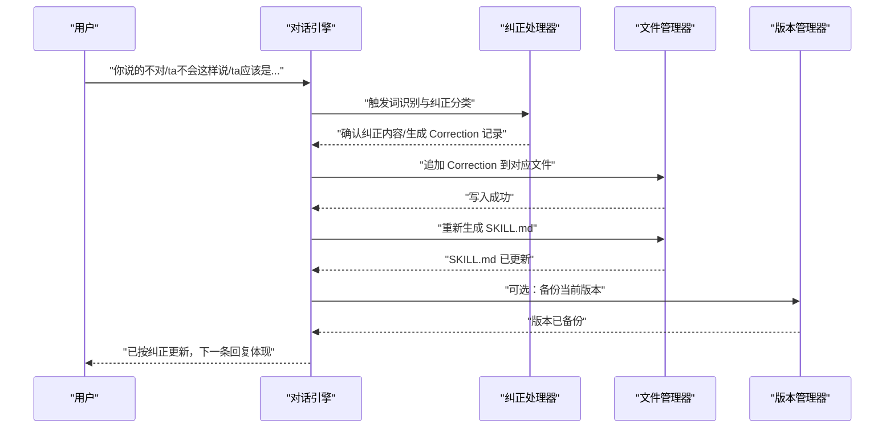
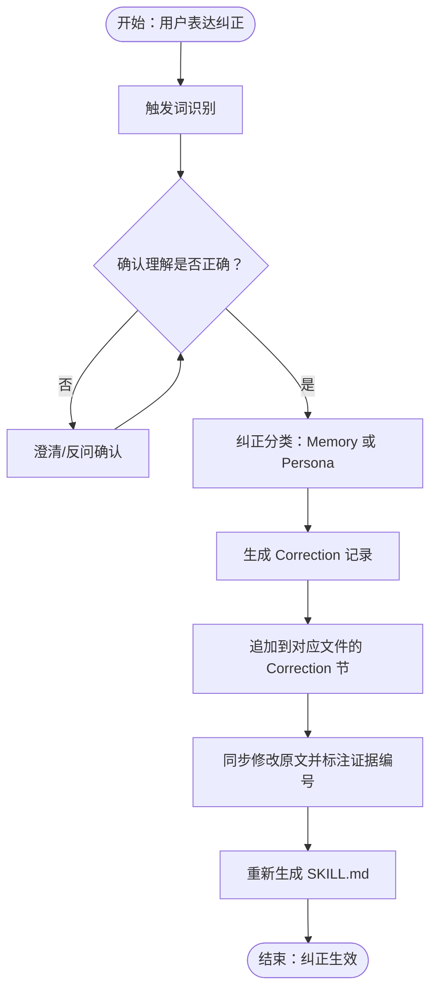
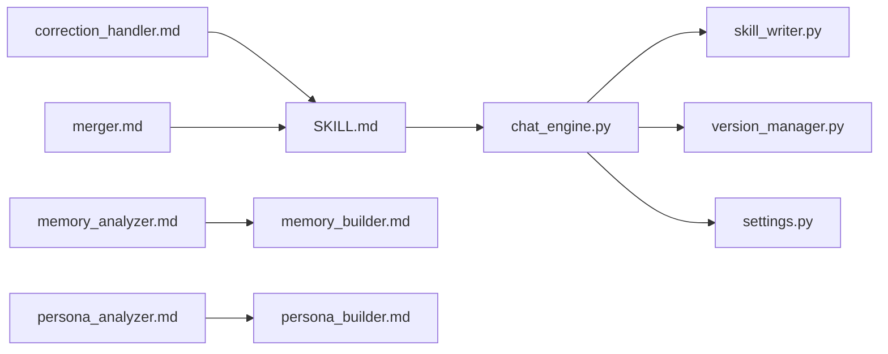

# 对话纠正处理模板

<cite>
**本文引用的文件**
- [correction_handler.md](file://prompts/correction_handler.md)
- [SKILL.md](file://SKILL.md)
- [chat.py](file://chat.py)
- [chat_engine.py](file://tools/chat_engine.py)
- [skill_writer.py](file://tools/skill_writer.py)
- [version_manager.py](file://tools/version_manager.py)
- [settings.py](file://tools/config/settings.py)
- [memory_analyzer.md](file://prompts/memory_analyzer.md)
- [persona_analyzer.md](file://prompts/persona_analyzer.md)
- [memory_builder.md](file://prompts/memory_builder.md)
- [persona_builder.md](file://prompts/persona_builder.md)
- [merger.md](file://prompts/merger.md)
</cite>

## 目录
1. [简介](#简介)
2. [项目结构](#项目结构)
3. [核心组件](#核心组件)
4. [架构总览](#架构总览)
5. [详细组件分析](#详细组件分析)
6. [依赖关系分析](#依赖关系分析)
7. [性能考量](#性能考量)
8. [故障排查指南](#故障排查指南)
9. [结论](#结论)
10. [附录](#附录)

## 简介
本文件围绕“对话纠正处理模板”进行系统化说明，聚焦于如何在对话中识别并纠正前任 Skill 的错误输出。内容涵盖：
- 错误检测机制：触发词识别、上下文判断
- 纠正策略：Memory（事实类）与 Persona（性格类）两类纠正路径
- 上下文修复方法：Correction 记录生成、证据引用、修正后的对话重写
- 错误类型分类与处理优先级
- 具体纠正案例与流程图示

## 项目结构
该项目采用“Prompt 模板 + Python 工具链”的混合架构，核心围绕 SKILL.md 的双层结构（Part A 关系记忆 + Part B 人物性格）展开，支持多 LLM Provider 的独立对话入口。

图表来源
- [correction_handler.md:1-56](file://prompts/correction_handler.md#L1-L56)
- [SKILL.md:377-386](file://SKILL.md#L377-L386)
- [chat_engine.py:1-284](file://tools/chat_engine.py#L1-L284)
- [chat.py:1-201](file://chat.py#L1-L201)
- [skill_writer.py:1-171](file://tools/skill_writer.py#L1-L171)
- [version_manager.py:1-116](file://tools/version_manager.py#L1-L116)
- [settings.py:1-225](file://tools/config/settings.py#L1-L225)
- [memory_analyzer.md:1-95](file://prompts/memory_analyzer.md#L1-L95)
- [persona_analyzer.md:1-92](file://prompts/persona_analyzer.md#L1-L92)
- [memory_builder.md:1-122](file://prompts/memory_builder.md#L1-L122)
- [persona_builder.md:1-129](file://prompts/persona_builder.md#L1-L129)
- [merger.md:1-45](file://prompts/merger.md#L1-L45)

章节来源
- [SKILL.md:281-321](file://SKILL.md#L281-L321)
- [chat.py:1-201](file://chat.py#L1-L201)

## 核心组件
- 对话纠正处理器（Prompt）：定义触发词、纠正分类、处理流程与注意事项
- 对话引擎（Python）：封装系统 Prompt、加载 Skill 数据、维护对话历史、调用 LLM
- 文件管理器：生成/合并 SKILL.md、读取/写入 memory.md 与 persona.md
- 版本管理器：备份与回滚，确保纠正可追溯
- 配置系统：统一管理模型与 Provider 配置

章节来源
- [correction_handler.md:1-56](file://prompts/correction_handler.md#L1-L56)
- [chat_engine.py:17-284](file://tools/chat_engine.py#L17-L284)
- [skill_writer.py:68-145](file://tools/skill_writer.py#L68-L145)
- [version_manager.py:16-74](file://tools/version_manager.py#L16-L74)
- [settings.py:38-225](file://tools/config/settings.py#L38-L225)

## 架构总览
对话纠正处理模板的运行链路如下：
- 用户在对话中表达“不对/ta不会这样说/ta应该是…”等纠正意图
- 系统通过触发词识别进入纠正模式
- 根据纠正内容判断属于 Memory（事实类）或 Persona（性格类）
- 生成 Correction 记录并追加到对应文件的“## Correction 记录”节
- 同步修改被纠正的原文并在其旁标注“已纠正，见 Correction #{n}”
- 重新生成 SKILL.md，使纠正立即生效

图表来源
- [correction_handler.md:29-56](file://prompts/correction_handler.md#L29-L56)
- [SKILL.md:377-386](file://SKILL.md#L377-L386)
- [skill_writer.py:68-145](file://tools/skill_writer.py#L68-L145)
- [version_manager.py:16-44](file://tools/version_manager.py#L16-L44)

## 详细组件分析

### 1. 错误检测机制
- 触发词识别：系统通过关键词集合识别用户表达的纠正意图，包括“不对/不是这样的”“ta不会这样说/ta不会这么说话”“ta应该是…/ta其实是…”“这不像ta/感觉不对”“太温柔了/太冷漠了/太正式了”“ta没这么文艺/ta不用这个表情”等。
- 上下文判断：在对话引擎中，用户输入被加入历史，随后调用 LLM 生成回复；若命中触发词，则进入纠正模式。
- 纠正确认：系统向用户确认理解是否正确，避免误改。

章节来源
- [correction_handler.md:7-34](file://prompts/correction_handler.md#L7-L34)
- [chat_engine.py:181-204](file://tools/chat_engine.py#L181-L204)

### 2. 纠正策略与分类
- Memory 纠正（事实类）：针对关系记忆中的事实性描述进行修正，如“我们不是在那认识的”“ta不喜欢吃那个”“我们常去的是另一家”。此类纠正直接影响 Part A 的关系时间线、地点信息、饮食偏好等。
- Persona 纠正（性格类）：针对人物性格与说话风格的描述进行修正，如“ta不会这样说话”“ta生气不会这样”“ta不会主动道歉”。此类纠正影响 Part B 的 Layer 2（说话风格）、Layer 3（情感模式）、Layer 4（关系行为）。

章节来源
- [correction_handler.md:17-28](file://prompts/correction_handler.md#L17-L28)
- [SKILL.md:377-386](file://SKILL.md#L377-L386)

### 3. 上下文修复方法
- 生成 Correction 记录：记录层级、原文、纠正为、用户原话等关键信息，便于追溯与审计。
- 追加到对应文件：在 memory.md 或 persona.md 的“## Correction 记录”节追加新条目。
- 同步修改原文：在被纠正的原文旁标注“已纠正，见 Correction #{n}”，形成证据链。
- 重新生成 SKILL.md：确保纠正立即生效，下一条回复体现修正结果。

章节来源
- [correction_handler.md:36-50](file://prompts/correction_handler.md#L36-L50)
- [SKILL.md:377-386](file://SKILL.md#L377-L386)
- [skill_writer.py:68-145](file://tools/skill_writer.py#L68-L145)

### 4. 纠正指令生成逻辑
- 确认理解：以“我理解了，你是说{name}不会{旧行为}，而是会{新行为}，对吗？”的形式向用户确认，避免误改。
- 证据引用：在 Correction 记录中保留用户原话，作为证据来源；同时在原文旁标注对应 Correction 编号，便于交叉验证。
- 修正后的对话重写：通过重新生成 SKILL.md，使系统 Prompt 中的 Part A 与 Part B 基于最新 Correction 更新，从而在后续回复中体现修正。

章节来源
- [correction_handler.md:31-50](file://prompts/correction_handler.md#L31-L50)
- [SKILL.md:300-342](file://SKILL.md#L300-L342)

### 5. 错误类型分类与处理优先级
- 错误类型分类
  - 事实错误：与关系记忆相关的事实性描述不符（如时间、地点、事件、人物偏好等）
  - 逻辑矛盾：同一人物在同一情境下的行为前后不一致
  - 情感偏差：对人物情感表达、依恋类型、爱的语言等的误判
- 处理优先级
  - Layer 0 硬规则优先级最高：不可违背（如不说现实中不可能说的话、保持“棱角”等）
  - Layer 1 身份锚定：身份信息（年龄、职业、MBTI、星座等）需与事实一致
  - Layer 2 说话风格：口头禅、语气词、标点习惯、表情包使用等
  - Layer 3 情感模式：依恋类型、情绪触发器、爱的语言等
  - Layer 4 关系行为：争吵模式、和好方式、边界与底线等

章节来源
- [correction_handler.md:51-56](file://prompts/correction_handler.md#L51-L56)
- [persona_builder.md:9-25](file://prompts/persona_builder.md#L9-L25)
- [persona_builder.md:68-90](file://prompts/persona_builder.md#L68-L90)
- [persona_builder.md:94-118](file://prompts/persona_builder.md#L94-L118)

### 6. 具体纠正案例
- 案例一：事实错误
  - 用户输入：“我们不是在那认识的”
  - 处理：定位 Part A 的“关系时间线”，将“认识：{错误时间} {错误方式}”修正为“认识：{正确时间} {正确方式}”，并在原文旁标注“已纠正，见 Correction #{n}”
  - 证据：在 Correction 记录中保留用户原话“我们不是在那认识的”
  - 重写：重新生成 SKILL.md，使后续回复体现正确的认识时间与方式
- 案例二：性格偏差
  - 用户输入：“ta不会这样说话”
  - 处理：定位 Part B 的 Layer 2“说话风格”，将“口头禅/语气词/标点习惯”等修正为更符合人物的真实特征
  - 证据：在 Correction 记录中保留用户原话“ta不会这样说话”，并在原文旁标注“已纠正，见 Correction #{n}”
  - 重写：重新生成 SKILL.md，使后续回复体现修正后的说话风格

章节来源
- [correction_handler.md:19-27](file://prompts/correction_handler.md#L19-L27)
- [SKILL.md:300-342](file://SKILL.md#L300-L342)

### 7. 纠正流程可视化

图表来源
- [correction_handler.md:29-50](file://prompts/correction_handler.md#L29-L50)
- [SKILL.md:377-386](file://SKILL.md#L377-L386)

## 依赖关系分析
- 对话引擎依赖配置系统与文件管理器，负责加载 SKILL.md 并维护对话历史
- 文件管理器负责生成/合并 SKILL.md，读取 memory.md 与 persona.md
- 版本管理器提供备份与回滚能力，保障纠正可追溯
- Prompt 模板为纠正处理提供规范化的触发词、分类与流程

图表来源
- [correction_handler.md:1-56](file://prompts/correction_handler.md#L1-L56)
- [SKILL.md:377-386](file://SKILL.md#L377-L386)
- [chat_engine.py:89-171](file://tools/chat_engine.py#L89-L171)
- [skill_writer.py:68-145](file://tools/skill_writer.py#L68-L145)
- [version_manager.py:16-74](file://tools/version_manager.py#L16-L74)
- [settings.py:38-225](file://tools/config/settings.py#L38-L225)
- [memory_analyzer.md:1-95](file://prompts/memory_analyzer.md#L1-L95)
- [persona_analyzer.md:1-92](file://prompts/persona_analyzer.md#L1-L92)
- [memory_builder.md:1-122](file://prompts/memory_builder.md#L1-L122)
- [persona_builder.md:1-129](file://prompts/persona_builder.md#L1-L129)
- [merger.md:1-45](file://prompts/merger.md#L1-L45)

## 性能考量
- 流式输出：对话引擎支持流式输出，提升用户体验
- 文件读写：SKILL.md 合并与写入为轻量 I/O 操作，性能开销较小
- 版本备份：备份当前版本后再回滚，避免误操作导致的数据丢失
- 模型配置：统一管理多 Provider 的模型参数，减少重复配置成本

## 故障排查指南
- 纠正未生效
  - 检查是否正确触发纠正模式（确认触发词是否命中）
  - 确认 Correction 记录是否追加到对应文件
  - 确认 SKILL.md 是否重新生成
- 证据缺失
  - 在 Correction 记录中核对用户原话与证据编号
  - 在原文旁检查“已纠正，见 Correction #{n}”标注
- 版本回滚
  - 使用版本管理器列出历史版本并选择目标版本回滚
  - 回滚前会自动备份当前版本，防止数据丢失

章节来源
- [correction_handler.md:51-56](file://prompts/correction_handler.md#L51-L56)
- [SKILL.md:377-386](file://SKILL.md#L377-L386)
- [version_manager.py:76-92](file://tools/version_manager.py#L76-L92)

## 结论
对话纠正处理模板通过明确的触发词识别、分类与流程，实现了对事实错误、逻辑矛盾与情感偏差的有效治理。借助 Correction 记录与证据引用，系统保证了纠正的可追溯性与可审计性；通过重新生成 SKILL.md，纠正即时生效，提升了对话的真实性与一致性。配合版本管理与文件管理工具，系统在保证灵活性的同时，兼顾了稳定性与安全性。

## 附录
- 相关 Prompt 模板
  - 关系记忆分析器：用于提取与前任的关系记忆维度
  - 性格行为分析器：用于提取人物性格与行为模式
  - Relationship Memory 生成模板：构建 Part A 的结构化内容
  - Persona 生成模板：构建 Part B 的五层结构
  - 增量 Merge 逻辑：在追加记忆时进行增量合并，避免覆盖既有结论

章节来源
- [memory_analyzer.md:1-95](file://prompts/memory_analyzer.md#L1-L95)
- [persona_analyzer.md:1-92](file://prompts/persona_analyzer.md#L1-L92)
- [memory_builder.md:1-122](file://prompts/memory_builder.md#L1-L122)
- [persona_builder.md:1-129](file://prompts/persona_builder.md#L1-L129)
- [merger.md:1-45](file://prompts/merger.md#L1-L45)