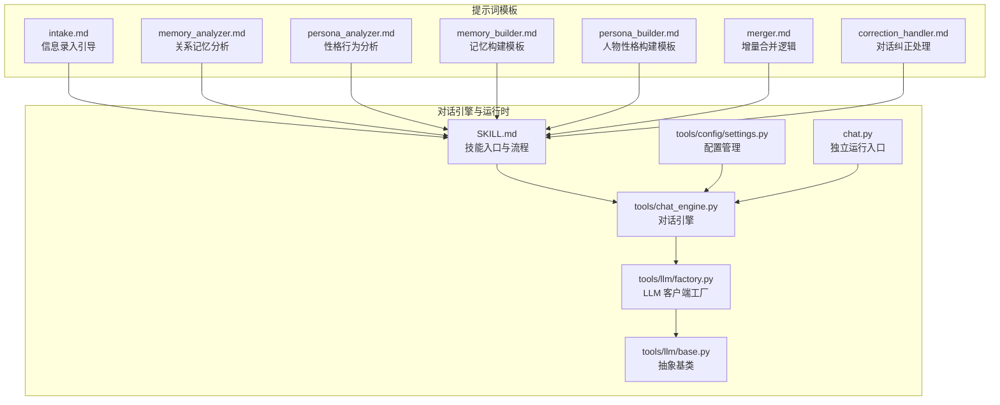
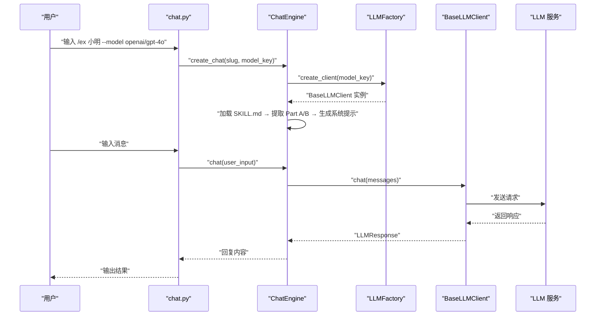
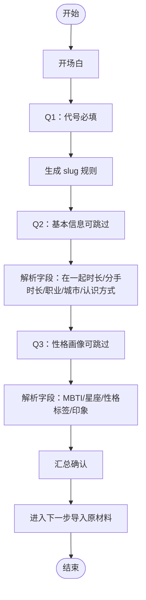
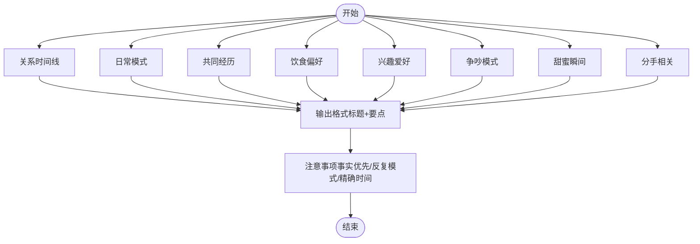
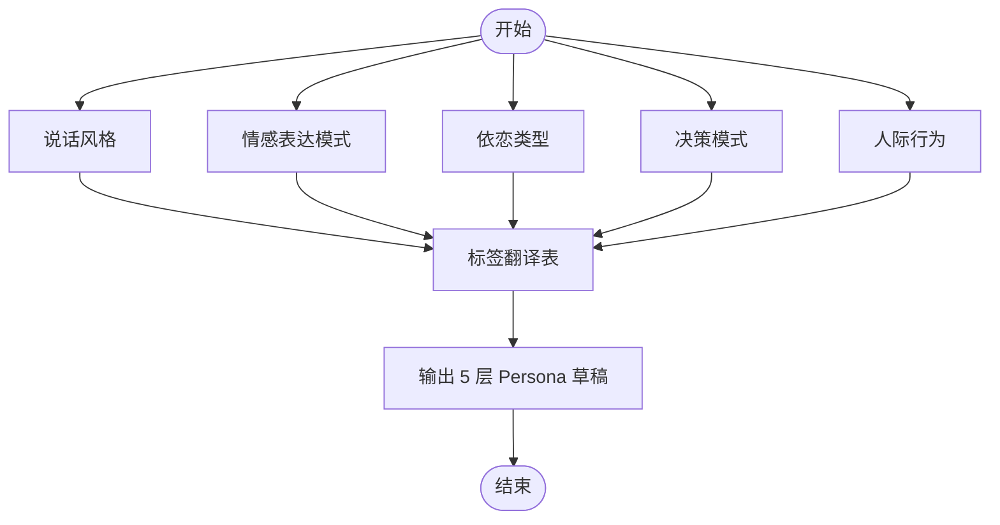
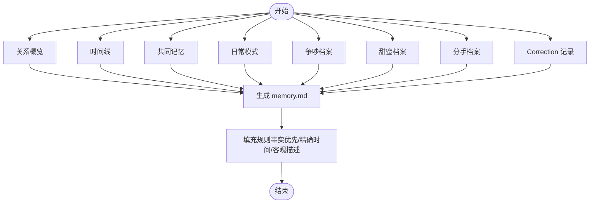
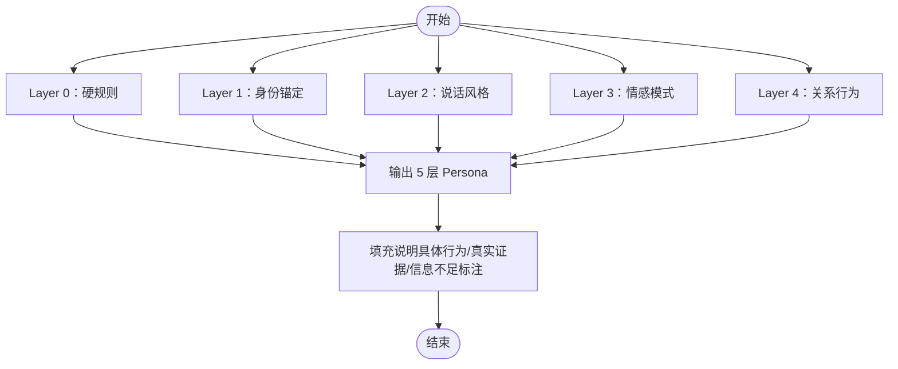
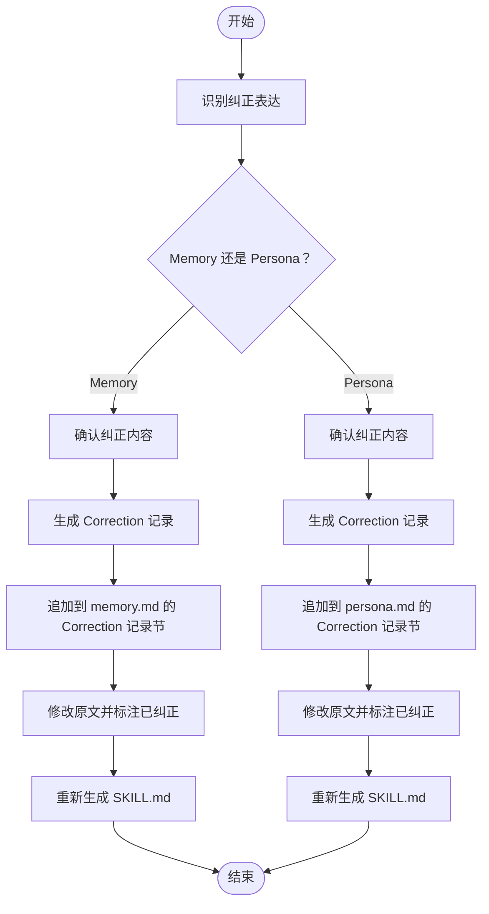
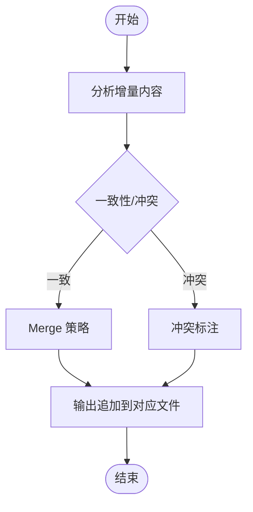
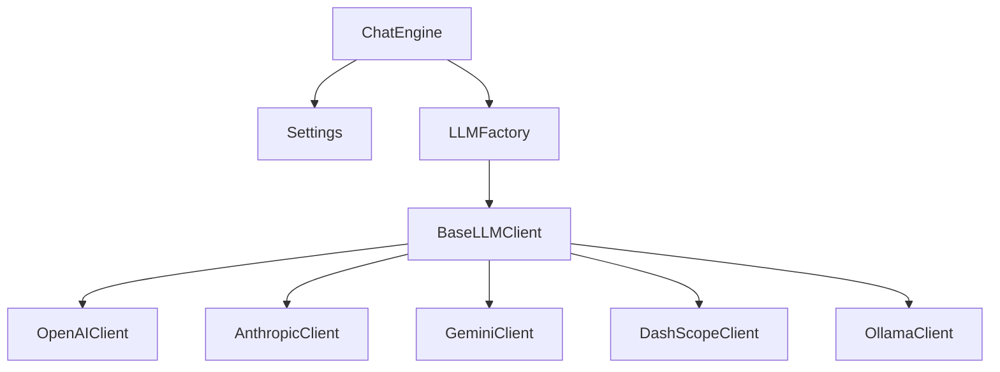

# 提示词系统

<cite>
**本文引用的文件**
- [prompts/intake.md](file://prompts/intake.md)
- [prompts/memory_analyzer.md](file://prompts/memory_analyzer.md)
- [prompts/correction_handler.md](file://prompts/correction_handler.md)
- [prompts/memory_builder.md](file://prompts/memory_builder.md)
- [prompts/persona_builder.md](file://prompts/persona_builder.md)
- [prompts/merger.md](file://prompts/merger.md)
- [prompts/persona_analyzer.md](file://prompts/persona_analyzer.md)
- [SKILL.md](file://SKILL.md)
- [tools/chat_engine.py](file://tools/chat_engine.py)
- [tools/config/settings.py](file://tools/config/settings.py)
- [tools/llm/factory.py](file://tools/llm/factory.py)
- [tools/llm/base.py](file://tools/llm/base.py)
- [chat.py](file://chat.py)
- [README.md](file://README.md)
</cite>

## 目录
1. [简介](#简介)
2. [项目结构](#项目结构)
3. [核心组件](#核心组件)
4. [架构总览](#架构总览)
5. [详细组件分析](#详细组件分析)
6. [依赖分析](#依赖分析)
7. [性能考虑](#性能考虑)
8. [故障排查指南](#故障排查指南)
9. [结论](#结论)
10. [附录](#附录)

## 简介
本文件面向“提示词系统”的设计与实现，围绕五类 Prompt 模板展开：信息录入模板（intake.md）、关系记忆分析模板（memory_analyzer.md）、对话纠正处理模板（correction_handler.md）、记忆构建模板（memory_builder.md）、人物性格构建模板（persona_builder.md）。文档将系统阐述提示词工程最佳实践、上下文管理策略与输出控制机制，并提供优化技巧、A/B 测试方法与效果评估指标，辅以具体示例与调优案例。

## 项目结构
该项目采用“提示词模板 + 对话引擎 + LLM 工厂 + 配置管理”的分层组织方式：
- prompts/：存放各类 Prompt 模板，指导数据采集、分析与构建
- tools/：Python 工具层，包含对话引擎、LLM 客户端工厂、配置管理等
- chat.py：独立运行入口，支持多 API 对话
- SKILL.md：Claude Code 版本的技能入口与主流程编排

图表来源
- [tools/chat_engine.py:1-284](file://tools/chat_engine.py#L1-L284)
- [tools/config/settings.py:1-225](file://tools/config/settings.py#L1-L225)
- [tools/llm/factory.py:1-82](file://tools/llm/factory.py#L1-L82)
- [tools/llm/base.py:1-68](file://tools/llm/base.py#L1-L68)
- [chat.py:1-201](file://chat.py#L1-L201)
- [SKILL.md:1-503](file://SKILL.md#L1-L503)

章节来源
- [README.md:235-275](file://README.md#L235-L275)
- [SKILL.md:1-503](file://SKILL.md#L1-L503)

## 核心组件
- 信息录入模板（intake.md）：通过三步问答引导用户输入代号、基本信息与性格画像，配套验证与解析字段，确保输入标准化与可解析性。
- 关系记忆分析模板（memory_analyzer.md）：定义关系时间线、日常模式、共同经历、饮食偏好、兴趣爱好、争吵模式、甜蜜瞬间、分手相关等维度，强调“反复出现的模式”与“事实优先”。
- 性格行为分析模板（persona_analyzer.md）：从说话风格、情感表达模式、依恋类型、决策模式、人际行为等维度抽取具体行为规则，提供标签翻译表与星座辅助影响。
- 记忆构建模板（memory_builder.md）：生成 memory.md 的结构化模板，包含关系概览、时间线、共同记忆、Inside Jokes、日常模式、争吵档案、甜蜜档案、分手档案与 Correction 记录。
- 人物性格构建模板（persona_builder.md）：定义五层 Persona 结构（Layer 0-4），高层规则不可被低层覆盖，强调“硬规则优先级”与“保持棱角”。
- 对话纠正处理模板（correction_handler.md）：识别用户纠正表达，区分 Memory（事实类）与 Persona（性格类）两类纠正，规范确认、记录、追加与重新生成流程。
- 增量合并逻辑（merger.md）：在追加新素材时，不覆盖既有结论，冲突标注，按维度进行增量合并与证据升级。

章节来源
- [prompts/intake.md:1-88](file://prompts/intake.md#L1-L88)
- [prompts/memory_analyzer.md:1-95](file://prompts/memory_analyzer.md#L1-L95)
- [prompts/persona_analyzer.md:1-92](file://prompts/persona_analyzer.md#L1-L92)
- [prompts/memory_builder.md:1-122](file://prompts/memory_builder.md#L1-L122)
- [prompts/persona_builder.md:1-129](file://prompts/persona_builder.md#L1-L129)
- [prompts/correction_handler.md:1-56](file://prompts/correction_handler.md#L1-L56)
- [prompts/merger.md:1-45](file://prompts/merger.md#L1-L45)

## 架构总览
系统运行时，对话引擎将 Part A（关系记忆）与 Part B（人物性格）拼接为系统提示，结合用户输入与历史对话，调用 LLM 客户端生成回复。配置模块负责模型选择与密钥注入，工厂模式屏蔽不同供应商差异。

图表来源
- [chat.py:128-196](file://chat.py#L128-L196)
- [tools/chat_engine.py:60-131](file://tools/chat_engine.py#L60-L131)
- [tools/llm/factory.py:23-56](file://tools/llm/factory.py#L23-L56)
- [tools/llm/base.py:27-67](file://tools/llm/base.py#L27-L67)

## 详细组件分析

### 信息录入模板（intake.md）
设计理念
- 通过“开场白 + 问题序列 + 汇总确认”的三段式流程，降低用户认知负担，提升数据质量。
- 对必填项与可选项进行清晰标注，提供示例与解析字段，便于后续自动化处理。

实现要点
- 问题 1：代号（必填）→ 生成 slug 的规则（中文拼音、英文小写、空格下划线）。
- 问题 2：基本信息（可跳过）→ 解析字段包括在一起时长、分手时长、职业、城市、认识方式。
- 问题 3：性格画像（可跳过）→ 解析字段包括 MBTI、星座、性格标签列表、主观印象。
- 汇总确认：整合上述字段，形成最终确认提示，引导进入下一步（导入原材料）。

图表来源
- [prompts/intake.md:3-87](file://prompts/intake.md#L3-L87)

章节来源
- [prompts/intake.md:1-88](file://prompts/intake.md#L1-L88)

### 关系记忆分析模板（memory_analyzer.md）
设计理念
- 以“反复出现的模式”为核心，强调从聊天记录中提炼可复现的行为与情感线索，避免一次性事件干扰。
- 输出格式固定，便于下游构建与检索；注意事项强调事实优先与客观呈现。

实现要点
- 维度划分：关系时间线、日常模式、共同经历、饮食偏好、兴趣爱好、争吵模式、甜蜜瞬间、分手相关。
- 输出格式：Markdown 标题与要点清单，便于结构化存储与检索。
- 注意事项：事实优先、保留好坏记忆、关注反复出现的模式、尽量精确时间信息。

图表来源
- [prompts/memory_analyzer.md:7-95](file://prompts/memory_analyzer.md#L7-L95)

章节来源
- [prompts/memory_analyzer.md:1-95](file://prompts/memory_analyzer.md#L1-L95)

### 性格行为分析模板（persona_analyzer.md）
设计理念
- 将抽象标签转化为具体行为规则，提供标签翻译表与星座辅助影响，确保生成的 Persona 可执行且贴近真实。
- 依恋类型、情感表达模式、决策模式、人际行为等维度相互印证，形成一致的个性画像。

实现要点
- 说话风格：语气词、标点习惯、表情包/emoji、消息长度、打字习惯、口头禅、称呼方式。
- 情感表达模式：表达爱意、生气方式、开心表达、难过表达、撒娇方式、安慰方式。
- 依恋类型：安全型、焦虑型、回避型、混乱型。
- 决策模式：理性 vs 感性、果断 vs 纠结、在乎他人看法 vs 特立独行、计划型 vs 随性。
- 人际行为：关系角色、边界感、嫉妒/占有欲、对承诺的态度。
- 标签翻译表与星座影响：提供从用户输入到具体行为规则的映射。

图表来源
- [prompts/persona_analyzer.md:9-92](file://prompts/persona_analyzer.md#L9-L92)

章节来源
- [prompts/persona_analyzer.md:1-92](file://prompts/persona_analyzer.md#L1-L92)

### 记忆构建模板（memory_builder.md）
设计理念
- 以“事实性记忆”为主，为 Persona 提供上下文，使对话更真实可信。
- 结构化模板包含关系概览、时间线、共同记忆、Inside Jokes、日常模式、争吵档案、甜蜜档案、分手档案与 Correction 记录。

实现要点
- 关系概览：关系类型、在一起时长、分手时长、认识方式、分手原因。
- 时间线：表格形式，按时间顺序记录关键事件。
- 共同记忆：常去的地方、Inside Jokes、关键记忆片段。
- 日常模式：联系习惯、约会模式。
- 争吵档案：高频争吵原因、典型争吵剧本、和好模式。
- 甜蜜档案：心动事件、日常甜蜜、纪念日/仪式感。
- 分手档案：分手前征兆、最后一次对话、分手后状态、未说出口的话。
- 填充规则：事实优先、精确时间、地点可从照片 EXIF 提取、争吵与甜蜜同等重要、客观描述、信息不足标注“待补充”。

图表来源
- [prompts/memory_builder.md:3-122](file://prompts/memory_builder.md#L3-L122)

章节来源
- [prompts/memory_builder.md:1-122](file://prompts/memory_builder.md#L1-L122)

### 人物性格构建模板（persona_builder.md）
设计理念
- 五层结构（Layer 0-4）优先级从高到低，高层规则不可被低层覆盖，确保“硬规则优先级”与“保持棱角”。
- 每一层包含具体行为描述而非抽象标签，强调基于原材料的真实证据。

实现要点
- Layer 0：硬规则（不可违背），包括身份定位、不说现实中不可能说的话、不突然变得完美、保持棱角、分手事实等。
- Layer 1：身份锚定（姓名/代号、年龄段、职业、城市、MBTI、星座、与用户关系）。
- Layer 2：说话风格（口头禅、语气词偏好、标点风格、emoji/表情、消息格式、错别字习惯、缩写习惯、称呼方式）。
- Layer 3：情感模式（依恋类型、情感表达、爱的语言、情绪触发器）。
- Layer 4：关系行为（关系角色、争吵模式、日常互动、边界与底线）。
- 填充说明：每个占位符必须替换为具体行为描述，基于原材料中的真实证据，信息不足时标注“信息不足，使用默认”。

图表来源
- [prompts/persona_builder.md:3-129](file://prompts/persona_builder.md#L3-L129)

章节来源
- [prompts/persona_builder.md:1-129](file://prompts/persona_builder.md#L1-L129)

### 对话纠正处理模板（correction_handler.md）
设计理念
- 识别用户纠正表达，区分 Memory（事实类）与 Persona（性格类）两类纠正，规范确认、记录、追加与重新生成流程。
- 纠正后立即生效，下一条回复即体现变化，同时尊重用户直觉并避免误改。

实现要点
- 触发识别：包含“不对”“不是这样的”“ta不会这样说”“ta应该是…”“这不像ta”“太温柔了/太冷漠了/太正式了”“ta没这么文艺/ta不用这个表情”等表达。
- 纠正分类：
  - Memory 纠正：关系时间线、饮食偏好、地点信息等事实类。
  - Persona 纠正：说话风格、情感模式、关系行为等性格类。
- 处理流程：确认纠正内容 → 生成 Correction 记录 → 追加到对应文件的“## Correction 记录”节 → 同时修改被纠正的原文并在旁边标注“已纠正，见 Correction #{n}” → 重新生成 SKILL.md。
- 注意事项：立即生效、不质疑用户、但可确认理解是否准确。

图表来源
- [prompts/correction_handler.md:3-56](file://prompts/correction_handler.md#L3-L56)

章节来源
- [prompts/correction_handler.md:1-56](file://prompts/correction_handler.md#L1-L56)

### 增量合并逻辑（merger.md）
设计理念
- 当用户追加新的原材料时，将增量信息 merge 进现有的 memory.md 和 persona.md，不覆盖已有结论，冲突标注，时间线补充，证据升级。

实现要点
- 原则：增量不覆盖、冲突标注、时间线补充、证据升级。
- 流程：
  - 分析增量内容：按 memory_analyzer.md 与 persona_analyzer.md 的维度输出新记忆事件、新性格证据与一致性/冲突。
  - Merge 策略：
    - Memory（事实类）：新事件插入时间线、新地点追加到“常去的地方”、新 inside joke 追加到“Inside Jokes”、争吵/甜蜜记忆追加到对应档案。
    - Persona（性格类）：新的口头禅发现追加到 Layer 2、更充分的情感模式证据强化 Layer 3 描述、新的行为模式追加到 Layer 4、Layer 0/1 通常不变（除非用户明确纠正）。
  - 输出：用 Edit 工具追加内容到对应文件的对应章节，并在新内容前标注追加信息。

图表来源
- [prompts/merger.md:7-45](file://prompts/merger.md#L7-L45)

章节来源
- [prompts/merger.md:1-45](file://prompts/merger.md#L1-L45)

## 依赖分析
- 对话引擎（ChatEngine）依赖配置模块（Settings）与 LLM 工厂（LLMFactory），负责加载 SKILL.md 并拼接 Part A/B 为系统提示，维护对话历史，支持流式与非流式输出。
- LLM 工厂根据模型键选择对应客户端（OpenAI、Anthropic、Gemini、DashScope、Ollama），统一抽象接口。
- 配置模块支持从环境变量与 .env 文件读取 API 密钥与模型配置，提供默认模型集合与本地模型扩展。

图表来源
- [tools/chat_engine.py:60-131](file://tools/chat_engine.py#L60-L131)
- [tools/config/settings.py:162-190](file://tools/config/settings.py#L162-L190)
- [tools/llm/factory.py:23-56](file://tools/llm/factory.py#L23-L56)
- [tools/llm/base.py:27-67](file://tools/llm/base.py#L27-L67)

章节来源
- [tools/chat_engine.py:1-284](file://tools/chat_engine.py#L1-L284)
- [tools/config/settings.py:1-225](file://tools/config/settings.py#L1-L225)
- [tools/llm/factory.py:1-82](file://tools/llm/factory.py#L1-L82)
- [tools/llm/base.py:1-68](file://tools/llm/base.py#L1-L68)

## 性能考虑
- 上下文长度控制：通过 Part A/B 的结构化模板与固定格式，减少冗余信息，控制系统提示长度。
- 流式输出：支持流式对话，改善用户体验，降低首字延迟感知。
- 模型选择：根据任务复杂度与成本选择合适模型；本地模型（Ollama）可降低外部依赖与延迟。
- 历史管理：提供清空历史能力，避免历史累积导致上下文膨胀。

## 故障排查指南
常见问题与处理
- 找不到前任 Skill：检查 slug 是否正确，确认 exes/{slug}/SKILL.md 是否存在。
- API 密钥未配置：检查环境变量或 .env 文件，确保对应 provider 的密钥已设置。
- 模型不可用：确认模型键格式与可用模型列表，必要时使用默认模型。
- 对话异常：检查系统提示拼接是否正确，确认 Part A/B 是否完整加载。

章节来源
- [tools/chat_engine.py:90-131](file://tools/chat_engine.py#L90-L131)
- [tools/config/settings.py:148-161](file://tools/config/settings.py#L148-L161)
- [chat.py:185-196](file://chat.py#L185-L196)

## 结论
本提示词系统通过五类模板实现“关系记忆 + 人物性格”的双层驱动，配合对话引擎与 LLM 工厂，形成从数据采集、分析构建到实时对话的完整闭环。提示词工程强调“事实优先、反复模式、具体行为”，并通过纠正与增量合并机制实现持续进化。建议在实际使用中结合 A/B 测试与效果评估指标，持续优化提示词与流程。

## 附录

### 提示词工程最佳实践
- 明确角色与边界：在系统提示中清晰定义“你是谁、不能说什么、如何说话”，确保输出符合预期。
- 结构化输出：使用固定标题与要点清单，便于下游解析与检索。
- 证据链优先：所有结论需有原材料支撑，避免臆测。
- 分层规则：高层规则不可被低层覆盖，保证一致性与稳定性。

### 上下文管理策略
- Part A/B 分离：将事实性记忆与人物性格分离，分别驱动输出与补充。
- 历史控制：定期清空历史，避免上下文污染。
- 模板化拼接：通过固定模板拼接系统提示，减少不确定性。

### 输出控制机制
- 硬规则优先：Layer 0 硬规则不可违背，确保输出底线。
- 具体化描述：每层使用具体行为而非抽象标签，增强可执行性。
- 冲突标注与证据升级：在增量合并中保留冲突并标注，逐步强化证据链。

### 提示词优化技巧
- 示例驱动：在模板中提供高质量示例，引导模型学习风格与结构。
- 逐步细化：从宽泛维度逐步收敛到具体行为，降低歧义。
- 对比学习：在纠正与增量场景中对比新旧版本，观察改进方向。

### A/B 测试方法
- 对比组：同一用户在不同提示词版本下的对话样本。
- 指标体系：真实性（事实匹配度）、一致性（行为前后一致）、情感契合度、用户满意度。
- 实施步骤：随机分配用户至不同组，收集对话样本与反馈，统计显著性差异。

### 效果评估指标
- 事实正确率：基于聊天记录的事实性陈述正确比例。
- 行为一致性：同一情境下输出行为前后一致的比例。
- 用户满意度：通过问卷或语义分析评估情感契合度。
- 交互效率：平均回复时长、对话轮次、用户留存率。