# 记忆构建模板

<cite>
**本文引用的文件**   
- [README.md](file://README.md)
- [SKILL.md](file://SKILL.md)
- [prompts/memory_analyzer.md](file://prompts/memory_analyzer.md)
- [prompts/memory_builder.md](file://prompts/memory_builder.md)
- [prompts/persona_builder.md](file://prompts/persona_builder.md)
- [prompts/merger.md](file://prompts/merger.md)
- [tools/skill_writer.py](file://tools/skill_writer.py)
- [tools/chat_engine.py](file://tools/chat_engine.py)
- [tools/version_manager.py](file://tools/version_manager.py)
- [tools/config/settings.py](file://tools/config/settings.py)
- [tools/wechat_parser.py](file://tools/wechat_parser.py)
- [tools/qq_parser.py](file://tools/qq_parser.py)
- [tools/photo_analyzer.py](file://tools/photo_analyzer.py)
- [tools/social_parser.py](file://tools/social_parser.py)
- [tools/llm/base.py](file://tools/llm/base.py)
- [tools/llm/factory.py](file://tools/llm/factory.py)
</cite>

## 目录
1. [简介](#简介)
2. [项目结构](#项目结构)
3. [核心组件](#核心组件)
4. [架构总览](#架构总览)
5. [详细组件分析](#详细组件分析)
6. [依赖分析](#依赖分析)
7. [性能考虑](#性能考虑)
8. [故障排查指南](#故障排查指南)
9. [结论](#结论)
10. [附录](#附录)

## 简介
本技术文档围绕“记忆构建模板”展开，系统阐述如何将分析得到的记忆片段结构化存储为关系记忆（Part A），如何在此基础上构建知识图谱与关系网络，以及如何将这些记忆整合为连贯的技能知识（Skill）。文档同时说明记忆权重计算、关联度分析与检索优化策略，并给出具体的构建示例、存储格式与查询接口规范。

该项目采用“关系记忆 + 人物性格”的双层结构，通过多源数据解析（微信/QQ/社交媒体/照片）与增量合并机制，形成可演化的 Skill。对话引擎负责将 Part A 的关系记忆与 Part B 的人物性格进行融合，生成符合“ta”的表达风格与行为模式的回复。

## 项目结构
项目采用模块化设计，分为 Prompt 模板、数据解析器、技能文件管理、版本管理、对话引擎与 LLM 客户端工厂等模块。核心文件如下：
- Prompt 模板：memory_analyzer.md、memory_builder.md、persona_builder.md、merger.md
- 技能文件管理：tools/skill_writer.py
- 对话引擎：tools/chat_engine.py
- 版本管理：tools/version_manager.py
- 配置系统：tools/config/settings.py
- 数据解析器：tools/wechat_parser.py、tools/qq_parser.py、tools/photo_analyzer.py、tools/social_parser.py
- LLM 抽象与工厂：tools/llm/base.py、tools/llm/factory.py

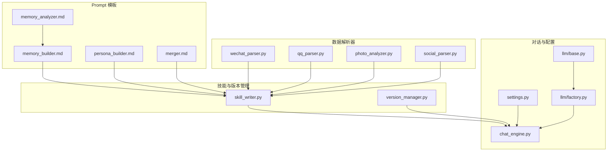

**图表来源**
- [prompts/memory_analyzer.md:1-95](file://prompts/memory_analyzer.md#L1-L95)
- [prompts/memory_builder.md:1-122](file://prompts/memory_builder.md#L1-L122)
- [prompts/persona_builder.md:1-129](file://prompts/persona_builder.md#L1-L129)
- [prompts/merger.md:1-45](file://prompts/merger.md#L1-L45)
- [tools/wechat_parser.py:1-251](file://tools/wechat_parser.py#L1-L251)
- [tools/qq_parser.py:1-130](file://tools/qq_parser.py#L1-L130)
- [tools/photo_analyzer.py:1-135](file://tools/photo_analyzer.py#L1-L135)
- [tools/social_parser.py:1-84](file://tools/social_parser.py#L1-L84)
- [tools/skill_writer.py:1-171](file://tools/skill_writer.py#L1-L171)
- [tools/version_manager.py:1-116](file://tools/version_manager.py#L1-L116)
- [tools/chat_engine.py:1-284](file://tools/chat_engine.py#L1-L284)
- [tools/config/settings.py:1-225](file://tools/config/settings.py#L1-L225)
- [tools/llm/factory.py:1-82](file://tools/llm/factory.py#L1-L82)
- [tools/llm/base.py:1-68](file://tools/llm/base.py#L1-L68)

**章节来源**
- [README.md:281-321](file://README.md#L281-L321)
- [SKILL.md:1-503](file://SKILL.md#L1-L503)

## 核心组件
- 关系记忆提取器（Memory Analyzer）：从多源数据中抽取关系时间线、日常模式、共同经历、饮食偏好、兴趣爱好、争吵模式、甜蜜瞬间与分手记忆等维度，形成结构化记忆。
- 关系记忆生成器（Memory Builder）：将提取的片段按模板组织为 Part A，包含关系概览、时间线、共同记忆、日常模式、争吵档案、甜蜜档案、分手档案与修正记录。
- 人物性格生成器（Persona Builder）：构建五层性格结构（硬规则→身份→说话风格→情感模式→关系行为），确保输出风格与行为模式一致。
- 增量合并器（Merger）：在追加新数据时，不覆盖既有结论，而是按维度进行增量合并与冲突标注。
- 技能文件管理器（Skill Writer）：负责目录初始化、memory.md/persona.md/SKILL.md/meta.json 的生成与合并。
- 版本管理器（Version Manager）：支持备份、回滚与版本列表查看，保障演进过程可追溯。
- 对话引擎（Chat Engine）：加载 SKILL.md 或分离的 memory.md/persona.md，构造系统 Prompt，维护对话历史，调用 LLM 客户端生成回复。
- 配置系统（Settings）：统一管理模型配置、默认 Provider/Model、路径与环境变量读取。
- LLM 客户端工厂（LLM Factory）：按 Provider 创建对应客户端，支持 OpenAI、Anthropic、Gemini、DashScope、Ollama 等。

**章节来源**
- [prompts/memory_analyzer.md:1-95](file://prompts/memory_analyzer.md#L1-L95)
- [prompts/memory_builder.md:1-122](file://prompts/memory_builder.md#L1-L122)
- [prompts/persona_builder.md:1-129](file://prompts/persona_builder.md#L1-L129)
- [prompts/merger.md:1-45](file://prompts/merger.md#L1-L45)
- [tools/skill_writer.py:1-171](file://tools/skill_writer.py#L1-L171)
- [tools/version_manager.py:1-116](file://tools/version_manager.py#L1-L116)
- [tools/chat_engine.py:1-284](file://tools/chat_engine.py#L1-L284)
- [tools/config/settings.py:1-225](file://tools/config/settings.py#L1-L225)
- [tools/llm/factory.py:1-82](file://tools/llm/factory.py#L1-L82)

## 架构总览
整体架构由“数据采集与解析 → 记忆构建 → 技能合成 → 对话推理 → 版本演进”构成。对话引擎在运行时将 Part A 的关系记忆与 Part B 的人物性格融合，形成符合“ta”的表达与行为模式的回复。

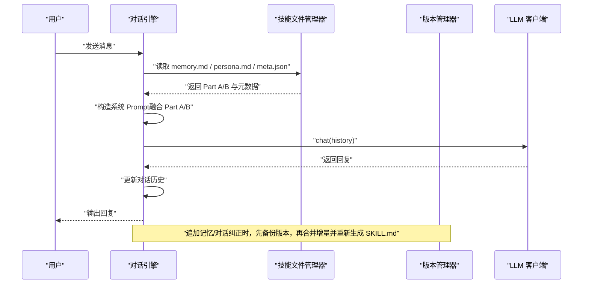

**图表来源**
- [tools/chat_engine.py:89-171](file://tools/chat_engine.py#L89-L171)
- [tools/skill_writer.py:68-144](file://tools/skill_writer.py#L68-L144)
- [tools/version_manager.py:16-73](file://tools/version_manager.py#L16-L73)

**章节来源**
- [SKILL.md:303-342](file://SKILL.md#L303-L342)
- [tools/chat_engine.py:60-131](file://tools/chat_engine.py#L60-L131)

## 详细组件分析

### 组件A：关系记忆提取与构建
- 提取维度：关系时间线、日常模式、共同经历、饮食偏好、兴趣爱好、争吵模式、甜蜜瞬间、分手相关。
- 输出格式：memory.md 模板，包含关系概览、时间线、共同记忆、日常模式、争吵档案、甜蜜档案、分手档案与修正记录。
- 填充规则：基于原材料与用户口述，时间尽量精确，地点可来自照片 EXIF 或聊天内容；若信息不足，标注“[待补充]”。

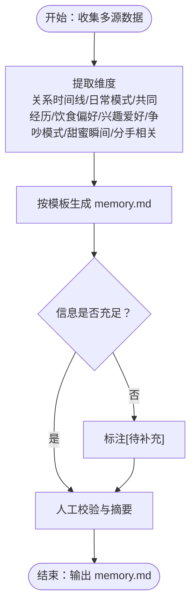

**图表来源**
- [prompts/memory_analyzer.md:7-95](file://prompts/memory_analyzer.md#L7-L95)
- [prompts/memory_builder.md:9-122](file://prompts/memory_builder.md#L9-L122)

**章节来源**
- [prompts/memory_analyzer.md:1-95](file://prompts/memory_analyzer.md#L1-L95)
- [prompts/memory_builder.md:1-122](file://prompts/memory_builder.md#L1-L122)

### 组件B：人物性格五层结构
- 硬规则（Layer 0）：不可违背的底线，如不说现实中不可能说的话、不突然完美、保持棱角等。
- 身份锚定（Layer 1）：姓名/代号、年龄/职业/城市、MBTI/星座、与用户的关系。
- 说话风格（Layer 2）：口头禅、语气词、标点风格、Emoji/表情、消息格式、错别字/缩写、称呼方式。
- 情感模式（Layer 3）：依恋类型、爱的语言、情绪触发器、不同情境下的表达。
- 关系行为（Layer 4）：关系角色、争吵模式、日常互动、边界与底线。

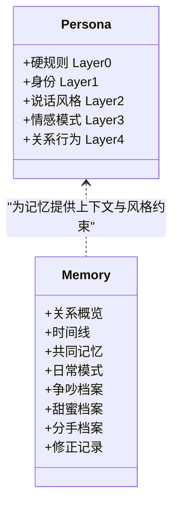

**图表来源**
- [prompts/persona_builder.md:9-129](file://prompts/persona_builder.md#L9-L129)
- [prompts/memory_builder.md:14-105](file://prompts/memory_builder.md#L14-L105)

**章节来源**
- [prompts/persona_builder.md:1-129](file://prompts/persona_builder.md#L1-L129)

### 组件C：知识图谱与关系网络组织
- 节点类型：人物（Ta）、地点（常去地点/约会地）、事件（关键节点/争吵/甜蜜/分手）、话题（兴趣爱好/口头禅/梗）、时间（时间线节点）。
- 边类型：发生在（事件-时间）、去过（人物-地点）、参与（人物-事件）、关联（事件-话题）、提及（事件/人物-话题）。
- 构建流程：从 memory.md 的时间线与共同记忆中抽取实体与关系，形成三元组；对地点与时间进行标准化与聚类，形成可检索的知识图谱。

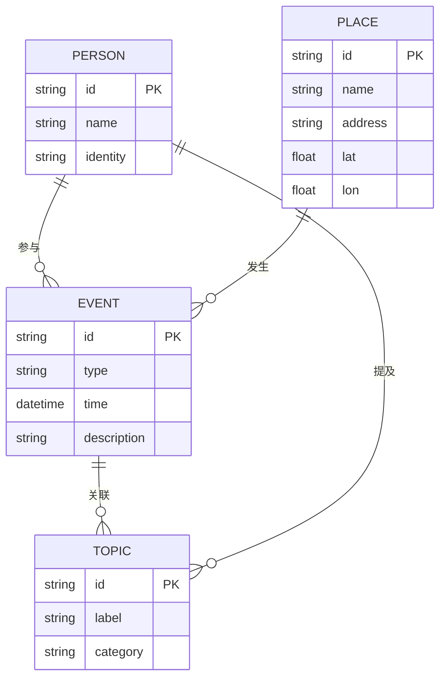

**图表来源**
- [prompts/memory_builder.md:23-105](file://prompts/memory_builder.md#L23-L105)

**章节来源**
- [prompts/memory_builder.md:23-105](file://prompts/memory_builder.md#L23-L105)

### 组件D：记忆权重计算与关联度分析
- 权重计算（基于证据强度）：
  - 时间戳密度：高频时段赋予更高权重（日常模式）。
  - 地点出现次数与经纬度聚类：常去地点权重更高。
  - 话题重复度：口头禅、梗、特定表达的出现频率。
  - 情绪极性与强度：争吵/甜蜜记忆的强度与触发因素。
- 关联度分析：
  - 语义相似度：使用嵌入向量计算事件/话题相似度。
  - 共现矩阵：统计事件与地点/人物/话题的共现频率。
  - 路径分析：从用户输入出发，寻找与之最相关的记忆路径（时间线→地点→事件→话题）。
- 检索优化策略：
  - 倒排索引：按关键词/话题建立倒排索引，加速召回。
  - 向量检索：对记忆片段进行向量化，使用 FAISS/HNSW 进行近似最近邻搜索。
  - 多路召回融合：结合关键词检索与向量检索，使用混合排序（BM25 + 点积）。

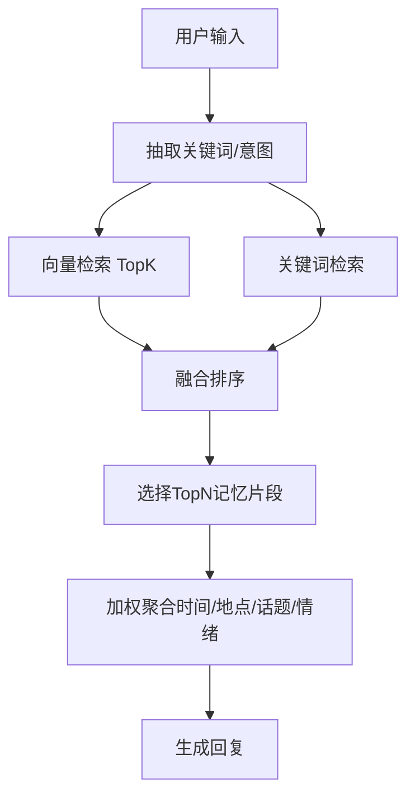

**图表来源**
- [tools/chat_engine.py:181-204](file://tools/chat_engine.py#L181-L204)

**章节来源**
- [tools/chat_engine.py:181-204](file://tools/chat_engine.py#L181-L204)

### 组件E：技能文件管理与合并
- 目录结构：exes/{slug}/versions、exes/{slug}/memories/chats、exes/{slug}/memories/photos、exes/{slug}/memories/social。
- 合并策略：memory.md 与 persona.md 合并为 SKILL.md，meta.json 包含名称、版本、时间戳、标签、印象、记忆来源等。
- 合并模板：SKILL.md 包含 Part A（关系记忆）与 Part B（人物性格）及运行规则。

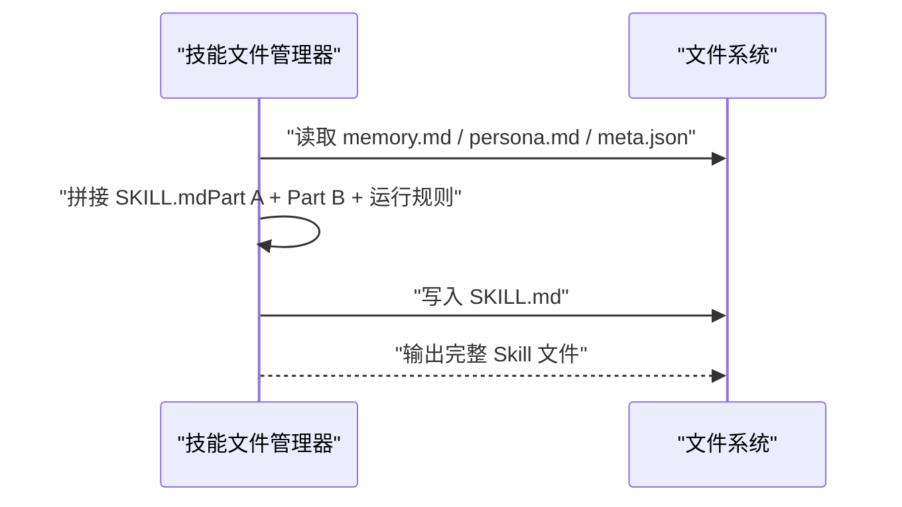

**图表来源**
- [tools/skill_writer.py:68-144](file://tools/skill_writer.py#L68-L144)
- [SKILL.md:303-342](file://SKILL.md#L303-L342)

**章节来源**
- [tools/skill_writer.py:1-171](file://tools/skill_writer.py#L1-L171)
- [SKILL.md:255-302](file://SKILL.md#L255-L302)

### 组件F：增量合并与版本演进
- 增量原则：不覆盖既有结论，冲突处标注“[⚠️ 冲突]”，新事件按时间线插入，新地点追加到“常去的地方”，新的内部梗追加到“Inside Jokes”。
- 版本管理：备份当前版本到 versions/，回滚时恢复至指定版本，支持列出历史版本。

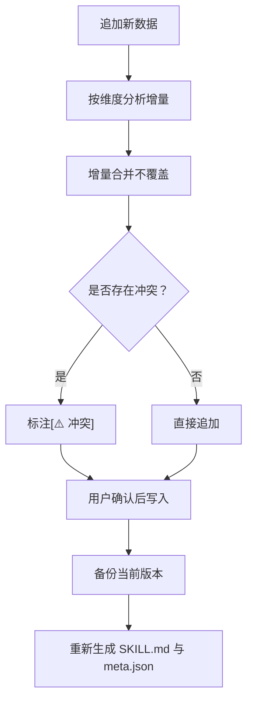

**图表来源**
- [prompts/merger.md:7-45](file://prompts/merger.md#L7-L45)
- [tools/version_manager.py:16-73](file://tools/version_manager.py#L16-L73)

**章节来源**
- [prompts/merger.md:1-45](file://prompts/merger.md#L1-L45)
- [tools/version_manager.py:1-116](file://tools/version_manager.py#L1-L116)

### 组件G：多源数据解析与特征提取
- 微信解析：支持 WeChatMsg（txt/html/csv）、留痕（json）、PyWxDump（sqlite）、纯文本；提取高频语气词、Emoji、标点习惯、消息风格等。
- QQ 解析：支持 txt/mht；提取消息样本与原始文本。
- 照片解析：提取 EXIF 时间与 GPS 信息，构建时间线与地点。
- 社交解析：扫描目录，分类图片与文本，图片需用 Read 工具查看。

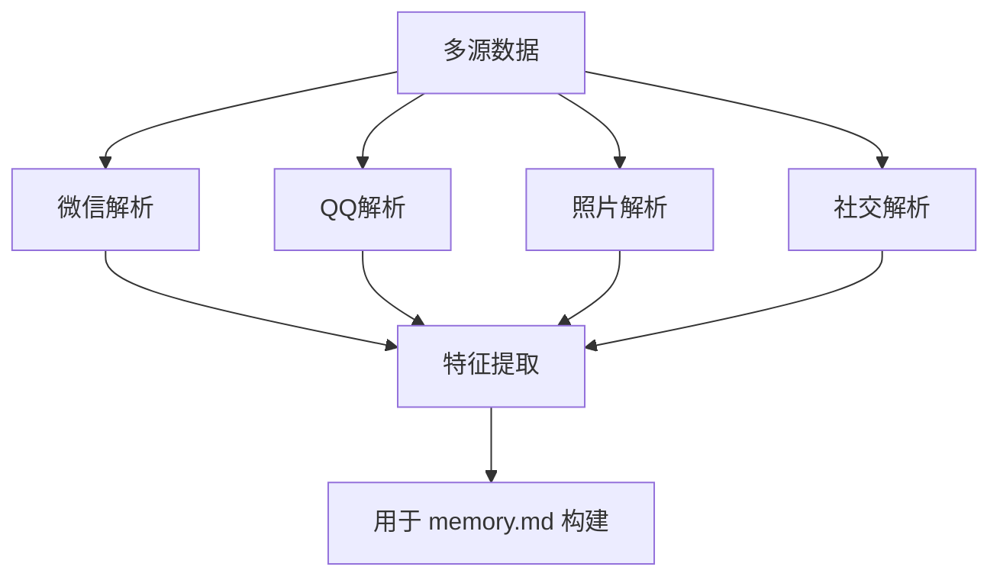

**图表来源**
- [tools/wechat_parser.py:24-177](file://tools/wechat_parser.py#L24-L177)
- [tools/qq_parser.py:19-90](file://tools/qq_parser.py#L19-L90)
- [tools/photo_analyzer.py:25-76](file://tools/photo_analyzer.py#L25-L76)
- [tools/social_parser.py:17-79](file://tools/social_parser.py#L17-L79)

**章节来源**
- [tools/wechat_parser.py:1-251](file://tools/wechat_parser.py#L1-L251)
- [tools/qq_parser.py:1-130](file://tools/qq_parser.py#L1-L130)
- [tools/photo_analyzer.py:1-135](file://tools/photo_analyzer.py#L1-L135)
- [tools/social_parser.py:1-84](file://tools/social_parser.py#L1-L84)

### 组件H：对话引擎与检索接口规范
- 对话流程：加载 SKILL.md 或分离的 memory.md/persona.md，构造系统 Prompt，维护历史，调用 LLM 客户端生成回复。
- 查询接口规范（建议）：
  - GET /skills/{slug}：获取 Skill 信息（名称、版本、更新时间、标签等）
  - GET /skills/{slug}/memory：获取 Part A（关系记忆）
  - GET /skills/{slug}/persona：获取 Part B（人物性格）
  - POST /skills/{slug}/chat：发送消息并获取回复（支持流式）
  - POST /skills/{slug}/evolve：追加记忆/对话纠正（内部调用版本管理与合并）
  - GET /skills/{slug}/versions：列出历史版本
  - POST /skills/{slug}/rollback：回滚到指定版本

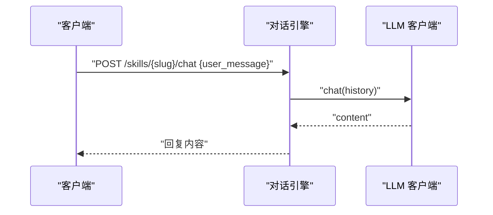

**图表来源**
- [tools/chat_engine.py:181-227](file://tools/chat_engine.py#L181-L227)

**章节来源**
- [tools/chat_engine.py:1-284](file://tools/chat_engine.py#L1-L284)

## 依赖分析
- 组件耦合：
  - Memory Analyzer 与 Memory Builder 强耦合，前者决定后者结构。
  - Persona Builder 与 Memory Builder 协同，共同决定 SKILL.md 的风格与行为。
  - Skill Writer 依赖 Memory/Persona 文件与 Meta 信息。
  - Chat Engine 依赖 Skill Writer 产出的 SKILL.md 或分离文件。
  - Version Manager 与 Skill Writer/Chat Engine 协同，保证演进可追溯。
- 外部依赖：
  - LLM Provider：OpenAI、Anthropic、Gemini、DashScope、Ollama。
  - Pillow：照片 EXIF 读取。
  - 环境变量与 .env 文件：API Key 与模型配置。

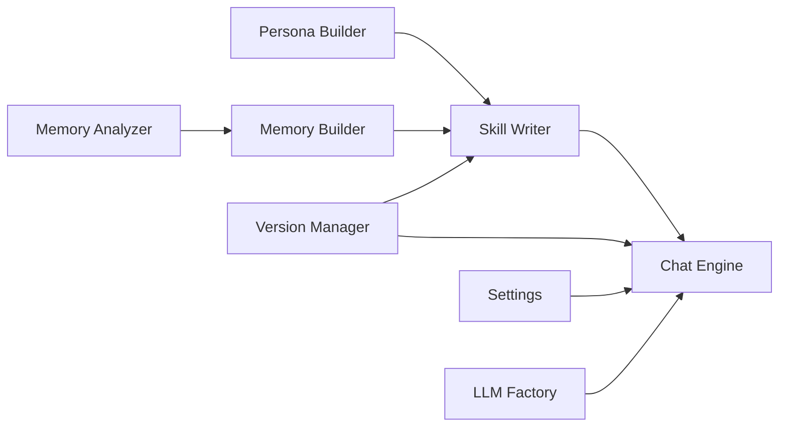

**图表来源**
- [tools/chat_engine.py:60-131](file://tools/chat_engine.py#L60-L131)
- [tools/skill_writer.py:68-144](file://tools/skill_writer.py#L68-L144)
- [tools/version_manager.py:16-73](file://tools/version_manager.py#L16-L73)
- [tools/config/settings.py:192-212](file://tools/config/settings.py#L192-L212)
- [tools/llm/factory.py:23-56](file://tools/llm/factory.py#L23-L56)

**章节来源**
- [tools/config/settings.py:1-225](file://tools/config/settings.py#L1-L225)
- [tools/llm/factory.py:1-82](file://tools/llm/factory.py#L1-L82)

## 性能考虑
- 数据解析阶段：
  - 微信/QQ 解析采用正则与流式读取，避免一次性加载大文件。
  - 照片解析遍历目录，按时间排序，减少 IO 开销。
- 记忆检索阶段：
  - 建议对 memory.md 片段建立向量索引与倒排索引，提升召回效率。
  - 对时间线与地点进行分桶与聚类，降低搜索空间。
- 对话生成阶段：
  - 使用流式输出（chat_stream）提升交互体验。
  - 控制上下文长度与温度参数，平衡创造性与稳定性。

[本节为通用性能建议，不直接分析具体文件]

## 故障排查指南
- 找不到 Skill 文件：
  - 检查 exes/{slug}/SKILL.md 或 memory.md/persona.md 是否存在。
  - 确认 meta.json 是否包含必要字段。
- LLM API Key 未配置：
  - 检查环境变量或 .env 文件是否正确设置。
  - 使用工厂方法列出可用模型与 API Key 状态。
- 版本回滚失败：
  - 确认目标版本是否存在，使用 list_versions 查看。
  - 回滚前会自动备份当前版本，可再次回滚。
- 照片 EXIF 读取失败：
  - 安装 Pillow 并确认照片包含 EXIF 信息。
- 微信/QQ 解析异常：
  - 确认文件格式与编码，必要时使用自动检测。

**章节来源**
- [tools/chat_engine.py:94-106](file://tools/chat_engine.py#L94-L106)
- [tools/config/settings.py:148-160](file://tools/config/settings.py#L148-L160)
- [tools/version_manager.py:46-73](file://tools/version_manager.py#L46-L73)
- [tools/photo_analyzer.py:27-28](file://tools/photo_analyzer.py#L27-L28)
- [tools/wechat_parser.py:24-45](file://tools/wechat_parser.py#L24-L45)

## 结论
本记忆构建模板通过“关系记忆 + 人物性格”的双层结构，结合多源数据解析、增量合并与版本演进，实现了可解释、可追溯、可优化的记忆系统。通过知识图谱与检索优化策略，能够将碎片化的记忆整合为连贯的技能知识，使对话更贴近“ta”的表达与行为模式。建议在实际部署中进一步完善向量索引与多路召回融合，以提升检索效率与准确性。

[本节为总结性内容，不直接分析具体文件]

## 附录
- 存储格式与路径：
  - exes/{slug}/memory.md：Part A（关系记忆）
  - exes/{slug}/persona.md：Part B（人物性格）
  - exes/{slug}/meta.json：元数据（名称、版本、时间戳、标签、印象、记忆来源等）
  - exes/{slug}/SKILL.md：完整可运行 Skill（合并 Part A/B 与运行规则）
  - exes/{slug}/versions/：版本备份目录
  - exes/{slug}/memories/chats、photos、social：原始数据归档
- 命令与工具：
  - 列出 Skill：tools/skill_writer.py --action list
  - 初始化目录：tools/skill_writer.py --action init --slug {slug}
  - 合并生成 SKILL.md：tools/skill_writer.py --action combine --slug {slug}
  - 备份版本：tools/version_manager.py --action backup --slug {slug}
  - 回滚版本：tools/version_manager.py --action rollback --slug {slug} --version {version}
  - 列出版本：tools/version_manager.py --action list --slug {slug}

**章节来源**
- [tools/skill_writer.py:147-171](file://tools/skill_writer.py#L147-L171)
- [tools/version_manager.py:94-116](file://tools/version_manager.py#L94-L116)
- [SKILL.md:255-302](file://SKILL.md#L255-L302)