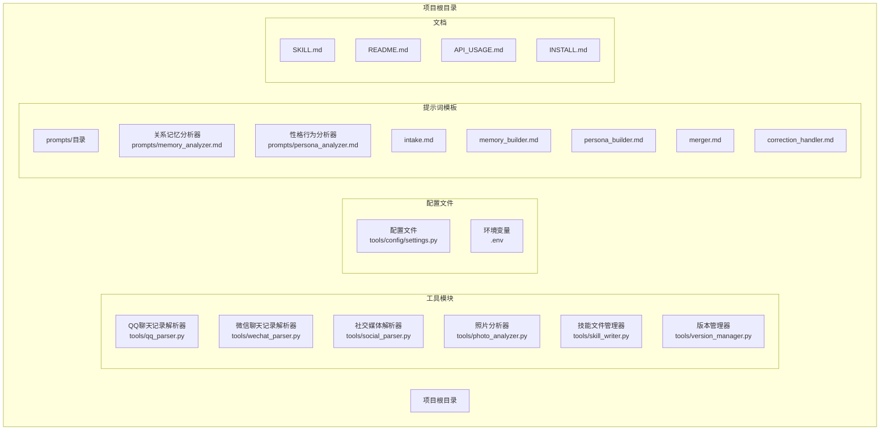
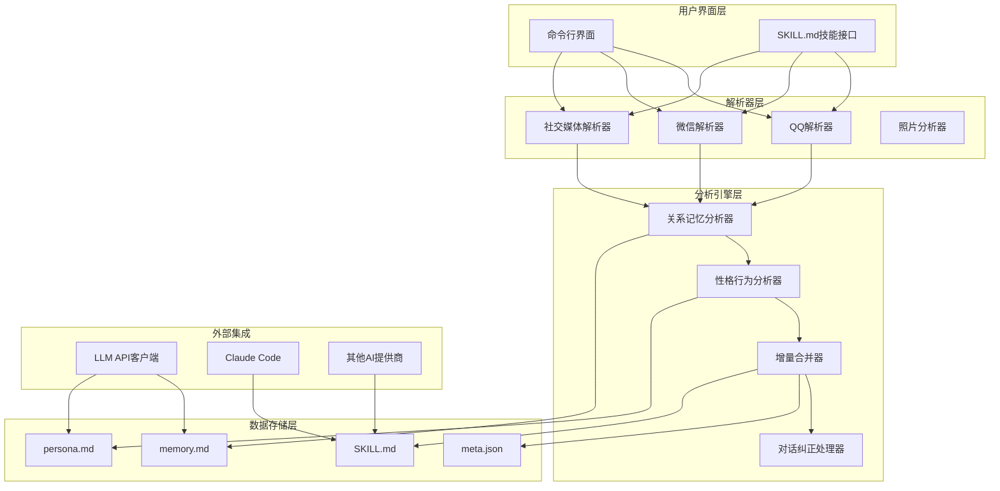
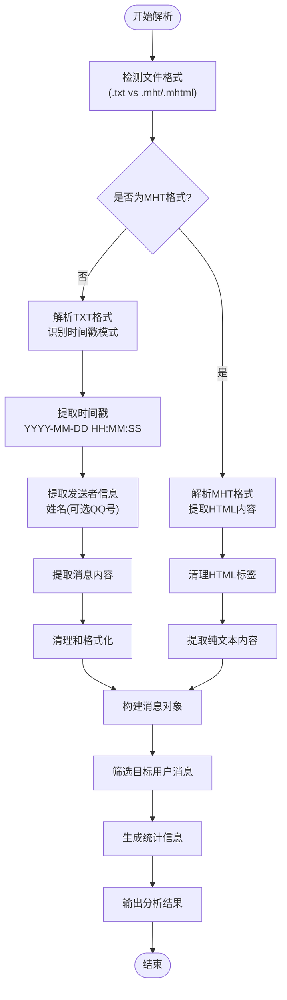
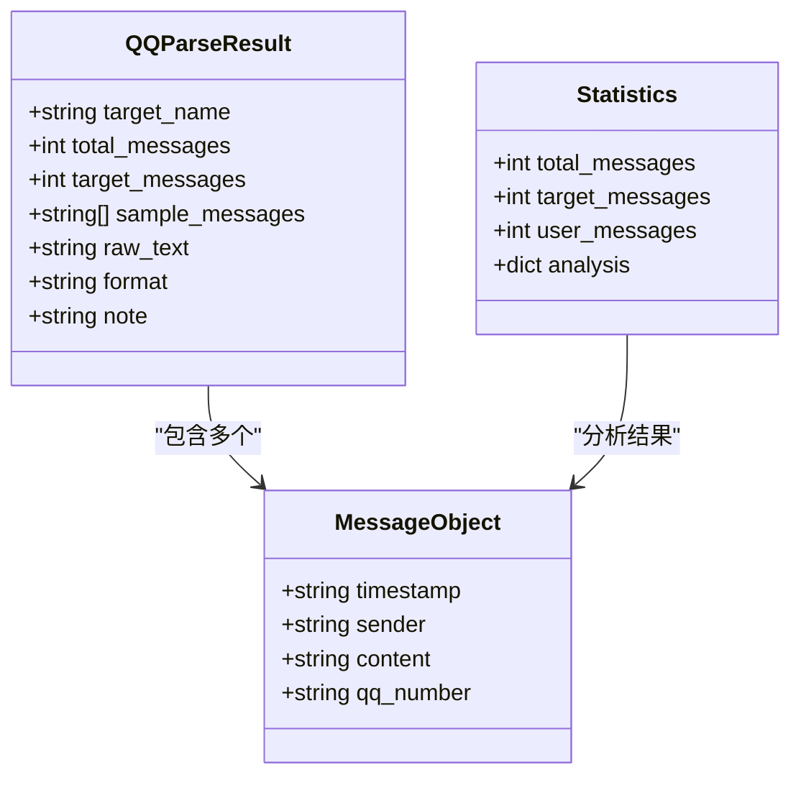
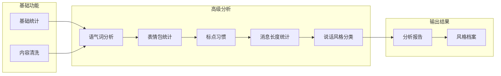
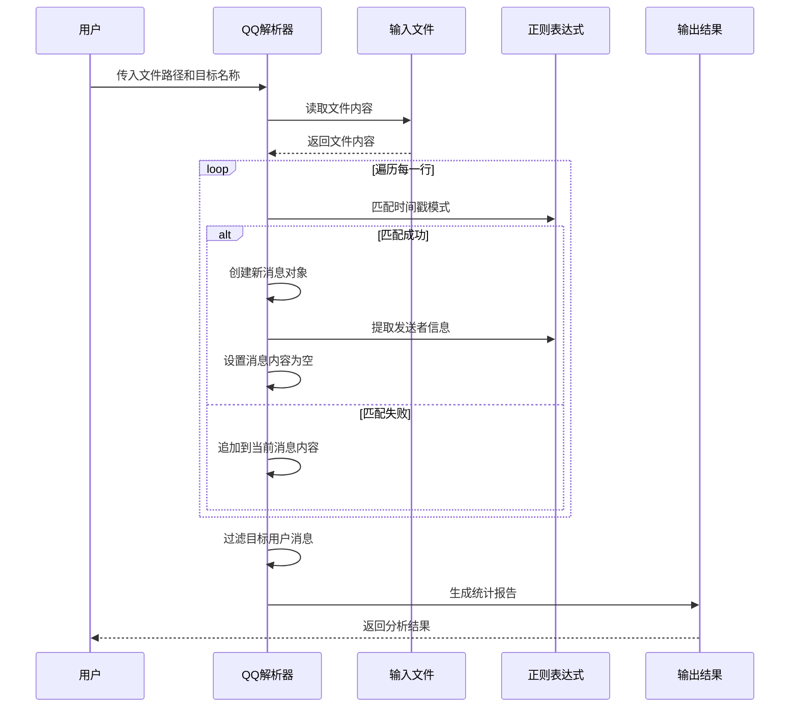
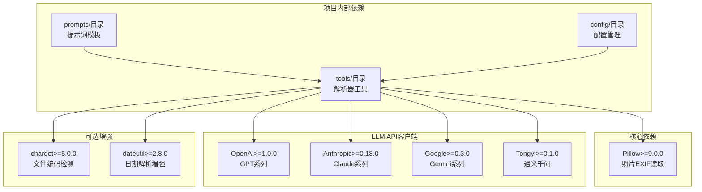
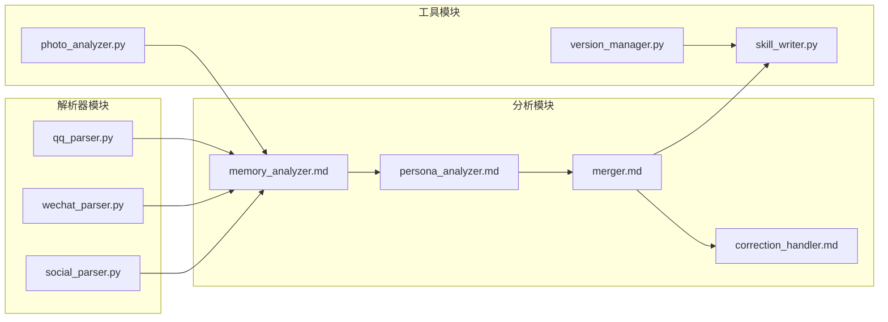

# QQ聊天记录解析器

<cite>
**本文档引用的文件**
- [qq_parser.py](file://tools/qq_parser.py)
- [wechat_parser.py](file://tools/wechat_parser.py)
- [social_parser.py](file://tools/social_parser.py)
- [SKILL.md](file://SKILL.md)
- [README.md](file://README.md)
- [requirements.txt](file://requirements.txt)
- [memory_analyzer.md](file://prompts/memory_analyzer.md)
- [persona_analyzer.md](file://prompts/persona_analyzer.md)
</cite>

## 目录
1. [简介](#简介)
2. [项目结构](#项目结构)
3. [核心组件](#核心组件)
4. [架构概览](#架构概览)
5. [详细组件分析](#详细组件分析)
6. [依赖关系分析](#依赖关系分析)
7. [性能考虑](#性能考虑)
8. [故障排除指南](#故障排除指南)
9. [结论](#结论)
10. [附录](#附录)

## 简介

QQ聊天记录解析器是"前任.skill"项目中的一个重要组件，专门用于解析和分析QQ聊天记录数据。该解析器支持多种QQ导出格式，包括文本格式（txt）和压缩超文本格式（mht），能够从原始聊天数据中提取关键信息，为后续的AI技能生成提供高质量的数据基础。

该项目的核心目标是将真实的聊天记录转化为可驱动对话的AI技能，让用户能够与"前任"进行自然的对话交流。QQ解析器作为数据源之一，为这个目标提供了重要的技术支持。

## 项目结构

项目采用模块化的组织方式，各个解析器工具相互独立但功能互补：



**图表来源**
- [SKILL.md:1-503](file://SKILL.md#L1-L503)
- [README.md:281-321](file://README.md#L281-L321)

**章节来源**
- [README.md:281-321](file://README.md#L281-L321)
- [SKILL.md:1-503](file://SKILL.md#L1-L503)

## 核心组件

### QQ聊天记录解析器

QQ聊天记录解析器是本项目中最核心的解析组件之一，专门处理QQ聊天记录的导入和分析。该组件具有以下关键特性：

#### 支持的格式
- **TXT格式**：QQ消息管理器导出的标准文本格式
- **MHT格式**：压缩超文本格式，包含HTML内容

#### 主要功能
- 时间戳解析和标准化
- 发送者信息提取
- 消息内容清洗和整理
- 统计数据分析
- 结构化输出生成

#### 数据处理流程
1. 文件格式检测
2. 内容读取和预处理
3. 消息结构识别
4. 关键信息提取
5. 统计分析
6. 结果输出

**章节来源**
- [qq_parser.py:1-130](file://tools/qq_parser.py#L1-L130)

### 微信聊天记录解析器

微信解析器提供了更丰富的分析能力，包括多种格式支持和深入的文本分析：

#### 格式支持
- WeChatMsg导出（txt/html/csv）
- 留痕导出（json）
- PyWxDump导出（sqlite）
- 手动复制粘贴（纯文本）

#### 高级分析功能
- 语气词高频分析
- Emoji使用统计
- 标点符号习惯分析
- 消息长度统计
- 说话风格识别

**章节来源**
- [wechat_parser.py:1-251](file://tools/wechat_parser.py#L1-L251)

### 社交媒体解析器

社交媒体解析器负责处理各种社交媒体平台的内容：

#### 支持的平台
- 朋友圈截图
- 微博截图
- 小红书截图
- Instagram截图

#### 功能特性
- 目录扫描和分类
- 文件类型识别
- 内容提取和展示
- 图片文件标注

**章节来源**
- [social_parser.py:1-84](file://tools/social_parser.py#L1-L84)

## 架构概览

系统采用分层架构设计，各个组件职责明确，协作高效：



**图表来源**
- [SKILL.md:45-503](file://SKILL.md#L45-L503)
- [qq_parser.py:93-129](file://tools/qq_parser.py#L93-L129)
- [wechat_parser.py:180-251](file://tools/wechat_parser.py#L180-L251)

## 详细组件分析

### QQ解析器核心实现

#### 时间戳处理机制

QQ解析器采用正则表达式模式来识别和解析时间戳：



**图表来源**
- [qq_parser.py:19-73](file://tools/qq_parser.py#L19-L73)
- [qq_parser.py:76-90](file://tools/qq_parser.py#L76-L90)

#### 消息格式识别算法

QQ解析器使用正则表达式来识别不同类型的消息行：

| 消息类型 | 正则表达式模式 | 匹配示例 |
|---------|---------------|----------|
| 时间戳行 | `\d{4}-\d{2}-\d{2}\s+\d{2}:\d{2}:\d{2}` | `2024-01-15 20:30:45` |
| 发送者行 | `(.+?)(?:\((\d+)\))?` | `张三(123456)` |
| 内容行 | `.*` | `今天好累` |

#### 数据结构设计

解析器返回统一的结构化数据：



**图表来源**
- [qq_parser.py:40-73](file://tools/qq_parser.py#L40-L73)
- [qq_parser.py:85-90](file://tools/qq_parser.py#L85-L90)

**章节来源**
- [qq_parser.py:19-90](file://tools/qq_parser.py#L19-L90)

### 微信解析器对比分析

#### 格式支持对比

| 特性 | QQ解析器 | 微信解析器 |
|------|----------|------------|
| 支持格式 | TXT, MHT | TXT, HTML, CSV, JSON, SQLite, 纯文本 |
| 自动检测 | 无 | 有格式自动检测 |
| 高级分析 | 基础统计 | 深度文本分析 |
| 语音消息 | 不支持 | 支持多种格式 |
| 表情包 | 不支持 | 支持表情包统计 |
| 语音识别 | 不支持 | 支持语音转文字 |

#### 文本分析能力对比

微信解析器提供了更丰富的文本分析功能：



**图表来源**
- [wechat_parser.py:123-177](file://tools/wechat_parser.py#L123-L177)

**章节来源**
- [wechat_parser.py:24-177](file://tools/wechat_parser.py#L24-L177)

### 数据预处理流程

#### QQ解析器预处理步骤



**图表来源**
- [qq_parser.py:36-73](file://tools/qq_parser.py#L36-L73)

#### 质量保证措施

系统实施了多层次的质量保证措施：

1. **编码处理**：使用UTF-8编码读取文件，错误字符自动忽略
2. **格式验证**：检查文件存在性和格式有效性
3. **数据完整性**：确保消息对象的完整性
4. **内存管理**：合理控制输出文本大小
5. **异常处理**：捕获和处理各种解析异常

**章节来源**
- [qq_parser.py:93-129](file://tools/qq_parser.py#L93-L129)

## 依赖关系分析

### 外部依赖

项目的主要外部依赖包括：



**图表来源**
- [requirements.txt:1-12](file://requirements.txt#L1-L12)

### 内部模块依赖



**图表来源**
- [SKILL.md:210-341](file://SKILL.md#L210-L341)

**章节来源**
- [requirements.txt:1-12](file://requirements.txt#L1-L12)
- [SKILL.md:210-341](file://SKILL.md#L210-L341)

## 性能考虑

### 内存优化策略

1. **流式处理**：逐行读取文件，避免一次性加载整个文件
2. **内容截断**：限制输出文本的最大长度，防止内存溢出
3. **对象复用**：重用消息对象，减少内存分配
4. **延迟计算**：只在需要时进行复杂的统计分析

### 处理效率优化

1. **正则表达式缓存**：编译正则表达式一次，重复使用
2. **字符串处理优化**：使用高效的字符串连接方法
3. **文件I/O优化**：批量读取文件内容
4. **异常处理优化**：最小化异常处理开销

### 扩展性考虑

1. **插件化设计**：易于添加新的解析格式支持
2. **配置驱动**：通过配置文件调整解析参数
3. **并发处理**：支持多文件并行解析
4. **缓存机制**：缓存解析结果，提高重复处理效率

## 故障排除指南

### 常见问题及解决方案

#### 文件格式问题
- **问题**：文件格式不被识别
- **解决方案**：检查文件扩展名，确保使用QQ消息管理器导出的格式

#### 编码问题
- **问题**：中文显示乱码
- **解决方案**：确认文件使用UTF-8编码保存

#### 内存不足
- **问题**：处理大文件时内存溢出
- **解决方案**：分割文件或增加系统内存

#### 解析失败
- **问题**：消息格式不符合预期
- **解决方案**：检查QQ导出设置，确保包含完整的时间戳和发送者信息

### 调试技巧

1. **启用详细日志**：在解析器中添加调试输出
2. **单元测试**：为关键解析函数编写测试用例
3. **边界测试**：测试极端情况下的解析行为
4. **性能监控**：监控解析过程的内存和CPU使用

**章节来源**
- [qq_parser.py:101-103](file://tools/qq_parser.py#L101-L103)

## 结论

QQ聊天记录解析器作为"前任.skill"项目的重要组成部分，为AI技能生成提供了可靠的数据基础。该解析器具有以下优势：

1. **简洁高效**：专注于核心功能，代码结构清晰
2. **格式兼容**：支持QQ标准导出格式，满足大多数使用场景
3. **质量保证**：实施多层次的质量控制措施
4. **扩展性强**：为未来功能扩展预留了良好的架构基础

通过与其他解析器（特别是微信解析器）的对比分析，可以看出QQ解析器虽然功能相对简单，但在特定场景下具有独特价值。它为用户提供了一个轻量级的选择，特别适合处理QQ聊天记录这种相对简单的文本格式。

未来的发展方向包括：
- 增加更多格式支持
- 提升解析精度和鲁棒性
- 添加多媒体内容处理能力
- 优化性能和扩展性

## 附录

### 使用示例

#### 基本使用命令

```bash
# 解析QQ聊天记录TXT格式
python3 tools/qq_parser.py --file ./qq_chat.txt --target "张三" --output ./qq_analysis.txt

# 解析QQ聊天记录MHT格式
python3 tools/qq_parser.py --file ./qq_chat.mht --target "李四" --output ./qq_analysis.txt
```

#### 输出格式说明

解析器输出包含以下关键信息：
- 总消息数统计
- 目标用户消息数量
- 消息样本展示
- 原始文本内容（截取）
- 格式信息和备注

### 开发指导

#### 扩展开发建议

1. **新增格式支持**：参考现有解析器的实现模式
2. **性能优化**：关注内存使用和处理速度
3. **错误处理**：完善异常处理和用户反馈
4. **测试覆盖**：编写全面的单元测试和集成测试

#### 最佳实践

1. **代码规范**：遵循PEP8编码规范
2. **文档维护**：及时更新API文档和使用说明
3. **版本管理**：使用Git进行版本控制
4. **持续集成**：建立自动化测试和部署流程

**章节来源**
- [SKILL.md:144-155](file://SKILL.md#L144-L155)
- [README.md:82-88](file://README.md#L82-L88)