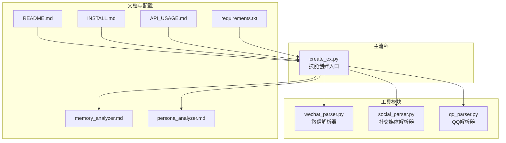
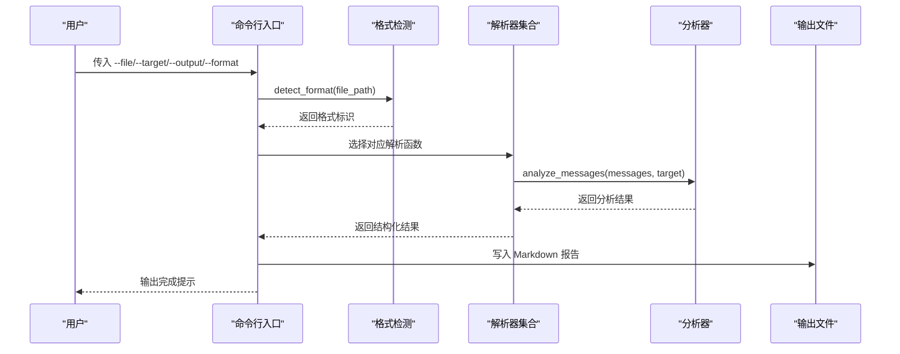
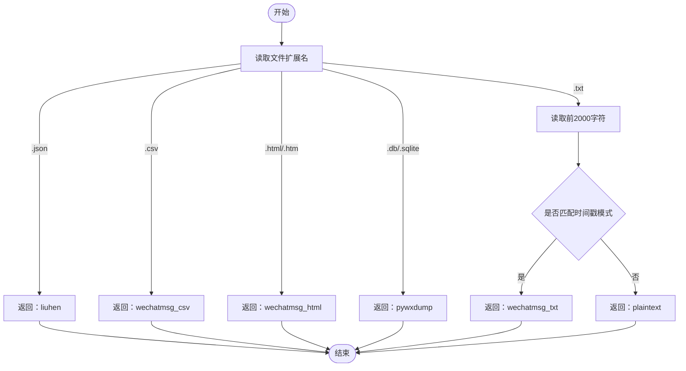
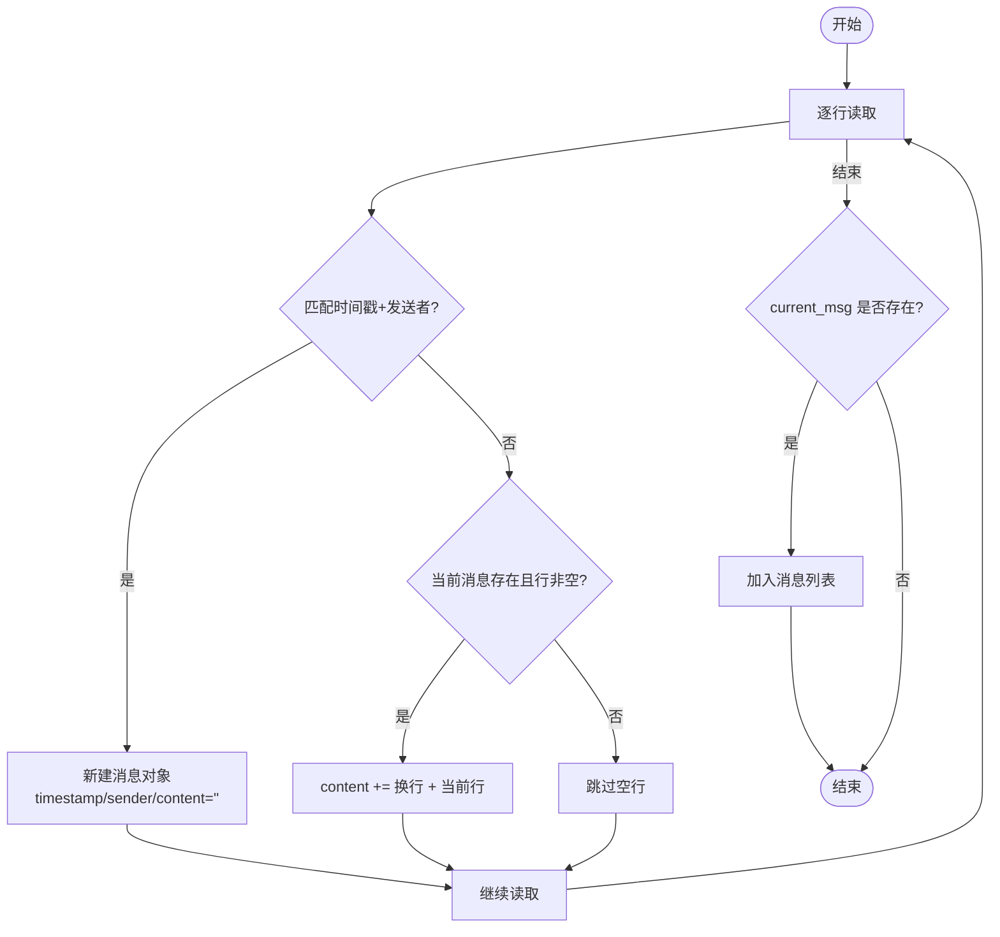
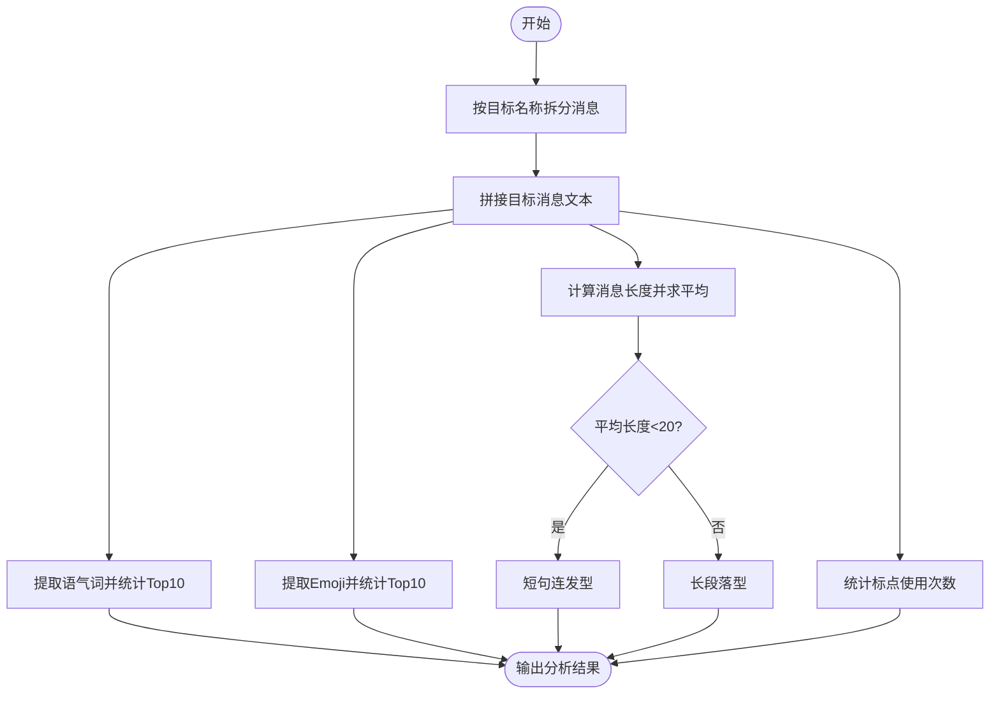
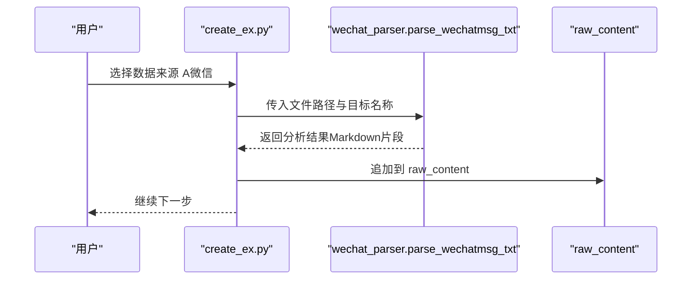
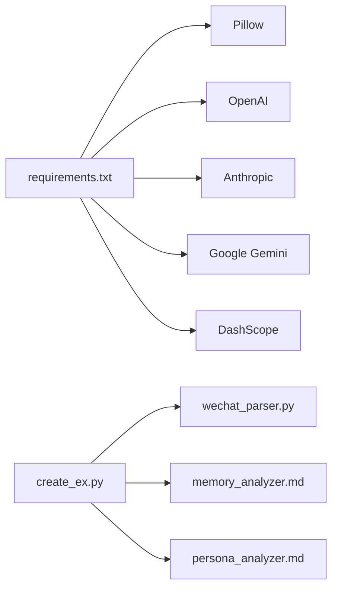

# 微信聊天记录解析器

<cite>
**本文引用的文件**
- [wechat_parser.py](file://tools/wechat_parser.py)
- [social_parser.py](file://tools/social_parser.py)
- [qq_parser.py](file://tools/qq_parser.py)
- [create_ex.py](file://create_ex.py)
- [README.md](file://README.md)
- [INSTALL.md](file://INSTALL.md)
- [API_USAGE.md](file://API_USAGE.md)
- [requirements.txt](file://requirements.txt)
- [memory_analyzer.md](file://prompts/memory_analyzer.md)
- [persona_analyzer.md](file://prompts/persona_analyzer.md)
</cite>

## 目录
1. [简介](#简介)
2. [项目结构](#项目结构)
3. [核心组件](#核心组件)
4. [架构总览](#架构总览)
5. [详细组件分析](#详细组件分析)
6. [依赖关系分析](#依赖关系分析)
7. [性能考虑](#性能考虑)
8. [故障排查指南](#故障排查指南)
9. [结论](#结论)
10. [附录](#附录)

## 简介
本文件面向“微信聊天记录解析器”的技术文档，聚焦于多格式导出数据的解析与分析能力，包括：
- WeChatMsg TXT/HTML/CSV 格式（时间戳+发送者模式解析）
- 留痕 JSON 格式（多层嵌套结构处理）
- PyWxDump SQLite 格式（数据库查询与数据提取）
- 纯文本格式（手动粘贴内容处理）

文档将深入解释格式自动检测算法、正则表达式匹配模式、消息分段逻辑、数据清洗规则，并提供示例输入输出、消息分析功能（高频语气词、Emoji 统计、标点习惯、消息长度统计）以及错误处理、编码兼容性与性能优化策略。

## 项目结构
该项目围绕“前任.skill”主题，提供多来源数据解析与整合能力，其中微信解析器位于 tools 目录，配合主流程工具 create_ex.py 完成技能创建与内容生成。

图表来源
- [wechat_parser.py:1-251](file://tools/wechat_parser.py#L1-L251)
- [social_parser.py:1-84](file://tools/social_parser.py#L1-L84)
- [qq_parser.py:1-130](file://tools/qq_parser.py#L1-L130)
- [create_ex.py:1-436](file://create_ex.py#L1-L436)
- [README.md:235-275](file://README.md#L235-L275)
- [INSTALL.md:41-82](file://INSTALL.md#L41-L82)
- [API_USAGE.md:1-194](file://API_USAGE.md#L1-L194)
- [requirements.txt:1-12](file://requirements.txt#L1-L12)
- [memory_analyzer.md:1-95](file://prompts/memory_analyzer.md#L1-L95)
- [persona_analyzer.md:1-92](file://prompts/persona_analyzer.md#L1-L92)

章节来源
- [README.md:235-275](file://README.md#L235-L275)
- [INSTALL.md:41-82](file://INSTALL.md#L41-L82)
- [API_USAGE.md:1-194](file://API_USAGE.md#L1-L194)

## 核心组件
- 微信聊天记录解析器：负责识别并解析多种导出格式，提取消息列表并进行统计分析。
- 社交媒体内容解析器：扫描目录，分类图片与文本文件，输出概览。
- QQ 聊天记录解析器：解析 TXT 与 MHT（HTML）格式，提取文本并进行基本统计。
- 主流程工具：整合多来源数据，生成 Relationship Memory 与 Persona 结构草稿。

章节来源
- [wechat_parser.py:1-251](file://tools/wechat_parser.py#L1-L251)
- [social_parser.py:1-84](file://tools/social_parser.py#L1-L84)
- [qq_parser.py:1-130](file://tools/qq_parser.py#L1-L130)
- [create_ex.py:1-436](file://create_ex.py#L1-L436)

## 架构总览
微信解析器采用“格式自动检测 + 多解析器分派 + 统一分析输出”的架构，支持 CLI 与主流程集成两种使用方式。

图表来源
- [wechat_parser.py:180-247](file://tools/wechat_parser.py#L180-L247)

## 详细组件分析

### 格式自动检测算法
- 基于文件扩展名的快速判定：
  - .json → 留痕导出
  - .csv → WeChatMsg CSV
  - .html/.htm → WeChatMsg HTML
  - .db/.sqlite → PyWxDump
  - .txt → 进一步判断是否包含时间戳模式
- 对于 TXT 文件，读取前若干字符，使用正则匹配时间戳模式以区分 WeChatMsg TXT 与纯文本。

图表来源
- [wechat_parser.py:24-45](file://tools/wechat_parser.py#L24-L45)

章节来源
- [wechat_parser.py:24-45](file://tools/wechat_parser.py#L24-L45)

### WeChatMsg TXT 格式解析
- 消息分段逻辑：
  - 使用正则匹配“时间戳 + 发送者”行，作为新消息的开始。
  - 当前行非匹配且非空时，视为上一条消息的内容延续，拼接到 content。
- 数据清洗规则：
  - 去除行尾换行符，保留原始换行以维持段落结构。
  - 对 sender 做 strip 清洗。
- 输出结构：
  - 返回统一的消息列表，供分析器使用。

图表来源
- [wechat_parser.py:48-85](file://tools/wechat_parser.py#L48-L85)

章节来源
- [wechat_parser.py:48-85](file://tools/wechat_parser.py#L48-L85)

### 留痕 JSON 格式解析
- 多种结构适配：
  - 若顶层即为列表，则直接遍历；否则尝试读取 messages/data 字段。
- 字段映射：
  - time/timestamp → timestamp
  - sender/nickname/from → sender
  - content/message/text → content
- 输出结构：
  - 统一为消息列表，供分析器使用。

章节来源
- [wechat_parser.py:88-104](file://tools/wechat_parser.py#L88-L104)

### PyWxDump SQLite 格式解析
- 当前实现：
  - CLI 中未提供专用解析函数，主流程直接调用外部解析器（例如通过其他工具导出为 JSON/TXT）。
- 建议实现思路（扩展方向）：
  - 读取 SQLite 数据库，查询消息表（如包含时间、发送者、内容字段）。
  - 使用正则或结构化解析进行清洗与标准化。
  - 输出统一消息列表供分析器使用。

章节来源
- [wechat_parser.py:198-202](file://tools/wechat_parser.py#L198-L202)
- [create_ex.py:115-128](file://create_ex.py#L115-L128)

### 纯文本格式解析
- 直接读取原始文本，标记为 plaintext，便于后续人工分析或提示。

章节来源
- [wechat_parser.py:107-120](file://tools/wechat_parser.py#L107-L120)

### 消息分析器（analyze_messages）
- 目标与用户消息分离：
  - 以目标名称过滤，分别统计目标消息与用户消息数量。
- 高频语气词：
  - 使用正则匹配常见语气词集合，统计前 10 位。
- Emoji 统计：
  - 使用 Unicode 范围匹配 Emoji，统计前 10 位。
- 消息长度统计：
  - 计算目标消息平均长度，划分“短句连发型/长段落型”两类风格。
- 标点习惯：
  - 统计中文句号、感叹号、问号、省略号、波浪号等出现次数。

图表来源
- [wechat_parser.py:123-177](file://tools/wechat_parser.py#L123-L177)

章节来源
- [wechat_parser.py:123-177](file://tools/wechat_parser.py#L123-L177)

### CLI 与主流程集成
- CLI：
  - 支持 --file/--target/--output/--format 参数，自动检测格式并输出 Markdown 报告。
- 主流程（create_ex.py）：
  - 在 Step 2 中调用微信解析器，将分析结果注入到整体素材中，供后续生成 memory.md 与 persona.md。

图表来源
- [create_ex.py:115-128](file://create_ex.py#L115-L128)
- [wechat_parser.py:180-247](file://tools/wechat_parser.py#L180-L247)

章节来源
- [create_ex.py:115-128](file://create_ex.py#L115-L128)
- [wechat_parser.py:180-247](file://tools/wechat_parser.py#L180-L247)

## 依赖关系分析
- 外部依赖：
  - Pillow：照片 EXIF 读取（可选）
  - OpenAI/Anthropic/Google Gemini/DashScope：LLM 客户端（多 API 版本）
- 内部依赖：
  - tools/wechat_parser.py 作为微信解析的核心模块，被 create_ex.py 调用。
  - prompts/memory_analyzer.md 与 persona_analyzer.md 为生成阶段提供分析维度与规则。

图表来源
- [requirements.txt:1-12](file://requirements.txt#L1-L12)
- [create_ex.py:1-436](file://create_ex.py#L1-L436)
- [wechat_parser.py:1-251](file://tools/wechat_parser.py#L1-L251)
- [memory_analyzer.md:1-95](file://prompts/memory_analyzer.md#L1-L95)
- [persona_analyzer.md:1-92](file://prompts/persona_analyzer.md#L1-L92)

章节来源
- [requirements.txt:1-12](file://requirements.txt#L1-L12)
- [create_ex.py:1-436](file://create_ex.py#L1-L436)
- [wechat_parser.py:1-251](file://tools/wechat_parser.py#L1-L251)

## 性能考虑
- 文件读取与正则匹配：
  - 使用逐行读取避免一次性加载大文件，降低内存占用。
  - 正则匹配在 TXT 解析中仅在行首进行，复杂度与行数线性相关。
- 编码与错误处理：
  - 统一使用 UTF-8 读取，errors='ignore' 保证在异常编码下仍可继续解析。
- 输出策略：
  - CLI 输出 Markdown 报告，主流程将分析结果拼接到 raw_content，减少二次 IO。

章节来源
- [wechat_parser.py:64-85](file://tools/wechat_parser.py#L64-L85)
- [wechat_parser.py:109-120](file://tools/wechat_parser.py#L109-L120)
- [wechat_parser.py:210-246](file://tools/wechat_parser.py#L210-L246)

## 故障排查指南
- 文件不存在：
  - CLI 中对文件路径进行存在性检查，不存在时输出错误并退出。
- 格式识别失败：
  - TXT 文件若不含时间戳模式，将被识别为纯文本；建议使用 WeChatMsg 导出工具以获得最佳解析效果。
- 编码问题：
  - 解析器统一使用 UTF-8，errors='ignore'；若出现乱码，建议检查导出工具的编码设置。
- PyWxDump 格式：
  - 当前 CLI 未内置解析器，建议先将 SQLite 导出为 JSON/TXT 再使用解析器处理。

章节来源
- [wechat_parser.py:189-196](file://tools/wechat_parser.py#L189-L196)
- [wechat_parser.py:38-45](file://tools/wechat_parser.py#L38-L45)
- [INSTALL.md:52-64](file://INSTALL.md#L52-L64)

## 结论
微信聊天记录解析器提供了对主流导出格式的自动识别与解析能力，结合消息分析器实现了高频语气词、Emoji 统计、标点习惯与消息长度统计等关键特征提取。通过 CLI 与主流程的集成，能够将解析结果无缝融入“前任.skill”的生成流程，为后续的 Relationship Memory 与 Persona 构建提供高质量数据基础。对于 PyWxDump 等复杂格式，建议通过中间导出步骤配合现有解析器实现。

## 附录

### 示例输入与输出（概念性说明）
- WeChatMsg TXT 示例输入（时间戳+发送者模式）：
  - 2024-01-15 20:30:45 张三
  - 今天好累啊
  - 2024-01-15 20:31:02 我
  - 怎么了？
- 留痕 JSON 示例输入（多层嵌套）：
  - 顶层为对象，包含 messages 字段或 data 字段，内部消息对象包含 time/sender/content 等字段。
- 纯文本示例输入：
  - 任意粘贴的聊天记录文本，解析器将其标记为 plaintext 并输出提示信息。
- CLI 输出示例（Markdown 报告）：
  - 包含高频语气词、Emoji、标点习惯、消息风格与消息样本等。

章节来源
- [wechat_parser.py:49-57](file://tools/wechat_parser.py#L49-L57)
- [wechat_parser.py:88-104](file://tools/wechat_parser.py#L88-L104)
- [wechat_parser.py:107-120](file://tools/wechat_parser.py#L107-L120)
- [wechat_parser.py:210-246](file://tools/wechat_parser.py#L210-L246)