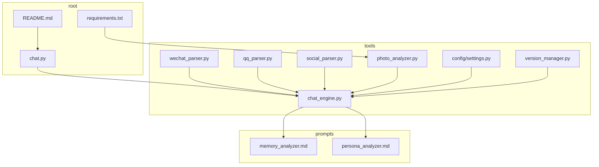
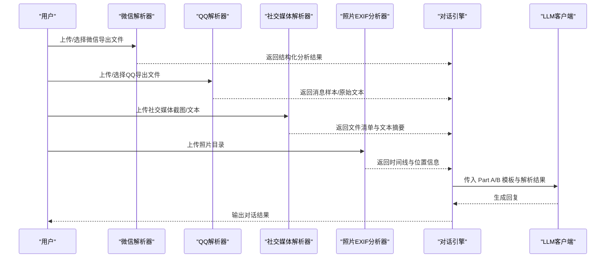
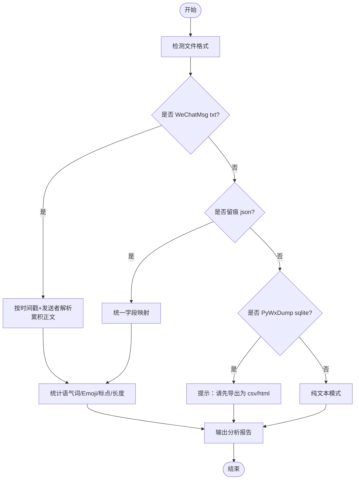
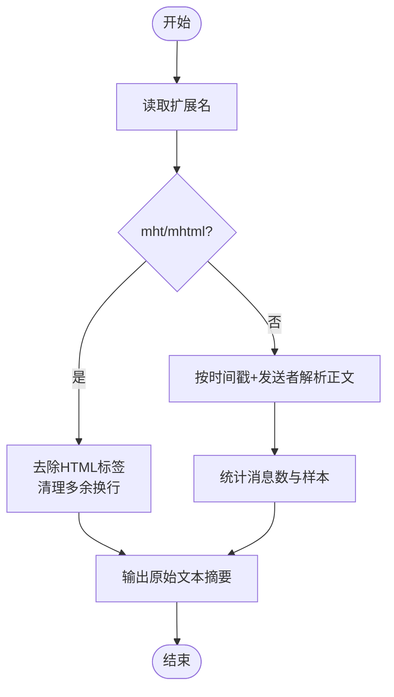
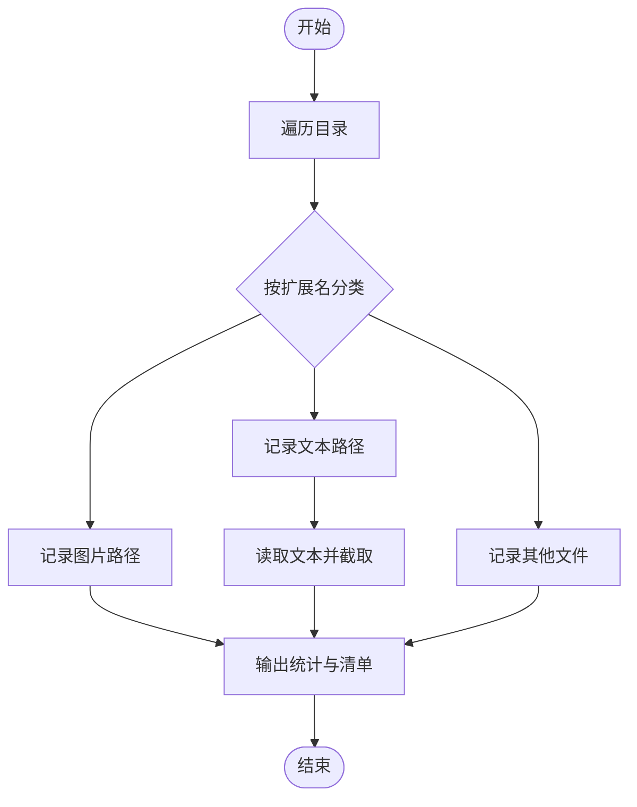
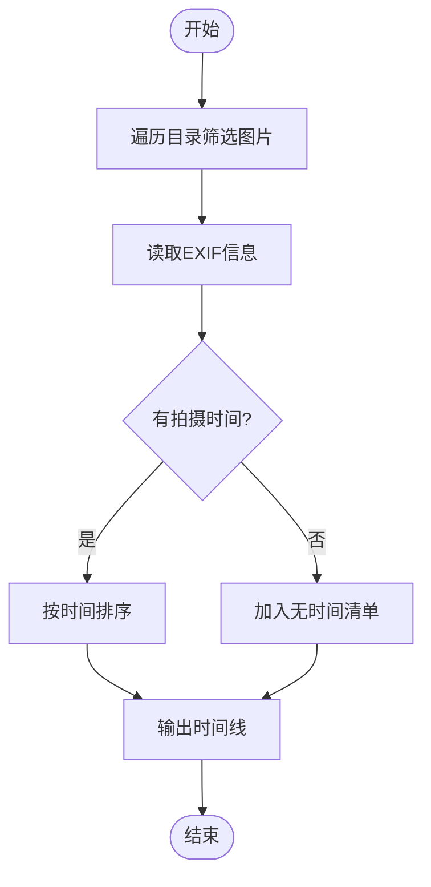
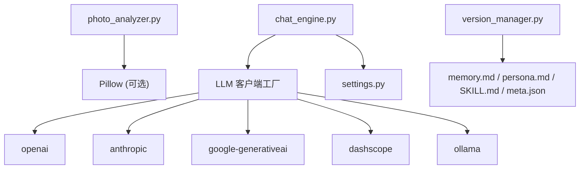

# 数据解析器

<cite>
**本文引用的文件**
- [wechat_parser.py](file://tools/wechat_parser.py)
- [qq_parser.py](file://tools/qq_parser.py)
- [social_parser.py](file://tools/social_parser.py)
- [photo_analyzer.py](file://tools/photo_analyzer.py)
- [README.md](file://README.md)
- [requirements.txt](file://requirements.txt)
- [chat_engine.py](file://tools/chat_engine.py)
- [settings.py](file://tools/config/settings.py)
- [version_manager.py](file://tools/version_manager.py)
- [chat.py](file://chat.py)
- [memory_analyzer.md](file://prompts/memory_analyzer.md)
- [persona_analyzer.md](file://prompts/persona_analyzer.md)
</cite>

## 目录
1. [简介](#简介)
2. [项目结构](#项目结构)
3. [核心组件](#核心组件)
4. [架构总览](#架构总览)
5. [详细组件分析](#详细组件分析)
6. [依赖分析](#依赖分析)
7. [性能考虑](#性能考虑)
8. [故障排查指南](#故障排查指南)
9. [结论](#结论)
10. [附录](#附录)

## 简介
本文件面向“数据解析器”模块，系统化梳理并解释各类数据源的解析实现，包括：
- 微信聊天记录解析（支持 WeChatMsg、PyWxDump、留痕等导出格式）
- QQ 聊天记录解析
- 社交媒体内容解析
- 照片 EXIF 信息分析

文档覆盖数据提取算法、格式适配策略、错误处理机制、数据预处理与清洗规则、质量保证措施，并给出扩展新数据源解析器的方法论与实践建议。

## 项目结构
数据解析器位于 tools 目录下，配合对话引擎与配置系统协同工作，形成“数据采集 → 解析 → 质量控制 → 生成 Skill”的闭环。

图表来源
- [wechat_parser.py:1-251](file://tools/wechat_parser.py#L1-L251)
- [qq_parser.py:1-130](file://tools/qq_parser.py#L1-L130)
- [social_parser.py:1-84](file://tools/social_parser.py#L1-L84)
- [photo_analyzer.py:1-135](file://tools/photo_analyzer.py#L1-L135)
- [chat_engine.py:1-284](file://tools/chat_engine.py#L1-L284)
- [settings.py:1-225](file://tools/config/settings.py#L1-L225)
- [version_manager.py:1-116](file://tools/version_manager.py#L1-L116)
- [chat.py:1-201](file://chat.py#L1-L201)
- [README.md:1-324](file://README.md#L1-L324)
- [requirements.txt:1-12](file://requirements.txt#L1-L12)

章节来源
- [README.md:235-275](file://README.md#L235-L275)

## 核心组件
- 微信聊天记录解析器：自动识别 WeChatMsg、留痕、PyWxDump、纯文本等格式；解析消息、统计语气词/Emoji/标点习惯；输出结构化分析报告。
- QQ 聊天记录解析器：支持 txt 与 mht（HTML）导出；解析消息并提取样本；mht 自动清理 HTML 标签。
- 社交媒体内容解析器：扫描目录，按图片/文本分类；对文本进行截取展示；提示图片需用 Claude Read 工具查看。
- 照片 EXIF 分析器：提取拍摄时间、GPS 位置；按时间排序构建时间线；无 Pillow 时降级为文件清单。

章节来源
- [wechat_parser.py:24-177](file://tools/wechat_parser.py#L24-L177)
- [qq_parser.py:19-90](file://tools/qq_parser.py#L19-L90)
- [social_parser.py:17-79](file://tools/social_parser.py#L17-L79)
- [photo_analyzer.py:25-130](file://tools/photo_analyzer.py#L25-L130)

## 架构总览
数据解析器与对话引擎协作，解析结果作为“关系记忆”和“人物性格”的输入，驱动后续对话生成。

图表来源
- [wechat_parser.py:180-247](file://tools/wechat_parser.py#L180-L247)
- [qq_parser.py:93-126](file://tools/qq_parser.py#L93-L126)
- [social_parser.py:38-79](file://tools/social_parser.py#L38-L79)
- [photo_analyzer.py:79-131](file://tools/photo_analyzer.py#L79-L131)
- [chat_engine.py:60-204](file://tools/chat_engine.py#L60-L204)

## 详细组件分析

### 微信聊天记录解析器
- 自动格式检测：基于扩展名与首段内容判断 WeChatMsg txt、留痕 json、PyWxDump sqlite、WeChatMsg html/csv、纯文本。
- 解析策略：
  - WeChatMsg txt：按“时间戳 + 发送者”行匹配，累积正文，过滤空白行。
  - 留痕 json：兼容多种结构字段，统一映射为 timestamp/sender/content。
  - PyWxDump：当前解析器未实现，建议通过外部工具导出为 csv/html 后再用解析器处理。
  - 纯文本：直接返回原始文本与提示，便于人工分析。
- 分析指标：
  - 目标人物消息数量与占比
  - 语气词 Top N
  - Emoji Top N
  - 消息长度均值与风格（短句连发型/长段落型）
  - 标点习惯统计
- 错误处理：
  - 文件不存在时退出并提示
  - 编码异常采用忽略策略，避免中断
  - 输出结果包含统计与样本，便于快速核验

图表来源
- [wechat_parser.py:24-177](file://tools/wechat_parser.py#L24-L177)

章节来源
- [wechat_parser.py:24-177](file://tools/wechat_parser.py#L24-L177)

### QQ 聊天记录解析器
- 自动格式识别：mht/mhtml → HTML；否则按 txt 解析。
- 解析策略：
  - txt：按“时间戳 + 发送者(+QQ号)？”匹配，累积正文，过滤分隔线。
  - mht：去除 HTML 标签，保留纯文本，限制截取长度。
- 输出：
  - 总消息数、目标消息数、消息样本
  - 或原始文本摘要（mht）

图表来源
- [qq_parser.py:19-90](file://tools/qq_parser.py#L19-L90)

章节来源
- [qq_parser.py:19-90](file://tools/qq_parser.py#L19-L90)

### 社交媒体内容解析器
- 目录扫描：按图片/文本/其他分类，支持 jpg/jpeg/png/gif/webp/bmp 与 txt/md/json/csv。
- 输出：
  - 文件统计
  - 图片清单（提示需用 Read 工具查看）
  - 文本内容截取展示

图表来源
- [social_parser.py:17-79](file://tools/social_parser.py#L17-L79)

章节来源
- [social_parser.py:17-79](file://tools/social_parser.py#L17-L79)

### 照片 EXIF 分析器
- 依赖：Pillow（可选，未安装时仅列出文件）。
- 解析策略：
  - 读取 EXIF：拍摄时间（DateTimeOriginal/DateTime）、GPS 信息（经纬度转换为十进制度）。
  - 目录扫描：支持 jpg/jpeg/png/heic/heif。
  - 输出：
    - 总照片数、有时间/位置信息的数量
    - 按时间排序的时间线（可带 GPS 坐标）
    - 无时间信息的照片清单
    - 未安装 Pillow 的提示

图表来源
- [photo_analyzer.py:25-130](file://tools/photo_analyzer.py#L25-L130)

章节来源
- [photo_analyzer.py:25-130](file://tools/photo_analyzer.py#L25-L130)
- [requirements.txt:1-12](file://requirements.txt#L1-L12)

## 依赖分析
- Pillow：用于照片 EXIF 读取与 GPS 坐标转换。
- LLM 客户端：OpenAI、Anthropic、Google Gemini、DashScope、Ollama，通过工厂模式统一接入。
- 配置系统：集中管理模型配置、默认模型、环境变量与 .env 文件加载。
- 版本管理：对 memory.md/persona.md/SKILL.md/meta.json 进行自动备份与回滚。

图表来源
- [requirements.txt:1-12](file://requirements.txt#L1-L12)
- [chat_engine.py:1-284](file://tools/chat_engine.py#L1-L284)
- [settings.py:1-225](file://tools/config/settings.py#L1-L225)
- [version_manager.py:1-116](file://tools/version_manager.py#L1-L116)

章节来源
- [requirements.txt:1-12](file://requirements.txt#L1-L12)
- [chat_engine.py:60-131](file://tools/chat_engine.py#L60-L131)
- [settings.py:57-190](file://tools/config/settings.py#L57-L190)
- [version_manager.py:16-43](file://tools/version_manager.py#L16-L43)

## 性能考虑
- 正则匹配与逐行读取：微信/QQ 解析器采用正则匹配与逐行累积，适合中小规模文件；大文件建议分块处理或增加缓冲区。
- 编码容错：统一使用忽略策略避免因编码问题中断，提升鲁棒性。
- EXIF 读取：Pillow 读取 EXIF 为 O(n)（n 为图片数量），建议批量处理时注意内存占用。
- 输出文件：解析器将结果写入 Markdown 文本，便于人工审阅与后续合并。

## 故障排查指南
- 文件不存在：解析器在入口处检查文件路径，若不存在则退出并提示。
- 编码异常：读取时采用忽略策略，避免中断；如出现乱码，建议检查导出工具编码设置。
- Pillow 未安装：照片分析器会提示安装 Pillow；安装后可启用 EXIF 读取。
- LLM 客户端缺失：chat.py 会提示安装相应客户端依赖；确保环境变量/API Key 配置正确。
- 版本管理：回滚前会自动备份当前版本，确保可恢复；版本命名包含时间戳，便于定位。

章节来源
- [wechat_parser.py:189-191](file://tools/wechat_parser.py#L189-L191)
- [qq_parser.py:101-103](file://tools/qq_parser.py#L101-L103)
- [photo_analyzer.py:127-128](file://tools/photo_analyzer.py#L127-L128)
- [chat.py:185-196](file://chat.py#L185-L196)
- [version_manager.py:63-73](file://tools/version_manager.py#L63-L73)

## 结论
数据解析器模块通过多格式适配与稳健的错误处理，为“前任.skill”提供了高质量的输入数据。微信/QQ 聊天记录、社交媒体截图与照片 EXIF 信息分别从对话风格、公共人设与时空线索三个维度丰富了人物画像。结合对话引擎与版本管理，系统实现了从数据到对话的闭环，既保证了可扩展性，也兼顾了可维护性。

## 附录

### 数据预处理与清洗规则
- 微信/QQ 解析：
  - 去除空白行与分隔线
  - 统一时间戳格式（解析为字符串以便后续排序）
  - 统一发送者字段（昵称/备注/账号）
- 社交媒体：
  - 图片清单仅列出路径，避免大文件读取
  - 文本截取限制长度，防止内存压力
- 照片：
  - 仅保留 DateTimeOriginal/DateTime 与 GPSInfo
  - GPS 坐标转换为十进制度，便于可视化

章节来源
- [wechat_parser.py:62-85](file://tools/wechat_parser.py#L62-L85)
- [qq_parser.py:39-73](file://tools/qq_parser.py#L39-L73)
- [social_parser.py:68-76](file://tools/social_parser.py#L68-L76)
- [photo_analyzer.py:46-76](file://tools/photo_analyzer.py#L46-L76)

### 质量保证措施
- 自动格式检测与降级策略（纯文本）
- 统计指标与样本输出，便于人工核验
- 版本管理自动备份与回滚
- 对话引擎加载 SKILL.md 或分离的 memory/persona 文件，确保一致性

章节来源
- [wechat_parser.py:180-247](file://tools/wechat_parser.py#L180-L247)
- [chat_engine.py:89-131](file://tools/chat_engine.py#L89-L131)
- [version_manager.py:16-43](file://tools/version_manager.py#L16-L43)

### 如何扩展新的数据源解析器
- 新建解析脚本：参考现有解析器的结构（入口参数、格式检测、解析函数、输出报告）。
- 格式适配：
  - 识别扩展名与头部特征
  - 设计正则或结构化解析
  - 统一输出字段（timestamp/sender/content/raw_text 等）
- 错误处理：
  - 文件存在性检查
  - 编码异常忽略策略
  - 降级输出（如纯文本摘要）
- 集成到对话引擎：
  - 将解析结果写入 memory.md/persona.md 或 SKILL.md
  - 使用版本管理进行增量合并与回滚
- 示例路径参考：
  - 微信解析器：[wechat_parser.py:180-247](file://tools/wechat_parser.py#L180-L247)
  - QQ 解析器：[qq_parser.py:93-126](file://tools/qq_parser.py#L93-L126)
  - 社交媒体解析器：[social_parser.py:38-79](file://tools/social_parser.py#L38-L79)
  - 照片 EXIF 分析器：[photo_analyzer.py:79-131](file://tools/photo_analyzer.py#L79-L131)

章节来源
- [wechat_parser.py:180-247](file://tools/wechat_parser.py#L180-L247)
- [qq_parser.py:93-126](file://tools/qq_parser.py#L93-L126)
- [social_parser.py:38-79](file://tools/social_parser.py#L38-L79)
- [photo_analyzer.py:79-131](file://tools/photo_analyzer.py#L79-L131)
- [chat_engine.py:89-131](file://tools/chat_engine.py#L89-L131)
- [version_manager.py:16-43](file://tools/version_manager.py#L16-L43)