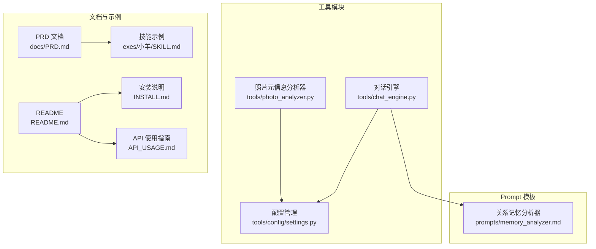
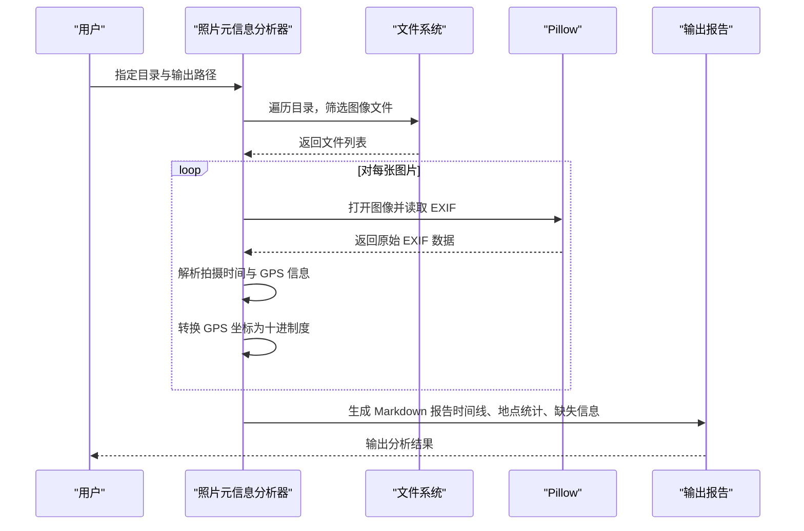
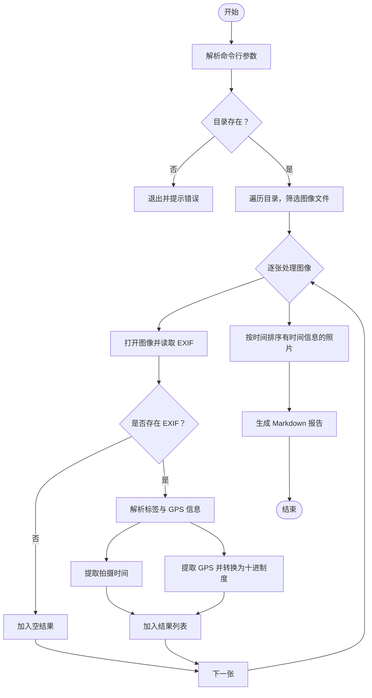
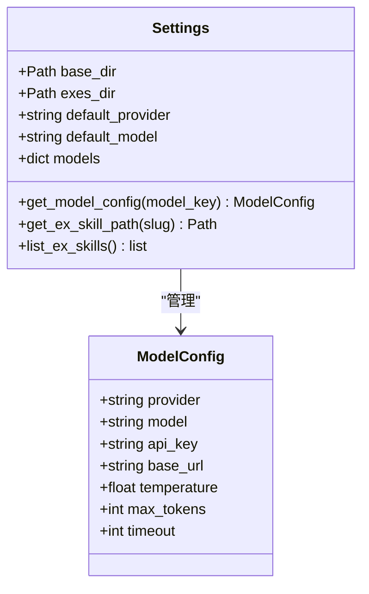
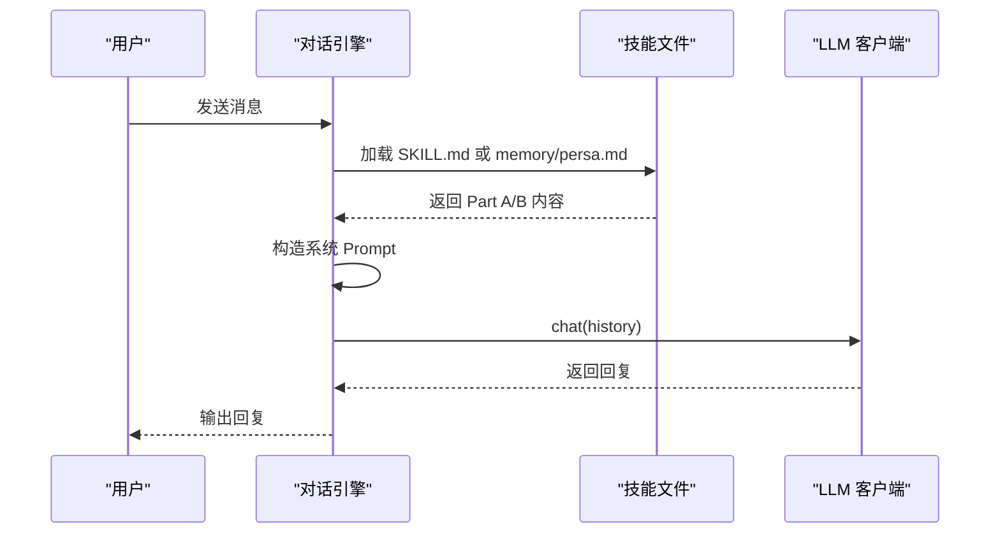
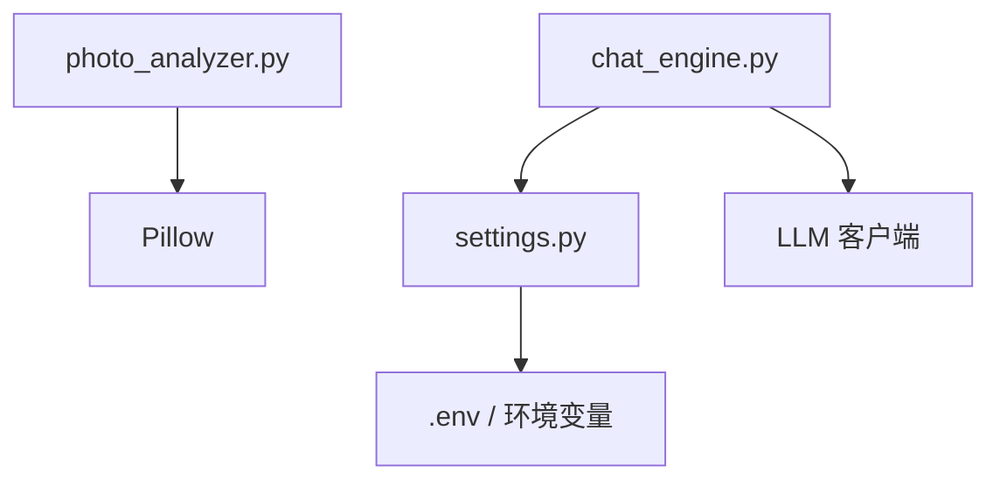

# 照片元信息分析器

<cite>
**本文引用的文件**
- [photo_analyzer.py](file://tools/photo_analyzer.py)
- [settings.py](file://tools/config/settings.py)
- [README.md](file://README.md)
- [INSTALL.md](file://INSTALL.md)
- [API_USAGE.md](file://API_USAGE.md)
- [requirements.txt](file://requirements.txt)
- [chat_engine.py](file://tools/chat_engine.py)
- [memory_analyzer.md](file://prompts/memory_analyzer.md)
- [PRD.md](file://docs/PRD.md)
- [SKILL.md](file://exes/小羊/SKILL.md)
</cite>

## 目录
1. [简介](#简介)
2. [项目结构](#项目结构)
3. [核心组件](#核心组件)
4. [架构概览](#架构概览)
5. [详细组件分析](#详细组件分析)
6. [依赖分析](#依赖分析)
7. [性能考虑](#性能考虑)
8. [故障排查指南](#故障排查指南)
9. [结论](#结论)
10. [附录](#附录)

## 简介
本技术文档围绕“照片元信息分析器”展开，聚焦于从照片中提取与分析 EXIF 元数据的能力，包括拍摄时间、地理位置、设备信息与镜头参数等。文档将说明不同照片格式（JPEG、PNG、HEIC/HEIF 等）的元数据支持现状，GPS 坐标转换与地理位置反向解析的实现思路，以及如何基于分析结果进行可视化展示（时间分布统计、地点热力图、设备使用分析等）。同时，文档涵盖隐私保护与敏感信息过滤机制、批量处理策略与性能优化建议。

## 项目结构
该项目采用模块化设计，照片元信息分析器作为工具模块之一，与其他模块协同工作，形成“数据采集—解析—生成—对话”的完整链路。核心模块包括：
- 照片元信息分析器：负责扫描目录、提取 EXIF、生成报告
- 配置管理：集中管理模型与 API 密钥
- 对话引擎：基于解析结果与 Prompt 进行对话
- Prompt 模板：指导记忆与性格提取
- 文档与示例：技能文件结构与使用说明

图表来源
- [photo_analyzer.py:1-135](file://tools/photo_analyzer.py#L1-L135)
- [settings.py:1-225](file://tools/config/settings.py#L1-L225)
- [chat_engine.py:1-284](file://tools/chat_engine.py#L1-L284)
- [memory_analyzer.md:1-95](file://prompts/memory_analyzer.md#L1-L95)
- [PRD.md:1-123](file://docs/PRD.md#L1-L123)
- [SKILL.md:1-90](file://exes/小羊/SKILL.md#L1-L90)
- [README.md:1-370](file://README.md#L1-L370)
- [INSTALL.md:1-97](file://INSTALL.md#L1-L97)
- [API_USAGE.md:1-194](file://API_USAGE.md#L1-L194)

章节来源
- [README.md:281-321](file://README.md#L281-L321)
- [PRD.md:93-110](file://docs/PRD.md#L93-L110)

## 核心组件
- 照片元信息分析器：扫描指定目录，识别支持的图像格式，提取 EXIF 信息（拍摄时间、GPS 坐标），并生成 Markdown 报告，包含时间线、地点统计与缺失信息提示。
- 配置管理：集中管理模型配置与 API 密钥，支持环境变量与 .env 文件注入，提供模型查询与路径解析能力。
- 对话引擎：加载技能文件（SKILL.md 或 memory/persa.md），构造系统 Prompt，调用 LLM 客户端进行对话，支持流式输出与历史管理。
- Prompt 模板：定义关系记忆提取维度，指导从聊天记录中抽取时间线、日常模式、共同经历、争吵与甜蜜时刻等关键信息。
- 文档与示例：PRD 描述技能文件结构与数据源支持矩阵；示例技能文件展示 Part A（关系记忆）与 Part B（人物性格）的组织方式。

章节来源
- [photo_analyzer.py:25-135](file://tools/photo_analyzer.py#L25-L135)
- [settings.py:38-225](file://tools/config/settings.py#L38-L225)
- [chat_engine.py:60-284](file://tools/chat_engine.py#L60-L284)
- [memory_analyzer.md:1-95](file://prompts/memory_analyzer.md#L1-L95)
- [PRD.md:93-110](file://docs/PRD.md#L93-L110)
- [SKILL.md:15-90](file://exes/小羊/SKILL.md#L15-L90)

## 架构概览
照片元信息分析器在整体系统中的作用是“数据采集与预处理”。它通过扫描照片目录，提取 EXIF 元数据，生成结构化报告，供后续模块（如对话引擎与 Prompt 模板）使用。下图展示了照片分析在系统中的位置与交互关系。

图表来源
- [photo_analyzer.py:79-135](file://tools/photo_analyzer.py#L79-L135)
- [photo_analyzer.py:25-77](file://tools/photo_analyzer.py#L25-L77)

## 详细组件分析

### 照片元信息分析器（photo_analyzer.py）
- 功能职责
  - 扫描指定目录，识别支持的图像格式（JPEG、PNG、HEIC/HEIF），提取 EXIF 信息。
  - 解析拍摄时间（优先 DateTimeOriginal，其次 DateTime）。
  - 解析 GPS 信息，转换为十进制度坐标，并标注南北半球与东西经度方向。
  - 生成 Markdown 报告，包含时间线、地点统计与缺失信息提示。
- 关键流程
  - 命令行参数解析：接收目录与输出路径。
  - 目录遍历：递归扫描，筛选扩展名为 .jpg/.jpeg/.png/.heic/.heif 的文件。
  - EXIF 提取：使用 Pillow 的 EXIF 接口读取原始数据，映射标签名称。
  - 时间线构建：过滤有拍摄时间的照片并按时间排序，输出带时间线的 Markdown。
  - 地点统计：统计含 GPS 信息的照片数量，输出坐标信息。
  - 错误处理：捕获异常并返回错误信息；当 Pillow 未安装时提示安装方法。
- 数据结构与复杂度
  - 时间复杂度：O(N) 扫描 + O(M log M) 排序（N 为文件数，M 为有时间信息的照片数）。
  - 空间复杂度：O(N) 存储结果列表。
- 依赖与外部库
  - Pillow：用于读取 EXIF 与 GPS 标签。
  - Pillow.ExifTags：提供标签映射与 GPS 标签映射。
- 可视化与报告
  - 生成 Markdown 报告，包含时间线、地点统计与缺失信息提示，便于后续分析与展示。

图表来源
- [photo_analyzer.py:79-135](file://tools/photo_analyzer.py#L79-L135)
- [photo_analyzer.py:25-77](file://tools/photo_analyzer.py#L25-L77)

章节来源
- [photo_analyzer.py:25-135](file://tools/photo_analyzer.py#L25-L135)

### 配置管理（settings.py）
- 功能职责
  - 提供统一的配置接口，支持从环境变量与 .env 文件加载 API 密钥与模型配置。
  - 支持多种 LLM 提供商（OpenAI、Anthropic、Google Gemini、DashScope、Ollama）。
  - 提供模型查询与路径解析能力，便于对话引擎加载技能文件。
- 关键流程
  - 初始化默认模型配置，支持本地 Ollama 模型自动发现。
  - 从 .env 文件加载配置并覆盖默认值。
  - 提供模型配置查询与技能目录解析。
- 数据结构
  - ModelConfig：封装提供商、模型名、API Key、基础 URL、温度、最大 Token、超时等。
  - Settings：封装基础路径、默认提供商与模型字典，提供查询与列表能力。

图表来源
- [settings.py:12-225](file://tools/config/settings.py#L12-L225)

章节来源
- [settings.py:38-225](file://tools/config/settings.py#L38-L225)

### 对话引擎（chat_engine.py）
- 功能职责
  - 加载技能文件（SKILL.md 或 memory/persa.md），构造系统 Prompt。
  - 调用 LLM 客户端进行对话，支持流式输出与历史管理。
  - 提供模型信息查询与技能信息查询能力。
- 关键流程
  - 初始化：加载技能数据、创建 LLM 客户端、初始化系统消息。
  - 对话：添加用户消息，调用 LLM，保存助手回复。
  - 流式对话：逐段输出，拼接完整回复并保存。
  - 历史管理：清空历史并可选择保留系统消息。
- 与照片分析的关系
  - 照片分析结果可用于填充 Part A（关系记忆）中的“时间线”“常去地点”等维度，提升对话的真实性与个性化。

图表来源
- [chat_engine.py:60-284](file://tools/chat_engine.py#L60-L284)

章节来源
- [chat_engine.py:60-284](file://tools/chat_engine.py#L60-L284)

### Prompt 模板（memory_analyzer.md）
- 功能职责
  - 定义关系记忆提取维度，指导从聊天记录中抽取时间线、日常模式、共同经历、争吵与甜蜜时刻等关键信息。
  - 提供输出格式模板，便于生成结构化的 Part A 内容。
- 关键维度
  - 关系时间线：认识时间、确定关系时间、关键节点、分手时间与原因。
  - 日常模式：联系频率与时间段、谁更主动、约会偏好与日常话题。
  - 共同经历：去过的地方、一起做过的事、旅行记忆、内部梗。
  - 饮食偏好：TA 的饮食画像与约会吃饭模式。
  - 兴趣爱好：TA 的音乐/电影/书籍/游戏与日常爱好。
  - 争吵模式：常见原因、典型反应、和好方式、冷战时长与经典台词。
  - 甜蜜瞬间：心动时刻、表达爱意方式、日常小甜蜜与特别纪念日。
  - 分手相关：分手原因、最后一次对话、分手后状态与未说出口的话。

章节来源
- [memory_analyzer.md:1-95](file://prompts/memory_analyzer.md#L1-L95)

### 技能文件结构（SKILL.md 示例）
- 功能职责
  - 展示 Part A（关系记忆）与 Part B（人物性格）的组织方式，以及运行规则与硬规则。
- 关键结构
  - Part A：基本信息、共同经历、时间线、常去地点、甜蜜瞬间、争吵模式、内部梗等。
  - Part B：Layer 0 硬规则、身份、说话风格、情感模式、关系行为。
  - 运行规则：强调用 TA 的方式说话，保持真实棱角。

章节来源
- [SKILL.md:15-90](file://exes/小羊/SKILL.md#L15-L90)

## 依赖分析
- Pillow（Pillow>=9.0.0）
  - 用途：读取图像 EXIF 与 GPS 标签，进行坐标转换。
  - 依赖关系：photo_analyzer.py 直接依赖 Pillow 的 EXIF 接口与标签映射。
- LLM 客户端（可选）
  - 用途：对话引擎调用不同提供商的 API（OpenAI、Anthropic、Google Gemini、DashScope、Ollama）。
  - 依赖关系：chat_engine.py 通过工厂模式创建客户端，settings.py 提供配置。
- 其他可选依赖
  - chardet、python-dateutil：用于文件编码检测与日期解析（可选增强）。

图表来源
- [requirements.txt:1-12](file://requirements.txt#L1-L12)
- [photo_analyzer.py:17-22](file://tools/photo_analyzer.py#L17-L22)
- [settings.py:148-161](file://tools/config/settings.py#L148-L161)

章节来源
- [requirements.txt:1-12](file://requirements.txt#L1-12)
- [INSTALL.md:28-38](file://INSTALL.md#L28-L38)

## 性能考虑
- 扫描与解析
  - 使用递归遍历目录，筛选扩展名，避免不必要的 IO。
  - 对每张图片只进行一次打开与 EXIF 读取，减少重复操作。
- 排序与输出
  - 仅对有拍摄时间的照片进行排序，降低排序规模。
  - 生成 Markdown 报告时一次性写入，避免频繁 I/O。
- 批量处理
  - 建议分批处理大目录，控制内存占用。
  - 对于大量 HEIC/HEIF 文件，建议先转换为 JPEG/PNG 再处理，提高兼容性与速度。
- 依赖安装
  - Pillow 为可选依赖，若仅需文本分析可跳过安装，减少部署成本。

章节来源
- [photo_analyzer.py:90-131](file://tools/photo_analyzer.py#L90-L131)
- [INSTALL.md:37-37](file://INSTALL.md#L37-L37)

## 故障排查指南
- Pillow 未安装
  - 现象：报告提示 Pillow 未安装，仅列出文件。
  - 处理：安装 Pillow 依赖，重新运行分析器。
- 目录不存在
  - 现象：命令行提示目录不存在并退出。
  - 处理：确认路径正确，确保目录存在且可读。
- EXIF 为空
  - 现象：某些照片无 EXIF 信息，导致时间线与地点统计为空。
  - 处理：检查照片是否包含 EXIF；部分编辑软件会移除 EXIF。
- GPS 坐标异常
  - 现象：GPS 坐标转换后数值异常。
  - 处理：确认 GPS 标签存在且格式正确；检查经纬度方向标签（GPSLatitudeRef/GPSLongitudeRef）。
- API 密钥问题
  - 现象：对话引擎调用 LLM 失败。
  - 处理：检查环境变量或 .env 文件中的 API Key 是否正确设置；确认网络连通性。

章节来源
- [photo_analyzer.py:27-28](file://tools/photo_analyzer.py#L27-L28)
- [photo_analyzer.py:86-88](file://tools/photo_analyzer.py#L86-L88)
- [photo_analyzer.py:69-70](file://tools/photo_analyzer.py#L69-L70)
- [API_USAGE.md:140-162](file://API_USAGE.md#L140-L162)

## 结论
照片元信息分析器提供了从照片中提取 EXIF 元数据的核心能力，包括拍摄时间与 GPS 坐标解析，并生成结构化报告。结合配置管理与对话引擎，可将分析结果融入“关系记忆”与“人物性格”的构建过程，提升对话的真实感与个性化。通过合理的批量处理与性能优化策略，可在保证准确性的前提下高效处理大规模照片集合。同时，项目提供了完善的隐私保护边界与安全规则，确保数据仅本地存储与使用。

## 附录

### 不同照片格式的元数据支持情况
- JPEG/JPEG2000：广泛支持 EXIF，包含拍摄时间、GPS、设备信息与镜头参数。
- PNG：部分支持 EXIF，通常包含基本元数据，GPS 信息较少见。
- HEIC/HEIF：Apple 设备常用格式，部分系统与 Pillow 对其支持有限，建议转换后再处理。
- RAW：相机原图格式，EXIF 信息丰富，但解析需要专用库，不在当前分析器范围内。

章节来源
- [README.md:242-248](file://README.md#L242-L248)
- [PRD.md:83-91](file://docs/PRD.md#L83-L91)

### GPS 坐标转换与地理位置反向解析
- 坐标转换
  - 将度分秒格式转换为十进制度，依据 GPSLatitude/GPSLongitude 与 GPSLatitudeRef/GPSLongitudeRef 判断正负方向。
- 地理位置反向解析
  - 当前分析器未内置地理反向解析功能，建议在外部工具中使用转换后的坐标进行地址解析（例如使用地图 API），并将结果回填至报告或技能文件。

章节来源
- [photo_analyzer.py:73-77](file://tools/photo_analyzer.py#L73-L77)

### 可视化展示建议
- 时间分布统计
  - 基于拍摄时间生成时间线与月度/年度分布图表，辅助回顾与整理。
- 地点热力图
  - 使用转换后的坐标生成热力图，标注常去地点与旅行轨迹。
- 设备使用分析
  - 基于 EXIF 中的设备信息（制造商、型号）统计设备使用趋势与偏好。

章节来源
- [photo_analyzer.py:100-126](file://tools/photo_analyzer.py#L100-L126)

### 隐私保护与敏感信息过滤
- 数据本地化
  - 所有数据存储在本地文件系统，不上传至云端。
- 安全边界
  - 项目明确仅用于个人回忆与情感疗愈，不鼓励不健康执念。
- 敏感信息过滤
  - 建议在分析前对照片进行敏感信息过滤（如人脸、车牌号等），并在生成报告时去除或模糊化相关内容。

章节来源
- [README.md:19-19](file://README.md#L19-L19)
- [PRD.md:75-82](file://docs/PRD.md#L75-L82)