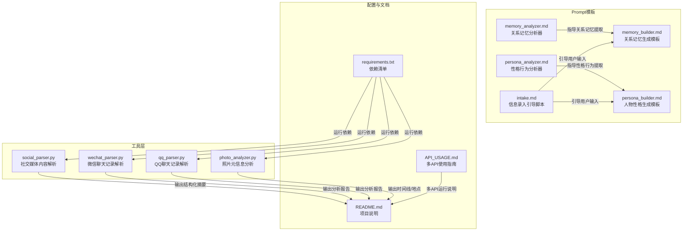
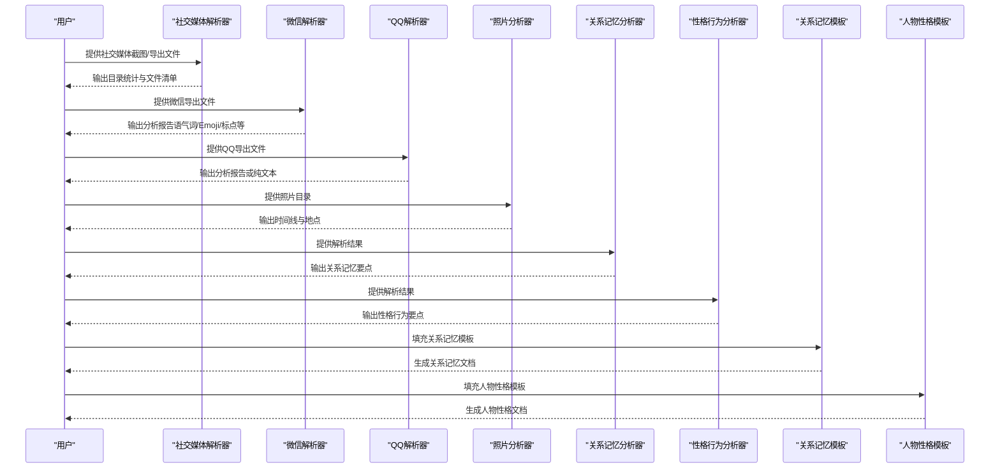
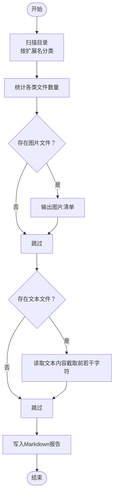
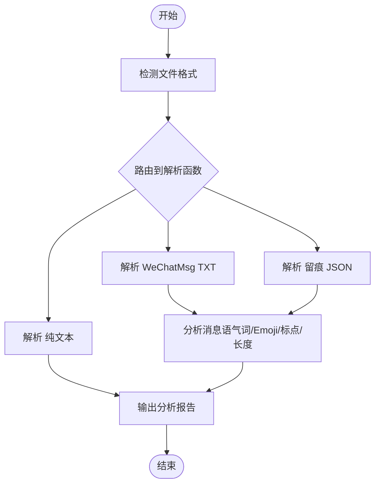
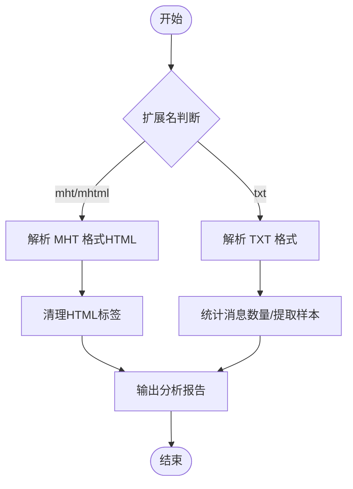
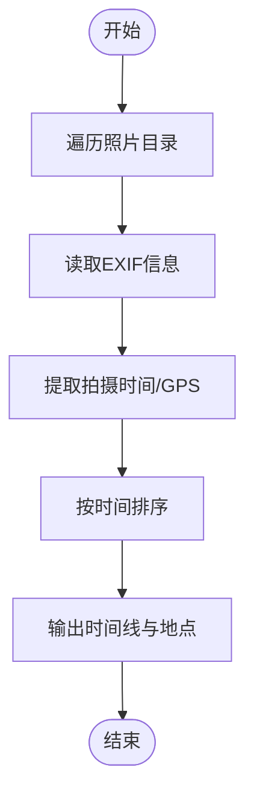
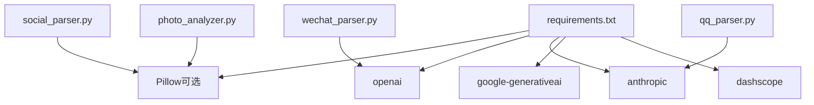

# 社交媒体内容解析器

<cite>
**本文引用的文件**
- [social_parser.py](file://tools/social_parser.py)
- [wechat_parser.py](file://tools/wechat_parser.py)
- [qq_parser.py](file://tools/qq_parser.py)
- [photo_analyzer.py](file://tools/photo_analyzer.py)
- [README.md](file://README.md)
- [requirements.txt](file://requirements.txt)
- [API_USAGE.md](file://API_USAGE.md)
- [memory_analyzer.md](file://prompts/memory_analyzer.md)
- [persona_analyzer.md](file://prompts/persona_analyzer.md)
- [memory_builder.md](file://prompts/memory_builder.md)
- [persona_builder.md](file://prompts/persona_builder.md)
- [intake.md](file://prompts/intake.md)
</cite>

## 目录
1. [简介](#简介)
2. [项目结构](#项目结构)
3. [核心组件](#核心组件)
4. [架构总览](#架构总览)
5. [详细组件分析](#详细组件分析)
6. [依赖关系分析](#依赖关系分析)
7. [性能考虑](#性能考虑)
8. [故障排查指南](#故障排查指南)
9. [结论](#结论)
10. [附录](#附录)

## 简介
本项目旨在将社交媒体内容（如朋友圈、微博截图、小红书等平台的公开内容）转化为可用于训练“前任AI Skill”的结构化数据。工具链支持：
- 目录扫描与文件分类（图片/文本/其他）
- 微信/QQ聊天记录解析与分析
- 照片EXIF元信息提取与时间线构建
- 社交媒体截图内容的结构化输出（通过外部工具读取图片后，本工具负责列出与汇总）

项目同时提供Prompt模板与生成流程，将解析得到的素材转化为“关系记忆”和“人物性格”两大模块，形成可对话的AI Skill。

## 项目结构
项目采用“工具 + Prompt模板 + 配置”的组织方式，核心工具位于tools目录，Prompt模板位于prompts目录，README与API使用指南提供整体使用说明。

图表来源
- [social_parser.py:1-84](file://tools/social_parser.py#L1-L84)
- [wechat_parser.py:1-251](file://tools/wechat_parser.py#L1-L251)
- [qq_parser.py:1-130](file://tools/qq_parser.py#L1-L130)
- [photo_analyzer.py:1-135](file://tools/photo_analyzer.py#L1-L135)
- [requirements.txt:1-12](file://requirements.txt#L1-L12)
- [README.md:281-321](file://README.md#L281-L321)
- [API_USAGE.md:164-182](file://API_USAGE.md#L164-L182)

章节来源
- [README.md:281-321](file://README.md#L281-L321)

## 核心组件
- 社交媒体内容解析器：扫描目录，按类型分类文件，输出统计与文件清单；图片需配合外部工具读取。
- 微信聊天记录解析器：自动识别多种导出格式，解析消息并进行高频语气词、Emoji、标点习惯等分析。
- QQ聊天记录解析器：支持txt与mht格式，提取消息样本或清理后的纯文本。
- 照片元信息分析器：提取EXIF拍摄时间与GPS坐标，按时间排序并输出地点信息。
- Prompt模板：指导如何从解析结果中抽取关系记忆与人物性格，形成可对话的Skill结构。

章节来源
- [social_parser.py:17-35](file://tools/social_parser.py#L17-L35)
- [wechat_parser.py:24-46](file://tools/wechat_parser.py#L24-L46)
- [qq_parser.py:19-91](file://tools/qq_parser.py#L19-L91)
- [photo_analyzer.py:25-77](file://tools/photo_analyzer.py#L25-L77)
- [memory_analyzer.md:1-95](file://prompts/memory_analyzer.md#L1-L95)
- [persona_analyzer.md:1-92](file://prompts/persona_analyzer.md#L1-L92)
- [memory_builder.md:1-122](file://prompts/memory_builder.md#L1-L122)
- [persona_builder.md:1-129](file://prompts/persona_builder.md#L1-L129)

## 架构总览
系统以“数据解析 + Prompt驱动 + 输出模板”的方式工作：
- 数据解析：工具层负责从不同来源抽取结构化信息
- Prompt驱动：通过分析器模板指导从原始素材中提取关系记忆与性格特征
- 输出模板：将提取结果填充到关系记忆与人物性格的结构化模板中

图表来源
- [social_parser.py:38-80](file://tools/social_parser.py#L38-L80)
- [wechat_parser.py:180-247](file://tools/wechat_parser.py#L180-L247)
- [qq_parser.py:93-126](file://tools/qq_parser.py#L93-L126)
- [photo_analyzer.py:79-131](file://tools/photo_analyzer.py#L79-L131)
- [memory_analyzer.md:1-95](file://prompts/memory_analyzer.md#L1-L95)
- [persona_analyzer.md:1-92](file://prompts/persona_analyzer.md#L1-L92)
- [memory_builder.md:1-122](file://prompts/memory_builder.md#L1-L122)
- [persona_builder.md:1-129](file://prompts/persona_builder.md#L1-L129)

## 详细组件分析

### 社交媒体内容解析器（social_parser.py）
- 功能概述
  - 扫描指定目录，按扩展名分类图片、文本与其它文件
  - 输出Markdown统计报告，包含文件数量、图片清单与文本内容预览
  - 提示图片需配合外部工具读取（例如Claude Read）
- 关键流程
  - 目录遍历与分类
  - 文件读取与内容截取（限制长度避免过大输出）
  - 结果写入与提示信息

图表来源
- [social_parser.py:17-35](file://tools/social_parser.py#L17-L35)
- [social_parser.py:38-80](file://tools/social_parser.py#L38-L80)

章节来源
- [social_parser.py:17-35](file://tools/social_parser.py#L17-L35)
- [social_parser.py:38-80](file://tools/social_parser.py#L38-L80)

### 微信聊天记录解析器（wechat_parser.py）
- 功能概述
  - 自动检测文件格式（留痕JSON、WeChatMsg TXT、HTML、SQLite、纯文本）
  - 解析消息列表，提取目标人物的消息并进行统计分析
  - 分析高频语气词、Emoji、消息长度、标点习惯等
- 关键流程
  - 格式检测与路由
  - 消息解析与清洗
  - 统计分析与报告输出

图表来源
- [wechat_parser.py:24-46](file://tools/wechat_parser.py#L24-L46)
- [wechat_parser.py:48-86](file://tools/wechat_parser.py#L48-L86)
- [wechat_parser.py:88-105](file://tools/wechat_parser.py#L88-L105)
- [wechat_parser.py:107-121](file://tools/wechat_parser.py#L107-L121)
- [wechat_parser.py:123-178](file://tools/wechat_parser.py#L123-L178)
- [wechat_parser.py:180-247](file://tools/wechat_parser.py#L180-L247)

章节来源
- [wechat_parser.py:24-46](file://tools/wechat_parser.py#L24-L46)
- [wechat_parser.py:48-86](file://tools/wechat_parser.py#L48-L86)
- [wechat_parser.py:88-105](file://tools/wechat_parser.py#L88-L105)
- [wechat_parser.py:107-121](file://tools/wechat_parser.py#L107-L121)
- [wechat_parser.py:123-178](file://tools/wechat_parser.py#L123-L178)
- [wechat_parser.py:180-247](file://tools/wechat_parser.py#L180-L247)

### QQ聊天记录解析器（qq_parser.py）
- 功能概述
  - 支持QQ消息管理器导出的txt与mht格式
  - 解析消息并统计消息数量、提取样本或清理HTML后的纯文本
- 关键流程
  - 格式判断与解析
  - 文本清理与输出

图表来源
- [qq_parser.py:19-74](file://tools/qq_parser.py#L19-L74)
- [qq_parser.py:76-91](file://tools/qq_parser.py#L76-L91)
- [qq_parser.py:93-126](file://tools/qq_parser.py#L93-L126)

章节来源
- [qq_parser.py:19-74](file://tools/qq_parser.py#L19-L74)
- [qq_parser.py:76-91](file://tools/qq_parser.py#L76-L91)
- [qq_parser.py:93-126](file://tools/qq_parser.py#L93-L126)

### 照片元信息分析器（photo_analyzer.py）
- 功能概述
  - 提取照片EXIF信息（拍摄时间、GPS坐标）
  - 按时间排序输出时间线，标注带GPS的地点
  - 未安装Pillow时提示安装依赖
- 关键流程
  - 遍历照片目录
  - 读取EXIF并转换GPS坐标
  - 排序与输出

图表来源
- [photo_analyzer.py:25-77](file://tools/photo_analyzer.py#L25-L77)
- [photo_analyzer.py:79-131](file://tools/photo_analyzer.py#L79-L131)

章节来源
- [photo_analyzer.py:25-77](file://tools/photo_analyzer.py#L25-L77)
- [photo_analyzer.py:79-131](file://tools/photo_analyzer.py#L79-L131)

### Prompt模板与生成流程
- 关系记忆分析器（memory_analyzer.md）
  - 提取维度：关系时间线、日常模式、共同经历、饮食偏好、兴趣爱好、争吵模式、甜蜜瞬间、分手相关
  - 输出格式：Markdown结构化要点
- 性格行为分析器（persona_analyzer.md）
  - 提取维度：说话风格、情感表达模式、依恋类型、决策模式、人际行为
  - 标签翻译：将用户输入的标签映射为具体行为规则
- 关系记忆生成模板（memory_builder.md）
  - 模板字段：关系概览、时间线、共同记忆、日常模式、争吵档案、甜蜜档案、分手档案、Correction记录
- 人物性格生成模板（persona_builder.md）
  - 五层结构：硬规则、身份锚定、说话风格、情感模式、关系行为

章节来源
- [memory_analyzer.md:1-95](file://prompts/memory_analyzer.md#L1-L95)
- [persona_analyzer.md:1-92](file://prompts/persona_analyzer.md#L1-L92)
- [memory_builder.md:1-122](file://prompts/memory_builder.md#L1-L122)
- [persona_builder.md:1-129](file://prompts/persona_builder.md#L1-L129)

## 依赖关系分析
- 运行依赖
  - Pillow：照片EXIF读取（可选，若未安装则仅列出文件）
  - LLM客户端：OpenAI、Anthropic、Google Gemini、DashScope（通义千问）、Ollama（本地模型）
- 工具间耦合
  - 工具均为独立脚本，彼此无直接依赖
  - 通过解析结果与Prompt模板间接协作

图表来源
- [requirements.txt:1-12](file://requirements.txt#L1-L12)
- [social_parser.py:1-84](file://tools/social_parser.py#L1-L84)
- [wechat_parser.py:1-251](file://tools/wechat_parser.py#L1-L251)
- [qq_parser.py:1-130](file://tools/qq_parser.py#L1-L130)
- [photo_analyzer.py:1-135](file://tools/photo_analyzer.py#L1-L135)

章节来源
- [requirements.txt:1-12](file://requirements.txt#L1-L12)

## 性能考虑
- 文件读取与截取
  - 文本读取限制长度，避免大文件导致内存压力
- 正则匹配
  - 解析消息时使用正则，注意复杂度与回溯风险；建议在格式确定的情况下保持简单匹配
- EXIF处理
  - 仅在安装Pillow时启用，避免不必要的依赖
- 输出格式
  - Markdown输出便于后续模板填充与版本管理

## 故障排查指南
- 依赖缺失
  - Pillow未安装：照片分析器仅列出文件，需安装Pillow以启用EXIF读取
  - LLM客户端未安装：根据所选模型安装对应依赖
- 文件格式识别
  - 微信解析器自动检测格式，若识别错误可手动指定格式
  - QQ解析器支持txt与mht格式，确保扩展名正确
- 输出路径
  - 确保输出目录存在或可创建
- 多API使用
  - 按API_USAGE.md配置环境变量或.env文件，确保API Key有效

章节来源
- [photo_analyzer.py:27-28](file://tools/photo_analyzer.py#L27-L28)
- [API_USAGE.md:140-163](file://API_USAGE.md#L140-L163)
- [wechat_parser.py:194-196](file://tools/wechat_parser.py#L194-L196)
- [qq_parser.py:105-109](file://tools/qq_parser.py#L105-L109)

## 结论
本项目提供了从社交媒体与聊天记录中抽取结构化信息的工具链，并结合Prompt模板将素材转化为可对话的AI Skill。工具设计简洁、模块化，易于扩展与维护。通过统一的输出格式与模板填充，能够实现跨平台数据的标准化与一致性。

## 附录
- 使用建议
  - 优先提供高质量的聊天记录导出文件，以提升还原度
  - 社交媒体截图需配合外部工具读取后再由本工具汇总
  - 照片建议包含EXIF信息以便提取时间线与地点
- 扩展方向
  - 可增加对微博、豆瓣、小红书等平台的直接解析（当前工具侧重截图与导出文件）
  - 可集成情感分析、关键词提取等高级功能（当前工具聚焦基础解析与统计）