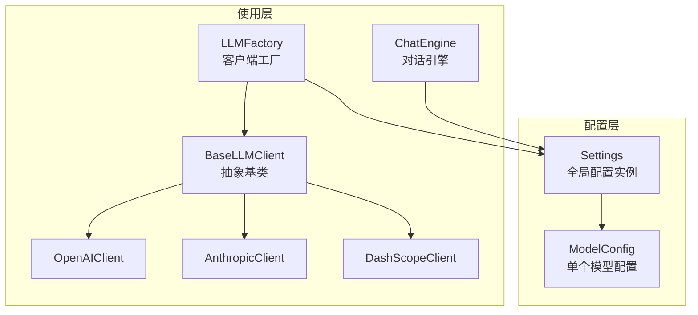
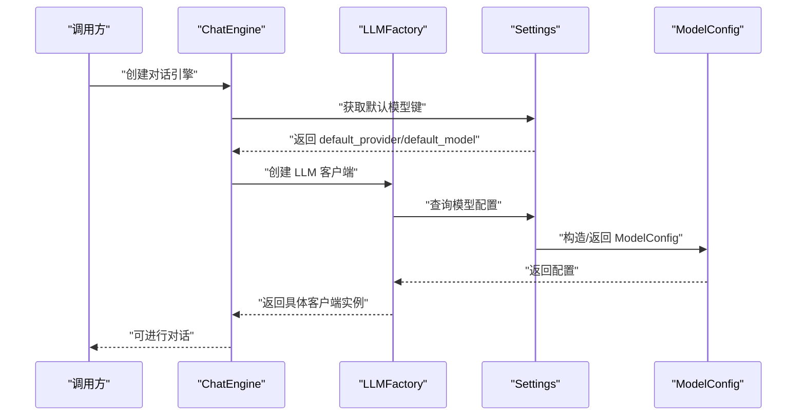
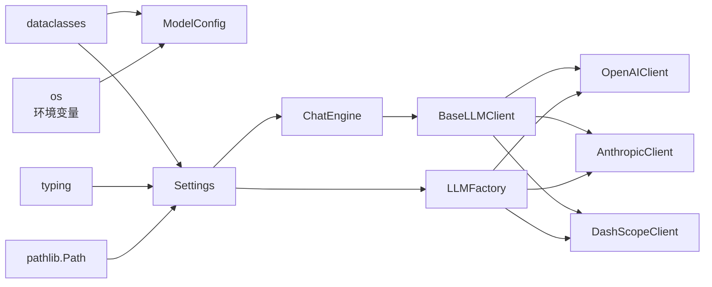

# 配置管理

<cite>
**本文引用的文件**
- [tools/config/settings.py](file://tools/config/settings.py)
- [tools/config/__init__.py](file://tools/config/__init__.py)
- [tools/chat_engine.py](file://tools/chat_engine.py)
- [tools/llm/factory.py](file://tools/llm/factory.py)
- [tools/llm/base.py](file://tools/llm/base.py)
- [tools/llm/openai_client.py](file://tools/llm/openai_client.py)
- [tools/llm/anthropic_client.py](file://tools/llm/anthropic_client.py)
- [tools/llm/dashscope_client.py](file://tools/llm/dashscope_client.py)
- [chat.py](file://chat.py)
- [README.md](file://README.md)
- [requirements.txt](file://requirements.txt)
</cite>

## 目录
1. [简介](#简介)
2. [项目结构](#项目结构)
3. [核心组件](#核心组件)
4. [架构总览](#架构总览)
5. [详细组件分析](#详细组件分析)
6. [依赖分析](#依赖分析)
7. [性能考虑](#性能考虑)
8. [故障排除指南](#故障排除指南)
9. [结论](#结论)
10. [附录](#附录)

## 简介
本文件面向“配置管理系统”的技术文档，聚焦 tools/config/settings.py 中的配置架构与管理策略，涵盖环境变量配置、模型配置管理、API 密钥管理、运行时配置、加载顺序与优先级、默认值处理、多环境支持与敏感信息保护、配置验证、热重载与配置迁移的实现思路、最佳实践与安全建议，以及完整的配置参考与示例。

## 项目结构
配置管理位于 tools/config/settings.py，围绕 Settings 与 ModelConfig 两个核心数据类构建；对外通过 get_settings() 提供全局单例访问。上层模块（如对话引擎与 LLM 工厂）通过 get_settings() 获取配置，从而实现统一的模型与密钥管理。

图表来源
- [tools/config/settings.py:38-225](file://tools/config/settings.py#L38-L225)
- [tools/chat_engine.py:60-83](file://tools/chat_engine.py#L60-L83)
- [tools/llm/factory.py:14-82](file://tools/llm/factory.py#L14-L82)
- [tools/llm/base.py:27-68](file://tools/llm/base.py#L27-L68)
- [tools/llm/openai_client.py:14-93](file://tools/llm/openai_client.py#L14-L93)
- [tools/llm/anthropic_client.py:13-99](file://tools/llm/anthropic_client.py#L13-L99)
- [tools/llm/dashscope_client.py:12-67](file://tools/llm/dashscope_client.py#L12-L67)

章节来源
- [tools/config/settings.py:38-225](file://tools/config/settings.py#L38-L225)
- [tools/config/__init__.py:1-5](file://tools/config/__init__.py#L1-L5)

## 核心组件
- Settings：应用级配置容器，负责默认模型初始化、.env 文件加载、模型查询与技能目录管理。
- ModelConfig：单个模型的配置对象，支持从环境变量自动补全 API Key，并包含温度、最大 token、超时等参数。
- 全局单例：通过 get_settings() 提供全局唯一配置实例，避免重复初始化。

章节来源
- [tools/config/settings.py:12-36](file://tools/config/settings.py#L12-L36)
- [tools/config/settings.py:38-225](file://tools/config/settings.py#L38-L225)

## 架构总览
配置加载与使用的关键流程如下：

图表来源
- [tools/chat_engine.py:84-87](file://tools/chat_engine.py#L84-L87)
- [tools/llm/factory.py:23-56](file://tools/llm/factory.py#L23-L56)
- [tools/config/settings.py:162-190](file://tools/config/settings.py#L162-L190)

## 详细组件分析

### Settings 类与加载顺序
- 初始化阶段
  - 首先初始化默认模型集合（内置多提供商与多模型条目）。
  - 然后尝试读取项目根目录下的 .env 文件，逐行解析键值对并注入到 os.environ。
  - 最后重新初始化默认模型集合，使环境变量生效（例如从环境变量补全 API Key）。
- 模型查询策略
  - 若传入键存在于内置模型字典，直接返回对应配置。
  - 若传入键为“provider/model”格式，则动态构造 ModelConfig。
  - 否则使用默认提供商与模型键拼接为“provider/model”，再走动态构造流程。
- 路径与技能目录
  - base_dir 指向仓库根目录，exes_dir 指向生成的技能目录。
  - 提供列出技能与获取技能路径的方法，便于对话引擎定位 SKILL.md/memory.md/persona.md/meta.json。

章节来源
- [tools/config/settings.py:53-56](file://tools/config/settings.py#L53-L56)
- [tools/config/settings.py:57-146](file://tools/config/settings.py#L57-L146)
- [tools/config/settings.py:148-160](file://tools/config/settings.py#L148-L160)
- [tools/config/settings.py:162-190](file://tools/config/settings.py#L162-L190)
- [tools/config/settings.py:192-212](file://tools/config/settings.py#L192-L212)

### ModelConfig 类与 API 密钥管理
- 字段与默认值
  - provider、model 必填；api_key、base_url 可选；temperature、max_tokens、timeout 设定默认值。
- 自动补全 API Key
  - 当未显式提供 api_key 时，依据 provider 映射到对应环境变量名（如 OPENAI_API_KEY、ANTHROPIC_API_KEY、GEMINI_API_KEY、GOOGLE_API_KEY、DASHSCOPE_API_KEY），从 os.getenv 读取。
- 本地模型支持
  - 通过 OLLAMA_MODELS 与 OLLAMA_BASE_URL 环境变量扩展本地模型集合（如 llama2、mistral、qwen2.5 等）。

章节来源
- [tools/config/settings.py:12-36](file://tools/config/settings.py#L12-L36)
- [tools/config/settings.py:133-144](file://tools/config/settings.py#L133-L144)

### LLMFactory 与客户端集成
- 客户端创建
  - 若未传入 ModelConfig，先通过 Settings.get_model_config 解析模型键，再按 provider 映射到具体客户端类（OpenAIClient、AnthropicClient、GeminiClient、OllamaClient、DashScopeClient）。
- 单例缓存
  - LLMFactory 维护客户端缓存字典，避免重复创建。
- 可用模型枚举
  - 通过 Settings.models 遍历并标注各模型是否具备 API Key，便于 UI 展示。

章节来源
- [tools/llm/factory.py:23-56](file://tools/llm/factory.py#L23-L56)
- [tools/llm/factory.py:59-63](file://tools/llm/factory.py#L59-L63)
- [tools/llm/factory.py:71-81](file://tools/llm/factory.py#L71-L81)

### 客户端配置验证与运行时行为
- OpenAI/DashScope 客户端
  - validate_config 校验 api_key 是否存在；若缺失，抛出导入异常或显式错误。
  - chat/chat_stream 将消息序列转换为对应 SDK 的消息格式，合并温度与最大 token 等参数。
- Anthropic 客户端
  - 将系统消息拆分至 system 参数，其余消息映射为 user/assistant。
- DashScope 客户端
  - 继承 OpenAIClient 并强制 base_url 为 DashScope 兼容端点，必要时从环境变量补全 api_key。

章节来源
- [tools/llm/openai_client.py:35-39](file://tools/llm/openai_client.py#L35-L39)
- [tools/llm/openai_client.py:41-71](file://tools/llm/openai_client.py#L41-L71)
- [tools/llm/anthropic_client.py:23-27](file://tools/llm/anthropic_client.py#L23-L27)
- [tools/llm/anthropic_client.py:53-79](file://tools/llm/anthropic_client.py#L53-L79)
- [tools/llm/dashscope_client.py:32-48](file://tools/llm/dashscope_client.py#L32-L48)
- [tools/llm/dashscope_client.py:50-66](file://tools/llm/dashscope_client.py#L50-L66)

### 对话引擎与配置使用
- 默认模型键
  - ChatEngine 在未显式传入 model_key 时，使用 Settings.default_provider/default_model 组合。
- 技能数据加载
  - 优先读取 SKILL.md，否则分别读取 memory.md、persona.md 与 meta.json，并据此构造系统提示。
- 历史管理
  - 对话历史保存为 Message 列表，支持清空并可选择保留系统消息。

章节来源
- [tools/chat_engine.py:84-87](file://tools/chat_engine.py#L84-L87)
- [tools/chat_engine.py:89-131](file://tools/chat_engine.py#L89-L131)
- [tools/chat_engine.py:173-179](file://tools/chat_engine.py#L173-L179)
- [tools/chat_engine.py:236-247](file://tools/chat_engine.py#L236-L247)

## 依赖分析
- 配置层依赖
  - Settings 依赖 os、pathlib.Path、typing、dataclasses。
  - ModelConfig 依赖 dataclasses 与 os 环境变量。
- 使用层依赖
  - ChatEngine 依赖 Settings、LLMFactory、Message。
  - LLMFactory 依赖 Settings、各具体客户端类。
  - 各客户端依赖对应 SDK（openai、anthropic 等）。

图表来源
- [tools/config/settings.py:6-9](file://tools/config/settings.py#L6-L9)
- [tools/chat_engine.py:12-14](file://tools/chat_engine.py#L12-L14)
- [tools/llm/factory.py:5-11](file://tools/llm/factory.py#L5-L11)
- [tools/llm/base.py:3-5](file://tools/llm/base.py#L3-L5)

章节来源
- [tools/config/settings.py:6-9](file://tools/config/settings.py#L6-L9)
- [tools/llm/factory.py:5-11](file://tools/llm/factory.py#L5-L11)
- [requirements.txt:4-7](file://requirements.txt#L4-L7)

## 性能考虑
- 配置加载
  - Settings.__post_init__ 仅在首次创建时执行一次，默认模型初始化与 .env 注入成本低，后续通过 get_settings() 返回单例，避免重复 IO。
- 客户端创建
  - LLMFactory 维护客户端缓存，避免频繁创建与初始化 SDK 客户端实例。
- 模型查询
  - get_model_config 采用字典查找与字符串解析，时间复杂度为 O(1)/O(n)（n 为键长度），满足高频调用需求。
- I/O 与磁盘
  - 技能目录读取仅在加载 SKILL 数据时触发，且为一次性读取，对性能影响有限。

[本节为通用性能讨论，不直接分析具体文件]

## 故障排除指南
- API Key 未配置
  - 现象：客户端校验失败或调用报错。
  - 排查：确认环境变量 OPENAI_API_KEY、ANTHROPIC_API_KEY、GEMINI_API_KEY、GOOGLE_API_KEY、DASHSCOPE_API_KEY 是否设置；或在 .env 中添加。
  - 参考：客户端 validate_config 与 Settings 中的自动补全逻辑。
- .env 文件未生效
  - 现象：配置未被读取。
  - 排查：确保 .env 文件位于仓库根目录，且每行格式为 KEY=VALUE，不以 # 开头且包含等号；重启进程以刷新 os.environ。
  - 参考：Settings._load_env_file 与 _init_default_models 的调用顺序。
- 模型键无效
  - 现象：无法创建客户端或模型不可用。
  - 排查：检查模型键格式是否为“provider/model”，或是否在内置模型字典中；确认 provider 是否在支持列表内。
  - 参考：LLMFactory.provider_map 与 Settings.get_model_config。
- 本地模型不可用
  - 现象：Ollama 模型无法连接。
  - 排查：确认 OLLAMA_MODELS 与 OLLAMA_BASE_URL 环境变量；确保本地 Ollama 服务运行。
  - 参考：Settings._init_default_models 中的本地模型扩展逻辑。
- 依赖缺失
  - 现象：导入错误或运行时报错。
  - 排查：根据客户端提示安装对应 SDK（如 openai、anthropic）。
  - 参考：requirements.txt 与各客户端的 ImportError 分支。

章节来源
- [tools/llm/openai_client.py:22-23](file://tools/llm/openai_client.py#L22-L23)
- [tools/llm/anthropic_client.py:18-19](file://tools/llm/anthropic_client.py#L18-L19)
- [tools/llm/dashscope_client.py:32-48](file://tools/llm/dashscope_client.py#L32-L48)
- [tools/config/settings.py:148-160](file://tools/config/settings.py#L148-L160)
- [tools/config/settings.py:162-190](file://tools/config/settings.py#L162-L190)
- [requirements.txt:4-7](file://requirements.txt#L4-L7)

## 结论
本配置系统以 Settings 为核心，结合 ModelConfig 的自动密钥补全与灵活的模型查询策略，实现了对多提供商、多模型与本地模型的一致管理。通过 .env 文件与环境变量的协同，既满足开发与生产的多环境需求，也兼顾了敏感信息的保护。配合 LLMFactory 的单例缓存与客户端抽象，系统在易用性与性能之间取得平衡。建议在生产环境中严格管理 .env 与密钥轮换，并通过 CLI 与工厂接口进行最小权限配置。

[本节为总结性内容，不直接分析具体文件]

## 附录

### 配置加载顺序与优先级
- 加载顺序
  1) 初始化默认模型集合。
  2) 读取 .env 文件并注入环境变量。
  3) 重新初始化默认模型集合，使环境变量生效。
- 优先级
  - 环境变量 > .env 文件 > 内置默认值。
  - 若显式传入 ModelConfig，则覆盖默认模型配置。

章节来源
- [tools/config/settings.py:53-56](file://tools/config/settings.py#L53-L56)
- [tools/config/settings.py:148-160](file://tools/config/settings.py#L148-L160)

### 默认值与示例
- 默认提供商与模型：openai/gpt-4o。
- 默认参数：temperature=0.7，max_tokens=2000，timeout=60。
- 示例（以路径代替具体代码）
  - [默认模型初始化:57-146](file://tools/config/settings.py#L57-L146)
  - [环境变量映射与自动补全:23-35](file://tools/config/settings.py#L23-L35)

章节来源
- [tools/config/settings.py:47-48](file://tools/config/settings.py#L47-L48)
- [tools/config/settings.py:19-21](file://tools/config/settings.py#L19-L21)
- [tools/config/settings.py:23-35](file://tools/config/settings.py#L23-L35)

### 多环境配置支持与敏感信息保护
- 多环境
  - 通过不同环境变量或 .env 文件承载不同环境的密钥与端点。
- 敏感信息保护
  - 优先使用环境变量；.env 文件应加入 .gitignore，不在仓库中提交。
  - DashScope 客户端支持从环境变量动态补全 API Key。

章节来源
- [README.md:80-101](file://README.md#L80-L101)
- [tools/config/settings.py:23-35](file://tools/config/settings.py#L23-L35)
- [tools/llm/dashscope_client.py:32-48](file://tools/llm/dashscope_client.py#L32-L48)

### 配置验证、热重载与迁移
- 配置验证
  - 客户端侧：validate_config 校验 API Key 存在性。
  - 工厂侧：校验 provider 是否受支持。
- 热重载
  - 当前实现未提供运行时热重载；建议在需要热重载的场景中，通过外部进程管理器（如 systemd、supervisor）或容器编排工具触发重启，以重新加载 .env 与环境变量。
- 配置迁移
  - 建议在新增模型或变更默认值时，维护版本化的 .env 示例并在升级脚本中提示迁移步骤。

章节来源
- [tools/llm/base.py:61-63](file://tools/llm/base.py#L61-L63)
- [tools/llm/factory.py:52-56](file://tools/llm/factory.py#L52-L56)

### 最佳实践与安全建议
- 最佳实践
  - 将 .env 文件置于仓库根目录，确保与部署路径一致。
  - 使用明确的模型键命名规范（provider/model），便于工厂映射与排查。
  - 为不同环境准备独立的 .env 文件并通过 CI/CD 注入。
- 安全建议
  - 生产环境禁止将 .env 与密钥提交到版本库；使用平台机密管理服务或加密存储。
  - 限制密钥权限范围，定期轮换 API Key。
  - 对本地模型端点（如 Ollama）仅在可信网络内开放访问。

章节来源
- [README.md:80-101](file://README.md#L80-L101)
- [tools/config/settings.py:133-144](file://tools/config/settings.py#L133-L144)

### 配置参考与示例
- 环境变量
  - OPENAI_API_KEY、ANTHROPIC_API_KEY、GEMINI_API_KEY、GOOGLE_API_KEY、DASHSCOPE_API_KEY、OLLAMA_MODELS、OLLAMA_BASE_URL。
- 模型键示例
  - openai/gpt-4o、anthropic/claude-3-opus、gemini/gemini-pro、qwen/qwen-max、ollama/llama2。
- CLI 使用示例（以路径代替具体代码）
  - [CLI 参数与示例:129-156](file://chat.py#L129-L156)
  - [模型列表展示:51-69](file://chat.py#L51-L69)

章节来源
- [README.md:80-122](file://README.md#L80-L122)
- [chat.py:129-156](file://chat.py#L129-L156)
- [chat.py:51-69](file://chat.py#L51-L69)