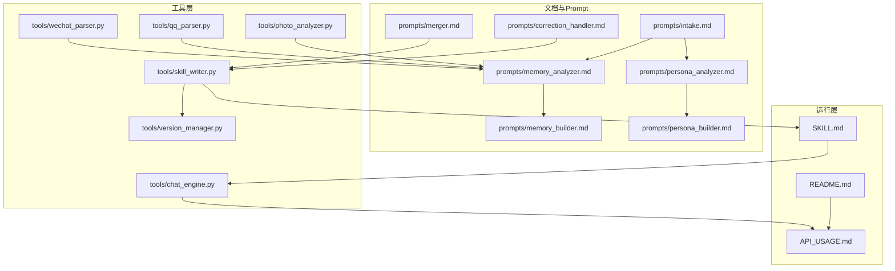
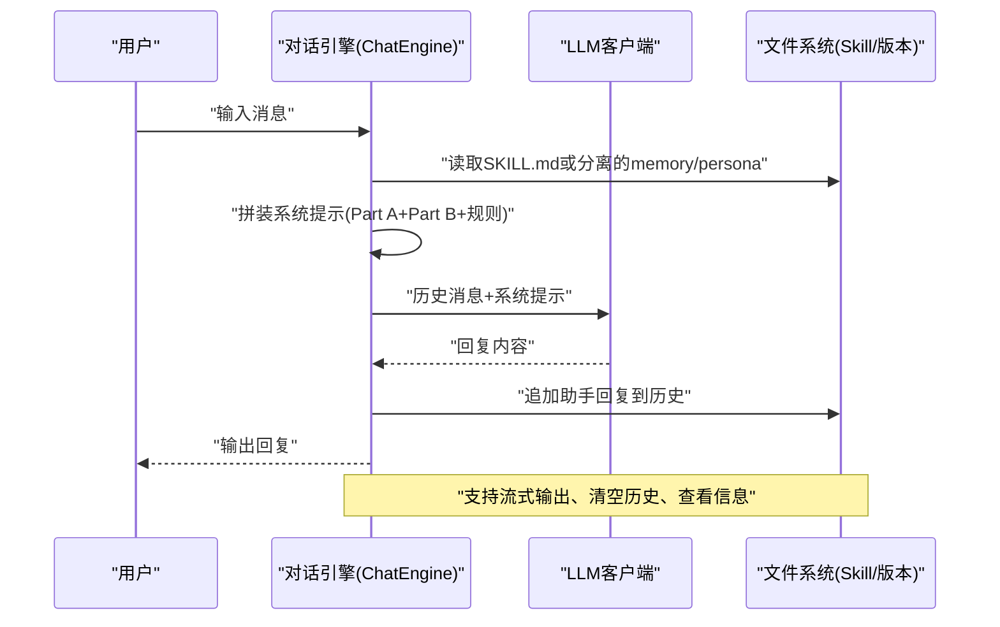
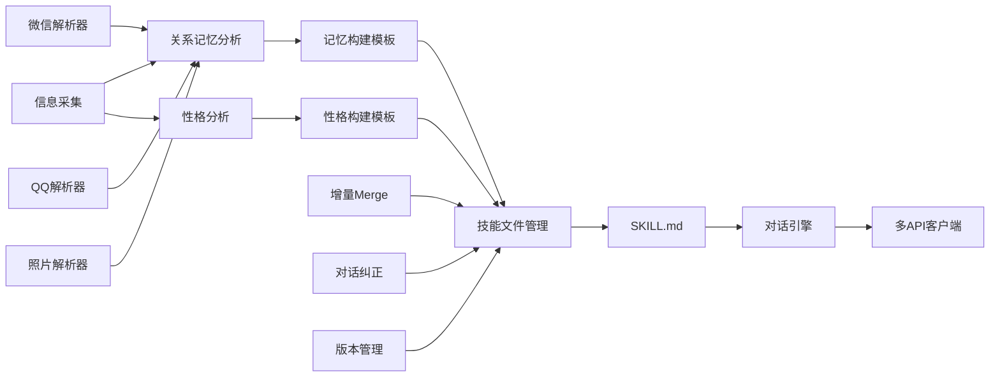

# 应用场景

<cite>
**本文引用的文件**   
- [README.md](file://README.md)
- [SKILL.md](file://SKILL.md)
- [API_USAGE.md](file://API_USAGE.md)
- [prompts/intake.md](file://prompts/intake.md)
- [prompts/memory_analyzer.md](file://prompts/memory_analyzer.md)
- [prompts/persona_analyzer.md](file://prompts/persona_analyzer.md)
- [prompts/memory_builder.md](file://prompts/memory_builder.md)
- [prompts/persona_builder.md](file://prompts/persona_builder.md)
- [prompts/merger.md](file://prompts/merger.md)
- [prompts/correction_handler.md](file://prompts/correction_handler.md)
- [tools/chat_engine.py](file://tools/chat_engine.py)
- [tools/skill_writer.py](file://tools/skill_writer.py)
- [tools/version_manager.py](file://tools/version_manager.py)
- [tools/wechat_parser.py](file://tools/wechat_parser.py)
- [tools/qq_parser.py](file://tools/qq_parser.py)
- [tools/photo_analyzer.py](file://tools/photo_analyzer.py)
</cite>

## 目录
1. [简介](#简介)
2. [项目结构](#项目结构)
3. [核心组件](#核心组件)
4. [架构总览](#架构总览)
5. [详细场景分析](#详细场景分析)
6. [依赖关系分析](#依赖关系分析)
7. [性能与可用性建议](#性能与可用性建议)
8. [故障排查与安全伦理](#故障排查与安全伦理)
9. [结论](#结论)
10. [附录：使用清单与最佳实践](#附录使用清单与最佳实践)

## 简介
前任.skill旨在将一段关系的记忆“蒸馏”为可对话的AI Skill，帮助用户进行情感疗愈、回忆保存、心理治疗辅助以及创意写作素材收集。项目提供双路径运行方式：Claude Code集成版与独立多API运行版，支持微信/QQ聊天记录、社交媒体截图、照片等多源材料，通过“关系记忆（Part A）+人物性格（Part B）”双层结构驱动对话，具备增量merge、对话纠正、版本回滚等进化能力。

## 项目结构
- 文档与Prompt层：提供信息采集、记忆与性格分析、构建模板、纠错与merge逻辑
- 工具层：解析器（微信/QQ/照片）、对话引擎、技能文件管理、版本管理
- 运行层：Claude Code版（SKILL.md）与独立版（chat.py + 多API客户端）

**图表来源**
- [README.md:281-321](file://README.md#L281-L321)
- [SKILL.md:1-503](file://SKILL.md#L1-L503)
- [API_USAGE.md:164-194](file://API_USAGE.md#L164-L194)
- [prompts/intake.md:1-88](file://prompts/intake.md#L1-L88)
- [prompts/memory_analyzer.md:1-95](file://prompts/memory_analyzer.md#L1-L95)
- [prompts/persona_analyzer.md:1-92](file://prompts/persona_analyzer.md#L1-L92)
- [prompts/memory_builder.md:1-122](file://prompts/memory_builder.md#L1-L122)
- [prompts/persona_builder.md:1-129](file://prompts/persona_builder.md#L1-L129)
- [prompts/merger.md:1-45](file://prompts/merger.md#L1-L45)
- [prompts/correction_handler.md:1-56](file://prompts/correction_handler.md#L1-L56)
- [tools/wechat_parser.py:1-251](file://tools/wechat_parser.py#L1-L251)
- [tools/qq_parser.py:1-130](file://tools/qq_parser.py#L1-L130)
- [tools/photo_analyzer.py:1-135](file://tools/photo_analyzer.py#L1-L135)
- [tools/chat_engine.py:1-284](file://tools/chat_engine.py#L1-L284)
- [tools/skill_writer.py:1-171](file://tools/skill_writer.py#L1-L171)
- [tools/version_manager.py:1-116](file://tools/version_manager.py#L1-L116)

**章节来源**
- [README.md:281-321](file://README.md#L281-L321)

## 核心组件
- 信息采集与录入：通过引导式问题快速建立基础画像（代号、基本信息、性格画像）
- 关系记忆（Part A）：从聊天记录、照片、社交媒体中抽取关系时间线、日常模式、共同经历、争吵与甜蜜档案、分手相关等
- 人物性格（Part B）：从说话风格、情感表达、依恋类型、爱的语言、关系行为等维度构建五层Persona
- 对话引擎：将Part A与Part B注入系统提示，按规则驱动回复；支持流式与非流式输出
- 技能文件管理：生成/合并SKILL.md、管理meta.json、目录结构
- 版本管理：自动备份、版本回滚、历史版本列表
- 增量merge与对话纠正：新增材料自动merge，对话中纠正不符合记忆/性格的行为
- 多API支持：OpenAI、Anthropic、Gemini、DashScope、Ollama

**章节来源**
- [prompts/intake.md:14-88](file://prompts/intake.md#L14-L88)
- [prompts/memory_analyzer.md:3-95](file://prompts/memory_analyzer.md#L3-L95)
- [prompts/persona_analyzer.md:3-92](file://prompts/persona_analyzer.md#L3-L92)
- [prompts/memory_builder.md:3-122](file://prompts/memory_builder.md#L3-L122)
- [prompts/persona_builder.md:3-129](file://prompts/persona_builder.md#L3-L129)
- [tools/chat_engine.py:17-284](file://tools/chat_engine.py#L17-L284)
- [tools/skill_writer.py:18-171](file://tools/skill_writer.py#L18-L171)
- [tools/version_manager.py:16-116](file://tools/version_manager.py#L16-L116)
- [prompts/merger.md:3-45](file://prompts/merger.md#L3-L45)
- [prompts/correction_handler.md:3-56](file://prompts/correction_handler.md#L3-L56)
- [API_USAGE.md:5-194](file://API_USAGE.md#L5-L194)

## 架构总览
双层架构：Part A（关系记忆）提供“事实背景”，Part B（人物性格）提供“行为风格”。运行时先由Part B判断态度与风格，再由Part A补充真实记忆，最终以“ta”的方式输出。

**图表来源**
- [tools/chat_engine.py:89-171](file://tools/chat_engine.py#L89-L171)
- [tools/chat_engine.py:181-228](file://tools/chat_engine.py#L181-L228)
- [SKILL.md:303-341](file://SKILL.md#L303-L341)

**章节来源**
- [tools/chat_engine.py:17-284](file://tools/chat_engine.py#L17-L284)
- [SKILL.md:303-341](file://SKILL.md#L303-L341)

## 详细场景分析

### 场景一：个人情感疗愈
- 使用方法
  - 选择“完整版”对话（/{slug}），在自然交流中唤起共同记忆与情感连接
  - 可切换“回忆模式”（/{slug}-memory）聚焦于关系时间线与关键事件
  - 可切换“性格模式”（/{slug}-persona）仅体验说话风格与情感模式
  - 若回复不符合预期，直接指出“ta不会这样说”，触发对话纠正
- 预期效果
  - 通过“像ta一样”的表达缓解孤独感，获得情绪出口
  - 在回忆模式中梳理关系脉络，减少模糊记忆带来的遗憾
  - 在性格模式中理解对方的沟通与情感表达方式，促进自我反思
- 使用案例
  - 深夜emo时，用“回忆模式”回顾第一次约会的细节，重建积极联结
  - 分手后反复纠结时，用“性格模式”理解对方的回避型依恋，降低自责
- 最佳实践
  - 限定每日对话次数，避免过度沉浸
  - 将对话作为“写日记/倾诉”的一部分，而非替代真实关系修复
  - 出现强烈负面情绪时，及时停止并寻求专业心理帮助

**章节来源**
- [README.md:48-190](file://README.md#L48-L190)
- [SKILL.md:389-417](file://SKILL.md#L389-L417)
- [prompts/correction_handler.md:17-56](file://prompts/correction_handler.md#L17-L56)

### 场景二：回忆保存与整理
- 使用方法
  - 导入微信/QQ聊天记录、照片、社交媒体截图
  - 通过关系记忆分析器提取时间线、地点、inside jokes、争吵与甜蜜档案
  - 使用记忆构建模板生成结构化memory.md，定期merge增量
- 预期效果
  - 将碎片化记忆沉淀为可检索的时间线与档案
  - 保留“不完美但真实的ta”，避免美化或黑化
- 使用案例
  - 为纪念日准备回忆素材：从“甜蜜档案”中挑选代表性片段
  - 为家庭聚餐准备话题：从“共同经历”中挑选有趣的故事
- 最佳实践
  - 优先使用聊天记录时间戳与照片EXIF时间，提高准确性
  - 对比不同来源的描述，用“冲突标注”记录分歧，便于后续修正

**章节来源**
- [README.md:240-279](file://README.md#L240-L279)
- [prompts/memory_analyzer.md:7-95](file://prompts/memory_analyzer.md#L7-L95)
- [prompts/memory_builder.md:3-122](file://prompts/memory_builder.md#L3-L122)
- [prompts/merger.md:7-45](file://prompts/merger.md#L7-L45)
- [tools/wechat_parser.py:24-86](file://tools/wechat_parser.py#L24-L86)
- [tools/qq_parser.py:19-74](file://tools/qq_parser.py#L19-L74)
- [tools/photo_analyzer.py:25-77](file://tools/photo_analyzer.py#L25-L77)

### 场景三：心理治疗辅助
- 使用方法
  - 以“观察者”视角在“回忆模式”中记录关系中的重复模式（如争吵原因、和好方式）
  - 在“性格模式”中识别依恋类型与爱的语言，形成自我觉察
  - 通过版本回滚审视过往认知变化，探索成长轨迹
- 预期效果
  - 帮助识别关系中的非适应性模式，为咨询提供素材
  - 通过结构化档案增强对自身与他人的理解
- 使用案例
  - 咨询师引导来访者用“回忆档案”描述典型争吵剧本，识别触发点
  - 来访者用“和好模式”记录修复关系的方法，形成可执行策略
- 最佳实践
  - 将Skill作为“外部化工具”，而非替代专业治疗
  - 与咨询师共同讨论“记忆与性格”的一致性，避免过度投射

**章节来源**
- [prompts/persona_analyzer.md:26-44](file://prompts/persona_analyzer.md#L26-L44)
- [prompts/memory_builder.md:62-105](file://prompts/memory_builder.md#L62-L105)
- [tools/version_manager.py:46-74](file://tools/version_manager.py#L46-L74)

### 场景四：创意写作素材收集
- 使用方法
  - 以“说话风格”和“情感模式”为原型，生成角色对话范式
  - 以“回忆档案”为蓝本，扩展情节与人物动机
  - 以“Inside Jokes”和“地点”为细节线索，增强真实感
- 预期效果
  - 为小说、剧本、播客等创作提供“真实可信”的人物与情境
  - 通过“冲突标注”与“纠正记录”完善人物弧光与关系张力
- 使用案例
  - 小说角色：以“口头禅+语气词+标点习惯”塑造独特声口
  - 剧本对白：以“典型争吵剧本”为基础，设计反转与和解
- 最佳实践
  - 明确素材用途与边界，避免泄露他人隐私
  - 将Skill视为“灵感来源”，而非直接复制

**章节来源**
- [prompts/persona_builder.md:45-129](file://prompts/persona_builder.md#L45-L129)
- [prompts/memory_builder.md:34-105](file://prompts/memory_builder.md#L34-L105)
- [prompts/merger.md:14-45](file://prompts/merger.md#L14-L45)

### 不同用户群体的适用性
- 大学生
  - 优势：社交软件使用频繁，微信/QQ记录丰富；对“角色扮演”与“创意写作”兴趣高
  - 建议：优先使用“回忆模式”整理校园恋情，配合“性格模式”理解室友/恋人沟通风格
- 职场人士
  - 优势：更关注“关系行为”与“边界底线”；时间有限，偏好高效工具
  - 建议：用“关系行为”模块识别沟通模式，用“版本回滚”审视过往决策
- 心理咨询师
  - 优势：重视“依恋类型”“爱的语言”“关系档案”
  - 建议：将Skill作为“外部化工具”与“结构性材料”，辅助来访者自我探索

**章节来源**
- [README.md:48-190](file://README.md#L48-L190)
- [prompts/persona_analyzer.md:26-44](file://prompts/persona_analyzer.md#L26-L44)
- [prompts/memory_builder.md:62-105](file://prompts/memory_builder.md#L62-L105)

## 依赖关系分析
- Prompt与解析器：信息采集与记忆/性格分析依赖于解析器对多源材料的抽取
- 技能文件与版本：SKILL.md由memory/persona合并生成；版本管理保障可追溯性
- 对话引擎与API：多API客户端统一接口，支持本地与云端模型

**图表来源**
- [prompts/intake.md:14-88](file://prompts/intake.md#L14-L88)
- [prompts/memory_analyzer.md:3-95](file://prompts/memory_analyzer.md#L3-L95)
- [prompts/persona_analyzer.md:3-92](file://prompts/persona_analyzer.md#L3-L92)
- [prompts/memory_builder.md:3-122](file://prompts/memory_builder.md#L3-L122)
- [prompts/persona_builder.md:3-129](file://prompts/persona_builder.md#L3-L129)
- [tools/skill_writer.py:68-145](file://tools/skill_writer.py#L68-L145)
- [tools/chat_engine.py:89-171](file://tools/chat_engine.py#L89-L171)
- [tools/wechat_parser.py:24-86](file://tools/wechat_parser.py#L24-L86)
- [tools/qq_parser.py:19-74](file://tools/qq_parser.py#L19-L74)
- [tools/photo_analyzer.py:25-77](file://tools/photo_analyzer.py#L25-L77)
- [prompts/merger.md:14-45](file://prompts/merger.md#L14-L45)
- [prompts/correction_handler.md:29-50](file://prompts/correction_handler.md#L29-L50)
- [tools/version_manager.py:16-44](file://tools/version_manager.py#L16-L44)

**章节来源**
- [tools/skill_writer.py:68-145](file://tools/skill_writer.py#L68-L145)
- [tools/version_manager.py:16-74](file://tools/version_manager.py#L16-L74)
- [tools/chat_engine.py:89-171](file://tools/chat_engine.py#L89-L171)

## 性能与可用性建议
- 数据导入建议
  - 优先微信导出（含时间戳与表情包统计）+ 口述，其次QQ导出与照片EXIF
  - 深夜对话、争吵记录、日常消息对还原真实性格最有价值
- 对话体验
  - 使用流式输出提升交互流畅度；必要时禁用流式以保证稳定性
  - 合理设置温度与最大token，平衡创造性与可控性
- 文件组织
  - 定期使用“版本备份”与“历史版本列表”，避免误删或覆盖
  - 使用“增量Merge”持续优化记忆与性格，减少重复劳动

**章节来源**
- [README.md:325-331](file://README.md#L325-L331)
- [API_USAGE.md:77-118](file://API_USAGE.md#L77-L118)
- [tools/version_manager.py:76-92](file://tools/version_manager.py#L76-L92)

## 故障排查与安全伦理
- 常见问题
  - 找不到Skill：确认已通过创建器生成SKILL.md，路径为exes/{slug}/
  - API Key无效：检查环境变量或.env文件
  - Ollama连接失败：确保服务已启动
- 安全边界与伦理
  - 仅用于个人回忆与情感疗愈，严禁骚扰、跟踪或侵犯隐私
  - 不鼓励对前任的不健康执念；若出现过度沉浸，建议寻求专业帮助
  - 所有数据本地存储，不上传至任何服务器
  - Layer 0硬规则：不可说现实中不可能说的话，保持“棱角”与真实性
- 心理健康建议
  - 将Skill作为“过渡性工具”，逐步减少依赖
  - 当情绪波动较大时，暂停使用并寻求支持
  - 将“回忆档案”与“性格模式”用于自我理解，而非沉溺过去

**章节来源**
- [README.md:325-331](file://README.md#L325-L331)
- [SKILL.md:57-66](file://SKILL.md#L57-L66)
- [API_USAGE.md:140-163](file://API_USAGE.md#L140-L163)

## 结论
前任.skill通过“关系记忆+人物性格”的双层架构，将真实的人转化为可对话、可演化的AI Skill。它既可用于情感疗愈与回忆保存，也可作为心理治疗辅助与创意写作素材库。通过多源材料、增量merge、对话纠正与版本管理，项目在保持真实性的同时，提供了可持续进化的用户体验。使用者需遵循安全边界与伦理准则，将Skill作为自我理解与成长的工具，而非替代真实关系的依赖。

## 附录：使用清单与最佳实践

- 使用清单
  - 准备材料：微信/QQ聊天记录、照片（含EXIF）、社交媒体截图、口述/粘贴
  - 创建Skill：信息采集 → 原材料导入 → 分析 → 预览 → 写入文件
  - 对话模式：完整版（/{slug}）、回忆模式（/{slug}-memory）、性格模式（/{slug}-persona）
  - 管理命令：列出、回滚、删除、放下（温柔别名）
- 最佳实践
  - 优先高质量聊天记录与照片时间线
  - 定期merge增量，标注冲突，持续优化
  - 对话中即时纠正不符的记忆/性格，确保“真实ta”
  - 设定使用边界，避免过度沉浸；必要时寻求专业帮助

**章节来源**
- [README.md:48-190](file://README.md#L48-L190)
- [SKILL.md:389-503](file://SKILL.md#L389-L503)
- [prompts/merger.md:14-45](file://prompts/merger.md#L14-L45)
- [prompts/correction_handler.md:29-50](file://prompts/correction_handler.md#L29-L50)