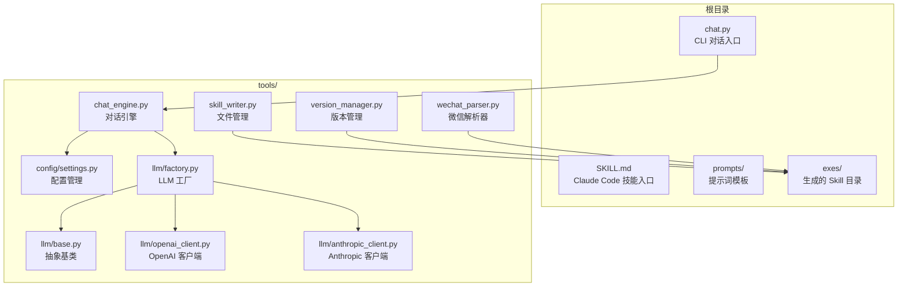
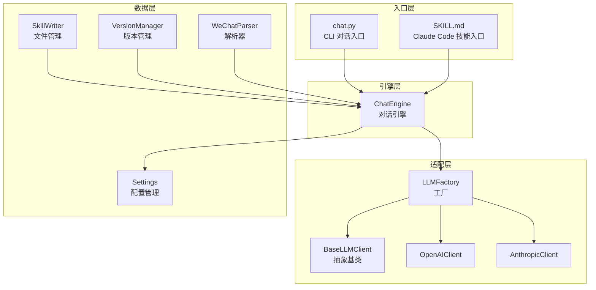
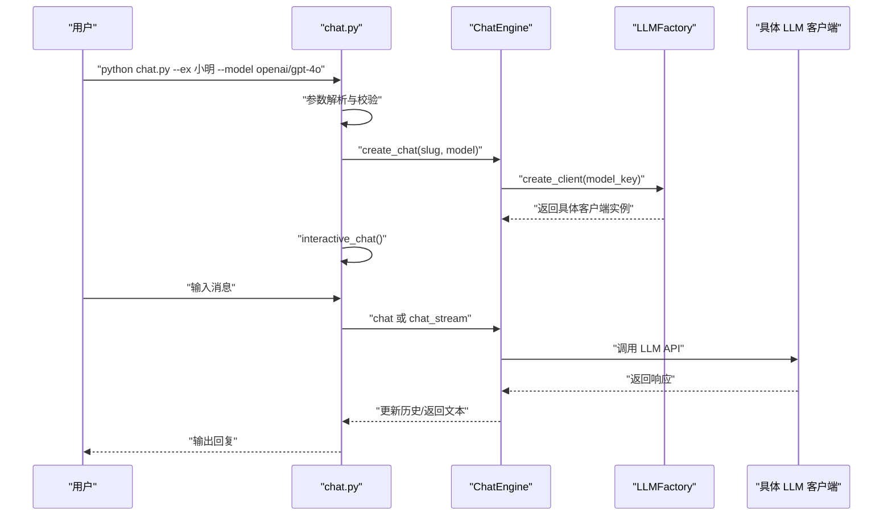
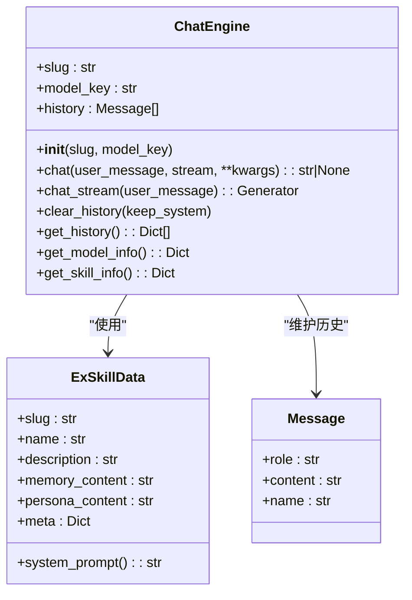
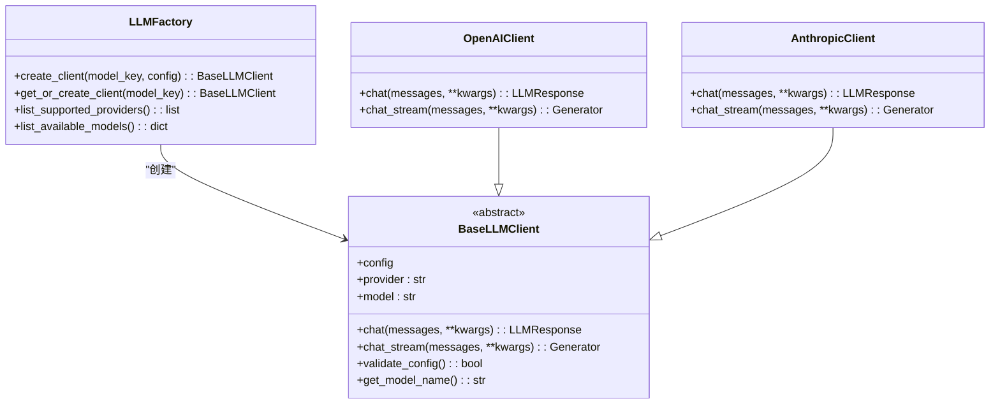
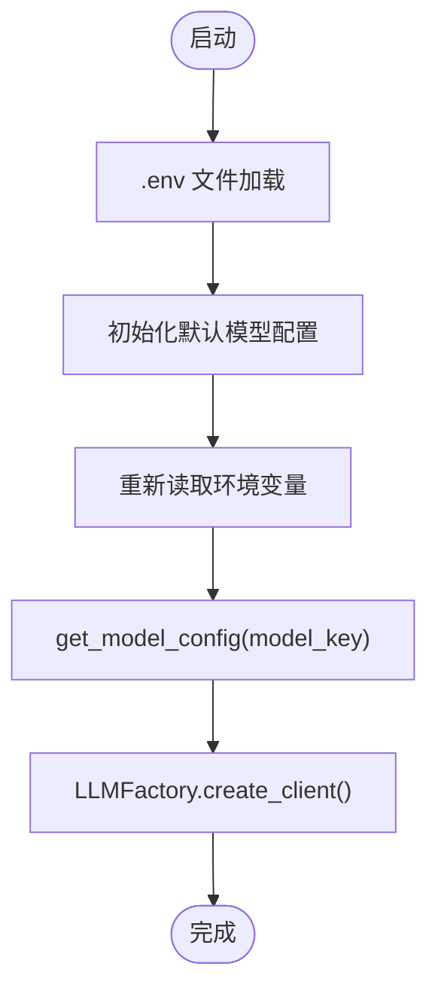
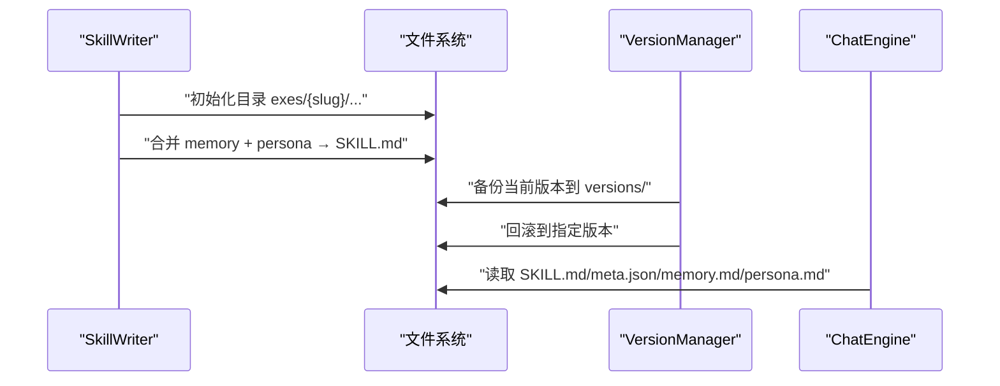
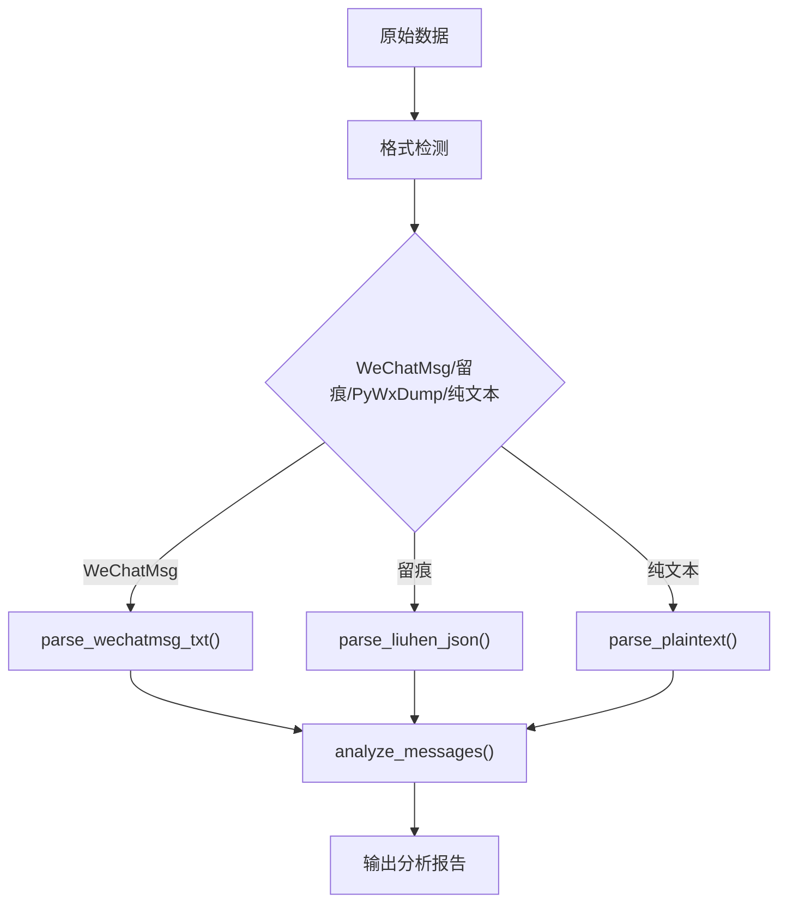
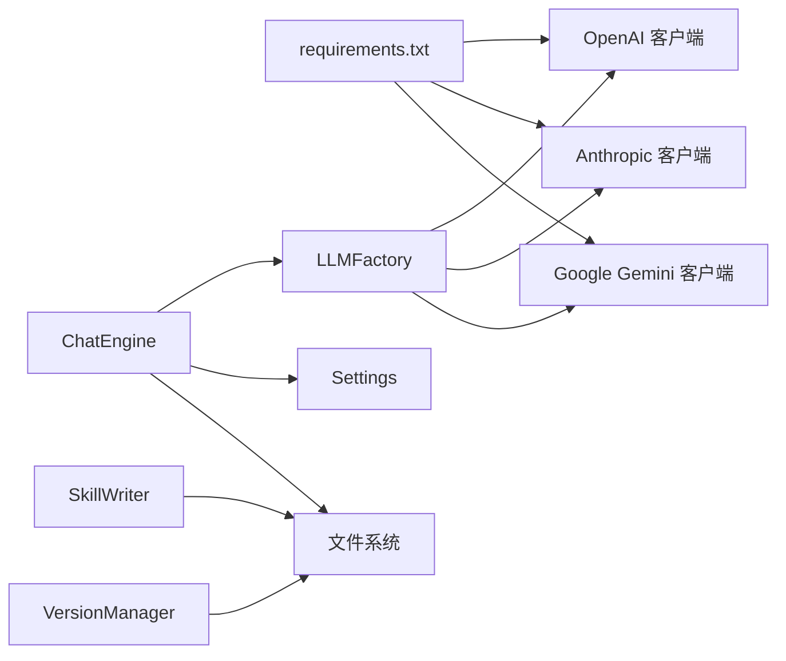

# 技术架构

<cite>
**本文引用的文件**
- [README.md](file://README.md)
- [chat.py](file://chat.py)
- [tools/chat_engine.py](file://tools/chat_engine.py)
- [tools/llm/factory.py](file://tools/llm/factory.py)
- [tools/llm/base.py](file://tools/llm/base.py)
- [tools/config/settings.py](file://tools/config/settings.py)
- [tools/skill_writer.py](file://tools/skill_writer.py)
- [tools/version_manager.py](file://tools/version_manager.py)
- [tools/llm/openai_client.py](file://tools/llm/openai_client.py)
- [tools/llm/anthropic_client.py](file://tools/llm/anthropic_client.py)
- [tools/wechat_parser.py](file://tools/wechat_parser.py)
- [SKILL.md](file://SKILL.md)
- [requirements.txt](file://requirements.txt)
</cite>

## 目录
1. [引言](#引言)
2. [项目结构](#项目结构)
3. [核心组件](#核心组件)
4. [架构总览](#架构总览)
5. [详细组件分析](#详细组件分析)
6. [依赖分析](#依赖分析)
7. [性能考量](#性能考量)
8. [故障排查指南](#故障排查指南)
9. [结论](#结论)
10. [附录](#附录)

## 引言
本项目旨在将“前任”这一特定关系对象的个性与记忆沉淀为可对话的 AI Skill，支持多 LLM 提供商与本地推理引擎，提供 CLI 对话入口与 Claude Code 技能入口。整体架构围绕“模块化设计”展开：配置管理、工具模块、提示词系统、文件管理与对话引擎相互解耦；通过工厂模式实现 LLM 客户端的统一接入；通过 Skill 文件结构与版本管理实现可演化的知识体系。

## 项目结构
项目采用按功能域划分的模块化组织方式，核心目录与职责如下：
- tools：核心工具集，包含对话引擎、配置管理、LLM 客户端、解析器与文件管理
- prompts：提示词模板，支撑信息采集、记忆提取、性格构建、增量合并与纠错处理
- exes：生成的前任 Skill 存放目录（gitignored），按 slug 组织
- 根目录入口：chat.py（CLI 对话入口）、SKILL.md（Claude Code 技能入口）

**图表来源**
- [chat.py:1-201](file://chat.py#L1-L201)
- [tools/chat_engine.py:1-284](file://tools/chat_engine.py#L1-L284)
- [tools/llm/factory.py:1-82](file://tools/llm/factory.py#L1-L82)
- [tools/llm/base.py:1-68](file://tools/llm/base.py#L1-L68)
- [tools/config/settings.py:1-225](file://tools/config/settings.py#L1-L225)
- [tools/skill_writer.py:1-171](file://tools/skill_writer.py#L1-L171)
- [tools/version_manager.py:1-116](file://tools/version_manager.py#L1-L116)
- [tools/llm/openai_client.py:1-93](file://tools/llm/openai_client.py#L1-L93)
- [tools/llm/anthropic_client.py:1-99](file://tools/llm/anthropic_client.py#L1-L99)
- [tools/wechat_parser.py:1-251](file://tools/wechat_parser.py#L1-L251)

**章节来源**
- [README.md:281-321](file://README.md#L281-L321)

## 核心组件
- CLI 对话入口（chat.py）：负责参数解析、技能列表、模型列表、交互式对话与异常处理
- 对话引擎（tools/chat_engine.py）：封装 Skill 数据加载、系统 Prompt 构造、消息历史管理、流式/非流式对话
- LLM 工厂（tools/llm/factory.py）：根据模型键创建对应 LLM 客户端，支持缓存与可用模型枚举
- LLM 抽象基类（tools/llm/base.py）：统一消息格式、响应结构与接口契约
- 配置管理（tools/config/settings.py）：模型配置、默认值、环境变量与 .env 加载、技能目录扫描
- 文件管理（tools/skill_writer.py）：初始化目录、合并 memory/persona 生成 SKILL.md、列出技能
- 版本管理（tools/version_manager.py）：备份、回滚、列出历史版本
- LLM 客户端实现（tools/llm/*）：OpenAI、Anthropic 等客户端，适配各自 API 差异
- 数据解析器（tools/wechat_parser.py 等）：解析不同来源的数据，提取风格与特征

**章节来源**
- [chat.py:128-197](file://chat.py#L128-L197)
- [tools/chat_engine.py:60-284](file://tools/chat_engine.py#L60-L284)
- [tools/llm/factory.py:14-82](file://tools/llm/factory.py#L14-L82)
- [tools/llm/base.py:27-68](file://tools/llm/base.py#L27-L68)
- [tools/config/settings.py:38-225](file://tools/config/settings.py#L38-L225)
- [tools/skill_writer.py:18-171](file://tools/skill_writer.py#L18-L171)
- [tools/version_manager.py:16-116](file://tools/version_manager.py#L16-L116)
- [tools/llm/openai_client.py:14-93](file://tools/llm/openai_client.py#L14-L93)
- [tools/llm/anthropic_client.py:13-99](file://tools/llm/anthropic_client.py#L13-L99)
- [tools/wechat_parser.py:24-251](file://tools/wechat_parser.py#L24-L251)

## 架构总览
系统采用“入口层—引擎层—适配层—数据层”的分层设计：
- 入口层：chat.py（CLI）与 SKILL.md（Claude Code）
- 引擎层：ChatEngine（统一对话编排）
- 适配层：LLMFactory + BaseLLMClient + 具体客户端（OpenAI、Anthropic 等）
- 数据层：配置（Settings）、文件（SkillWriter、VersionManager）、解析器（WeChat/QQ/Social/Photo）

**图表来源**
- [chat.py:128-197](file://chat.py#L128-L197)
- [tools/chat_engine.py:60-284](file://tools/chat_engine.py#L60-L284)
- [tools/llm/factory.py:14-82](file://tools/llm/factory.py#L14-L82)
- [tools/llm/base.py:27-68](file://tools/llm/base.py#L27-L68)
- [tools/config/settings.py:38-225](file://tools/config/settings.py#L38-L225)
- [tools/skill_writer.py:18-171](file://tools/skill_writer.py#L18-L171)
- [tools/version_manager.py:16-116](file://tools/version_manager.py#L16-L116)
- [tools/wechat_parser.py:24-251](file://tools/wechat_parser.py#L24-L251)

## 详细组件分析

### CLI 入口架构（chat.py）
- 职责：参数解析、技能与模型列表、交互式对话循环、命令处理（/quit、/clear、/info）、异常处理
- 关键流程：解析参数 → create_chat(slug, model) → interactive_chat(stream/no-stream)
- 错误处理：FileNotFoundError、ImportError、通用异常，引导用户查看技能列表与依赖安装

**图表来源**
- [chat.py:128-197](file://chat.py#L128-L197)
- [tools/chat_engine.py:181-228](file://tools/chat_engine.py#L181-L228)
- [tools/llm/factory.py:22-56](file://tools/llm/factory.py#L22-L56)

**章节来源**
- [chat.py:128-197](file://chat.py#L128-L197)

### 对话引擎设计（tools/chat_engine.py）
- 数据模型：ExSkillData（包含 slug、name、description、memory_content、persona_content、meta），系统 Prompt 由两部分合成并附加运行规则
- 生命周期：初始化 → 加载 Skill → 构造系统消息 → 对话（普通/流式）→ 维护历史
- 关键方法：chat、chat_stream、clear_history、get_history、get_model_info、get_skill_info
- 文件加载：优先 SKILL.md（含 frontmatter），否则分别读取 memory.md、persona.md、meta.json

**图表来源**
- [tools/chat_engine.py:17-284](file://tools/chat_engine.py#L17-L284)
- [tools/llm/base.py:19-25](file://tools/llm/base.py#L19-L25)

**章节来源**
- [tools/chat_engine.py:60-284](file://tools/chat_engine.py#L60-L284)

### 多 LLM 提供商支持架构（工厂模式）
- 设计动机：统一接入多家 LLM 提供商（OpenAI、Anthropic、Gemini、DashScope、Ollama），屏蔽差异
- 工厂职责：根据 model_key 解析 provider/model → 映射到具体客户端类 → 返回实例；支持缓存与可用模型枚举
- 客户端契约：BaseLLMClient 定义 chat 与 chat_stream 接口，具体客户端实现各自 API 差异

**图表来源**
- [tools/llm/base.py:27-68](file://tools/llm/base.py#L27-L68)
- [tools/llm/factory.py:14-82](file://tools/llm/factory.py#L14-L82)
- [tools/llm/openai_client.py:14-93](file://tools/llm/openai_client.py#L14-L93)
- [tools/llm/anthropic_client.py:13-99](file://tools/llm/anthropic_client.py#L13-L99)

**章节来源**
- [tools/llm/factory.py:14-82](file://tools/llm/factory.py#L14-L82)
- [tools/llm/base.py:27-68](file://tools/llm/base.py#L27-L68)

### 配置管理与跨平台兼容性
- 配置来源：默认内置模型配置 → .env 文件 → 环境变量（自动注入 API Key）
- 跨平台：通过 pathlib.Path 统一路径处理；Ollama 本地模型通过环境变量控制 base_url；依赖声明明确（Pillow、openai、anthropic、google-generativeai）
- 模型枚举：list_available_models 输出 provider/model 与 API Key 状态

**图表来源**
- [tools/config/settings.py:53-190](file://tools/config/settings.py#L53-L190)
- [tools/llm/factory.py:33-56](file://tools/llm/factory.py#L33-L56)

**章节来源**
- [tools/config/settings.py:38-225](file://tools/config/settings.py#L38-L225)
- [requirements.txt:1-12](file://requirements.txt#L1-L12)

### 文件管理与版本演进（SkillWriter 与 VersionManager）
- SkillWriter：初始化目录结构、合并 memory/persona 生成 SKILL.md、列出技能
- VersionManager：备份当前版本、回滚到历史版本、列出历史版本
- 与对话引擎协作：通过 Settings 获取 exes 目录，读写 SKILL.md、memory.md、persona.md、meta.json

**图表来源**
- [tools/skill_writer.py:54-144](file://tools/skill_writer.py#L54-L144)
- [tools/version_manager.py:16-74](file://tools/version_manager.py#L16-L74)
- [tools/chat_engine.py:89-131](file://tools/chat_engine.py#L89-L131)

**章节来源**
- [tools/skill_writer.py:18-171](file://tools/skill_writer.py#L18-L171)
- [tools/version_manager.py:16-116](file://tools/version_manager.py#L16-L116)
- [tools/chat_engine.py:89-131](file://tools/chat_engine.py#L89-L131)

### 数据处理流水线（解析器与提示词）
- 数据源适配：微信（WeChatMsg、留痕、PyWxDump、纯文本）、QQ、社交媒体截图、照片 EXIF
- 解析器职责：格式检测、消息清洗、风格特征提取（口头禅、表情包、标点习惯、消息长度）
- 提示词系统：intake（信息采集）、memory_analyzer（关系记忆）、persona_analyzer（人物性格）、memory_builder、persona_builder、merger（增量合并）、correction_handler（对话纠正）

**图表来源**
- [tools/wechat_parser.py:24-177](file://tools/wechat_parser.py#L24-L177)

**章节来源**
- [tools/wechat_parser.py:24-251](file://tools/wechat_parser.py#L24-L251)
- [README.md:281-321](file://README.md#L281-L321)

## 依赖分析
- 外部依赖：Pillow（照片 EXIF）、openai、anthropic、google-generativeai（按需安装）
- 内部耦合：ChatEngine 依赖 LLMFactory 与 Settings；LLMFactory 依赖具体客户端实现；SkillWriter/VersionManager 依赖文件系统与 Settings
- 解耦策略：抽象基类隔离客户端差异；工厂集中管理创建与缓存；配置集中管理与环境变量注入

**图表来源**
- [requirements.txt:1-12](file://requirements.txt#L1-L12)
- [tools/chat_engine.py:12-14](file://tools/chat_engine.py#L12-L14)
- [tools/llm/factory.py:5-11](file://tools/llm/factory.py#L5-L11)

**章节来源**
- [requirements.txt:1-12](file://requirements.txt#L1-L12)
- [tools/chat_engine.py:12-14](file://tools/chat_engine.py#L12-L14)
- [tools/llm/factory.py:5-11](file://tools/llm/factory.py#L5-L11)

## 性能考量
- 流式输出：chat_stream 提供边生成边输出，降低首字延迟，改善交互体验
- 客户端缓存：LLMFactory.get_or_create_client 缓存实例，减少重复初始化成本
- 模型参数：temperature、max_tokens 在 Settings 中集中配置，便于统一调优
- I/O 优化：SkillWriter 合并文件写入，VersionManager 增量备份与回滚，避免频繁小文件操作

## 故障排查指南
- 依赖缺失：chat.py 捕获 ImportError 并提示安装 openai/anthropic/google-generativeai
- 技能不存在：ChatEngine 加载失败抛出 FileNotFoundError，提示使用 --list-skills
- API Key 未配置：LLMFactory.list_available_models 显示 provider 的 API Key 状态
- 环境变量：.env 未正确加载或覆盖，检查 .env 文件与环境变量优先级

**章节来源**
- [chat.py:185-196](file://chat.py#L185-L196)
- [tools/chat_engine.py:94-95](file://tools/chat_engine.py#L94-L95)
- [tools/llm/factory.py:70-81](file://tools/llm/factory.py#L70-L81)
- [tools/config/settings.py:148-160](file://tools/config/settings.py#L148-L160)

## 结论
本项目通过清晰的分层与模块化设计，实现了“多提供商 LLM 对话 + 可演化的 Skill 知识体系”。工厂模式与抽象基类确保了扩展性与一致性；配置管理与环境变量注入提升了部署灵活性；文件管理与版本机制保障了知识的持续演进与可回溯性。整体架构兼顾易用性与可维护性，适合在多场景下进行二次开发与定制。

## 附录
- 技术选型说明
  - Python：生态成熟、工具链完善、跨平台兼容、易于集成 LLM SDK 与解析库
  - 工厂模式：统一客户端创建与生命周期管理，便于新增提供商与参数标准化
  - 跨平台兼容：路径统一、依赖按需安装、环境变量注入、本地模型支持
- 使用建议
  - 优先提供高质量聊天记录与照片素材，提升还原度
  - 使用版本管理定期备份，便于回滚与对比
  - 根据需求选择合适的模型与参数，平衡质量与成本