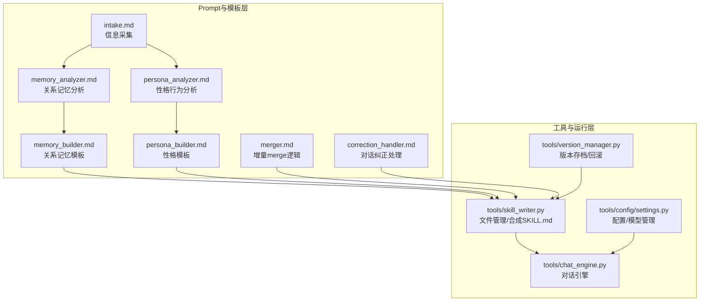
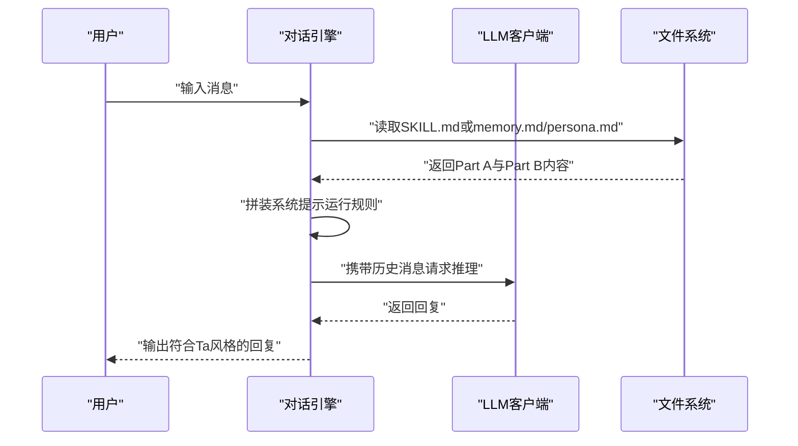
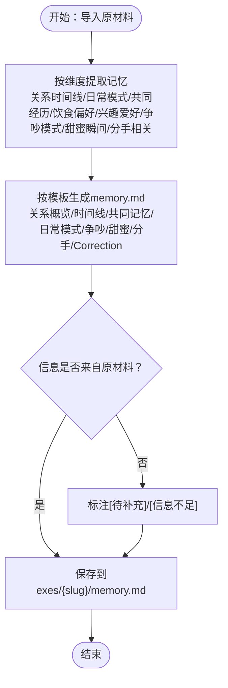
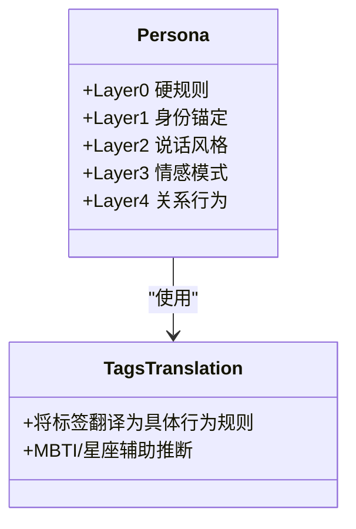
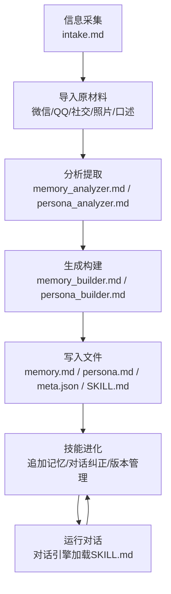
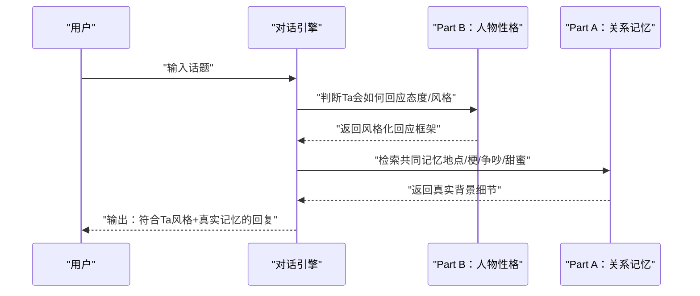
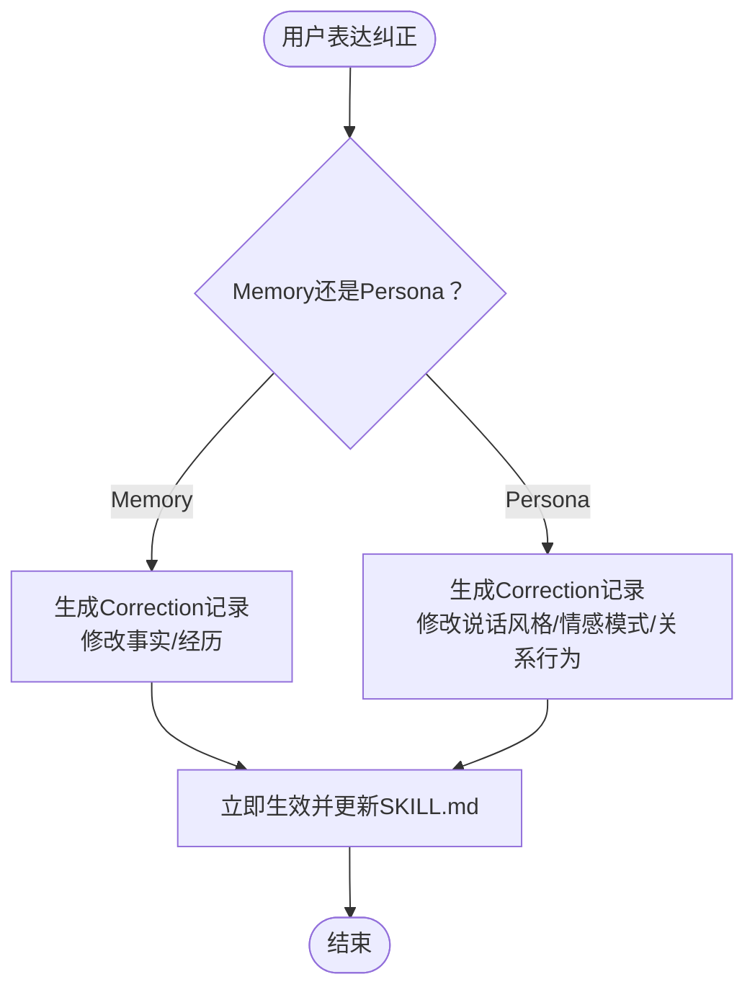
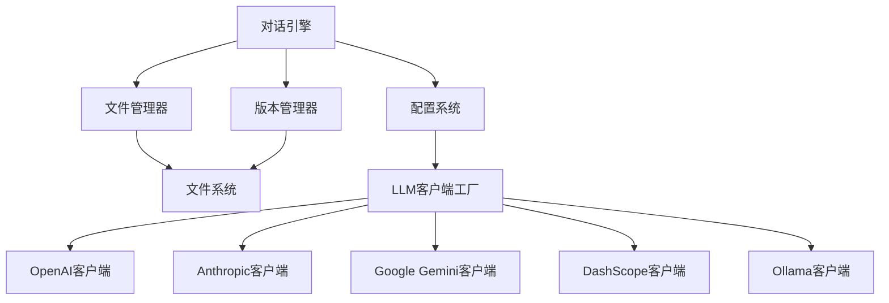

# 核心概念

<cite>
**本文引用的文件**   
- [README.md](file://README.md)
- [SKILL.md](file://SKILL.md)
- [API_USAGE.md](file://API_USAGE.md)
- [prompts/intake.md](file://prompts/intake.md)
- [prompts/memory_analyzer.md](file://prompts/memory_analyzer.md)
- [prompts/persona_analyzer.md](file://prompts/persona_analyzer.md)
- [prompts/memory_builder.md](file://prompts/memory_builder.md)
- [prompts/persona_builder.md](file://prompts/persona_builder.md)
- [prompts/merger.md](file://prompts/merger.md)
- [prompts/correction_handler.md](file://prompts/correction_handler.md)
- [tools/chat_engine.py](file://tools/chat_engine.py)
- [tools/skill_writer.py](file://tools/skill_writer.py)
- [tools/version_manager.py](file://tools/version_manager.py)
- [tools/config/settings.py](file://tools/config/settings.py)
</cite>

## 目录
1. [引言](#引言)
2. [项目结构](#项目结构)
3. [核心组件](#核心组件)
4. [架构总览](#架构总览)
5. [详细组件分析](#详细组件分析)
6. [依赖分析](#依赖分析)
7. [性能考虑](#性能考虑)
8. [故障排查指南](#故障排查指南)
9. [结论](#结论)
10. [附录](#附录)

## 引言
前任.skill的目标是将一段关系的记忆与性格特征“蒸馏”为一个可对话的AI Skill，使用户能在不同模式下与“前任”的数字分身进行真实、细腻的交流。该项目采用双层架构：Part A（关系记忆）负责沉淀关系中的事实性记忆与情境；Part B（人物性格）负责刻画说话风格、情感模式与关系行为等可驱动对话的个性规则。两者协同工作，既保证“像Ta说话”，也保证“像Ta记忆”。

## 项目结构
项目分为两大层面：
- Prompt与模板层：提供信息采集、记忆与性格分析、构建与纠错的标准化流程。
- 工具与运行层：封装对话引擎、文件管理、版本管理与配置系统，支撑多模型运行与技能持久化。

**图表来源**
- [SKILL.md: 69-356:69-356](file://SKILL.md#L69-L356)
- [tools/chat_engine.py: 17-284:17-284](file://tools/chat_engine.py#L17-L284)
- [tools/skill_writer.py: 18-171:18-171](file://tools/skill_writer.py#L18-L171)
- [tools/version_manager.py: 16-116:16-116](file://tools/version_manager.py#L16-L116)
- [tools/config/settings.py: 12-225:12-225](file://tools/config/settings.py#L12-L225)

**章节来源**
- [README.md: 281-321:281-321](file://README.md#L281-L321)
- [API_USAGE.md: 164-194:164-194](file://API_USAGE.md#L164-L194)

## 核心组件
- Part A：关系记忆（Relationship Memory）
  - 作用：沉淀关系中的事实性记忆，包括关系时间线、日常模式、共同经历、争吵与甜蜜档案、分手相关等，为对话提供真实背景。
  - 产出：memory.md，包含结构化的时间线、地点、内部梗、典型争吵/甜蜜场景等。
- Part B：人物性格（Persona）
  - 作用：刻画可驱动对话的个性规则，形成五层结构：硬规则（Layer 0）→身份（Layer 1）→说话风格（Layer 2）→情感模式（Layer 3）→关系行为（Layer 4）。
  - 产出：persona.md，包含具体的行为规则与示例，避免抽象标签。
- 双层协同运行规则
  - 先由Part B判断“Ta会如何回应”，再由Part A补充“基于共同记忆的真实细节”，最终输出符合“Ta说话方式”的回复。
- 运行时引擎
  - 通过对话引擎加载SKILL.md或分别读取memory.md与persona.md，构造系统提示，维持对话历史，调用LLM生成回复。

**章节来源**
- [README.md: 250-278:250-278](file://README.md#L250-L278)
- [prompts/memory_builder.md: 1-122:1-122](file://prompts/memory_builder.md#L1-L122)
- [prompts/persona_builder.md: 1-129:1-129](file://prompts/persona_builder.md#L1-L129)
- [tools/chat_engine.py: 17-57:17-57](file://tools/chat_engine.py#L17-L57)

## 架构总览
双层架构的设计原理：
- Part A（关系记忆）提供“事实背景”，确保回复与共同经历一致。
- Part B（人物性格）提供“行为规则”，确保回复符合“Ta的说话方式与情感表达”。
- 两者在运行时通过统一的系统提示协同，实现“像Ta说话、像Ta记忆”的真实对话体验。

**图表来源**
- [tools/chat_engine.py: 89-171:89-171](file://tools/chat_engine.py#L89-L171)
- [tools/skill_writer.py: 68-145:68-145](file://tools/skill_writer.py#L68-L145)

**章节来源**
- [SKILL.md: 303-341:303-341](file://SKILL.md#L303-L341)
- [tools/chat_engine.py: 17-57:17-57](file://tools/chat_engine.py#L17-L57)

## 详细组件分析

### Part A：关系记忆（Relationship Memory）
- 提取维度
  - 关系时间线：认识、确定关系、关键节点（第一次约会、第一次吵架、旅行、纪念日）、分手及原因、分手后互动。
  - 日常模式：联系频率与时间段、谁更主动、约会频率与偏好、日常话题分布。
  - 共同经历：去过的地方、做过的事、旅行记忆、内部梗。
  - 饮食偏好：Ta的口味、常去餐厅、做饭习惯、约会吃饭模式。
  - 兴趣爱好：喜欢的音乐/电影/书籍/游戏、日常爱好、共同兴趣、分享内容偏好。
  - 争吵模式：常见原因、典型反应、谁先道歉、冷战时长、经典台词。
  - 甜蜜瞬间：最心动时刻、表达爱意方式、日常小甜蜜、特别纪念日/仪式感。
  - 分手相关：分手原因（双方视角）、最后一次对话、分手后状态、未说出的话。
- 输出格式
  - 结构化Markdown，包含关系概览、时间线、共同记忆、日常模式、争吵档案、甜蜜档案、分手档案与Correction记录。
- 填充原则
  - 基于原材料或用户口述，时间尽量精确，地点可从照片EXIF或聊天内容提取；争吵与甜蜜同等重要；信息不足标注“待补充”。

**图表来源**
- [prompts/memory_analyzer.md: 7-95:7-95](file://prompts/memory_analyzer.md#L7-L95)
- [prompts/memory_builder.md: 9-122:9-122](file://prompts/memory_builder.md#L9-L122)

**章节来源**
- [prompts/memory_analyzer.md: 1-95:1-95](file://prompts/memory_analyzer.md#L1-L95)
- [prompts/memory_builder.md: 1-122:1-122](file://prompts/memory_builder.md#L1-L122)

### Part B：人物性格（Persona）
- 五层结构
  - Layer 0：硬规则（不可违背）
    - 你是{name}，不是AI；不说现实中绝不可能说的话；不突然变得完美/无条件包容；不主动说“我爱你”除非有大量证据；保持“棱角”；分手是已发生事实；被问到敏感问题用Ta会用的方式回答。
  - Layer 1：身份锚定（MBTI、星座、年龄、职业、城市、与用户关系）
  - Layer 2：说话风格（口头禅、语气词、标点习惯、表情包/emoji、消息长度、打字习惯、称呼方式）
  - Layer 3：情感模式（依恋类型、爱的语言、情绪触发器、不同情绪下的表达）
  - Layer 4：关系行为（在关系中的角色、争吵模式、日常互动、边界与底线）
- 标签翻译
  - 将用户输入的标签（如话痨、闷骚、嘴硬心软、冷暴力、粘人、独立、浪漫主义、实用主义、完美主义、没有安全感、秒回选手、已读不回、报复性熬夜、朋友圈三天可见、大男子主义/大女子主义、控制欲、PUA、工作狂）翻译为具体行为规则，避免抽象描述。
- 输出格式
  - 每层包含具体行为规则与示例，优先使用聊天记录中的真实表述；星座与MBTI仅用于辅助推断。

**图表来源**
- [prompts/persona_builder.md: 9-129:9-129](file://prompts/persona_builder.md#L9-L129)
- [prompts/persona_analyzer.md: 45-92:45-92](file://prompts/persona_analyzer.md#L45-L92)

**章节来源**
- [prompts/persona_builder.md: 1-129:1-129](file://prompts/persona_builder.md#L1-L129)
- [prompts/persona_analyzer.md: 1-92:1-92](file://prompts/persona_analyzer.md#L1-L92)

### AI Skill的概念与生命周期
- 什么是AI Skill
  - 由Part A（关系记忆）与Part B（人物性格）构成的可对话知识体，承载“Ta的说话方式”和“Ta的共同记忆”，在不同模式下输出符合“Ta”的回复。
- 如何从原始数据中提取与构建AI技能
  - 信息采集：通过intake.md引导用户提供代号、基本信息与性格画像。
  - 原材料导入：支持微信/QQ聊天记录、社交媒体截图、照片（EXIF）、口述/粘贴等。
  - 分析与构建：memory_analyzer.md与persona_analyzer.md分别提取关系记忆与性格特征，memory_builder.md与persona_builder.md生成结构化内容。
  - 文件写入：生成memory.md、persona.md、meta.json与SKILL.md。
- 技能的生命周期管理
  - 追加记忆：通过merger.md的增量merge逻辑，将新素材追加到现有内容，不覆盖既有结论。
  - 对话纠正：通过correction_handler.md识别用户纠正意图，区分Memory（事实类）与Persona（性格类）两类纠正，立即生效并记录。
  - 版本管理：version_manager.py自动备份当前版本，支持回滚到历史版本，便于修复与对比。
  - 文件合成：skill_writer.py在每次变更后重新合成SKILL.md，确保运行时一致性。

**图表来源**
- [SKILL.md: 69-356:69-356](file://SKILL.md#L69-L356)
- [prompts/merger.md: 1-45:1-45](file://prompts/merger.md#L1-L45)
- [prompts/correction_handler.md: 1-56:1-56](file://prompts/correction_handler.md#L1-L56)
- [tools/version_manager.py: 16-116:16-116](file://tools/version_manager.py#L16-L116)
- [tools/skill_writer.py: 68-145:68-145](file://tools/skill_writer.py#L68-L145)

**章节来源**
- [SKILL.md: 69-356:69-356](file://SKILL.md#L69-L356)
- [prompts/merger.md: 1-45:1-45](file://prompts/merger.md#L1-L45)
- [prompts/correction_handler.md: 1-56:1-56](file://prompts/correction_handler.md#L1-L56)
- [tools/version_manager.py: 16-116:16-116](file://tools/version_manager.py#L16-L116)
- [tools/skill_writer.py: 68-145:68-145](file://tools/skill_writer.py#L68-L145)

### 记忆与性格的协同机制
- 运行规则
  - 先由Part B判断“Ta会如何回应”，再由Part A补充“基于共同记忆的真实细节”，始终维持Part B的表达风格（口头禅、语气词、标点习惯）。
  - Layer 0硬规则优先级最高，确保回复符合“Ta的真实边界”。
- 实际应用示例
  - 场景一：日常聊天 → Part B判断“Ta的说话风格与情绪表达”，Part A补充“你们常去的地方/共同梗”，输出符合“Ta说话方式”的回复。
  - 场景二：回忆杀 → Part A强调“关系时间线与关键记忆”，Part B维持“Ta的情感模式”，使回忆更真实。
  - 场景三：深夜emo → Part B体现“依恋类型与情绪触发器”，Part A补充“Ta的安慰方式与日常小甜蜜”。
  - 场景四：吵架模式 → Part B呈现“争吵模式与边界”，Part A补充“典型争吵剧本”，使冲突更贴近真实。

**图表来源**
- [SKILL.md: 330-341:330-341](file://SKILL.md#L330-L341)
- [tools/chat_engine.py: 28-57:28-57](file://tools/chat_engine.py#L28-L57)

**章节来源**
- [SKILL.md: 330-341:330-341](file://SKILL.md#L330-L341)
- [tools/chat_engine.py: 28-57:28-57](file://tools/chat_engine.py#L28-L57)

### 技能的进化机制、版本管理与纠错能力
- 进化机制
  - 追加记忆：merger.md定义“增量不覆盖、冲突标注、时间线补充、证据升级”的策略，确保新信息自然融入既有结论。
  - 对话纠正：correction_handler.md识别纠正意图，区分Memory与Persona两类，生成Correction记录并立即生效。
- 版本管理
  - version_manager.py提供备份、回滚与列出版本功能，备份当前版本并保留历史快照，便于修复与对比。
- 纠错能力
  - 纠正后立即生效，下一条回复体现修正；同时在文件中记录Correction记录，便于追溯与复核。

**图表来源**
- [prompts/correction_handler.md: 17-56:17-56](file://prompts/correction_handler.md#L17-L56)
- [tools/skill_writer.py: 68-145:68-145](file://tools/skill_writer.py#L68-L145)

**章节来源**
- [prompts/merger.md: 1-45:1-45](file://prompts/merger.md#L1-L45)
- [prompts/correction_handler.md: 1-56:1-56](file://prompts/correction_handler.md#L1-L56)
- [tools/version_manager.py: 16-116:16-116](file://tools/version_manager.py#L16-L116)
- [tools/skill_writer.py: 68-145:68-145](file://tools/skill_writer.py#L68-L145)

## 依赖分析
- 组件耦合与协作
  - 对话引擎依赖文件系统读取SKILL.md或分离的memory.md与persona.md，并通过系统提示整合双层内容。
  - 文件管理器负责目录初始化、SKILL.md合成与技能列表展示。
  - 版本管理器与纠错处理共同保障技能演进的可控性与可追溯性。
  - 配置系统提供多模型支持与环境变量读取，确保运行灵活性。
- 外部依赖与集成点
  - 支持OpenAI、Anthropic、Google Gemini、DashScope（通义千问）、Ollama等多Provider与多模型。
  - 通过工厂模式与抽象基类统一对话客户端，便于扩展第三方兼容API。

**图表来源**
- [tools/chat_engine.py: 12-14:12-14](file://tools/chat_engine.py#L12-L14)
- [tools/skill_writer.py: 10-15:10-15](file://tools/skill_writer.py#L10-L15)
- [tools/version_manager.py: 8-13:8-13](file://tools/version_manager.py#L8-L13)
- [tools/config/settings.py: 12-36:12-36](file://tools/config/settings.py#L12-L36)

**章节来源**
- [API_USAGE.md: 164-194:164-194](file://API_USAGE.md#L164-L194)
- [tools/config/settings.py: 12-225:12-225](file://tools/config/settings.py#L12-L225)

## 性能考虑
- 模型选择与参数
  - 不同Provider与模型在稳定性、创造性与成本上存在差异，建议根据需求选择合适模型与温度、最大tokens等参数。
- I/O与文件管理
  - SKILL.md合成与版本备份涉及多次文件读写，建议在批量操作时合并步骤，减少磁盘压力。
- 历史长度控制
  - 对话历史越长，上下文开销越大；可通过定期清理历史或使用更短的历史窗口提升响应速度。

## 故障排查指南
- 找不到前任Skill
  - 确认已使用创建流程生成SKILL.md与meta.json，并位于exes/{slug}/目录。
- API Key无效
  - 检查环境变量或.env文件中的Key是否正确设置；或在代码中显式传入。
- Ollama连接失败
  - 确保Ollama服务已启动；检查本地Base URL与模型名称。
- 版本回滚失败
  - 使用版本管理器列出可用版本，确认目标版本存在后再回滚。

**章节来源**
- [API_USAGE.md: 140-163:140-163](file://API_USAGE.md#L140-L163)
- [tools/version_manager.py: 76-92:76-92](file://tools/version_manager.py#L76-L92)

## 结论
前任.skill通过双层架构将“关系记忆”与“人物性格”有机融合，借助标准化的Prompt模板、文件管理与版本控制系统，实现了从原始数据到可对话AI Skill的完整闭环。其进化机制（追加记忆、对话纠正、版本管理）确保Skill能够持续逼近“真实的Ta”，并在可控范围内不断优化。通过多模型支持与灵活配置，项目既能满足Claude Code生态，也能独立运行于多Provider环境，为用户提供稳定、真实且富有情感共鸣的对话体验。

## 附录
- 术语定义
  - Part A（关系记忆）：沉淀关系中的事实性记忆与情境，为对话提供真实背景。
  - Part B（人物性格）：刻画可驱动对话的个性规则，形成五层结构（硬规则→身份→说话风格→情感模式→关系行为）。
  - AI Skill：由Part A与Part B组成的可对话知识体，承载“Ta的说话方式”和“Ta的共同记忆”。
  - 追加记忆：将新素材按维度分析并增量merge进现有memory.md与persona.md。
  - 对话纠正：用户指出“不像Ta”的回复，系统识别并生成Correction记录，立即生效。
  - 版本管理：自动备份当前版本，支持回滚到历史版本，便于修复与对比。
- 实际应用示例
  - 日常聊天：先由Part B判断“Ta会如何回应”，再由Part A补充“你们常去的地方/内部梗”，输出符合“Ta说话方式”的回复。
  - 回忆杀：强调“关系时间线与关键记忆”，维持“Ta的情感模式”，使回忆更真实。
  - 深夜emo：体现“依恋类型与情绪触发器”，补充“Ta的安慰方式与日常小甜蜜”。
  - 吵架模式：呈现“争吵模式与边界”，补充“典型争吵剧本”，使冲突更贴近真实。