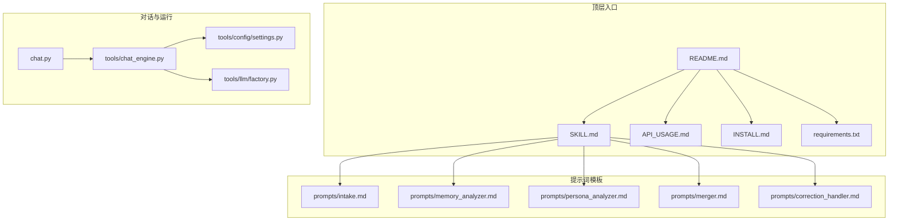
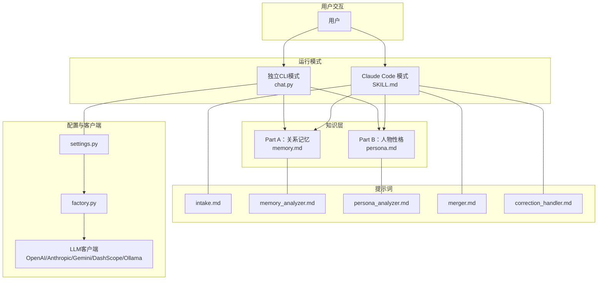
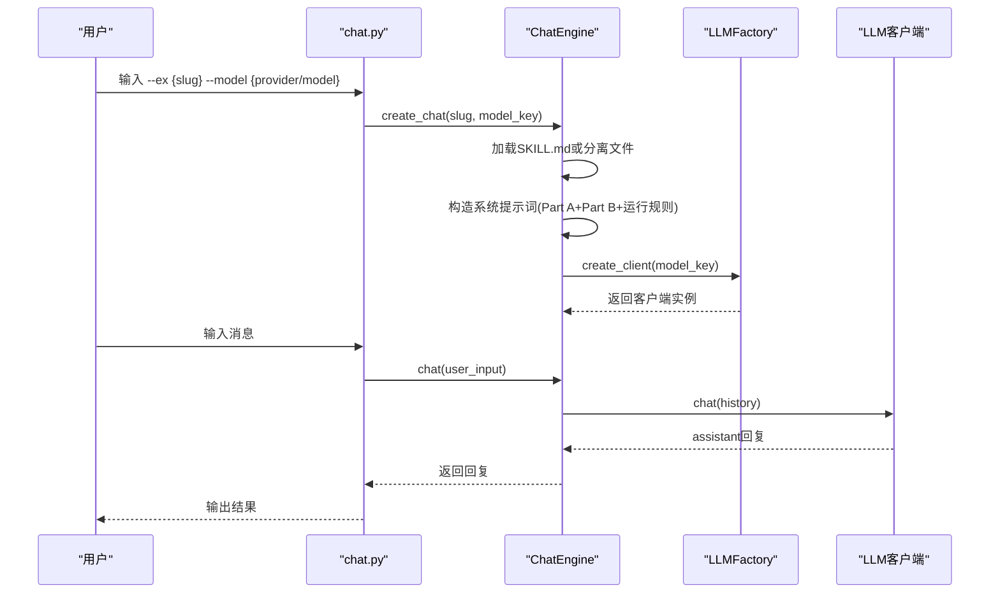
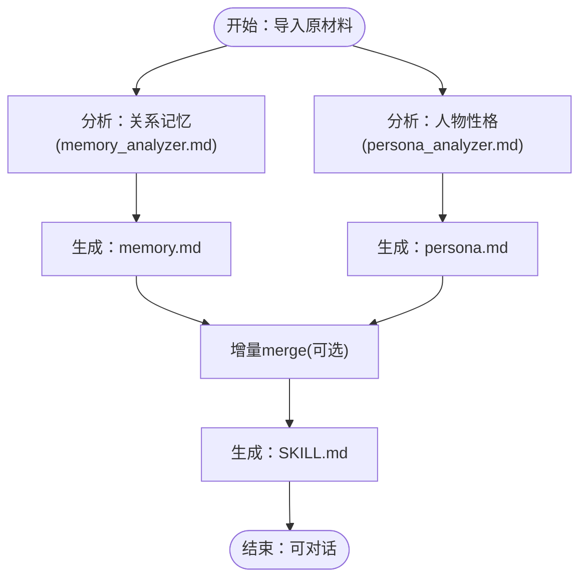
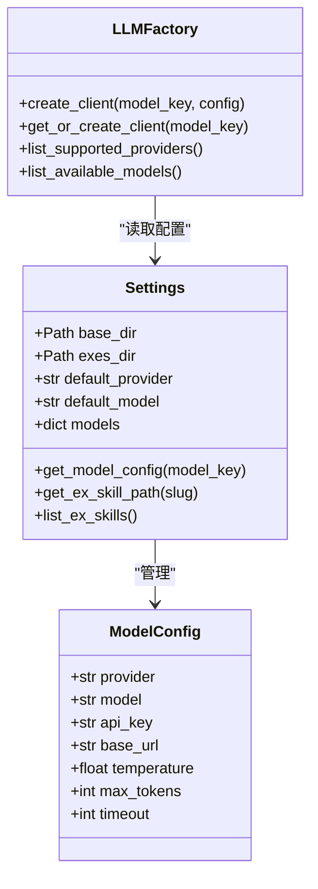
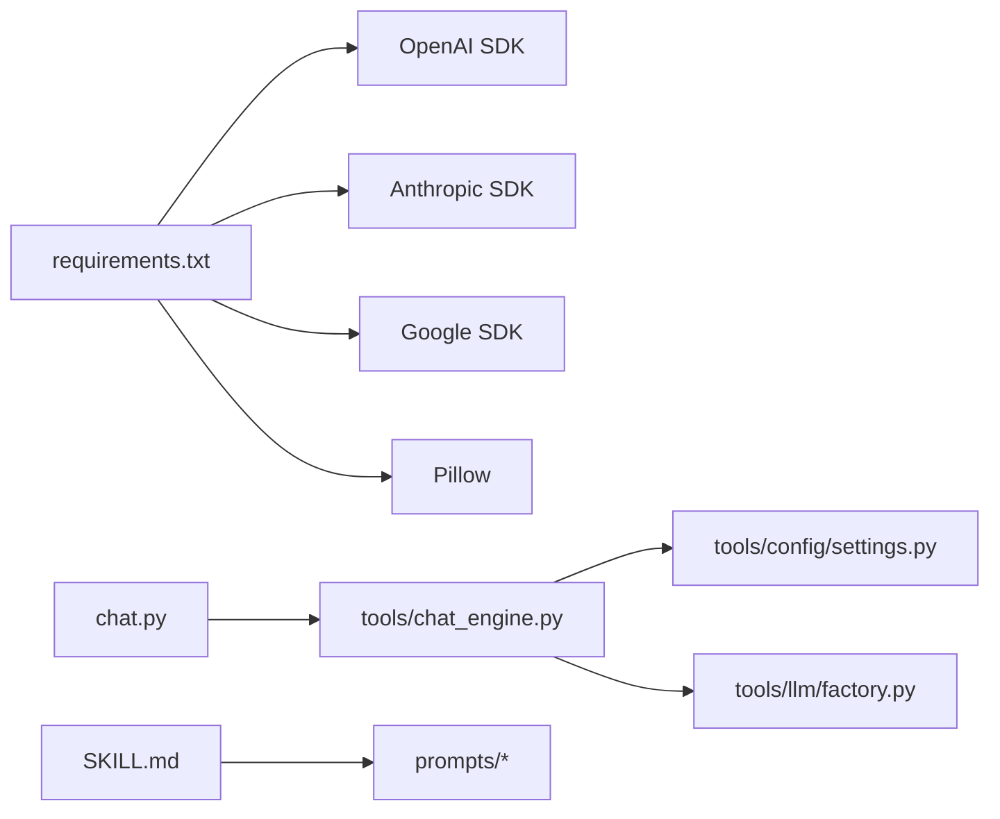

# 项目介绍

<cite>
**本文引用的文件**
- [README.md](file://README.md)
- [SKILL.md](file://SKILL.md)
- [API_USAGE.md](file://API_USAGE.md)
- [INSTALL.md](file://INSTALL.md)
- [requirements.txt](file://requirements.txt)
- [chat.py](file://chat.py)
- [tools/chat_engine.py](file://tools/chat_engine.py)
- [tools/config/settings.py](file://tools/config/settings.py)
- [tools/llm/factory.py](file://tools/llm/factory.py)
- [prompts/intake.md](file://prompts/intake.md)
- [prompts/memory_analyzer.md](file://prompts/memory_analyzer.md)
- [prompts/persona_analyzer.md](file://prompts/persona_analyzer.md)
- [prompts/merger.md](file://prompts/merger.md)
- [prompts/correction_handler.md](file://prompts/correction_handler.md)
</cite>

## 目录
1. [简介](#简介)
2. [项目结构](#项目结构)
3. [核心组件](#核心组件)
4. [架构总览](#架构总览)
5. [详细组件分析](#详细组件分析)
6. [依赖关系分析](#依赖关系分析)
7. [性能考量](#性能考量)
8. [故障排查指南](#故障排查指南)
9. [结论](#结论)
10. [附录](#附录)

## 简介
前任.skill旨在将一段珍贵而易逝的人际关系记忆，转化为可对话、可演进的AI技能。它不是简单的聊天机器人，而是通过“关系记忆”和“人物性格”两大知识层，重现前任在真实关系中的言行模式与情感节奏，帮助你在回忆、疗愈与告别之间，获得更真实、更贴近记忆的对话体验。

- 核心价值主张
  - 将个人关系记忆“蒸馏”为可对话的AI技能，用ta的方式说话、用ta的逻辑思考。
  - 通过关系时间线、共同经历、争吵与甜蜜模式、口头禅与说话风格等维度，构建“像ta”的对话体验。
  - 支持持续进化：追加记忆、对话纠正、版本管理与回滚，让技能随时间不断逼近你记忆中的ta。

- 设计理念
  - 双层架构：Part A（关系记忆）负责“事实与情境”，Part B（人物性格）负责“风格与行为”。先由性格层判断ta会如何回应，再由记忆层补充真实细节。
  - Layer 0 硬规则：保证输出始终基于“ta的真实可能性”，不强行美化或道德化，保持“棱角”与真实性。
  - 安全边界：仅用于个人回忆与情感疗愈，不鼓励纠缠；所有数据本地存储，尊重隐私。

- 目标用户与使用场景
  - 目标用户：曾经历深刻关系的人群，希望通过AI技能进行回忆、疗愈、告别或自我反思。
  - 使用场景：日常闲聊、回忆杀、深夜emo、吵架模式、放下与释怀等。

- 与传统聊天机器人的区别
  - 传统聊天机器人侧重通用对话能力；前任.skill聚焦“特定人物”的关系记忆与性格风格，强调“像ta”而非“像AI”。
  - 强调情感疗愈与回忆保存，而非泛娱乐或客服用途。

- 开源精神与社区贡献
  - 项目遵循AgentSkills开放标准，兼容Claude Code与OpenClaw。
  - 项目架构与Prompt设计可复用到其他“人物蒸馏”场景，鼓励社区贡献与二次开发。

**章节来源**
- [README.md:15-21](file://README.md#L15-L21)
- [README.md:220-261](file://README.md#L220-L261)
- [README.md:324-328](file://README.md#L324-L328)

## 项目结构
项目采用“提示词模板 + 工具模块 + 对话引擎 + 配置管理”的分层组织方式，既便于在Claude Code中作为Skill运行，也可独立通过CLI进行多API对话。

**图表来源**
- [README.md:263-303](file://README.md#L263-L303)
- [chat.py:1-201](file://chat.py#L1-L201)
- [tools/chat_engine.py:1-284](file://tools/chat_engine.py#L1-L284)
- [tools/config/settings.py:1-225](file://tools/config/settings.py#L1-L225)
- [tools/llm/factory.py:1-82](file://tools/llm/factory.py#L1-L82)
- [prompts/intake.md:1-88](file://prompts/intake.md#L1-L88)
- [prompts/memory_analyzer.md:1-95](file://prompts/memory_analyzer.md#L1-L95)
- [prompts/persona_analyzer.md:1-92](file://prompts/persona_analyzer.md#L1-L92)
- [prompts/merger.md:1-45](file://prompts/merger.md#L1-L45)
- [prompts/correction_handler.md:1-56](file://prompts/correction_handler.md#L1-L56)

**章节来源**
- [README.md:263-303](file://README.md#L263-L303)

## 核心组件
- 提示词与流程
  - 信息录入：通过intake.md引导用户提供代号、基本信息与性格画像。
  - 关系记忆分析：memory_analyzer.md从聊天记录、照片、社交媒体等材料中抽取关系时间线、日常模式、共同经历、争吵与甜蜜模式等。
  - 人物性格分析：persona_analyzer.md从材料中提炼说话风格、情感表达模式、依恋类型、MBTI/星座影响等。
  - 进化机制：merger.md支持增量merge，correction_handler.md支持对话纠正，二者均写入对应文件并即时生效。
- 对话引擎
  - chat_engine.py负责加载SKILL.md或分离的memory.md与persona.md，拼装系统提示词，维护对话历史，并调用LLM客户端生成回复。
- 配置与多API
  - settings.py统一管理模型配置、默认Provider与模型、.env读取、exes目录等。
  - factory.py通过Provider映射创建对应LLM客户端，支持OpenAI、Anthropic、Gemini、DashScope（通义千问）、Ollama等。
- CLI入口
  - chat.py提供独立对话入口，支持列出Skill、列出模型、交互式对话、清空历史、查看信息等命令。

**章节来源**
- [prompts/intake.md:1-88](file://prompts/intake.md#L1-L88)
- [prompts/memory_analyzer.md:1-95](file://prompts/memory_analyzer.md#L1-L95)
- [prompts/persona_analyzer.md:1-92](file://prompts/persona_analyzer.md#L1-L92)
- [prompts/merger.md:1-45](file://prompts/merger.md#L1-L45)
- [prompts/correction_handler.md:1-56](file://prompts/correction_handler.md#L1-L56)
- [tools/chat_engine.py:17-284](file://tools/chat_engine.py#L17-L284)
- [tools/config/settings.py:12-225](file://tools/config/settings.py#L12-L225)
- [tools/llm/factory.py:14-82](file://tools/llm/factory.py#L14-L82)
- [chat.py:1-201](file://chat.py#L1-L201)

## 架构总览
项目采用“提示词驱动 + 双层知识 + 多API后端”的架构。Claude Code版通过SKILL.md直接运行，独立CLI版通过chat.py与LLM工厂对接，两者共享同一套提示词与数据结构。

**图表来源**
- [SKILL.md:1-503](file://SKILL.md#L1-L503)
- [chat.py:1-201](file://chat.py#L1-L201)
- [tools/chat_engine.py:17-284](file://tools/chat_engine.py#L17-L284)
- [tools/config/settings.py:12-225](file://tools/config/settings.py#L12-L225)
- [tools/llm/factory.py:14-82](file://tools/llm/factory.py#L14-L82)
- [prompts/intake.md:1-88](file://prompts/intake.md#L1-L88)
- [prompts/memory_analyzer.md:1-95](file://prompts/memory_analyzer.md#L1-L95)
- [prompts/persona_analyzer.md:1-92](file://prompts/persona_analyzer.md#L1-L92)
- [prompts/merger.md:1-45](file://prompts/merger.md#L1-L45)
- [prompts/correction_handler.md:1-56](file://prompts/correction_handler.md#L1-L56)

## 详细组件分析

### 组件A：对话引擎与运行规则
- 职责
  - 加载Skill数据（SKILL.md或分离的memory.md、persona.md、meta.json）。
  - 构造系统提示词，包含Part A与Part B以及运行规则。
  - 维护对话历史，支持非流式与流式输出。
- 关键流程
  - 初始化：读取配置、加载Skill、构造系统消息。
  - 对话：添加用户消息，调用LLM客户端，追加助手回复。
  - 历史管理：清空历史、保留系统消息等。
- 与提示词的耦合
  - 系统提示词直接拼接memory.md与persona.md内容，并内嵌运行规则，确保输出符合“像ta”的约束。

**图表来源**
- [chat.py:128-201](file://chat.py#L128-L201)
- [tools/chat_engine.py:60-284](file://tools/chat_engine.py#L60-L284)
- [tools/llm/factory.py:22-82](file://tools/llm/factory.py#L22-L82)

**章节来源**
- [tools/chat_engine.py:17-284](file://tools/chat_engine.py#L17-L284)
- [chat.py:72-126](file://chat.py#L72-L126)

### 组件B：提示词与知识抽取
- 信息录入（intake.md）
  - 三个问题：代号、基本信息、性格画像；支持跳过与汇总确认。
- 关系记忆分析（memory_analyzer.md）
  - 时间线、日常模式、共同经历、饮食偏好、兴趣爱好、争吵模式、甜蜜时刻、分手相关。
- 人物性格分析（persona_analyzer.md）
  - 说话风格、情感表达模式、依恋类型、决策模式、人际行为；并提供标签翻译表。
- 进化机制
  - 增量merge（merger.md）：新增事实按时间线插入，新行为追加到相应层级。
  - 对话纠正（correction_handler.md）：识别用户纠正意图，写入Correction记录并同步修正原文。

**图表来源**
- [prompts/intake.md:1-88](file://prompts/intake.md#L1-L88)
- [prompts/memory_analyzer.md:1-95](file://prompts/memory_analyzer.md#L1-L95)
- [prompts/persona_analyzer.md:1-92](file://prompts/persona_analyzer.md#L1-L92)
- [prompts/merger.md:1-45](file://prompts/merger.md#L1-L45)
- [prompts/correction_handler.md:1-56](file://prompts/correction_handler.md#L1-L56)

**章节来源**
- [prompts/intake.md:14-88](file://prompts/intake.md#L14-L88)
- [prompts/memory_analyzer.md:7-95](file://prompts/memory_analyzer.md#L7-L95)
- [prompts/persona_analyzer.md:7-92](file://prompts/persona_analyzer.md#L7-L92)
- [prompts/merger.md:7-45](file://prompts/merger.md#L7-L45)
- [prompts/correction_handler.md:7-56](file://prompts/correction_handler.md#L7-L56)

### 组件C：多API与配置管理
- 配置加载
  - 从环境变量与.env文件读取API Key；初始化默认模型配置；支持Ollama本地模型。
- 客户端工厂
  - 根据provider映射创建对应客户端；支持查询可用模型与Provider列表。
- CLI集成
  - chat.py通过LLMFactory列出可用模型，按用户选择调用。

**图表来源**
- [tools/config/settings.py:12-225](file://tools/config/settings.py#L12-L225)
- [tools/llm/factory.py:14-82](file://tools/llm/factory.py#L14-L82)

**章节来源**
- [tools/config/settings.py:38-225](file://tools/config/settings.py#L38-L225)
- [tools/llm/factory.py:14-82](file://tools/llm/factory.py#L14-L82)
- [API_USAGE.md:15-194](file://API_USAGE.md#L15-L194)

## 依赖关系分析
- 运行时依赖
  - Pillow：用于照片EXIF读取（可选）。
  - LLM SDK：OpenAI、Anthropic、Google Gemini等（按需安装）。
- 组件间依赖
  - chat.py依赖tools/chat_engine.py。
  - tools/chat_engine.py依赖tools/config/settings.py与tools/llm/factory.py。
  - SKILL.md依赖prompts下的各类模板文件。

**图表来源**
- [requirements.txt:1-12](file://requirements.txt#L1-L12)
- [chat.py:20-22](file://chat.py#L20-L22)
- [tools/chat_engine.py:12-14](file://tools/chat_engine.py#L12-L14)
- [tools/config/settings.py:1-10](file://tools/config/settings.py#L1-L10)
- [tools/llm/factory.py:5-11](file://tools/llm/factory.py#L5-L11)
- [SKILL.md:1-503](file://SKILL.md#L1-L503)

**章节来源**
- [requirements.txt:1-12](file://requirements.txt#L1-L12)
- [API_USAGE.md:1-194](file://API_USAGE.md#L1-L194)

## 性能考量
- 流式输出
  - CLI支持流式输出，提升交互体验；在高延迟网络下建议开启流式以降低感知延迟。
- Token与温度
  - 合理设置max-tokens与temperature，平衡创造性与稳定性；对话纠正与merge会增加上下文长度，注意控制历史长度。
- 本地模型
  - Ollama本地模型可减少网络依赖，但推理速度取决于硬件；建议在资源有限时降低temperature与max-tokens。
- 数据规模
  - 聊天记录越丰富，记忆越真实；但过大的上下文会增加成本与延迟，建议定期清理无关历史。

[本节为通用指导，无需列出章节来源]

## 故障排查指南
- 找不到前任Skill
  - 确认已使用/create-ex创建Skill，且Skill文件位于exes/{slug}/目录下。
- API Key无效
  - 检查环境变量或.env文件中的Key是否正确设置；不同Provider的Key需分别配置。
- Ollama连接失败
  - 确保Ollama服务已启动；拉取所需模型后再进行对话。
- ImportError
  - 安装缺失的SDK：openai、anthropic、google-generativeai等。
- 模型不可用
  - 使用--list-models查看可用模型；未配置Key的模型会显示为不可用。

**章节来源**
- [API_USAGE.md:140-194](file://API_USAGE.md#L140-L194)
- [INSTALL.md:84-97](file://INSTALL.md#L84-L97)

## 结论
前任.skill通过“关系记忆+人物性格”的双层知识与提示词驱动，将真实的人际关系体验转化为可对话、可演进的AI技能。它不仅是一个对话工具，更是关于回忆、疗愈与告别的载体。项目遵循开源与隐私安全原则，兼容多平台与多API，既适合个人情感需求，也为后续扩展与社区贡献提供了坚实基础。

[本节为总结性内容，无需列出章节来源]

## 附录
- 安装与使用
  - Claude Code安装与依赖安装参考INSTALL.md。
  - 多API使用与命令行参数参考API_USAGE.md。
- 数据导入建议
  - 优先微信导出+口述，其次QQ导出、社交媒体截图、照片元信息与口述。
- 安全与边界
  - 仅用于个人回忆与情感疗愈；不鼓励纠缠；所有数据本地存储。

**章节来源**
- [INSTALL.md:1-97](file://INSTALL.md#L1-L97)
- [API_USAGE.md:1-194](file://API_USAGE.md#L1-L194)
- [README.md:307-313](file://README.md#L307-L313)