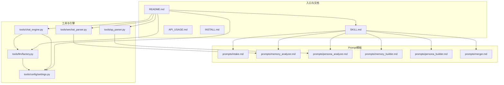
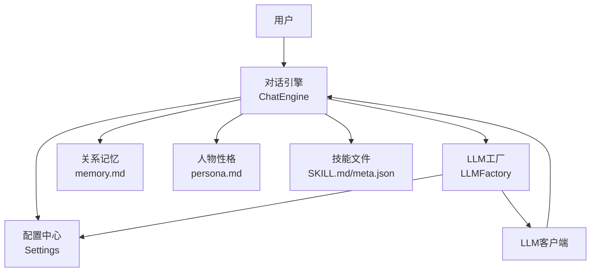
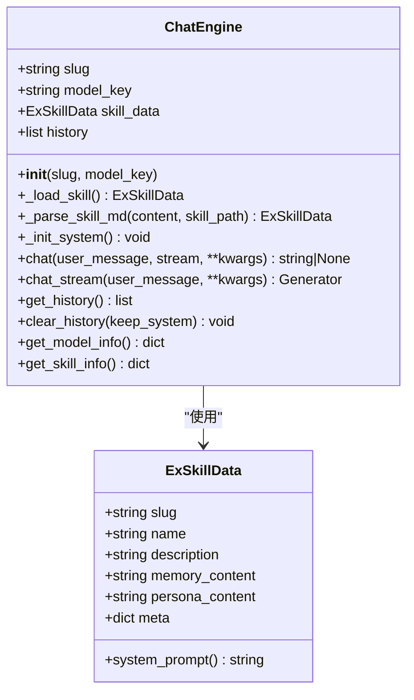
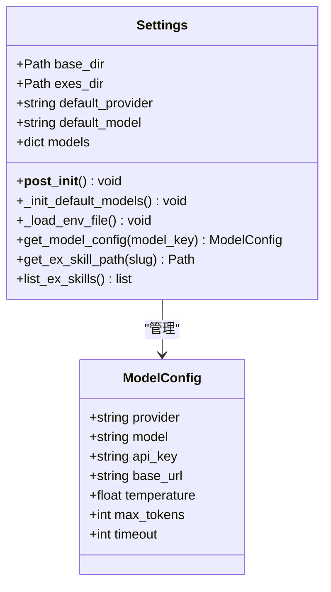
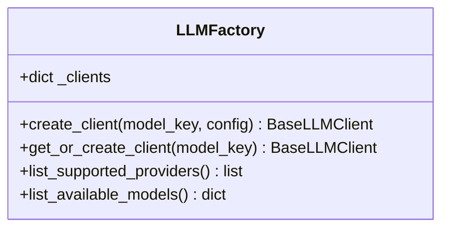
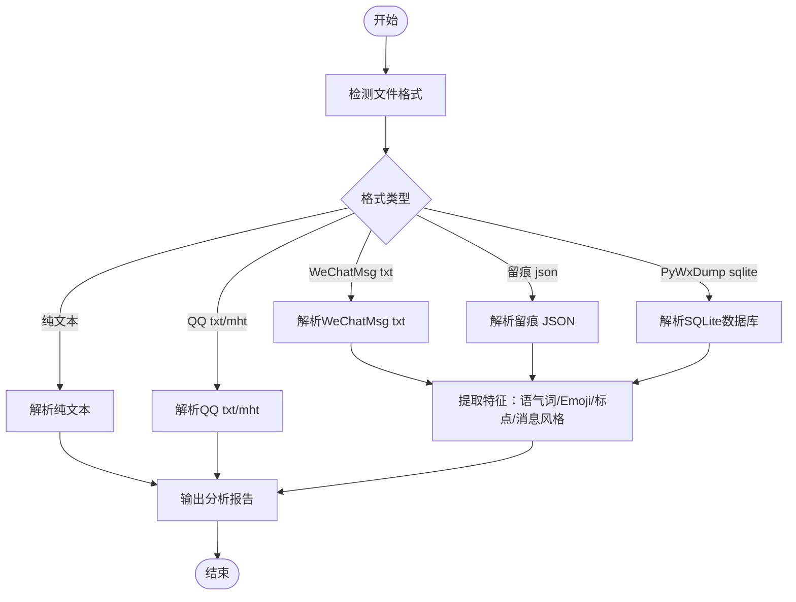
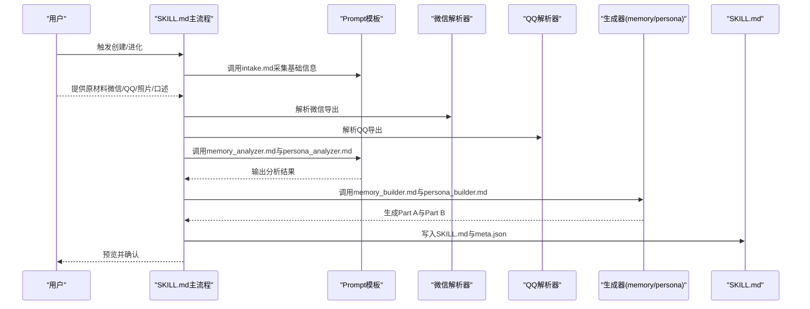
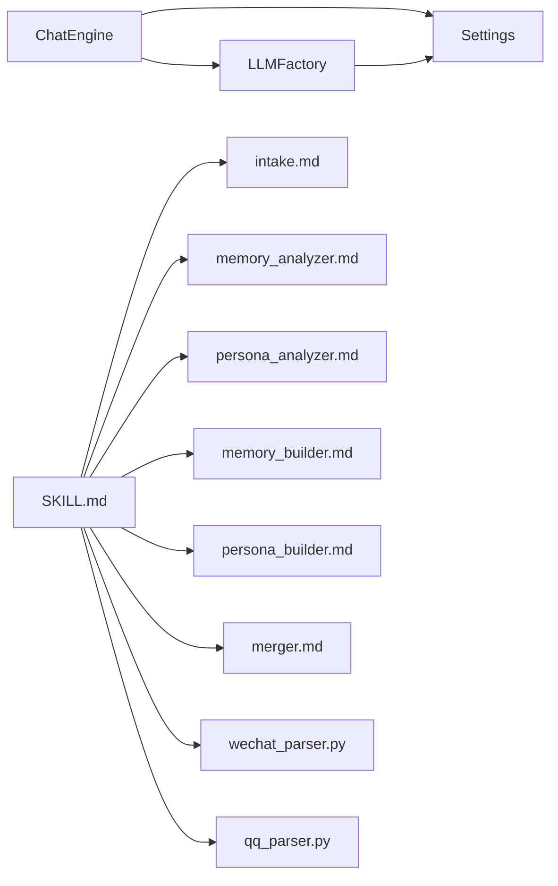

# 项目概述

<cite>
**本文引用的文件**
- [README.md](file://README.md)
- [SKILL.md](file://SKILL.md)
- [API_USAGE.md](file://API_USAGE.md)
- [INSTALL.md](file://INSTALL.md)
- [prompts/intake.md](file://prompts/intake.md)
- [prompts/memory_analyzer.md](file://prompts/memory_analyzer.md)
- [prompts/persona_analyzer.md](file://prompts/persona_analyzer.md)
- [prompts/memory_builder.md](file://prompts/memory_builder.md)
- [prompts/persona_builder.md](file://prompts/persona_builder.md)
- [prompts/merger.md](file://prompts/merger.md)
- [tools/chat_engine.py](file://tools/chat_engine.py)
- [tools/config/settings.py](file://tools/config/settings.py)
- [tools/llm/factory.py](file://tools/llm/factory.py)
- [tools/wechat_parser.py](file://tools/wechat_parser.py)
- [tools/qq_parser.py](file://tools/qq_parser.py)
</cite>

## 目录
1. [简介](#简介)
2. [项目结构](#项目结构)
3. [核心组件](#核心组件)
4. [架构总览](#架构总览)
5. [详细组件分析](#详细组件分析)
6. [依赖分析](#依赖分析)
7. [性能考虑](#性能考虑)
8. [故障排查指南](#故障排查指南)
9. [结论](#结论)
10. [附录](#附录)

## 简介
前任.skill 的核心价值主张是：将个人前任关系记忆转化为可对话的AI技能。项目通过解析微信聊天记录、QQ消息、照片、社交媒体截图等多源数据，构建“关系记忆（Part A）+ 人物性格（Part B）”的双层架构，形成一个“像ta一样”的AI角色。该角色既能在日常聊天中自然回应，又能通过“回忆模式”唤起共同经历，或仅以“性格模式”呈现ta的说话风格与情感表达。

项目强调：
- 以真实数据为依据，尊重记忆的真实性与完整性
- 采用双层架构：Part A（关系记忆）提供事实性上下文，Part B（人物性格）提供行为与风格规则
- 支持多模型与本地推理（OpenAI、Claude、Gemini、通义千问、Ollama等）
- 遵循AgentSkills开放标准，兼容Claude Code/OpenClaw
- 提供版本管理与对话纠正能力，支持持续进化

## 项目结构
项目采用模块化组织，围绕“对话引擎 + 配置管理 + LLM客户端 + 数据解析器 + Prompt模板”展开，同时提供独立运行入口与Claude Code技能入口。

图表来源
- [README.md:235-275](file://README.md#L235-L275)
- [SKILL.md:1-503](file://SKILL.md#L1-L503)
- [tools/chat_engine.py:1-284](file://tools/chat_engine.py#L1-L284)
- [tools/config/settings.py:1-225](file://tools/config/settings.py#L1-L225)
- [tools/llm/factory.py:1-82](file://tools/llm/factory.py#L1-L82)
- [tools/wechat_parser.py:1-251](file://tools/wechat_parser.py#L1-L251)
- [tools/qq_parser.py:1-130](file://tools/qq_parser.py#L1-L130)

章节来源
- [README.md:235-275](file://README.md#L235-L275)
- [SKILL.md:1-503](file://SKILL.md#L1-L503)

## 核心组件
- 对话引擎（ChatEngine）：负责加载Skill、构造系统提示、维护对话历史、调用LLM并返回结果；支持流式与非流式输出。
- 配置管理（Settings）：统一管理模型配置、默认Provider/Model、.env读取、技能目录枚举等。
- LLM工厂（LLMFactory）：根据provider/model创建对应客户端，支持OpenAI、Anthropic、Gemini、DashScope、Ollama等。
- 数据解析器：微信解析器（支持WeChatMsg、PyWxDump、留痕、纯文本）、QQ解析器（txt/mht）。
- Prompt模板：信息采集、关系记忆分析、人物性格分析、记忆与性格生成、增量merge、对话纠正处理。

章节来源
- [tools/chat_engine.py:1-284](file://tools/chat_engine.py#L1-L284)
- [tools/config/settings.py:1-225](file://tools/config/settings.py#L1-L225)
- [tools/llm/factory.py:1-82](file://tools/llm/factory.py#L1-L82)
- [tools/wechat_parser.py:1-251](file://tools/wechat_parser.py#L1-L251)
- [tools/qq_parser.py:1-130](file://tools/qq_parser.py#L1-L130)
- [prompts/intake.md:1-88](file://prompts/intake.md#L1-L88)
- [prompts/memory_analyzer.md:1-95](file://prompts/memory_analyzer.md#L1-L95)
- [prompts/persona_analyzer.md:1-92](file://prompts/persona_analyzer.md#L1-L92)
- [prompts/memory_builder.md:1-122](file://prompts/memory_builder.md#L1-L122)
- [prompts/persona_builder.md:1-129](file://prompts/persona_builder.md#L1-L129)
- [prompts/merger.md:1-45](file://prompts/merger.md#L1-L45)

## 架构总览
项目采用“双层架构 + Prompt工程 + 多模型适配”的设计思路：
- 双层架构：Part A（关系记忆）提供事实性上下文，Part B（人物性格）提供行为与风格规则；运行时先由Part B判断态度与风格，再由Part A补充真实记忆。
- Prompt工程：通过结构化的Prompt模板完成信息采集、分析、生成与增量merge，保证输出一致性与可解释性。
- 多模型适配：通过工厂模式与配置中心，统一接入不同Provider与模型，支持本地Ollama与云端API。

图表来源
- [tools/chat_engine.py:17-180](file://tools/chat_engine.py#L17-L180)
- [tools/config/settings.py:38-191](file://tools/config/settings.py#L38-L191)
- [tools/llm/factory.py:14-63](file://tools/llm/factory.py#L14-L63)
- [SKILL.md:303-341](file://SKILL.md#L303-L341)

章节来源
- [tools/chat_engine.py:17-180](file://tools/chat_engine.py#L17-L180)
- [tools/config/settings.py:38-191](file://tools/config/settings.py#L38-L191)
- [tools/llm/factory.py:14-63](file://tools/llm/factory.py#L14-L63)
- [SKILL.md:303-341](file://SKILL.md#L303-L341)

## 详细组件分析

### 对话引擎（ChatEngine）
- 职责：加载Skill（SKILL.md或分离的memory.md与persona.md），拼装系统提示（包含Part A与Part B），维护对话历史，调用LLM并返回结果。
- 关键点：
  - 系统提示包含运行规则（如Layer 0硬规则、先Part B后Part A等），确保输出符合预期风格与边界。
  - 支持非流式与流式输出，便于实时交互。
  - 提供历史清理、模型信息查询、Skill信息查询等辅助能力。

图表来源
- [tools/chat_engine.py:17-180](file://tools/chat_engine.py#L17-L180)

章节来源
- [tools/chat_engine.py:17-180](file://tools/chat_engine.py#L17-L180)

### 配置管理（Settings）
- 职责：统一管理模型配置（provider/model/api_key/base_url/temperature/max_tokens），加载.env文件，列举已创建的前任Skill。
- 关键点：
  - 默认模型集合覆盖主流Provider；支持从环境变量自动注入API Key。
  - 支持本地Ollama模型动态扩展（通过环境变量控制）。
  - 提供模型配置查询与Skill目录枚举。

图表来源
- [tools/config/settings.py:12-191](file://tools/config/settings.py#L12-L191)

章节来源
- [tools/config/settings.py:12-191](file://tools/config/settings.py#L12-L191)

### LLM工厂（LLMFactory）
- 职责：根据provider/model创建对应客户端，支持单例缓存；提供支持的Provider与模型列表。
- 关键点：
  - provider映射到具体客户端类（OpenAI、Anthropic、Gemini、DashScope、Ollama）。
  - 支持传入ModelConfig或model_key字符串创建客户端。

图表来源
- [tools/llm/factory.py:14-63](file://tools/llm/factory.py#L14-L63)

章节来源
- [tools/llm/factory.py:14-63](file://tools/llm/factory.py#L14-L63)

### 数据解析器（微信/QQ）
- 微信解析器：支持WeChatMsg（txt/html/csv）、留痕（json）、PyWxDump（sqlite）、纯文本；自动检测格式，提取高频语气词、Emoji、标点习惯、消息风格等。
- QQ解析器：支持txt与mht（HTML）格式，提取消息样本与原始文本。

图表来源
- [tools/wechat_parser.py:24-177](file://tools/wechat_parser.py#L24-L177)
- [tools/qq_parser.py:19-90](file://tools/qq_parser.py#L19-L90)

章节来源
- [tools/wechat_parser.py:24-177](file://tools/wechat_parser.py#L24-L177)
- [tools/qq_parser.py:19-90](file://tools/qq_parser.py#L19-L90)

### Prompt模板与生成流程
- 信息采集：通过intake.md引导用户提供代号、基本信息、性格画像。
- 关系记忆分析：基于memory_analyzer.md提取关系时间线、日常模式、共同经历、争吵与甜蜜档案、分手相关等。
- 人物性格分析：基于persona_analyzer.md提取说话风格、情感表达模式、依恋类型、决策模式、人际行为等，并将标签翻译为具体行为规则。
- 生成与预览：memory_builder.md与persona_builder.md分别生成Part A与Part B内容，SKILL.md整合两者并输出运行规则。
- 增量merge：merger.md定义增量追加策略，避免覆盖既有结论，支持冲突标注与证据升级。

图表来源
- [SKILL.md:69-356](file://SKILL.md#L69-L356)
- [prompts/intake.md:1-88](file://prompts/intake.md#L1-L88)
- [prompts/memory_analyzer.md:1-95](file://prompts/memory_analyzer.md#L1-L95)
- [prompts/persona_analyzer.md:1-92](file://prompts/persona_analyzer.md#L1-L92)
- [prompts/memory_builder.md:1-122](file://prompts/memory_builder.md#L1-L122)
- [prompts/persona_builder.md:1-129](file://prompts/persona_builder.md#L1-L129)
- [tools/wechat_parser.py:180-251](file://tools/wechat_parser.py#L180-L251)
- [tools/qq_parser.py:93-130](file://tools/qq_parser.py#L93-L130)

章节来源
- [SKILL.md:69-356](file://SKILL.md#L69-L356)
- [prompts/intake.md:1-88](file://prompts/intake.md#L1-L88)
- [prompts/memory_analyzer.md:1-95](file://prompts/memory_analyzer.md#L1-L95)
- [prompts/persona_analyzer.md:1-92](file://prompts/persona_analyzer.md#L1-L92)
- [prompts/memory_builder.md:1-122](file://prompts/memory_builder.md#L1-L122)
- [prompts/persona_builder.md:1-129](file://prompts/persona_builder.md#L1-L129)
- [tools/wechat_parser.py:180-251](file://tools/wechat_parser.py#L180-L251)
- [tools/qq_parser.py:93-130](file://tools/qq_parser.py#L93-L130)

## 依赖分析
- 组件耦合：
  - ChatEngine依赖Settings与LLMFactory；Settings管理模型配置；LLMFactory按provider创建客户端。
  - SKILL.md主流程依赖多个Prompt模板与解析器；解析器输出供模板分析与生成。
- 外部依赖：
  - 第三方LLM API（OpenAI、Anthropic、Google、DashScope）与本地Ollama。
  - Pillow（可选，用于照片EXIF读取）。

图表来源
- [tools/chat_engine.py:17-180](file://tools/chat_engine.py#L17-L180)
- [tools/config/settings.py:38-191](file://tools/config/settings.py#L38-L191)
- [tools/llm/factory.py:14-63](file://tools/llm/factory.py#L14-L63)
- [SKILL.md:69-356](file://SKILL.md#L69-L356)
- [tools/wechat_parser.py:1-251](file://tools/wechat_parser.py#L1-L251)
- [tools/qq_parser.py:1-130](file://tools/qq_parser.py#L1-L130)

章节来源
- [tools/chat_engine.py:17-180](file://tools/chat_engine.py#L17-L180)
- [tools/config/settings.py:38-191](file://tools/config/settings.py#L38-L191)
- [tools/llm/factory.py:14-63](file://tools/llm/factory.py#L14-L63)
- [SKILL.md:69-356](file://SKILL.md#L69-L356)
- [tools/wechat_parser.py:1-251](file://tools/wechat_parser.py#L1-L251)
- [tools/qq_parser.py:1-130](file://tools/qq_parser.py#L1-L130)

## 性能考虑
- 模型选择：根据需求平衡质量与成本，必要时降低temperature或max_tokens以提升稳定性与响应速度。
- 本地推理：使用Ollama可在本地进行推理，减少网络延迟与隐私风险。
- 数据规模：解析器对大体量文本进行统计分析，注意I/O与内存占用；建议分批处理与缓存中间结果。
- 流式输出：启用流式输出可改善交互体验，但需注意下游处理的吞吐能力。

## 故障排查指南
- 找不到前任Skill：确认Skill目录存在且包含SKILL.md或memory.md与persona.md。
- API Key无效：检查环境变量或.env文件是否正确设置；确认对应Provider的Key已配置。
- Ollama连接失败：确保Ollama服务已启动，或检查base_url与端口配置。
- 依赖缺失：安装requirements.txt中声明的依赖（如Pillow用于照片EXIF读取）。

章节来源
- [API_USAGE.md:140-162](file://API_USAGE.md#L140-L162)
- [INSTALL.md:84-97](file://INSTALL.md#L84-L97)

## 结论
前任.skill通过“双层架构 + Prompt工程 + 多模型适配”，将个人关系记忆转化为可对话的AI技能。它不仅具备良好的可解释性与可控性，还提供了版本管理与对话纠正能力，支持持续进化。项目遵循AgentSkills开放标准，兼容Claude Code与OpenClaw，既适合初学者快速上手，也为有经验的开发者提供了清晰的扩展路径。

## 附录
- 使用方式：
  - Claude Code：通过SKILL.md触发创建与对话，支持/list-exes、/{slug}、/{slug}-memory、/{slug}-persona、/ex-rollback、/delete-ex、/let-go等命令。
  - 独立运行：通过chat.py支持多模型与命令行参数，支持流式输出、历史清理、模型信息查询等。
- 数据源与标签：
  - 数据源：微信聊天记录（WeChatMsg/PyWxDump/留痕）、QQ聊天记录、社交媒体截图、照片（含EXIF）、口述/粘贴。
  - 标签：依恋类型、爱的语言、性格标签、MBTI、星座等，用于指导行为规则翻译与风格建模。

章节来源
- [README.md:48-144](file://README.md#L48-L144)
- [README.md:192-233](file://README.md#L192-L233)
- [SKILL.md:38-51](file://SKILL.md#L38-L51)
- [API_USAGE.md:77-98](file://API_USAGE.md#L77-L98)