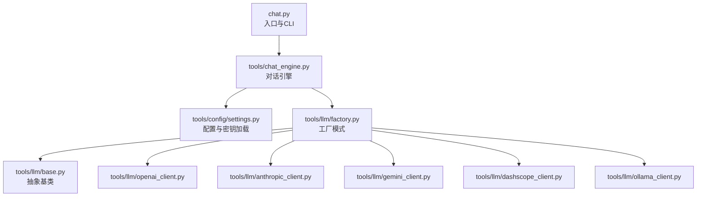
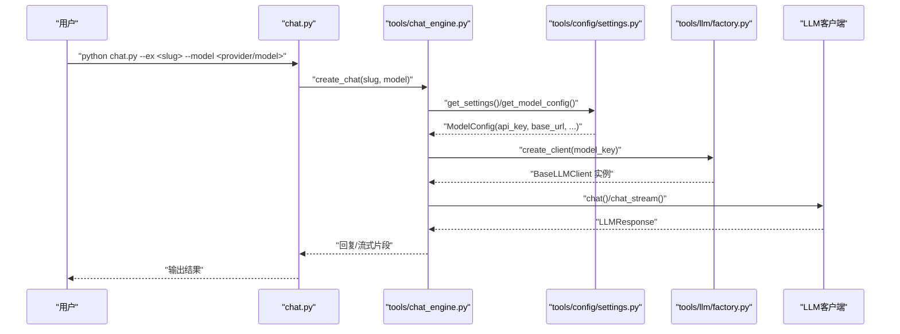
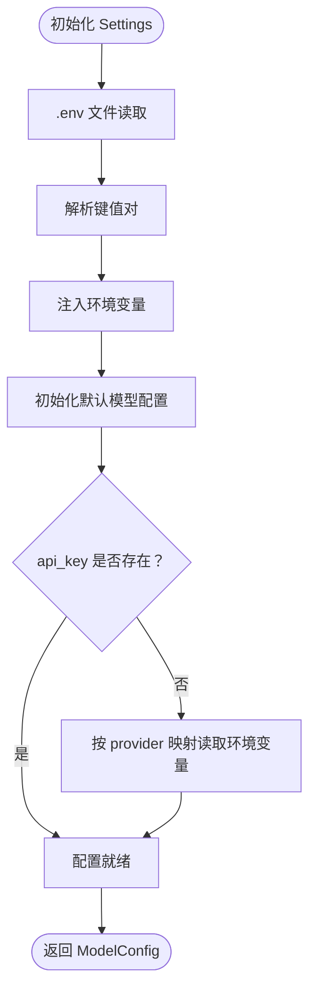
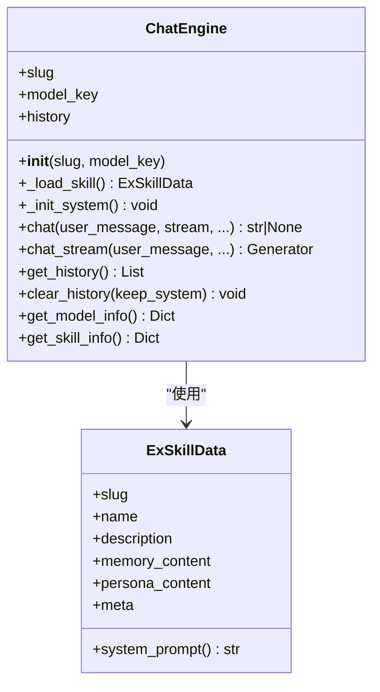
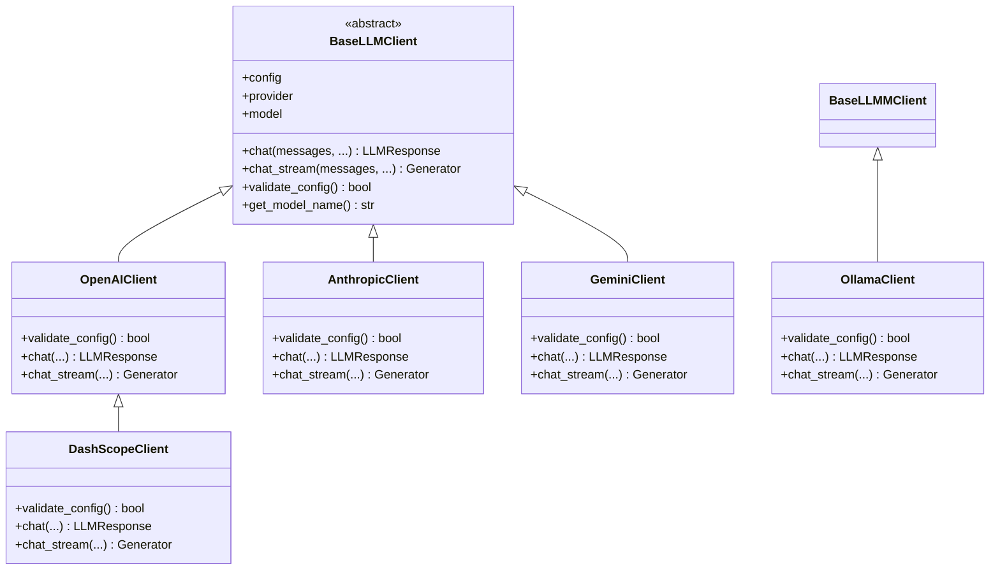
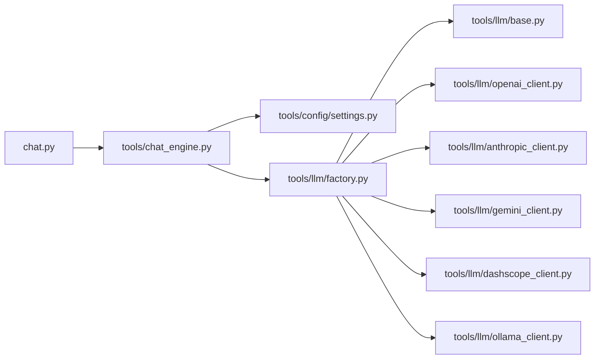

# 安全与合规

<cite>
**本文引用的文件**
- [README.md](file://README.md)
- [INSTALL.md](file://INSTALL.md)
- [requirements.txt](file://requirements.txt)
- [chat.py](file://chat.py)
- [tools/config/settings.py](file://tools/config/settings.py)
- [tools/chat_engine.py](file://tools/chat_engine.py)
- [tools/llm/factory.py](file://tools/llm/factory.py)
- [tools/llm/base.py](file://tools/llm/base.py)
- [tools/llm/openai_client.py](file://tools/llm/openai_client.py)
- [tools/llm/anthropic_client.py](file://tools/llm/anthropic_client.py)
- [tools/llm/gemini_client.py](file://tools/llm/gemini_client.py)
- [tools/llm/dashscope_client.py](file://tools/llm/dashscope_client.py)
- [tools/llm/ollama_client.py](file://tools/llm/ollama_client.py)
</cite>

## 目录
1. [引言](#引言)
2. [项目结构](#项目结构)
3. [核心组件](#核心组件)
4. [架构总览](#架构总览)
5. [详细组件分析](#详细组件分析)
6. [依赖分析](#依赖分析)
7. [性能考虑](#性能考虑)
8. [故障排查指南](#故障排查指南)
9. [结论](#结论)
10. [附录](#附录)

## 引言
本文件聚焦于“安全与合规”主题，围绕本项目在数据隐私保护、访问控制、API密钥管理、环境变量与配置文件安全、用户数据处理合规性（如GDPR相关实践）、安全审计与异常检测、威胁防护、漏洞扫描与安全测试流程、应急响应预案等方面进行系统化梳理与建议。由于仓库中未包含显式的加密实现、访问控制与审计日志模块，本文在现有代码基础上提出可落地的安全加固与合规建议，并明确指出需要补充的实现位置。

## 项目结构
项目采用“入口脚本 + 工具模块 + LLM客户端”的分层组织方式。与安全相关的关键路径包括：
- 入口与CLI：chat.py
- 配置与密钥管理：tools/config/settings.py
- 对话引擎：tools/chat_engine.py
- LLM工厂与客户端：tools/llm/*（openai、anthropic、gemini、dashscope、ollama、base）

图表来源
- [chat.py:128-201](file://chat.py#L128-L201)
- [tools/chat_engine.py:60-284](file://tools/chat_engine.py#L60-L284)
- [tools/config/settings.py:38-225](file://tools/config/settings.py#L38-L225)
- [tools/llm/factory.py:14-82](file://tools/llm/factory.py#L14-L82)

章节来源
- [README.md:281-321](file://README.md#L281-L321)
- [chat.py:12-22](file://chat.py#L12-L22)

## 核心组件
- 配置与密钥管理：集中于settings.py，负责从环境变量、.env文件与默认配置中加载模型与API密钥；支持从环境变量自动补全缺失的API Key。
- 对话引擎：封装系统提示、历史消息、流式/非流式对话；负责加载Skill数据并调用LLM客户端。
- LLM工厂：根据provider选择具体客户端，统一对外接口；支持OpenAI、Anthropic、Gemini、DashScope、Ollama等。
- LLM客户端：各厂商API适配层，负责实际请求与响应封装；Ollama客户端支持本地HTTP调用。

章节来源
- [tools/config/settings.py:12-225](file://tools/config/settings.py#L12-L225)
- [tools/chat_engine.py:17-284](file://tools/chat_engine.py#L17-L284)
- [tools/llm/factory.py:14-82](file://tools/llm/factory.py#L14-L82)
- [tools/llm/base.py:8-68](file://tools/llm/base.py#L8-L68)

## 架构总览
下图展示从CLI到对话引擎再到LLM客户端的整体调用链路，以及密钥加载与配置注入的关键节点。

图表来源
- [chat.py:128-196](file://chat.py#L128-L196)
- [tools/chat_engine.py:60-204](file://tools/chat_engine.py#L60-L204)
- [tools/config/settings.py:162-190](file://tools/config/settings.py#L162-L190)
- [tools/llm/factory.py:23-56](file://tools/llm/factory.py#L23-L56)

## 详细组件分析

### 配置与密钥管理（settings.py）
- 环境变量优先：若未显式提供api_key，将按provider映射自动从环境变量读取。
- .env文件支持：启动时读取根目录.env文件，逐行解析键值并注入环境变量，随后重新初始化模型配置。
- 默认模型与本地模型：内置主流云端模型配置，并支持从环境变量动态扩展Ollama本地模型。
- 访问控制：当前未实现基于角色/权限的访问控制，建议在后续版本中引入认证与授权中间件。

图表来源
- [tools/config/settings.py:148-160](file://tools/config/settings.py#L148-L160)
- [tools/config/settings.py:23-36](file://tools/config/settings.py#L23-L36)

章节来源
- [tools/config/settings.py:12-225](file://tools/config/settings.py#L12-L225)
- [README.md:126-147](file://README.md#L126-L147)

### 对话引擎（chat_engine.py）
- 系统提示构建：从Skill文件（SKILL.md或分离的memory/persona）抽取Part A/B与meta，拼装系统提示。
- 历史管理：维护消息历史，支持清空与保留系统消息。
- 客户端调用：通过工厂创建具体LLM客户端，支持流式与非流式两种输出模式。

图表来源
- [tools/chat_engine.py:17-83](file://tools/chat_engine.py#L17-L83)
- [tools/chat_engine.py:181-228](file://tools/chat_engine.py#L181-L228)

章节来源
- [tools/chat_engine.py:17-284](file://tools/chat_engine.py#L17-L284)

### LLM工厂与客户端（factory/base/openai/anthropic/gemini/dashscope/ollama）
- 工厂模式：根据provider映射到具体客户端类，支持单例缓存。
- 抽象基类：统一chat与chat_stream接口，便于扩展与替换。
- 客户端实现：
  - OpenAI/Gemini/DashScope：基于官方SDK，支持参数透传与usage统计。
  - Anthropic：消息格式转换，支持system参数。
  - DashScope：继承OpenAI客户端并设置兼容端点。
  - Ollama：本地HTTP调用，支持校验服务可用性与流式输出。

图表来源
- [tools/llm/base.py:27-68](file://tools/llm/base.py#L27-L68)
- [tools/llm/openai_client.py:14-93](file://tools/llm/openai_client.py#L14-L93)
- [tools/llm/anthropic_client.py:13-99](file://tools/llm/anthropic_client.py#L13-L99)
- [tools/llm/gemini_client.py:13-119](file://tools/llm/gemini_client.py#L13-L119)
- [tools/llm/dashscope_client.py:12-67](file://tools/llm/dashscope_client.py#L12-L67)
- [tools/llm/ollama_client.py:11-126](file://tools/llm/ollama_client.py#L11-L126)

章节来源
- [tools/llm/factory.py:14-82](file://tools/llm/factory.py#L14-L82)
- [tools/llm/base.py:8-68](file://tools/llm/base.py#L8-L68)

### API密钥管理与环境变量安全
- 当前实现：支持从环境变量自动补全API Key；.env文件解析后注入环境变量。
- 安全建议：
  - 限制密钥文件权限：.env/.env.example仅允许当前用户读写。
  - 最小权限原则：为不同供应商分配独立API Key，定期轮换。
  - 禁止日志泄露：避免在日志中输出API Key或敏感上下文。
  - 多租户隔离：若扩展为多用户，需在入口处增加鉴权与Key绑定。

章节来源
- [tools/config/settings.py:148-160](file://tools/config/settings.py#L148-L160)
- [tools/config/settings.py:23-36](file://tools/config/settings.py#L23-L36)
- [README.md:126-147](file://README.md#L126-L147)

### 用户数据处理与隐私保护
- 数据来源：微信、QQ、社交媒体、照片等，均在本地文件系统中处理，未上传至云端。
- 隐私建议：
  - 数据最小化：仅保留必要素材，避免冗余收集。
  - 脱敏策略：对识别性信息（如手机号、微信号）在生成与存储前进行脱敏或遮蔽。
  - 存储加密：对exes目录下的Skill文件进行本地磁盘加密或容器级加密。
  - 访问控制：为exes目录设置严格权限，仅允许当前用户访问。

章节来源
- [INSTALL.md:84-97](file://INSTALL.md#L84-L97)

### 合规性要求（GDPR相关实践）
- 同意机制：在创建Skill前明确告知数据处理目的与范围，并获得用户同意。
- 最小化原则：仅处理实现功能所必需的数据，避免过度收集。
- 数据主体权利：提供删除（/delete-ex）与回滚（/ex-rollback）能力，满足用户撤回与修正需求。
- 数据留存：明确Skill生命周期与自动清理策略，避免长期无期限存储。

章节来源
- [INSTALL.md:92-96](file://INSTALL.md#L92-L96)
- [README.md:19-21](file://README.md#L19-L21)

### 安全审计、异常检测与威胁防护
- 审计日志：建议在关键操作（创建/删除/回滚、模型切换、流式输出开始/结束）记录结构化日志。
- 异常检测：对API调用失败、超时、限流、网络不可达（Ollama）等情况进行告警。
- 威胁防护：限制CLI参数注入风险，对slug与model进行白名单校验；对流式输出进行速率限制与长度上限控制。

章节来源
- [tools/llm/ollama_client.py:21-32](file://tools/llm/ollama_client.py#L21-L32)
- [tools/chat_engine.py:181-228](file://tools/chat_engine.py#L181-L228)

### 漏洞扫描与安全测试流程
- 依赖安全：定期扫描requirements.txt中的依赖漏洞，及时升级。
- 配置安全：检查.env/.env.example权限与敏感信息暴露风险。
- API安全：对各LLM客户端的错误处理与重试策略进行压力测试，防止资源耗尽。

章节来源
- [requirements.txt:1-12](file://requirements.txt#L1-L12)
- [tools/llm/openai_client.py:35-39](file://tools/llm/openai_client.py#L35-L39)
- [tools/llm/anthropic_client.py:23-27](file://tools/llm/anthropic_client.py#L23-L27)
- [tools/llm/gemini_client.py:24-28](file://tools/llm/gemini_client.py#L24-L28)
- [tools/llm/dashscope_client.py:32-48](file://tools/llm/dashscope_client.py#L32-L48)

### 应急响应预案
- 密钥泄露：立即轮换API Key，撤销旧Key，检查日志是否存在泄露痕迹。
- 数据误删：利用版本管理（/ex-rollback）回滚到最近安全版本。
- 服务中断：对Ollama本地服务进行健康检查与重启；对云端API切换备用端点或降级策略。

章节来源
- [tools/llm/ollama_client.py:86-88](file://tools/llm/ollama_client.py#L86-L88)
- [INSTALL.md:92-96](file://INSTALL.md#L92-L96)

## 依赖分析
- CLI依赖：chat.py依赖tools/chat_engine与tools/llm/factory。
- 配置依赖：chat_engine依赖settings获取模型配置；factory依赖settings解析ModelConfig。
- 客户端依赖：各LLM客户端依赖对应SDK；DashScope继承OpenAI客户端并覆盖端点。

图表来源
- [chat.py:20-21](file://chat.py#L20-L21)
- [tools/chat_engine.py:12-14](file://tools/chat_engine.py#L12-L14)
- [tools/llm/factory.py:5-11](file://tools/llm/factory.py#L5-L11)

章节来源
- [chat.py:12-22](file://chat.py#L12-L22)
- [tools/chat_engine.py:60-83](file://tools/chat_engine.py#L60-L83)
- [tools/llm/factory.py:14-82](file://tools/llm/factory.py#L14-L82)

## 性能考虑
- 流式输出：在长对话中启用流式输出可提升感知延迟；注意对网络抖动与超时的处理。
- 客户端缓存：工厂层已实现客户端单例缓存，减少重复初始化成本。
- 本地模型：Ollama客户端需关注本地服务响应时间与并发限制。

章节来源
- [tools/llm/factory.py:58-63](file://tools/llm/factory.py#L58-L63)
- [tools/llm/ollama_client.py:89-126](file://tools/llm/ollama_client.py#L89-L126)

## 故障排查指南
- 缺少依赖：ImportError时提示安装对应SDK。
- API Key未配置：各客户端validate_config返回False，需检查环境变量或.env。
- Ollama服务不可达：ConnectionError提示服务地址与端口。
- 文件不存在：FileNotFoundError提示Skill路径不存在。

章节来源
- [chat.py:189-193](file://chat.py#L189-L193)
- [tools/llm/openai_client.py:22-23](file://tools/llm/openai_client.py#L22-L23)
- [tools/llm/anthropic_client.py:18-19](file://tools/llm/anthropic_client.py#L18-L19)
- [tools/llm/gemini_client.py:18-19](file://tools/llm/gemini_client.py#L18-L19)
- [tools/llm/dashscope_client.py:42-45](file://tools/llm/dashscope_client.py#L42-L45)
- [tools/llm/ollama_client.py:86-87](file://tools/llm/ollama_client.py#L86-L87)
- [tools/chat_engine.py:94-95](file://tools/chat_engine.py#L94-L95)

## 结论
本项目在数据本地化与多API支持方面具备良好基础，但在访问控制、加密存储、审计日志与合规流程上尚需补齐。建议优先实现密钥文件权限控制、系统化审计日志、最小化数据处理与用户同意机制，并建立完善的漏洞扫描与应急响应流程，以满足安全与合规要求。

## 附录
- 安装与使用参考：README.md与INSTALL.md
- 依赖清单：requirements.txt

章节来源
- [README.md:1-370](file://README.md#L1-L370)
- [INSTALL.md:1-97](file://INSTALL.md#L1-L97)
- [requirements.txt:1-12](file://requirements.txt#L1-L12)