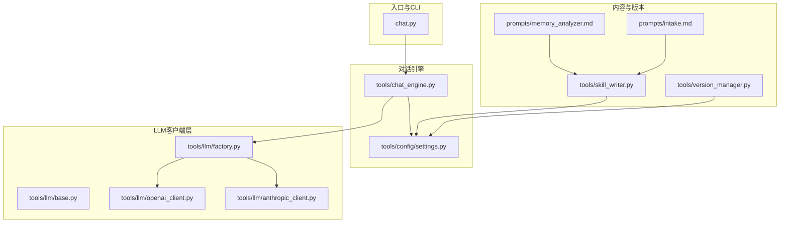
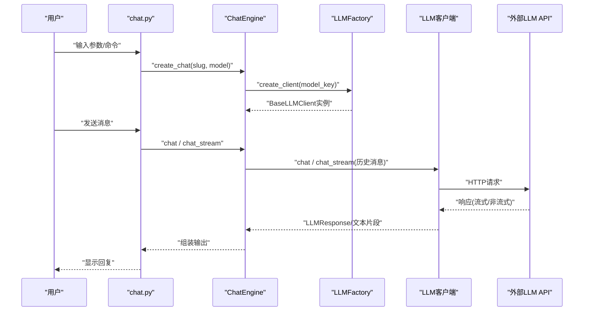
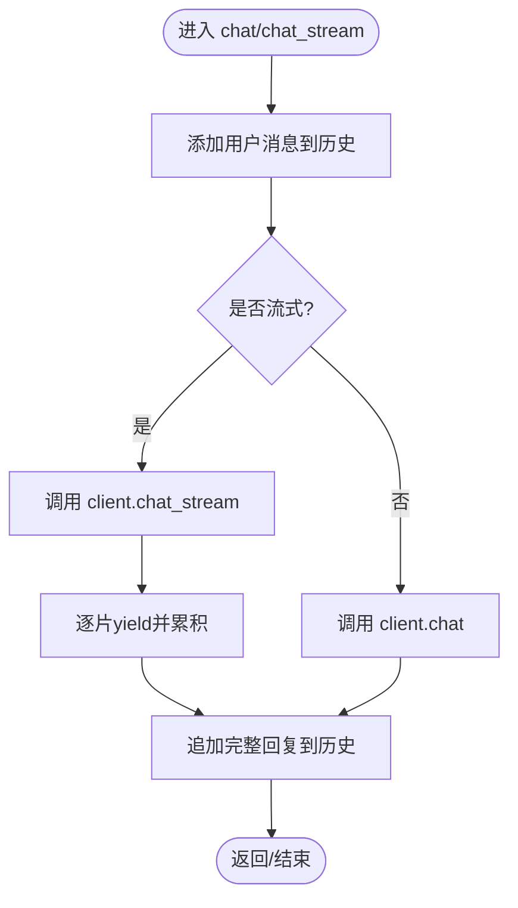
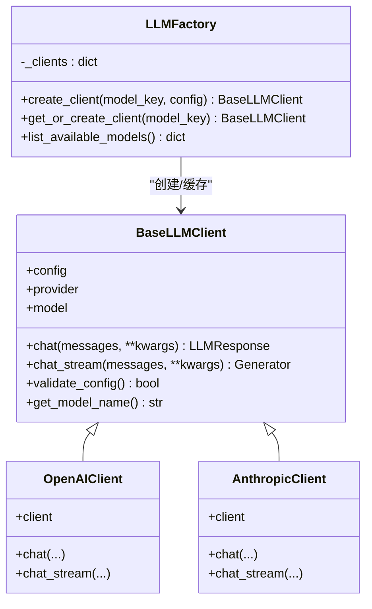
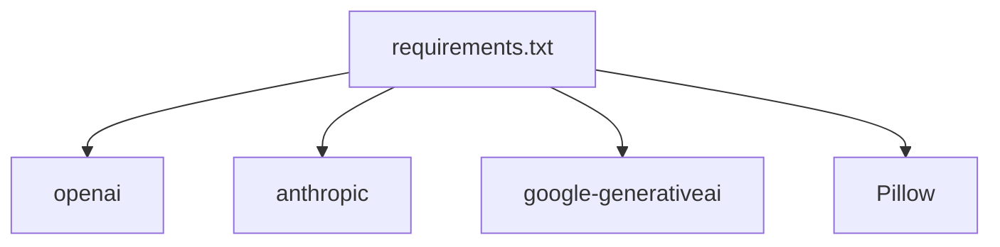

# 性能优化

<cite>
**本文引用的文件**
- [README.md](file://README.md)
- [API_USAGE.md](file://API_USAGE.md)
- [INSTALL.md](file://INSTALL.md)
- [chat.py](file://chat.py)
- [tools/chat_engine.py](file://tools/chat_engine.py)
- [tools/config/settings.py](file://tools/config/settings.py)
- [tools/llm/base.py](file://tools/llm/base.py)
- [tools/llm/factory.py](file://tools/llm/factory.py)
- [tools/llm/openai_client.py](file://tools/llm/openai_client.py)
- [tools/llm/anthropic_client.py](file://tools/llm/anthropic_client.py)
- [tools/skill_writer.py](file://tools/skill_writer.py)
- [tools/version_manager.py](file://tools/version_manager.py)
- [prompts/intake.md](file://prompts/intake.md)
- [prompts/memory_analyzer.md](file://prompts/memory_analyzer.md)
- [requirements.txt](file://requirements.txt)
</cite>

## 目录
1. [简介](#简介)
2. [项目结构](#项目结构)
3. [核心组件](#核心组件)
4. [架构总览](#架构总览)
5. [详细组件分析](#详细组件分析)
6. [依赖分析](#依赖分析)
7. [性能考虑](#性能考虑)
8. [故障排查指南](#故障排查指南)
9. [结论](#结论)
10. [附录](#附录)

## 简介
本文件聚焦于对话引擎与LLM客户端的性能优化，围绕内存管理、并发处理、响应时间优化展开；同时覆盖LLM客户端连接池管理、请求批处理与缓存机制的设计现状与改进建议；并针对大型技能文件的加载、分页与增量更新策略给出优化思路。此外，提供性能基准测试方法、监控指标收集与分析工具使用指南，以及可落地的配置调优参数与最佳实践。

## 项目结构
该项目采用“工具模块 + 配置 + Prompt模板”的分层组织方式，核心运行链路为：命令行入口 -> 对话引擎 -> LLM工厂 -> 具体LLM客户端 -> 外部API。Prompt模板与技能文件管理器负责内容生成与版本控制。

**图表来源**
- [chat.py:1-201](file://chat.py#L1-L201)
- [tools/chat_engine.py:1-284](file://tools/chat_engine.py#L1-L284)
- [tools/llm/factory.py:1-82](file://tools/llm/factory.py#L1-L82)
- [tools/llm/base.py:1-68](file://tools/llm/base.py#L1-L68)
- [tools/llm/openai_client.py:1-93](file://tools/llm/openai_client.py#L1-L93)
- [tools/llm/anthropic_client.py:1-99](file://tools/llm/anthropic_client.py#L1-L99)
- [tools/skill_writer.py:1-171](file://tools/skill_writer.py#L1-L171)
- [tools/version_manager.py:1-116](file://tools/version_manager.py#L1-L116)
- [prompts/memory_analyzer.md:1-95](file://prompts/memory_analyzer.md#L1-L95)
- [prompts/intake.md:1-88](file://prompts/intake.md#L1-L88)

**章节来源**
- [README.md:281-321](file://README.md#L281-L321)
- [API_USAGE.md:164-194](file://API_USAGE.md#L164-L194)

## 核心组件
- 命令行入口与交互：负责参数解析、技能列表、模型列表、流式/非流式对话与异常处理。
- 对话引擎：封装系统提示构造、历史消息管理、流式/非流式调用、模型与技能信息查询。
- LLM工厂与客户端：统一创建不同Provider的客户端，支持单例缓存；客户端抽象定义通用接口。
- 配置系统：集中管理模型配置、默认Provider/模型、环境变量与.env注入。
- 技能文件管理：生成SKILL.md、目录初始化、版本归档与回滚。
- Prompt模板：信息录入与关系记忆分析，支撑高质量内容输入。

**章节来源**
- [chat.py:128-201](file://chat.py#L128-L201)
- [tools/chat_engine.py:60-284](file://tools/chat_engine.py#L60-L284)
- [tools/llm/factory.py:14-82](file://tools/llm/factory.py#L14-L82)
- [tools/config/settings.py:38-225](file://tools/config/settings.py#L38-L225)
- [tools/skill_writer.py:18-171](file://tools/skill_writer.py#L18-L171)
- [tools/version_manager.py:16-116](file://tools/version_manager.py#L16-L116)
- [prompts/intake.md:1-88](file://prompts/intake.md#L1-L88)
- [prompts/memory_analyzer.md:1-95](file://prompts/memory_analyzer.md#L1-L95)

## 架构总览
对话流程从CLI入口进入，经由对话引擎构造系统提示与历史消息，再通过工厂选择具体LLM客户端，最终调用外部API。返回结果以非流式或流式方式回显至终端。

**图表来源**
- [chat.py:72-126](file://chat.py#L72-L126)
- [tools/chat_engine.py:181-228](file://tools/chat_engine.py#L181-L228)
- [tools/llm/factory.py:23-56](file://tools/llm/factory.py#L23-L56)
- [tools/llm/openai_client.py:41-93](file://tools/llm/openai_client.py#L41-L93)
- [tools/llm/anthropic_client.py:53-99](file://tools/llm/anthropic_client.py#L53-L99)

## 详细组件分析

### 对话引擎（ChatEngine）
- 职责：加载技能文件、构造系统提示、维护历史消息、调用LLM、支持流式输出。
- 性能关注点：
  - 历史消息累积导致上下文增长，增加延迟与Token消耗。
  - 非流式等待完整响应，影响首字节延迟。
  - 系统提示重复拼接，存在字符串拼接成本。
- 优化建议：
  - 历史消息裁剪：基于最大上下文长度与Token预算进行滚动裁剪。
  - 流式优先：默认启用流式输出，降低感知延迟。
  - 系统提示缓存：对固定模板进行预编译与缓存，避免重复拼接。
  - 增量更新：仅在需要时重载SKILL.md，使用文件mtime判断。

**图表来源**
- [tools/chat_engine.py:181-228](file://tools/chat_engine.py#L181-L228)

**章节来源**
- [tools/chat_engine.py:60-284](file://tools/chat_engine.py#L60-L284)

### LLM工厂与客户端（LLMFactory/BaseLLMClient）
- 职责：按模型Key创建对应客户端；提供单例缓存；定义统一接口。
- 现状与优化：
  - 单例缓存：工厂内部维护客户端字典，避免重复初始化，减少连接与认证开销。
  - 抽象接口：统一chat/chat_stream，便于扩展与替换Provider。
  - 未见显式连接池：各Provider客户端在内部管理连接，需评估其并发与超时策略。

**图表来源**
- [tools/llm/base.py:27-68](file://tools/llm/base.py#L27-L68)
- [tools/llm/openai_client.py:14-93](file://tools/llm/openai_client.py#L14-L93)
- [tools/llm/anthropic_client.py:13-99](file://tools/llm/anthropic_client.py#L13-L99)
- [tools/llm/factory.py:14-82](file://tools/llm/factory.py#L14-L82)

**章节来源**
- [tools/llm/factory.py:14-82](file://tools/llm/factory.py#L14-L82)
- [tools/llm/base.py:1-68](file://tools/llm/base.py#L1-L68)

### 配置系统（Settings/ModelConfig）
- 职责：集中管理默认Provider/模型、环境变量与.env注入、模型配置查询。
- 性能关注点：
  - 默认模型与超时时间可直接影响延迟与稳定性。
  - Ollama本地模型可通过环境变量批量注入，减少硬编码。
- 优化建议：
  - 为不同Provider设置合理的timeout与max_tokens，避免长尾阻塞。
  - 将常用模型加入单例缓存，减少重复初始化。

**章节来源**
- [tools/config/settings.py:38-225](file://tools/config/settings.py#L38-L225)

### 技能文件管理与版本控制
- 组合SKILL.md：将memory与persona合并为单一入口，减少多次IO。
- 版本归档与回滚：支持按时间戳备份，便于快速恢复。
- 优化建议：
  - 大型技能文件采用分页读取与增量更新，避免一次性加载全部内容。
  - 使用文件变更检测（mtime/inode）决定是否重载。

**章节来源**
- [tools/skill_writer.py:68-144](file://tools/skill_writer.py#L68-L144)
- [tools/version_manager.py:16-116](file://tools/version_manager.py#L16-L116)

## 依赖分析
- 第三方依赖集中在LLM客户端库，OpenAI、Anthropic、Google Generative AI等。
- Pillow用于照片EXIF读取，非对话主链路，但涉及I/O与图像处理。

**图表来源**
- [requirements.txt:1-12](file://requirements.txt#L1-L12)

**章节来源**
- [requirements.txt:1-12](file://requirements.txt#L1-L12)

## 性能考虑

### 内存管理
- 历史消息累积：对话历史以Message列表保存，随会话增长而增大。建议：
  - 基于上下文长度与Token预算进行滚动裁剪，保留最近N条或最近K分钟的消息。
  - 将系统提示与固定模板缓存为不可变对象，避免重复拼接。
- 字符串与正则：系统提示构造与SKILL.md解析使用正则与字符串拼接，建议：
  - 预编译正则表达式，减少重复编译开销。
  - 使用模板引擎或预拼接字符串，降低运行时拼接成本。

**章节来源**
- [tools/chat_engine.py:173-179](file://tools/chat_engine.py#L173-L179)
- [tools/chat_engine.py:133-171](file://tools/chat_engine.py#L133-L171)

### 并发处理
- 当前实现为同步调用，未见显式并发池或异步框架。建议：
  - 对多轮对话或批量请求采用异步协程，配合连接池复用底层HTTP连接。
  - 为不同Provider设置独立并发上限，避免单Provider成为瓶颈。
- 工厂单例：已通过缓存减少重复初始化，建议进一步引入连接池与超时重试策略。

**章节来源**
- [tools/llm/factory.py:20-63](file://tools/llm/factory.py#L20-L63)

### 响应时间优化
- 首字节延迟（TTFT）：默认非流式需等待完整响应，建议：
  - 默认启用流式输出，边生成边显示，显著改善感知延迟。
  - 对短回复场景可考虑非流式以减少片段拼接开销。
- Token预算与超时：合理设置max_tokens与timeout，避免长尾请求拖慢整体吞吐。

**章节来源**
- [chat.py:72-126](file://chat.py#L72-L126)
- [tools/config/settings.py:12-36](file://tools/config/settings.py#L12-L36)

### LLM客户端连接池与请求批处理
- 现状：各Provider客户端在内部管理连接，未见显式连接池参数暴露。
- 建议：
  - 为OpenAI/Anthropic/Gemini客户端增加连接池参数（最大连接数、空闲回收、重试次数）。
  - 批处理：对多轮对话或批量生成请求进行合并，减少握手与网络开销。
  - 缓存：对相同输入的响应进行缓存（带失效策略），适用于重复对话或相似查询。

**章节来源**
- [tools/llm/openai_client.py:20-34](file://tools/llm/openai_client.py#L20-L34)
- [tools/llm/anthropic_client.py:16-22](file://tools/llm/anthropic_client.py#L16-L22)

### 大型技能文件加载优化
- 现状：优先读取SKILL.md，否则分别读取memory与persona文件，并读取meta.json。
- 优化：
  - 分页加载：将大型内容拆分为多个段落，按需加载。
  - 增量更新：仅在SKILL.md或meta.json变更时重新解析，使用文件mtime判断。
  - 缓存：对解析后的结构化内容进行缓存，避免重复解析。

**章节来源**
- [tools/chat_engine.py:89-131](file://tools/chat_engine.py#L89-L131)

### 性能基准测试方法
- 指标：
  - 首字节延迟（TTFT）、吞吐（RPS）、P50/P95/P99延迟、Token/秒、错误率。
- 场景：
  - 短回复（<100 tokens）、中等回复（100-500 tokens）、长回复（>500 tokens）。
  - 单用户与多用户并发（1/10/50并发）。
- 工具：
  - Locust/JMeter（负载测试）
  - wrk/ab（简单压测）
  - Python cProfile/pstats（热点分析）

**章节来源**
- [API_USAGE.md:77-98](file://API_USAGE.md#L77-L98)

### 监控指标与分析
- 指标：
  - 请求延迟、错误码分布、Token用量、并发数、队列长度。
- 工具：
  - Prometheus + Grafana（指标采集与可视化）
  - OpenTelemetry（分布式追踪）
  - 日志聚合（ELK/Fluentd）定位慢请求

**章节来源**
- [tools/llm/openai_client.py:60-71](file://tools/llm/openai_client.py#L60-L71)
- [tools/llm/anthropic_client.py:69-79](file://tools/llm/anthropic_client.py#L69-L79)

### 配置调优参数与最佳实践
- 模型参数：
  - temperature：0.3~1.0之间权衡创造性与稳定性。
  - max_tokens：依据预期回复长度设定，避免过大导致超时。
  - timeout：根据Provider SLA设置，建议10~60秒。
- 工厂与客户端：
  - get_or_create_client：利用单例缓存，减少重复初始化。
  - 连接池：为各Provider设置最大连接数与空闲回收策略。
- 对话引擎：
  - 默认启用流式输出，缩短感知延迟。
  - 历史消息裁剪：按上下文长度与Token预算滚动裁剪。

**章节来源**
- [tools/config/settings.py:12-36](file://tools/config/settings.py#L12-L36)
- [tools/llm/factory.py:58-63](file://tools/llm/factory.py#L58-L63)
- [chat.py:150-156](file://chat.py#L150-L156)

## 故障排查指南
- 找不到技能或文件读取失败：
  - 检查exes/{slug}目录是否存在SKILL.md或memory/persona文件与meta.json。
- API密钥错误或未配置：
  - 确认环境变量或.env文件中Provider对应的KEY已正确设置。
- Ollama连接失败：
  - 确认Ollama服务已启动，base_url与模型名称正确。
- 依赖缺失：
  - 安装对应Provider客户端库（openai、anthropic、google-generativeai）。

**章节来源**
- [chat.py:185-196](file://chat.py#L185-L196)
- [API_USAGE.md:140-162](file://API_USAGE.md#L140-L162)
- [INSTALL.md:84-97](file://INSTALL.md#L84-L97)

## 结论
本项目对话链路清晰，具备良好的扩展性与可维护性。当前性能优化重点在于：启用流式输出、裁剪历史消息、缓存系统提示与客户端实例、合理设置模型参数与超时、以及对大型技能文件进行分页与增量更新。通过上述措施，可在保证输出质量的同时显著提升响应速度与资源利用率。

## 附录
- Prompt模板与内容生成：信息录入与关系记忆分析模板为高质量输入提供指导，有助于减少后续LLM纠错与迭代成本。
- CLI使用：命令行参数支持模型切换、流式/非流式输出、温度与最大token设置，便于快速对比不同配置下的性能表现。

**章节来源**
- [prompts/intake.md:1-88](file://prompts/intake.md#L1-L88)
- [prompts/memory_analyzer.md:1-95](file://prompts/memory_analyzer.md#L1-L95)
- [API_USAGE.md:77-98](file://API_USAGE.md#L77-L98)