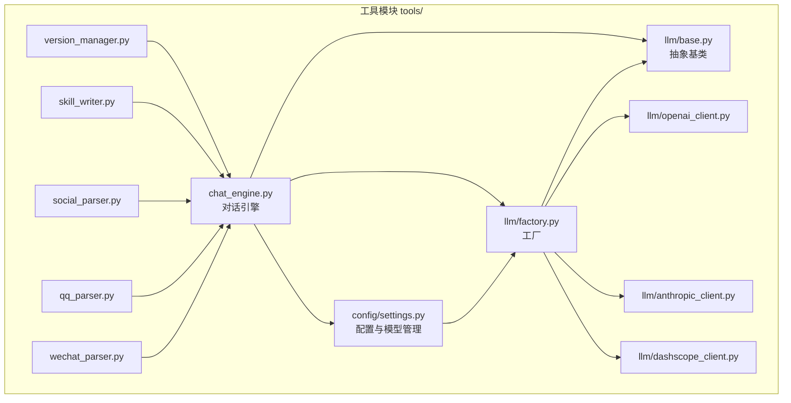
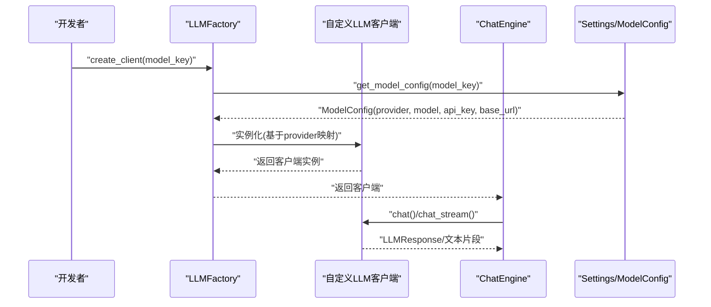
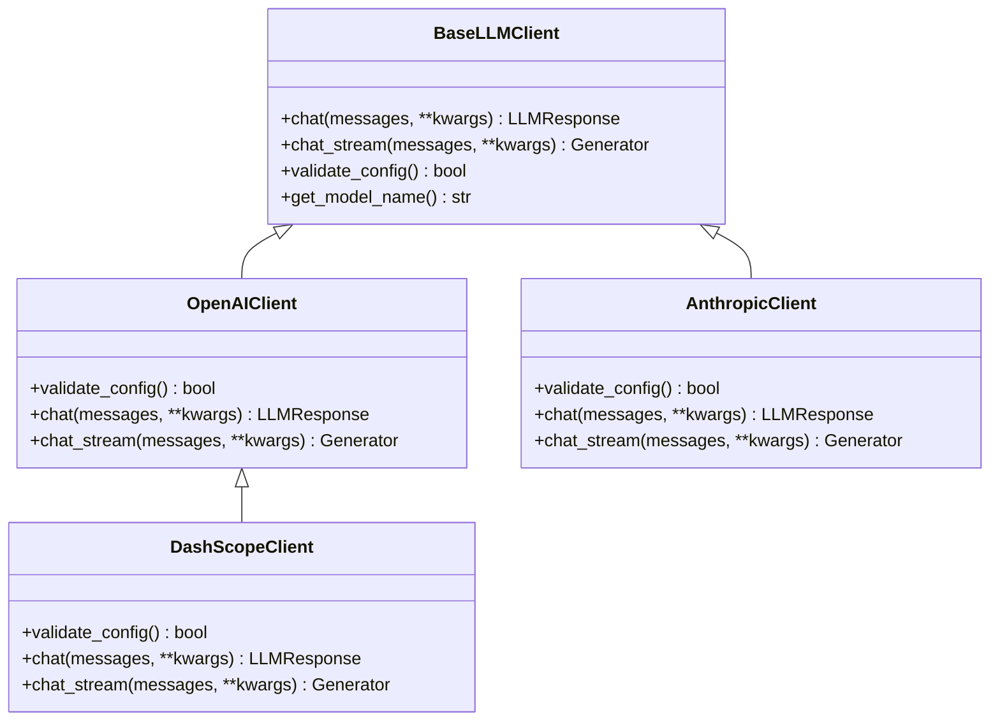
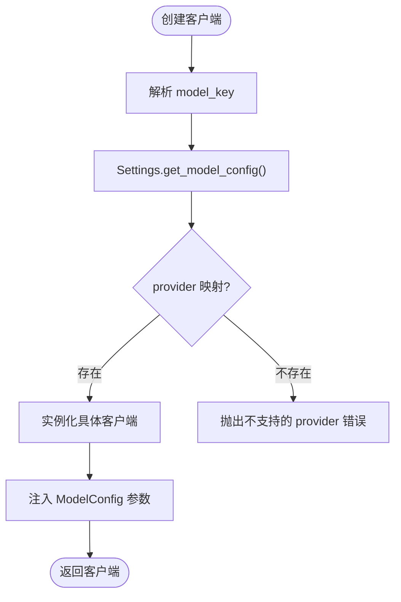
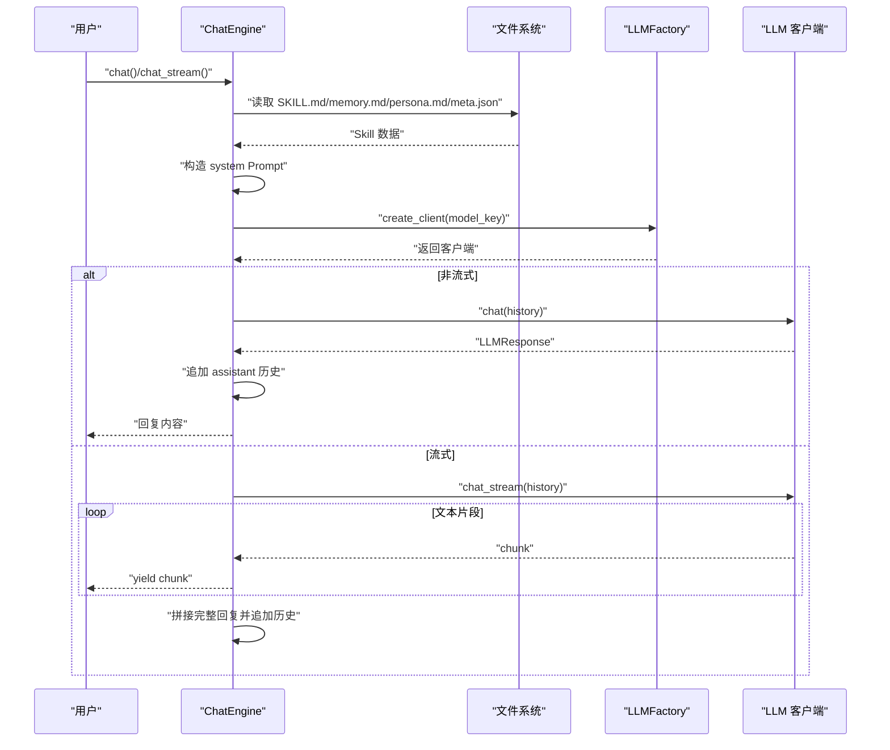
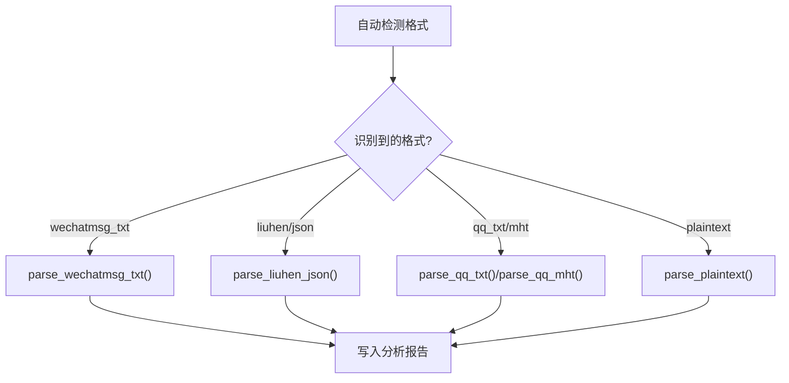

# 扩展开发

<cite>
**本文引用的文件**
- [README.md](file://README.md)
- [API_USAGE.md](file://API_USAGE.md)
- [requirements.txt](file://requirements.txt)
- [tools/chat_engine.py](file://tools/chat_engine.py)
- [tools/config/settings.py](file://tools/config/settings.py)
- [tools/llm/base.py](file://tools/llm/base.py)
- [tools/llm/factory.py](file://tools/llm/factory.py)
- [tools/llm/openai_client.py](file://tools/llm/openai_client.py)
- [tools/llm/anthropic_client.py](file://tools/llm/anthropic_client.py)
- [tools/llm/dashscope_client.py](file://tools/llm/dashscope_client.py)
- [tools/skill_writer.py](file://tools/skill_writer.py)
- [tools/version_manager.py](file://tools/version_manager.py)
- [tools/wechat_parser.py](file://tools/wechat_parser.py)
- [tools/qq_parser.py](file://tools/qq_parser.py)
- [tools/social_parser.py](file://tools/social_parser.py)
</cite>

## 目录
1. [简介](#简介)
2. [项目结构](#项目结构)
3. [核心组件](#核心组件)
4. [架构总览](#架构总览)
5. [详细组件分析](#详细组件分析)
6. [依赖分析](#依赖分析)
7. [性能考虑](#性能考虑)
8. [故障排查指南](#故障排查指南)
9. [结论](#结论)
10. [附录](#附录)

## 简介
本指南面向希望扩展该项目的开发者，涵盖以下主题：
- 开发自定义 LLM 客户端：实现 BaseLLMClient 接口、集成认证机制、制定错误处理策略
- 开发自定义数据解析器：新增格式支持、解析器注册与测试验证流程
- 插件系统设计模式、模块化架构与依赖注入思路
- 完整扩展示例代码路径、API 规范与兼容性保证策略
- 第三方服务集成方法与开源贡献指南

## 项目结构
项目采用“功能域 + 层次化”的组织方式：
- tools/：核心业务模块
  - config/：配置管理（环境变量、.env、模型配置）
  - llm/：LLM 客户端抽象与具体实现、工厂
  - 解析器：微信/QQ/社交媒体/照片分析工具
  - chat_engine.py：对话引擎，负责加载 Skill、构造系统 Prompt、调度 LLM 客户端
  - skill_writer.py：生成/合并 SKILL.md
  - version_manager.py：版本存档与回滚
- 根目录：README、API 使用说明、依赖清单

图表来源
- [tools/config/settings.py:1-225](file://tools/config/settings.py#L1-L225)
- [tools/llm/factory.py:1-82](file://tools/llm/factory.py#L1-L82)
- [tools/llm/base.py:1-68](file://tools/llm/base.py#L1-L68)
- [tools/llm/openai_client.py:1-93](file://tools/llm/openai_client.py#L1-L93)
- [tools/llm/anthropic_client.py:1-99](file://tools/llm/anthropic_client.py#L1-L99)
- [tools/llm/dashscope_client.py:1-67](file://tools/llm/dashscope_client.py#L1-L67)
- [tools/chat_engine.py:1-284](file://tools/chat_engine.py#L1-L284)
- [tools/wechat_parser.py:1-251](file://tools/wechat_parser.py#L1-L251)
- [tools/qq_parser.py:1-130](file://tools/qq_parser.py#L1-L130)
- [tools/social_parser.py:1-84](file://tools/social_parser.py#L1-L84)
- [tools/skill_writer.py:1-171](file://tools/skill_writer.py#L1-L171)
- [tools/version_manager.py:1-116](file://tools/version_manager.py#L1-L116)

章节来源
- [README.md:281-321](file://README.md#L281-L321)
- [API_USAGE.md:164-194](file://API_USAGE.md#L164-L194)

## 核心组件
- 抽象基类 BaseLLMClient：定义统一的 chat 与 chat_stream 接口，提供配置校验与模型名拼接能力
- LLMFactory：根据 provider/model 选择具体客户端，支持单例缓存与可用模型枚举
- Settings/ModelConfig：集中管理 API Key、base_url、温度、最大 token、超时等参数；支持从环境变量与 .env 注入
- ChatEngine：加载 SKILL.md 或分离的 memory/persona 文件，构造系统 Prompt，维护对话历史，委托 LLMFactory 获取客户端并发起请求
- 解析器：微信/QQ/社交媒体解析器，提供格式检测、消息抽取与统计分析
- 辅助工具：skill_writer 合并 SKILL.md；version_manager 版本备份与回滚

章节来源
- [tools/llm/base.py:27-68](file://tools/llm/base.py#L27-L68)
- [tools/llm/factory.py:14-82](file://tools/llm/factory.py#L14-L82)
- [tools/config/settings.py:12-225](file://tools/config/settings.py#L12-L225)
- [tools/chat_engine.py:60-284](file://tools/chat_engine.py#L60-L284)
- [tools/wechat_parser.py:24-251](file://tools/wechat_parser.py#L24-L251)
- [tools/qq_parser.py:19-130](file://tools/qq_parser.py#L19-L130)
- [tools/social_parser.py:17-84](file://tools/social_parser.py#L17-L84)
- [tools/skill_writer.py:68-171](file://tools/skill_writer.py#L68-L171)
- [tools/version_manager.py:16-116](file://tools/version_manager.py#L16-L116)

## 架构总览
下图展示了扩展开发的关键交互路径：新增 LLM 客户端通过工厂接入；新增解析器通过 ChatEngine 或独立脚本使用；配置系统统一注入 API Key 与模型参数。

图表来源
- [tools/llm/factory.py:22-56](file://tools/llm/factory.py#L22-L56)
- [tools/config/settings.py:162-190](file://tools/config/settings.py#L162-L190)
- [tools/chat_engine.py:75-76](file://tools/chat_engine.py#L75-L76)

## 详细组件分析

### 自定义 LLM 客户端开发指南
- 实现 BaseLLMClient 接口
  - 必须实现 chat 与 chat_stream 两个方法，返回统一的数据结构
  - 可覆盖 validate_config 以进行密钥与端点校验
  - 可重写 get_model_name 以适配特定命名规范
- 认证机制集成
  - 从 ModelConfig 读取 api_key；若为空，可在 validate_config 中抛出明确错误
  - 若为第三方兼容 OpenAI 格式的服务，通过 base_url 注入自定义端点
- 错误处理策略
  - 导入失败（如缺少 SDK）：在初始化阶段抛出 ImportError 并给出安装指引
  - 配置缺失：validate_config 返回 False 或抛出异常
  - 请求异常：捕获底层 SDK 异常并包装为统一错误信息
- 示例参考
  - OpenAI 客户端：[tools/llm/openai_client.py:14-93](file://tools/llm/openai_client.py#L14-L93)
  - Anthropic 客户端：[tools/llm/anthropic_client.py:13-99](file://tools/llm/anthropic_client.py#L13-L99)
  - DashScope 客户端（兼容 OpenAI 格式）：[tools/llm/dashscope_client.py:12-67](file://tools/llm/dashscope_client.py#L12-L67)

图表来源
- [tools/llm/base.py:27-68](file://tools/llm/base.py#L27-L68)
- [tools/llm/openai_client.py:14-93](file://tools/llm/openai_client.py#L14-L93)
- [tools/llm/anthropic_client.py:13-99](file://tools/llm/anthropic_client.py#L13-L99)
- [tools/llm/dashscope_client.py:12-67](file://tools/llm/dashscope_client.py#L12-L67)

章节来源
- [tools/llm/base.py:27-68](file://tools/llm/base.py#L27-L68)
- [tools/llm/openai_client.py:14-93](file://tools/llm/openai_client.py#L14-L93)
- [tools/llm/anthropic_client.py:13-99](file://tools/llm/anthropic_client.py#L13-L99)
- [tools/llm/dashscope_client.py:12-67](file://tools/llm/dashscope_client.py#L12-L67)

### LLM 客户端工厂与依赖注入
- 工厂职责
  - 根据 model_key 解析 provider/model
  - 通过 provider 映射选择具体客户端类
  - 支持单例缓存与可用模型枚举
- 依赖注入
  - 通过 Settings.get_model_config 注入 ModelConfig
  - 客户端从配置读取 api_key/base_url/温度/最大 token 等参数
- 新增客户端步骤
  - 在 tools/llm/ 下新增客户端文件
  - 在 factory.py 的 provider_map 中注册映射
  - 在 settings.py 的默认模型配置中添加或通过环境变量扩展
  - 在 README/API_USAGE 中补充使用说明

图表来源
- [tools/llm/factory.py:22-56](file://tools/llm/factory.py#L22-L56)
- [tools/config/settings.py:162-190](file://tools/config/settings.py#L162-L190)

章节来源
- [tools/llm/factory.py:14-82](file://tools/llm/factory.py#L14-L82)
- [tools/config/settings.py:57-161](file://tools/config/settings.py#L57-L161)

### 对话引擎与系统 Prompt 构造
- 加载与解析
  - 优先读取 SKILL.md，否则分别读取 memory.md/persona.md 与 meta.json
  - 使用正则提取 PART A/B 区块，或按行数折半
- 系统 Prompt
  - 组合 name/memory/persona 与运行规则，作为 system 消息注入
- 历史管理
  - 维护消息历史，支持清空与保留 system
- 流式输出
  - chat_stream 逐片段消费并拼接完整回复

图表来源
- [tools/chat_engine.py:89-228](file://tools/chat_engine.py#L89-L228)

章节来源
- [tools/chat_engine.py:60-284](file://tools/chat_engine.py#L60-L284)

### 自定义数据解析器开发指南
- 新增格式支持
  - 在现有解析器中增加新的 parse_* 函数，遵循统一返回结构（如包含 target_name、统计信息、样本等）
  - 在主函数中注册格式到函数的映射
- 解析器注册与调用
  - 通过命令行参数 --format 指定格式，或使用自动检测逻辑
  - 将解析结果写入输出文件，便于后续分析与合并
- 测试与验证
  - 准备代表性样例文件（不同导出工具的输出）
  - 验证消息抽取准确性、统计指标合理性
  - 与 ChatEngine 的集成测试：将解析产物作为 Part A 的输入，观察系统 Prompt 与输出一致性

图表来源
- [tools/wechat_parser.py:24-205](file://tools/wechat_parser.py#L24-L205)
- [tools/qq_parser.py:19-109](file://tools/qq_parser.py#L19-L109)

章节来源
- [tools/wechat_parser.py:1-251](file://tools/wechat_parser.py#L1-L251)
- [tools/qq_parser.py:1-130](file://tools/qq_parser.py#L1-L130)
- [tools/social_parser.py:1-84](file://tools/social_parser.py#L1-L84)

### 插件系统设计模式与模块化架构
- 设计模式
  - 抽象基类 + 工厂：统一接口与实例化策略
  - 配置驱动：Settings/ModelConfig 将外部参数注入到各模块
  - 独立工具：解析器与辅助工具以 CLI 形式提供，便于扩展与复用
- 模块化
  - LLM 客户端按 provider 分离，易于替换与扩展
  - 解析器按数据源分离，便于新增格式
- 依赖注入
  - 工厂通过 Settings 注入配置
  - 客户端通过 ModelConfig 获取 api_key/base_url 等参数
  - 对话引擎通过工厂获取客户端实例

章节来源
- [tools/llm/base.py:27-68](file://tools/llm/base.py#L27-L68)
- [tools/llm/factory.py:14-82](file://tools/llm/factory.py#L14-L82)
- [tools/config/settings.py:12-225](file://tools/config/settings.py#L12-L225)
- [tools/chat_engine.py:60-284](file://tools/chat_engine.py#L60-L284)

### API 规范与兼容性保证
- LLM 客户端接口规范
  - chat(messages, **kwargs) -> LLMResponse
  - chat_stream(messages, **kwargs) -> Generator[str]
  - validate_config() -> bool
  - get_model_name() -> str
- 兼容性策略
  - 保持与 OpenAI 兼容格式的客户端（如 DashScopeClient）通过 base_url 适配
  - 通过 Settings 支持环境变量与 .env 注入，避免硬编码
  - README 与 API_USAGE 提供清晰的安装与使用说明，降低集成门槛

章节来源
- [tools/llm/base.py:27-68](file://tools/llm/base.py#L27-L68)
- [tools/llm/dashscope_client.py:12-67](file://tools/llm/dashscope_client.py#L12-L67)
- [tools/config/settings.py:12-225](file://tools/config/settings.py#L12-L225)
- [API_USAGE.md:1-194](file://API_USAGE.md#L1-L194)

### 第三方服务集成方法
- 兼容 OpenAI 格式的服务
  - 在 ModelConfig 中设置 provider='openai'，并提供 base_url 与 api_key
  - 使用 LLMFactory.create_client(config=config) 直接创建客户端
- 本地模型（Ollama）
  - 通过环境变量 OLLAMA_MODELS/Ollama_BASE_URL 注入模型列表与端点
  - 在 settings.py 中自动扩展默认模型配置
- 认证与密钥
  - 优先从环境变量读取（如 OPENAI_API_KEY、ANTHROPIC_API_KEY、DASHSCOPE_API_KEY）
  - 支持 .env 文件批量注入

章节来源
- [API_USAGE.md:99-139](file://API_USAGE.md#L99-L139)
- [tools/config/settings.py:132-146](file://tools/config/settings.py#L132-L146)
- [tools/llm/openai_client.py:20-33](file://tools/llm/openai_client.py#L20-L33)
- [tools/llm/dashscope_client.py:23-29](file://tools/llm/dashscope_client.py#L23-L29)

### 开源贡献指南
- 提交流程
  - Fork 仓库并在分支上开发
  - 遵循现有代码风格与模块划分
  - 为新增客户端/解析器补充 README 与 API_USAGE 说明
- 测试建议
  - 提供最小可运行示例（CLI 或单元测试）
  - 覆盖常见边界情况（空输入、格式异常、网络错误）
- 文档与发布
  - 更新 README 与 API_USAGE，补充使用示例
  - 如涉及第三方 SDK，更新 requirements.txt 并在 README 中说明安装方式

## 依赖分析
- 核心依赖
  - openai、anthropic、google-generativeai：官方 SDK
  - Pillow：照片 EXIF 读取
- 可选增强
  - chardet、python-dateutil：编码检测与日期解析（按需启用）

章节来源
- [requirements.txt:1-12](file://requirements.txt#L1-L12)

## 性能考虑
- 流式输出
  - 优先使用 chat_stream 以提升交互体验，减少首字节延迟
- 历史管理
  - 合理控制历史长度，避免 prompt 过长导致 token 消耗过高
- 配置优化
  - 根据任务调整 temperature 与 max_tokens，平衡创造性与稳定性
- 本地模型
  - Ollama 模型需评估硬件资源与推理速度，必要时降低温度或缩短上下文

## 故障排查指南
- ImportError：SDK 未安装
  - 安装对应 SDK（如 openai、anthropic、google-generativeai）
- API Key 无效
  - 检查环境变量或 .env 文件中的 KEY 设置
- 找不到前任 Skill
  - 确认 exes/{slug}/ 目录存在 SKILL.md 或 memory/persona 文件
- Ollama 连接失败
  - 确认服务已启动，检查 base_url 与模型名称

章节来源
- [API_USAGE.md:140-163](file://API_USAGE.md#L140-L163)
- [tools/chat_engine.py:94-95](file://tools/chat_engine.py#L94-L95)

## 结论
通过抽象基类、工厂模式与配置驱动，项目实现了高度可扩展的 LLM 客户端体系；解析器与工具模块提供了清晰的扩展点。遵循本文的接口规范、认证与错误处理策略，即可快速集成新的 LLM 服务或数据格式，并保持良好的兼容性与可维护性。

## 附录
- 扩展示例代码路径
  - 自定义 LLM 客户端：[tools/llm/openai_client.py:14-93](file://tools/llm/openai_client.py#L14-L93)、[tools/llm/anthropic_client.py:13-99](file://tools/llm/anthropic_client.py#L13-L99)、[tools/llm/dashscope_client.py:12-67](file://tools/llm/dashscope_client.py#L12-L67)
  - 自定义解析器：[tools/wechat_parser.py:48-177](file://tools/wechat_parser.py#L48-L177)、[tools/qq_parser.py:19-90](file://tools/qq_parser.py#L19-L90)、[tools/social_parser.py:17-79](file://tools/social_parser.py#L17-L79)
  - 工厂与配置：[tools/llm/factory.py:14-82](file://tools/llm/factory.py#L14-L82)、[tools/config/settings.py:12-225](file://tools/config/settings.py#L12-L225)
  - 对话引擎：[tools/chat_engine.py:60-284](file://tools/chat_engine.py#L60-L284)
  - 辅助工具：[tools/skill_writer.py:68-171](file://tools/skill_writer.py#L68-L171)、[tools/version_manager.py:16-116](file://tools/version_manager.py#L16-L116)