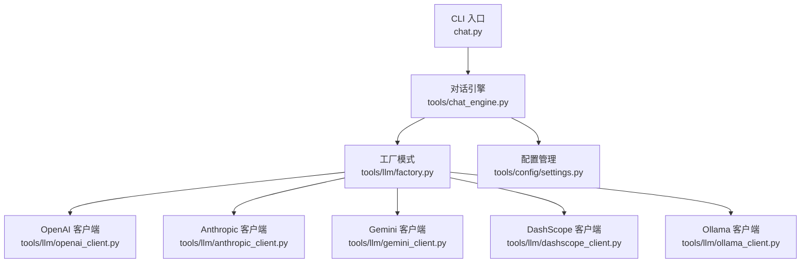
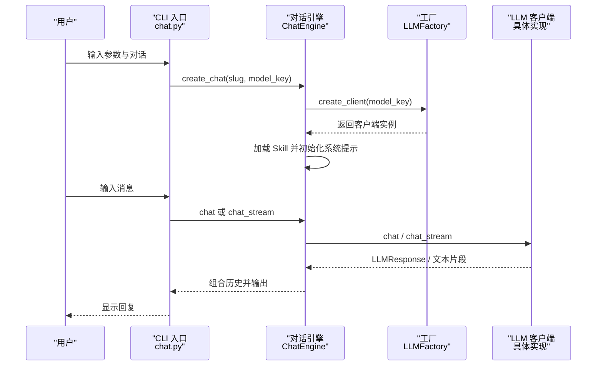
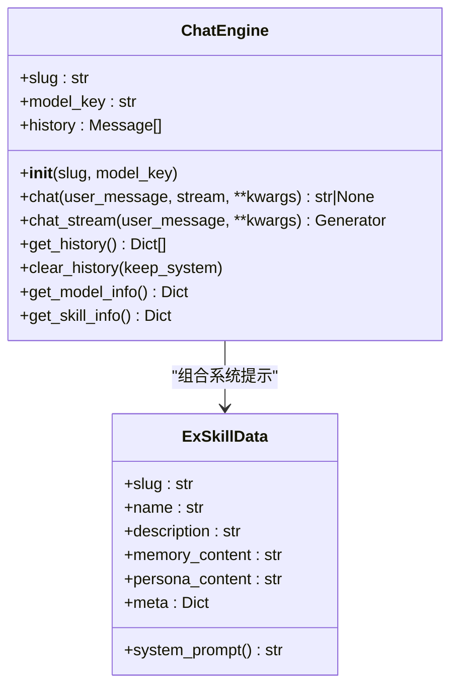
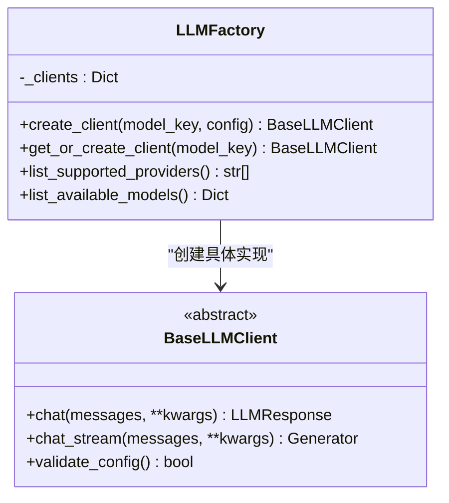
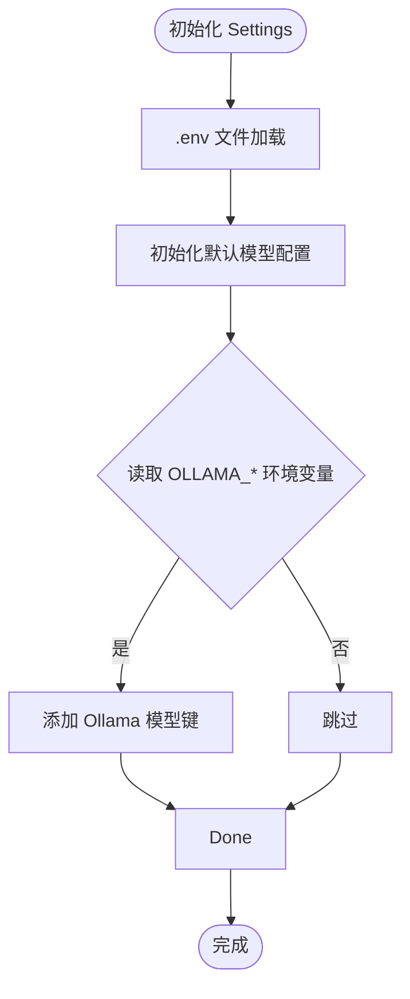

# 故障诊断与FAQ

<cite>
**本文引用的文件**
- [README.md](file://README.md)
- [API_USAGE.md](file://API_USAGE.md)
- [INSTALL.md](file://INSTALL.md)
- [requirements.txt](file://requirements.txt)
- [chat.py](file://chat.py)
- [tools/chat_engine.py](file://tools/chat_engine.py)
- [tools/config/settings.py](file://tools/config/settings.py)
- [tools/llm/factory.py](file://tools/llm/factory.py)
- [tools/llm/base.py](file://tools/llm/base.py)
- [tools/llm/openai_client.py](file://tools/llm/openai_client.py)
- [tools/llm/anthropic_client.py](file://tools/llm/anthropic_client.py)
- [tools/llm/gemini_client.py](file://tools/llm/gemini_client.py)
- [tools/llm/ollama_client.py](file://tools/llm/ollama_client.py)
- [tools/llm/dashscope_client.py](file://tools/llm/dashscope_client.py)
- [tools/version_manager.py](file://tools/version_manager.py)
</cite>

## 目录
1. [简介](#简介)
2. [项目结构](#项目结构)
3. [核心组件](#核心组件)
4. [架构总览](#架构总览)
5. [详细组件分析](#详细组件分析)
6. [依赖分析](#依赖分析)
7. [性能考虑](#性能考虑)
8. [故障排查指南](#故障排查指南)
9. [结论](#结论)
10. [附录](#附录)

## 简介
本文件面向“前任.skill”项目的使用者与维护者，提供系统化的故障诊断与常见问题解答。内容覆盖API连接失败、模型响应异常、文件读写错误、配置解析问题四大类问题；给出日志分析、网络诊断与依赖检查的方法；总结性能问题的识别与优化策略；并提供错误代码说明、解决方案步骤与预防措施建议。同时，附带社区支持与技术交流渠道指引。

## 项目结构
该项目采用“工具模块 + 对话引擎 + LLM 客户端 + 配置管理”的分层设计：
- CLI 入口负责参数解析与交互式对话调度
- 对话引擎负责加载 Skill、构造系统提示、维护对话历史、调用 LLM 客户端
- LLM 客户端通过工厂模式按 provider 创建具体实现（OpenAI、Anthropic、Gemini、DashScope、Ollama）
- 配置管理负责从环境变量、.env 与默认配置中加载模型与密钥

图表来源
- [chat.py:128-196](file://chat.py#L128-L196)
- [tools/chat_engine.py:60-83](file://tools/chat_engine.py#L60-L83)
- [tools/llm/factory.py:14-63](file://tools/llm/factory.py#L14-L63)
- [tools/config/settings.py:38-56](file://tools/config/settings.py#L38-L56)

章节来源
- [README.md:281-321](file://README.md#L281-L321)
- [API_USAGE.md:164-181](file://API_USAGE.md#L164-L181)

## 核心组件
- CLI 入口：解析命令行参数、列出技能与模型、创建对话引擎并进入交互循环
- 对话引擎：加载 SKILL.md 或 memory/persona 分离文件，构建系统提示，维护历史消息，调用 LLM 客户端
- LLM 工厂：根据 provider 与模型键创建对应客户端，支持单例缓存
- LLM 客户端：统一抽象接口，各厂商实现差异封装
- 配置管理：从环境变量与 .env 加载密钥，初始化默认模型，解析模型键

章节来源
- [chat.py:128-196](file://chat.py#L128-L196)
- [tools/chat_engine.py:60-131](file://tools/chat_engine.py#L60-L131)
- [tools/llm/factory.py:14-82](file://tools/llm/factory.py#L14-L82)
- [tools/config/settings.py:12-56](file://tools/config/settings.py#L12-L56)

## 架构总览
下图展示一次典型对话的调用链路，从 CLI 到引擎再到具体 LLM 客户端：

图表来源
- [chat.py:178-196](file://chat.py#L178-L196)
- [tools/chat_engine.py:181-228](file://tools/chat_engine.py#L181-L228)
- [tools/llm/factory.py:23-56](file://tools/llm/factory.py#L23-L56)

## 详细组件分析

### 对话引擎（ChatEngine）
- 职责：加载 Skill 文件、构造系统提示、维护历史、调用 LLM 客户端
- 关键点：
  - 优先读取 SKILL.md，否则读取 memory/persona 分离文件与 meta.json
  - 系统提示包含 PART A（关系记忆）与 PART B（人物性格）及运行规则
  - 历史消息包含 system、user、assistant，支持清空与保留 system

图表来源
- [tools/chat_engine.py:60-131](file://tools/chat_engine.py#L60-L131)
- [tools/chat_engine.py:173-180](file://tools/chat_engine.py#L173-L180)

章节来源
- [tools/chat_engine.py:60-131](file://tools/chat_engine.py#L60-L131)
- [tools/chat_engine.py:173-180](file://tools/chat_engine.py#L173-L180)

### LLM 工厂（LLMFactory）
- 职责：根据模型键或配置创建对应客户端；支持单例缓存；列出可用模型
- 关键点：
  - 支持 provider 映射：openai/anthropic/gemini/google/ollama/dashscope/qwen
  - 若未提供配置，从 Settings 获取默认模型键

图表来源
- [tools/llm/factory.py:14-82](file://tools/llm/factory.py#L14-L82)
- [tools/llm/base.py:27-68](file://tools/llm/base.py#L27-L68)

章节来源
- [tools/llm/factory.py:14-82](file://tools/llm/factory.py#L14-L82)
- [tools/llm/base.py:27-68](file://tools/llm/base.py#L27-L68)

### 配置管理（Settings）
- 职责：加载 .env 与环境变量；初始化默认模型；解析模型键；列出技能
- 关键点：
  - 默认模型键 openai/gpt-4o、anthropic/claude-3-sonnet 等
  - Ollama 模型键从环境变量批量注入，默认 http://localhost:11434
  - 未显式提供 API Key 时，自动从环境变量读取

图表来源
- [tools/config/settings.py:53-161](file://tools/config/settings.py#L53-L161)

章节来源
- [tools/config/settings.py:53-161](file://tools/config/settings.py#L53-L161)

### LLM 客户端实现要点
- OpenAI：支持自定义 base_url（兼容第三方 OpenAI 兼容接口）
- Anthropic：使用 messages.create，支持 system 参数
- Gemini：使用 generativeai，支持 system_instruction
- DashScope：继承 OpenAI 客户端，设置固定 base_url
- Ollama：通过 HTTP 请求调用本地 /api/chat，支持流式与非流式

章节来源
- [tools/llm/openai_client.py:14-93](file://tools/llm/openai_client.py#L14-L93)
- [tools/llm/anthropic_client.py:13-99](file://tools/llm/anthropic_client.py#L13-L99)
- [tools/llm/gemini_client.py:13-119](file://tools/llm/gemini_client.py#L13-L119)
- [tools/llm/dashscope_client.py:12-67](file://tools/llm/dashscope_client.py#L12-L67)
- [tools/llm/ollama_client.py:11-126](file://tools/llm/ollama_client.py#L11-L126)

## 依赖分析
- 基础依赖：Pillow（照片 EXIF 读取）
- LLM 客户端依赖：openai、anthropic、google-generativeai（按需安装）
- 可选增强：chardet、dateutil（未强制要求）

章节来源
- [requirements.txt:1-12](file://requirements.txt#L1-L12)

## 性能考虑
- 流式输出：CLI 默认启用流式输出，降低首字延迟；可通过 --no-stream 关闭
- 模型参数：temperature、max_tokens 影响生成速度与稳定性
- 本地模型：Ollama 本地推理避免网络抖动，但受本机资源限制
- 历史长度：对话历史越长，上下文成本越高，建议适时清理历史

章节来源
- [chat.py:150-155](file://chat.py#L150-L155)
- [tools/chat_engine.py:236-247](file://tools/chat_engine.py#L236-L247)

## 故障排查指南

### 一、API 连接失败
常见症状
- ImportError：缺少特定 LLM 客户端依赖
- 找不到前任 Skill
- API Key 无效
- 第三方 OpenAI 兼容接口无法访问
- Ollama 连接失败

排查步骤
- 检查依赖安装
  - 安装缺失的客户端库（如 openai、anthropic、google-generativeai）
  - 参考安装说明与依赖清单
- 检查 API Key
  - 确认环境变量或 .env 文件中已正确设置
  - 不同 provider 的 KEY 名称不同（OPENAI_API_KEY、ANTHROPIC_API_KEY、GEMINI_API_KEY、DASHSCOPE_API_KEY）
- 检查模型键与 provider
  - 使用 --list-models 查看可用模型与密钥状态
  - 确认模型键格式为 provider/model
- 第三方 OpenAI 兼容接口
  - 通过自定义 base_url 指向目标服务
- Ollama 本地模型
  - 确认 Ollama 服务已启动（ollama serve）
  - 确认本地端口可达（默认 http://localhost:11434）

章节来源
- [API_USAGE.md:142-162](file://API_USAGE.md#L142-L162)
- [API_USAGE.md:101-118](file://API_USAGE.md#L101-L118)
- [INSTALL.md:28-37](file://INSTALL.md#L28-L37)
- [requirements.txt:4-7](file://requirements.txt#L4-L7)
- [tools/llm/openai_client.py:20-33](file://tools/llm/openai_client.py#L20-L33)
- [tools/llm/ollama_client.py:17-31](file://tools/llm/ollama_client.py#L17-L31)

### 二、模型响应异常
常见症状
- 响应为空或截断
- 输出不符合预期风格
- 流式输出中断

排查步骤
- 调整温度与最大 token
  - 适当提高 temperature 增强创造性，或降低以提升确定性
  - 调整 max_tokens 以避免截断
- 检查系统提示与记忆
  - 确认 SKILL.md 或 memory/persona 文件存在且内容合理
  - 系统提示包含 PART A/B 与运行规则，需保证结构清晰
- 切换模型或 provider
  - 使用 --list-models 查看可用模型，尝试其他 provider
- 流式输出
  - 若出现中断，尝试关闭流式输出（--no-stream）

章节来源
- [chat.py:150-155](file://chat.py#L150-L155)
- [tools/chat_engine.py:28-57](file://tools/chat_engine.py#L28-L57)
- [tools/chat_engine.py:133-171](file://tools/chat_engine.py#L133-L171)

### 三、文件读写错误
常见症状
- 找不到前任 Skill（FileNotFoundError）
- 读取 SKILL.md 或 memory/persona 失败
- meta.json 解析异常

排查步骤
- 确认 Skill 目录存在
  - 使用 --list-skills 查看已创建的技能
  - Skill 目录应位于 exes/{slug}/，包含 SKILL.md 或 memory.md、persona.md、meta.json
- 检查文件编码
  - 统一使用 UTF-8 编码
- 检查权限
  - 确保脚本对 exes 目录具有读取权限

章节来源
- [chat.py:185-188](file://chat.py#L185-L188)
- [tools/chat_engine.py:90-131](file://tools/chat_engine.py#L90-L131)
- [tools/chat_engine.py:192-204](file://tools/chat_engine.py#L192-L204)

### 四、配置解析问题
常见症状
- 模型键解析失败
- Ollama 模型未加载
- 环境变量未生效

排查步骤
- 模型键格式
  - 支持 openai/gpt-4o、anthropic/claude-3-sonnet 等
  - 也可仅提供模型名，将使用默认 provider
- Ollama 模型注入
  - 通过 OLLAMA_MODELS 环境变量注入多个模型
  - 通过 OLLAMA_BASE_URL 指定 Ollama 服务地址
- .env 与环境变量
  - .env 文件会被读取并注入到 os.environ
  - 未显式提供的 API Key 会自动从环境变量读取

章节来源
- [tools/config/settings.py:162-190](file://tools/config/settings.py#L162-L190)
- [tools/config/settings.py:132-146](file://tools/config/settings.py#L132-L146)
- [tools/config/settings.py:148-160](file://tools/config/settings.py#L148-L160)

### 五、日志分析与网络诊断
- 日志位置
  - CLI 输出错误信息（如 FileNotFoundError、ImportError）
  - LLM 客户端内部异常（如 URLError、ValueError）
- 网络诊断
  - OpenAI/Anthropic/Gemini/DashScope：确认网络可达与代理设置
  - Ollama：curl http://localhost:11434/api/tags 验证服务状态
- 依赖检查
  - pip list 检查 openai、anthropic、google-generativeai 是否安装
  - requirements.txt 对照安装

章节来源
- [chat.py:185-196](file://chat.py#L185-L196)
- [tools/llm/ollama_client.py:21-31](file://tools/llm/ollama_client.py#L21-L31)
- [requirements.txt:4-7](file://requirements.txt#L4-L7)

### 六、性能问题识别与优化
- 内存泄漏检测
  - 使用工厂单例缓存客户端，避免重复创建
  - 定期清理对话历史（/clear）以控制内存占用
- CPU 占用分析
  - 切换更轻量的模型（如 gpt-3.5-turbo、claude-3-haiku、gemini-1.5-flash）
  - 降低 temperature 与 max_tokens
- I/O 瓶颈定位
  - 本地 Ollama 推理避免网络抖动
  - 减少 SKILL.md 体量，拆分记忆与性格内容
  - 使用流式输出减少等待时间

章节来源
- [tools/llm/factory.py:59-63](file://tools/llm/factory.py#L59-L63)
- [tools/chat_engine.py:236-247](file://tools/chat_engine.py#L236-L247)
- [chat.py:150-155](file://chat.py#L150-L155)

### 七、版本管理与回滚
- 备份当前版本：自动备份到 exes/{slug}/versions/
- 回滚到历史版本：先备份当前版本再恢复目标版本
- 查看历史版本：列出所有可用版本

章节来源
- [tools/version_manager.py:16-43](file://tools/version_manager.py#L16-L43)
- [tools/version_manager.py:46-73](file://tools/version_manager.py#L46-L73)
- [tools/version_manager.py:76-91](file://tools/version_manager.py#L76-L91)

### 八、错误代码说明与解决方案步骤
- ImportError
  - 说明：缺少特定 LLM 客户端依赖
  - 步骤：安装对应库；参考 requirements 与 API 使用指南
- FileNotFoundError
  - 说明：找不到前任 Skill 或相关文件
  - 步骤：使用 --list-skills 检查；确认 exes/{slug}/ 存在
- ConnectionError（Ollama）
  - 说明：无法连接到本地 Ollama 服务
  - 步骤：启动 ollama serve；检查端口与防火墙
- ValueError（DashScope）
  - 说明：未设置 DASHSCOPE_API_KEY
  - 步骤：设置环境变量或 .env；重启客户端

章节来源
- [chat.py:189-196](file://chat.py#L189-L196)
- [tools/llm/ollama_client.py:86-87](file://tools/llm/ollama_client.py#L86-L87)
- [tools/llm/dashscope_client.py:52-54](file://tools/llm/dashscope_client.py#L52-L54)

### 九、预防措施建议
- 依赖管理：定期核对 requirements，按需安装客户端库
- 配置管理：集中使用 .env 管理密钥；避免硬编码
- 版本管理：修改 Skill 后及时备份；利用回滚功能
- 性能优化：合理设置 temperature 与 max_tokens；使用流式输出；定期清理历史

章节来源
- [requirements.txt:1-12](file://requirements.txt#L1-L12)
- [API_USAGE.md:140-162](file://API_USAGE.md#L140-L162)
- [tools/version_manager.py:16-43](file://tools/version_manager.py#L16-L43)

## 结论
通过系统化的配置管理、工厂化的 LLM 客户端与健壮的对话引擎，本项目在多 API 场景下提供了稳定的运行框架。针对常见问题，建议优先检查依赖与密钥、确认模型键与网络连通性，并结合版本管理与性能参数进行优化。遇到复杂问题时，可依据本文的排查流程逐步定位并解决。

## 附录

### 社区支持与技术交流
- 项目主页与使用说明：README.md
- 多 API 使用指南：API_USAGE.md
- 安装与常见问题：INSTALL.md
- 依赖清单：requirements.txt

章节来源
- [README.md:1-370](file://README.md#L1-L370)
- [API_USAGE.md:1-194](file://API_USAGE.md#L1-L194)
- [INSTALL.md:1-97](file://INSTALL.md#L1-L97)
- [requirements.txt:1-12](file://requirements.txt#L1-L12)