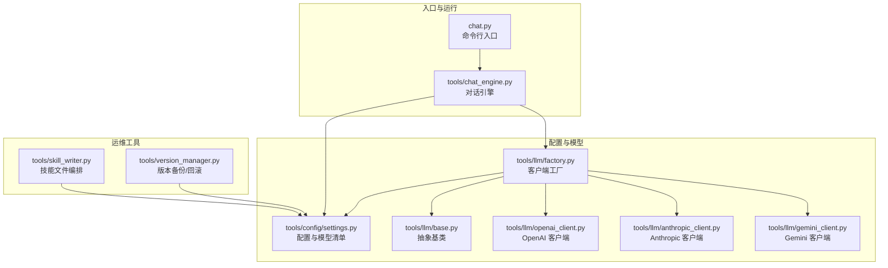
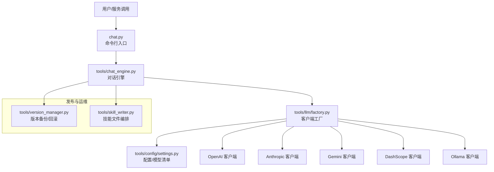
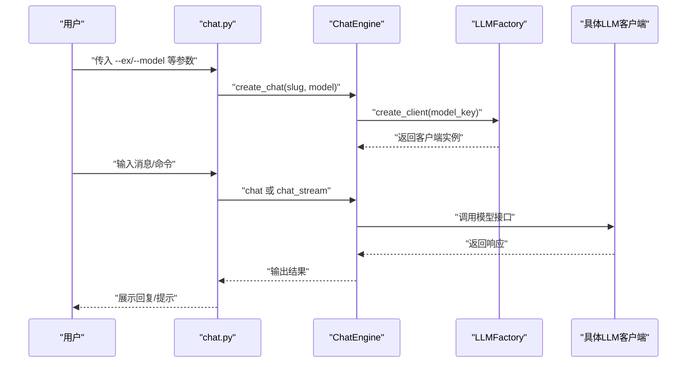
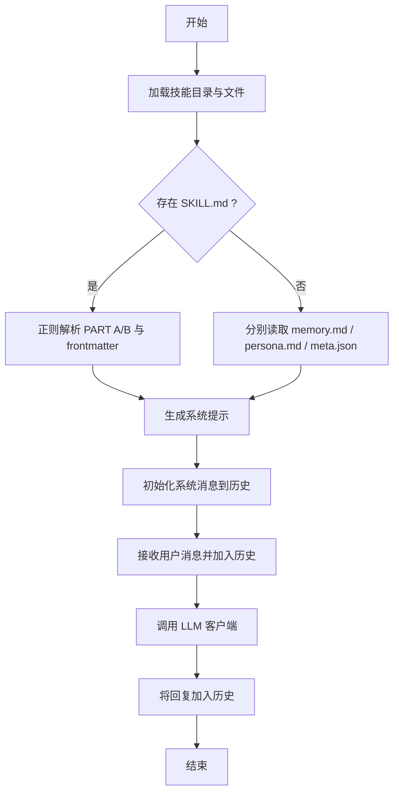
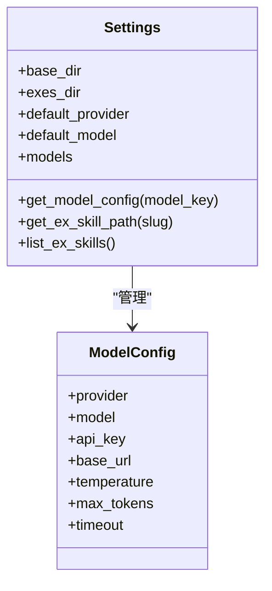
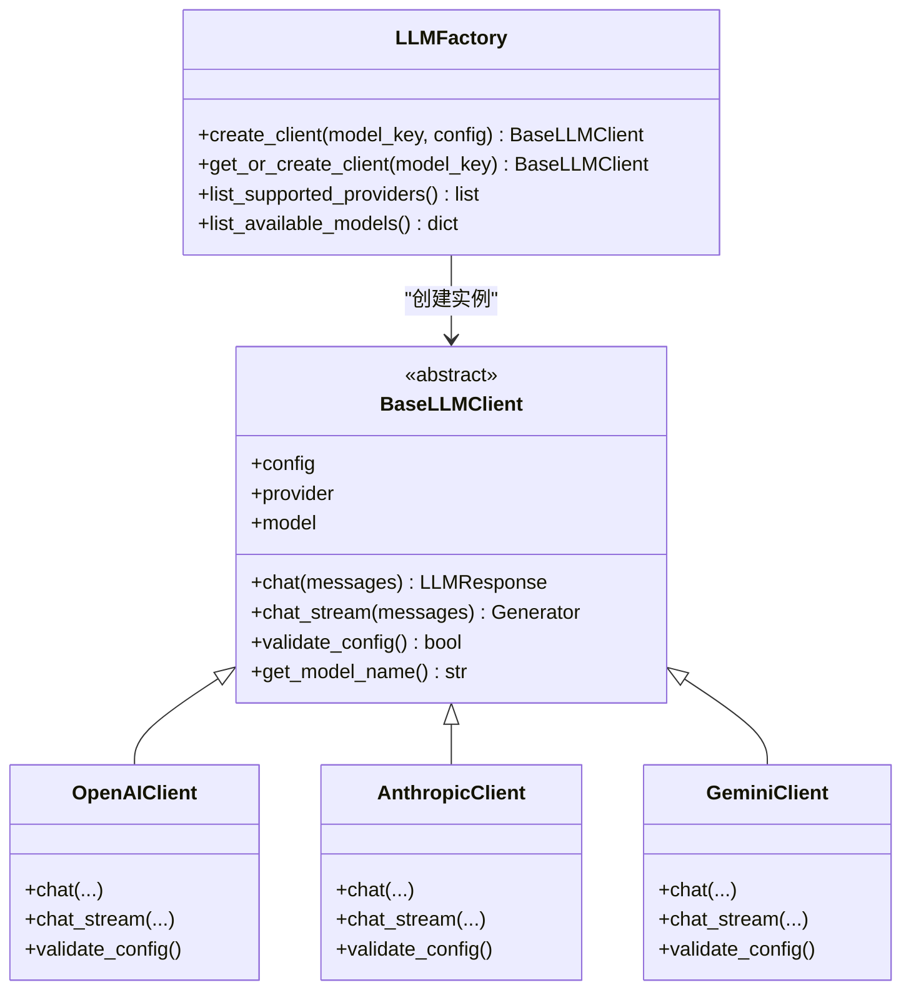
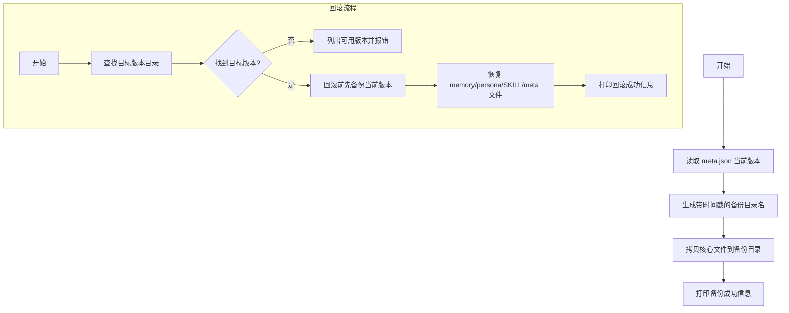
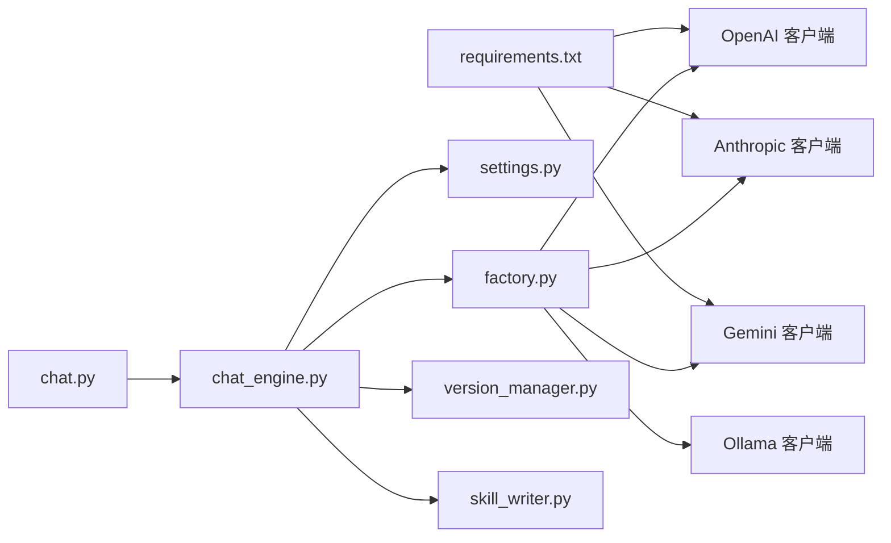

# 部署与监控

<cite>
**本文引用的文件**   
- [README.md](file://README.md)
- [INSTALL.md](file://INSTALL.md)
- [API_USAGE.md](file://API_USAGE.md)
- [requirements.txt](file://requirements.txt)
- [chat.py](file://chat.py)
- [tools/chat_engine.py](file://tools/chat_engine.py)
- [tools/config/settings.py](file://tools/config/settings.py)
- [tools/version_manager.py](file://tools/version_manager.py)
- [tools/skill_writer.py](file://tools/skill_writer.py)
- [tools/llm/factory.py](file://tools/llm/factory.py)
- [tools/llm/base.py](file://tools/llm/base.py)
- [tools/llm/openai_client.py](file://tools/llm/openai_client.py)
- [tools/llm/anthropic_client.py](file://tools/llm/anthropic_client.py)
- [tools/llm/gemini_client.py](file://tools/llm/gemini_client.py)
</cite>

## 目录
1. [简介](#简介)
2. [项目结构](#项目结构)
3. [核心组件](#核心组件)
4. [架构总览](#架构总览)
5. [详细组件分析](#详细组件分析)
6. [依赖关系分析](#依赖关系分析)
7. [性能考虑](#性能考虑)
8. [故障排查指南](#故障排查指南)
9. [结论](#结论)
10. [附录](#附录)

## 简介
本指南面向生产环境部署与监控，围绕“前任.skill”项目提供可落地的部署策略、监控指标体系、日志与告警、自动化发布与回滚、容量规划与性能调优建议。项目采用多 LLM Provider 支持与本地模型（Ollama）能力，具备良好的扩展性与可观测性基础，便于在容器化、微服务化与高可用架构下进行工程化落地。

## 项目结构
项目采用“入口脚本 + 工具模块 + 配置与 LLM 客户端”的分层组织方式，CLI 入口负责参数解析与交互式对话；对话引擎封装系统提示、历史消息与模型调用；配置模块集中管理 API Key、模型清单与技能目录；版本管理与技能写入工具提供版本存档与文件编排能力；LLM 客户端通过工厂模式统一接入不同 Provider。

图表来源
- [chat.py:1-201](file://chat.py#L1-L201)
- [tools/chat_engine.py:1-284](file://tools/chat_engine.py#L1-L284)
- [tools/config/settings.py:1-225](file://tools/config/settings.py#L1-L225)
- [tools/llm/factory.py:1-82](file://tools/llm/factory.py#L1-L82)
- [tools/llm/base.py:1-68](file://tools/llm/base.py#L1-L68)
- [tools/llm/openai_client.py:1-93](file://tools/llm/openai_client.py#L1-L93)
- [tools/llm/anthropic_client.py:1-99](file://tools/llm/anthropic_client.py#L1-L99)
- [tools/llm/gemini_client.py:1-119](file://tools/llm/gemini_client.py#L1-L119)
- [tools/version_manager.py:1-116](file://tools/version_manager.py#L1-L116)
- [tools/skill_writer.py:1-171](file://tools/skill_writer.py#L1-L171)

章节来源
- [README.md:281-321](file://README.md#L281-L321)
- [API_USAGE.md:164-194](file://API_USAGE.md#L164-L194)

## 核心组件
- 命令行入口与交互式对话：解析参数、列举技能与模型、创建对话引擎并进行交互。
- 对话引擎：加载技能文件、构建系统提示、维护对话历史、调用 LLM 客户端。
- 配置与模型：集中管理 API Key、默认模型、Provider 列表、技能目录与 .env 解析。
- LLM 客户端工厂：按 Provider 创建具体客户端，支持 OpenAI、Anthropic、Gemini、DashScope、Ollama。
- 版本管理：自动备份与回滚，保障发布与修复的安全性。
- 技能文件管理：生成 SKILL.md 组合文件，便于统一管理与分发。

章节来源
- [chat.py:128-197](file://chat.py#L128-L197)
- [tools/chat_engine.py:60-284](file://tools/chat_engine.py#L60-L284)
- [tools/config/settings.py:38-225](file://tools/config/settings.py#L38-L225)
- [tools/llm/factory.py:14-82](file://tools/llm/factory.py#L14-L82)
- [tools/version_manager.py:16-116](file://tools/version_manager.py#L16-L116)
- [tools/skill_writer.py:68-171](file://tools/skill_writer.py#L68-L171)

## 架构总览
下图展示生产部署视角下的典型拓扑：CLI/服务入口通过对话引擎调用 LLM 客户端工厂，工厂依据配置选择具体 Provider；配置模块统一管理 API Key 与模型清单；版本与文件管理工具支撑发布与回滚。

图表来源
- [chat.py:128-197](file://chat.py#L128-L197)
- [tools/chat_engine.py:60-284](file://tools/chat_engine.py#L60-L284)
- [tools/llm/factory.py:14-82](file://tools/llm/factory.py#L14-L82)
- [tools/config/settings.py:38-225](file://tools/config/settings.py#L38-L225)
- [tools/version_manager.py:16-116](file://tools/version_manager.py#L16-L116)
- [tools/skill_writer.py:68-171](file://tools/skill_writer.py#L68-L171)

## 详细组件分析

### 组件一：命令行入口与交互式对话
- 职责：参数解析、技能/模型列表、创建对话引擎、交互循环与命令处理。
- 关键点：支持流式输出、清空历史、显示信息、异常处理与依赖缺失提示。
- 生产建议：将交互式 CLI 改造为长连接服务（WebSocket/HTTP），增加鉴权、限流与审计日志。

图表来源
- [chat.py:128-197](file://chat.py#L128-L197)
- [tools/chat_engine.py:181-228](file://tools/chat_engine.py#L181-L228)
- [tools/llm/factory.py:23-56](file://tools/llm/factory.py#L23-L56)

章节来源
- [chat.py:128-197](file://chat.py#L128-L197)
- [API_USAGE.md:77-98](file://API_USAGE.md#L77-L98)

### 组件二：对话引擎与系统提示
- 职责：加载技能文件（SKILL.md 或 memory/persona 分离）、构造系统提示、维护历史、调用客户端。
- 关键点：支持 SKILL.md 解析、正则拆分 PART A/B、历史清理与保留系统消息。
- 生产建议：将系统提示与历史持久化至缓存/数据库，支持上下文截断与压缩。

图表来源
- [tools/chat_engine.py:89-171](file://tools/chat_engine.py#L89-L171)
- [tools/chat_engine.py:181-228](file://tools/chat_engine.py#L181-L228)

章节来源
- [tools/chat_engine.py:89-171](file://tools/chat_engine.py#L89-L171)
- [tools/chat_engine.py:229-264](file://tools/chat_engine.py#L229-L264)

### 组件三：配置与模型管理
- 职责：默认模型清单、Provider/API Key、.env 解析、技能目录枚举。
- 关键点：支持 openai/anthropic/gemini/dashscope/ollama；Ollama 模型可通过环境变量批量注入。
- 生产建议：将敏感配置放入密钥管理服务，启用配置热更新与校验。

图表来源
- [tools/config/settings.py:38-225](file://tools/config/settings.py#L38-L225)

章节来源
- [tools/config/settings.py:53-161](file://tools/config/settings.py#L53-L161)
- [API_USAGE.md:23-48](file://API_USAGE.md#L23-L48)

### 组件四：LLM 客户端工厂与多 Provider 支持
- 职责：按 Provider 创建客户端实例，支持 OpenAI 格式第三方 API 与本地 Ollama。
- 关键点：抽象基类统一接口；各客户端实现 chat 与 chat_stream；支持自定义 base_url。
- 生产建议：引入连接池、重试与熔断、超时控制、Token 使用统计上报。

图表来源
- [tools/llm/base.py:27-68](file://tools/llm/base.py#L27-L68)
- [tools/llm/openai_client.py:14-93](file://tools/llm/openai_client.py#L14-L93)
- [tools/llm/anthropic_client.py:13-99](file://tools/llm/anthropic_client.py#L13-L99)
- [tools/llm/gemini_client.py:13-119](file://tools/llm/gemini_client.py#L13-L119)
- [tools/llm/factory.py:14-82](file://tools/llm/factory.py#L14-L82)

章节来源
- [tools/llm/factory.py:42-56](file://tools/llm/factory.py#L42-L56)
- [tools/llm/openai_client.py:35-39](file://tools/llm/openai_client.py#L35-L39)
- [tools/llm/anthropic_client.py:23-27](file://tools/llm/anthropic_client.py#L23-L27)
- [tools/llm/gemini_client.py:24-28](file://tools/llm/gemini_client.py#L24-L28)

### 组件五：版本管理与回滚
- 职责：备份当前版本、回滚到指定版本、列出历史版本。
- 关键点：基于 meta.json 版本号与时间戳命名备份目录；回滚前自动备份当前版本。
- 生产建议：将备份目录纳入对象存储或共享存储，配合自动化脚本执行回滚。

图表来源
- [tools/version_manager.py:16-74](file://tools/version_manager.py#L16-L74)
- [tools/version_manager.py:76-112](file://tools/version_manager.py#L76-L112)

章节来源
- [tools/version_manager.py:16-74](file://tools/version_manager.py#L16-L74)
- [tools/version_manager.py:76-112](file://tools/version_manager.py#L76-L112)

### 组件六：技能文件编排
- 职责：列出技能、初始化目录结构、合并 memory/persona 生成 SKILL.md。
- 关键点：根据 meta.json 生成描述与 frontmatter；支持组合输出。
- 生产建议：在 CI/CD 中自动执行合并，确保一致性与可审计性。

章节来源
- [tools/skill_writer.py:18-52](file://tools/skill_writer.py#L18-L52)
- [tools/skill_writer.py:68-145](file://tools/skill_writer.py#L68-L145)

## 依赖关系分析
- 运行时依赖：Pillow（可选，用于照片 EXIF）、OpenAI/Anthropic/Google Generative AI（按需安装）。
- 项目内依赖：chat.py 依赖 chat_engine；chat_engine 依赖 settings 与 LLMFactory；factory 依赖各具体客户端；version_manager 与 skill_writer 依赖 settings。

图表来源
- [requirements.txt:1-12](file://requirements.txt#L1-L12)
- [chat.py:20-21](file://chat.py#L20-L21)
- [tools/chat_engine.py:12-14](file://tools/chat_engine.py#L12-L14)
- [tools/llm/factory.py:5-11](file://tools/llm/factory.py#L5-L11)
- [tools/version_manager.py:16-43](file://tools/version_manager.py#L16-L43)
- [tools/skill_writer.py:68-145](file://tools/skill_writer.py#L68-L145)

章节来源
- [requirements.txt:1-12](file://requirements.txt#L1-L12)
- [API_USAGE.md:17-22](file://API_USAGE.md#L17-L22)

## 性能考虑
- Token 与温度：通过配置模块统一管理 temperature 与 max_tokens，避免在客户端重复设置。
- 流式输出：交互式 CLI 默认启用流式输出，降低首字延迟；生产服务可根据网络与用户体验调整。
- Provider 选择：根据延迟与成本选择合适 Provider；对高并发场景建议引入连接池与重试。
- 存储与 I/O：技能文件与版本目录建议置于高性能磁盘或共享存储；定期清理旧版本以控制空间。
- 本地模型：Ollama 适合低延迟与隐私场景，需评估宿主机资源与并发能力。

章节来源
- [tools/config/settings.py:12-22](file://tools/config/settings.py#L12-L22)
- [chat.py:150-155](file://chat.py#L150-L155)
- [tools/chat_engine.py:195-227](file://tools/chat_engine.py#L195-L227)

## 故障排查指南
- 依赖缺失：安装 requirements 中声明的依赖；OpenAI/Anthropic/Gemini 客户端需单独安装对应 SDK。
- API Key 无效：检查环境变量或 .env 文件；确认 Provider 与模型配置存在且 API Key 已设置。
- 找不到技能：确认 exes/{slug} 目录存在且包含 SKILL.md 或 memory/persona 文件。
- Ollama 连接失败：确认 Ollama 服务已启动并监听默认端口。
- 版本回滚失败：检查目标版本是否存在，回滚前会自动备份当前版本。

章节来源
- [API_USAGE.md:140-163](file://API_USAGE.md#L140-L163)
- [INSTALL.md:84-97](file://INSTALL.md#L84-L97)
- [tools/version_manager.py:46-74](file://tools/version_manager.py#L46-L74)

## 结论
本项目具备清晰的模块边界与良好的扩展性，适合在生产环境中通过容器化与服务化进一步工程化。建议结合本文提供的部署与监控策略，完善可观测性、自动化发布与回滚、容量规划与性能优化，从而在保证稳定性的同时提升交付效率与用户体验。

## 附录

### A. 生产环境部署策略
- 容器化部署
  - 基于 Python 基础镜像构建镜像，安装 requirements.txt 依赖。
  - 将 exes 目录映射为持久卷，保存技能与版本备份。
  - 通过环境变量注入 API Key 与模型配置，或使用密钥管理服务。
- 负载均衡与高可用
  - 多副本部署，使用反向代理或 Ingress 实现流量分发。
  - 对外暴露 HTTP/WS 接口，内部通过服务网格实现服务发现与熔断。
- 认证与授权
  - 在网关层统一鉴权，限制访问来源与速率。
- 日志与审计
  - 输出结构化日志（JSON），包含请求 ID、用户 ID、模型、耗时、Token 使用等。
  - 审计关键操作（创建/回滚/删除）。

章节来源
- [requirements.txt:1-12](file://requirements.txt#L1-L12)
- [tools/config/settings.py:148-161](file://tools/config/settings.py#L148-L161)

### B. 监控指标体系
- 系统资源监控
  - CPU、内存、磁盘 IO、网络带宽与连接数。
- 应用性能监控
  - 请求延迟（P50/P95/P99）、吞吐量、错误率、重试次数。
  - LLM 调用耗时、Token 使用量、Provider 成功率。
- 业务指标追踪
  - 技能创建数量、活跃技能数、平均对话长度、用户会话数。
  - 版本备份/回滚次数与成功率。

章节来源
- [tools/llm/openai_client.py:64-71](file://tools/llm/openai_client.py#L64-L71)
- [tools/llm/anthropic_client.py:73-79](file://tools/llm/anthropic_client.py#L73-L79)

### C. 日志管理与告警
- 日志管理
  - 使用结构化日志，统一字段命名；按天切割并归档。
  - 将日志采集到集中平台，支持检索与可视化。
- 告警机制
  - 错误率阈值、延迟突增、Token 费用异常、Provider 可用性下降。
- 自动恢复
  - Pod 自愈、副本扩缩容、自动回滚（结合版本管理工具）。

章节来源
- [tools/version_manager.py:63-74](file://tools/version_manager.py#L63-L74)

### D. 自动化部署与版本发布
- 自动化部署
  - CI/CD 流水线：拉取代码 → 单元测试 → 构建镜像 → 推送 Registry → 发布到预生产 → 自动化验收 → 发布到生产。
- 版本发布与回滚
  - 发布前自动备份当前版本；回滚时先备份再恢复；灰度发布与蓝绿切换。
- 配置管理
  - 将 API Key 与敏感配置放入密钥管理服务；启用配置热更新。

章节来源
- [tools/version_manager.py:16-43](file://tools/version_manager.py#L16-L43)
- [tools/skill_writer.py:147-171](file://tools/skill_writer.py#L147-L171)

### E. 容量规划与性能调优
- 容量规划
  - 估算并发用户数、平均会话时长、模型调用频率与 Token 用量。
  - 预留 30%~50% 缓冲，结合历史峰值与增长趋势。
- 性能调优
  - 优化系统提示长度与历史截断；启用流式输出；合理设置 temperature 与 max_tokens。
  - 对高延迟 Provider 增加重试与熔断；对本地模型评估硬件资源与并发上限。

章节来源
- [tools/config/settings.py:12-22](file://tools/config/settings.py#L12-L22)
- [tools/chat_engine.py:195-227](file://tools/chat_engine.py#L195-L227)