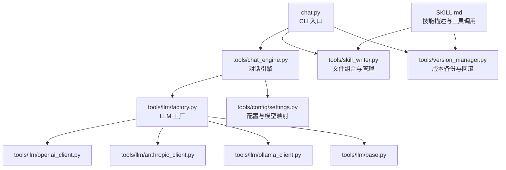
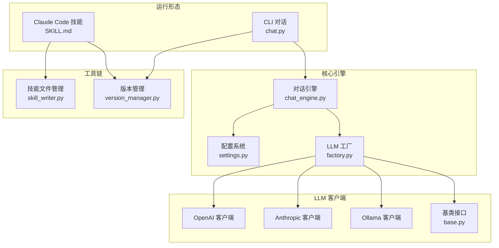
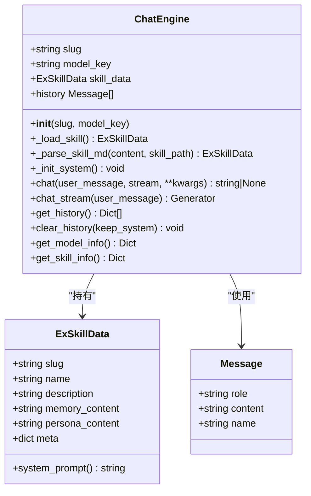
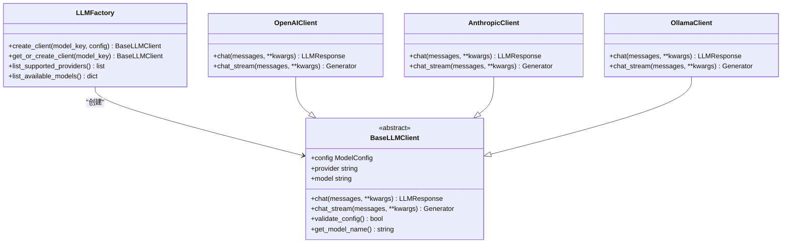
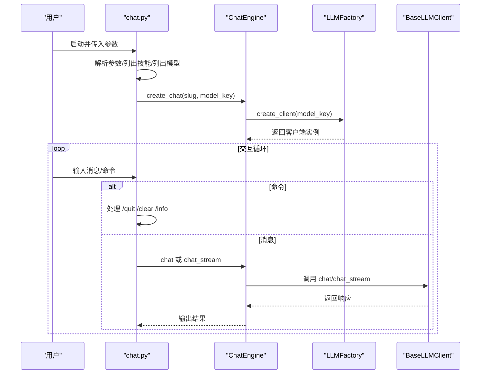
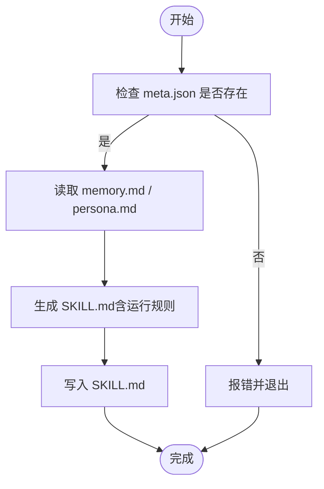
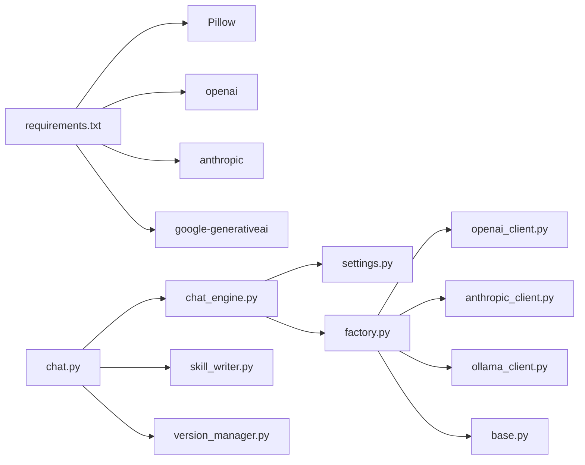

# 高级主题

<cite>
**本文引用的文件**
- [README.md](file://README.md)
- [API_USAGE.md](file://API_USAGE.md)
- [INSTALL.md](file://INSTALL.md)
- [SKILL.md](file://SKILL.md)
- [chat.py](file://chat.py)
- [tools/chat_engine.py](file://tools/chat_engine.py)
- [tools/config/settings.py](file://tools/config/settings.py)
- [tools/llm/factory.py](file://tools/llm/factory.py)
- [tools/llm/base.py](file://tools/llm/base.py)
- [tools/llm/openai_client.py](file://tools/llm/openai_client.py)
- [tools/llm/anthropic_client.py](file://tools/llm/anthropic_client.py)
- [tools/llm/ollama_client.py](file://tools/llm/ollama_client.py)
- [tools/skill_writer.py](file://tools/skill_writer.py)
- [tools/version_manager.py](file://tools/version_manager.py)
- [requirements.txt](file://requirements.txt)
</cite>

## 目录
1. [引言](#引言)
2. [项目结构](#项目结构)
3. [核心组件](#核心组件)
4. [架构总览](#架构总览)
5. [详细组件分析](#详细组件分析)
6. [依赖分析](#依赖分析)
7. [性能考量](#性能考量)
8. [故障排查指南](#故障排查指南)
9. [结论](#结论)
10. [附录](#附录)

## 引言
本文件面向高级用户与开发者，围绕“技能优化策略、性能调优技巧、扩展开发指南”展开，结合代码库的实际实现，系统阐述以下主题：
- 技能优化策略：基于 Part A（关系记忆）与 Part B（人物性格）的双层结构，如何通过增量合并、对话纠正与版本管理提升输出质量与一致性。
- 性能调优技巧：对话引擎的流式输出、模型参数控制、缓存与客户端复用、网络与本地模型的权衡。
- 扩展开发指南：自定义解析器接入、第三方 LLM 集成、插件化能力设计与工厂模式扩展。
- 大规模部署考虑：多 API 并行、资源隔离、并发控制与可观测性。
- 监控指标与日志：令牌用量统计、响应耗时、错误率与告警策略。
- 安全与隐私：本地化存储、最小权限原则、Layer 0 硬规则与数据脱敏。
- 故障诊断与容量规划：常见问题定位、基准测试方法与扩容策略。

## 项目结构
该项目采用“入口脚本 + 工具模块 + 配置与 LLM 客户端”的分层组织方式，支持两类运行形态：
- 独立 CLI 对话形态：通过命令行直接与 Skill 交互，支持多 LLM Provider。
- Claude Code 技能形态：通过 SKILL.md 描述与工具链协作，实现自动化创建、演进与管理。

图表来源
- [chat.py:1-201](file://chat.py#L1-L201)
- [tools/chat_engine.py:1-284](file://tools/chat_engine.py#L1-L284)
- [tools/llm/factory.py:1-82](file://tools/llm/factory.py#L1-L82)
- [tools/llm/base.py:1-68](file://tools/llm/base.py#L1-L68)
- [tools/llm/openai_client.py:1-93](file://tools/llm/openai_client.py#L1-L93)
- [tools/llm/anthropic_client.py:1-99](file://tools/llm/anthropic_client.py#L1-L99)
- [tools/llm/ollama_client.py:1-126](file://tools/llm/ollama_client.py#L1-L126)
- [tools/config/settings.py:1-225](file://tools/config/settings.py#L1-L225)
- [tools/skill_writer.py:1-171](file://tools/skill_writer.py#L1-L171)
- [tools/version_manager.py:1-116](file://tools/version_manager.py#L1-L116)
- [SKILL.md:1-503](file://SKILL.md#L1-L503)

章节来源
- [README.md:235-275](file://README.md#L235-L275)
- [API_USAGE.md:164-194](file://API_USAGE.md#L164-L194)

## 核心组件
- CLI 对话入口：负责参数解析、技能列表与模型列表展示、交互式对话循环与命令处理。
- 对话引擎：封装 Skill 数据加载、系统 Prompt 组合、历史消息管理与 LLM 调用。
- 配置系统：集中管理模型配置、Provider 映射、默认模型与 .env 读取。
- LLM 工厂：按 Provider 创建对应客户端，支持 OpenAI、Anthropic、Gemini、DashScope、Ollama。
- 文件与版本管理：生成完整 SKILL.md、目录初始化、版本备份与回滚。

章节来源
- [chat.py:128-197](file://chat.py#L128-L197)
- [tools/chat_engine.py:60-284](file://tools/chat_engine.py#L60-L284)
- [tools/config/settings.py:38-225](file://tools/config/settings.py#L38-L225)
- [tools/llm/factory.py:14-82](file://tools/llm/factory.py#L14-L82)
- [tools/skill_writer.py:18-145](file://tools/skill_writer.py#L18-L145)
- [tools/version_manager.py:16-74](file://tools/version_manager.py#L16-L74)

## 架构总览
系统以“配置驱动 + 工厂模式 + 对话引擎”为核心，通过 SKILL.md 与工具链实现技能的创建、演进与管理；CLI 与 Claude Code 两种运行形态共享同一套底层能力。

图表来源
- [chat.py:128-197](file://chat.py#L128-L197)
- [tools/chat_engine.py:60-284](file://tools/chat_engine.py#L60-L284)
- [tools/config/settings.py:38-225](file://tools/config/settings.py#L38-L225)
- [tools/llm/factory.py:14-82](file://tools/llm/factory.py#L14-L82)
- [tools/llm/base.py:27-68](file://tools/llm/base.py#L27-L68)
- [tools/llm/openai_client.py:14-93](file://tools/llm/openai_client.py#L14-L93)
- [tools/llm/anthropic_client.py:13-99](file://tools/llm/anthropic_client.py#L13-L99)
- [tools/llm/ollama_client.py:11-126](file://tools/llm/ollama_client.py#L11-L126)
- [tools/skill_writer.py:18-145](file://tools/skill_writer.py#L18-L145)
- [tools/version_manager.py:16-74](file://tools/version_manager.py#L16-L74)
- [SKILL.md:1-503](file://SKILL.md#L1-L503)

## 详细组件分析

### 对话引擎与系统 Prompt 构造
对话引擎负责：
- 加载 Skill：优先读取完整 SKILL.md，否则分别读取 memory.md、persona.md 与 meta.json。
- 组合系统 Prompt：将 Part A 与 Part B 的内容拼接为系统消息，附加运行规则。
- 历史管理：维护消息历史，支持清空与保留系统消息。
- LLM 调用：统一通过工厂创建的客户端进行同步或流式对话。

图表来源
- [tools/chat_engine.py:17-131](file://tools/chat_engine.py#L17-L131)
- [tools/chat_engine.py:173-264](file://tools/chat_engine.py#L173-L264)
- [tools/llm/base.py:19-25](file://tools/llm/base.py#L19-L25)

章节来源
- [tools/chat_engine.py:89-171](file://tools/chat_engine.py#L89-L171)
- [tools/chat_engine.py:173-264](file://tools/chat_engine.py#L173-L264)

### LLM 工厂与多 Provider 支持
工厂根据配置动态创建对应客户端，支持：
- OpenAI（含兼容端点）
- Anthropic Claude
- Gemini（Google）
- DashScope（通义千问）
- Ollama（本地模型）

图表来源
- [tools/llm/factory.py:14-82](file://tools/llm/factory.py#L14-L82)
- [tools/llm/base.py:27-68](file://tools/llm/base.py#L27-L68)
- [tools/llm/openai_client.py:14-93](file://tools/llm/openai_client.py#L14-L93)
- [tools/llm/anthropic_client.py:13-99](file://tools/llm/anthropic_client.py#L13-L99)
- [tools/llm/ollama_client.py:11-126](file://tools/llm/ollama_client.py#L11-L126)

章节来源
- [tools/llm/factory.py:22-56](file://tools/llm/factory.py#L22-L56)
- [tools/llm/openai_client.py:35-71](file://tools/llm/openai_client.py#L35-L71)
- [tools/llm/anthropic_client.py:23-79](file://tools/llm/anthropic_client.py#L23-L79)
- [tools/llm/ollama_client.py:21-87](file://tools/llm/ollama_client.py#L21-L87)

### CLI 对话流程
CLI 负责参数解析、技能与模型列表展示、交互式对话与命令处理（退出、清空、信息查询）。

图表来源
- [chat.py:128-197](file://chat.py#L128-L197)
- [tools/chat_engine.py:181-228](file://tools/chat_engine.py#L181-L228)
- [tools/llm/factory.py:22-56](file://tools/llm/factory.py#L22-L56)

章节来源
- [chat.py:72-126](file://chat.py#L72-L126)
- [tools/chat_engine.py:181-228](file://tools/chat_engine.py#L181-L228)

### 技能文件管理与版本演进
- 文件组合：将 memory.md 与 persona.md 合并为 SKILL.md，并注入运行规则。
- 目录初始化：创建 versions 与 memories 子目录，便于版本归档与素材分类。
- 版本管理：备份当前版本、按版本回滚、列出历史版本。

图表来源
- [tools/skill_writer.py:68-145](file://tools/skill_writer.py#L68-L145)

章节来源
- [tools/skill_writer.py:18-145](file://tools/skill_writer.py#L18-L145)
- [tools/version_manager.py:16-74](file://tools/version_manager.py#L16-L74)

## 依赖分析
- 外部依赖：Pillow（照片 EXIF 读取）、OpenAI、Anthropic、Google Generative AI。
- 内部耦合：CLI 依赖对话引擎；对话引擎依赖配置系统与工厂；工厂依赖各 Provider 客户端；文件与版本管理工具独立但与 CLI/CC 协作。

图表来源
- [requirements.txt:1-12](file://requirements.txt#L1-L12)
- [chat.py:20-21](file://chat.py#L20-L21)
- [tools/chat_engine.py:12-14](file://tools/chat_engine.py#L12-L14)
- [tools/llm/factory.py:5-11](file://tools/llm/factory.py#L5-L11)
- [tools/llm/openai_client.py:6-11](file://tools/llm/openai_client.py#L6-L11)
- [tools/llm/anthropic_client.py:5-10](file://tools/llm/anthropic_client.py#L5-L10)
- [tools/llm/ollama_client.py:3-8](file://tools/llm/ollama_client.py#L3-L8)

章节来源
- [requirements.txt:1-12](file://requirements.txt#L1-L12)
- [API_USAGE.md:100-118](file://API_USAGE.md#L100-L118)

## 性能考量
- 流式输出：对话引擎支持流式调用，降低首字延迟，改善交互体验。
- 模型参数：温度、最大 token 数可通过 CLI 与配置系统统一控制。
- 客户端复用：工厂支持“获取或创建”单例，减少重复初始化成本。
- Provider 选择：
  - 远程 API：OpenAI、Anthropic、Gemini、DashScope，适合高质量生成。
  - 本地模型：Ollama，适合隐私敏感与离线场景，需评估推理速度与显存占用。
- 资源隔离：多 Provider 并行时建议限制并发，避免令牌配额与带宽瓶颈。
- 日志与指标：可在客户端层统计 prompt/completion 令牌用量与耗时，结合外部监控系统上报。

章节来源
- [tools/chat_engine.py:195-227](file://tools/chat_engine.py#L195-L227)
- [tools/llm/openai_client.py:50-71](file://tools/llm/openai_client.py#L50-L71)
- [tools/llm/anthropic_client.py:57-79](file://tools/llm/anthropic_client.py#L57-L79)
- [tools/llm/ollama_client.py:49-87](file://tools/llm/ollama_client.py#L49-L87)
- [chat.py:142-156](file://chat.py#L142-L156)

## 故障排查指南
- 找不到技能：确认 Skill 目录与 SKILL.md/meta.json 存在，或使用列表命令查看。
- 依赖缺失：安装对应 Provider 客户端库，或安装 Pillow 以启用照片 EXIF。
- API Key 无效：检查环境变量或 .env 文件，确保与 Provider 匹配。
- Ollama 连接失败：确认服务已启动并监听默认端口，或在配置中指定 base_url。
- 命令行参数错误：使用 --list-skills/--list-models 检查可用项，核对 --ex/--model 参数。

章节来源
- [chat.py:185-196](file://chat.py#L185-L196)
- [API_USAGE.md:140-162](file://API_USAGE.md#L140-L162)
- [INSTALL.md:84-97](file://INSTALL.md#L84-L97)

## 结论
本项目通过清晰的分层架构与工厂模式，实现了多 Provider 的统一接入与灵活切换；通过 SKILL.md 与工具链，构建了可演进、可回滚的技能生命周期管理。对于高级用户，建议在生产环境中引入：
- 统一的令牌与速率限制策略
- 流式输出与前端渲染优化
- 客户端连接池与重试退避
- 指标采集与告警联动
- 安全与隐私合规审计

## 附录

### 自定义解析器开发指南
- 新增解析器：在 tools/ 目录新增解析模块，遵循统一的输入输出约定（例如接收文件路径、输出标准化文本）。
- 工具链集成：在 SKILL.md 的工具使用规则中添加 Bash 调用入口，或在 CLI 中扩展参数解析与调用逻辑。
- 数据融合：将解析结果写入 memory.md 或 persona.md，或生成中间文件供后续分析步骤使用。
- 版本演进：通过增量合并与版本管理，确保解析器升级不影响既有 Skill 的稳定性。

章节来源
- [SKILL.md:37-54](file://SKILL.md#L37-L54)
- [tools/skill_writer.py:68-145](file://tools/skill_writer.py#L68-L145)

### 第三方集成方法
- 兼容 OpenAI 格式的 API：通过自定义 base_url 与 Provider 映射，即可在工厂中无缝接入。
- 本地模型：通过 Ollama 客户端对接本地推理服务，适合隐私与低延迟场景。
- 环境变量与 .env：集中管理密钥与端点，避免硬编码。

章节来源
- [API_USAGE.md:99-118](file://API_USAGE.md#L99-L118)
- [tools/llm/openai_client.py:25-33](file://tools/llm/openai_client.py#L25-L33)
- [tools/llm/ollama_client.py:17-19](file://tools/llm/ollama_client.py#L17-L19)
- [tools/config/settings.py:148-160](file://tools/config/settings.py#L148-L160)

### 插件系统设计建议
- 接口契约：以 BaseLLMClient 为统一接口，新增 Provider 时只需实现 chat 与 chat_stream。
- 工厂扩展：在工厂映射中注册新 Provider，支持动态发现与配置。
- 配置中心：集中管理 Provider、模型、端点与认证信息，支持热更新与回滚。

章节来源
- [tools/llm/base.py:27-68](file://tools/llm/base.py#L27-L68)
- [tools/llm/factory.py:42-56](file://tools/llm/factory.py#L42-L56)
- [tools/config/settings.py:57-146](file://tools/config/settings.py#L57-L146)

### 大规模部署与监控
- 部署形态：容器化部署，按 Provider 与模型划分资源组，限制并发与内存。
- 指标采集：记录每条请求的模型、温度、最大 token、prompt/completion 令牌数、耗时与错误码。
- 日志管理：区分业务日志与调试日志，统一格式化输出，接入集中式日志平台。
- 告警策略：针对 API Key 失效、连接超时、错误率上升、令牌配额不足等事件设置阈值告警。

### 安全最佳实践与合规建议
- 数据最小化：仅在本地存储，不上传至第三方服务器。
- Layer 0 硬规则：确保输出符合现实逻辑，避免不当内容。
- 访问控制：限制 exes 目录访问权限，防止未授权修改。
- 审计与溯源：版本管理记录每次变更，便于追溯与合规审查。

章节来源
- [SKILL.md:57-66](file://SKILL.md#L57-L66)
- [tools/version_manager.py:16-43](file://tools/version_manager.py#L16-L43)

### 故障诊断与容量规划
- 基准测试：固定输入长度与复杂度，对比不同 Provider 与模型的响应时间、吞吐与成本。
- 容量规划：根据峰值并发与平均响应时间，估算所需 CPU/GPU、内存与网络带宽。
- 扩容策略：横向扩展（多副本）与纵向扩展（更大实例）结合，配合 CDN 与缓存策略。

### 未来发展方向与技术债务管理
- 代码重构：将对话引擎与客户端抽象进一步解耦，引入异步与连接池。
- 功能增强：支持多模态输入（图片、音频）与多轮记忆压缩，提升长对话稳定性。
- 文档与测试：完善单元测试与集成测试，补充 API 文档与使用示例。
- 技术债务：定期清理未使用 Provider 客户端、优化异常处理分支、统一日志与指标格式。