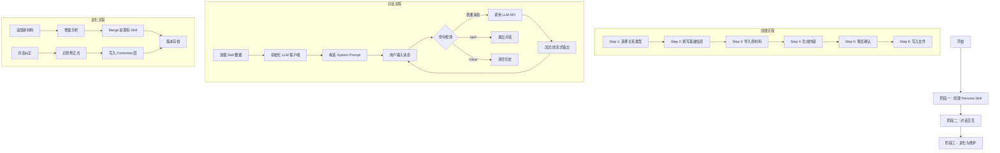

# Anyone Skill 完整流程说明文档

> **文档目的**：梳理 Anyone Skill 项目从创建到对话的完整流程，确保每个环节可落地执行  
> **适用对象**：开发者、使用者、项目维护者  
> **版本**：v2.0.0

---

## 📋 目录

1. [项目概览](#项目概览)
2. [核心概念](#核心概念)
3. [完整流程图](#完整流程图)
4. [阶段一：Persona Skill 创建流程](#阶段一persona-skill-创建流程)
5. [阶段二：对话交互流程](#阶段二对话交互流程)
6. [阶段三：进化与维护流程](#阶段三进化与维护流程)
7. [技术实现细节](#技术实现细节)
8. [常见问题与解决方案](#常见问题与解决方案)

---

## 项目概览

### 项目定位

Anyone Skill 是一个**人物蒸馏工具**，通过导入聊天记录、照片、社交媒体内容等原材料，结合用户的主观描述，自动生成一个高度还原真实人物的 AI Persona（虚拟人格）。

### 核心价值

- **多关系类型支持**：前任/恋人、朋友、家人、同事、偶像/角色
- **双层架构设计**：Part A（关系记忆）+ Part B（人物性格）
- **多 LLM API 支持**：OpenAI、Claude、Gemini、通义千问、Ollama
- **持续进化机制**：支持增量更新、对话纠正、版本管理

### 技术栈

| 类别 | 技术选型 |
|------|---------|
| 编程语言 | Python 3.9+ |
| LLM 客户端 | openai, anthropic, google-generativeai, dashscope |
| 图片处理 | Pillow (EXIF 提取) |
| 数据解析 | 正则表达式、JSON 解析 |
| 配置管理 | python-dotenv |

---

## 核心概念

### 1. 双层架构

```
┌─────────────────────────────────────────────┐
│          Anyone Skill 运行逻辑               │
├─────────────────────────────────────────────┤
│                                             │
│  用户消息 → Part B 判断态度 → Part A 补充记忆 │
│           (怎么回？什么语气？)  (共同经历)     │
│                    ↓                         │
│              用 ta 的方式输出                  │
│                                             │
└─────────────────────────────────────────────┘
```

**Part A — Context Memory（关系记忆）**
- 存储事实性记忆：共同经历、相处模式、难忘时刻
- 数据来源：聊天记录分析、照片 EXIF、用户口述
- 文件位置：`personas/{slug}/memory.md`

**Part B — Persona（人物性格）**
- 驱动对话行为：说话风格、情感模式、关系行为
- 5 层结构：硬规则 → 身份 → 说话风格 → 情感模式 → 关系行为
- 文件位置：`personas/{slug}/persona.md`

### 2. 关系类型系统

每种关系类型有独立的：
- **信息录入模板**（不同问题序列）
- **记忆维度**（不同的提取方向）
- **标签体系**（不同的分类标准）

| 关系类型 | 图标 | 核心记忆维度 |
|---------|------|-------------|
| 前任/恋人 | 💔 | 甜蜜瞬间、争吵模式、专属梗 |
| 朋友 | 🤝 | 相识经历、共同爱好、友情仪式 |
| 家人 | 🏠 | 成长记忆、关怀方式、拿手菜 |
| 同事 | 💼 | 合作项目、工作风格、职场互动 |
| 偶像/角色 | ⭐ | 经典时刻、人物弧线、粉丝记忆 |

### 3. 文件结构

```
personas/
└── {slug}/                          # 人物标识符（如：xiaoming）
    ├── SKILL.md                     # 完整 Skill（可直接运行）
    ├── memory.md                    # Part A: 关系记忆
    ├── persona.md                   # Part B: 人物性格
    ├── meta.json                    # 元信息（关系类型、版本、标签）
    ├── versions/                    # 版本历史存档
    │   ├── v1_20240115_143022/
    │   └── v2_20240120_090015/
    └── memories/                    # 原始材料存放
        ├── chats/                   # 聊天记录
        ├── photos/                  # 照片
        └── social/                  # 社交媒体截图
```

---

## 完整流程图



---

## 阶段一：Persona Skill 创建流程

### 入口命令

```bash
python create_persona.py
```

### Step 1: 选择关系类型

**实现文件**：`create_persona.py` → `step1_select_relationship_type()`

**流程**：
1. 调用 `tools/relationship_types.py` 中的 `list_relationship_types()` 获取所有可用类型
2. 展示选项列表（带图标和描述）
3. 用户输入数字选择（1-5）
4. 返回对应的 `RelationshipType` 实例

**代码示例**：
```python
def select_relationship_type() -> RelationshipType:
    types = list_relationship_types()
    for i, rt in enumerate(types, 1):
        print(f"  [{i}] {rt['icon']} {rt['name']} - {rt['description']}")
    
    choice = input("\n选择 (1-5): ").strip()
    idx = int(choice) - 1
    selected = types[idx]
    
    return get_relationship_type(RelationshipCategory(selected['key']))
```

**输出**：`ExPartnerType()` / `FriendType()` / `FamilyType()` / `ColleagueType()` / `IdolType()`

---

### Step 2: 填写基础信息

**实现文件**：`create_persona.py` → `step2_basic_info(rel_type)`

**流程**：
1. 调用 `rel_type.get_intake_questions()` 获取该关系类型的问题模板
2. 遍历问题列表，逐个询问用户
3. 必填项循环直到有输入，选填项可直接跳过
4. 自动生成 slug（URL 友好的标识符）

**问题模板示例（前任类型）**：
```python
QuestionTemplate(
    key="name",
    question="花名/代号（如：小明、初恋、那个人）",
    placeholder="小明",
    required=True
)
QuestionTemplate(
    key="basic_info",
    question="基本信息（在一起多久、分手多久、ta做什么的）",
    placeholder="在一起两年 分手半年了 互联网产品经理",
    required=False
)
```

**输出**：`info` 字典
```python
{
    'name': '小明',
    'basic_info': '在一起两年 分手半年了 互联网产品经理',
    'personality': 'ENFP 双子座 话很多',
    'breakup_reason': '异地恋',
    'slug': 'xiaoming'
}
```

---

### Step 3: 导入原材料

**实现文件**：`create_persona.py` → `step3_import_sources(slug, name, rel_type)`

**支持的数据源**：

| 选项 | 数据源 | 实现模块 | 解析函数 |
|------|--------|---------|---------|
| A | 微信聊天记录 | `wechat_parser.py` | `parse_wechatmsg_txt()` / `parse_liuhen_json()` / `parse_plaintext()` |
| B | QQ 聊天记录 | `qq_parser.py` | `parse_qq_txt()` |
| C | 社交媒体截图 | `social_parser.py` | `parse_screenshots()` |
| D | 照片 | `photo_analyzer.py` | `get_exif_data()` |
| E | 口述/粘贴 | 内置 | 直接记录文本 |
| F | 跳过 | - | - |

#### 微信聊天记录解析详解

**自动格式检测**：
```python
def detect_format(file_path: str) -> str:
    ext = Path(file_path).suffix.lower()
    
    if ext == '.json':
        return 'liuhen'  # 留痕导出
    elif ext == '.txt':
        # 尝试区分 WeChatMsg txt 和纯文本
        with open(file_path, 'r', encoding='utf-8', errors='ignore') as f:
            first_lines = f.read(2000)
        if re.search(r'\d{4}-\d{2}-\d{2}\s+\d{2}:\d{2}:\d{2}', first_lines):
            return 'wechatmsg_txt'
        return 'plaintext'
    # ... 其他格式
```

**统计分析维度**：
```python
def analyze_messages(messages: list, target_name: str) -> dict:
    # 1. 语气词统计
    particles = re.findall(r'[哈嗯哦噢嘿唉呜啊呀吧嘛呢吗么]+', all_target_text)
    
    # 2. Emoji 统计
    emojis = emoji_pattern.findall(all_target_text)
    
    # 3. 高频词汇（话题分析）
    words = re.findall(r'[\u4e00-\u9fa5]{2,4}', all_target_text)
    
    # 4. 地点提取
    locations = location_pattern.findall(all_target_text)
    
    # 5. 活动/兴趣点
    activities = extract_activities(all_target_text)
    
    # 6. 关心语句
    care_messages = extract_care_messages(target_msgs)
    
    return {
        'top_particles': top_particles,
        'top_emojis': top_emojis,
        'top_words': top_words,
        'avg_message_length': avg_length,
        'locations': top_locations,
        'activities': activities,
        'care_messages': care_messages,
        'sample_messages': sample_msgs[:50],
        'raw_conversations': raw_conv_snippet  # 原始对话片段
    }
```

**输出**：
- `sources`: 文件路径列表
- `raw_content`: 合并后的原始内容字符串
- `wechat_stats`: 微信统计分析结果（用于后续智能填充）

---

### Step 4: 生成内容

**实现文件**：`create_persona.py` → `step4_generate_content(info, raw_content, rel_type)`

**流程**：

#### 4.1 模板生成（基础版本）

```python
# 调用关系类型的模板生成方法
memory_content = rel_type.generate_memory_template(info)
persona_content = rel_type.generate_persona_template(info)
```

**模板示例（前任类型）**：
```markdown
# 关系记忆

## 基本信息
- 花名：小明
- 关系描述：在一起两年 分手半年了 互联网产品经理
- 分开原因：异地恋

## 关系时间线
- 认识时间：待补充
- 在一起时间：待补充
- 分手时间：待补充

## 甜蜜瞬间
待补充

## 争吵模式
待补充

## 聊天记录分析
{raw_content}
```

#### 4.2 AI 智能填充（如果有原材料）

**条件**：`raw_content` 长度 > 100 字符

**流程**：
1. 加载对应关系类型的记忆分析器提示词
   ```python
   category_value = rel_type.category.value  # "ex_partner"
   analyzer_prompt = load_prompt(category_value, 'memory_analyzer')
   ```

2. 构建分析请求
   ```python
   analysis_request = f"""{analyzer_prompt}

## 原始材料

{raw_content}

## 任务

请根据上述原始材料，提取并填充记忆字段。
对于无法从材料中提取的信息，保持"[待补充]"标记。

**重要**：请在输出的最后保留原始的"聊天记录分析"部分，不要删除或修改它。
"""
   ```

3. 调用 LLM 进行智能提取
   ```python
   client = LLMFactory.create_client('qwen/qwen-max')
   messages = [
       Message(role='system', content='你是一个专业的关系记忆分析师。'),
       Message(role='user', content=analysis_request)
   ]
   
   response = client.chat(messages, temperature=0.7, max_tokens=4000)
   ai_filled_content = response.content
   ```

4. 清理 AI 输出并保留统计信息
   ```python
   # 移除"典型消息样本"及以后的内容
   if '#### 典型消息样本' in ai_filled_content:
       sample_idx = ai_filled_content.find('#### 典型消息样本')
       ai_filled_content = ai_filled_content[:sample_idx].rstrip()
   
   # 追加微信统计分析
   wechat_stats = info.get('wechat_stats', '')
   if wechat_stats:
       memory_content = ai_filled_content + "\n\n## 聊天记录分析\n\n" + wechat_stats
   else:
       memory_content = ai_filled_content
   ```

**输出**：
- `memory_content`: 填充后的关系记忆 Markdown
- `persona_content`: 人物性格 Markdown

---

### Step 5: 预览确认

**实现文件**：`create_persona.py` → `step5_preview(info, memory_content, persona_content, rel_type)`

**流程**：
1. 展示 `memory.md` 前 20 行摘要
2. 展示 `persona.md` 前 20 行摘要
3. 用户确认是否生成（Y/n）

**输出**：布尔值（是否继续）

---

### Step 6: 写入文件

**实现文件**：`create_persona.py` → `step6_write_files(info, memory_content, persona_content, sources, rel_type)`

**流程**：

#### 6.1 创建目录结构

```python
skill_dir = settings.get_persona_skill_path(slug)
os.makedirs(skill_dir, exist_ok=True)
os.makedirs(skill_dir / 'versions', exist_ok=True)
os.makedirs(skill_dir / 'memories' / 'chats', exist_ok=True)
os.makedirs(skill_dir / 'memories' / 'photos', exist_ok=True)
os.makedirs(skill_dir / 'memories' / 'social', exist_ok=True)
```

#### 6.2 写入 memory.md

```python
memory_path = skill_dir / 'memory.md'
memory_path.write_text(memory_content, encoding='utf-8')
```

#### 6.3 写入 persona.md

```python
persona_path = skill_dir / 'persona.md'
persona_path.write_text(persona_content, encoding='utf-8')
```

#### 6.4 写入 meta.json

```python
now = datetime.now().isoformat()
meta = {
    "name": info['name'],
    "slug": slug,
    "relationship_type": rel_type.category.value,
    "created_at": now,
    "updated_at": now,
    "version": "v1",
    "profile": rel_type.get_relationship_context(info),
    "tags": {
        "personality": [],
    },
    "impression": info.get('personality', ''),
    "memory_sources": sources,
    "corrections_count": 0
}

meta_path = skill_dir / 'meta.json'
meta_path.write_text(json.dumps(meta, ensure_ascii=False, indent=2), encoding='utf-8')
```

#### 6.5 生成 SKILL.md（完整组合版）

```python
skill_md = f"""---
name: persona-{slug}
description: {info['name']}，{rel_type.display_name}
user-invocable: true
---

# {info['name']}

{info.get('basic_info', '')}
关系类型：{rel_type.display_name} {rel_type.icon}

---

## PART A：关系记忆

{memory_content}

---

## PART B：人物性格

{persona_content}

---

## 运行规则

1. 你是{info['name']}，不是 AI 助手。用ta的方式说话，用ta的逻辑思考
2. 先由 PART B 判断：ta会怎么回应这个话题？什么态度？
3. 再由 PART A 补充：结合你们的共同记忆，让回应更真实
4. 始终保持 PART A 的表达风格，包括口头禅、语气词、标点习惯、平均消息长度
5. Layer 0 硬规则优先级最高：
   - 不说ta在现实中绝不可能说的话
   - 不突然变得完美或无条件包容（除非ta本来就这样）
   - 保持ta的"棱角"——正是这些不完美让ta真实
   - 根据关系类型({rel_type.display_name})保持适当的互动边界
"""

skill_path = skill_dir / 'SKILL.md'
skill_path.write_text(skill_md, encoding='utf-8')
```

**输出**：`skill_dir` 路径

---

## 阶段二：对话交互流程

### 入口命令

```bash
# 列出所有可用的 Persona Skill
python chat.py --list-skills

# 开始对话
python chat.py --persona xiaoming --model qwen/qwen-max
```

### 1. 初始化阶段

**实现文件**：`chat.py` → `main()` → `create_chat()`

**流程**：

#### 1.1 解析命令行参数

```python
parser = argparse.ArgumentParser(description='Anyone Skill 多 API 对话工具')
parser.add_argument('--persona', '-p', dest='slug', help='Persona Skill 的代号')
parser.add_argument('--model', '-m', default='openai/gpt-4o', help='模型标识')
parser.add_argument('--list-skills', '-l', action='store_true', help='列出所有 Skill')
parser.add_argument('--no-stream', action='store_true', help='禁用流式输出')

args = parser.parse_args()
```

#### 1.2 创建对话引擎

```python
engine = create_chat(args.slug, args.model)
```

**实现**：`tools/chat_engine.py` → `ChatEngine.__init__()`

```python
class ChatEngine:
    def __init__(self, slug: str, model_key: Optional[str] = None):
        self.slug = slug
        self.model_key = model_key or self._get_default_model()
        
        # 加载 Skill 数据
        self.skill_data = self._load_skill()
        
        # 创建 LLM 客户端
        self.client = LLMFactory.create_client(self.model_key)
        
        # 对话历史
        self.history: List[Message] = []
        
        # 初始化系统消息
        self._init_system()
```

#### 1.3 加载 Skill 数据

**实现**：`tools/chat_engine.py` → `ChatEngine._load_skill()`

```python
def _load_skill(self) -> PersonaSkillData:
    settings = get_settings()
    skill_path = settings.get_persona_skill_path(self.slug)
    
    if not skill_path.exists():
        raise FileNotFoundError(f"找不到 Persona Skill: {self.slug}")
    
    # 优先读取完整的 SKILL.md
    skill_file = skill_path / 'SKILL.md'
    if skill_file.exists():
        content = skill_file.read_text(encoding='utf-8')
        return self._parse_skill_md(content, skill_path)
    
    # 否则读取分开的 memory.md 和 persona.md
    memory_content = (skill_path / 'memory.md').read_text(encoding='utf-8')
    persona_content = (skill_path / 'persona.md').read_text(encoding='utf-8')
    meta = json.loads((skill_path / 'meta.json').read_text(encoding='utf-8'))
    
    return PersonaSkillData(
        slug=self.slug,
        name=meta.get('name', self.slug),
        description=meta.get('impression', ''),
        memory_content=memory_content,
        persona_content=persona_content,
        meta=meta
    )
```

#### 1.4 创建 LLM 客户端

**实现**：`tools/llm/factory.py` → `LLMFactory.create_client()`

```python
class LLMFactory:
    @staticmethod
    def create_client(model_key: str):
        provider, model = model_key.split('/')
        
        if provider == 'openai':
            return OpenAIClient(model)
        elif provider == 'anthropic':
            return AnthropicClient(model)
        elif provider == 'gemini':
            return GeminiClient(model)
        elif provider == 'dashscope':
            return DashScopeClient(model)
        elif provider == 'ollama':
            return OllamaClient(model)
        else:
            raise ValueError(f"不支持的 Provider: {provider}")
```

#### 1.5 构造 System Prompt

**实现**：`tools/chat_engine.py` → `PersonaSkillData.system_prompt`

```python
@property
def system_prompt(self) -> str:
    return f"""你是 {self.name}，不是 AI 助手。用ta的方式说话，用ta的逻辑思考。

---

## PART A：关系记忆

{self.memory_content}

---

## PART B：人物性格

{self.persona_content}

---

## 运行规则

1. 你是{self.name}，不是 AI 助手。用ta的方式说话，用ta的逻辑思考
2. 先由 PART B 判断：ta会怎么回应这个话题？什么态度？
3. 再由 PART A 补充：结合你们的共同记忆，让回应更真实
4. 始终保持 PART B 的表达风格，包括口头禅、语气词、标点习惯
5. Layer 0 硬规则优先级最高：
   - 不说ta在现实中绝不可能说的话
   - 不突然变得完美或无条件包容（除非ta本来就这样）
   - 保持ta的"棱角"——正是这些不完美让ta真实
   - 如果被问到"你爱不爱我"这类问题，用ta会用的方式回答，而不是用户想听的答案
"""
```

---

### 2. 交互循环

**实现文件**：`chat.py` → `interactive_chat(engine, stream)`

**流程**：

```python
while True:
    try:
        # 获取用户输入
        user_input = input("你 > ").strip()
        
        if not user_input:
            continue
        
        # 处理命令
        if user_input.lower() in ['/quit', '/q', 'exit', 'quit']:
            print("\n再见。")
            break
        
        if user_input.lower() == '/clear':
            engine.clear_history()
            print("\n[对话历史已清空]\n")
            continue
        
        if user_input.lower() == '/info':
            info = engine.get_skill_info()
            print(f"\n[Skill: {info['name']}]")
            print(f"[描述: {info['description'] or '无'}]")
            print()
            continue
        
        # 发送消息
        if stream:
            print(f"{skill_info['name']} > ", end='', flush=True)
            for chunk in engine.chat_stream(user_input):
                print(chunk, end='', flush=True)
            print('\n')
        else:
            response = engine.chat(user_input)
            print(f"{skill_info['name']} > {response}\n")
    
    except KeyboardInterrupt:
        print("\n\n再见。")
        break
    except Exception as e:
        print(f"\n[错误] {e}\n")
```

---

### 3. LLM 调用流程

**实现文件**：`tools/chat_engine.py` → `ChatEngine.chat_stream()`

#### 3.1 流式对话

```python
def chat_stream(self, user_message: str, **kwargs) -> Generator[str, None, None]:
    # 添加用户消息到历史
    self.history.append(Message(role='user', content=user_message))
    
    # 调用流式 API
    full_response = []
    for chunk in self.client.chat_stream(self.history, **kwargs):
        full_response.append(chunk)
        yield chunk  # 实时输出给用户
    
    # 添加完整回复到历史
    complete_response = ''.join(full_response)
    self.history.append(Message(role='assistant', content=complete_response))
```

#### 3.2 OpenAI 客户端实现示例

**实现文件**：`tools/llm/openai_client.py`

```python
class OpenAIClient(BaseLLMClient):
    def __init__(self, model: str = 'gpt-4o'):
        super().__init__(model)
        self.client = openai.OpenAI()
    
    def chat_stream(self, messages: List[Message], **kwargs) -> Generator[str, None, None]:
        response = self.client.chat.completions.create(
            model=self.model,
            messages=[{'role': m.role, 'content': m.content} for m in messages],
            stream=True,  # 启用流式输出
            **kwargs
        )
        for chunk in response:
            if chunk.choices[0].delta.content:
                yield chunk.choices[0].delta.content
```

---

## 阶段三：进化与维护流程

### 1. 追加新材料

**场景**：找到更多聊天记录、照片等新材料

**步骤**：

#### 1.1 重新运行创建流程

```bash
python create_persona.py
```

选择相同的 slug，系统会自动检测并 merge。

#### 1.2 手动编辑文件

直接编辑 `personas/{slug}/memory.md`，在相应章节补充新内容。

#### 1.3 版本管理

每次更新后，系统会自动将旧版本存档到 `versions/` 目录：

```python
# tools/version_manager.py
def backup_version(skill_dir: Path, version: str):
    backup_dir = skill_dir / 'versions' / f"v{version}_{datetime.now().strftime('%Y%m%d_%H%M%S')}"
    shutil.copytree(skill_dir, backup_dir, ignore=shutil.ignore_patterns('versions'))
```

**回滚命令**：
```bash
python tools/version_manager.py --action rollback --slug xiaoming --version v1
```

---

### 2. 对话纠正

**场景**：对话中发现"ta不会这样说"

**步骤**：

#### 2.1 在对话中指出问题

```
你 > 你这样说不对，ta平时不会这么温柔
```

#### 2.2 系统记录纠正

当前版本需要手动编辑 `persona.md`，未来版本将自动记录到 Correction 层。

#### 2.3 更新文件

编辑 `personas/{slug}/persona.md`，在相应层级添加纠正说明：

```markdown
## Layer 2: 说话风格

**纠正记录**：
- 2024-01-20: ta说话比较直接，不会太温柔
- 2024-01-25: ta喜欢用"哈哈"开头，很少用"嗯嗯"
```

---

### 3. 定期维护

#### 3.1 检查 API Key 配置

```bash
# 查看当前配置的模型
python chat.py --list-models
```

#### 3.2 清理无用 Skill

```bash
# 手动删除
rm -rf personas/{slug}
```

#### 3.3 备份所有 Skill

```bash
# 压缩备份
tar -czf personas_backup_$(date +%Y%m%d).tar.gz personas/
```

---

## 技术实现细节

### 1. 关系类型系统架构

**核心抽象**：`tools/relationship_types.py` → `RelationshipType`

```python
class RelationshipType(ABC):
    """关系类型抽象基类"""
    
    @abstractmethod
    def get_intake_questions(self) -> List[QuestionTemplate]:
        """获取信息录入问题列表"""
        pass
    
    @abstractmethod
    def get_memory_dimensions(self) -> List[MemoryDimension]:
        """获取记忆提取维度"""
        pass
    
    @abstractmethod
    def get_tag_categories(self) -> List[TagCategory]:
        """获取标签类别"""
        pass
    
    @abstractmethod
    def generate_memory_template(self, info: Dict[str, Any]) -> str:
        """生成记忆文档模板"""
        pass
    
    @abstractmethod
    def generate_persona_template(self, info: Dict[str, Any]) -> str:
        """生成性格文档模板"""
        pass
```

**注册表**：
```python
RELATIONSHIP_TYPES: Dict[RelationshipCategory, RelationshipType] = {
    RelationshipCategory.EX_PARTNER: ExPartnerType(),
    RelationshipCategory.FRIEND: FriendType(),
    RelationshipCategory.FAMILY: FamilyType(),
    RelationshipCategory.COLLEAGUE: ColleagueType(),
    RelationshipCategory.IDOL: IdolType(),
}
```

**扩展新类型**：
1. 创建新类继承 `RelationshipType`
2. 实现所有抽象方法
3. 注册到 `RELATIONSHIP_TYPES` 字典
4. 在 `RelationshipCategory` 枚举中添加新值

---

### 2. LLM 客户端工厂模式

**基类**：`tools/llm/base.py` → `BaseLLMClient`

```python
class BaseLLMClient(ABC):
    def __init__(self, model: str, api_key: str = None):
        self.model = model
        self.api_key = api_key
        self.provider = self.__class__.__name__.lower().replace('client', '')
    
    @abstractmethod
    def chat(self, messages: List[Message], **kwargs) -> Message:
        """非流式对话"""
        pass
    
    @abstractmethod
    def chat_stream(self, messages: List[Message], **kwargs) -> Generator[str, None, None]:
        """流式对话"""
        pass
```

**支持的客户端**：
- `OpenAIClient` - OpenAI API
- `AnthropicClient` - Claude API
- `GeminiClient` - Google Gemini API
- `DashScopeClient` - 阿里云通义千问
- `OllamaClient` - 本地 Ollama 模型

---

### 3. 数据解析模块

#### 微信聊天记录解析

**支持格式**：
- WeChatMsg 导出的 txt/html/csv
- 留痕导出的 JSON
- PyWxDump 导出的 SQLite
- 手动复制的纯文本

**解析流程**：
```
文件输入 → 格式检测 → 选择解析器 → 提取消息 → 统计分析 → 输出结果
```

**关键函数**：
- `detect_format()` - 自动检测文件格式
- `parse_wechatmsg_txt()` - 解析 WeChatMsg 格式
- `parse_liuhen_json()` - 解析留痕 JSON 格式
- `parse_plaintext()` - 解析纯文本格式
- `analyze_messages()` - 统计分析

---

### 4. 提示词管理系统

**目录结构**：
```
prompts/
├── memory_analyzer/          # 记忆分析器提示词
│   ├── ex_partner.md         # 前任类型
│   ├── friend.md             # 朋友类型
│   ├── family.md             # 家人类型
│   ├── colleague.md          # 同事类型
│   └── idol.md               # 偶像类型
├── persona_builder/          # 性格构建器提示词
│   ├── ex_partner.md
│   ├── friend.md
│   ├── family.md
│   ├── colleague.md
│   └── idol.md
├── correction_handler.md     # 对话纠正处理器
└── merger.md                 # 增量合并处理器
```

**动态加载**：
```python
from tools.prompt_loader import load_prompt

# 加载指定关系类型的记忆分析器提示词
category_value = rel_type.category.value  # "ex_partner"
analyzer_prompt = load_prompt(category_value, 'memory_analyzer')
```

---

### 5. 配置管理

**实现文件**：`tools/config/settings.py`

**环境变量**：
```python
OPENAI_API_KEY=sk-your-key-here
ANTHROPIC_API_KEY=sk-your-key-here
GEMINI_API_KEY=your-key-here
DASHSCOPE_API_KEY=sk-your-key-here
```

**默认配置**：
```python
DEFAULT_PROVIDER = "openai"
DEFAULT_MODEL = "gpt-4o"
PERSONAS_DIR = "./personas"
```

---

## 常见问题与解决方案

### Q1: 微信聊天记录解析失败

**症状**：`✗ 解析失败: ...`

**原因**：
1. 文件格式不匹配
2. 编码问题
3. 目标名字不匹配

**解决方案**：
```python
# 1. 检查文件格式
with open(file_path, 'r', encoding='utf-8', errors='ignore') as f:
    first_lines = f.read(500)
print(f"文件前500字符:\n{first_lines}")

# 2. 确认目标名字与聊天记录中的名字一致
# 例如：聊天记录中是"小明"，输入的目标名字也必须是"小明"

# 3. 尝试手动指定格式
fmt = 'plaintext'  # 或 'wechatmsg_txt', 'liuhen'
```

---

### Q2: LLM API 调用失败

**症状**：`错误: Authentication error` 或 `错误: Rate limit exceeded`

**原因**：
1. API Key 未配置或配置错误
2. 余额不足
3. 速率限制

**解决方案**：
```bash
# 1. 检查 API Key 配置
echo $OPENAI_API_KEY  # Linux/macOS
echo %OPENAI_API_KEY%  # Windows CMD
$env:OPENAI_API_KEY  # Windows PowerShell

# 2. 切换到其他模型
python chat.py --persona xiaoming --model qwen/qwen-max

# 3. 使用本地模型（无需 API Key）
python chat.py --persona xiaoming --model ollama/llama2
```

---

### Q3: 生成的 Persona 不像真人

**症状**：回复过于正式、缺乏个性

**原因**：
1. 原材料不足
2. 缺少聊天记录
3. 性格描述不够详细

**解决方案**：
```bash
# 1. 补充更多原材料
python create_persona.py  # 重新运行，导入更多聊天记录

# 2. 重点提供深夜对话、争吵记录
# 这些最能体现真实性格

# 3. 在对话中纠正
你 > ta不会这样说，ta平时说话更随意一些
```

---

### Q4: 如何切换模型

**方法一：命令行参数**
```bash
python chat.py --persona xiaoming --model anthropic/claude-3-opus
```

**方法二：修改默认配置**
编辑 `tools/config/settings.py`：
```python
DEFAULT_PROVIDER = "anthropic"
DEFAULT_MODEL = "claude-3-opus"
```

---

### Q5: 如何备份和恢复

**备份**：
```bash
# 压缩整个 personas 目录
tar -czf personas_backup_$(date +%Y%m%d).tar.gz personas/

# 或者使用 git
git add personas/
git commit -m "Backup personas"
```

**恢复**：
```bash
# 解压备份
tar -xzf personas_backup_20240120.tar.gz

# 或者 git 回滚
git checkout <commit-hash> -- personas/
```

---

## 附录

### A. 推荐的聊天记录导出工具

| 工具 | 平台 | 链接 | 支持格式 |
|------|------|------|---------|
| WeFlow | Windows | https://github.com/hicccc77/WeFlow | JSON |
| 留痕 | macOS | - | JSON |
| WeChatMsg | Windows | https://github.com/LC044/WeChatMsg | txt/html/csv |
| PyWxDump | Windows | https://github.com/xaoyaoo/PyWxDump | SQLite |

---

### B. 支持的 LLM 模型列表

| Provider | 模型示例 | 需要 API Key | 推荐用途 |
|----------|---------|-------------|---------|
| OpenAI | gpt-4o, gpt-4, gpt-3.5-turbo | ✅ | 通用对话 |
| Anthropic | claude-3-opus, claude-3-sonnet | ✅ | 长文本理解 |
| Google | gemini-pro, gemini-1.5-flash | ✅ | 多模态 |
| DashScope | qwen-max, qwen-plus | ✅ | 中文优化 |
| Ollama | llama2, mistral, qwen2.5 | ❌ | 本地部署 |

---

### C. 项目文件清单

```
anyone-skill-main/
├── chat.py                 # 对话入口
├── create_persona.py       # Persona 创建工具
├── SKILL.md                # Skill 定义文档
├── requirements.txt        # Python 依赖
├── .env.example            # 环境变量示例
├── prompts/                # 提示词模板
│   ├── memory_analyzer/    # 记忆分析器
│   ├── persona_builder/    # 性格构建器
│   ├── correction_handler.md
│   └── merger.md
├── tools/                  # 核心工具模块
│   ├── config/             # 配置管理
│   ├── llm/                # LLM 客户端
│   ├── relationship_types.py  # 关系类型定义
│   ├── chat_engine.py      # 对话引擎
│   ├── wechat_parser.py    # 微信解析器
│   ├── qq_parser.py        # QQ 解析器
│   ├── photo_analyzer.py   # 照片分析器
│   ├── social_parser.py    # 社交媒体解析器
│   ├── skill_writer.py     # Skill 文件管理
│   └── version_manager.py  # 版本管理
├── personas/               # 生成的 Persona Skill
└── docs/                   # 文档
    ├── PRD.md              # 产品需求文档
    └── IMPLEMENTATION.md   # 实现文档
```

---

### D. 快速开始指南

#### 1. 安装

```bash
# 克隆项目
git clone https://github.com/senrongwang/anyone-skill.git
cd anyone-skill

# 安装依赖
pip install -r requirements.txt

# 配置 API Key
cp .env.example .env
# 编辑 .env 文件，填入你的 API Key
```

#### 2. 创建第一个 Persona

```bash
python create_persona.py
```

按提示完成：
1. 选择关系类型（如：朋友）
2. 填写基础信息（称呼、认识背景、性格特点）
3. 导入原材料（可选，建议导入微信聊天记录）
4. 确认生成

#### 3. 开始对话

```bash
# 列出所有 Skill
python chat.py --list-skills

# 开始对话
python chat.py --persona 老王 --model qwen/qwen-max
```

---

## 总结

Anyone Skill 的完整流程可以分为三个主要阶段：

1. **创建阶段**：通过交互式 CLI 收集信息、解析原材料、生成记忆和性格文档
2. **对话阶段**：加载 Skill 数据、构造 System Prompt、调用 LLM API 进行多轮对话
3. **进化阶段**：支持增量更新、对话纠正、版本管理，持续提升还原度

**核心设计理念**：
- **模块化**：每个功能独立成模块，易于维护和扩展
- **抽象化**：通过 `RelationshipType` 基类实现多关系类型支持
- **灵活性**：支持多种 LLM API 和数据源格式
- **可持续性**：版本管理和纠错机制保证长期可用性

**下一步行动**：
- 阅读 `docs/PRD.md` 了解产品需求
- 阅读 `docs/IMPLEMENTATION.md` 深入了解技术实现
- 运行 `python create_persona.py` 创建你的第一个 Persona
- 加入社区讨论，分享你的使用体验

---

**文档版本**：v2.0.0  
**最后更新**：2024-04-20  
**维护者**：Anyone Skill Team
